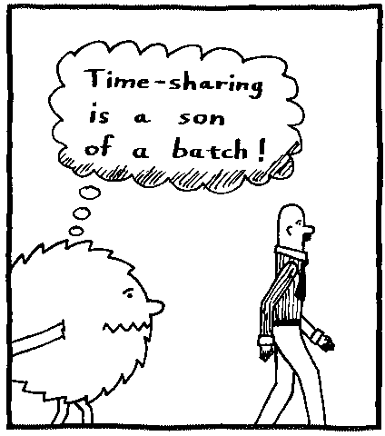
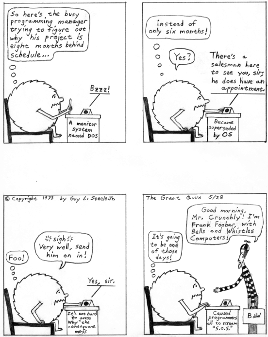
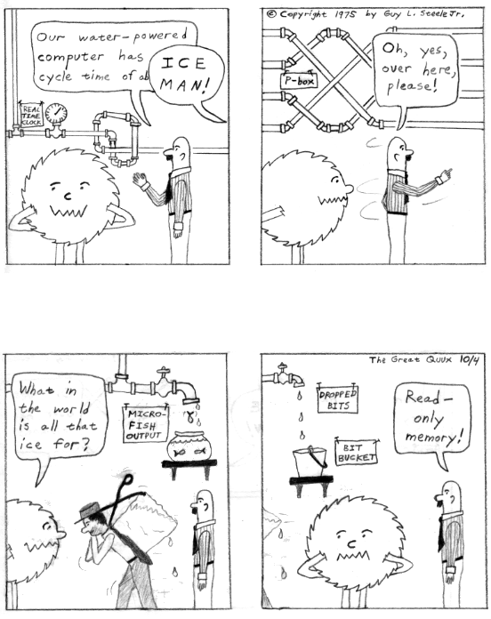
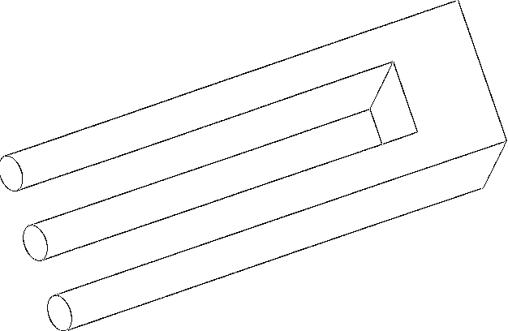
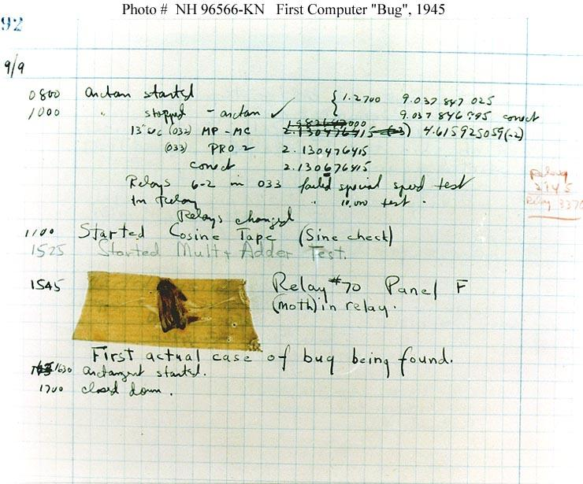
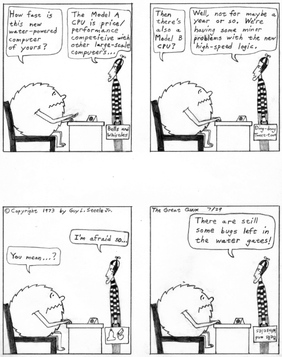

============
B
============

B1FF
======

**B1FF**: /bif/, BIFF, n.

The most famous `pseudo <../P/pseudo.html>`__, and the prototypical
`newbie <../N/newbie.html>`__. Articles from B1FF feature all
uppercase letters sprinkled liberally with bangs, typos, ‘cute’
misspellings (EVRY BUDY LUVS GOOD OLD BIFF CUZ KØØL DOOD AN HE RITES
REEL AWESUM THINGZ IN CAPITULL LETTRS LIKE THIS!!!), use (and often
misuse) of fragments of `talk mode <../T/talk-mode.html>`__
abbreviations, a long `sig block <../S/sig-block.html>`__ (sometimes
even a `doubled sig <../D/doubled-sig.html>`__), and unbounded
naivete. B1FF posts articles using his elder brother's VIC-20. B1FF's
location is a mystery, as his articles appear to come from a variety of
sites. However, BITNET seems to be the most frequent origin. The theory
that B1FF is a denizen of BITNET is supported by B1FF's (unfortunately
invalid) electronic mail address: B1FF@BIT.NET.

[1993: Now It Can Be Told! My spies inform me that B1FF was originally
created by Joe Talmadge <jat@cup.hp.com>, also the author of the
infamous and much-plagiarized “Flamer's Bible”. The BIFF filter he wrote
was later passed to Richard Sexton, who posted BIFFisms much more
widely. Versions have since been posted for the amusement of the net at
large. See also `Jeff K. <../J/Jeff-K-.html>`__ —ESR]

.. index:: Jeff K., Richard Sexton, Joe Talmadge, "Flamer's Bible"

B5
=========

**B5**: //

[common] Abbreviation for “Babylon 5”, a science-fiction TV series as
revered among hackers as was the original Star Trek.

.. index:: Babylon 5, Star Trek, TV,

backbone cabal
==============

**backbone cabal**: n.

A group of large-site administrators who pushed through the `Great
Renaming <../G/Great-Renaming.html>`__ and reined in the chaos of
`Usenet <../U/Usenet.html>`__ during most of the 1980s. During most of
its lifetime, the Cabal (as it was sometimes capitalized) steadfastly
denied its own existence; it was almost obligatory for anyone privy to
their secrets to respond “There is no Cabal” whenever the existence or
activities of the group were speculated on in public.

The result of this policy was an attractive aura of mystery. Even a
decade after the cabal `mailing list <../M/mailing-list.html>`__
disbanded in late 1988 following a bitter internal catfight, many people
believed (or claimed to believe) that it had not actually disbanded but
only gone deeper underground with its power intact.

This belief became a model for various paranoid theories about various
Cabals with dark nefarious objectives beginning with taking over the
Usenet or Internet. These paranoias were later satirized in ways that
took on a life of their own. See `Eric
Conspiracy <../E/Eric-Conspiracy.html>`__ for one example. Part of the
background for this kind of humor is that many hackers cultivate a
fondness for conspiracy theory considered as a kind of surrealist art;
see the bibliography entry om *Illuminatus!* for the novel that launched
this trend.

See `NANA <../N/NANA.html>`__ for the subsequent history of “the
Cabal”.

backbone site
===============

**backbone site**: n.,obs.

Formerly, a key Usenet and email site, one that processes a large amount
of third-party traffic, especially if it is the home site of any of the
regional coordinators for the Usenet maps. Notable backbone sites as of
early 1993, when this sense of the term was beginning to pass out of
general use due to wide availability of cheap Internet connections,
included "uunet" and the mail machines at Rutgers University, UC
Berkeley, `DEC <../D/DEC.html>`__'s Western Research Laboratories,
Ohio State University, and the University of Texas. Compare `leaf
site <../L/leaf-site.html>`__.

[2001 update: This term has passed into history. The UUCP network world
that gave it meaning is gone; everyone is on the Internet now and
network traffic is distributed in very different patterns. Today one
might see references to a “backbone router” instead —ESR]

back door
==============

**back door**: n.

[common] A hole in the security of a system deliberately left in place
by designers or maintainers. The motivation for such holes is not always
sinister; some operating systems, for example, come out of the box with
privileged accounts intended for use by field service technicians or the
vendor's maintenance programmers. Syn. `trap
door <../T/trap-door.html>`__; may also be called a wormhole. See also
`iron box <../I/iron-box.html>`__, `cracker <../C/cracker.html>`__,
`worm <../W/worm.html>`__, `logic bomb <../L/logic-bomb.html>`__.

Historically, back doors have often lurked in systems longer than anyone
expected or planned, and a few have become widely known. Ken Thompson's
1983 Turing Award lecture to the ACM admitted the existence of a back
door in early Unix versions that may have qualified as the most
fiendishly clever security hack of all time. In this scheme, the C
compiler contained code that would recognize when the login command was
being recompiled and insert some code recognizing a password chosen by
Thompson, giving him entry to the system whether or not an account had
been created for him.

Normally such a back door could be removed by removing it from the
source code for the compiler and recompiling the compiler. But to
recompile the compiler, you have to *use* the compiler — so Thompson
also arranged that the compiler would *recognize when it was compiling a
version of itself*, and insert into the recompiled compiler the code to
insert into the recompiled login the code to allow Thompson entry — and,
of course, the code to recognize itself and do the whole thing again the
next time around! And having done this once, he was then able to
recompile the compiler from the original sources; the hack perpetuated
itself invisibly, leaving the back door in place and active but with no
trace in the sources.

The Turing lecture that reported this truly moby hack was later
published as “Reflections on Trusting Trust”, *Communications of the ACM
27*, 8 (August 1984), pp. 761--763 (text available at
`http://www.acm.org/classics/ <http://www.acm.org/classics/sep95/>`__).
Ken Thompson has since confirmed that this hack was implemented and that
the Trojan Horse code did appear in the login binary of a Unix Support
group machine. Ken says the crocked compiler was never distributed. Your
editor has heard two separate reports that suggest that the crocked
login did make it out of Bell Labs, notably to BBN, and that it enabled
at least one late-night login across the network by someone using the
login name “kt”.

backgammon
============

**backgammon**

See `bignum <bignum.html>`__ (sense 3), `moby <../M/moby.html>`__
(sense 4), and `pseudoprime <../P/pseudoprime.html>`__.

background
===========

**background**: n.,adj.,vt.

[common] To do a task in background is to do it whenever
`foreground <../F/foreground.html>`__ matters are not claiming your
undivided attention, and to background something means to relegate it to
a lower priority. “For now, we'll just print a list of nodes and links;
I'm working on the graph-printing problem in background.” Note that this
implies ongoing activity but at a reduced level or in spare time, in
contrast to mainstream ‘back burner’ (which connotes benign neglect
until some future resumption of activity). Some people prefer to use the
term for processing that they have queued up for their unconscious minds
(a tack that one can often fruitfully take upon encountering an obstacle
in creative work). Compare `amp off <../A/amp-off.html>`__,
`slopsucker <../S/slopsucker.html>`__.

Technically, a task running in background is detached from the terminal
where it was started (and often running at a lower priority); oppose
`foreground <../F/foreground.html>`__. Nowadays this term is primarily
associated with `Unix <../U/Unix.html>`__, but it appears to have been
first used in this sense on OS/360.

backreference
===============

**backreference**: n.

1. In a regular expression or pattern match, the text which was matched
within grouping parentheses

2. The part of the pattern which refers back to the matched text.

3. By extension, anything which refers back to something which has been
seen or discussed before. “When you said ‘she’ just now, who were you
backreferencing?”

backronym
==========

**backronym**: n.

[portmanteau of back + acronym] A word interpreted as an acronym that
was not originally so intended. This is a special case of what linguists
call back formation. Examples are given under `recursive
acronym <../R/recursive-acronym.html>`__ (Cygnus),
`Acme <../A/Acme.html>`__, and `mung <../M/mung.html>`__.
Discovering backronyms is a common form of wordplay among hackers.
Compare `retcon <../R/retcon.html>`__.

backward combatability
========================

**backward combatability**: /bak´w@rd k@m·bat'@·bil'@·tee/, n.

[CMU, Tektronix: from backward compatibility] A property of hardware or
software revisions in which previous protocols, formats, layouts, etc.
are irrevocably discarded in favor of ‘new and improved’ protocols,
formats, and layouts, leaving the previous ones not merely deprecated
but actively defeated. (Too often, the old and new versions cannot
definitively be distinguished, such that lingering instances of the
previous ones yield crashes or other infelicitous effects, as opposed to
a simple “version mismatch” message.) A backwards compatible change, on
the other hand, allows old versions to coexist without crashes or error
messages, but too many major changes incorporating elaborate backwards
compatibility processing can lead to extreme `software
bloat <../S/software-bloat.html>`__. See also `flag
day <../F/flag-day.html>`__.

Bad and Wrong
===============

**Bad and Wrong**: adj.

[Durham, UK] Said of something that is both badly designed and wrongly
executed. This common term is the prototype of, and is used by contrast
with, three less common terms — Bad and Right (a kludge, something ugly
but functional); Good and Wrong (an overblown GUI or other attractive
nuisance); and (rare praise) Good and Right. These terms entered common
use at Durham c.1994 and may have been imported from elsewhere; they are
also in use at Oxford, and the emphatic form “Evil and Bad and Wrong”
(abbreviated EBW) is reported from there. There are standard
abbreviations: they start with B&R, a typo for “Bad and Wrong”.
Consequently, B&W is actually “Bad and Right”, G&R = “Good and Wrong”,
and G&W = “Good and Right”. Compare `evil and
rude <../E/evil-and-rude.html>`__, `Good
Thing <../G/Good-Thing.html>`__, `Bad Thing <Bad-Thing.html>`__.

BAD
=====

**BAD**: /B·A·D/, adj.

[IBM: acronym, “Broken As Designed”] Said of a program that is
`bogus <bogus.html>`__ because of bad design and misfeatures rather
than because of bugginess. See `working as
designed <../W/working-as-designed.html>`__.

Bad Thing
===========

**Bad Thing**: n.

[very common; always pronounced as if capitalized. Orig. fr. the 1930
Sellar & Yeatman parody of British history *1066 And All That*, but
well-established among hackers in the U.S. as well.] Something that
can't possibly result in improvement of the subject. This term is always
capitalized, as in “Replacing all of the DSL links with bicycle couriers
would be a Bad Thing”. Oppose `Good Thing <../G/Good-Thing.html>`__.
British correspondents confirm that `Bad Thing <Bad-Thing.html>`__ and
`Good Thing <../G/Good-Thing.html>`__ (and prob. therefore `Right
Thing <../R/Right-Thing.html>`__ and `Wrong
Thing <../W/Wrong-Thing.html>`__) come from the book referenced in the
etymology, which discusses rulers who were Good Kings but Bad Things.
This has apparently created a mainstream idiom on the British side of
the pond. It is very common among American hackers, but not in
mainstream usage in the U.S. Compare `Bad and
Wrong <Bad-and-Wrong.html>`__.

bagbiter
=========

**bagbiter**: /bag´bi:t·@r/, n.

1. Something, such as a program or a computer, that fails to work, or
works in a remarkably clumsy manner. “This text editor won't let me make
a file with a line longer than 80 characters! What a bagbiter!”

2. A person who has caused you some trouble, inadvertently or otherwise,
typically by failing to program the computer properly. Synonyms:
`loser <../L/loser.html>`__, `cretin <../C/cretin.html>`__,
`chomper <../C/chomper.html>`__.

3. bite the bag vi. To fail in some manner. “The computer keeps crashing
every five minutes.” “Yes, the disk controller is really biting the
bag.”

The original loading of these terms was almost undoubtedly obscene,
possibly referring to a douche bag or the scrotum (we have reports of
“Bite the douche bag!” being used as a taunt at MIT 1970-1976, and we
have another report that “Bite the bag!” was in common use at least as
early as 1965), but in their current usage they have become almost
completely sanitized.

bagbiting
===========

**bagbiting**: adj.

[MIT; now rare] Having the quality of a `bagbiter <bagbiter.html>`__.
“This bagbiting system won't let me compute the factorial of a negative
number.” Compare `losing <../L/losing.html>`__,
`cretinous <../C/cretinous.html>`__,
`bletcherous <bletcherous.html>`__, barfucious (under
`barfulous <barfulous.html>`__) and chomping (under
`chomp <../C/chomp.html>`__).

baggy pantsing
===================

**baggy pantsing**: v.

[Georgia Tech] A “baggy pantsing” is used to reprimand hackers who
incautiously leave their terminals unlocked. The affected user will come
back to find a post from them on internal newsgroups discussing exactly
how baggy their pants are, an accepted stand-in for “unattentive user
who left their work unprotected in the clusters”. A properly-done baggy
pantsing is highly mocking and humorous. It is considered bad form to
post a baggy pantsing to off-campus newsgroups or the more technical,
serious groups. A particularly nice baggy pantsing may be “claimed” by
immediately quoting the message in full, followed by your `sig
block <../S/sig-block.html>`__; this has the added benefit of keeping
the embarassed victim from being able to delete the post. Interesting
baggy-pantsings have been done involving adding commands to login
scripts to repost the message every time the unlucky user logs in; Unix
boxes on the residential network, when cracked, oftentimes have their
homepages replaced (after being politely backed-up to another file) with
a baggy-pants message; .plan files are also occasionally targeted.
Usage: “Prof. Greenlee fell asleep in the Solaris cluster again; we
baggy-pantsed him to "git.cc.class.2430.flame".” Compare
`derf <../D/derf.html>`__.

bag on the side
===================

**bag on the side**: n.

[prob. originally related to a colostomy bag] An extension to an
established hack that is supposed to add some functionality to the
original. Usually derogatory, implying that the original was being
overextended and should have been thrown away, and the new product is
ugly, inelegant, or bloated. Also v. phrase, “to hang a bag on the side
[of]”. “C++? That's just a bag on the side of C ....” “They want me to
hang a bag on the side of the accounting system.”

balloonian variable
====================

**balloonian variable**: n.

[Commodore users; perh. a deliberate phonetic mangling of boolean
variable?] Any variable that doesn't actually hold or control state, but
must nevertheless be declared, checked, or set. A typical balloonian
variable started out as a flag attached to some environment feature that
either became obsolete or was planned but never implemented.
Compatibility concerns (or politics attached to same) may require that
such a flag be treated as though it were `live <../L/live.html>`__.

bamf
==========

**bamf**: /bamf/

1. [from X-Men comics; originally “bampf”] interj. Notional sound made
by a person or object teleporting in or out of the hearer's vicinity.
Often used in `virtual reality <../V/virtual-reality.html>`__ (esp.
`MUD <../M/MUD.html>`__) electronic `fora <../F/fora.html>`__ when a
character wishes to make a dramatic entrance or exit.

2. The sound of magical transformation, used in virtual reality
`fora <../F/fora.html>`__ like MUDs.

3. In MUD circles, “bamf” is also used to refer to the act by which a
MUD server sends a special notification to the MUD client to switch its
connection to another server (“I'll set up the old site to just bamf
people over to our new location.”).

4. Used by MUDders on occasion in a more general sense related to sense
3, to refer to directing someone to another location or resource (“A
user was asking about some technobabble so I bamfed them to
`http://www.catb.org/~esr/jargon/ <http://www.catb.org/~esr/jargon/>`__\ ”.)

banana problem
=========================

**banana problem**: n.

[from the story of the little girl who said “I know how to spell
‘banana’, but I don't know when to stop”]. Not knowing where or when to
bring a production to a close (compare `fencepost
error <../F/fencepost-error.html>`__). One may say there is a banana
problem of an algorithm with poorly defined or incorrect termination
conditions, or in discussing the evolution of a design that may be
succumbing to featuritis (see also `creeping
elegance <../C/creeping-elegance.html>`__, `creeping
featuritis <../C/creeping-featuritis.html>`__). See item 176 under
`HAKMEM <../H/HAKMEM.html>`__, which describes a banana problem in a
`Dissociated Press <../D/Dissociated-Press.html>`__ implementation.
Also, see `one-banana problem <../O/one-banana-problem.html>`__ for a
superficially similar but unrelated usage.

bandwidth
==============

**bandwidth**: n.

1. [common] Used by hackers (in a generalization of its technical
meaning) as the volume of information per unit time that a computer,
person, or transmission medium can handle. “Those are amazing graphics,
but I missed some of the detail — not enough bandwidth, I guess.”
Compare `low-bandwidth <../L/low-bandwidth.html>`__; see also
`brainwidth <brainwidth.html>`__. This generalized usage began to go
mainstream after the Internet population explosion of 1993-1994.

2. Attention span.

3. On `Usenet <../U/Usenet.html>`__, a measure of network capacity
that is often wasted by people complaining about how items posted by
others are a waste of bandwidth.

bang
===============

**bang**

1. n. Common spoken name for "!" (ASCII 0100001), especially when used
in pronouncing a `bang path <bang-path.html>`__ in spoken hackish. In
`elder days <../E/elder-days.html>`__ this was considered a CMUish
usage, with MIT and Stanford hackers preferring
`excl <../E/excl.html>`__ or `shriek <../S/shriek.html>`__; but the
spread of Unix has carried ‘bang’ with it (esp. via the term `bang
path <bang-path.html>`__) and it is now certainly the most common
spoken name for "!". Note that it is used exclusively for non-emphatic
written "!"; one would not say “Congratulations bang” (except possibly
for humorous purposes), but if one wanted to specify the exact
characters “foo!” one would speak “Eff oh oh bang”. See
`shriek <../S/shriek.html>`__, `ASCII <../A/ASCII.html>`__.

2. interj. An exclamation signifying roughly “I have achieved
enlightenment!”, or “The dynamite has cleared out my brain!” Often used
to acknowledge that one has perpetrated a
`thinko <../T/thinko.html>`__ immediately after one has been called on
it.

bang on
============

**bang on**: vt.

To stress-test a piece of hardware or software: “I banged on the new
version of the simulator all day yesterday and it didn't crash once. I
guess it is ready for release.” The term `pound
on <../P/pound-on.html>`__ is synonymous.

bang path
==============

**bang path**: n.

[now historical] An old-style UUCP electronic-mail address specifying
hops to get from some assumed-reachable location to the addressee, so
called because each `hop <../H/hop.html>`__ is signified by a
`bang <bang.html>`__ sign. Thus, for example, the path
"...!bigsite!foovax!barbox!me" directs people to route their mail to
machine "bigsite" (presumably a well-known location accessible to
everybody) and from there through the machine "foovax" to the account
of user "me" on "barbox".

In the bad old days of not so long ago, before autorouting mailers and
Internet became commonplace, people often published compound bang
addresses using the { } convention (see `glob <../G/glob.html>`__) to
give paths from *several* big machines, in the hopes that one's
correspondent might be able to get mail to one of them reliably
(example: "...!{seismo, ut-sally,    ihnp4"!rice!beta!gamma!me}). Bang
paths of 8 to 10 hops were not uncommon. Late-night dial-up UUCP links
would cause week-long transmission times. Bang paths were often selected
by both transmission time and reliability, as messages would not
infrequently get lost. See `the network <../T/the-network.html>`__ and
`sitename <../S/sitename.html>`__.

banner ad
===========

**banner ad**: n.

Any of the annoying graphical advertisements that span the tops of way
too many Web pages.

banner
==========

**banner**: n.

1. A top-centered graphic on a web page. Esp. used in `banner
ad <banner-ad.html>`__.

2. On interactive software, a first screen containing a logo and/or
author credits and/or a copyright notice. Similar to `splash
screen <../S/splash-screen.html>`__.

3. The title page added to printouts by most print spoolers (see
`spool <../S/spool.html>`__). Typically includes user or account ID
information in very large character-graphics capitals. Also called a
burst page, because it indicates where to burst (tear apart) fanfold
paper to separate one user's printout from the next.

4. A similar printout generated (typically on multiple pages of fan-fold
paper) from user-specified text, e.g., by a program such as Unix's
**banner({1,6**)}.

banner site
==============

**banner site**: n.

[warez d00dz] An FTP site storing pirated files where one must first
click on several banners and/or subscribe to various ‘free’ services,
usually generating some form of revenues for the site owner, to be able
to access the site. More often than not, the username/password painfully
obtained by clicking on banners and subscribing to bogus services or
mailing lists turns out to be non-working or gives access to a site that
always responds busy. See `ratio site <../R/ratio-site.html>`__,
`leech mode <../L/leech-mode.html>`__.

bare metal
=============

**bare metal**: n.

1. [common] New computer hardware, unadorned with such snares and
delusions as an `operating system <../O/operating-system.html>`__, an
`HLL <../H/HLL.html>`__, or even assembler. Commonly used in the
phrase programming on the bare metal, which refers to the arduous work
of `bit bashing <bit-bashing.html>`__ needed to create these basic
tools for a new machine. Real bare-metal programming involves things
like building boot proms and BIOS chips, implementing basic monitors
used to test device drivers, and writing the assemblers that will be
used to write the compiler back ends that will give the new machine a
real development environment.

2. “Programming on the bare metal” is also used to describe a style of
`hand-hacking <../H/hand-hacking.html>`__ that relies on bit-level
peculiarities of a particular hardware design, esp. tricks for speed and
space optimization that rely on crocks such as overlapping instructions
(or, as in the famous case described in `The Story of
Mel' <../story-of-mel.html>`__ (in Appendix A), interleaving of opcodes
on a magnetic drum to minimize fetch delays due to the device's
rotational latency). This sort of thing has become rare as the relative
costs of programming time and machine resources have changed, but is
still found in heavily constrained environments such as industrial
embedded systems. See `Real Programmer <../R/Real-Programmer.html>`__.

barf
============

**barf**: /barf/, n.,v.

[common; from mainstream slang meaning ‘vomit’]

1. interj. Term of disgust. This is the closest hackish equivalent of
the Valspeak “gag me with a spoon”. (Like, euwww!) See
`bletch <bletch.html>`__.

2. vi. To say “Barf!” or emit some similar expression of disgust. “I
showed him my latest hack and he barfed” means only that he complained
about it, not that he literally vomited.

3. vi. To fail to work because of unacceptable input, perhaps with a
suitable error message, perhaps not. Examples: “The division operation
barfs if you try to divide by 0.” (That is, the division operation
checks for an attempt to divide by zero, and if one is encountered it
causes the operation to fail in some unspecified, but generally obvious,
manner.) “The text editor barfs if you try to read in a new file before
writing out the old one.”

See `choke <../C/choke.html>`__. In Commonwealth Hackish, barf is
generally replaced by ‘puke’ or ‘vom’. `barf <barf.html>`__ is
sometimes also used as a `metasyntactic
variable <../M/metasyntactic-variable.html>`__, like
`foo <../F/foo.html>`__ or `bar <bar.html>`__.

barfmail
===========

**barfmail**: n.

Multiple `bounce message <bounce-message.html>`__\ s accumulating to
the level of serious annoyance, or worse. The sort of thing that happens
when an inter-network mail gateway goes down or wonky.

barfulation
=============

**barfulation**: /bar\`fyoo·lay´sh@n/, interj.

Variation of `barf <barf.html>`__ used around the Stanford area. An
exclamation, expressing disgust. On seeing some particularly bad code
one might exclaim, “Barfulation! Who wrote this, Quux?”

barfulous
==========

**barfulous**: /bar´fyoo·l@s/, adj.

(alt.: barfucious, /bar-fyoo-sh@s/) Said of something that would make
anyone barf, if only for esthetic reasons.

bar
==============

**bar**: /bar/, n.

1. [very common] The second `metasyntactic
variable <../M/metasyntactic-variable.html>`__, after
`foo <../F/foo.html>`__ and before `baz <baz.html>`__. “Suppose we
have two functions: FOO and BAR. FOO calls BAR....”

2. Often appended to `foo <../F/foo.html>`__ to produce
`foobar <../F/foobar.html>`__.

barney
=========

**barney**: n.

In Commonwealth hackish, barney is to `fred <../F/fred.html>`__ (sense
#1) as `bar <bar.html>`__ is to `foo <../F/foo.html>`__. That is,
people who commonly use fred as their first metasyntactic variable will
often use barney second. The reference is, of course, to Fred Flintstone
and Barney Rubble in the Flintstones cartoons.

barn
==========

**barn**: n.

[uncommon; prob. from the nuclear military] An unexpectedly large
quantity of something: a unit of measurement. “Why is /var/adm taking up
so much space?” “The logs have grown to several barns.” The source of
this is clear: when physicists were first studying nuclear interactions,
the probability was thought to be proportional to the cross-sectional
area of the nucleus (this probability is still called the
cross-section). Upon experimenting, they discovered the interactions
were far more probable than expected; the nuclei were “as big as a
barn”. The units for cross-sections were christened Barns, (10:sup:`-24`
cm\ :sup:`2`) and the book containing cross-sections has a picture of a
barn on the cover.

baroque
========

**baroque**: adj.

[common] Feature-encrusted; complex; gaudy; verging on excessive. Said
of hardware or (esp.) software designs, this has many of the
connotations of `elephantine <../E/elephantine.html>`__ or
`monstrosity <../M/monstrosity.html>`__ but is less extreme and not
pejorative in itself. In the absence of other, more negative
descriptions this term suggests that the software is trembling on the
edge of bad taste but has not quite tipped over into it. “Metafont even
has features to introduce random variations to its letterform output.
Now *that* is baroque!” See also `rococo <../R/rococo.html>`__.

BASIC
======

**BASIC**: /bay'·sic/, n.

A programming language, originally designed for Dartmouth's experimental
timesharing system in the early 1960s, which for many years was the
leading cause of brain damage in proto-hackers. Edsger W. Dijkstra
observed in *Selected Writings on Computing: A Personal Perspective*
that “It is practically impossible to teach good programming style to
students that have had prior exposure to BASIC: as potential programmers
they are mentally mutilated beyond hope of regeneration.” This is
another case (like `Pascal <../P/Pascal.html>`__) of the cascading
`lossage <../L/lossage.html>`__ that happens when a language
deliberately designed as an educational toy gets taken too seriously. A
novice can write short BASIC programs (on the order of 10-20 lines) very
easily; writing anything longer (a) is very painful, and (b) encourages
bad habits that will make it harder to use more powerful languages well.
This wouldn't be so bad if historical accidents hadn't made BASIC so
common on low-end micros in the 1980s. As it is, it probably ruined tens
of thousands of potential wizards.

[1995: Some languages called “BASIC” aren't quite this nasty any more,
having acquired Pascal- and C-like procedures and control structures and
shed their line numbers. —ESR]

BASIC stands for “Beginner's All-purpose Symbolic Instruction Code”.
Earlier versions of this entry claiming this was a later
`backronym <backronym.html>`__ were incorrect.

batbelt
=========

**batbelt**: n.

Many hackers routinely hang numerous devices such as pagers,
cell-phones, personal organizers, leatherman multitools, pocket knives,
flashlights, walkie-talkies, even miniature computers from their belts.
When many of these devices are worn at once, the hacker's belt somewhat
resembles Batman's utility belt; hence it is referred to as a batbelt.

batch
========

**batch**: adj.

1. Non-interactive. Hackers use this somewhat more loosely than the
traditional technical definitions justify; in particular, switches on a
normally interactive program that prepare it to receive non-interactive
command input are often referred to as batch mode switches. A batch file
is a series of instructions written to be handed to an interactive
program running in batch mode.

2. Performance of dreary tasks all at one sitting. “I finally sat down
in batch mode and wrote out checks for all those bills; I guess they'll
turn the electricity back on next week...”

3. batching up: Accumulation of a number of small tasks that can be
lumped together for greater efficiency. “I'm batching up those letters
to send sometime” “I'm batching up bottles to take to the recycling
center.”

(The next cartoon in the Crunchly saga is
`76-03-17:5-8 <../F.html#flush>`__. The previous one is
`76-02-14 <../W.html#washing-machine>`__.)

bathtub curve
==============

**bathtub curve**: n.

Common term for the curve (resembling an end-to-end section of one of
those claw-footed antique bathtubs) that describes the expected failure
rate of electronics with time: initially high, dropping to near 0 for
most of the system's lifetime, then rising again as it ‘tires out’. See
also `burn-in period <burn-in-period.html>`__, `infant
mortality <../I/infant-mortality.html>`__.

Batman factor
===============

**Batman factor**: n.

1. An integer number representing the number of items hanging from a
`batbelt <batbelt.html>`__. In most settings, a Batman factor of more
than 3 is not acceptable without odd stares and whispering. This
encourages the hacker in question to choose items for the batbelt
carefully to avoid awkward social situations, usually amongst
non-hackers.

2. A somewhat more vaguely defined index of contribution to sense 1.
Devices that are especially obtrusive, such as large, older model cell
phones, “Pocket” PC devices and walkie talkies are said to have a high
batman factor. Sleeker devices such as a later-model Palm or StarTac
phone are prized for their low batman factor and lessened obtrusiveness
and weight.

baud
============

**baud**: /bawd/, n.

[simplified from its technical meaning] n. Bits per second. Hence
kilobaud or Kbaud, thousands of bits per second. The technical meaning
is level transitions per second; this coincides with bps only for
two-level modulation with no framing or stop bits. Most hackers are
aware of these nuances but blithely ignore them.

Historical note: baud was originally a unit of telegraph signalling
speed, set at one pulse per second. It was proposed at the November,
1926 conference of the Comité Consultatif International Des
Communications Télégraphiques as an improvement on the then standard
practice of referring to line speeds in terms of words per minute, and
named for Jean Maurice Emile Baudot (1845-1903), a French engineer who
did a lot of pioneering work in early teleprinters.

bazaar
=========

**bazaar**: n.,adj.

In 1997, after meditating on the success of
`Linux <../L/Linux.html>`__ for three years, the Jargon File's own
editor ESR wrote an analytical paper on hacker culture and development
models titled `The Cathedral and the
Bazaar <http://www.catb.org/~esr/writings/cathedral-bazaar/>`__. The
main argument of the paper was that `Brooks's
Law <Brookss-Law.html>`__ is not the whole story; given the right
social machinery, debugging can be efficiently parallelized across large
numbers of programmers. The title metaphor caught on (see also
`cathedral <../C/cathedral.html>`__), and the style of development
typical in the Linux community is now often referred to as the bazaar
mode. Its characteristics include releasing code early and often, and
actively seeking the largest possible pool of peer reviewers. After
1998, the evident success of this way of doing things became one of the
strongest arguments for `open source <../O/open-source.html>`__.

baz
============

**baz**: /baz/, n.

1. [common] The third `metasyntactic
variable <../M/metasyntactic-variable.html>`__ “Suppose we have three
functions: FOO, BAR, and BAZ. FOO calls BAR, which calls BAZ....” (See
also `fum <../F/fum.html>`__)

2. interj. A term of mild annoyance. In this usage the term is often
drawn out for 2 or 3 seconds, producing an effect not unlike the
bleating of a sheep; /baaaaaaz/.

3. Occasionally appended to `foo <../F/foo.html>`__ to produce
‘foobaz’.

Earlier versions of this lexicon derived baz as a Stanford corruption of
`bar <bar.html>`__. However, Pete Samson (compiler of the
`TMRC <../T/TMRC.html>`__ lexicon) reports it was already current when
he joined TMRC in 1958. He says “It came from *Pogo*. Albert the
Alligator, when vexed or outraged, would shout ‘Bazz Fazz!’ or
‘Rowrbazzle!’ The club layout was said to model the (mythical) New
England counties of Rowrfolk and Bassex (Rowrbazzle mingled with
(Norfolk/Suffolk/Middlesex/Essex).”

bboard
============

**bboard**: /bee´bord/, n.

[contraction of ‘bulletin board’]

1. Any electronic bulletin board; esp. used of `BBS <BBS.html>`__
systems running on personal micros, less frequently of a Usenet
`newsgroup <../N/newsgroup.html>`__ (in fact, use of this term for a
newsgroup generally marks one either as a
`newbie <../N/newbie.html>`__ fresh in from the BBS world or as a real
old-timer predating Usenet).

2. At CMU and other colleges with similar facilities, refers to
campus-wide electronic bulletin boards.

3. The term physical bboard is sometimes used to refer to an
old-fashioned, non-electronic cork-and-thumbtack memo board. At CMU, it
refers to a particular one outside the CS Lounge.

In either of senses 1 or 2, the term is usually prefixed by the name of
the intended board (‘the Moonlight Casino bboard’ or ‘market bboard’);
however, if the context is clear, the better-read bboards may be
referred to by name alone, as in (at CMU) “Don't post for-sale ads on
general”.

BBS
=============

**BBS**: /B·B·S/, n.

[common; abbreviation, “Bulletin Board System”] An electronic bulletin
board system; that is, a message database where people can log in and
leave broadcast messages for others grouped (typically) into `topic
group <../T/topic-group.html>`__\ s. The term was especially applied to
the thousands of local BBS systems that operated during the pre-Internet
microcomputer era of roughly 1980 to 1995, typically run by amateurs for
fun out of their homes on MS-DOS boxes with a single modem line each.
Fans of Usenet and Internet or the big commercial timesharing bboards
such as CompuServe and GEnie tended to consider local BBSes the low-rent
district of the hacker culture, but they served a valuable function by
knitting together lots of hackers and users in the personal-micro world
who would otherwise have been unable to exchange code at all.
Post-Internet, BBSs are likely to be local newsgroups on an ISP;
efficiency has increased but a certain flavor has been lost. See also
`bboard <bboard.html>`__.

BCPL
==============

**BCPL**: //, n.

[abbreviation, “Basic Combined Programming Language”) A programming
language developed by Martin Richards in Cambridge in 1967. It is
remarkable for its rich syntax, small size of compiler (it can be run in
16k) and extreme portability. It reached break-even point at a very
early stage, and was the language in which the original `hello
world <../H/hello-world.html>`__ program was written. It has been
ported to so many different systems that its creator confesses to having
lost count. It has only one data type (a machine word) which can be used
as an integer, a character, a floating point number, a pointer, or
almost anything else, depending on context. BCPL was a precursor of C,
which inherited some of its features.

BDFL
=========

**BDFL**

[Python; common] Benevolent Dictator For Life.
`Guido <../G/Guido.html>`__, considered in his role as the project
leader of `Python <../P/Python.html>`__. People who are feeling
temporarily cheesed off by one of his decisions sometimes leave off the
B. The mental image that goes with this, of a cigar-chomping caudillo in
gold braid and sunglasses, is extremely funny to anyone who has ever met
Guido in person.

beam
============

**beam**: vt.

[from Star Trek Classic's “Beam me up, Scotty!”]

1. To transfer `softcopy <../S/softcopy.html>`__ of a file
electronically; most often in combining forms such as beam me a copy or
beam that over to his site.

2. Palm Pilot users very commonly use this term for the act of
exchanging bits via the infrared links on their machines (this term
seems to have originated with the ill-fated Newton Message Pad). Compare
`blast <blast.html>`__, `snarf <../S/snarf.html>`__,
`BLT <BLT.html>`__.

beanie key
===========

**beanie key**: n.

[Mac users] See `command key <../C/command-key.html>`__.

beep
============

**beep**: n.,v.

Syn. `feep <../F/feep.html>`__. This term is techspeak under
MS-DOS/Windows and OS/2, and seems to be generally preferred among micro
hobbyists.

Befunge
==========

**Befunge**: n.

A worthy companion to `INTERCAL <../I/INTERCAL.html>`__; a computer
language family which escapes the quotidian limitation of linear control
flow and embraces program counters flying through multiple dimensions
with exotic topologies. The Befunge home page is at
`http://www.catseye.mb.ca/esoteric/befunge/ <http://www.catseye.mb.ca/esoteric/befunge/>`__.

beige toaster
================

**beige toaster**: n.

[obs.] An original Macintosh in the boxy beige case. See
`toaster <../T/toaster.html>`__; compare
`Macintrash <../M/Macintrash.html>`__,
`maggotbox <../M/maggotbox.html>`__.

bells and whistles
=====================

**bells and whistles**: n.

[common] Features added to a program or system to make it more
`flavorful <../F/flavorful.html>`__ from a hacker's point of view,
without necessarily adding to its utility for its primary function.
Distinguished from `chrome <../C/chrome.html>`__, which is intended to
attract users. “Now that we've got the basic program working, let's go
back and add some bells and whistles.” No one seems to know what
distinguishes a bell from a whistle. The recognized emphatic form is
“bells, whistles, and gongs”.

It used to be thought that this term derived from the toyboxes on
theater organs. However, the “and gongs” strongly suggests a different
origin, at sea. Before powered horns, ships routinely used bells,
whistles, and gongs to signal each other over longer distances than
voice can carry.

Sometimes ‘trouble’ is spelled `bells and
whistles <bells-and-whistles.html>`__...

(The next cartoon in the Crunchly saga is
`73-06-04 <../G/glitch.html#crunchly73-06-04>`__. The previous one is
`73-05-28 <bells-and-whistles.html#crunchly73-05-28>`__.)

bells whistles and gongs
==========================

**bells whistles and gongs**: n.

A standard elaborated form of `bells and
whistles <bells-and-whistles.html>`__; typically said with a pronounced
and ironic accent on the ‘gongs’.

benchmark
==============

**benchmark**: n.

[techspeak] An inaccurate measure of computer performance. “In the
computer industry, there are three kinds of lies: lies, damn lies, and
benchmarks.” Well-known ones include Whetstone, Dhrystone, Rhealstone
(see `h <../H/h.html>`__), the Gabriel LISP benchmarks, the SPECmark
suite, and LINPACK. See also `machoflops <../M/machoflops.html>`__,
`MIPS <../M/MIPS.html>`__, `smoke and
mirrors <../S/smoke-and-mirrors.html>`__.

Berkeley Quality Software
============================

**Berkeley Quality Software**: adj.

(often abbreviated “BQS”) Term used in a pejorative sense to refer to
software that was apparently created by rather spaced-out hackers late
at night to solve some unique problem. It usually has nonexistent,
incomplete, or incorrect documentation, has been tested on at least two
examples, and core dumps when anyone else attempts to use it. This term
was frequently applied to early versions of the dbx(1) debugger. See
also `Berzerkeley <Berzerkeley.html>`__.

Note to British and Commonwealth readers: that's /berk´lee/, not
/bark´lee/ as in British Received Pronunciation.

Berzerkeley
================

**Berzerkeley**: /b@r·zer´klee/, n.

[from ‘berserk’, via the name of a now-deceased record label; poss.
originated by famed columnist Herb Caen] Humorous distortion of
“Berkeley” used esp. to refer to the practices or products of the
`BSD <BSD.html>`__ Unix hackers. See `software
bloat <../S/software-bloat.html>`__, `Berkeley Quality
Software <Berkeley-Quality-Software.html>`__.

Mainstream use of this term in reference to the cultural and political
peculiarities of UC Berkeley as a whole has been reported from as far
back as the 1960s.

beta
==================

**beta**: /bay´t@/, /be´t@/, /bee´t@/, n.

1. Mostly working, but still under test; usu. used with “in”: in beta.
In the `Real World <../R/Real-World.html>`__, hardware or software
systems often go through two stages of release testing: Alpha (in-house)
and Beta (out-house?). Beta releases are generally made to a group of
lucky (or unlucky) trusted customers.

2. Anything that is new and experimental. “His girlfriend is in beta”
means that he is still testing for compatibility and reserving judgment.

3. Flaky; dubious; suspect (since beta software is notoriously buggy).

Historical note: More formally, to beta-test is to test a pre-release
(potentially unreliable) version of a piece of software by making it
available to selected (or self-selected) customers and users. This term
derives from early 1960s terminology for product cycle checkpoints,
first used at IBM but later standard throughout the industry. Alpha Test
was the unit, module, or component test phase; Beta Test was initial
system test. These themselves came from earlier A- and B-tests for
hardware. The A-test was a feasibility and manufacturability evaluation
done before any commitment to design and development. The B-test was a
demonstration that the engineering model functioned as specified. The
C-test (corresponding to today's beta) was the B-test performed on early
samples of the production design, and the D test was the C test repeated
after the model had been in production a while.

BFI
=============

**BFI**: /B·F·I/, n.

See `brute force and ignorance <brute-force-and-ignorance.html>`__.
Also encountered in the variants BFMI, “brute force and *massive*
ignorance” and BFBI “brute force and bloody ignorance”. In some parts of
the U.S. this abbreviation was probably reinforced by a company called
Browning-Ferris Industries in the waste-management business; a large BFI
logo in white-on-blue could be seen on the sides of garbage trucks.

bible
==================

**bible**: n.

1. One of a small number of fundamental source books such as
`Knuth <../K/Knuth.html>`__, `K&R <../K/K-ampersand-R.html>`__, or
the `Camel Book <../C/Camel-Book.html>`__.

2. The most detailed and authoritative reference for a particular
language, operating system, or other complex software system.

BiCapitalization
===================

**BiCapitalization**: n.

The act said to have been performed on trademarks (such as
`PostScript <../P/PostScript.html>`__, NeXT,
`NeWS <../N/NeWS.html>`__, VisiCalc, FrameMaker, TK!solver,
EasyWriter) that have been raised above the ruck of common coinage by
nonstandard capitalization. Too many
`marketroid <../M/marketroid.html>`__ types think this sort of thing
is really cute, even the 2,317th time they do it. Compare
`studlycaps <../S/studlycaps.html>`__,
`InterCaps <../I/InterCaps.html>`__.

biff
=============

**biff**: /bif/, vt.

[now rare] To notify someone of incoming mail. From the BSD utility
biff(1), which was in turn named after a friendly dog who used to chase
frisbees in the halls at UCB while 4.2BSD was in development. There was
a legend that it had a habit of barking whenever the mailman came, but
the author of **biff** says this is not true. No relation to
`B1FF <B1FF.html>`__.

big-endian
========================

**big-endian**: adj.

[common; From Swift's *Gulliver's Travels* via the famous paper *On Holy
Wars and a Plea for Peace* by Danny Cohen, USC/ISI `IEN
137 <http://khavrinen.lcs.mit.edu/wollman/ien-137.txt>`__, dated April
1, 1980]

1. Describes a computer architecture in which, within a given multi-byte
numeric representation, the most significant byte has the lowest address
(the word is stored ‘big-end-first’). Most processors, including the IBM
370 family, the `PDP-10 <../P/PDP-10.html>`__, the Motorola
microprocessor families, and most of the various RISC designs are
big-endian. Big-endian byte order is also sometimes called network
order. See `little-endian <../L/little-endian.html>`__,
`middle-endian <../M/middle-endian.html>`__, `NUXI
problem <../N/NUXI-problem.html>`__, `swab <../S/swab.html>`__.

2. An Internet address the wrong way round. Most of the world follows
the Internet standard and writes email addresses starting with the name
of the computer and ending up with the name of the country. In the U.K.:
the Joint Academic Networking Team had decided to do it the other way
round before the Internet domain standard was established. Most gateway
sites have `ad-hockery <../A/ad-hockery.html>`__ in their mailers to
handle this, but can still be confused. In particular, the address
"me@uk.ac.bris.pys.as" could be interpreted in JANET's big-endian way
as one in the U.K. (domain "uk") or in the standard little-endian way
as one in the domain "as" (American Samoa) on the opposite side of the
world.

big iron
=====================

**big iron**: n.

[common] Large, expensive, ultra-fast computers. Used generally of
`number-crunching <../N/number-crunching.html>`__ supercomputers, but
can include more conventional big commercial IBMish mainframes. Term of
approval; compare `heavy metal <../H/heavy-metal.html>`__, oppose
`dinosaur <../D/dinosaur.html>`__.

bignum
===================

**bignum**: /big´nuhm/, n.

[common; orig. from MIT MacLISP]

1. [techspeak] A multiple-precision computer representation for very
large integers.

2. More generally, any very large number. “Have you ever looked at the
United States Budget? There's bignums for you!”

3. [Stanford] In backgammon, large numbers on the dice especially a roll
of double fives or double sixes (compare `moby <../M/moby.html>`__,
sense 4). See also `El Camino Bignum <../E/El-Camino-Bignum.html>`__.

Sense 1 may require some explanation. Most computer languages provide a
kind of data called integer, but such computer integers are usually very
limited in size; usually they must be smaller than "231"
(2,147,483,648). If you want to work with numbers larger than that, you
have to use floating-point numbers, which are usually accurate to only
six or seven decimal places. Computer languages that provide bignums can
perform exact calculations on very large numbers, such as 1000! (the
factorial of 1000, which is 1000 times 999 times 998 times ... times 2
times 1). For example, this value for 1000! was computed by the MacLISP
system using bignums::

 
  40238726007709377354370243392300398571937486421071
  46325437999104299385123986290205920442084869694048
  00479988610197196058631666872994808558901323829669
  94459099742450408707375991882362772718873251977950
  59509952761208749754624970436014182780946464962910
  56393887437886487337119181045825783647849977012476
  63288983595573543251318532395846307555740911426241
  74743493475534286465766116677973966688202912073791
  43853719588249808126867838374559731746136085379534
  52422158659320192809087829730843139284440328123155
  86110369768013573042161687476096758713483120254785
  89320767169132448426236131412508780208000261683151
  02734182797770478463586817016436502415369139828126
  48102130927612448963599287051149649754199093422215
  66832572080821333186116811553615836546984046708975
  60290095053761647584772842188967964624494516076535
  34081989013854424879849599533191017233555566021394
  50399736280750137837615307127761926849034352625200
  01588853514733161170210396817592151090778801939317
  81141945452572238655414610628921879602238389714760
  88506276862967146674697562911234082439208160153780
  88989396451826324367161676217916890977991190375403
  12746222899880051954444142820121873617459926429565
  81746628302955570299024324153181617210465832036786
  90611726015878352075151628422554026517048330422614
  39742869330616908979684825901254583271682264580665
  26769958652682272807075781391858178889652208164348
  34482599326604336766017699961283186078838615027946
  59551311565520360939881806121385586003014356945272
  24206344631797460594682573103790084024432438465657
  24501440282188525247093519062092902313649327349756
  55139587205596542287497740114133469627154228458623
  77387538230483865688976461927383814900140767310446
  64025989949022222176590433990188601856652648506179
  97023561938970178600408118897299183110211712298459
  01641921068884387121855646124960798722908519296819
  37238864261483965738229112312502418664935314397013
  74285319266498753372189406942814341185201580141233
  44828015051399694290153483077644569099073152433278
  28826986460278986432113908350621709500259738986355
  42771967428222487575867657523442202075736305694988
  25087968928162753848863396909959826280956121450994
  87170124451646126037902930912088908694202851064018
  21543994571568059418727489980942547421735824010636
  77404595741785160829230135358081840096996372524230
  56085590370062427124341690900415369010593398383577
  79394109700277534720000000000000000000000000000000
  00000000000000000000000000000000000000000000000000
  00000000000000000000000000000000000000000000000000
  00000000000000000000000000000000000000000000000000
  00000000000000000000000000000000000000000000000000
  00000000000000000.

bigot
==============

**bigot**: n.

[common] A person who is religiously attached to a particular computer,
language, operating system, editor, or other tool (see `religious
issues <../R/religious-issues.html>`__). Usually found with a
specifier; thus, Cray bigot, ITS bigot, APL bigot, VMS bigot, Berkeley
bigot. Real bigots can be distinguished from mere partisans or zealots
by the fact that they refuse to learn alternatives even when the march
of time and/or technology is threatening to obsolete the favored tool.
It is truly said “You can tell a bigot, but you can't tell him much.”
Compare `weenie <../W/weenie.html>`__, `Amiga Persecution
Complex <../A/Amiga-Persecution-Complex.html>`__.

Big Red Switch
===================

**Big Red Switch**: n.

[IBM] The power switch on a computer, esp. the ‘Emergency Pull’ switch
on an IBM `mainframe <../M/mainframe.html>`__ or the power switch on
an IBM PC where it really is large and red. “This !@%$% `bitty
box <bitty-box.html>`__ is hung again; time to hit the Big Red Switch.”
Sources at IBM report that, in tune with the company's passion for
`TLA <../T/TLA.html>`__\ s, this is often abbreviated as BRS (this has
also become established on FidoNet and in the PC
`clone <../C/clone.html>`__ world). It is alleged that the emergency
pull switch on an IBM 360/91 actually fired a non-conducting bolt into
the main power feed; the BRSes on more recent mainframes physically drop
a block into place so that they can't be pushed back in. People get
fired for pulling them, especially inappropriately (see also
`molly-guard <../M/molly-guard.html>`__). Compare `power
cycle <../P/power-cycle.html>`__, `three-finger
salute <../T/three-finger-salute.html>`__; see also `scram
switch <../S/scram-switch.html>`__.

Big Room
==============

**Big Room**: n.

(Also Big Blue Room) The extremely large room with the blue ceiling and
intensely bright light (during the day) or black ceiling with lots of
tiny night-lights (during the night) found outside all computer
installations. “He can't come to the phone right now, he's somewhere out
in the Big Room.”

big win
=============

**big win**: n.

1. [common] Major success.

2. [MIT] Serendipity. “Yes, those two physicists discovered
high-temperature superconductivity in a batch of ceramic that had been
prepared incorrectly according to their experimental schedule. Small
mistake; big win!” See `win big <../W/win-big.html>`__.

BI
=============

**BI**: //

Common written abbreviation for `Breidbart
Index <Breidbart-Index.html>`__.

bikeshedding
================

**bikeshedding**

[originally BSD, now common] Technical disputes over minor, marginal
issues conducted while more serious ones are being overlooked. The
implied image is of people arguing over what color to paint the bicycle
shed while the house is not finished.

binary four
==============

**binary four**: n.

[Usenet] The finger, in the sense of *digitus impudicus*. This comes
from an analogy between binary and the hand, i.e. 1=00001=thumb,
2=00010=index finger, 3=00011=index and thumb, 4=00100. Considered
silly. Prob. from humorous derivative of
`finger <../F/finger.html>`__, sense 4.

bit bang
============

**bit bang**: n.

Transmission of data on a serial line, when accomplished by rapidly
tweaking a single output bit, in software, at the appropriate times. The
technique is a simple loop with eight OUT and SHIFT instruction pairs
for each byte. Input is more interesting. And full duplex (doing input
and output at the same time) is one way to separate the real hackers
from the `wannabee <../W/wannabee.html>`__\ s.

Bit bang was used on certain early models of Prime computers, presumably
when UARTs were too expensive, and on archaic Z80 micros with a Zilog
PIO but no SIO. In an interesting instance of the `cycle of
reincarnation <../C/cycle-of-reincarnation.html>`__, this technique
returned to use in the early 1990s on some RISC architectures because it
consumes such an infinitesimal part of the processor that it actually
makes sense not to have a UART. Compare `cycle of
reincarnation <../C/cycle-of-reincarnation.html>`__. Nowadays it's used
to describe I2C, a serial protocol for monitoring motherboard hardware.

bit bashing
===============

**bit bashing**: n.

(alt.: bit diddling or `bit twiddling <bit-twiddling.html>`__) Term
used to describe any of several kinds of low-level programming
characterized by manipulation of `bit <bit.html>`__,
`flag <../F/flag.html>`__, `nybble <../N/nybble.html>`__, and other
smaller-than-character-sized pieces of data; these include low-level
device control, encryption algorithms, checksum and error-correcting
codes, hash functions, some flavors of graphics programming (see
`bitblt <bitblt.html>`__), and assembler/compiler code generation. May
connote either tedium or a real technical challenge (more usually the
former). “The command decoding for the new tape driver looks pretty
solid but the bit-bashing for the control registers still has bugs.” See
also `mode bit <../M/mode-bit.html>`__.

bitblt
=================

**bitblt**: /bit´blit/, n.

[from `BLT <BLT.html>`__, q.v.:]

1. [common] Any of a family of closely related algorithms for moving and
copying rectangles of bits between main and display memory on a
bit-mapped device, or between two areas of either main or display memory
(the requirement to do the `Right Thing <../R/Right-Thing.html>`__ in
the case of overlapping source and destination rectangles is what makes
BitBlt tricky).

2. Synonym for `blit <blit.html>`__ or `BLT <BLT.html>`__. Both uses
are borderline techspeak.

bit bucket
================

**bit bucket**: n.

[very common]

1. The universal data sink (originally, the mythical receptacle used to
catch bits when they fall off the end of a register during a shift
instruction). Discarded, lost, or destroyed data is said to have gone to
the bit bucket. On `Unix <../U/Unix.html>`__, often used for
`/dev/null <../0/dev-null.html>`__. Sometimes amplified as the Great
Bit Bucket in the Sky.

2. The place where all lost mail and news messages eventually go. The
selection is performed according to `Finagle's
Law <../F/Finagles-Law.html>`__; important mail is much more likely to
end up in the bit bucket than junk mail, which has an almost 100%
probability of getting delivered. Routing to the bit bucket is
automatically performed by mail-transfer agents, news systems, and the
lower layers of the network.

3. The ideal location for all unwanted mail responses: “Flames about
this article to the bit bucket.” Such a request is guaranteed to
overflow one's mailbox with flames.

4. Excuse for all mail that has not been sent. “I mailed you those
figures last week; they must have landed in the bit bucket.” Compare
`black hole <black-hole.html>`__.

This term is used purely in jest. It is based on the fanciful notion
that bits are objects that are not destroyed but only misplaced. This
appears to have been a mutation of an earlier term ‘bit box’, about
which the same legend was current; old-time hackers also report that
trainees used to be told that when the CPU stored bits into memory it
was actually pulling them “out of the bit box”. See also `chad
box <../C/chad-box.html>`__.

Another variant of this legend has it that, as a consequence of the
“parity preservation law”, the number of 1 bits that go to the bit
bucket must equal the number of 0 bits. Any imbalance results in bits
filling up the bit bucket. A qualified computer technician can empty a
full bit bucket as part of scheduled maintenance.

The source for all these meanings, is, historically, the fact that the
`chad box <../C/chad-box.html>`__ on a paper-tape punch was sometimes
called a bit bucket.

A literal `bit bucket <bit-bucket.html>`__.

(The next cartoon in the Crunchly saga is
`76-02-14 <../W/washing-machine.html#crunchly76-02-14>`__. The previous
one is `75-10-04 <bit-bucket.html#crunchly75-10-04>`__.)

bit decay
=============

**bit decay**: n.

See `bit rot <bit-rot.html>`__. People with a physics background tend
to prefer this variant for the analogy with particle decay. See also
`computron <../C/computron.html>`__, `quantum
bogodynamics <../Q/quantum-bogodynamics.html>`__.

bit
========

**bit**: n.

[from the mainstream meaning and “Binary digIT”]

1. [techspeak] The unit of information; the amount of information
obtained from knowing the answer to a yes-or-no question for which the
two outcomes are equally probable.

2. [techspeak] A computational quantity that can take on one of two
values, such as true and false or 0 and 1.

3. A mental flag: a reminder that something should be done eventually.
“I have a bit set for you.” (I haven't seen you for a while, and I'm
supposed to tell or ask you something.)

4. More generally, a (possibly incorrect) mental state of belief. “I
have a bit set that says that you were the last guy to hack on EMACS.”
(Meaning “I think you were the last guy to hack on EMACS, and what I am
about to say is predicated on this, so please stop me if this isn't
true.”) “I just need one bit from you” is a polite way of indicating
that you intend only a short interruption for a question that can
presumably be answered yes or no.

A bit is said to be set if its value is true or 1, and reset or clear if
its value is false or 0. One speaks of setting and clearing bits. To
`toggle <../T/toggle.html>`__ or invert a bit is to change it, either
from 0 to 1 or from 1 to 0. See also `flag <../F/flag.html>`__,
`trit <../T/trit.html>`__, `mode bit <../M/mode-bit.html>`__.

The term bit first appeared in print in the computer-science sense in a
1948 paper by information theorist Claude Shannon, and was there
credited to the early computer scientist John Tukey (who also seems to
have coined the term software). Tukey records that bit evolved over a
lunch table as a handier alternative to bigit or binit, at a conference
in the winter of 1943-44.

bit-paired keyboard
====================

**bit-paired keyboard**: n.,obs.

(alt.: bit-shift keyboard) A non-standard keyboard layout that seems to
have originated with the Teletype ASR-33 and remained common for several
years on early computer equipment. The ASR-33 was a mechanical device
(see `EOU <../E/EOU.html>`__), so the only way to generate the
character codes from keystrokes was by some physical linkage. The design
of the ASR-33 assigned each character key a basic pattern that could be
modified by flipping bits if the SHIFT or the CTRL key was pressed. In
order to avoid making the thing even more of a kluge than it already
was, the design had to group characters that shared the same basic bit
pattern on one key.

Looking at the ASCII chart, we find::

                                                      
                                                                          
     high  low bits                                                       
     bits  0000 0001 0010 0011 0100 0101 0110 0111 1000 1001              
      010        !    "    #    $    %    &    '    (    )                
      011   0    1    2    3    4    5    6    7    8    9                
                                                                          

This is why the characters !"#$%&'() appear where they do on a Teletype
(thankfully, they didn't use shift-0 for space). The Teletype Model 33
was actually designed before ASCII existed, and was originally intended
to use a code that contained these two rows::

                                                                          
           low bits                                                       
     high  0000  0010  0100  0110  1000  1010  1100  1110                 
     bits     0001  0011  0101  0111  1001  1011  1101  1111              
       10   )  ! bel #  $  % wru &  *  (  "  :  ?  _  ,   .               
       11   0  1  2  3  4  5  6  7  8  9  '  ;  /  - esc del              |                                                                        

The result would have been something closer to a normal keyboard. But as
it happened, Teletype had to use a lot of persuasion just to keep ASCII,
and the Model 33 keyboard, from looking like this instead::

                                                                          
               !  "  ?  $  '  &  -  (  )  ;  :  *  /  ,  .                
            0  1  2  3  4  5  6  7  8  9  +  ~  <  >  ×  |                
                                                                          

Teletype's was *not* the weirdest variant of the
`QWERTY <../Q/QWERTY.html>`__ layout widely seen, by the way; that
prize should probably go to one of several (differing) arrangements on
IBM's even clunkier 026 and 029 card punches.

When electronic terminals became popular, in the early 1970s, there was
no agreement in the industry over how the keyboards should be laid out.
Some vendors opted to emulate the Teletype keyboard, while others used
the flexibility of electronic circuitry to make their product look like
an office typewriter. Either choice was supported by the ANSI computer
keyboard standard, X4.14-1971, which referred to the alternatives as
“logical bit pairing” and “typewriter pairing”. These alternatives
became known as bit-paired and typewriter-paired keyboards. To a hacker,
the bit-paired keyboard seemed far more logical — and because most
hackers in those days had never learned to touch-type, there was little
pressure from the pioneering users to adapt keyboards to the typewriter
standard.

The doom of the bit-paired keyboard was the large-scale introduction of
the computer terminal into the normal office environment, where
out-and-out technophobes were expected to use the equipment. The
typewriter-paired standard became universal, X4.14 was superseded by
X4.23-1982, bit-paired hardware was quickly junked or relegated to dusty
corners, and both terms passed into disuse.

However, in countries without a long history of touch typing, the
argument against the bit-paired keyboard layout was weak or nonexistent.
As a result, the standard Japanese keyboard, used on PCs, Unix boxen
etc. still has all of the !"#$%&'() characters above the numbers in the
ASR-33 layout.

bit rot
===========

**bit rot**: n.

[common] Also `bit decay <bit-decay.html>`__. Hypothetical disease the
existence of which has been deduced from the observation that unused
programs or features will often stop working after sufficient time has
passed, even if ‘nothing has changed’. The theory explains that bits
decay as if they were radioactive. As time passes, the contents of a
file or the code in a program will become increasingly garbled.

There actually are physical processes that produce such effects (alpha
particles generated by trace radionuclides in ceramic chip packages, for
example, can change the contents of a computer memory unpredictably, and
various kinds of subtle media failures can corrupt files in mass
storage), but they are quite rare (and computers are built with
error-detecting circuitry to compensate for them). The notion long
favored among hackers that cosmic rays are among the causes of such
events turns out to be a myth; see the `cosmic
rays <../C/cosmic-rays.html>`__ entry for details.

The term `software rot <../S/software-rot.html>`__ is almost
synonymous. Software rot is the effect, bit rot the notional cause.

bits
==========

**bits**: pl.n.

1. Information. Examples: “I need some bits about file formats.” (“I
need to know about file formats.”) Compare `core
dump <../C/core-dump.html>`__, sense 4.

2. Machine-readable representation of a document, specifically as
contrasted with paper: “I have only a photocopy of the Jargon File; does
anyone know where I can get the bits?”. See
`softcopy <../S/softcopy.html>`__, `source of all good
bits <../S/source-of-all-good-bits.html>`__ See also
`bit <bit.html>`__.

bit twiddling
==================

**bit twiddling**: n.

[very common]

1. (pejorative) An exercise in tuning (see `tune <../T/tune.html>`__)
in which incredible amounts of time and effort go to produce little
noticeable improvement, often with the result that the code becomes
incomprehensible.

2. Aimless small modification to a program, esp. for some pointless
goal.

3. Approx. syn. for `bit bashing <bit-bashing.html>`__; esp. used for
the act of frobbing the device control register of a peripheral in an
attempt to get it back to a known state.

bitty box
==============

**bitty box**: /bit´ee boks/, n.

1. A computer sufficiently small, primitive, or incapable as to cause a
hacker acute claustrophobia at the thought of developing software on or
for it. Especially used of small, obsolescent, single-tasking-only
personal machines such as the Atari 800, Osborne, Sinclair, VIC-20,
TRS-80, or IBM PC.

2. [Pejorative] More generally, the opposite of ‘real computer’ (see
`Get a real computer! <../G/Get-a-real-computer-.html>`__). See also
`mess-dos <../M/mess-dos.html>`__, `toaster <../T/toaster.html>`__,
and `toy <../T/toy.html>`__.

bixie
============

**bixie**: /bik´see/, n.

Variant `emoticon <../E/emoticon.html>`__\ s used BIX (the BIX
Information eXchange); the term survived the demise of BIX itself. The
most common (`smiley <../S/smiley.html>`__) bixie is <@\_@>,
representing two cartoon eyes and a mouth. These were originally
invented in an SF fanzine called APA-L and imported to BIX by one of the
earliest users.

black art
============

**black art**: n.

[common] A collection of arcane, unpublished, and (by implication)
mostly ad-hoc techniques developed for a particular application or
systems area (compare `black magic <black-magic.html>`__). VLSI design
and compiler code optimization were (in their beginnings) considered
classic examples of black art; as theory developed they became `deep
magic <../D/deep-magic.html>`__, and once standard textbooks had been
written, became merely `heavy wizardry <../H/heavy-wizardry.html>`__.
The huge proliferation of formal and informal channels for spreading
around new computer-related technologies during the last twenty years
has made both the term black art and what it describes less common than
formerly. See also `voodoo
programming <../V/voodoo-programming.html>`__.

black hat
===============

**black hat**

1. [common among security specialists] A
`cracker <../C/cracker.html>`__, someone bent on breaking into the
system you are protecting. Oppose the less comon white hat for an ally
or friendly security specialist; the term gray hat is in occasional use
for people with cracker skills operating within the law, e.g. in doing
security evaluations. All three terms derive from the dress code of
formulaic Westerns, in which bad guys wore black hats and good guys
white ones.

2. [spamfighters] ‘Black hat’, ‘white hat’, and ‘gray hat’ are also used
to denote the spam-friendliness of ISPs: a black hat ISP harbors
spammers and doesn't terminate them; a white hat ISP terminates upon the
first LART; and gray hat ISPs terminate only reluctantly and/or slowly.
This has led to the concept of a hat check: someone considering a
potential business relationship with an ISP or other provider will post
a query to a `NANA <../N/NANA.html>`__ group, asking about the
provider's hat color. The term albedo has also been used to describe a
provider's spam-friendliness.

black hole
============

**black hole**: n.,vt.

[common] What data (a piece of email or netnews, or a stream of TCP/IP
packets) has fallen into if it disappears mysteriously between its
origin and destination sites (that is, without returning a `bounce
message <bounce-message.html>`__). “I think there's a black hole at
"foovax"!” conveys suspicion that site "foovax" has been dropping a
lot of stuff on the floor lately (see `drop on the
floor <../D/drop-on-the-floor.html>`__). The implied metaphor of email
as interstellar travel is interesting in itself. Readily verbed as
blackhole: “That router is blackholing IDP packets.” Compare `bit
bucket <bit-bucket.html>`__ and see `RBL <../R/RBL.html>`__.

black magic
==============

**black magic**: n.

[common] A technique that works, though nobody really understands why.
More obscure than `voodoo
programming <../V/voodoo-programming.html>`__, which may be done by
cookbook. Compare also `black art <black-art.html>`__, `deep
magic <../D/deep-magic.html>`__, and `magic
number <../M/magic-number.html>`__ (sense 2).

Black Screen of Death
=============================

**Black Screen of Death**:

[prob.: related to the Floating Head of Death in a famous *Far Side*
cartoon.] A failure mode of `Microsloth
Windows <../M/Microsloth-Windows.html>`__. On an attempt to launch a
DOS box, a networked Windows system not uncommonly blanks the screen and
locks up the PC so hard that it requires a cold `boot <boot.html>`__
to recover. This unhappy phenomenon is known as The Black Screen of
Death. See also `Blue Screen of Death <Blue-Screen-of-Death.html>`__,
which has become rather more common.

blammo
=============

**blammo**: v.

[Oxford Brookes University and alumni, UK] To forcibly remove someone
from any interactive system, especially talker systems. The operators,
who may remain hidden, may “blammo” a user who is misbehaving. Very
similar to archaic MIT gun; in fact, the blammo-gun is a notional device
used to “blammo” someone. While in actual fact the only incarnation of
the blammo-gun is the command used to forcibly eject a user, operators
speak of different levels of blammo-gun fire; e.g., a blammo-gun to
‘stun’ will temporarily remove someone, but a blammo-gun set to ‘maim’
will stop someone coming back on for a while.

blargh
============

**blargh**: /blarg/, n.

[MIT; now common] The opposite of `ping <../P/ping.html>`__, sense 5;
an exclamation indicating that one has absorbed or is emitting a quantum
of unhappiness. Less common than `ping <../P/ping.html>`__.

blast
============

**blast**

1. v.,n. Synonym for `BLT <BLT.html>`__, used esp. for large data
sends over a network or comm line. Opposite of
`snarf <../S/snarf.html>`__. Usage: uncommon. The variant ‘blat’ has
been reported.

2. vt. [HP/Apollo] Synonymous with `nuke <../N/nuke.html>`__ (sense
3). Sometimes the message **Unable to kill all processes. Blast them
(y/n)?** would appear in the command window upon logout.

blat
=========

**blat**: n.

1. Syn. `blast <blast.html>`__, sense 1.

2. See `thud <../T/thud.html>`__.

bletcherous
==============

**bletcherous**: /blech'@·r@s/, adj.

Disgusting in design or function; esthetically unappealing. This word is
seldom used of people. “This keyboard is bletcherous!” (Perhaps the keys
don't work very well, or are misplaced.) See
`losing <../L/losing.html>`__, `cretinous <../C/cretinous.html>`__,
`bagbiting <bagbiting.html>`__, `bogus <bogus.html>`__, and
`random <../R/random.html>`__. The term
`bletcherous <bletcherous.html>`__ applies to the esthetics of the
thing so described; similarly for `cretinous <../C/cretinous.html>`__.
By contrast, something that is losing or bagbiting may be failing to
meet objective criteria. See also `bogus <bogus.html>`__ and
`random <../R/random.html>`__, which have richer and wider shades of
meaning than any of the above.

bletch
=========

**bletch**: /blech/, interj.

[very common; from Yiddish/German ‘brechen’, to vomit, poss. via
comic-strip exclamation ‘blech’] Term of disgust. Often used in “Ugh,
bletch”. Compare `barf <barf.html>`__.

blinkenlights
===============

**blinkenlights**: /blink'@n·li:tz/, n.

[common] Front-panel diagnostic lights on a computer, esp. a
`dinosaur <../D/dinosaur.html>`__. Now that dinosaurs are rare, this
term usually refers to status lights on a modem, network hub, or the
like.

This term derives from the last word of the famous blackletter-Gothic
sign in mangled pseudo-German that once graced about half the computer
rooms in the English-speaking world. One version ran in its entirety as
follows::

 
                    ACHTUNG!  ALLES LOOKENSPEEPERS!
 
  Alles touristen und non-technischen looken peepers!
  Das computermachine ist nicht fuer gefingerpoken und mittengrabben.
  Ist easy schnappen der springenwerk, blowenfusen und poppencorken
  mit spitzensparken.  Ist nicht fuer gewerken bei das dumpkopfen.
  Das rubbernecken sichtseeren keepen das cotten-pickenen hans in das
  pockets muss; relaxen und watchen das blinkenlichten.

This silliness dates back at least as far as 1955 at IBM and had already
gone international by the early 1960s, when it was reported at London
University's ATLAS computing site. There are several variants of it in
circulation, some of which actually do end with the word
‘blinkenlights’.

In an amusing example of turnabout-is-fair-play, German hackers have
developed their own versions of the blinkenlights poster in fractured
English, one of which is reproduced here::

 
                                ATTENTION
 
  This room is fullfilled mit special electronische equippment.
  Fingergrabbing and pressing the cnoeppkes from the computers is
  allowed for die experts only!  So all the “lefthanders” stay away
  and do not disturben the brainstorming von here working
  intelligencies.  Otherwise you will be out thrown and kicked
  anderswhere!  Also: please keep still and only watchen astaunished
  the blinkenlights.

See also `geef <../G/geef.html>`__.

Old-time hackers sometimes get nostalgic for blinkenlights because they
were so much more fun to look at than a blank panel. Sadly, very few
computers still have them (the three LEDs on a PC keyboard certainly
don't count). The obvious reasons (cost of wiring, cost of front-panel
cutouts, almost nobody needs or wants to interpret machine-register
states on the fly anymore) are only part of the story. Another part of
it is that radio-frequency leakage from the lamp wiring was beginning to
be a problem as far back as transistor machines. But the most
fundamental fact is that there are very few signals slow enough to blink
an LED these days! With slow CPUs, you could watch the bus register or
instruction counter tick, but even at 33/66/150MHz (let alone gigahertz
speeds) it's all a blur.

Despite this, a couple of relatively recent computer designs of note
have featured programmable blinkenlights that were added just because
they looked cool. The Connection Machine, a 65,536-processor parallel
computer designed in the mid-1980s, was a black cube with one side
covered with a grid of red blinkenlights; the sales demo had them
evolving `life <../L/life.html>`__ patterns. A few years later the
ill-fated BeBox (a personal computer designed to run the BeOS operating
system) featured twin rows of blinkenlights on the case front. When Be,
Inc. decided to get out of the hardware business in 1996 and instead
ported their OS to the PowerPC and later to the Intel architecture, many
users suffered severely from the absence of their beloved blinkenlights.
Before long an external version of the blinkenlights driven by a PC
serial port became available; there is some sort of plot symmetry in the
fact that it was assembled by a German.

Finally, a version updated for the Internet has been seen on
"news.admin.net-abuse.email"::

                     ACHTUNG! ALLES LOOKENSPEEPERS!

  Das Internet is nicht fuer gefingerclicken und giffengrabben. Ist easy
  droppenpacket der routers und overloaden der backbone mit der spammen
  und der me-tooen.  Ist nicht fuer gewerken bei das dumpkopfen. Das
  mausklicken sichtseeren keepen das bandwit-spewin hans in das pockets
  muss; relaxen und watchen das cursorblinken.

This newest version partly reflects reports that the word
‘blinkenlights’ is (in 1999) undergoing something of a revival in usage,
but applied to networking equipment. The transmit and receive lights on
routers, activity lights on switches and hubs, and other network
equipment often blink in visually pleasing and seemingly coordinated
ways. Although this is different in some ways from register readings, a
tall stack of Cisco equipment or a 19-inch rack of ISDN terminals can
provoke a similar feeling of hypnotic awe, especially in a darkened
network operations center or server room.

The ancestor of the original blinkenlights posters of the 1950s was
probably this:

WWII-era machine-shop poster

We are informed that cod-German parodies of this kind were very common
in Allied machine shops during and following WWII. Germans, then as now,
had a reputation for being both good with precision machinery and prone
to officious notices.

blit
===========

**blit**: /blit/, vt.

1. [common] To copy a large array of bits from one part of a computer's
memory to another part, particularly when the memory is being used to
determine what is shown on a display screen. “The storage allocator
picks through the table and copies the good parts up into high memory,
and then blits it all back down again.” See `bitblt <bitblt.html>`__,
`BLT <BLT.html>`__, `dd <../D/dd.html>`__,
`cat <../C/cat.html>`__, `blast <blast.html>`__,
`snarf <../S/snarf.html>`__. More generally, to perform some operation
(such as toggling) on a large array of bits while moving them.

2. [historical, rare] Sometimes all-capitalized as BLIT: an early
experimental bit-mapped terminal designed by Rob Pike at Bell Labs,
later commercialized as the AT&T 5620. (The folk etymology from “Bell
Labs Intelligent Terminal” is incorrect. Its creators liked to claim
that “Blit” stood for the Bacon, Lettuce, and Interactive Tomato.)

blitter
==========

**blitter**: /blit´r/, n.

[common] A special-purpose chip or hardware system built to perform
`blit <blit.html>`__ operations, esp. used for fast implementation of
bit-mapped graphics. The Commodore Amiga and a few other micros have
these, but since 1990 the trend has been away from them (however, see
`cycle of reincarnation <../C/cycle-of-reincarnation.html>`__). Syn.
`raster blaster <../R/raster-blaster.html>`__.

blivet
==========

**blivet**: /bliv'@t/, n.

[allegedly from a World War II military term meaning “ten pounds of
manure in a five-pound bag”]

1. An intractable problem.

2. A crucial piece of hardware that can't be fixed or replaced if it
breaks.

3. A tool that has been hacked over by so many incompetent programmers
that it has become an unmaintainable tissue of hacks.

4. An out-of-control but unkillable development effort.

5. An embarrassing bug that pops up during a customer demo.

6. In the subjargon of computer security specialists, a
denial-of-service attack performed by hogging limited resources that
have no access controls (for example, shared spool space on a multi-user
system).

This term has other meanings in other technical cultures; among
experimental physicists and hardware engineers of various kinds it seems
to mean any random object of unknown purpose (similar to hackish use of
`frob <../F/frob.html>`__). It has also been used to describe an
amusing trick-the-eye drawing resembling a three-pronged fork that
appears to depict a three-dimensional object until one realizes that the
parts fit together in an impossible way.

This is a blivet

bloatware
=============

**bloatware**: n.

[common] Software that provides minimal functionality while requiring a
disproportionate amount of diskspace and memory. Especially used for
application and OS upgrades. This term is very common in the Windows/NT
world. So is its cause.

BLOB
==========

**BLOB**

1. n. [acronym: Binary Large OBject] Used by database people to refer to
any random large block of bits that needs to be stored in a database,
such as a picture or sound file. The essential point about a BLOB is
that it's an object that cannot be interpreted within the database
itself.

2. v. To `mailbomb <../M/mailbomb.html>`__ someone by sending a BLOB
to him/her; esp. used as a mild threat. “If that program crashes again,
I'm going to BLOB the core dump to you.”

block
==============

**block**: v.

[common; from process scheduling terminology in OS theory]

1. vi. To delay or sit idle while waiting for something. “We're blocking
until everyone gets here.” Compare `busy-wait <busy-wait.html>`__.

2. block on vt. To block, waiting for (something). “Lunch is blocked on
Phil's arrival.”

Bloggs Family
================

**Bloggs Family**: n.

An imaginary family consisting of Fred and Mary Bloggs and their
children. Used as a standard example in knowledge representation to show
the difference between extensional and intensional objects. For example,
every occurrence of “Fred Bloggs” is the same unique person, whereas
occurrences of “person” may refer to different people. Members of the
Bloggs family have been known to pop up in bizarre places such as the
old `DEC <../D/DEC.html>`__ Telephone Directory. Compare `Dr. Fred
Mbogo <../D/Dr--Fred-Mbogo.html>`__; `J. Random
Hacker <../J/J--Random-Hacker.html>`__; `Fred
Foobar <../F/Fred-Foobar.html>`__.

blog
===========

**blog**: n.

[common] Short for weblog, an on-line web-zine or diary (usually with
facilities for reader comments and discussion threads) made accessible
through the World Wide Web. This term is widespread and readily forms
derivatives, of which the best known may be
`blogosphere <blogosphere.html>`__.

.. index:: blog, weblog, blogosphere, zine

blogosphere
==============

**blogosphere**

The totality of all `blog <blog.html>`__\ s. A culture heavily
overlapping with but not coincident with hackerdom; a few of its key
coinages (`blogrolling <blogrolling.html>`__,
`fisking <../F/fisking.html>`__,
`anti-idiotarianism <../A/anti-idiotarianism.html>`__) are recorded in
this lexicon for flavor. Bloggers often divide themselves into
warbloggers and techbloggers. The techbloggers write about technology
and technology policy, while the warbloggers are more politically
focused and tend to be preoccupied with U.S. and world response to the
post-9/11 war against terrorism. The overlap with hackerdom is heaviest
among the techbloggers, but several of the most prominent warbloggers
are also hackers. Bloggers in general tend to be aware of and
sympathetic to the hacker culture.

blogrolling
==============

**blogrolling**

[From the American political term ‘logrolling’, for supporting another's
pet bill in the legislature in exchange for reciprocal support,] When
you hotlink to other bloggers' blogs (and-or other bloggers' specific
blog entries) in your blog, you are blogrolling. This is frequently
reciprocal.

blow an EPROM
==============

**blow an EPROM**: /bloh @n ee´prom/, v.

(alt.: blast an EPROM, burn an EPROM) To program a read-only memory,
e.g.: for use with an embedded system. This term arose because the
programming process for the Programmable Read-Only Memories (PROMs) that
preceded present-day Erasable Programmable Read-Only Memories (EPROMs)
involved intentionally blowing tiny electrical fuses on the chip. The
usage lives on (it's too vivid and expressive to discard) even though
the write process on EPROMs is nondestructive.

blow away
=============

**blow away**: vt.

To remove (files and directories) from permanent storage, generally by
accident. “He reformatted the wrong partition and blew away last night's
netnews.” Oppose `nuke <../N/nuke.html>`__.

blow out
==========

**blow out**: vi.

[prob.: from mining and tunneling jargon] Of software, to fail
spectacularly; almost as serious as `crash and
burn <../C/crash-and-burn.html>`__. See `blow
past <blow-past.html>`__, `blow up <blow-up.html>`__, `die
horribly <../D/die-horribly.html>`__.

blow past
===========

**blow past**: vt.

To `blow out <blow-out.html>`__ despite a safeguard. “The server blew
past the 5K reserve buffer.”

blow up
=================

**blow up**: vi.

1. [scientific computation] To become unstable. Suggests that the
computation is diverging so rapidly that it will soon overflow or at
least go `nonlinear <../N/nonlinear.html>`__.

2. Syn. `blow out <blow-out.html>`__.

BLT
=============

**BLT**: /B·L·T/, /bl@t/, /belt/, n.,vt.

Synonym for `blit <blit.html>`__. This is the original form of
`blit <blit.html>`__ and the ancestor of `bitblt <bitblt.html>`__.
It referred to any large bit-field copy or move operation (one
resource-intensive memory-shuffling operation done on pre-paged versions
of ITS, WAITS, and TOPS-10 was sardonically referred to as “The Big
BLT”). The jargon usage has outlasted the
`PDP-10 <../P/PDP-10.html>`__ BLock Transfer instruction from which
`BLT <BLT.html>`__ derives; nowadays, the assembler mnemonic
`BLT <BLT.html>`__ almost always means “Branch if Less Than zero”.

blue box
===============

**blue box**

n.

1. obs. Once upon a time, before all-digital switches made it possible
for the phone companies to move them out of band, one could actually
hear the switching tones used to route long-distance calls. Early
`phreaker <../P/phreaker.html>`__\ s built devices called blue boxes
that could reproduce these tones, which could be used to commandeer
portions of the phone network. (This was not as hard as it may sound;
one early phreak acquired the sobriquet “Captain Crunch” after he proved
that he could generate switching tones with a plastic whistle pulled out
of a box of Captain Crunch cereal!) There were other colors of box with
more specialized phreaking uses; red boxes, black boxes, silver boxes,
etc. There were boxes of `other
colors <http://www.ElfQrin.com/docs/hakref/phrkbox/phreakboxes.html>`__
as well, but the blue box was the original and archetype.

2. n. An `IBM <../I/IBM.html>`__ machine, especially a large (non-PC)
one.

Blue Glue
================

**Blue Glue**: n.

[IBM; obs.] IBM's SNA (Systems Network Architecture), an incredibly
`losing <../L/losing.html>`__ and `bletcherous <bletcherous.html>`__
communications protocol once widely favored at commercial shops that
didn't know any better (like other proprietary networking protocols, it
became obsolete and effectively disappeared after the Internet explosion
c.1994). The official IBM definition is “that which binds blue boxes
together.” See `fear and loathing <../F/fear-and-loathing.html>`__. It
may not be irrelevant that Blue Glue is the trade name of a 3M product
that is commonly used to hold down the carpet squares to the removable
panel floors common in `dinosaur pen <../D/dinosaur-pen.html>`__\ s. A
correspondent at U. Minn. reports that the CS department there has about
80 bottles of the stuff hanging about, so they often refer to any messy
work to be done as using the blue glue.

blue goo
================

**blue goo**: n.

Term for ‘police’ `nanobot <../N/nanobot.html>`__\ s intended to
prevent `gray goo <../G/gray-goo.html>`__, denature hazardous waste,
destroy pollution, put ozone back into the stratosphere, prevent
halitosis, and promote truth, justice, and the American way, etc. The
term “Blue Goo” can be found in Dr. Seuss's *Fox In Socks* to refer to a
substance much like bubblegum. ‘Would you like to chew blue goo, sir?’.
See `nanotechnology <../N/nanotechnology.html>`__.

Blue Screen of Death
========================

**Blue Screen of Death**: n.

[common] This term is closely related to the older `Black Screen of
Death <Black-Screen-of-Death.html>`__ but much more common (many
non-hackers have picked it up). Due to the extreme fragility and
bugginess of Microsoft Windows, misbehaving applications can readily
crash the OS (and the OS sometimes crashes itself spontaneously). The
Blue Screen of Death, sometimes decorated with hex error codes, is what
you get when this happens. (Commonly abbreviated
`BSOD <BSOD.html>`__.) The following entry from the `Salon Haiku
Contest <http://archive.salon.com/21st/chal/1998/02/10chal.html>`__,
seems to have predated popular use of the term::

          Windows NT crashed.
          I am the Blue Screen of Death
          No one hears your screams.

blue wire
===================

**blue wire**: n.

[IBM] Patch wires (esp. 30 AWG gauge) added to circuit boards at the
factory to correct design or fabrication problems. Blue wire is not
necessarily blue, the term describes function rather than color. These
may be necessary if there hasn't been time to design and qualify another
board version. In Great Britain this can be bodge wire, after mainstream
slang bodge for a clumsy improvisation or sloppy job of work. Compare
`purple wire <../P/purple-wire.html>`__, `red
wire <../R/red-wire.html>`__, `yellow
wire <../Y/yellow-wire.html>`__, `pink wire <../P/pink-wire.html>`__.

blurgle
===========

**blurgle**: /bler´gl/, n.

[UK] Spoken `metasyntactic
variable <../M/metasyntactic-variable.html>`__, to indicate some text
that is obvious from context, or which is already known. If several
words are to be replaced, blurgle may well be doubled or tripled. “To
look for something in several files use ‘grep string blurgle blurgle’.”
In each case, “blurgle blurgle” would be understood to be replaced by
the file you wished to search. Compare `mumble <../M/mumble.html>`__,
sense 7.

BNF
============

**BNF**: /B·N·F/, n.

1. [techspeak] Acronym for Backus Normal Form (later retronymed to
Backus-Naur Form because BNF was not in fact a normal form), a
metasyntactic notation used to specify the syntax of programming
languages, command sets, and the like. Widely used for language
descriptions but seldom documented anywhere, so that it must usually be
learned by osmosis from other hackers. Consider this BNF for a U.S.
postal address::

 
   <postal-address> ::= <name-part> <street-address> <zip-part>
 
   <personal-part> ::= <name> \| <initial> "."
 
   <name-part> ::= <personal-part> <last-name> [<jr-part>] <EOL>
                 \| <personal-part> <name-part>
 
   <street-address> ::= [<apt>] <house-num> <street-name> <EOL>
 
   <zip-part> ::= <town-name> "," <state-code> <ZIP-code> <EOL>

This translates into English as: “A postal-address consists of a
name-part, followed by a street-address part, followed by a zip-code
part. A personal-part consists of either a first name or an initial
followed by a dot. A name-part consists of either: a personal-part
followed by a last name followed by an optional jr-part (Jr., Sr., or
dynastic number) and end-of-line, or a personal part followed by a name
part (this rule illustrates the use of recursion in BNFs, covering the
case of people who use multiple first and middle names and/or initials).
A street address consists of an optional apartment specifier, followed
by a street number, followed by a street name. A zip-part consists of a
town-name, followed by a comma, followed by a state code, followed by a
ZIP-code followed by an end-of-line.” Note that many things (such as the
format of a personal-part, apartment specifier, or ZIP-code) are left
unspecified. These are presumed to be obvious from context or detailed
somewhere nearby. See also `parse <../P/parse.html>`__.

2. Any of a number of variants and extensions of BNF proper, possibly
containing some or all of the `regexp <../R/regexp.html>`__ wildcards
such as **\*** or **+**. In fact the example above isn't the pure form
invented for the Algol-60 report; it uses **[]**, which was introduced a
few years later in IBM's PL/I definition but is now universally
recognized.

3. In `science-fiction fandom <../S/science-fiction-fandom.html>`__, a
‘Big-Name Fan’ (someone famous or notorious). Years ago a fan started
handing out black-on-green BNF buttons at SF conventions; this confused
the hacker contingent terribly.

boa
===========

**boa**: n.

Any one of the fat cables that lurk under the floor in a `dinosaur
pen <../D/dinosaur-pen.html>`__. Possibly so called because they
display a ferocious life of their own when you try to lay them straight
and flat after they have been coiled for some time. It is rumored within
IBM that channel cables for the 370 are limited to 200 feet because
beyond that length the boas get dangerous — and it is worth noting that
one of the major cable makers uses the trademark ‘Anaconda’.

board
============

**board**: n.

1. In-context synonym for `bboard <bboard.html>`__; sometimes used
even for Usenet newsgroups (but see usage note under
`bboard <bboard.html>`__, sense 1).

2. An electronic circuit board.

boat anchor
===============

**boat anchor**: n.

[common; from ham radio]

1. Like `doorstop <../D/doorstop.html>`__ but more severe; implies
that the offending hardware is irreversibly dead or useless. “That was a
working motherboard once. One lightning strike later, instant boat
anchor!”

2. A person who just takes up space.

3. Obsolete but still working hardware, especially when used of an old,
bulky, quirky system; originally a term of annoyance, but became more
and more affectionate as the hardware became more and more obsolete.

Auctioneers use this term for a large, undesirable object such as a
washing machine; actual boating enthusiasts, however, use “mooring
anchor” for frustrating (not actually useless) equipment.

bob
=========

**bob**: n.

At `Demon Internet <http://www.demon.net/>`__, all tech support
personnel are called “Bob”. (Female support personnel have an option on
“Bobette”). This has nothing to do with Bob the divine
drilling-equipment salesman of the `Church of the
SubGenius <../C/Church-of-the-SubGenius.html>`__. Nor is it acronymized
from “Brother Of `BOFH <BOFH.html>`__\ ”, though all parties agree it
could have been. Rather, it was triggered by an unusually large draft of
new tech-support people in 1995. It was observed that there would be
much duplication of names. To ease the confusion, it was decided that
all support techs would henceforth be known as “Bob”, and identity
badges were created labelled “Bob 1” and “Bob 2”. (“No, we never got any
further” reports a witness).

The reason for “Bob” rather than anything else is due to a
`luser <../L/luser.html>`__ calling and asking to speak to “Bob”,
despite the fact that no “Bob” was currently working for Tech Support.
Since we all know “the customer is always right”, it was decided that
there had to be at least one “Bob” on duty at all times, just in case.

This sillyness snowballed inexorably. Shift leaders and managers began
to refer to their groups of “bobs”. Whole ranks of support machines were
set up (and still exist in the DNS as of 1999) as bob1 through bobN.
Then came "alt.tech-support.recovery", and it was filled with Demon
support personnel. They all referred to themselves, and to others, as
“bob”, and after a while it caught on. There is now a `Bob
Code <http://bob.bob.bofh.org/~giolla/bobcode.html>`__ describing the
Bob nature.

bodge
==============

**bodge**

[Commonwealth hackish] Syn. `kludge <../K/kludge.html>`__ or
`hack <../H/hack.html>`__ (sense 1). “I'll bodge this in now and fix
it later”.

BOFH
===========

**BOFH**: //, n.

[common] Acronym, Bastard Operator From Hell. A system administrator
with absolutely no tolerance for `luser <../L/luser.html>`__\ s. “You
say you need more filespace? <massive-global-delete> Seems to me you
have plenty left...” Many BOFHs (and others who would be BOFHs if they
could get away with it) hang out in the newsgroup
"alt.sysadmin.recovery", although there has also been created a
top-level newsgroup hierarchy ("bofh.*") of their own.

Several people have written stories about BOFHs. The set usually
considered canonical is by Simon Travaglia and may be found at the
`Bastard Home Page <http://bofh.ntk.net/Bastard.html>`__. BOFHs and BOFH
wannabes hang out on `scary devil
monastery <../S/scary-devil-monastery.html>`__ and wield
`LART <../L/LART.html>`__\ s.

BOF
==========

**BOF**: /B·O·F/, /bof/, n.

1. [common] Abbreviation for the phrase “Birds Of a Feather” (flocking
together), an informal discussion group and/or bull session scheduled on
a conference program. It is not clear where or when this term
originated, but it is now associated with the USENIX conferences for
Unix techies and was already established there by 1984. It was used
earlier than that at DECUS conferences and is reported to have been
common at SHARE meetings as far back as the early 1960s.

2. Acronym, “Beginning of File”.

bogometer
==============

**bogometer**: /boh·gom'·@t·er/, n.

A notional instrument for measuring `bogosity <bogosity.html>`__.
Compare the `Troll-O-Meter <../T/Troll-O-Meter.html>`__ and the
‘wankometer’ described in the `wank <../W/wank.html>`__ entry; see
also `bogus <bogus.html>`__.

BogoMIPS
===========

**BogoMIPS**: /bo´go·mips/, n.

The number of million times a second a processor can do absolutely
nothing. The `Linux <../L/Linux.html>`__ OS measures BogoMIPS at
startup in order to calibrate some soft timing loops that will be used
later on; details at `the BogoMIPS
mini-HOWTO <%20http://www.clifton.nl/>`__. The name Linus chose, of
course, is an ironic comment on the uselessness of all *other*
`MIPS <../M/MIPS.html>`__ figures.

bogon filter
=================

**bogon filter**: /boh´gon fil'tr/, n.

Any device, software or hardware, that limits or suppresses the flow
and/or emission of bogons. “Engineering hacked a bogon filter between
the Cray and the VAXen, and now we're getting fewer dropped packets.”
See also `bogosity <bogosity.html>`__, `bogus <bogus.html>`__.

bogon flux
===============

**bogon flux**: /boh´gon fluhks/, n.

A measure of a supposed field of `bogosity <bogosity.html>`__ emitted
by a speaker, measured by a `bogometer <bogometer.html>`__; as a
speaker starts to wander into increasing bogosity a listener might say
“Warning, warning, bogon flux is rising”. See `quantum
bogodynamics <../Q/quantum-bogodynamics.html>`__.

bogon
==========

**bogon**: /boh´gon/, n.

[very common; by analogy with proton/electron/neutron, but doubtless
reinforced after 1980 by the similarity to Douglas Adams's ‘Vogons’; see
the `Bibliography <../pt03.html#bibliography>`__ in Appendix C and note
that Arthur Dent actually mispronounces ‘Vogons’ as ‘Bogons’ at one
point]

1. The elementary particle of bogosity (see `quantum
bogodynamics <../Q/quantum-bogodynamics.html>`__). For instance, “the
Ethernet is emitting bogons again” means that it is broken or acting in
an erratic or bogus fashion.

2. A query packet sent from a TCP/IP domain resolver to a root server,
having the reply bit set instead of the query bit.

3. Any bogus or incorrectly formed packet sent on a network.

4. By synecdoche, used to refer to any bogus thing, as in “I'd like to
go to lunch with you but I've got to go to the weekly staff bogon”.

5. A person who is bogus or who says bogus things. This was historically
the original usage, but has been overtaken by its derivative senses
1--4. See also `bogosity <bogosity.html>`__, `bogus <bogus.html>`__;
compare `psyton <../P/psyton.html>`__, `fat
electrons <../F/fat-electrons.html>`__, `magic
smoke <../M/magic-smoke.html>`__.

The bogon has become the type case for a whole bestiary of nonce
particle names, including the ‘clutron’ or ‘cluon’ (indivisible particle
of cluefulness, obviously the antiparticle of the bogon) and the futon
(elementary particle of `randomness <../R/randomness.html>`__, or
sometimes of lameness). These are not so much live usages in themselves
as examples of a live meta-usage: that is, it has become a standard joke
or linguistic maneuver to “explain” otherwise mysterious circumstances
by inventing nonce particle names. And these imply nonce particle
theories, with all their dignity or lack thereof (we might note
parenthetically that this is a generalization from “(bogus particle)
theories” to “bogus (particle theories)”!). Perhaps such particles are
the modern-day equivalents of trolls and wood-nymphs as standard
starting-points around which to construct explanatory myths. Of course,
playing on an existing word (as in the ‘futon’) yields additional
flavor. Compare `magic smoke <../M/magic-smoke.html>`__.

bogosity
============

**bogosity**: /boh·go´s@·tee/, n.

1. [orig. CMU, now very common] The degree to which something is
`bogus <bogus.html>`__. Bogosity is measured with a
`bogometer <bogometer.html>`__; in a seminar, when a speaker says
something bogus, a listener might raise his hand and say “My bogometer
just triggered”. More extremely, “You just pinned my bogometer” means
you just said or did something so outrageously bogus that it is off the
scale, pinning the bogometer needle at the highest possible reading (one
might also say “You just redlined my bogometer”). The agreed-upon unit
of bogosity is the `microLenat <../M/microLenat.html>`__.

2. The potential field generated by a `bogon
flux <bogon-flux.html>`__; see `quantum
bogodynamics <../Q/quantum-bogodynamics.html>`__. See also `bogon
flux <bogon-flux.html>`__, `bogon filter <bogon-filter.html>`__,
`bogus <bogus.html>`__.

bogo-sort
===================

**bogo-sort**: /boh\`goh·sort´/, n.

(var.: stupid-sort) The archetypical perversely awful algorithm (as
opposed to `bubble sort <bubble-sort.html>`__, which is merely the
generic *bad* algorithm). Bogo-sort is equivalent to repeatedly throwing
a deck of cards in the air, picking them up at random, and then testing
whether they are in order. It serves as a sort of canonical example of
awfulness. Looking at a program and seeing a dumb algorithm, one might
say “Oh, I see, this program uses bogo-sort.” Esp. appropriate for
algorithms with factorial or super-exponential running time in the
average case and probabilistically infinite worst-case running time.
Compare `bogus <bogus.html>`__, `brute force <brute-force.html>`__.

A spectacular variant of bogo-sort has been proposed which has the
interesting property that, if the Many Worlds interpretation of quantum
mechanics is true, it can sort an arbitrarily large array in linear
time. (In the Many-Worlds model, the result of any quantum action is to
split the universe-before into a sheaf of universes-after, one for each
possible way the state vector can collapse; in any one of the
universes-after the result appears random.) The steps are: 1. Permute
the array randomly using a quantum process, 2. If the array is not
sorted, destroy the universe (checking that the list is sorted requires
O(n) time). Implementation of step 2 is left as an exercise for the
reader.

bogotify
==============

**bogotify**: /boh·go´t@·fi:/, vt.

To make or become bogus. A program that has been changed so many times
as to become completely disorganized has become bogotified. If you
tighten a nut too hard and strip the threads on the bolt, the bolt has
become bogotified and you had better not use it any more. This coinage
led to the notional autobogotiphobia defined as ‘the fear of becoming
bogotified’; but is not clear that the latter has ever been ‘live’
jargon rather than a self-conscious joke in jargon about jargon. See
also `bogosity <bogosity.html>`__, `bogus <bogus.html>`__.

bogue out
==============

**bogue out**: /bohg owt/, vi.

To become bogus, suddenly and unexpectedly. “His talk was relatively
sane until somebody asked him a trick question; then he bogued out and
did nothing but `flame <../F/flame.html>`__ afterwards.” See also
`bogosity <bogosity.html>`__, `bogus <bogus.html>`__.

bogus
==============

**bogus**: adj.

1. Non-functional. “Your patches are bogus.”

2. Useless. “OPCON is a bogus program.”

3. False. “Your arguments are bogus.”

4. Incorrect. “That algorithm is bogus.”

5. Unbelievable. “You claim to have solved the halting problem for
Turing Machines? That's totally bogus.”

6. Silly. “Stop writing those bogus sagas.”

Astrology is bogus. So is a bolt that is obviously about to break. So is
someone who makes blatantly false claims to have solved a scientific
problem. (This word seems to have some, but not all, of the connotations
of `random <../R/random.html>`__ — mostly the negative ones.)

It is claimed that bogus was originally used in the hackish sense at
Princeton in the late 1960s. It was spread to CMU and Yale by Michael
Shamos, a migratory Princeton alumnus. A glossary of bogus words was
compiled at Yale when the word was first popularized there about
1975-76. These coinages spread into hackerdom from CMU and MIT. Most of
them remained wordplay objects rather than actual vocabulary items or
live metaphors. Examples: amboguous (having multiple bogus
interpretations); bogotissimo (in a gloriously bogus manner);
bogotophile (one who is pathologically fascinated by the bogus);
paleobogology (the study of primeval bogosity).

Some bogowords, however, obtained sufficient live currency to be listed
elsewhere in this lexicon; see `bogometer <bogometer.html>`__,
`bogon <bogon.html>`__, `bogotify <bogotify.html>`__, and `quantum
bogodynamics <../Q/quantum-bogodynamics.html>`__ and the related but
unlisted `Dr. Fred Mbogo <../D/Dr--Fred-Mbogo.html>`__.

By the early 1980s ‘bogus’ was also current in something like hacker
usage sense in West Coast teen slang, and it had gone mainstream by
1985. A correspondent from Cambridge reports, by contrast, that these
uses of bogus grate on British nerves; in Britain the word means, rather
specifically, ‘counterfeit’, as in “a bogus 10-pound note”. According to
Merriam-Webster, the word dates back to 1825 and originally referred to
a counterfeiting machine.

Bohr bug
==============

**Bohr bug**: /bohr buhg/, n.

[from quantum physics] A repeatable `bug <bug.html>`__; one that
manifests reliably under a possibly unknown but well-defined set of
conditions. Antonym of `heisenbug <../H/heisenbug.html>`__; see also
`mandelbug <../M/mandelbug.html>`__,
`schroedinbug <../S/schroedinbug.html>`__.

boink
==========

**boink**: /boynk/

1. [Usenet: variously ascribed to the TV series *Cheers*,
*Moonlighting*, and *Soap*]v. To have sex with; compare
`bounce <bounce.html>`__, sense 2. (This is mainstream slang.) In
Commonwealth hackish the variant ‘bonk’ is more common.

2. n. After the original Peter Korn ‘Boinkon’
`Usenet <../U/Usenet.html>`__ parties, used for almost any net social
gathering, e.g., Miniboink, a small boink held by Nancy Gillett in 1988;
Minniboink, a Boinkcon in Minnesota in 1989; Humpdayboinks, Wednesday
get-togethers held in the San Francisco Bay Area. Compare
`@-party <../0/at-party.html>`__.

3. Var of bonk; see `bonk/oif <bonk-oif.html>`__.

bomb
=========

**bomb**

1. v. General synonym for `crash <../C/crash.html>`__ (sense 1) except
that it is not used as a noun; esp. used of software or OS failures.
“Don't run Empire with less than 32K stack, it'll bomb.”

2. n.,v. Atari ST and Macintosh equivalents of a Unix panic or Amiga
`guru meditation <../G/guru-meditation.html>`__, in which icons of
little black-powder bombs or mushroom clouds are displayed, indicating
that the system has died. On the Mac, this may be accompanied by a
decimal (or occasionally hexadecimal) number indicating what went wrong,
similar to the Amiga `guru meditation <../G/guru-meditation.html>`__
number. `MS-DOS <../M/MS-DOS.html>`__ machines tend to get `locked
up <../L/locked-up.html>`__ in this situation.

bondage-and-discipline language
====================================

**bondage-and-discipline language**: n.

A language (such as `Pascal <../P/Pascal.html>`__, Ada, APL, or
Prolog) that, though ostensibly general-purpose, is designed so as to
enforce an author's theory of ‘right programming’ even though said
theory is demonstrably inadequate for systems hacking or even vanilla
general-purpose programming. Often abbreviated ‘B&D’; thus, one may
speak of things “having the B&D nature”. See
`Pascal <../P/Pascal.html>`__; oppose `languages of
choice <../L/languages-of-choice.html>`__.

bonk/oif
==========

**bonk/oif**: /bonk/, /oyf/, interj.

In the U.S. `MUD <../M/MUD.html>`__ community, it has become
traditional to express pique or censure by bonking the offending person.
Convention holds that one should acknowledge a bonk by saying “oif!” and
there is a myth to the effect that failing to do so upsets the cosmic
bonk/oif balance, causing much trouble in the universe. Some MUDs have
implemented special commands for bonking and oifing. Note: in parts of
the U.K. ‘bonk’ is a sexually loaded slang term; care is advised in
transatlantic conversations (see `boink <boink.html>`__). Commonwealth
hackers report a similar convention involving the ‘fish/bang’ balance.
See also `talk mode <../T/talk-mode.html>`__.

book titles
================

**book titles**

There is a tradition in hackerdom of informally tagging important
textbooks and standards documents with the dominant color of their
covers or with some other conspicuous feature of the cover. Many of
these are described in this lexicon under their own entries. See
`Aluminum Book <../A/Aluminum-Book.html>`__, `Camel
Book <../C/Camel-Book.html>`__, `Cinderella
Book <../C/Cinderella-Book.html>`__, `daemon
book <../D/daemon-book.html>`__, `Dragon
Book <../D/Dragon-Book.html>`__, `Orange
Book <../O/Orange-Book.html>`__, `Purple
Book <../P/Purple-Book.html>`__, `Wizard
Book <../W/Wizard-Book.html>`__, and `bible <bible.html>`__; see also
`rainbow series <../R/rainbow-series.html>`__. Since about 1993 this
tradition has gotten a boost from the popular O'Reilly and Associates
line of technical books, which usually feature some kind of exotic
animal on the cover and are often called by the name of that animal.

boot
============

**boot**: v.,n.

[techspeak; from ‘by one's bootstraps’] To load and initialize the
operating system on a machine. This usage is no longer jargon (having
passed into techspeak) but has given rise to some derivatives that are
still jargon.

The derivative reboot implies that the machine hasn't been down for
long, or that the boot is a `bounce <bounce.html>`__ (sense 4)
intended to clear some state of `wedgitude <../W/wedgitude.html>`__.
This is sometimes used of human thought processes, as in the following
exchange: “You've lost me.” “OK, reboot. Here's the theory....”

This term is also found in the variants cold boot (from power-off
condition) and warm boot (with the CPU and all devices already powered
up, as after a hardware reset or software crash).

Another variant: soft boot, reinitialization of only part of a system,
under control of other software still running: “If you're running the
`mess-dos <../M/mess-dos.html>`__ emulator, control-alt-insert will
cause a soft-boot of the emulator, while leaving the rest of the system
running.”

Opposed to this there is hard boot, which connotes hostility towards or
frustration with the machine being booted: “I'll have to hard-boot this
losing Sun.” “I recommend booting it hard.” One often hard-boots by
performing a `power cycle <../P/power-cycle.html>`__.

Historical note: this term derives from bootstrap loader, a short
program that was read in from cards or paper tape, or toggled in from
the front panel switches. This program was always very short (great
efforts were expended on making it short in order to minimize the labor
and chance of error involved in toggling it in), but was just smart
enough to read in a slightly more complex program (usually from a card
or paper tape reader), to which it handed control; this program in turn
was smart enough to read the application or operating system from a
magnetic tape drive or disk drive. Thus, in successive steps, the
computer ‘pulled itself up by its bootstraps’ to a useful operating
state. Nowadays the bootstrap is usually found in ROM or EPROM, and
reads the first stage in from a fixed location on the disk, called the
‘boot block’. When this program gains control, it is powerful enough to
load the actual OS and hand control over to it.

Borg
=============

**Borg**: n.

In *Star Trek: The Next Generation* the Borg is a species of cyborg that
ruthlessly seeks to incorporate all sentient life into itself; their
slogan is “You will be assimilated. Resistance is futile.” In hacker
parlance, the Borg is usually `Microsoft <../M/Microsoft.html>`__,
which is thought to be trying just as ruthlessly to assimilate all
computers and the entire Internet to itself (there is a widely
circulated image of Bill Gates as a Borg). Being forced to use Windows
or NT is often referred to as being “Borged”. Interestingly, the
`Halloween Documents <../H/Halloween-Documents.html>`__ reveal that
this jargon is live within Microsoft itself. See also `Evil
Empire <../E/Evil-Empire.html>`__, `Internet
Exploiter <../I/Internet-Exploiter.html>`__.

Other companies, notably Intel and UUNet, have also occasionally been
equated to the Borg. In IETF circles, where direct pressure from
Microsoft is not a daily reality, the Borg is sometimes Cisco. This
usage commemorates their tendency to pay any price to hire talent away
from their competitors. In fact, at the Spring 1997 IETF, a large number
of ex-Cisco employees, all former members of Routing Geeks, showed up
with t-shirts printed with “Recovering Borg”.

borken
============

**borken**: adj.

(also borked) Common deliberate typo for ‘broken’.

bot
=============

**bot**: n

[common on IRC, MUD and among gamers; from “robot”]

1. An `IRC <../I/IRC.html>`__ or `MUD <../M/MUD.html>`__ user who is
actually a program. On IRC, typically the robot provides some useful
service. Examples are NickServ, which tries to prevent random users from
adopting `nick <../N/nick.html>`__\ s already claimed by others, and
MsgServ, which allows one to send asynchronous messages to be delivered
when the recipient signs on. Also common are ‘annoybots’, such as
KissServ, which perform no useful function except to send cute messages
to other people. Service bots are less common on MUDs; but some others,
such as the ‘Julia’ bot active in 1990--91, have been remarkably
impressive Turing-test experiments, able to pass as human for as long as
ten or fifteen minutes of conversation.

2. An AI-controlled player in a computer game (especially a first-person
shooter such as Quake) which, unlike ordinary monsters, operates like a
human-controlled player, with access to a player's weapons and
abilities. An example can be found at
`http://www.telefragged.com/thefatal/ <http://www.telefragged.com/thefatal/>`__.

3. Term used, though less commonly, for a web
`spider <../S/spider.html>`__. The file for controlling spider
behavior on your site is officially the “Robots Exclusion File” and its
URL is “http://<somehost>/robots.txt”)

Note that bots in all senses were ‘robots’ when the terms first appeared
in the early 1990s, but the shortened form is now habitual.

bottom feeder
===================

**bottom feeder**: n.

1. An Internet user that leeches off ISPs — the sort you can never
provide good enough services for, always complains about the price, no
matter how low it may be, and will bolt off to another service the
moment there is even the slimmest price difference. While most bottom
feeders infest free or almost free services such as AOL, MSN, and
Hotmail, too many flock to whomever happens to be the cheapest regional
ISP at the time. Bottom feeders are often the classic problem user,
known for unleashing spam, flamage, and other breaches of
`netiquette <../N/netiquette.html>`__.

2. Syn. for `slopsucker <../S/slopsucker.html>`__, derived from the
fishermen's and naturalists' term for finny creatures who subsist on the
primordial ooze. (This sense is older.)

bottom-post
===============

**bottom-post**: v.

In a news or mail reply, to put the response to a news or email message
after the quoted content from the parent message. This is correct form,
and until around 2000 was so universal on the Internet that neither the
term ‘bottom-post’ nor its antonym `top-post <../T/top-post.html>`__
existed. Hackers consider that the best practice is actually to excerpt
only the relevent portions of the parent message, then intersperse the
poster's response in such a way that each section of response appears
directly after the excerpt it applies to. This reduces message bulk,
keeps thread content in a logical order, and facilitates reading.

bottom-up implementation
=========================

**bottom-up implementation**: n.

Hackish opposite of the techspeak term top-down design. It has been
received wisdom in most programming cultures that it is best to design
from higher levels of abstraction down to lower, specifying sequences of
action in increasing detail until you get to actual code. Hackers often
find (especially in exploratory designs that cannot be closely specified
in advance) that it works best to *build* things in the opposite order,
by writing and testing a clean set of primitive operations and then
knitting them together. Naively applied, this leads to hacked-together
bottom-up implementations; a more sophisticated response is middle-out
implementation, in which scratch code within primitives at the mid-level
of the system is gradually replaced with a more polished version of the
lowest level at the same time the structure above the midlevel is being
built.

bounce
===========

**bounce**: v.

1. [common; perhaps by analogy to a bouncing check] An electronic mail
message that is undeliverable and returns an error notification to the
sender is said to bounce. See also `bounce
message <bounce-message.html>`__.

2. To engage in sexual intercourse; prob.: from the expression ‘bouncing
the mattress’, but influenced by Roo's psychosexually loaded “Try
bouncing me, Tigger!” from the *Winnie-the-Pooh* books. Compare
`boink <boink.html>`__.

3. To casually reboot a system in order to clear up a transient problem
(possibly editing a configuration file in the process, if it is one that
is only re-read at boot time). Reported primarily among
`VMS <../V/VMS.html>`__ and `Unix <../U/Unix.html>`__ users.

4. [VM/CMS programmers] *Automatic* warm-start of a machine after an
error. “I logged on this morning and found it had bounced 7 times during
the night”

6. [IBM] To `power cycle <../P/power-cycle.html>`__ a peripheral in
order to reset it.

bounce message
===================

**bounce message**: n.

[common] Notification message returned to sender by a site unable to
relay `email <../E/email.html>`__ to the intended Internet address
recipient or the next link in a `bang path <bang-path.html>`__ (see
`bounce <bounce.html>`__, sense 1). Reasons might include a
nonexistent or misspelled username or a `down <../D/down.html>`__
relay site. Bounce messages can themselves fail, with occasionally ugly
results; see `sorcerer's apprentice
mode <../S/sorcerers-apprentice-mode.html>`__ and `software
laser <../S/software-laser.html>`__. The terms bounce mail and barfmail
are also common.

boustrophedon
==================

**boustrophedon**: n.

[from a Greek word for turning like an ox while plowing] An ancient
method of writing using alternate left-to-right and right-to-left lines.
This term is actually philologists' techspeak and typesetters' jargon.
Erudite hackers use it for an optimization performed by some computer
typesetting software and moving-head printers. The adverbial form
‘boustrophedonically’ is also found (hackers purely love constructions
like this).

boxed comments
==================

**boxed comments**: n.

Comments (explanatory notes attached to program instructions) that
occupy several lines by themselves; so called because in assembler and C
code they are often surrounded by a box in a style something like this:

.. code:: C                                                 
                                                                          
     /*************************************************                   
      *                                                                   
      * This is a boxed comment in C style                                
      *                                                                   
      *************************************************/                  

Common variants of this style omit the asterisks in column 2 or add a
matching row of asterisks closing the right side of the box. The sparest
variant omits all but the comment delimiters themselves; the ‘box’ is
implied. Oppose `winged comments <../W/winged-comments.html>`__.

boxen
=========

**boxen**: /bok´sn/, pl.n.

[very common; by analogy with `VAXen <../V/VAXen.html>`__] Fanciful
plural of `box <box.html>`__ often encountered in the phrase ‘Unix
boxen’, used to describe commodity `Unix <../U/Unix.html>`__ hardware.
The connotation is that any two Unix boxen are interchangeable.

box
=========

**box**: n.

A computer; esp. in the construction foo box where foo is some
functional qualifier, like graphics, or the name of an OS (thus, Unix
box, Windows box, etc.) “We preprocess the data on Unix boxes before
handing it up to the mainframe.”

boxology
============

**boxology**: /bok·sol'@·jee/, n.

Syn. `ASCII art <../A/ASCII-art.html>`__. This term implies a more
restricted domain, that of box-and-arrow drawings. “His report has a lot
of boxology in it.” Compare `macrology <../M/macrology.html>`__.

bozotic
============

**bozotic**: /boh·zoh´tik/, /boh·zo´tik/, adj.

[from the name of a TV clown even more losing than Ronald McDonald]
Resembling or having the quality of a bozo; that is, clownish,
ludicrously wrong, unintentionally humorous. Compare
`wonky <../W/wonky.html>`__, `demented <../D/demented.html>`__. Note
that the noun ‘bozo’ occurs in slang, but the mainstream adjectival form
would be ‘bozo-like’ or (in New England) ‘bozoish’.

brain-damaged
=================

**brain-damaged**: adj.

1. [common; generalization of “Honeywell Brain Damage” (HBD), a
theoretical disease invented to explain certain utter cretinisms in
Honeywell `Multics <../M/Multics.html>`__] adj. Obviously wrong;
`cretinous <../C/cretinous.html>`__;
`demented <../D/demented.html>`__. There is an implication that the
person responsible must have suffered brain damage, because he should
have known better. Calling something brain-damaged is really bad; it
also implies it is unusable, and that its failure to work is due to poor
design rather than some accident. “Only six monocase characters per file
name? Now *that's* brain-damaged!”

2. [esp. in the Mac world] May refer to free demonstration software that
has been deliberately crippled in some way so as not to compete with the
product it is intended to sell. Syn.
`crippleware <../C/crippleware.html>`__.

brain-dead
=====================

**brain-dead**: adj.

[common] Brain-damaged in the extreme. It tends to imply terminal design
failure rather than malfunction or simple stupidity. “This comm program
doesn't know how to send a break — how brain-dead!”

brain dump
==============

**brain dump**: n.

[common] The act of telling someone everything one knows about a
particular topic or project. Typically used when someone is going to let
a new party maintain a piece of code. Conceptually analogous to an
operating system `core dump <../C/core-dump.html>`__ in that it saves
a lot of useful `state <../S/state.html>`__ before an exit. “You'll
have to give me a brain dump on FOOBAR before you start your new job at
HackerCorp.” See `core dump <../C/core-dump.html>`__ (sense 4). At
Sun, this is also known as TOI (transfer of information).

brain fart
===========

**brain fart**: n.

The actual result of a `braino <braino.html>`__, as opposed to the
mental glitch that is the braino itself. E.g., typing **dir** on a Unix
box after a session with DOS.

braino
============

**braino**: /bray´no/, n.

Syn. for `thinko <../T/thinko.html>`__. See also `brain
fart <brain-fart.html>`__.

brainwidth
==================

**brainwidth**: n.

[Great Britain] Analagous to `bandwidth <bandwidth.html>`__ but used
strictly for human capacity to process information and especially to
multitask. “Writing email is taking up most of my brainwidth right now,
I can't look at that Flash animation.”

bread crumbs
==============

**bread crumbs**: n.

1. Debugging statements inserted into a program that emit output or log
indicators of the program's `state <../S/state.html>`__ to a file so
you can see where it dies or pin down the cause of surprising behavior.
The term is probably a reference to the Hansel and Gretel story from the
Brothers Grimm or the older French folktale of Thumbelina; in several
variants of these, a character leaves a trail of bread crumbs so as not
to get lost in the woods.

2. In user-interface design, any feature that allows some tracking of
where you've been, like coloring visited links purple rather than blue
in Netscape (also called footprinting).

break-even point
==================

**break-even point**: n.

In the process of implementing a new computer language, the point at
which the language is sufficiently effective that one can implement the
language in itself. That is, for a new language called, hypothetically,
FOOGOL, one has reached break-even when one can write a demonstration
compiler for FOOGOL in FOOGOL, discard the original implementation
language, and thereafter use working versions of FOOGOL to develop newer
ones. This is an important milestone; see `MFTL <../M/MFTL.html>`__.

Since this entry was first written, several correspondents have reported
that there actually was a compiler for a tiny Algol-like language called
Foogol floating around on various `VAXen <../V/VAXen.html>`__ in the
early and mid-1980s. A FOOGOL implementation is available at the
Retrocomputing Museum
`http://www.catb.org/retro/ <http://www.catb.org/retro/>`__.

break
===============

**break**

1. vt. To cause to be `broken <broken.html>`__ (in any sense). “Your
latest patch to the editor broke the paragraph commands.”

2. v. (of a program) To stop temporarily, so that it may debugged. The
place where it stops is a breakpoint.

3. [techspeak] vi. To send an RS-232 break (two character widths of line
high) over a serial comm line.

4. [Unix] vi. To strike whatever key currently causes the tty driver to
send SIGINT to the current process. Normally, break (sense 3), delete or
`control-C <../C/control-C.html>`__ does this.

5. break break may be said to interrupt a conversation (this is an
example of verb doubling). This usage comes from radio communications,
which in turn probably came from landline telegraph/teleprinter usage,
as badly abused in the Citizen's Band craze of the early 1980s.

breath-of-life packet
===============================

**breath-of-life packet**: n.

[XEROX PARC] An Ethernet packet that contains bootstrap (see
`boot <boot.html>`__) code, periodically sent out from a working
computer to infuse the ‘breath of life’ into any computer on the network
that has happened to crash. Machines depending on such packets have
sufficient hardware or firmware code to wait for (or request) such a
packet during the reboot process. See also `dickless
workstation <../D/dickless-workstation.html>`__.

The notional kiss-of-death packet, with a function complementary to that
of a breath-of-life packet, is recommended for dealing with hosts that
consume too many network resources. Though ‘kiss-of-death packet’ is
usually used in jest, there is at least one documented instance of an
Internet subnet with limited address-table slots in a gateway machine in
which such packets were routinely used to compete for slots, rather like
Christmas shoppers competing for scarce parking spaces.

breedle
===============

**breedle**: n.

See `feep <../F/feep.html>`__.

Breidbart Index
================

**Breidbart Index**: /bri:d´bart ind@ks/

A measurement of the severity of spam invented by long-time hacker Seth
Breidbart, used for programming cancelbots. The Breidbart Index takes
into account the fact that excessive multi-posting
`EMP <../E/EMP.html>`__ is worse than excessive cross-posting
`ECP <../E/ECP.html>`__. The Breidbart Index is computed as follows:
For each article in a spam, take the square-root of the number of
newsgroups to which the article is posted. The Breidbart Index is the
sum of the square roots of all of the posts in the spam. For example,
one article posted to nine newsgroups and again to sixteen would have BI
= sqrt(9) + sqrt(16) = 7. It is generally agreed that a spam is
cancelable if the Breidbart Index exceeds 20.

The Breidbart Index accumulates over a 45-day window. Ten articles
yesterday and ten articles today and ten articles tomorrow add up to a
30-article spam. Spam fighters will often reset the count if you can
convince them that the spam was accidental and/or you have seen the
error of your ways and won't repeat it. Breidbart Index can accumulate
over multiple authors. For example, the “Make Money Fast” pyramid scheme
exceeded a BI of 20 a long time ago, and is now considered “cancel on
sight”.

brick
==============

**brick**: n.

1. A piece of equipment that has been programmed or configured into a
`hung <../H/hung.html>`__, `wedged <../W/wedged.html>`__,unusable
state. Especially used to describe what happens to devices like routers
or PDAs that run from firmware when the firmware image is damaged or its
settings are somehow patched to impossible values. This term usually
implies irreversibility, but equipment can sometimes be unbricked by
performing a hard reset or some other drastic operation. Sometimes
verbed: “Yeah, I bricked the router because I forgot about adding in the
new access-list.”.

2. An outboard power transformer of the kind associated with laptops,
modems, routers and other small computing appliances, especially one of
the modern type with cords on both ends, as opposed to the older and
obnoxious type that plug directly into wall or barrier strip.

bricktext
=============

**bricktext**

[Usenet: common] Text which is carefully composed to be right-justified
(and sometimes to have a deliberate gutter at mid-page) without use of
extra spaces, just through careful word-length choices. A minor art
form. The best examples have something of the quality of imagist poetry.

bring X to its knees
===========================

**bring X to its knees**: v.

[common] To present a machine, operating system, piece of software, or
algorithm with a load so extreme or
`pathological <../P/pathological.html>`__ that it grinds to a halt.:
“To bring a MicroVAX to its knees, try twenty users running
`vi <../V/vi.html>`__ — or four running
`EMACS <../E/EMACS.html>`__.” Compare `hog <../H/hog.html>`__.

brittle
================

**brittle**: adj.

Said of software that is functional but easily broken by changes in
operating environment or configuration, or by any minor tweak to the
software itself. Also, any system that responds inappropriately and
disastrously to abnormal but expected external stimuli; e.g., a file
system that is usually totally scrambled by a power failure is said to
be brittle. This term is often used to describe the results of a
research effort that were never intended to be robust, but it can be
applied to commercial software, which (due to closed-source development)
displays the quality far more often than it ought to. Oppose
`robust <../R/robust.html>`__.

broadcast storm
==================

**broadcast storm**: n.

[common] An incorrect packet broadcast on a network that causes most
hosts to respond all at once, typically with wrong answers that start
the process over again. See `network
meltdown <../N/network-meltdown.html>`__; compare `mail
storm <../M/mail-storm.html>`__.

broken arrow
=================

**broken arrow**: n.

[IBM] The error code displayed on line 25 of a 3270 terminal (or a PC
emulating a 3270) for various kinds of protocol violations and
“unexpected” error conditions (including connection to a
`down <../D/down.html>`__ computer). On a PC, simulated with ‘->/\_’,
with the two center characters overstruck.

Note: to appreciate this term fully, it helps to know that “broken
arrow” is also military jargon for an accident involving nuclear
weapons....

broken
===================

**broken**: adj.

1. Not working according to design (of programs). This is the mainstream
sense.

2. Improperly designed, This sense carries a more or less disparaging
implication that the designer should have known better, while sense 1
doesn't necessarily assign blame. Which of senses 1 or 2 is intended is
conveyed by context and nonverbal cues.

3. Behaving strangely; especially (when used of people) exhibiting
extreme depression.

broken-ring network
====================================

**broken-ring network**

Pejorative hackerism for “token-ring network”, an early and very slow
LAN technology from IBM that lost the standards war to Ethernet. Though
token-ring survives in a few niche markets (such as factory automation)
that put a high premium on resistance to electrical noise, the term is
now (2000) primarily historical.

BrokenWindows
===============

**BrokenWindows**: n.

Abusive hackerism for the `crufty <../C/crufty.html>`__ and
`elephantine <../E/elephantine.html>`__ `X <../X/X.html>`__
environment on Sun machines; properly called ‘OpenWindows’.

broket
====================

**broket**: /broh´k@t/, /broh´ket\`/, n.

[rare; by analogy with ‘bracket’: a ‘broken bracket’] Either of the
characters "<" and ">", when used as paired enclosing delimiters.
This word originated as a contraction of the phrase ‘broken bracket’,
that is, a bracket that is bent in the middle. (At MIT, and apparently
in the `Real World <../R/Real-World.html>`__ as well, these are
usually called `angle brackets <../A/angle-brackets.html>`__.)

Brooks's Law
================

**Brooks's Law**: prov.

“Adding manpower to a late software project makes it later” — a result
of the fact that the expected advantage from splitting development work
among "N" programmers is "O(N)" (that is, proportional to "N"),
but the complexity and communications cost associated with coordinating
and then merging their work is "O(N^2)" (that is, proportional to the
square of "N"). The quote is from Fred Brooks, a manager of IBM's
OS/360 project and author of *The Mythical Man-Month* (Addison-Wesley,
1975, ISBN 0-201-00650-2), an excellent early book on software
engineering. The myth in question has been most tersely expressed as
“Programmer time is fungible” and Brooks established conclusively that
it is not. Hackers have never forgotten his advice (though it's not the
whole story; see `bazaar <bazaar.html>`__); too often,
`management <../M/management.html>`__ still does. See also
`creationism <../C/creationism.html>`__, `second-system
effect <../S/second-system-effect.html>`__,
`optimism <../O/optimism.html>`__.

brown-paper-bag bug
======================

**brown-paper-bag bug**: n.

A bug in a public software release that is so embarrassing that the
author notionally wears a brown paper bag over his head for a while so
he won't be recognized on the net. Entered popular usage after the
early-1999 release of the first Linux 2.2, which had one. The phrase was
used in Linus Torvalds's apology posting.

browser
============

**browser**: n.

A program specifically designed to help users view and navigate
hypertext, on-line documentation, or a database. While this general
sense has been present in jargon for a long time, the proliferation of
browsers for the World Wide Web after 1992 has made it much more popular
and provided a central or default techspeak meaning of the word
previously lacking in hacker usage. Nowadays, if someone mentions using
a ‘browser’ without qualification, one may assume it is a Web browser.

BRS
==========

**BRS**: /B·R·S/, n.

Syn. `Big Red Switch <Big-Red-Switch.html>`__. This abbreviation is
fairly common on-line.

brute force and ignorance
===================================

**brute force and ignorance**: n.

A popular design technique at many software houses — `brute
force <brute-force.html>`__ coding unrelieved by any knowledge of how
problems have been previously solved in elegant ways. Dogmatic adherence
to design methodologies tends to encourage this sort of thing.
Characteristic of early `larval stage <../L/larval-stage.html>`__
programming; unfortunately, many never outgrow it. Often abbreviated
BFI: “Gak, they used a `bubble sort <bubble-sort.html>`__! That's
strictly from BFI.” Compare `bogosity <bogosity.html>`__. A very
similar usage is said to be mainstream in Great Britain.

brute force
===============

**brute force**: adj.

Describes a primitive programming style, one in which the programmer
relies on the computer's processing power instead of using his or her
own intelligence to simplify the problem, often ignoring problems of
scale and applying naive methods suited to small problems directly to
large ones. The term can also be used in reference to programming style:
brute-force programs are written in a heavyhanded, tedious way, full of
repetition and devoid of any elegance or useful abstraction (see also
`brute force and ignorance <brute-force-and-ignorance.html>`__).

The `canonical <../C/canonical.html>`__ example of a brute-force
algorithm is associated with the ‘traveling salesman problem’ (TSP), a
classical `NP- <../N/NP-.html>`__\ hard problem: Suppose a person is
in, say, Boston, and wishes to drive to "N" other cities. In what
order should the cities be visited in order to minimize the distance
travelled? The brute-force method is to simply generate all possible
routes and compare the distances; while guaranteed to work and simple to
implement, this algorithm is clearly very stupid in that it considers
even obviously absurd routes (like going from Boston to Houston via San
Francisco and New York, in that order). For very small "N" it works
well, but it rapidly becomes absurdly inefficient when "N" increases
(for "N =    15", there are already 1,307,674,368,000 possible routes
to consider, and for "N = 1000" — well, see
`bignum <bignum.html>`__). Sometimes, unfortunately, there is no
better general solution than brute force. See also
`NP- <../N/NP-.html>`__ and `rubber-hose
cryptanalysis <../R/rubber-hose-cryptanalysis.html>`__.

A more simple-minded example of brute-force programming is finding the
smallest number in a large list by first using an existing program to
sort the list in ascending order, and then picking the first number off
the front.

Whether brute-force programming should actually be considered stupid or
not depends on the context; if the problem is not terribly big, the
extra CPU time spent on a brute-force solution may cost less than the
programmer time it would take to develop a more ‘intelligent’ algorithm.
Additionally, a more intelligent algorithm may imply more long-term
complexity cost and bug-chasing than are justified by the speed
improvement.

Ken Thompson, co-inventor of Unix, is reported to have uttered the
epigram “When in doubt, use brute force”. He probably intended this as a
`ha ha only serious <../H/ha-ha-only-serious.html>`__, but the
original Unix kernel's preference for simple, robust, and portable
algorithms over `brittle <brittle.html>`__ ‘smart’ ones does seem to
have been a significant factor in the success of that OS. Like so many
other tradeoffs in software design, the choice between brute force and
complex, finely-tuned cleverness is often a difficult one that requires
both engineering savvy and delicate esthetic judgment.

BSD
==============

**BSD**: /B·S·D/, n.

[abbreviation for ‘Berkeley Software Distribution’] a family of
`Unix <../U/Unix.html>`__ versions for the `DEC <../D/DEC.html>`__
`VAX <../V/VAX.html>`__ and `PDP-11 <../P/PDP-11.html>`__ developed
by Bill Joy and others at `Berzerkeley <Berzerkeley.html>`__ starting
around 1977, incorporating paged virtual memory, TCP/IP networking
enhancements, and many other features. The BSD versions (4.1, 4.2, and
4.3) and the commercial versions derived from them (SunOS, ULTRIX, and
Mt. Xinu) held the technical lead in the Unix world until AT&T's
successful standardization efforts after about 1986; descendants
including Free/Open/NetBSD, BSD/OS and MacOS X are still widely popular.
Note that BSD versions going back to 2.9 are often referred to by their
version numbers alone, without the BSD prefix. See also
`Unix <../U/Unix.html>`__.

BSOD
=========

**BSOD**: /B·S·O·D/

Very common abbreviation for `Blue Screen of
Death <Blue-Screen-of-Death.html>`__. Both spoken and written.

BUAF
===============

**BUAF**: //, n.

[abbreviation, from "alt.fan.warlord"] Big Ugly ASCII Font — a special
form of `ASCII art <../A/ASCII-art.html>`__. Various programs exist
for rendering text strings into block, bloob, and pseudo-script fonts in
cells between four and six character cells on a side; this is smaller
than the letters generated by older `banner <banner.html>`__ (sense 2)
programs. These are sometimes used to render one's name in a `sig
block <../S/sig-block.html>`__, and are critically referred to as
BUAFs. See `warlording <../W/warlording.html>`__.

BUAG
=================

**BUAG**: //, n.

[abbreviation, from "alt.fan.warlord"] Big Ugly ASCII Graphic.
Pejorative term for ugly `ASCII art <../A/ASCII-art.html>`__,
especially as found in `sig block <../S/sig-block.html>`__\ s. For
some reason, mutations of the head of Bart Simpson are particularly
common in the least imaginative `sig
block <../S/sig-block.html>`__\ s. See
`warlording <../W/warlording.html>`__.

bubble sort
============

**bubble sort**: n.

Techspeak for a particular sorting technique in which pairs of adjacent
values in the list to be sorted are compared and interchanged if they
are out of order; thus, list entries ‘bubble upward’ in the list until
they bump into one with a lower sort value. Because it is not very good
relative to other methods and is the one typically stumbled on by
`naive <../N/naive.html>`__ and untutored programmers, hackers
consider it the `canonical <../C/canonical.html>`__ example of a naive
algorithm. (However, it's been shown by repeated experiment that below
about 5000 records bubble-sort is OK anyway.) The canonical example of a
really *bad* algorithm is `bogo-sort <bogo-sort.html>`__. A bubble
sort might be used out of ignorance, but any use of bogo-sort could
issue only from brain damage or willful perversity.

bucky bits
===================

**bucky bits**: /buh´kee bits/, n.

1. [obs.] The bits produced by the CONTROL and META shift keys on a SAIL
keyboard (octal 200 and 400 respectively), resulting in a 9-bit keyboard
character set. The MIT AI TV (Knight) keyboards extended this with TOP
and separate left and right CONTROL and META keys, resulting in a 12-bit
character set; later, LISP Machines added such keys as SUPER, HYPER, and
GREEK (see `space-cadet keyboard <../S/space-cadet-keyboard.html>`__).

2. By extension, bits associated with ‘extra’ shift keys on any
keyboard, e.g., the ALT on an IBM PC or command and option keys on a
Macintosh.

It has long been rumored that bucky bits were named for Buckminster
Fuller during a period when he was consulting at Stanford. Actually,
bucky bits were invented by Niklaus Wirth when *he* was at Stanford in
1964--65; he first suggested the idea of an EDIT key to set the 8th bit
of an otherwise 7-bit ASCII character). It seems that, unknown to Wirth,
certain Stanford hackers had privately nicknamed him ‘Bucky’ after a
prominent portion of his dental anatomy, and this nickname transferred
to the bit. Bucky-bit commands were used in a number of editors written
at Stanford, including most notably TV-EDIT and NLS.

The term spread to MIT and CMU early and is now in general use.
Ironically, Wirth himself remained unaware of its derivation for nearly
30 years, until GLS dug up this history in early 1993! See `double
bucky <../D/double-bucky.html>`__, `quadruple
bucky <../Q/quadruple-bucky.html>`__.

buffer chuck
==============================

**buffer chuck**: n.

Shorter and ruder syn. for `buffer overflow <buffer-overflow.html>`__.

buffer overflow
======================

**buffer overflow**: n.

What happens when you try to stuff more data into a buffer (holding
area) than it can handle. This problem is commonly exploited by
`cracker <../C/cracker.html>`__\ s to get arbitrary commands executed
by a program running with root permissions. This may be due to a
mismatch in the processing rates of the producing and consuming
processes (see `overrun <../O/overrun.html>`__ and `firehose
syndrome <../F/firehose-syndrome.html>`__), or because the buffer is
simply too small to hold all the data that must accumulate before a
piece of it can be processed. For example, in a text-processing tool
that `crunch <../C/crunch.html>`__\ es a line at a time, a short line
buffer can result in `lossage <../L/lossage.html>`__ as input from a
long line overflows the buffer and trashes data beyond it. Good
defensive programming would check for overflow on each character and
stop accepting data when the buffer is full up. The term is used of and
by humans in a metaphorical sense. “What time did I agree to meet you?
My buffer must have overflowed.” Or “If I answer that phone my buffer is
going to overflow.” See also `spam <../S/spam.html>`__, `overrun
screw <../O/overrun-screw.html>`__.

bug-compatible
=====================

**bug-compatible**: adj.

[common] Said of a design or revision that has been badly compromised by
a requirement to be compatible with `fossil <../F/fossil.html>`__\ s
or `misfeature <../M/misfeature.html>`__\ s in other programs or
(esp.) previous releases of itself. “MS-DOS 2.0 used \\ as a path
separator to be bug-compatible with some cretin's choice of / as an
option character in 1.0.”

bug-for-bug compatible
========================

**bug-for-bug compatible**: n.

Same as `bug-compatible <bug-compatible.html>`__, with the additional
implication that much tedious effort went into ensuring that each
(known) bug was replicated.

bug
===============

**bug**: n.

An unwanted and unintended property of a program or piece of hardware,
esp. one that causes it to malfunction. Antonym of
`feature <../F/feature.html>`__. Examples: “There's a bug in the
editor: it writes things out backwards.” “The system crashed because of
a hardware bug.” “Fred is a winner, but he has a few bugs” (i.e., Fred
is a good guy, but he has a few personality problems).

Historical note: Admiral Grace Hopper (an early computing pioneer better
known for inventing `COBOL <../C/COBOL.html>`__) liked to tell a story
in which a technician solved a `glitch <../G/glitch.html>`__ in the
Harvard Mark II machine by pulling an actual insect out from between the
contacts of one of its relays, and she subsequently promulgated
`bug <bug.html>`__ in its hackish sense as a joke about the incident
(though, as she was careful to admit, she was not there when it
happened). For many years the logbook associated with the incident and
the actual bug in question (a moth) sat in a display case at the Naval
Surface Warfare Center (NSWC). The entire story, with a picture of the
logbook and the moth taped into it, is recorded in the *Annals of the
History of Computing*, Vol. 3, No. 3 (July 1981), pp. 285--286.

The text of the log entry (from September 9, 1947), reads “1545 Relay
#70 Panel F (moth) in relay. First actual case of bug being found”. This
wording establishes that the term was already in use at the time in its
current specific sense — and Hopper herself reports that the term bug
was regularly applied to problems in radar electronics during WWII.

|image0|

The ‘original bug’ (the caption date is incorrect)

Indeed, the use of bug to mean an industrial defect was already
established in Thomas Edison's time, and a more specific and rather
modern use can be found in an electrical handbook from 1896 (*Hawkin's
New Catechism of Electricity*, Theo. Audel & Co.) which says: “The term
‘bug’ is used to a limited extent to designate any fault or trouble in
the connections or working of electric apparatus.” It further notes that
the term is “said to have originated in quadruplex telegraphy and have
been transferred to all electric apparatus.”

The latter observation may explain a common folk etymology of the term;
that it came from telephone company usage, in which “bugs in a telephone
cable” were blamed for noisy lines. Though this derivation seems to be
mistaken, it may well be a distorted memory of a joke first current
among *telegraph* operators more than a century ago!

Or perhaps not a joke. Historians of the field inform us that the term
“bug” was regularly used in the early days of telegraphy to refer to a
variety of semi-automatic telegraphy keyers that would send a string of
dots if you held them down. In fact, the Vibroplex keyers (which were
among the most common of this type) even had a graphic of a beetle on
them (and still do)! While the ability to send repeated dots
automatically was very useful for professional morse code operators,
these were also significantly trickier to use than the older manual
keyers, and it could take some practice to ensure one didn't introduce
extraneous dots into the code by holding the key down a fraction too
long. In the hands of an inexperienced operator, a Vibroplex “bug” on
the line could mean that a lot of garbled Morse would soon be coming
your way.

Further, the term “bug” has long been used among radio technicians to
describe a device that converts electromagnetic field variations into
acoustic signals. It is used to trace radio interference and look for
dangerous radio emissions. Radio community usage derives from the
roach-like shape of the first versions used by 19th century physicists.
The first versions consisted of a coil of wire (roach body), with the
two wire ends sticking out and bent back to nearly touch forming a spark
gap (roach antennae). The bug is to the radio technician what the
stethoscope is to the stereotypical medical doctor. This sense is almost
certainly ancestral to modern use of “bug” for a covert monitoring
device, but may also have contributed to the use of “bug” for the
effects of radio interference itself.

Actually, use of bug in the general sense of a disruptive event goes
back to Shakespeare! (Henry VI, part III - Act V, Scene II: King Edward:
“So, lie thou there. Die thou; and die our fear; For Warwick was a bug
that fear'd us all.”) In the first edition of Samuel Johnson's
dictionary one meaning of bug is “A frightful object; a walking
spectre”; this is traced to ‘bugbear’, a Welsh term for a variety of
mythological monster which (to complete the circle) has recently been
reintroduced into the popular lexicon through fantasy role-playing
games.

In any case, in jargon the word almost never refers to insects. Here is
a plausible conversation that never actually happened: “There is a bug
in this ant farm!” “What do you mean? I don't see any ants in it.”
“That's the bug.”

A careful discussion of the etymological issues can be found in a paper
by Fred R. Shapiro, 1987, “Entomology of the Computer Bug: History and
Folklore”, American Speech 62(4):376-378.

[There has been a widespread myth that the original bug was moved to the
Smithsonian, and an earlier version of this entry so asserted. A
correspondent who thought to check discovered that the bug was not
there. While investigating this in late 1990, your editor discovered
that the NSWC still had the bug, but had unsuccessfully tried to get the
Smithsonian to accept it — and that the present curator of their History
of American Technology Museum didn't know this and agreed that it would
make a worthwhile exhibit. It was moved to the Smithsonian in mid-1991,
but due to space and money constraints was not actually exhibited for
years afterwards. Thus, the process of investigating the
original-computer-bug bug fixed it in an entirely unexpected way, by
making the myth true! —ESR]

|image1|

It helps to remember that this dates from 1973.

(The next cartoon in the Crunchly saga is
`73-10-31 <../A/ad-hockery.html#crunchly73-10-31>`__. The previous
cartoon was `73-07-24 <../O/overflow-bit.html#crunchly73-07-24>`__.)

bug-of-the-month club
===========================

**bug-of-the-month club**: n.

[from “book-of-the-month club”, a time-honored mail-order-marketing
technique in the U.S.] A mythical club which users of sendmail(8) (the
Unix mail daemon) belong to; this was coined on the Usenet newsgroup
comp.security.unix at a time when sendmail security holes, which allowed
outside `cracker <../C/cracker.html>`__\ s access to the system, were
being uncovered at an alarming rate, forcing sysadmins to update very
often. Also, more completely, fatal security bug-of-the-month club. See
also `kernel-of-the-week club <../K/kernel-of-the-week-club.html>`__.

bulletproof
=================

**bulletproof**: adj.

Used of an algorithm or implementation considered extremely
`robust <../R/robust.html>`__; lossage-resistant; capable of correctly
recovering from any imaginable exception condition — a rare and valued
quality. Implies that the programmer has thought of all possible errors,
and added `code <../C/code.html>`__ to protect against each one. Thus,
in some cases, this can imply code that is too heavyweight, due to
excessive paranoia on the part of the programmer. Syn.
`armor-plated <../A/armor-plated.html>`__.

bullschildt
=======================

**bullschildt**: /bul´shilt/, n.

[comp.lang.c on USENET] A confident, but incorrect, statement about a
programming language. This immortalizes a very bad book about
`C <../C/C.html>`__, Herbert Schildt's *C - The Complete Reference*.
One reviewer commented “The naive errors in this book would be
embarrassing even in a programming assignment turned in by a computer
science college sophomore.”

bump
================

**bump**: vt.

Synonym for increment. Has the same meaning as C's ++ operator. Used
esp. of counter variables, pointers, and index dummies in **for**,
**while**, and **do-while** loops.

burble
================

**burble**: v.

[from Lewis Carroll's *Jabberwocky*] Like `flame <../F/flame.html>`__,
but connotes that the source is truly clueless and ineffectual (mere
flamers can be competent). A term of deep contempt. “There's some guy on
the phone burbling about how he got a DISK FULL error and it's all our
comm software's fault.” This is mainstream slang in some parts of
England.

buried treasure
===================

**buried treasure**: n.

A surprising piece of code found in some program. While usually not
wrong, it tends to vary from `crufty <../C/crufty.html>`__ to
`bletcherous <bletcherous.html>`__, and has lain undiscovered only
because it was functionally correct, however horrible it is. Used
sarcastically, because what is found is anything *but* treasure. Buried
treasure almost always needs to be dug up and removed. “I just found
that the scheduler sorts its queue using `bubble
sort <bubble-sort.html>`__! Buried treasure!”

burn a CD
==============

**burn a CD**: v.

To write a software or document distribution on a CDR. Coined from the
fact that a laser is used to inscribe the information by burning small
pits in the medium, and from the fact that disk comes out of the drive
warm to the touch. Writable CDs can be done on a normal desk-top machine
with a suitable drive (so there is no protracted release cycle
associated with making them) but each one takes a long time to make, so
they are not appropriate for volume production. Writable CDs are
suitable for software backups and for short-turnaround-time low-volume
software distribution, such as sending a beta release version to a few
selected field test sites. Compare `cut a
tape <../C/cut-a-tape.html>`__.

burn-in period
==================

**burn-in period**: n.

1. A factory test designed to catch systems with
`marginal <../M/marginal.html>`__ components before they get out the
door; the theory is that burn-in will protect customers by outwaiting
the steepest part of the `bathtub curve <bathtub-curve.html>`__ (see
`infant mortality <../I/infant-mortality.html>`__).

2. A period of indeterminate length in which a person using a computer
is so intensely involved in his project that he forgets basic needs such
as food, drink, sleep, etc. Warning: Excessive burn-in can lead to
burn-out. See `hack mode <../H/hack-mode.html>`__, `larval
stage <../L/larval-stage.html>`__.

Historical note: the origin of “burn-in” (sense 1) is apparently the
practice of setting a new-model airplane's brakes on fire, then
extinguishing the fire, in order to make them hold better. This was done
on the first version of the U.S. spy-plane, the U-2.

burst page
=================

**burst page**: n.

Syn. `banner <banner.html>`__, sense 1.

busy-wait
=============

**busy-wait**: vi.

Used of human behavior, conveys that the subject is busy waiting for
someone or something, intends to move instantly as soon as it shows up,
and thus cannot do anything else at the moment. “Can't talk now, I'm
busy-waiting till Bill gets off the phone.”

Technically, busy-wait means to wait on an event by
`spin <../S/spin.html>`__\ ning through a tight or timed-delay loop
that polls for the event on each pass, as opposed to setting up an
interrupt handler and continuing execution on another part of the task.
In applications this is a wasteful technique, and best avoided on
timesharing systems where a busy-waiting program may
`hog <../H/hog.html>`__ the processor. However, it is often
unavoidable in kernel programming. In the Linux world, kernel busy-waits
are usually referred to as spinlocks.

buzz
=============

**buzz**: vi.

1. Of a program, to run with no indication of progress and perhaps
without guarantee of ever finishing; esp. said of programs thought to be
executing tight loops of code. A program that is buzzing appears to be
`catatonic <../C/catatonic.html>`__, but never gets out of catatonia,
while a buzzing loop may eventually end of its own accord. “The program
buzzes for about 10 seconds trying to sort all the names into order.”
See `spin <../S/spin.html>`__; see also
`grovel <../G/grovel.html>`__.

2. [ETA Systems] To test a wire or printed circuit trace for continuity,
esp. by applying an AC rather than DC signal. Some wire faults will pass
DC tests but fail an AC buzz test.

3. To process an array or list in sequence, doing the same thing to each
element. “This loop buzzes through the tz array looking for a terminator
type.”

buzzword-compliant
=======================

**buzzword-compliant**

[also buzzword-enabled] Used (disparagingly) of products that seem to
have been specified to incorporate all of this month's trendy
technologies. Key buzzwords that often show up in buzzword-compliant
specifications as of 2001 include ‘XML’, ‘Java’, ‘peer-to-peer’,
‘distributed’, and ‘open’.

BWQ
==============

**BWQ**: /B·W·Q/, n.

[IBM: abbreviation, \`Buzz Word Quotient'] The percentage of buzzwords
in a speech or documents. Usually roughly proportional to
`bogosity <bogosity.html>`__. See `TLA <../T/TLA.html>`__.

by hand
=================

**by hand**: adv.

1. [common] Said of an operation (especially a repetitive, trivial,
and/or tedious one) that ought to be performed automatically by the
computer, but which a hacker instead has to step tediously through. “My
mailer doesn't have a command to include the text of the message I'm
replying to, so I have to do it by hand.” This does not necessarily mean
the speaker has to retype a copy of the message; it might refer to, say,
dropping into a subshell from the mailer, making a copy of one's mailbox
file, reading that into an editor, locating the top and bottom of the
message in question, deleting the rest of the file, inserting \`>'
characters on each line, writing the file, leaving the editor, returning
to the mailer, reading the file in, and later remembering to delete the
file. Compare `eyeball search <../E/eyeball-search.html>`__.

2. [common] By extension, writing code which does something in an
explicit or low-level way for which a presupplied library routine ought
to have been available. “This cretinous B-tree library doesn't supply a
decent iterator, so I'm having to walk the trees by hand.”

byte
================

**byte**: /bi:t/, n.

[techspeak] A unit of memory or data equal to the amount used to
represent one character; on modern architectures this is invariably 8
bits. Some older architectures used byte for quantities of 6, 7, or
(especially) 9 bits, and the PDP-10 supported bytes that were actually
bitfields of 1 to 36 bits! These usages are now obsolete, killed off by
universal adoption of power-of-2 word sizes.

Historical note: The term was coined by Werner Buchholz in 1956 during
the early design phase for the IBM Stretch computer; originally it was
described as 1 to 6 bits (typical I/O equipment of the period used 6-bit
chunks of information). The move to an 8-bit byte happened in late 1956,
and this size was later adopted and promulgated as a standard by the
System/360. The word was coined by mutating the word ‘bite’ so it would
not be accidentally misspelled as `bit <bit.html>`__. See also
`nybble <../N/nybble.html>`__.

byte sex
==============

**byte sex**: n.

[common] The byte sex of hardware is `big-endian <big-endian.html>`__
or `little-endian <../L/little-endian.html>`__; see those entries.

bytesexual
==============

**bytesexual**: /bi:t\`sek´shu·@l/, adj.

[rare] Said of hardware, denotes willingness to compute or pass data in
either `big-endian <big-endian.html>`__ or
`little-endian <../L/little-endian.html>`__ format (depending,
presumably, on a `mode bit <../M/mode-bit.html>`__ somewhere). See
also `NUXI problem <../N/NUXI-problem.html>`__.

Bzzzt! Wrong.
==================

**Bzzzt! Wrong.**: /bzt rong/, excl.

[common; Usenet/Internet; punctuation varies] From a Robin Williams
routine in the movie *Dead Poets Society* spoofing radio or TV quiz
programs, such as *Truth or Consequences*, where an incorrect answer
earns one a blast from the buzzer and condolences from the interlocutor.
A way of expressing mock-rude disagreement, usually immediately
following an included quote from another poster. The less abbreviated
“\*Bzzzzt\*, wrong, but thank you for playing” is also common;
capitalization and emphasis of the buzzer sound varies.

