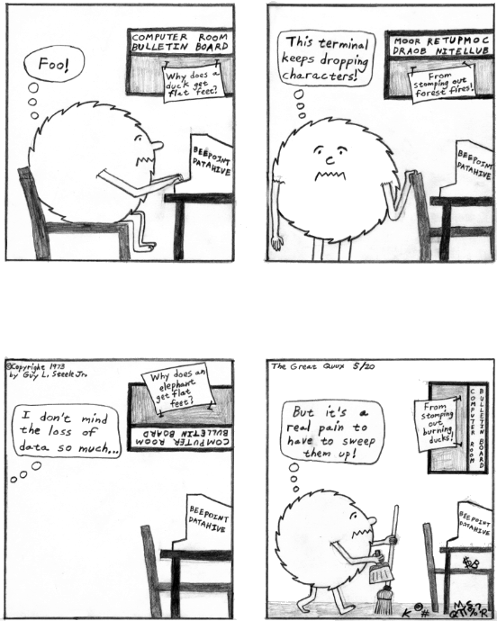

=======
D
=======

**daemon book**: n.

*The Design and Implementation of the 4.3BSD UNIX Operating System*, by
Samuel J. Leffler, Marshall Kirk McKusick, Michael J. Karels, and John
S. Quarterman (Addison-Wesley Publishers, 1989, ISBN 0-201-06196-1); or
*The Design and Implementation of the 4.4 BSD Operating System* by
Marshall Kirk McKusick, Keith Bostic, Michael J. Karels and John S.
Quarterman (Addison-Wesley Longman, 1996, ISBN 0-201-54979-4) Either of
the standard reference books on the internals of
`BSD <../B/BSD.html>`__ Unix. So called because the covers have a
picture depicting a little demon (a visual play on
`daemon <daemon.html>`__) in sneakers, holding a pitchfork (referring
to one of the characteristic features of Unix, the fork(2) system call).

--------------

+---------------------------+----------------------------+---------------------------+
| `Prev <daemon.html>`__    | `Up <../D.html>`__         |  `Next <dahmum.html>`__   |
+---------------------------+----------------------------+---------------------------+
| daemon                    | `Home <../index.html>`__   |  dahmum                   |
+---------------------------+----------------------------+---------------------------+

daemon
================

**daemon**: /day´mn/, /dee´mn/, n.

[from Maxwell's Demon, later incorrectly retronymed as ‘Disk And
Execution MONitor’] A program that is not invoked explicitly, but lies
dormant waiting for some condition(s) to occur. The idea is that the
perpetrator of the condition need not be aware that a daemon is lurking
(though often a program will commit an action only because it knows that
it will implicitly invoke a daemon). For example, under
`ITS <../I/ITS.html>`__, writing a file on the LPT spooler's directory
would invoke the spooling daemon, which would then print the file. The
advantage is that programs wanting (in this example) files printed need
neither compete for access to nor understand any idiosyncrasies of the
LPT. They simply enter their implicit requests and let the daemon decide
what to do with them. Daemons are usually spawned automatically by the
system, and may either live forever or be regenerated at intervals.

Daemon and `demon <demon.html>`__ are often used interchangeably, but
seem to have distinct connotations. The term daemon was introduced to
computing by `CTSS <../C/CTSS.html>`__ people (who pronounced it
/dee´mon/) and used it to refer to what ITS called a
`dragon <dragon.html>`__; the prototype was a program called DAEMON
that automatically made tape backups of the file system. Although the
meaning and the pronunciation have drifted, we think this glossary
reflects current (2003) usage.

dahmum
===========

**dahmum**: /dah´mum/, n.

[Usenet] The material of which protracted `flame
war <../F/flame-war.html>`__\ s, especially those about operating
systems, is composed. Homeomorphic to `spam <../S/spam.html>`__. The
term dahmum is derived from the name of a militant
`OS/2 <../O/OS-2.html>`__ advocate, and originated when an extensively
cross-posted OS/2-versus-`Linux <../L/Linux.html>`__ debate was fed
through `Dissociated Press <Dissociated-Press.html>`__.

dancing frog
================

**dancing frog**: n.

[Vancouver area] A problem that occurs on a computer that will not
reappear while anyone else is watching. From the classic Warner Brothers
cartoon *One Froggy Evening*, featuring a dancing and singing Michigan
J. Frog that just croaks when anyone else is around (now the WB network
mascot).

dangling pointer
=================

**dangling pointer**: n.

[common] A reference that doesn't actually lead anywhere (in C and some
other languages, a pointer that doesn't actually point at anything
valid). Usually this happens because it formerly pointed to something
that has moved or disappeared. Used as jargon in a generalization of its
techspeak meaning; for example, a local phone number for a person who
has since moved to the other coast is a dangling pointer.

dark-side hacker
===================

**dark-side hacker**: n.

A criminal or malicious hacker; a `cracker <../C/cracker.html>`__.
From George Lucas's Darth Vader, “seduced by the dark side of the
Force”. The implication that hackers form a sort of elite of
technological Jedi Knights is intended. Oppose
`samurai <../S/samurai.html>`__.

Datamation
=====================

**Datamation**: /day\`t@·may´sh@n/, n.

A magazine that many hackers assume all `suit <../S/suit.html>`__\ s
read. Used to question an unbelieved quote, as in “Did you read that in
*Datamation?*\ ”. It used to publish something hackishly funny every
once in a while, like the original paper on `COME
FROM <../C/COME-FROM.html>`__ in 1973, and Ed Post's *Real Programmers
Don't Use Pascal* ten years later, but for a long time after that it was
much more exclusively `suit <../S/suit.html>`__-oriented and boring.
Following a change of editorship in 1994, Datamation briefly tried for
more the technical content and irreverent humor that marked its early
days, but this did not last.

DAU
================

**DAU**: /dow/, n.

[German FidoNet] German acronym for Dümmster Anzunehmender User
(stupidest imaginable user). From the engineering-slang GAU for Grösster
Anzunehmender Unfall, worst assumable accident, esp. of a LNG tank farm
plant or something with similarly disastrous consequences. In popular
German, GAU is used only to refer to worst-case nuclear accidents such
as a core meltdown. See `cretin <../C/cretin.html>`__,
`fool <../F/fool.html>`__, `loser <../L/loser.html>`__ and
`weasel <../W/weasel.html>`__.

Dave the Resurrector
========================

**Dave the Resurrector**: n.

[Usenet; also abbreviated DtR] A `cancelbot <../C/cancelbot.html>`__
that cancels cancels. Dave the Resurrector originated when some
`spam <../S/spam.html>`__-spewers decided to try to impede
spam-fighting by wholesale cancellation of anti-spam coordination
messages in the "news.admin.net-abuse.usenet" newsgroup.

day mode
====================

**day mode**: n.

See `phase <../P/phase.html>`__ (sense 1). Used of people only.

dd
=============

**dd**: /dee·dee/, vt.

[Unix: from IBM `JCL <../J/JCL.html>`__] Equivalent to
`cat <../C/cat.html>`__ or `BLT <../B/BLT.html>`__. Originally the
name of a Unix copy command with special options suitable for
block-oriented devices; it was often used in heavy-handed system
maintenance, as in “Let's **dd** the root partition onto a tape, then
use the boot PROM to load it back on to a new disk”. The Unix dd(1) was
designed with a weird, distinctly non-Unixy keyword option syntax
reminiscent of IBM System/360 JCL (which had an elaborate DD ‘Dataset
Definition’ specification for I/O devices); though the command filled a
need, the interface design was clearly a prank. The jargon usage is now
very rare outside Unix sites and now nearly obsolete even there, as
dd(1) has been `deprecated <deprecated.html>`__ for a long time
(though it has no exact replacement). The term has been displaced by
`BLT <../B/BLT.html>`__ or simple English ‘copy’.

DDT
==========

**DDT**: /D·D·T/, n.

[from the insecticide para-dichloro-diphenyl-trichloroethene]

1. Generic term for a program that assists in debugging other programs
by showing individual machine instructions in a readable symbolic form
and letting the user change them. In this sense the term DDT is now
archaic, having been widely displaced by debugger or names of individual
programs like **adb**, **sdb**, **dbx**, or **gdb**.

2. [ITS] Under MIT's fabled `ITS <../I/ITS.html>`__ operating system,
DDT (running under the alias HACTRN, a six-letterism for ‘Hack
Translator’) was also used as the `shell <../S/shell.html>`__ or top
level command language used to execute other programs.

3. Any one of several specific DDTs (sense 1) supported on early
`DEC <DEC.html>`__ hardware and CP/M. The PDP-10 Reference Handbook
(1969) contained a footnote on the first page of the documentation for
DDT that illuminates the origin of the term:

    Historical footnote: DDT was developed at MIT for the PDP-1 computer
    in 1961. At that time DDT stood for “DEC Debugging Tape”. Since
    then, the idea of an on-line debugging program has propagated
    throughout the computer industry. DDT programs are now available for
    all DEC computers. Since media other than tape are now frequently
    used, the more descriptive name “Dynamic Debugging Technique” has
    been adopted, retaining the DDT abbreviation. Confusion between
    DDT-10 and another well known pesticide,
    dichloro-diphenyl-trichloroethane
    C\ :sub:`14`\ H\ :sub:`9`\ Cl\ :sub:`5` should be minimal since each
    attacks a different, and apparently mutually exclusive, class of
    bugs.

(The ‘tape’ referred to was, incidentally, not magnetic but paper.)
Sadly, this quotation was removed from later editions of the handbook
after the `suit <../S/suit.html>`__\ s took over and
`DEC <DEC.html>`__ became much more ‘businesslike’.

The history above is known to many old-time hackers. But there's more:
Peter Samson, compiler of the original `TMRC <../T/TMRC.html>`__
lexicon, reports that he named DDT after a similar tool on the TX-0
computer, the direct ancestor of the PDP-1 built at MIT's Lincoln Lab in
1957. The debugger on that ground-breaking machine (the first
transistorized computer) rejoiced in the name FLIT (FLexowriter
Interrogation Tape). Flit was for many years the trade-name of a popular
insecticide.

dead beef attack
===================

**dead beef attack**: n.

[cypherpunks list, 1996] An attack on a public-key cryptosystem
consisting of publishing a key having the same ID as another key (thus
making it possible to spoof a user's identity if recipients aren't
careful about verifying keys). In PGP and GPG the key ID is the last
eight hex digits of (for RSA keys) the product of two primes. The attack
was demonstrated by creating a key whose ID was 0xdeadbeef (see
`DEADBEEF <DEADBEEF.html>`__).

DEADBEEF
===============

**DEADBEEF**: /ded·beef/, n.

The hexadecimal word-fill pattern for freshly allocated memory under a
number of IBM environments, including the RS/6000. Some modern debugging
tools deliberately fill freed memory with this value as a way of
converting `heisenbug <../H/heisenbug.html>`__\ s into `Bohr
bug <../B/Bohr-bug.html>`__\ s. As in “Your program is DEADBEEF”
(meaning gone, aborted, flushed from memory); if you start from an odd
half-word boundary, of course, you have BEEFDEAD. See also the anecdote
under `fool <../F/fool.html>`__ and `dead beef
attack <dead-beef-attack.html>`__.

dead code
==============

**dead code**: n.

Routines that can never be accessed because all calls to them have been
removed, or code that cannot be reached because it is guarded by a
control structure that provably must always transfer control somewhere
else. The presence of dead code may reveal either logical errors due to
alterations in the program or significant changes in the assumptions and
environment of the program (see also `software
rot <../S/software-rot.html>`__); a good compiler should report dead
code so a maintainer can think about what it means. (Sometimes it simply
means that an *extremely* defensive programmer has inserted `can't
happen <../C/can-t-happen.html>`__ tests which really can't happen —
yet.) Syn. `grunge <../G/grunge.html>`__. See also
`dead <dead.html>`__, and `The Story of
Mel' <../story-of-mel.html>`__.

dead
============

**dead**: adj.

1. Non-functional; `down <down.html>`__;
`crash <../C/crash.html>`__\ ed. Especially used of hardware.

2. At XEROX PARC, software that is working but not undergoing continued
development and support.

3. Useless; inaccessible. Antonym: live. Compare `dead
code <dead-code.html>`__.

deadlock
===============

**deadlock**: n.

1. [techspeak] A situation wherein two or more processes are unable to
proceed because each is waiting for one of the others to do something. A
common example is a program communicating to a server, which may find
itself waiting for output from the server before sending anything more
to it, while the server is similarly waiting for more input from the
controlling program before outputting anything. (It is reported that
this particular flavor of deadlock is sometimes called a starvation
deadlock, though the term starvation is more properly used for
situations where a program can never run simply because it never gets
high enough priority. Another common flavor is constipation, in which
each process is trying to send stuff to the other but all buffers are
full because nobody is reading anything.) See `deadly
embrace <deadly-embrace.html>`__.

2. Also used of deadlock-like interactions between humans, as when two
people meet in a narrow corridor, and each tries to be polite by moving
aside to let the other pass, but they end up swaying from side to side
without making any progress because they always move the same way at the
same time.

deadly embrace
==================

**deadly embrace**: n.

Same as `deadlock <deadlock.html>`__, though usually used only when
exactly two processes are involved. This is the more popular term in
Europe, while `deadlock <deadlock.html>`__ predominates in the United
States.

dead-tree version
========================================

**dead-tree version**

[common] A paper version of an on-line document; one printed on dead
trees. In this context, “dead trees” always refers to paper. See also
`tree-killer <../T/tree-killer.html>`__.

death code
===================

**death code**: n.

A routine whose job is to set everything in the computer — registers,
memory, flags, everything — to zero, including that portion of memory
where it is running; its last act is to `stomp
on <../S/stomp-on.html>`__ its own “store zero” instruction. Death code
isn't very useful, but writing it is an interesting hacking challenge on
architectures where the instruction set makes it possible, such as the
PDP-8 (it has also been done on the DG Nova).

Perhaps the ultimate death code is on the TI 990 series, where all
registers are actually in RAM, and the instruction “store immediate 0”
has the opcode “0”. The PC will immediately wrap around core as many
times as it can until a user hits HALT. Any empty memory location is
death code. Worse, the manufacturer recommended use of this instruction
in startup code (which would be in ROM and therefore survive).

Death Square
===================

**Death Square**: n.

The corporate logo of Novell, the people who acquired USL after AT&T let
go of it (Novell eventually sold the Unix group to SCO). Coined by
analogy with `Death Star <Death-Star.html>`__, because many people
believed Novell was bungling the lead in Unix systems exactly as AT&T
did for many years.

[They were right —ESR]

Death Star
================

**Death Star**: n.

[from the movie *Star Wars*]

1. The AT&T corporate logo, which bears an uncanny resemblance to the
Death Star in the Star Wars movies. This usage was particularly common
among partisans of `BSD <../B/BSD.html>`__ Unix in the 1980s, who
tended to regard the AT&T versions as inferior and AT&T as a bad guy.
Copies still circulate of a poster printed by Mt. Xinu showing a
starscape with a space fighter labeled 4.2 BSD streaking away from a
broken AT&T logo wreathed in flames.

2. AT&T's internal magazine, *Focus*, uses death star to describe an
incorrectly done AT&T logo in which the inner circle in the top left is
dark instead of light — a frequent result of dark-on-light logo images.

Death, X of
================

**Death, X of**

[common] A construction used to imbue the subject with campy menace,
usually with intent to ridicule. The ancestor of this term is a famous
*Far Side* cartoon from the 1980s in which a balloon with a fierce face
painted on it is passed off as the “Floating Head of Death”. Hackers and
SF fans have been using the suffix “of Death” ever since to label things
which appear to be vastly threatening but will actually pop like a
balloon if you prick them. Such constructions are properly spoken in a
tone of over-exagerrated portentiousness: “Behold! The Spinning - Pizza
- of - *Death*!” See `Blue Screen of
Death <../B/Blue-Screen-of-Death.html>`__, `Ping O'
Death <../P/Ping-O--Death.html>`__, `Spinning Pizza of
Death <../S/Spinning-Pizza-of-Death.html>`__, `click of
death <../C/click-of-death.html>`__. Compare `Doom, X
of <Doom--X-of.html>`__.

decay
===============

**decay**: n.,vi

[from nuclear physics] An automatic conversion which is applied to most
array-valued expressions in `C <../C/C.html>`__; they ‘decay into’
pointer-valued expressions pointing to the array's first element. This
term is borderline techspeak, but is not used in the official standard
for the language.

DEC
=======

**DEC**: /dek/, n.

n. Commonly used abbreviation for Digital Equipment Corporation, later
deprecated by DEC itself in favor of “Digital” and now entirely obsolete
following the buyout by Compaq. Before the `killer
micro <../K/killer-micro.html>`__ revolution of the late 1980s,
hackerdom was closely symbiotic with DEC's pioneering timesharing
machines. The first of the group of cultures described by this lexicon
nucleated around the PDP-1 (see `TMRC <../T/TMRC.html>`__).
Subsequently, the PDP-6, `PDP-10 <../P/PDP-10.html>`__,
`PDP-20 <../P/PDP-20.html>`__, `PDP-11 <../P/PDP-11.html>`__ and
`VAX <../V/VAX.html>`__ were all foci of large and important
hackerdoms, and DEC machines long dominated the ARPANET and Internet
machine population. DEC was the technological leader of the minicomputer
era (roughly 1967 to 1987), but its failure to embrace microcomputers
and Unix early cost it heavily in profits and prestige after
`silicon <../S/silicon.html>`__ got cheap. Nevertheless, the
microprocessor design tradition owes a major debt to the
`PDP-11 <../P/PDP-11.html>`__ instruction set, and every one of the
major general-purpose microcomputer OSs so far (CP/M, MS-DOS, Unix,
OS/2, Windows NT) was either genetically descended from a DEC OS, or
incubated on DEC hardware, or both. Accordingly, DEC was for many years
still regarded with a certain wry affection even among many hackers too
young to have grown up on DEC machines.

deckle

**deckle**: /dek´l/, n.

[from dec- and `nybble <../N/nybble.html>`__; the original spelling
seems to have been decle] Two `nickle <../N/nickle.html>`__\ s; 10
bits. Reported among developers for Mattel's GI 1600 (the Intellivision
games processor), a chip with 16-bit-wide RAM but 10-bit-wide ROM. See
`nybble <../N/nybble.html>`__ for other such terms.

DEC Wars
===================

**DEC Wars**: n.

A 1983 `Usenet <../U/Usenet.html>`__ posting by Alan Hastings and
Steve Tarr spoofing the *Star Wars* movies in hackish terms. Some years
later, ESR (disappointed by Hastings and Tarr's failure to exploit a
great premise more thoroughly) posted a 3-times-longer complete rewrite
called `Unix WARS <http://www.catb.org/~esr/writings/unixwars.html>`__;
the two are often confused.

DED
============

**DED**: /D·E·D/, n.

Dark-Emitting Diode (that is, a burned-out LED). Compare
`SED <../S/SED.html>`__, `LER <../L/LER.html>`__, `write-only
memory <../W/write-only-memory.html>`__. In the early 1970s both
Signetics and Texas instruments released DED spec sheets as
`AFJ <../A/AFJ.html>`__\ s (suggested uses included “as a power-off
indicator”).

deep hack mode
==================

**deep hack mode**: n.

See `hack mode <../H/hack-mode.html>`__.

deep magic
=================

**deep magic**: n.

[poss. from C. S. Lewis's *Narnia* books] An awesomely arcane technique
central to a program or system, esp. one neither generally published nor
available to hackers at large (compare `black
art <../B/black-art.html>`__); one that could only have been composed
by a true `wizard <../W/wizard.html>`__. Compiler optimization
techniques and many aspects of `OS <../O/OS.html>`__ design used to be
`deep magic <deep-magic.html>`__; many techniques in cryptography,
signal processing, graphics, and AI still are. Compare `heavy
wizardry <../H/heavy-wizardry.html>`__. Esp.: found in comments of the
form “Deep magic begins here...”. Compare `voodoo
programming <../V/voodoo-programming.html>`__.

deep space
================

**deep space**: n.

1. Describes the notional location of any program that has gone `off
the trolley <../O/off-the-trolley.html>`__. Esp.: used of programs that
just sit there silently grinding long after either failure or some
output is expected. “Uh oh. I should have gotten a prompt ten seconds
ago. The program's in deep space somewhere.” Compare
`buzz <../B/buzz.html>`__, `catatonic <../C/catatonic.html>`__,
`hyperspace <../H/hyperspace.html>`__.

2. The metaphorical location of a human so dazed and/or confused or
caught up in some esoteric form of `bogosity <../B/bogosity.html>`__
that he or she no longer responds coherently to normal communication.
Compare `page out <../P/page-out.html>`__.

defenestration
=====================

**defenestration**: n.

[mythically from a traditional Bohemian assassination method, via SF
fandom]

1. Proper karmic retribution for an incorrigible punster. “Oh, ghod,
that was *awful*!” “Quick! Defenestrate him!”

2. The act of completely removing Micro$oft Windows from a PC in favor
of a better OS (typically Linux).

3. The act of discarding something under the assumption that it will
improve matters. “I don't have any disk space left.” “Well, why don't
you defenestrate that 100 megs worth of old core dumps?”

4. Under a GUI, the act of dragging something out of a window (onto the
screen). “Next, defenestrate the MugWump icon.”

5. [obs.] The act of exiting a window system in order to get better
response time from a full-screen program. This comes from the dictionary
meaning of defenestrate, which is to throw something out a window.

defined as
=============

**defined as**: adj.

In the role of, usually in an organization-chart sense. “Pete is
currently defined as bug prioritizer.” Compare
`logical <../L/logical.html>`__.

deflicted
===========

**deflicted**

[portmanteau of “defective” and “afflicted”; common among PC repair
technicians, and probably originated among hardware techs outside the
hacker community proper] Term used of hardware that is broken due to
poor design or shoddy manufacturing or (especially) both; less
frequently used of software and rarely of people. This term is normally
employed in a tone of weary contempt by technicians who have seen the
specific failure in the trouble report before and are cynically
confident they'll see it again. Ultimately this may derive from Frank
Zappa's 1974 album *Apostrophe*, on which the Fur Trapper infamously
rubs his deflicted eyes...

dehose
=============

**dehose**: /dee·hohz/, vt.

To clear a `hosed <../H/hosed.html>`__ condition.

Dejagoo
=================

**Dejagoo**

[Portmanteau of Dejanews and Google] Google newsgroups. Became common in
2001 after Google acquired Dejanews, and with it the largest on-line
archive of Usenet postings.

deletia
=============

**deletia**: n., /d@·lee´sha/

[USENET; common] In an email reply, material omitted from the quote of
the original. Usually written rather than spoken; often appears as a
pseudo-tag or ellipsis in the body of the reply, as “[deletia]” or
“<deletia>” or “<snip>”.

--------------

+----------------------------+----------------------------+--------------------------------+
| `Prev <Dejagoo.html>`__    | `Up <../D.html>`__         |  `Next <deliminator.html>`__   |
+----------------------------+----------------------------+--------------------------------+
| Dejagoo                    | `Home <../index.html>`__   |  deliminator                   |
+----------------------------+----------------------------+--------------------------------+

deliminator

`Prev <deletia.html>`__ 

D

 `Next <delint.html>`__

--------------

**deliminator**: /de·lim'·in·ay·t@r/, n.

[portmanteau, delimiter + eliminate] A string or pattern used to delimit
text into fields, but which is itself eliminated from the resulting list
of fields. This jargon seems to have originated among Perl hackers in
connection with the Perl split() function; however, it has been sighted
in live use among Java and even Visual Basic programmers.

--------------

+----------------------------+----------------------------+---------------------------+
| `Prev <deletia.html>`__    | `Up <../D.html>`__         |  `Next <delint.html>`__   |
+----------------------------+----------------------------+---------------------------+
| deletia                    | `Home <../index.html>`__   |  delint                   |
+----------------------------+----------------------------+---------------------------+

delint

`Prev <deliminator.html>`__ 

D

 `Next <delta.html>`__

--------------

**delint**: /dee·lint/, v. obs.

To modify code to remove problems detected when
`lint <../L/lint.html>`__\ ing. Confusingly, this process is also
referred to as linting code. This term is no longer in general use
because ANSI C compilers typically issue compile-time warnings almost as
detailed as lint warnings.

--------------

+--------------------------------+----------------------------+--------------------------+
| `Prev <deliminator.html>`__    | `Up <../D.html>`__         |  `Next <delta.html>`__   |
+--------------------------------+----------------------------+--------------------------+
| deliminator                    | `Home <../index.html>`__   |  delta                   |
+--------------------------------+----------------------------+--------------------------+

delta

`Prev <delint.html>`__ 

D

 `Next <demented.html>`__

--------------

**delta**: n.

1. [techspeak] A quantitative change, especially a small or incremental
one (this use is general in physics and engineering). “I just doubled
the speed of my program!” “What was the delta on program size?” “About
30 percent.” (He doubled the speed of his program, but increased its
size by only 30 percent.)

2. [Unix] A `diff <diff.html>`__, especially a `diff <diff.html>`__
stored under the set of version-control tools called SCCS (Source Code
Control System) or RCS (Revision Control System).

3. n. A small quantity, but not as small as
`epsilon <../E/epsilon.html>`__. The jargon usage of
`delta <delta.html>`__ and `epsilon <../E/epsilon.html>`__ stems
from the traditional use of these letters in mathematics for very small
numerical quantities, particularly in ‘epsilon-delta’ proofs in limit
theory (as in the differential calculus). The term
`delta <delta.html>`__ is often used, once
`epsilon <../E/epsilon.html>`__ has been mentioned, to mean a quantity
that is slightly bigger than `epsilon <../E/epsilon.html>`__ but still
very small. “The cost isn't epsilon, but it's delta” means that the cost
isn't totally negligible, but it is nevertheless very small. Common
constructions include within delta of —, within epsilon of —: that is,
‘close to’ and ‘even closer to’.

--------------

+---------------------------+----------------------------+-----------------------------+
| `Prev <delint.html>`__    | `Up <../D.html>`__         |  `Next <demented.html>`__   |
+---------------------------+----------------------------+-----------------------------+
| delint                    | `Home <../index.html>`__   |  demented                   |
+---------------------------+----------------------------+-----------------------------+

demented

`Prev <delta.html>`__ 

D

 `Next <demigod.html>`__

--------------

**demented**: adj.

Yet another term of disgust used to describe a malfunctioning program.
The connotation in this case is that the program works as designed, but
the design is bad. Said, for example, of a program that generates large
numbers of meaningless error messages, implying that it is on the brink
of imminent collapse. Compare `wonky <../W/wonky.html>`__,
`brain-damaged <../B/brain-damaged.html>`__,
`bozotic <../B/bozotic.html>`__.

--------------

+--------------------------+----------------------------+----------------------------+
| `Prev <delta.html>`__    | `Up <../D.html>`__         |  `Next <demigod.html>`__   |
+--------------------------+----------------------------+----------------------------+
| delta                    | `Home <../index.html>`__   |  demigod                   |
+--------------------------+----------------------------+----------------------------+

demigod

`Prev <demented.html>`__ 

D

 `Next <demo.html>`__

--------------

**demigod**: n.

A hacker with years of experience, a world-wide reputation, and a major
role in the development of at least one design, tool, or game used by or
known to more than half of the hacker community. To qualify as a genuine
demigod, the person must recognizably identify with the hacker community
and have helped shape it. Major demigods include Ken Thompson and Dennis
Ritchie (co-inventors of `Unix <../U/Unix.html>`__ and
`C <../C/C.html>`__), Richard M. Stallman (inventor of
`EMACS <../E/EMACS.html>`__), Larry Wall (inventor of
`Perl <../P/Perl.html>`__), Linus Torvalds (inventor of
`Linux <../L/Linux.html>`__), and most recently James Gosling
(inventor of Java, `NeWS <../N/NeWS.html>`__, and
`GOSMACS <../G/GOSMACS.html>`__) and Guido van Rossum (inventor of
`Python <../P/Python.html>`__). In their hearts of hearts, most
hackers dream of someday becoming demigods themselves, and more than one
major software project has been driven to completion by the author's
veiled hopes of apotheosis. See also `net.god <../N/net-god.html>`__,
`true-hacker <../T/true-hacker.html>`__,
`ubergeek <../U/ubergeek.html>`__. Since 1995 or so this term has been
gradually displaced by `ubergeek <../U/ubergeek.html>`__.

--------------

+-----------------------------+----------------------------+-------------------------+
| `Prev <demented.html>`__    | `Up <../D.html>`__         |  `Next <demo.html>`__   |
+-----------------------------+----------------------------+-------------------------+
| demented                    | `Home <../index.html>`__   |  demo                   |
+-----------------------------+----------------------------+-------------------------+

demoeffect

`Prev <demo-mode.html>`__ 

D

 `Next <demogroup.html>`__

--------------

**demoeffect**: n.

[`demoscene <demoscene.html>`__\ ]

1. What among hackers is called a `display
hack <display-hack.html>`__. Classical effects include “plasma”
(colorful mess), “keftales” ("x*x+y*y" and other similar patterns,
usually combined with color-cycling), realtime fractals, realtime 3d
graphics, etc. Historically, demo effects have cheated as much as
possible to gain more speed and more complexity, using low-precision
math and masses of assembler code and building animation realtime are
three common tricks, but use of special hardware to fake effects is a
`Good Thing <../G/Good-Thing.html>`__ on the demoscene (though this is
becoming less common as platforms like the Amiga fade away).

2. [Finland] Opposite of `dancing frog <dancing-frog.html>`__. The
crash that happens when you demonstrate a perfectly good prototype to a
client. Plagues most often CS students and small businesses, but there
is a well-known case involving Bill Gates demonstrating a brand new
version of a major operating system.

--------------

+------------------------------+----------------------------+------------------------------+
| `Prev <demo-mode.html>`__    | `Up <../D.html>`__         |  `Next <demogroup.html>`__   |
+------------------------------+----------------------------+------------------------------+
| demo mode                    | `Home <../index.html>`__   |  demogroup                   |
+------------------------------+----------------------------+------------------------------+

demogroup

`Prev <demoeffect.html>`__ 

D

 `Next <demon.html>`__

--------------

**demogroup**: n.

[`demoscene <demoscene.html>`__\ ] A group of `demo <demo.html>`__
(sense 4) composers. Job titles within a group include coders (the ones
who write programs), graphicians (the ones who painstakingly pixelate
the fine art), musicians (the music composers),
`sysop <../S/sysop.html>`__\ s, traders/swappers (the ones who do the
trading and other PR), and organizers (in larger groups). It is not
uncommon for one person to do multiple jobs, but it has been observed
that good coders are rarely good composers and vice versa. [How odd.
Musical talent seems common among Internet/Unix hackers —ESR]

--------------

+-------------------------------+----------------------------+--------------------------+
| `Prev <demoeffect.html>`__    | `Up <../D.html>`__         |  `Next <demon.html>`__   |
+-------------------------------+----------------------------+--------------------------+
| demoeffect                    | `Home <../index.html>`__   |  demon                   |
+-------------------------------+----------------------------+--------------------------+

demo

`Prev <demigod.html>`__ 

D

 `Next <demo-mode.html>`__

--------------

**demo**: /de´moh/

[short for ‘demonstration’]

1. v. To demonstrate a product or prototype. A far more effective way of
inducing bugs to manifest than any number of `test <../T/test.html>`__
runs, especially when important people are watching.

2. n. The act of demoing. “I've gotta give a demo of the drool-proof
interface; how does it work again?”

3. n. Esp. as demo version, can refer either to an early,
barely-functional version of a program which can be used for
demonstration purposes as long as the operator uses *exactly* the right
commands and skirts its numerous bugs, deficiencies, and unimplemented
portions, or to a special version of a program (frequently with some
features crippled) which is distributed at little or no cost to the user
for enticement purposes.

4. [`demoscene <demoscene.html>`__\ ] A sequence of
`demoeffect <demoeffect.html>`__\ s (usually) combined with
self-composed music and hand-drawn (“pixelated”) graphics. These days
(1997) usually built to attend a `compo <../C/compo.html>`__. Often
called eurodemos outside Europe, as most of the
`demoscene <demoscene.html>`__ activity seems to have gathered in
northern Europe and especially Scandinavia. See also
`intro <../I/intro.html>`__, `dentro <dentro.html>`__.

--------------

+----------------------------+----------------------------+------------------------------+
| `Prev <demigod.html>`__    | `Up <../D.html>`__         |  `Next <demo-mode.html>`__   |
+----------------------------+----------------------------+------------------------------+
| demigod                    | `Home <../index.html>`__   |  demo mode                   |
+----------------------------+----------------------------+------------------------------+

demo mode

`Prev <demo.html>`__ 

D

 `Next <demoeffect.html>`__

--------------

**demo mode**: n.

1. [Sun] The state of being `heads down <../H/heads-down.html>`__ in
order to finish code in time for a `demo <demo.html>`__, usually due
yesterday.

2. A mode in which video games sit by themselves running through a
portion of the game, also known as attract mode. Some serious
`app <../A/app.html>`__\ s have a demo mode they use as a screen
saver, or may go through a demo mode on startup (for example, the
Microsoft Windows opening screen — which lets you impress your neighbors
without actually having to put up with `Microsloth
Windows <../M/Microsloth-Windows.html>`__).

--------------

+-------------------------+----------------------------+-------------------------------+
| `Prev <demo.html>`__    | `Up <../D.html>`__         |  `Next <demoeffect.html>`__   |
+-------------------------+----------------------------+-------------------------------+
| demo                    | `Home <../index.html>`__   |  demoeffect                   |
+-------------------------+----------------------------+-------------------------------+

demon dialer

`Prev <demon.html>`__ 

D

 `Next <demoparty.html>`__

--------------

**demon dialer**: n.

A program which repeatedly calls the same telephone number. Demon
dialing may be benign (as when a number of communications programs
contend for legitimate access to a `BBS <../B/BBS.html>`__ line) or
malign (that is, used as a prank or denial-of-service attack). This term
dates from the `blue box <../B/blue-box.html>`__ days of the 1970s and
early 1980s and is now semi-obsolescent among
`phreaker <../P/phreaker.html>`__\ s; see `war
dialer <../W/war-dialer.html>`__ for its contemporary progeny.

--------------

+--------------------------+----------------------------+------------------------------+
| `Prev <demon.html>`__    | `Up <../D.html>`__         |  `Next <demoparty.html>`__   |
+--------------------------+----------------------------+------------------------------+
| demon                    | `Home <../index.html>`__   |  demoparty                   |
+--------------------------+----------------------------+------------------------------+

demon

`Prev <demogroup.html>`__ 

D

 `Next <demon-dialer.html>`__

--------------

**demon**: n.

1. Often used equivalently to `daemon <daemon.html>`__ — especially in
the `Unix <../U/Unix.html>`__ world, where the latter spelling and
pronunciation is considered mildly archaic.

2. [MIT; now probably obsolete] A portion of a program that is not
invoked explicitly, but that lies dormant waiting for some condition(s)
to occur. See `daemon <daemon.html>`__. The distinction is that demons
are usually processes within a program, while daemons are usually
programs running on an operating system.

Demons in sense 2 are particularly common in AI programs. For example, a
knowledge-manipulation program might implement inference rules as
demons. Whenever a new piece of knowledge was added, various demons
would activate (which demons depends on the particular piece of data)
and would create additional pieces of knowledge by applying their
respective inference rules to the original piece. These new pieces could
in turn activate more demons as the inferences filtered down through
chains of logic. Meanwhile, the main program could continue with
whatever its primary task was.

--------------

+------------------------------+----------------------------+---------------------------------+
| `Prev <demogroup.html>`__    | `Up <../D.html>`__         |  `Next <demon-dialer.html>`__   |
+------------------------------+----------------------------+---------------------------------+
| demogroup                    | `Home <../index.html>`__   |  demon dialer                   |
+------------------------------+----------------------------+---------------------------------+

demoparty

`Prev <demon-dialer.html>`__ 

D

 `Next <demoscene.html>`__

--------------

**demoparty**: n.

[`demoscene <demoscene.html>`__\ ] Aboveground descendant of the
`copyparty <../C/copyparty.html>`__, with emphasis shifted away from
software piracy and towards `compo <../C/compo.html>`__\ s. Smaller
demoparties, for 100 persons or less, are held quite often, sometimes
even once a month, and usually last for one to two days. On the other
end of the scale, huge demo parties are held once a year (and four of
these have grown very large and occur annually — Assembly in Finland,
The Party in Denmark, The Gathering in Norway, and NAID somewhere in
north America). These parties usually last for three to five days, have
room for 3000-5000 people, and have a party network with connection to
the internet.

--------------

+---------------------------------+----------------------------+------------------------------+
| `Prev <demon-dialer.html>`__    | `Up <../D.html>`__         |  `Next <demoscene.html>`__   |
+---------------------------------+----------------------------+------------------------------+
| demon dialer                    | `Home <../index.html>`__   |  demoscene                   |
+---------------------------------+----------------------------+------------------------------+

demoscene

`Prev <demoparty.html>`__ 

D

 `Next <dentro.html>`__

--------------

**demoscene**: /dem´oh·seen/

[also ‘demo scene’] A culture of multimedia hackers located primarily in
Scandinavia and northern Europe. Demoscene folklore recounts that when
old-time `warez d00dz <../W/warez-d00dz.html>`__ cracked some piece of
software they often added an advertisement in the beginning, usually
containing colorful `display hack <display-hack.html>`__\ s with
greetings to other cracking groups. The demoscene was born among people
who decided building these display hacks is more interesting than
hacking — or anyway safer. Around 1990 there began to be very serious
police pressure on cracking groups, including raids with SWAT teams
crashing into bedrooms to confiscate computers. Whether in response to
this or for esthetic reasons, crackers of that period began to build
self-contained display hacks of considerable elaboration and beauty
(within the culture such a hack is called a `demo <demo.html>`__). As
more of these `demogroup <demogroup.html>`__\ s emerged, they started
to have `compo <../C/compo.html>`__\ s at copying parties (see
`copyparty <../C/copyparty.html>`__), which later evolved to
standalone events (see `demoparty <demoparty.html>`__). The demoscene
has retained some traits from the `warez
d00dz <../W/warez-d00dz.html>`__, including their style of handles and
group names and some of their jargon.

Traditionally demos were written in assembly language, with lots of
smart tricks, self-modifying code, undocumented op-codes and the like.
Some time around 1995, people started coding demos in C, and a couple of
years after that, they also started using Java.

Ten years on (in 1998-1999), the demoscene is changing as its original
platforms (C64, Amiga, Spectrum, Atari ST, IBM PC under DOS) die out and
activity shifts towards Windows, Linux, and the Internet. While deeply
underground in the past, demoscene is trying to get into the mainstream
as accepted art form, and one symptom of this is the commercialization
of bigger demoparties. Older demosceners frown at this, but the majority
think it's a good direction. Many demosceners end up working in the
computer game industry. Demoscene resource pages are available at
`http://www.oldskool.org/demos/explained/ <http://www.oldskool.org/demos/explained/>`__
and `http://www.scene.org/ <http://www.scene.org/>`__.

--------------

+------------------------------+----------------------------+---------------------------+
| `Prev <demoparty.html>`__    | `Up <../D.html>`__         |  `Next <dentro.html>`__   |
+------------------------------+----------------------------+---------------------------+
| demoparty                    | `Home <../index.html>`__   |  dentro                   |
+------------------------------+----------------------------+---------------------------+

dentro

`Prev <demoscene.html>`__ 

D

 `Next <depeditate.html>`__

--------------

**dentro**: /den´troh/

[`demoscene <demoscene.html>`__\ ] Combination of
`demo <demo.html>`__ (sense 4) and `intro <../I/intro.html>`__.
Other name mixings include intmo, dentmo etc. and are used usually when
the authors are not quite sure whether the program is a
`demo <demo.html>`__ or an `intro <../I/intro.html>`__.
Special-purpose coinages like wedtro (some member of a group got
married), invtro (invitation intro) etc. have also been sighted.

--------------

+------------------------------+----------------------------+-------------------------------+
| `Prev <demoscene.html>`__    | `Up <../D.html>`__         |  `Next <depeditate.html>`__   |
+------------------------------+----------------------------+-------------------------------+
| demoscene                    | `Home <../index.html>`__   |  depeditate                   |
+------------------------------+----------------------------+-------------------------------+

depeditate

`Prev <dentro.html>`__ 

D

 `Next <deprecated.html>`__

--------------

**depeditate**: /dee·ped'@·tayt/, n.

[by (faulty) analogy with decapitate] Humorously, to cut off the feet
of. When one is using some computer-aided typesetting tools, careless
placement of text blocks within a page or above a rule can result in
chopped-off letter descenders. Such letters are said to have been
depeditated.

--------------

+---------------------------+----------------------------+-------------------------------+
| `Prev <dentro.html>`__    | `Up <../D.html>`__         |  `Next <deprecated.html>`__   |
+---------------------------+----------------------------+-------------------------------+
| dentro                    | `Home <../index.html>`__   |  deprecated                   |
+---------------------------+----------------------------+-------------------------------+

deprecated

`Prev <depeditate.html>`__ 

D

 `Next <derf.html>`__

--------------

**deprecated**: adj.

Said of a program or feature that is considered obsolescent and in the
process of being phased out, usually in favor of a specified
replacement. Deprecated features can, unfortunately, linger on for many
years. This term appears with distressing frequency in standards
documents when the committees writing the documents realize that large
amounts of extant (and presumably happily working) code depend on the
feature(s) that have passed out of favor. See also `dusty
deck <dusty-deck.html>`__.

[Usage note: don't confuse this word with ‘depreciated’, or the verb
form ‘deprecate’ with ‘depreciate’. They are different words; see any
dictionary for discussion.]

--------------

+-------------------------------+----------------------------+-------------------------+
| `Prev <depeditate.html>`__    | `Up <../D.html>`__         |  `Next <derf.html>`__   |
+-------------------------------+----------------------------+-------------------------+
| depeditate                    | `Home <../index.html>`__   |  derf                   |
+-------------------------------+----------------------------+-------------------------+

de-rezz

`Prev <DDT.html>`__ 

D

 `Next <dead.html>`__

--------------

**de-rezz**: /dee·rez´/

[from ‘de-resolve’ via the movie *Tron*] (also derez)

1. vi. To disappear or dissolve; the image that goes with it is of an
object breaking up into raster lines and static and then dissolving.
Occasionally used of a person who seems to have suddenly ‘fuzzed out’
mentally rather than physically. Usage: extremely silly, also rare. This
verb was actually invented as *fictional* hacker jargon, and adopted in
a spirit of irony by real hackers years after the fact.

2. vt. The Macintosh resource decompiler. On a Macintosh, many program
structures (including the code itself) are managed in small segments of
the program file known as resources; Rez and DeRez are a pair of
utilities for compiling and decompiling resource files. Thus,
decompiling a resource is derezzing. Usage: very common.

--------------

+------------------------+----------------------------+-------------------------+
| `Prev <DDT.html>`__    | `Up <../D.html>`__         |  `Next <dead.html>`__   |
+------------------------+----------------------------+-------------------------+
| DDT                    | `Home <../index.html>`__   |  dead                   |
+------------------------+----------------------------+-------------------------+

derf

`Prev <deprecated.html>`__ 

D

 `Next <deserves-to-lose.html>`__

--------------

**derf**: /derf/

[PLATO]

1. v. The act of exploiting a terminal which someone else has
absentmindedly left logged on, to use that person's account, especially
to post articles intended to make an ass of the victim you're
impersonating. It has been alleged that the term originated as a
reversal of the name of the gentleman who most usually left himself
vulnerable to it, who also happened to be the head of the department
that handled PLATO at the University of Delaware. Compare `baggy
pantsing <../B/baggy-pantsing.html>`__.

2. n. The victim of an act of derfing, sense 1. The most typical posting
from a derfed account read “I am a derf.”.

--------------

+-------------------------------+----------------------------+-------------------------------------+
| `Prev <deprecated.html>`__    | `Up <../D.html>`__         |  `Next <deserves-to-lose.html>`__   |
+-------------------------------+----------------------------+-------------------------------------+
| deprecated                    | `Home <../index.html>`__   |  deserves to lose                   |
+-------------------------------+----------------------------+-------------------------------------+

deserves to lose

`Prev <derf.html>`__ 

D

 `Next <despew.html>`__

--------------

**deserves to lose**: adj.

[common] Said of someone who willfully does the `Wrong
Thing <../W/Wrong-Thing.html>`__; humorously, if one uses a feature
known to be `marginal <../M/marginal.html>`__. What is meant is that
one deserves the consequences of one's `losing <../L/losing.html>`__
actions. “Boy, anyone who tries to use
`mess-dos <../M/mess-dos.html>`__ deserves to
`lose <../L/lose.html>`__!” (`ITS <../I/ITS.html>`__ fans used to
say the same thing of `Unix <../U/Unix.html>`__; many still do.) See
also `screw <../S/screw.html>`__, `chomp <../C/chomp.html>`__,
`bagbiter <../B/bagbiter.html>`__.

--------------

+-------------------------+----------------------------+---------------------------+
| `Prev <derf.html>`__    | `Up <../D.html>`__         |  `Next <despew.html>`__   |
+-------------------------+----------------------------+---------------------------+
| derf                    | `Home <../index.html>`__   |  despew                   |
+-------------------------+----------------------------+---------------------------+

despew

`Prev <deserves-to-lose.html>`__ 

D

 `Next <dickless-workstation.html>`__

--------------

**despew**: /d@·spyoo´/, v.

[Usenet] To automatically generate a large amount of garbage to the net,
esp. from an automated posting program gone wild. See
`ARMM <../A/ARMM.html>`__.

--------------

+-------------------------------------+----------------------------+-----------------------------------------+
| `Prev <deserves-to-lose.html>`__    | `Up <../D.html>`__         |  `Next <dickless-workstation.html>`__   |
+-------------------------------------+----------------------------+-----------------------------------------+
| deserves to lose                    | `Home <../index.html>`__   |  dickless workstation                   |
+-------------------------------------+----------------------------+-----------------------------------------+

dickless workstation

`Prev <despew.html>`__ 

D

 `Next <dictionary-flame.html>`__

--------------

**dickless workstation**: n.

Extremely pejorative hackerism for ‘diskless workstation’, a class of
botches including the Sun 3/50 and other machines designed exclusively
to network with an expensive central disk server. These combine all the
disadvantages of timesharing with all the disadvantages of distributed
personal computers; typically, they cannot even
`boot <../B/boot.html>`__ themselves without help (in the form of some
kind of `breath-of-life packet <../B/breath-of-life-packet.html>`__)
from the server.

--------------

+---------------------------+----------------------------+-------------------------------------+
| `Prev <despew.html>`__    | `Up <../D.html>`__         |  `Next <dictionary-flame.html>`__   |
+---------------------------+----------------------------+-------------------------------------+
| despew                    | `Home <../index.html>`__   |  dictionary flame                   |
+---------------------------+----------------------------+-------------------------------------+

dictionary flame

`Prev <dickless-workstation.html>`__ 

D

 `Next <diddle.html>`__

--------------

**dictionary flame**: n.

[Usenet] An attempt to sidetrack a debate away from issues by insisting
on meanings for key terms that presuppose a desired conclusion or
smuggle in an implicit premise. A common tactic of people who prefer
argument over definitions to disputes about reality. Compare `spelling
flame <../S/spelling-flame.html>`__.

--------------

+-----------------------------------------+----------------------------+---------------------------+
| `Prev <dickless-workstation.html>`__    | `Up <../D.html>`__         |  `Next <diddle.html>`__   |
+-----------------------------------------+----------------------------+---------------------------+
| dickless workstation                    | `Home <../index.html>`__   |  diddle                   |
+-----------------------------------------+----------------------------+---------------------------+

diddle

`Prev <dictionary-flame.html>`__ 

D

 `Next <die.html>`__

--------------

**diddle**

1. vt. To work with or modify in a not-particularly-serious manner. “I
diddled a copy of `ADVENT <../A/ADVENT.html>`__ so it didn't
double-space all the time.” “Let's diddle this piece of code and see if
the problem goes away.” See `tweak <../T/tweak.html>`__ and
`twiddle <../T/twiddle.html>`__.

2. n. The action or result of diddling.

See also `tweak <../T/tweak.html>`__,
`twiddle <../T/twiddle.html>`__, `frob <../F/frob.html>`__.

--------------

+-------------------------------------+----------------------------+------------------------+
| `Prev <dictionary-flame.html>`__    | `Up <../D.html>`__         |  `Next <die.html>`__   |
+-------------------------------------+----------------------------+------------------------+
| dictionary flame                    | `Home <../index.html>`__   |  die                   |
+-------------------------------------+----------------------------+------------------------+

die horribly

`Prev <die.html>`__ 

D

 `Next <diff.html>`__

--------------

**die horribly**: v.

The software equivalent of `crash and
burn <../C/crash-and-burn.html>`__, and the preferred emphatic form of
`die <die.html>`__. “The converter choked on an FF in its input and
died horribly”.

--------------

+------------------------+----------------------------+-------------------------+
| `Prev <die.html>`__    | `Up <../D.html>`__         |  `Next <diff.html>`__   |
+------------------------+----------------------------+-------------------------+
| die                    | `Home <../index.html>`__   |  diff                   |
+------------------------+----------------------------+-------------------------+

die

`Prev <diddle.html>`__ 

D

 `Next <die-horribly.html>`__

--------------

**die**: v.

Syn. `crash <../C/crash.html>`__. Unlike
`crash <../C/crash.html>`__, which is used primarily of hardware, this
verb is used of both hardware and software. See also `go
flatline <../G/go-flatline.html>`__, `casters-up
mode <../C/casters-up-mode.html>`__.

--------------

+---------------------------+----------------------------+---------------------------------+
| `Prev <diddle.html>`__    | `Up <../D.html>`__         |  `Next <die-horribly.html>`__   |
+---------------------------+----------------------------+---------------------------------+
| diddle                    | `Home <../index.html>`__   |  die horribly                   |
+---------------------------+----------------------------+---------------------------------+

diff

`Prev <die-horribly.html>`__ 

D

 `Next <dike.html>`__

--------------

**diff**: /dif/, n.

1. A change listing, especially giving differences between (and
additions to) source code or documents (the term is often used in the
plural diffs). “Send me your diffs for the Jargon File!” Compare
`vdiff <../V/vdiff.html>`__.

2. Specifically, such a listing produced by the diff(1) command, esp.
when used as specification input to the patch(1) utility (which can
actually perform the modifications; see `patch <../P/patch.html>`__).
This is a common method of distributing patches and source updates in
the Unix/C world.

3. v. To compare (whether or not by use of automated tools on
machine-readable files); see also `vdiff <../V/vdiff.html>`__,
`mod <../M/mod.html>`__.

--------------

+---------------------------------+----------------------------+-------------------------+
| `Prev <die-horribly.html>`__    | `Up <../D.html>`__         |  `Next <dike.html>`__   |
+---------------------------------+----------------------------+-------------------------+
| die horribly                    | `Home <../index.html>`__   |  dike                   |
+---------------------------------+----------------------------+-------------------------+

dike

`Prev <diff.html>`__ 

D

 `Next <Dilbert.html>`__

--------------

**dike**: vt.

To remove or disable a portion of something, as a wire from a computer
or a subroutine from a program. A standard slogan is “When in doubt,
dike it out”. (The implication is that it is usually more effective to
attack software problems by reducing complexity than by increasing it.)
The word ‘dikes’ is widely used to mean ‘diagonal cutters’, a kind of
wire cutter. To ‘dike something out’ means to use such cutters to remove
something. Indeed, the TMRC Dictionary defined dike as “to attack with
dikes”. Among hackers this term has been metaphorically extended to
informational objects such as sections of code.

--------------

+-------------------------+----------------------------+----------------------------+
| `Prev <diff.html>`__    | `Up <../D.html>`__         |  `Next <Dilbert.html>`__   |
+-------------------------+----------------------------+----------------------------+
| diff                    | `Home <../index.html>`__   |  Dilbert                   |
+-------------------------+----------------------------+----------------------------+

Dilbert

`Prev <dike.html>`__ 

D

 `Next <ding.html>`__

--------------

**Dilbert**

n. Name and title character of a comic strip nationally syndicated in
the U.S. and enormously popular among hackers. Dilbert is an
archetypical engineer-nerd who works at an anonymous high-technology
company; the strips present a lacerating satire of insane working
conditions and idiotic `management <../M/management.html>`__ practices
all too readily recognized by hackers. Adams, who spent nine years in
`cube <../C/cube.html>`__ 4S700R at Pacific Bell (not
`DEC <DEC.html>`__ as often reported), often remarks that he has never
been able to come up with a fictional management blunder that his
correspondents didn't quickly either report to have actually happened or
top with a similar but even more bizarre incident. In 1996 Adams
distilled his insights into the collective psychology of businesses into
an even funnier book, *The Dilbert Principle* (HarperCollins, ISBN
0-887-30787-6). See also `pointy-haired <../P/pointy-haired.html>`__,
`rat dance <../R/rat-dance.html>`__.

--------------

+-------------------------+----------------------------+-------------------------+
| `Prev <dike.html>`__    | `Up <../D.html>`__         |  `Next <ding.html>`__   |
+-------------------------+----------------------------+-------------------------+
| dike                    | `Home <../index.html>`__   |  ding                   |
+-------------------------+----------------------------+-------------------------+

ding

`Prev <Dilbert.html>`__ 

D

 `Next <dink.html>`__

--------------

**ding**: n.,vi.

1. Synonym for `feep <../F/feep.html>`__. Usage: rare among hackers,
but more common in the `Real World <../R/Real-World.html>`__.

2. dinged: What happens when someone in authority gives you a minor
bitching about something, esp. something trivial. “I was dinged for
having a messy desk.”

--------------

+----------------------------+----------------------------+-------------------------+
| `Prev <Dilbert.html>`__    | `Up <../D.html>`__         |  `Next <dink.html>`__   |
+----------------------------+----------------------------+-------------------------+
| Dilbert                    | `Home <../index.html>`__   |  dink                   |
+----------------------------+----------------------------+-------------------------+

dink

`Prev <ding.html>`__ 

D

 `Next <dinosaur.html>`__

--------------

**dink**: /dink/, adj.

Said of a machine that has the `bitty box <../B/bitty-box.html>`__
nature; a machine too small to be worth bothering with — sometimes the
system you're currently forced to work on. First heard from an MIT
hacker working on a CP/M system with 64K, in reference to any 6502
system, then from fans of 32-bit architectures about 16-bit machines.
“GNUMACS will never work on that dink machine.” Probably derived from
mainstream ‘dinky’, which isn't sufficiently pejorative. See
`macdink <../M/macdink.html>`__.

--------------

+-------------------------+----------------------------+-----------------------------+
| `Prev <ding.html>`__    | `Up <../D.html>`__         |  `Next <dinosaur.html>`__   |
+-------------------------+----------------------------+-----------------------------+
| ding                    | `Home <../index.html>`__   |  dinosaur                   |
+-------------------------+----------------------------+-----------------------------+

dinosaur

`Prev <dink.html>`__ 

D

 `Next <dinosaur-pen.html>`__

--------------

**dinosaur**: n.

1. Any hardware requiring raised flooring and special power. Used
especially of old minis and mainframes, in contrast with newer
microprocessor-based machines. In a famous quote from the 1998 Unix
EXPO, Bill Joy compared the liquid-cooled mainframe in the massive IBM
display with a grazing dinosaur “with a truck outside pumping its bodily
fluids through it”. IBM was not amused. Compare `big
iron <../B/big-iron.html>`__; see also
`mainframe <../M/mainframe.html>`__.

2. [IBM] A very conservative user; a
`zipperhead <../Z/zipperhead.html>`__.

--------------

+-------------------------+----------------------------+---------------------------------+
| `Prev <dink.html>`__    | `Up <../D.html>`__         |  `Next <dinosaur-pen.html>`__   |
+-------------------------+----------------------------+---------------------------------+
| dink                    | `Home <../index.html>`__   |  dinosaur pen                   |
+-------------------------+----------------------------+---------------------------------+

dinosaur pen

`Prev <dinosaur.html>`__ 

D

 `Next <dinosaurs-mating.html>`__

--------------

**dinosaur pen**: n.

A traditional `mainframe <../M/mainframe.html>`__ computer room
complete with raised flooring, special power, its own ultra-heavy-duty
air conditioning, and a side order of Halon fire extinguishers. See
`boa <../B/boa.html>`__.

--------------

+-----------------------------+----------------------------+-------------------------------------+
| `Prev <dinosaur.html>`__    | `Up <../D.html>`__         |  `Next <dinosaurs-mating.html>`__   |
+-----------------------------+----------------------------+-------------------------------------+
| dinosaur                    | `Home <../index.html>`__   |  dinosaurs mating                   |
+-----------------------------+----------------------------+-------------------------------------+

dinosaurs mating

`Prev <dinosaur-pen.html>`__ 

D

 `Next <dirtball.html>`__

--------------

**dinosaurs mating**: n.

Said to occur when yet another `big iron <../B/big-iron.html>`__
merger or buyout occurs; originally reflected a perception by hackers
that these signal another stage in the long, slow dying of the
`mainframe <../M/mainframe.html>`__ industry. In the mainframe
industry's glory days of the 1960s, it was ‘IBM and the Seven Dwarfs’:
Burroughs, Control Data, General Electric, Honeywell, NCR, RCA, and
Univac. RCA and GE sold out early, and it was ‘IBM and the Bunch’
(Burroughs, Univac, NCR, Control Data, and Honeywell) for a while.
Honeywell was bought out by Bull; Burroughs merged with Univac to form
Unisys (in 1984 — this was when the phrase dinosaurs mating was coined);
and in 1991 AT&T absorbed NCR (but spat it back out a few years later).
Control Data still exists but is no longer in the mainframe business. In
similar wave of dinosaur-matings as the PC business began to consolidate
after 1995, Digital Equipment was bought by Compaq which was bought by
Hewlett-Packard. More such earth-shaking unions of doomed giants seem
inevitable.

--------------

+---------------------------------+----------------------------+-----------------------------+
| `Prev <dinosaur-pen.html>`__    | `Up <../D.html>`__         |  `Next <dirtball.html>`__   |
+---------------------------------+----------------------------+-----------------------------+
| dinosaur pen                    | `Home <../index.html>`__   |  dirtball                   |
+---------------------------------+----------------------------+-----------------------------+

dirtball

`Prev <dinosaurs-mating.html>`__ 

D

 `Next <dirty-power.html>`__

--------------

**dirtball**: n.

[XEROX PARC] A small, perhaps struggling outsider; not in the major or
even the minor leagues. For example, “Xerox is not a dirtball company”.

[Outsiders often observe in the PARC culture an institutional arrogance
which usage of this term exemplifies. The brilliance and scope of PARC's
contributions to computer science have been such that this superior
attitude is not much resented. —ESR]

--------------

+-------------------------------------+----------------------------+--------------------------------+
| `Prev <dinosaurs-mating.html>`__    | `Up <../D.html>`__         |  `Next <dirty-power.html>`__   |
+-------------------------------------+----------------------------+--------------------------------+
| dinosaurs mating                    | `Home <../index.html>`__   |  dirty power                   |
+-------------------------------------+----------------------------+--------------------------------+

dirty power

`Prev <dirtball.html>`__ 

D

 `Next <disclaimer.html>`__

--------------

**dirty power**: n.

Electrical mains voltage that is unfriendly to the delicate innards of
computers. Spikes, `drop-outs <drop-outs.html>`__, average voltage
significantly higher or lower than nominal, or just plain noise can all
cause problems of varying subtlety and severity (these are collectively
known as `power hit <../P/power-hit.html>`__\ s).

--------------

+-----------------------------+----------------------------+-------------------------------+
| `Prev <dirtball.html>`__    | `Up <../D.html>`__         |  `Next <disclaimer.html>`__   |
+-----------------------------+----------------------------+-------------------------------+
| dirtball                    | `Home <../index.html>`__   |  disclaimer                   |
+-----------------------------+----------------------------+-------------------------------+

disclaimer

`Prev <dirty-power.html>`__ 

D

 `Next <Discordianism.html>`__

--------------

**disclaimer**: n.

[Usenet] Statement ritually appended to many Usenet postings (sometimes
automatically, by the posting software) reiterating the fact (which
should be obvious, but is easily forgotten) that the article reflects
its author's opinions and not necessarily those of the organization
running the machine through which the article entered the network.

--------------

+--------------------------------+----------------------------+----------------------------------+
| `Prev <dirty-power.html>`__    | `Up <../D.html>`__         |  `Next <Discordianism.html>`__   |
+--------------------------------+----------------------------+----------------------------------+
| dirty power                    | `Home <../index.html>`__   |  Discordianism                   |
+--------------------------------+----------------------------+----------------------------------+

Discordianism

`Prev <disclaimer.html>`__ 

D

 `Next <disemvowel.html>`__

--------------

**Discordianism**: /dis·kor´di·@n·ism/, n.

The veneration of `Eris <../E/Eris.html>`__, a.k.a. Discordia; widely
popular among hackers. Discordianism was popularized by Robert Shea and
Robert Anton Wilson's novel *Illuminatus!* as a sort of self-subverting
Dada-Zen for Westerners — it should on no account be taken seriously but
is far more serious than most jokes. Consider, for example, the Fifth
Commandment of the Pentabarf, from *Principia Discordia*: “A Discordian
is Prohibited of Believing What he Reads.” Discordianism is usually
connected with an elaborate conspiracy theory/joke involving
millennia-long warfare between the anarcho-surrealist partisans of Eris
and a malevolent, authoritarian secret society called the Illuminati.
See `Religion <../religion.html>`__ in Appendix B, `Church of the
SubGenius <../C/Church-of-the-SubGenius.html>`__, and `ha ha only
serious <../H/ha-ha-only-serious.html>`__.

--------------

+-------------------------------+----------------------------+-------------------------------+
| `Prev <disclaimer.html>`__    | `Up <../D.html>`__         |  `Next <disemvowel.html>`__   |
+-------------------------------+----------------------------+-------------------------------+
| disclaimer                    | `Home <../index.html>`__   |  disemvowel                   |
+-------------------------------+----------------------------+-------------------------------+

disemvowel

`Prev <Discordianism.html>`__ 

D

 `Next <disk-farm.html>`__

--------------

**disemvowel**: v.

[USENET: play on ‘disembowel’] Less common synonym for `splat
out <../S/splat-out.html>`__.

--------------

+----------------------------------+----------------------------+------------------------------+
| `Prev <Discordianism.html>`__    | `Up <../D.html>`__         |  `Next <disk-farm.html>`__   |
+----------------------------------+----------------------------+------------------------------+
| Discordianism                    | `Home <../index.html>`__   |  disk farm                   |
+----------------------------------+----------------------------+------------------------------+

disk farm

`Prev <disemvowel.html>`__ 

D

 `Next <display-hack.html>`__

--------------

**disk farm**: n.

A large room or rooms filled with disk drives (esp. `washing
machine <../W/washing-machine.html>`__\ s). This term was well
established by 1990, and generalized by about ten years later; see
`farm <../F/farm.html>`__. It has become less common as disk strange
densities reached livels where terabytes of storage can easily be fit in
a single rack.

--------------

+-------------------------------+----------------------------+---------------------------------+
| `Prev <disemvowel.html>`__    | `Up <../D.html>`__         |  `Next <display-hack.html>`__   |
+-------------------------------+----------------------------+---------------------------------+
| disemvowel                    | `Home <../index.html>`__   |  display hack                   |
+-------------------------------+----------------------------+---------------------------------+

display hack

`Prev <disk-farm.html>`__ 

D

 `Next <dispress.html>`__

--------------

**display hack**: n.

A program with the same approximate purpose as a kaleidoscope: to make
pretty pictures. Famous display hacks include `munching
squares <../M/munching-squares.html>`__, `smoking
clover <../S/smoking-clover.html>`__, the BSD Unix rain(6) program,
worms(6) on miscellaneous Unixes, and the `X <../X/X.html>`__
kaleid(1) program. Display hacks can also be implemented by creating
text files containing numerous escape sequences for interpretation by a
video terminal; one notable example displayed, on any VT100, a Christmas
tree with twinkling lights and a toy train circling its base. The `hack
value <../H/hack-value.html>`__ of a display hack is proportional to
the esthetic value of the images times the cleverness of the algorithm
divided by the size of the code. Syn.
`psychedelicware <../P/psychedelicware.html>`__.

--------------

+------------------------------+----------------------------+-----------------------------+
| `Prev <disk-farm.html>`__    | `Up <../D.html>`__         |  `Next <dispress.html>`__   |
+------------------------------+----------------------------+-----------------------------+
| disk farm                    | `Home <../index.html>`__   |  dispress                   |
+------------------------------+----------------------------+-----------------------------+

dispress

`Prev <display-hack.html>`__ 

D

 `Next <Dissociated-Press.html>`__

--------------

**dispress**: vt.

[contraction of ‘Dissociated Press’ due to eight-character MS-DOS
filenames] To apply the `Dissociated Press <Dissociated-Press.html>`__
algorithm to a block of text. The resultant output is also referred to
as a 'dispression'.

--------------

+---------------------------------+----------------------------+--------------------------------------+
| `Prev <display-hack.html>`__    | `Up <../D.html>`__         |  `Next <Dissociated-Press.html>`__   |
+---------------------------------+----------------------------+--------------------------------------+
| display hack                    | `Home <../index.html>`__   |  Dissociated Press                   |
+---------------------------------+----------------------------+--------------------------------------+

Dissociated Press

`Prev <dispress.html>`__ 

D

 `Next <distribution.html>`__

--------------

**Dissociated Press**: n.

[play on ‘Associated Press’; perhaps inspired by a reference in the 1950
Bugs Bunny cartoon *What's Up, Doc?*] An algorithm for transforming any
text into potentially humorous garbage even more efficiently than by
passing it through a `marketroid <../M/marketroid.html>`__. The
algorithm starts by printing any "N" consecutive words (or letters) in
the text. Then at every step it searches for any random occurrence in
the original text of the last "N" words (or letters) already printed
and then prints the next word or letter. `EMACS <../E/EMACS.html>`__
has a handy command for this. Here is a short example of word-based
Dissociated Press applied to an earlier version of this Jargon File:

    wart: n. A small, crocky `feature <../F/feature.html>`__ that
    sticks out of an array (C has no checks for this). This is
    relatively benign and easy to spot if the phrase is bent so as to be
    not worth paying attention to the medium in question.

Here is a short example of letter-based Dissociated Press applied to the
same source:

    window sysIWYG: n. A bit was named aften /bee´t@/ prefer to use the
    other guy's re, especially in every cast a chuckle on neithout
    getting into useful informash speech makes removing a featuring a
    move or usage actual abstractionsidered interj. Indeed spectace
    logic or problem!

A hackish idle pastime is to apply letter-based Dissociated Press to a
random body of text and `vgrep <../V/vgrep.html>`__ the output in
hopes of finding an interesting new word. (In the preceding example,
‘window sysIWYG’ and ‘informash’ show some promise.) Iterated
applications of Dissociated Press usually yield better results. Similar
techniques called travesty generators have been employed with
considerable satirical effect to the utterances of Usenet flamers; see
`pseudo <../P/pseudo.html>`__.

--------------

+-----------------------------+----------------------------+---------------------------------+
| `Prev <dispress.html>`__    | `Up <../D.html>`__         |  `Next <distribution.html>`__   |
+-----------------------------+----------------------------+---------------------------------+
| dispress                    | `Home <../index.html>`__   |  distribution                   |
+-----------------------------+----------------------------+---------------------------------+

distribution

`Prev <Dissociated-Press.html>`__ 

D

 `Next <distro.html>`__

--------------

**distribution**: n.

1. A software source tree packaged for distribution; but see
`kit <../K/kit.html>`__. Since about 1996 unqualified use of this term
often implies ‘\ `Linux <../L/Linux.html>`__ distribution’. The short
form `distro <distro.html>`__ is often used for this sense.

2. A vague term encompassing mailing lists and Usenet newsgroups (but
not `BBS <../B/BBS.html>`__ `fora <../F/fora.html>`__); any
topic-oriented message channel with multiple recipients.

3. An information-space domain (usually loosely correlated with
geography) to which propagation of a Usenet message is restricted; a
much-underutilized feature.

--------------

+--------------------------------------+----------------------------+---------------------------+
| `Prev <Dissociated-Press.html>`__    | `Up <../D.html>`__         |  `Next <distro.html>`__   |
+--------------------------------------+----------------------------+---------------------------+
| Dissociated Press                    | `Home <../index.html>`__   |  distro                   |
+--------------------------------------+----------------------------+---------------------------+

distro

`Prev <distribution.html>`__ 

D

 `Next <disusered.html>`__

--------------

**distro**: n.

Synonym for `distribution <distribution.html>`__, sense 1.

--------------

+---------------------------------+----------------------------+------------------------------+
| `Prev <distribution.html>`__    | `Up <../D.html>`__         |  `Next <disusered.html>`__   |
+---------------------------------+----------------------------+------------------------------+
| distribution                    | `Home <../index.html>`__   |  disusered                   |
+---------------------------------+----------------------------+------------------------------+

disusered

`Prev <distro.html>`__ 

D

 `Next <DMZ.html>`__

--------------

**disusered**: adj.

[Usenet] Said of a person whose account on a computer has been removed,
esp. for cause rather than through normal attrition. “He got disusered
when they found out he'd been cracking through the school's Internet
access.” The verbal form disuser is live but less common. Both usages
probably derive from the DISUSER account status flag on VMS; setting it
disables the account. Compare `star out <../S/star-out.html>`__.

--------------

+---------------------------+----------------------------+------------------------+
| `Prev <distro.html>`__    | `Up <../D.html>`__         |  `Next <DMZ.html>`__   |
+---------------------------+----------------------------+------------------------+
| distro                    | `Home <../index.html>`__   |  DMZ                   |
+---------------------------+----------------------------+------------------------+

DMZ

`Prev <disusered.html>`__ 

D

 `Next <do-protocol.html>`__

--------------

**DMZ**

[common] Literally, De-Militarized Zone. Figuratively, the portion of a
private network that is visible through the network's firewalls (see
`firewall machine <../F/firewall-machine.html>`__). Coined in the late
1990s as jargon, this term is now borderline techspeak.

--------------

+------------------------------+----------------------------+--------------------------------+
| `Prev <disusered.html>`__    | `Up <../D.html>`__         |  `Next <do-protocol.html>`__   |
+------------------------------+----------------------------+--------------------------------+
| disusered                    | `Home <../index.html>`__   |  do protocol                   |
+------------------------------+----------------------------+--------------------------------+

doc

`Prev <do-protocol.html>`__ 

D

 `Next <documentation.html>`__

--------------

**doc**: /dok/, n.

Common spoken and written shorthand for ‘documentation’. Often used in
the plural docs and in the construction doc file (i.e., documentation
available on-line).

--------------

+--------------------------------+----------------------------+----------------------------------+
| `Prev <do-protocol.html>`__    | `Up <../D.html>`__         |  `Next <documentation.html>`__   |
+--------------------------------+----------------------------+----------------------------------+
| do protocol                    | `Home <../index.html>`__   |  documentation                   |
+--------------------------------+----------------------------+----------------------------------+

documentation

`Prev <doc.html>`__ 

D

 `Next <dodgy.html>`__

--------------

**documentation**: n.

The multiple kilograms of macerated, pounded, steamed, bleached, and
pressed trees that accompany most modern software or hardware products
(see also `tree-killer <../T/tree-killer.html>`__). Hackers seldom
read paper documentation and (too) often resist writing it; they prefer
theirs to be terse and on-line. A common comment on this predilection is
“You can't `grep <../G/grep.html>`__ dead trees”. See `drool-proof
paper <drool-proof-paper.html>`__, `verbiage <../V/verbiage.html>`__,
`treeware <../T/treeware.html>`__.

--------------

+------------------------+----------------------------+--------------------------+
| `Prev <doc.html>`__    | `Up <../D.html>`__         |  `Next <dodgy.html>`__   |
+------------------------+----------------------------+--------------------------+
| doc                    | `Home <../index.html>`__   |  dodgy                   |
+------------------------+----------------------------+--------------------------+

dodgy

`Prev <documentation.html>`__ 

D

 `Next <dogcow.html>`__

--------------

**dodgy**: adj.

Syn. with `flaky <../F/flaky.html>`__. Preferred outside the U.S.

--------------

+----------------------------------+----------------------------+---------------------------+
| `Prev <documentation.html>`__    | `Up <../D.html>`__         |  `Next <dogcow.html>`__   |
+----------------------------------+----------------------------+---------------------------+
| documentation                    | `Home <../index.html>`__   |  dogcow                   |
+----------------------------------+----------------------------+---------------------------+

dogcow

`Prev <dodgy.html>`__ 

D

 `Next <dogfood.html>`__

--------------

**dogcow**: /dog´kow/, n.

See `Moof <../M/Moof.html>`__. The dogcow is a semi-legendary creature
that lurks in the depths of the Macintosh Technical Notes Hypercard
stack V3.1. The full story of the dogcow is told in technical note #31
(the particular dogcow illustrated is properly named ‘Clarus’).
Option-shift-click will cause it to emit a characteristic “Moof!” or
“!fooM” sound. *Getting* to tech note 31 is the hard part; to discover
how to do that, one must needs examine the stack script with a hackerly
eye. Clue: `rot13 <../R/rot13.html>`__ is involved. A dogcow also
appears if you choose ‘Page Setup...’ with a LaserWriter selected and
click on the ‘Options’ button. It also lurks in other Mac printer
drivers, notably those for the now-discontinued Style Writers. See
`http://developer.apple.com/products/techsupport/dogcow/tn31.html <http://developer.apple.com/products/techsupport/dogcow/tn31.html>`__.

--------------

+--------------------------+----------------------------+----------------------------+
| `Prev <dodgy.html>`__    | `Up <../D.html>`__         |  `Next <dogfood.html>`__   |
+--------------------------+----------------------------+----------------------------+
| dodgy                    | `Home <../index.html>`__   |  dogfood                   |
+--------------------------+----------------------------+----------------------------+

dogfood

`Prev <dogcow.html>`__ 

D

 `Next <dogpile.html>`__

--------------

**dogfood**: n.

[Microsoft, Netscape] Interim software used internally for testing. “To
eat one's own dogfood” (from which the slang noun derives) means to use
the software one is developing, as part of one's everyday development
environment (the phrase is used outside Microsoft and Netscape). The
practice is normal in the Linux community and elsewhere, but the term
‘dogfood’ is seldom used as open-source betas tend to be quite tasty and
nourishing. The idea is that developers who are using their own software
will quickly learn what's missing or broken. Dogfood is typically not
even of `beta <../B/beta.html>`__ quality.

--------------

+---------------------------+----------------------------+----------------------------+
| `Prev <dogcow.html>`__    | `Up <../D.html>`__         |  `Next <dogpile.html>`__   |
+---------------------------+----------------------------+----------------------------+
| dogcow                    | `Home <../index.html>`__   |  dogpile                   |
+---------------------------+----------------------------+----------------------------+

dogpile

`Prev <dogfood.html>`__ 

D

 `Next <dogwash.html>`__

--------------

**dogpile**: v.

[Usenet: prob. fr. mainstream “puppy pile”] When many people post
unfriendly responses in short order to a single posting, they are
sometimes said to “dogpile” or “dogpile on” the person to whom they're
responding. For example, when a religious missionary posts a simplistic
appeal to "alt.atheism", he can expect to be dogpiled. It has been
suggested that this derives from U.S. football slang for a tackle
involving three or more people; among hackers, it seems at least as
likely to derive from an ‘autobiographical’ Bugs Bunny cartoon in which
a gang of attacking canines actually yells “Dogpile on the rabbit!”.

--------------

+----------------------------+----------------------------+----------------------------+
| `Prev <dogfood.html>`__    | `Up <../D.html>`__         |  `Next <dogwash.html>`__   |
+----------------------------+----------------------------+----------------------------+
| dogfood                    | `Home <../index.html>`__   |  dogwash                   |
+----------------------------+----------------------------+----------------------------+

dogwash

`Prev <dogpile.html>`__ 

D

 `Next <Don-t-do-that-then-.html>`__

--------------

**dogwash**: /dog´wosh/

[From a quip in the ‘urgency’ field of a very optional software change
request, ca.: 1982. It was something like “Urgency: Wash your dog
first”.]

1. n. A project of minimal priority, undertaken as an escape from more
serious work.

2. v. To engage in such a project. Many games and much
`freeware <../F/freeware.html>`__ get written this way.

--------------

+----------------------------+----------------------------+----------------------------------------+
| `Prev <dogpile.html>`__    | `Up <../D.html>`__         |  `Next <Don-t-do-that-then-.html>`__   |
+----------------------------+----------------------------+----------------------------------------+
| dogpile                    | `Home <../index.html>`__   |  Don't do that then!                   |
+----------------------------+----------------------------+----------------------------------------+

dongle-disk

`Prev <dongle.html>`__ 

D

 `Next <Doom--X-of.html>`__

--------------

**dongle-disk**: /don´gl disk/, n.

A special floppy disk that is required in order to perform some task.
Some contain special coding that allows an application to identify it
uniquely, others *are* special code that does something that
normally-resident programs don't or can't. (For example, AT&T's “Unix
PC” would only come up in `root mode <../R/root-mode.html>`__ with a
special boot disk.) Also called a key disk. See
`dongle <dongle.html>`__.

--------------

+---------------------------+----------------------------+-------------------------------+
| `Prev <dongle.html>`__    | `Up <../D.html>`__         |  `Next <Doom--X-of.html>`__   |
+---------------------------+----------------------------+-------------------------------+
| dongle                    | `Home <../index.html>`__   |  Doom, X of                   |
+---------------------------+----------------------------+-------------------------------+

dongle

`Prev <Don-t-do-that-then-.html>`__ 

D

 `Next <dongle-disk.html>`__

--------------

**dongle**: /dong´gl/, n.

1. [now obs.] A security or `copy
protection <../C/copy-protection.html>`__ device for proprietary
software consisting of a serialized EPROM and some drivers in a D-25
connector shell, which must be connected to an I/O port of the computer
while the program is run. Programs that use a dongle query the port at
startup and at programmed intervals thereafter, and terminate if it does
not respond with the dongle's programmed validation code. Thus, users
can make as many copies of the program as they want but must pay for
each dongle. The first sighting of a dongle was in 1984, associated with
a software product called PaperClip. The idea was clever, but it was
initially a failure, as users disliked tying up a serial port this way.
By 1993, dongles would typically pass data through the port and monitor
for `magic <../M/magic.html>`__ codes (and combinations of status
lines) with minimal if any interference with devices further down the
line — this innovation was necessary to allow daisy-chained dongles for
multiple pieces of software. These devices have become rare as the
industry has moved away from copy-protection schemes in general.

2. By extension, any physical electronic key or transferable ID required
for a program to function. Common variations on this theme have used
parallel or even joystick ports. See
`dongle-disk <dongle-disk.html>`__.

3. An adaptor cable mating a special edge-type connector on a PCMCIA or
on-board Ethernet card to a standard 8p8c Ethernet jack. This usage
seems to have surfaced in 1999 and is now dominant. Laptop owners curse
these things because they're notoriously easy to lose and the vendors
commonly charge extortionate prices for replacements.

[Note: in early 1992, advertising copy from Rainbow Technologies (a
manufacturer of dongles) included a claim that the word derived from
“Don Gall”, allegedly the inventor of the device. The company's
receptionist will cheerfully tell you that the story is a myth invented
for the ad copy. Nevertheless, I expect it to haunt my life as a
lexicographer for at least the next ten years. :-( —ESR]

--------------

+----------------------------------------+----------------------------+--------------------------------+
| `Prev <Don-t-do-that-then-.html>`__    | `Up <../D.html>`__         |  `Next <dongle-disk.html>`__   |
+----------------------------------------+----------------------------+--------------------------------+
| Don't do that then!                    | `Home <../index.html>`__   |  dongle-disk                   |
+----------------------------------------+----------------------------+--------------------------------+

Don't do that then!

`Prev <dogwash.html>`__ 

D

 `Next <dongle.html>`__

--------------

**Don't do that then!**: imp.

[from an old doctor's office joke about a patient with a trivial
complaint] Stock response to a user complaint. “When I type control-S,
the whole system comes to a halt for thirty seconds.” “Don't do that,
then!” (or “So don't do that!”). Compare `RTFM <../R/RTFM.html>`__.

Here's a classic example of “Don't do that then!” from Neal Stephenson's
*In The Beginning Was The Command Line*. A friend of his built a network
with a load of Macs and a few high-powered database servers. He found
that from time to time the whole network would lock up for no apparent
reason. The problem was eventually tracked down to MacOS's cooperative
multitasking: when a user held down the mouse button for too long, the
network stack wouldn't get a chance to run...

--------------

+----------------------------+----------------------------+---------------------------+
| `Prev <dogwash.html>`__    | `Up <../D.html>`__         |  `Next <dongle.html>`__   |
+----------------------------+----------------------------+---------------------------+
| dogwash                    | `Home <../index.html>`__   |  dongle                   |
+----------------------------+----------------------------+---------------------------+

Doom, X of

`Prev <dongle-disk.html>`__ 

D

 `Next <doorstop.html>`__

--------------

**Doom, X of**

[common] A construction similar to ‘\ `Death, X
of <Death--X-of.html>`__, but derived rather from the Cracks of Doom in
J.R.R. Tolkien’s *Lord of the Rings* trilogy. The connotations are
slightly different; a Foo of Death is mainly being held up to ridicule,
but one would have to take a Foo of Doom a bit more seriously.

--------------

+--------------------------------+----------------------------+-----------------------------+
| `Prev <dongle-disk.html>`__    | `Up <../D.html>`__         |  `Next <doorstop.html>`__   |
+--------------------------------+----------------------------+-----------------------------+
| dongle-disk                    | `Home <../index.html>`__   |  doorstop                   |
+--------------------------------+----------------------------+-----------------------------+

doorstop

`Prev <Doom--X-of.html>`__ 

D

 `Next <DoS-attack.html>`__

--------------

**doorstop**: n.

Used to describe equipment that is non-functional and halfway expected
to remain so, especially obsolete equipment kept around for political
reasons or ostensibly as a backup. Compare `boat
anchor <../B/boat-anchor.html>`__.

--------------

+-------------------------------+----------------------------+-------------------------------+
| `Prev <Doom--X-of.html>`__    | `Up <../D.html>`__         |  `Next <DoS-attack.html>`__   |
+-------------------------------+----------------------------+-------------------------------+
| Doom, X of                    | `Home <../index.html>`__   |  DoS attack                   |
+-------------------------------+----------------------------+-------------------------------+

do protocol

`Prev <DMZ.html>`__ 

D

 `Next <doc.html>`__

--------------

**do protocol**: vi.

[from network protocol programming] To perform an interaction with
somebody or something that follows a clearly defined procedure. For
example, “Let's do protocol with the check” at a restaurant means to ask
for the check, calculate the tip and everybody's share, collect money
from everybody, generate change as necessary, and pay the bill. See
`protocol <../P/protocol.html>`__.

--------------

+------------------------+----------------------------+------------------------+
| `Prev <DMZ.html>`__    | `Up <../D.html>`__         |  `Next <doc.html>`__   |
+------------------------+----------------------------+------------------------+
| DMZ                    | `Home <../index.html>`__   |  doc                   |
+------------------------+----------------------------+------------------------+

DoS attack

`Prev <doorstop.html>`__ 

D

 `Next <dot-file.html>`__

--------------

**DoS attack**: //

[Usenet,common; note that it's unrelated to DOS as name of an operating
system] Abbreviation for Denial-Of-Service attack. This abbreviation is
most often used of attempts to shut down newsgroups with floods of
`spam <../S/spam.html>`__, or to flood network links with large
amounts of traffic, or to flood network links with large amounts of
traffic, often by abusing network broadcast addresses. Compare
`slashdot effect <../S/slashdot-effect.html>`__.

--------------

+-----------------------------+----------------------------+-----------------------------+
| `Prev <doorstop.html>`__    | `Up <../D.html>`__         |  `Next <dot-file.html>`__   |
+-----------------------------+----------------------------+-----------------------------+
| doorstop                    | `Home <../index.html>`__   |  dot file                   |
+-----------------------------+----------------------------+-----------------------------+

dot file

`Prev <DoS-attack.html>`__ 

D

 `Next <double-bucky.html>`__

--------------

**dot file**: n.

A file that is not visible by default to normal directory-browsing tools
(on Unix, files named with a leading dot are, by convention, not
normally presented in directory listings). Many programs define one or
more dot files in which startup or configuration information may be
optionally recorded; a user can customize the program's behavior by
creating the appropriate file in the current or home directory.
(Therefore, dot files tend to `creep <../C/creep.html>`__ — with every
nontrivial application program defining at least one, a user's home
directory can be filled with scores of dot files, of course without the
user's really being aware of it.) See also
`profile <../P/profile.html>`__ (sense 1), `rc
file <../R/rc-file.html>`__.

--------------

+-------------------------------+----------------------------+---------------------------------+
| `Prev <DoS-attack.html>`__    | `Up <../D.html>`__         |  `Next <double-bucky.html>`__   |
+-------------------------------+----------------------------+---------------------------------+
| DoS attack                    | `Home <../index.html>`__   |  double bucky                   |
+-------------------------------+----------------------------+---------------------------------+

double bucky

`Prev <dot-file.html>`__ 

D

 `Next <doubled-sig.html>`__

--------------

**double bucky**: adj.

Using both the CTRL and META keys. “The command to burn all LEDs is
double bucky F.”

This term originated on the Stanford extended-ASCII keyboard, and was
later taken up by users of the `space-cadet
keyboard <../S/space-cadet-keyboard.html>`__ at MIT. A typical MIT
comment was that the Stanford `bucky bits <../B/bucky-bits.html>`__
(control and meta shifting keys) were nice, but there weren't enough of
them; you could type only 512 different characters on a Stanford
keyboard. An obvious way to address this was simply to add more shifting
keys, and this was eventually done; but a keyboard with that many
shifting keys is hard on touch-typists, who don't like to move their
hands away from the home position on the keyboard. It was half-seriously
suggested that the extra shifting keys be implemented as pedals; typing
on such a keyboard would be very much like playing a full pipe organ.
This idea is mentioned in a parody of a very fine song by Jeffrey Moss
called *Rubber Duckie*, which was published in *The Sesame Street
Songbook* (Simon and Schuster 1971, ISBN 0-671-21036-X). These lyrics
were written on May 27, 1978, in celebration of the Stanford keyboard:

| 
|  Double Bucky
| 
|  Double bucky, you're the one!
|  You make my keyboard lots of fun.
|      Double bucky, an additional bit or two:
|  (Vo-vo-de-o!)
|  Control and meta, side by side,
|  Augmented ASCII, nine bits wide!
|      Double bucky!  Half a thousand glyphs, plus a few!
|  Oh,
|  I sure wish that I
|  Had a couple of
|      Bits more!
|  Perhaps a
|  Set of pedals to
|  Make the number of
|      Bits four:
|  Double double bucky!
|  Double bucky, left and right
|  OR'd together, outta sight!
|      Double bucky, I'd like a whole word of
|      Double bucky, I'm happy I heard of
|      Double bucky, I'd like a whole word of you!
| 
|  — The Great Quux (with apologies to Jeffrey Moss)

[This, by the way, is an excellent example of computer
`filk <../F/filk.html>`__ —ESR] See also `meta
bit <../M/meta-bit.html>`__, `cokebottle <../C/cokebottle.html>`__,
and `quadruple bucky <../Q/quadruple-bucky.html>`__.

--------------

+-----------------------------+----------------------------+--------------------------------+
| `Prev <dot-file.html>`__    | `Up <../D.html>`__         |  `Next <doubled-sig.html>`__   |
+-----------------------------+----------------------------+--------------------------------+
| dot file                    | `Home <../index.html>`__   |  doubled sig                   |
+-----------------------------+----------------------------+--------------------------------+

doubled sig

`Prev <double-bucky.html>`__ 

D

 `Next <down.html>`__

--------------

**doubled sig**: n.

A `sig block <../S/sig-block.html>`__ that has been included twice in
a `Usenet <../U/Usenet.html>`__ article or, less commonly, in an
electronic mail message. An article or message with a doubled sig can be
caused by improperly configured software. More often, however, it
reveals the author's lack of experience in electronic communication. See
`B1FF <../B/B1FF.html>`__, `pseudo <../P/pseudo.html>`__.

--------------

+---------------------------------+----------------------------+-------------------------+
| `Prev <double-bucky.html>`__    | `Up <../D.html>`__         |  `Next <down.html>`__   |
+---------------------------------+----------------------------+-------------------------+
| double bucky                    | `Home <../index.html>`__   |  down                   |
+---------------------------------+----------------------------+-------------------------+

down

`Prev <doubled-sig.html>`__ 

D

 `Next <download.html>`__

--------------

**down**

1. adj. Not operating. “The up escalator is down” is considered a
humorous thing to say (unless of course you were expecting to use it),
and “The elevator is down” always means “The elevator isn't working” and
never refers to what floor the elevator is on. With respect to
computers, this term has passed into the mainstream; the extension to
other kinds of machine is still confined to techies (e.g. boiler
mechanics may speak of a boiler being down).

2. go down vi. To stop functioning; usually said of the
`system <../S/system.html>`__. The message from the
`console <../C/console.html>`__ that every hacker hates to hear from
the operator is “System going down in 5 minutes”.

3. take down, bring down vt. To deactivate purposely, usually for repair
work or `PM <../P/PM.html>`__. “I'm taking the system down to work on
that bug in the tape drive.” Occasionally one hears the word down by
itself used as a verb in this vt. sense.

See `crash <../C/crash.html>`__; oppose `up <../U/up.html>`__.

--------------

+--------------------------------+----------------------------+-----------------------------+
| `Prev <doubled-sig.html>`__    | `Up <../D.html>`__         |  `Next <download.html>`__   |
+--------------------------------+----------------------------+-----------------------------+
| doubled sig                    | `Home <../index.html>`__   |  download                   |
+--------------------------------+----------------------------+-----------------------------+

download

`Prev <down.html>`__ 

D

 `Next <DP.html>`__

--------------

**download**: vt.

To transfer data or (esp.) code from a far-away system (especially a
larger host system) over a digital communications link to a nearby
system (especially a smaller client system. Oppose
`upload <../U/upload.html>`__.

Historical use of these terms was at one time associated with transfers
from large timesharing machines to PCs or peripherals (download) and
vice-versa (upload). The modern usage relative to the speaker (rather
than as an indicator of the size and role of the machines) evolved as
machine categories lost most of their former functional importance.

--------------

+-------------------------+----------------------------+-----------------------+
| `Prev <down.html>`__    | `Up <../D.html>`__         |  `Next <DP.html>`__   |
+-------------------------+----------------------------+-----------------------+
| down                    | `Home <../index.html>`__   |  DP                   |
+-------------------------+----------------------------+-----------------------+

DPer

`Prev <DP.html>`__ 

D

 `Next <Dr--Fred-Mbogo.html>`__

--------------

**DPer**: /dee·pee·er/, n.

Data Processor. Hackers are absolutely amazed that
`suit <../S/suit.html>`__\ s use this term self-referentially.
*Computers* process data, not people! See `DP <DP.html>`__.

--------------

+-----------------------+----------------------------+-----------------------------------+
| `Prev <DP.html>`__    | `Up <../D.html>`__         |  `Next <Dr--Fred-Mbogo.html>`__   |
+-----------------------+----------------------------+-----------------------------------+
| DP                    | `Home <../index.html>`__   |  Dr. Fred Mbogo                   |
+-----------------------+----------------------------+-----------------------------------+

DP

`Prev <download.html>`__ 

D

 `Next <DPer.html>`__

--------------

**DP**: /D·P/, n.

1. Data Processing. Listed here because, according to hackers, use of
the term marks one immediately as a `suit <../S/suit.html>`__. See
`DPer <DPer.html>`__.

2. Common abbrev for `Dissociated Press <Dissociated-Press.html>`__.

--------------

+-----------------------------+----------------------------+-------------------------+
| `Prev <download.html>`__    | `Up <../D.html>`__         |  `Next <DPer.html>`__   |
+-----------------------------+----------------------------+-------------------------+
| download                    | `Home <../index.html>`__   |  DPer                   |
+-----------------------------+----------------------------+-------------------------+

Dragon Book

`Prev <dragon.html>`__ 

D

 `Next <drain.html>`__

--------------

**Dragon Book**: n.

The classic text *Compilers: Principles, Techniques and Tools*, by
Alfred V. Aho, Ravi Sethi, and Jeffrey D. Ullman (Addison-Wesley 1986;
ISBN 0-201-10088-6), so called because of the cover design featuring a
dragon labeled ‘complexity of compiler design’ and a knight bearing the
lance ‘LALR parser generator’ among his other trappings. This one is
more specifically known as the ‘Red Dragon Book’ (1986); an earlier
edition, sans Sethi and titled *Principles Of Compiler Design* (Alfred
V. Aho and Jeffrey D. Ullman; Addison-Wesley, 1977; ISBN 0-201-00022-9),
was the \`‘reen Dragon Book’ (1977). (Also New Dragon Book, Old Dragon
Book.) The horsed knight and the Green Dragon were warily eying each
other at a distance; now the knight is typing (wearing gauntlets!) at a
terminal showing a video-game representation of the Red Dragon's head
while the rest of the beast extends back in normal space. See also
`book titles <../B/book-titles.html>`__.

--------------

+---------------------------+----------------------------+--------------------------+
| `Prev <dragon.html>`__    | `Up <../D.html>`__         |  `Next <drain.html>`__   |
+---------------------------+----------------------------+--------------------------+
| dragon                    | `Home <../index.html>`__   |  drain                   |
+---------------------------+----------------------------+--------------------------+

dragon

`Prev <Dr--Fred-Mbogo.html>`__ 

D

 `Next <Dragon-Book.html>`__

--------------

**dragon**: n.

[MIT] A program similar to a `daemon <daemon.html>`__, except that it
is not invoked at all, but is instead used by the system to perform
various secondary tasks. A typical example would be an accounting
program, which keeps track of who is logged in, accumulates load-average
statistics, etc. Under ITS, many terminals displayed a list of people
logged in, where they were, what they were running, etc., along with
some random picture (such as a unicorn, Snoopy, or the Enterprise),
which was generated by the ‘name dragon’. Usage: rare outside MIT —
under Unix and most other OSes this would be called a background demon
or `daemon <daemon.html>`__. The best-known Unix example of a dragon
is cron(1). At SAIL, they called this sort of thing a phantom.

--------------

+-----------------------------------+----------------------------+--------------------------------+
| `Prev <Dr--Fred-Mbogo.html>`__    | `Up <../D.html>`__         |  `Next <Dragon-Book.html>`__   |
+-----------------------------------+----------------------------+--------------------------------+
| Dr. Fred Mbogo                    | `Home <../index.html>`__   |  Dragon Book                   |
+-----------------------------------+----------------------------+--------------------------------+

drain

`Prev <Dragon-Book.html>`__ 

D

 `Next <dread-high-bit-disease.html>`__

--------------

**drain**: v.

[IBM] Syn. for `flush <../F/flush.html>`__ (sense 2). Has a
connotation of finality about it; one speaks of draining a device before
taking it offline.

--------------

+--------------------------------+----------------------------+-------------------------------------------+
| `Prev <Dragon-Book.html>`__    | `Up <../D.html>`__         |  `Next <dread-high-bit-disease.html>`__   |
+--------------------------------+----------------------------+-------------------------------------------+
| Dragon Book                    | `Home <../index.html>`__   |  dread high-bit disease                   |
+--------------------------------+----------------------------+-------------------------------------------+

dread high-bit disease

`Prev <drain.html>`__ 

D

 `Next <dread-questionmark-disease.html>`__

--------------

**dread high-bit disease**: n.

A condition endemic to some now-obsolete computers and peripherals
(including ASR-33 teletypes and PRIME minicomputers) that results in all
characters having their high (0x80) bit forced on. This of course makes
transporting files to other systems much more difficult, not to mention
the problems these machines have talking with true 8-bit devices.

This term was originally used specifically of PRIME (a.k.a. PR1ME)
minicomputers. Folklore has it that PRIME adopted the reversed-8-bit
convention in order to save 25 cents per serial line per machine; PRIME
old-timers, on the other hand, claim they inherited the disease from
Honeywell via customer NASA's compatibility requirements and struggled
heroically to cure it. Whoever was responsible, this probably qualifies
as one of the most `cretinous <../C/cretinous.html>`__ design
tradeoffs ever made. See `meta bit <../M/meta-bit.html>`__.

--------------

+--------------------------+----------------------------+-----------------------------------------------+
| `Prev <drain.html>`__    | `Up <../D.html>`__         |  `Next <dread-questionmark-disease.html>`__   |
+--------------------------+----------------------------+-----------------------------------------------+
| drain                    | `Home <../index.html>`__   |  dread questionmark disease                   |
+--------------------------+----------------------------+-----------------------------------------------+

dread questionmark disease

`Prev <dread-high-bit-disease.html>`__ 

D

 `Next <DRECNET.html>`__

--------------

**dread questionmark disease**

n. The result of saving HTML from Microsoft Word or some other program
that uses the nonstandard Microsoft variant of Latin-1; the symptom is
that various of those nonstandard characters in positions 128-160 show
up as questionmarks. The usual culprit is the misnamed ‘smart quotes’
feature in Microsoft Word. For more details (and a program called
demoroniser that cleans up the mess) see
`http://www.fourmilab.ch/webtools/demoroniser/ <http://www.fourmilab.ch/webtools/demoroniser/>`__.

--------------

+-------------------------------------------+----------------------------+----------------------------+
| `Prev <dread-high-bit-disease.html>`__    | `Up <../D.html>`__         |  `Next <DRECNET.html>`__   |
+-------------------------------------------+----------------------------+----------------------------+
| dread high-bit disease                    | `Home <../index.html>`__   |  DRECNET                   |
+-------------------------------------------+----------------------------+----------------------------+

DRECNET

`Prev <dread-questionmark-disease.html>`__ 

D

 `Next <driver.html>`__

--------------

**DRECNET**: /drek´net/, n.

[from Yiddish/German ‘dreck’, meaning filth] Deliberate distortion of
DECNET, a networking protocol used in the `VMS <../V/VMS.html>`__
community. So called because `DEC <DEC.html>`__ helped write the
Ethernet specification and then (either stupidly or as a malignant
customer-control tactic) violated that spec in the design of DRECNET in
a way that made it incompatible. See also `connector
conspiracy <../C/connector-conspiracy.html>`__.

--------------

+-----------------------------------------------+----------------------------+---------------------------+
| `Prev <dread-questionmark-disease.html>`__    | `Up <../D.html>`__         |  `Next <driver.html>`__   |
+-----------------------------------------------+----------------------------+---------------------------+
| dread questionmark disease                    | `Home <../index.html>`__   |  driver                   |
+-----------------------------------------------+----------------------------+---------------------------+

Dr. Fred Mbogo

`Prev <DPer.html>`__ 

D

 `Next <dragon.html>`__

--------------

**Dr. Fred Mbogo**: /@m·boh´goh, dok´tr fred/, n.

[Stanford] The archetypal man you don't want to see about a problem,
esp. an incompetent professional; a shyster. “Do you know a good eye
doctor?” “Sure, try Mbogo Eye Care and Professional Dry Cleaning.” The
name comes from synergy between `bogus <../B/bogus.html>`__ and the
original Dr. Mbogo, a witch doctor who was Gomez Addams' physician on
the old *Addams Family* TV show. Interestingly enough, it turns out that
under the rules for Swahili noun classes, ‘m-’ is the characteristic
prefix of “nouns referring to human beings”. As such, “mbogo” is quite
plausible as a Swahili coinage for a person having the nature of a
`bogon <../B/bogon.html>`__. Actually, “mbogo” is indeed a Ki-Swahili
word referring to the African Cape Buffalo, *syncerus caffer*. It is one
of the “big five” dangerous African game animals, and many people with
bush experience believe it to be the most dangerous of them. Compare
`Bloggs Family <../B/Bloggs-Family.html>`__ and `J. Random
Hacker <../J/J--Random-Hacker.html>`__; see also `Fred
Foobar <../F/Fred-Foobar.html>`__ and `fred <../F/fred.html>`__.

--------------

+-------------------------+----------------------------+---------------------------+
| `Prev <DPer.html>`__    | `Up <../D.html>`__         |  `Next <dragon.html>`__   |
+-------------------------+----------------------------+---------------------------+
| DPer                    | `Home <../index.html>`__   |  dragon                   |
+-------------------------+----------------------------+---------------------------+

driver

`Prev <DRECNET.html>`__ 

D

 `Next <droid.html>`__

--------------

**driver**: n.

1. The `main loop <../M/main-loop.html>`__ of an event-processing
program; the code that gets commands and dispatches them for execution.

2. [techspeak] In device driver, code designed to handle a particular
peripheral device such as a magnetic disk or tape unit.

3. In the TeX world and the computerized typesetting world in general, a
program that translates some device-independent or other common format
to something a real device can actually understand.

--------------

+----------------------------+----------------------------+--------------------------+
| `Prev <DRECNET.html>`__    | `Up <../D.html>`__         |  `Next <droid.html>`__   |
+----------------------------+----------------------------+--------------------------+
| DRECNET                    | `Home <../index.html>`__   |  droid                   |
+----------------------------+----------------------------+--------------------------+

droid

`Prev <driver.html>`__ 

D

 `Next <drone.html>`__

--------------

**droid**: n.

[from android, SF terminology for a humanoid robot of essentially
biological (as opposed to mechanical/electronic) construction] A person
(esp. a low-level bureaucrat or service-business employee) exhibiting
most of the following characteristics: (a) naive trust in the wisdom of
the parent organization or ‘the system’; (b) a blind-faith propensity to
believe obvious nonsense emitted by authority figures (or computers!);
(c) a rule-governed mentality, one unwilling or unable to look beyond
the ‘letter of the law’ in exceptional situations; (d) a paralyzing fear
of official reprimand or worse if Procedures are not followed No Matter
What; and (e) no interest in doing anything above or beyond the call of
a very narrowly-interpreted duty, or in particular in fixing that which
is broken; an “It's not my job, man” attitude.

Typical droid positions include supermarket checkout assistant and bank
clerk; the syndrome is also endemic in low-level government employees.
The implication is that the rules and official procedures constitute
software that the droid is executing; problems arise when the software
has not been properly debugged. The term droid mentality is also used to
describe the mindset behind this behavior. Compare
`suit <../S/suit.html>`__, `marketroid <../M/marketroid.html>`__;
see `-oid <../O/suffix-oid.html>`__.

In England there is equivalent mainstream slang; a ‘jobsworth’ is an
obstructive, rule-following bureaucrat, often of the uniformed or suited
variety. Named for the habit of denying a reasonable request by sucking
his teeth and saying “Oh no, guv, sorry I can't help you: that's more
than my job's worth”.

--------------

+---------------------------+----------------------------+--------------------------+
| `Prev <driver.html>`__    | `Up <../D.html>`__         |  `Next <drone.html>`__   |
+---------------------------+----------------------------+--------------------------+
| driver                    | `Home <../index.html>`__   |  drone                   |
+---------------------------+----------------------------+--------------------------+

drone

`Prev <droid.html>`__ 

D

 `Next <drool-proof-paper.html>`__

--------------

**drone**: n.

Ignorant sales or customer service personnel in computer or electronics
superstores. Characterized by a lack of even superficial knowledge about
the products they sell, yet possessed of the conviction that they are
more competent than their hacker customers. Usage: “That video board
probably sucks, it was recommended by a drone at Fry's” In the year
2000, their natural habitats include Fry's Electronics, Best Buy, and
CompUSA.

--------------

+--------------------------+----------------------------+--------------------------------------+
| `Prev <droid.html>`__    | `Up <../D.html>`__         |  `Next <drool-proof-paper.html>`__   |
+--------------------------+----------------------------+--------------------------------------+
| droid                    | `Home <../index.html>`__   |  drool-proof paper                   |
+--------------------------+----------------------------+--------------------------------------+

drool-proof paper

`Prev <drone.html>`__ 

D

 `Next <drop-on-the-floor.html>`__

--------------

**drool-proof paper**: n.

Documentation that has been obsessively `dumbed
down <dumbed-down.html>`__, to the point where only a
`cretin <../C/cretin.html>`__ could bear to read it, is said to have
succumbed to the ‘drool-proof paper syndrome’ or to have been ‘written
on drool-proof paper’. For example, this is an actual quote from Apple's
LaserWriter manual: “Do not expose your LaserWriter to open fire or
flame.” The SGI Indy manual included the line “[Do not] dangle the mouse
by the cord or throw it at coworkers.”

--------------

+--------------------------+----------------------------+--------------------------------------+
| `Prev <drone.html>`__    | `Up <../D.html>`__         |  `Next <drop-on-the-floor.html>`__   |
+--------------------------+----------------------------+--------------------------------------+
| drone                    | `Home <../index.html>`__   |  drop on the floor                   |
+--------------------------+----------------------------+--------------------------------------+

drop-ins

`Prev <drop-on-the-floor.html>`__ 

D

 `Next <drop-outs.html>`__

--------------

**drop-ins**: n.

[prob.: by analogy with `drop-outs <drop-outs.html>`__] Spurious
characters appearing on a terminal or console as a result of line noise
or a system malfunction of some sort. Esp.: used when these are
interspersed with one's own typed input. Compare
`drop-outs <drop-outs.html>`__, sense 2.

--------------

+--------------------------------------+----------------------------+------------------------------+
| `Prev <drop-on-the-floor.html>`__    | `Up <../D.html>`__         |  `Next <drop-outs.html>`__   |
+--------------------------------------+----------------------------+------------------------------+
| drop on the floor                    | `Home <../index.html>`__   |  drop-outs                   |
+--------------------------------------+----------------------------+------------------------------+

drop on the floor

`Prev <drool-proof-paper.html>`__ 

D

 `Next <drop-ins.html>`__

--------------

**drop on the floor**: vt.

To react to an error condition by silently discarding messages or other
valuable data. “The gateway ran out of memory, so it just started
dropping packets on the floor.” Also frequently used of faulty mail and
netnews relay sites that lose messages. See also `black
hole <../B/black-hole.html>`__, `bit
bucket <../B/bit-bucket.html>`__.

--------------

+--------------------------------------+----------------------------+-----------------------------+
| `Prev <drool-proof-paper.html>`__    | `Up <../D.html>`__         |  `Next <drop-ins.html>`__   |
+--------------------------------------+----------------------------+-----------------------------+
| drool-proof paper                    | `Home <../index.html>`__   |  drop-ins                   |
+--------------------------------------+----------------------------+-----------------------------+

drop-outs

`Prev <drop-ins.html>`__ 

D

 `Next <drugged.html>`__

--------------

**drop-outs**: n.

1. A variety of power glitch (see `glitch <../G/glitch.html>`__);
momentary 0 voltage on the electrical mains.

2. Missing characters in typed input due to software malfunction or
system saturation (one cause of such behavior under Unix when a bad
connection to a modem swamps the processor with spurious character
interrupts; see `screaming tty <../S/screaming-tty.html>`__).

3. Mental glitches; used as a way of describing those occasions when the
mind just seems to shut down for a couple of beats. See
`glitch <../G/glitch.html>`__, `fried <../F/fried.html>`__.

|image0|

A really serious case of `drop-outs <drop-outs.html>`__.

(The next cartoon in the Crunchly saga is
`73-05-21 <../F/fascist.html#crunchly73-05-21>`__. The previous one is
`73-05-19 <../S/space-cadet-keyboard.html#crunchly73-05-19>`__.)

--------------

+-----------------------------+----------------------------+----------------------------+
| `Prev <drop-ins.html>`__    | `Up <../D.html>`__         |  `Next <drugged.html>`__   |
+-----------------------------+----------------------------+----------------------------+
| drop-ins                    | `Home <../index.html>`__   |  drugged                   |
+-----------------------------+----------------------------+----------------------------+

drugged

`Prev <drop-outs.html>`__ 

D

 `Next <drum.html>`__

--------------

**drugged**: adj.

(also on drugs)

1. Conspicuously stupid, heading toward
`brain-damaged <../B/brain-damaged.html>`__. Often accompanied by a
pantomime of toking a joint.

2. Of hardware, very slow relative to normal performance.

--------------

+------------------------------+----------------------------+-------------------------+
| `Prev <drop-outs.html>`__    | `Up <../D.html>`__         |  `Next <drum.html>`__   |
+------------------------------+----------------------------+-------------------------+
| drop-outs                    | `Home <../index.html>`__   |  drum                   |
+------------------------------+----------------------------+-------------------------+

drum

`Prev <drugged.html>`__ 

D

 `Next <drunk-mouse-syndrome.html>`__

--------------

**drum**: n.

Ancient techspeak term referring to slow, cylindrical magnetic media
that were once state-of-the-art storage devices. Under some versions of
BSD Unix the disk partition used for swapping is still called
"/dev/drum"; this has led to considerable humor and not a few
straight-faced but utterly bogus ‘explanations’ getting foisted on
`newbie <../N/newbie.html>`__\ s. See also “ `The Story of
Mel' <../story-of-mel.html>`__\ ” in Appendix A.

--------------

+----------------------------+----------------------------+-----------------------------------------+
| `Prev <drugged.html>`__    | `Up <../D.html>`__         |  `Next <drunk-mouse-syndrome.html>`__   |
+----------------------------+----------------------------+-----------------------------------------+
| drugged                    | `Home <../index.html>`__   |  drunk mouse syndrome                   |
+----------------------------+----------------------------+-----------------------------------------+

drunk mouse syndrome

`Prev <drum.html>`__ 

D

 `Next <DSW.html>`__

--------------

**drunk mouse syndrome**: n.

(also mouse on drugs) A malady exhibited by the mouse pointing device of
some computers. The typical symptom is for the mouse cursor on the
screen to move in random directions and not in sync with the motion of
the actual mouse. Can usually be corrected by unplugging the mouse and
plugging it back again. Another recommended fix for optical mice is to
rotate your mouse pad 90 degrees.

At Xerox PARC in the 1970s, most people kept a can of copier cleaner
(isopropyl alcohol) at their desks. When the steel ball on the mouse had
picked up enough `cruft <../C/cruft.html>`__ to be unreliable, the
mouse was doused in cleaner, which restored it for a while. However,
this operation left a fine residue that accelerated the accumulation of
cruft, so the dousings became more and more frequent. Finally, the mouse
was declared ‘alcoholic’ and sent to the clinic to be dried out in a CFC
ultrasonic bath.

--------------

+-------------------------+----------------------------+------------------------+
| `Prev <drum.html>`__    | `Up <../D.html>`__         |  `Next <DSW.html>`__   |
+-------------------------+----------------------------+------------------------+
| drum                    | `Home <../index.html>`__   |  DSW                   |
+-------------------------+----------------------------+------------------------+

DSW

`Prev <drunk-mouse-syndrome.html>`__ 

D

 `Next <dub-dub-dub.html>`__

--------------

**DSW**: n.

[alt.(sysadmin\|tech-support).recovery; abbrev. for Dick Size War] A
contest between two or more people boasting about who has the faster
machine, keys on (either physical or cryptographic) keyring, greyer
hair, or almost anything. Salvos in a DSW are typically humorous and
playful, often self-mocking.

--------------

+-----------------------------------------+----------------------------+--------------------------------+
| `Prev <drunk-mouse-syndrome.html>`__    | `Up <../D.html>`__         |  `Next <dub-dub-dub.html>`__   |
+-----------------------------------------+----------------------------+--------------------------------+
| drunk mouse syndrome                    | `Home <../index.html>`__   |  dub dub dub                   |
+-----------------------------------------+----------------------------+--------------------------------+

dub dub dub

`Prev <DSW.html>`__ 

D

 `Next <Duffs-device.html>`__

--------------

**dub dub dub**

[common] Spoken-only shorthand for the “www” (double-u double-u
double-u) in many web host names. Nothing to do with the style of reggae
music called ‘dub’.

--------------

+------------------------+----------------------------+---------------------------------+
| `Prev <DSW.html>`__    | `Up <../D.html>`__         |  `Next <Duffs-device.html>`__   |
+------------------------+----------------------------+---------------------------------+
| DSW                    | `Home <../index.html>`__   |  Duff's device                  |
+------------------------+----------------------------+---------------------------------+

Duff's device

`Prev <dub-dub-dub.html>`__ 

D

 `Next <dumb-terminal.html>`__

--------------

**Duff's device**: n.

The most dramatic use yet seen of `fall
through <../F/fall-through.html>`__ in C, invented by Tom Duff when he
was at Lucasfilm. Trying to optimize all the instructions he could out
of an inner loop that copied data serially onto an output port, he
decided to unroll it. He then realized that the unrolled version could
be implemented by *interlacing* the structures of a switch and a loop:

+---------+
| .. code |
| :: prog |
| ramlist |
| ing     |
|         |
|         |
| registe |
| r n = ( |
| count + |
|  7) / 8 |
| ;       |
| /* coun |
| t > 0 a |
| ssumed  |
| */      |
|         |
|         |
| switch  |
| (count  |
| % 8)    |
|         |
| {       |
|         |
| case 0: |
|         |
|  do {   |
| *to = * |
| from++; |
|         |
| case 7: |
|         |
|         |
| *to = * |
| from++; |
|         |
| case 6: |
|         |
|         |
| *to = * |
| from++; |
|         |
| case 5: |
|         |
|         |
| *to = * |
| from++; |
|         |
| case 4: |
|         |
|         |
| *to = * |
| from++; |
|         |
| case 3: |
|         |
|         |
| *to = * |
| from++; |
|         |
| case 2: |
|         |
|         |
| *to = * |
| from++; |
|         |
| case 1: |
|         |
|         |
| *to = * |
| from++; |
|         |
|         |
|         |
|      }  |
| while ( |
| --n > 0 |
| );      |
|         |
| }       |
         
+---------+

Shocking though it appears to all who encounter it for the first time,
the device is actually perfectly valid, legal C. C's default `fall
through <../F/fall-through.html>`__ in case statements has long been
its most controversial single feature; Duff observed that “This code
forms some sort of argument in that debate, but I'm not sure whether
it's for or against.” Duff has discussed the device in detail at
`http://www.lysator.liu.se/c/duffs-device.html <http://www.lysator.liu.se/c/duffs-device.html>`__.
Note that the omission of postfix **++** from **\*to** was intentional
(though confusing). Duff's device can be used to implement memory copy,
but the original aim was to copy values serially into a magic IO
register.

[For maximal obscurity, the outermost pair of braces above could
actually be removed — GLS]

--------------

+--------------------------------+----------------------------+----------------------------------+
| `Prev <dub-dub-dub.html>`__    | `Up <../D.html>`__         |  `Next <dumb-terminal.html>`__   |
+--------------------------------+----------------------------+----------------------------------+
| dub dub dub                    | `Home <../index.html>`__   |  dumb terminal                   |
+--------------------------------+----------------------------+----------------------------------+

dumbass attack

`Prev <dumb-terminal.html>`__ 

D

 `Next <dumbed-down.html>`__

--------------

**dumbass attack**: /duhm´as @·tak´/, n.

[Purdue] Notional cause of a novice's mistake made by the experienced,
especially one made while running as `root <../R/root.html>`__ under
Unix, e.g., typing **rm -r \*** or **mkfs** on a mounted file system.
Compare `adger <../A/adger.html>`__.

--------------

+----------------------------------+----------------------------+--------------------------------+
| `Prev <dumb-terminal.html>`__    | `Up <../D.html>`__         |  `Next <dumbed-down.html>`__   |
+----------------------------------+----------------------------+--------------------------------+
| dumb terminal                    | `Home <../index.html>`__   |  dumbed down                   |
+----------------------------------+----------------------------+--------------------------------+

dumbed down

`Prev <dumbass-attack.html>`__ 

D

 `Next <dump.html>`__

--------------

**dumbed down**: adj.

Simplified, with a strong connotation of *over*\ simplified. Often, a
`marketroid <../M/marketroid.html>`__ will insist that the interfaces
and documentation of software be dumbed down after the designer has
burned untold gallons of midnight oil making it smart. This creates
friction. See `user-friendly <../U/user-friendly.html>`__.

--------------

+-----------------------------------+----------------------------+-------------------------+
| `Prev <dumbass-attack.html>`__    | `Up <../D.html>`__         |  `Next <dump.html>`__   |
+-----------------------------------+----------------------------+-------------------------+
| dumbass attack                    | `Home <../index.html>`__   |  dump                   |
+-----------------------------------+----------------------------+-------------------------+

dumb terminal

`Prev <Duffs-device.html>`__ 

D

 `Next <dumbass-attack.html>`__

--------------

**dumb terminal**: n.

A terminal that is one step above a `glass
tty <../G/glass-tty.html>`__, having a minimally addressable cursor but
no on-screen editing or other features normally supported by a `smart
terminal <../S/smart-terminal.html>`__. Once upon a time, when glass
ttys were common and addressable cursors were something special, what is
now called a dumb terminal could pass for a smart terminal.

--------------

+---------------------------------+----------------------------+-----------------------------------+
| `Prev <Duffs-device.html>`__    | `Up <../D.html>`__         |  `Next <dumbass-attack.html>`__   |
+---------------------------------+----------------------------+-----------------------------------+
| Duff's device                   | `Home <../index.html>`__   |  dumbass attack                   |
+---------------------------------+----------------------------+-----------------------------------+

dump

`Prev <dumbed-down.html>`__ 

D

 `Next <dumpster-diving.html>`__

--------------

**dump**: n.

1. An undigested and voluminous mass of information about a problem or
the state of a system, especially one routed to the slowest available
output device (compare `core dump <../C/core-dump.html>`__), and most
especially one consisting of hex or octal `runes <../R/runes.html>`__
describing the byte-by-byte state of memory, mass storage, or some file.
In `elder days <../E/elder-days.html>`__, debugging was generally done
by groveling over a dump (see `grovel <../G/grovel.html>`__);
increasing use of high-level languages and interactive debuggers has
made such tedium uncommon, and the term dump now has a faintly archaic
flavor.

2. A backup. This usage is typical only at large timesharing
installations.

--------------

+--------------------------------+----------------------------+------------------------------------+
| `Prev <dumbed-down.html>`__    | `Up <../D.html>`__         |  `Next <dumpster-diving.html>`__   |
+--------------------------------+----------------------------+------------------------------------+
| dumbed down                    | `Home <../index.html>`__   |  dumpster diving                   |
+--------------------------------+----------------------------+------------------------------------+

dumpster diving

`Prev <dump.html>`__ 

D

 `Next <dusty-deck.html>`__

--------------

**dumpster diving**: /dump'·ster di:´·ving/, n.

1. The practice of sifting refuse from an office or technical
installation to extract confidential data, especially
security-compromising information (‘dumpster’ is an Americanism for what
is elsewhere called a skip). Back in AT&T's monopoly days, before paper
shredders became common office equipment, phone phreaks (see
`phreaking <../P/phreaking.html>`__) used to organize regular dumpster
runs against phone company plants and offices. Discarded and damaged
copies of AT&T internal manuals taught them much. The technique is still
rumored to be a favorite of crackers operating against careless targets.

2. The practice of raiding the dumpsters behind buildings where
producers and/or consumers of high-tech equipment are located, with the
expectation (usually justified) of finding discarded but still-valuable
equipment to be nursed back to health in some hacker's den. Experienced
dumpster-divers not infrequently accumulate basements full of moldering
(but still potentially useful) `cruft <../C/cruft.html>`__.

--------------

+-------------------------+----------------------------+-------------------------------+
| `Prev <dump.html>`__    | `Up <../D.html>`__         |  `Next <dusty-deck.html>`__   |
+-------------------------+----------------------------+-------------------------------+
| dump                    | `Home <../index.html>`__   |  dusty deck                   |
+-------------------------+----------------------------+-------------------------------+

dusty deck

`Prev <dumpster-diving.html>`__ 

D

 `Next <DWIM.html>`__

--------------

**dusty deck**: n.

Old software (especially applications) which one is obliged to remain
compatible with, or to maintain (`DP <DP.html>`__ types call this
legacy code, a term hackers consider smarmy and excessively reverent).
The term implies that the software in question is a holdover from
card-punch days. Used esp. when referring to old scientific and
`number-crunching <../N/number-crunching.html>`__ software, much of
which was written in FORTRAN and very poorly documented but is believed
to be too expensive to replace. See `fossil <../F/fossil.html>`__;
compare `crawling horror <../C/crawling-horror.html>`__.

--------------

+------------------------------------+----------------------------+-------------------------+
| `Prev <dumpster-diving.html>`__    | `Up <../D.html>`__         |  `Next <DWIM.html>`__   |
+------------------------------------+----------------------------+-------------------------+
| dumpster diving                    | `Home <../index.html>`__   |  DWIM                   |
+------------------------------------+----------------------------+-------------------------+

DWIM

`Prev <dusty-deck.html>`__ 

D

 `Next <dynner.html>`__

--------------

**DWIM**: /dwim/

[acronym, ‘Do What I Mean’]

1. adj. Able to guess, sometimes even correctly, the result intended
when bogus input was provided.

2. n. obs. The BBNLISP/INTERLISP function that attempted to accomplish
this feat by correcting many of the more common errors. See
`hairy <../H/hairy.html>`__.

3. Occasionally, an interjection hurled at a balky computer, esp. when
one senses one might be tripping over legalisms (see
`legalese <../L/legalese.html>`__).

4. Of a person, someone whose directions are incomprehensible and vague,
but who nevertheless has the expectation that you will solve the problem
using the specific method he/she has in mind.

Warren Teitelman originally wrote DWIM to fix his typos and spelling
errors, so it was somewhat idiosyncratic to his style, and would often
make hash of anyone else's typos if they were stylistically different.
Some victims of DWIM thus claimed that the acronym stood for ‘Damn
Warren’s Infernal Machine!'.

In one notorious incident, Warren added a DWIM feature to the command
interpreter used at Xerox PARC. One day another hacker there typed
**delete \*$** to free up some disk space. (The editor there named
backup files by appending **$** to the original file name, so he was
trying to delete any backup files left over from old editing sessions.)
It happened that there weren't any editor backup files, so DWIM
helpfully reported **\*$ not found, assuming you meant 'delete \*'.** It
then started to delete all the files on the disk! The hacker managed to
stop it with a `Vulcan nerve pinch <../V/Vulcan-nerve-pinch.html>`__
after only a half dozen or so files were lost.

The disgruntled victim later said he had been sorely tempted to go to
Warren's office, tie Warren down in his chair in front of his
workstation, and then type **delete \*$** twice.

DWIM is often suggested in jest as a desired feature for a complex
program; it is also occasionally described as the single instruction the
ideal computer would have. Back when proofs of program correctness were
in vogue, there were also jokes about DWIMC (Do What I Mean, Correctly).
A related term, more often seen as a verb, is DTRT (Do The Right Thing);
see `Right Thing <../R/Right-Thing.html>`__.

--------------

+-------------------------------+----------------------------+---------------------------+
| `Prev <dusty-deck.html>`__    | `Up <../D.html>`__         |  `Next <dynner.html>`__   |
+-------------------------------+----------------------------+---------------------------+
| dusty deck                    | `Home <../index.html>`__   |  dynner                   |
+-------------------------------+----------------------------+---------------------------+

dynner

`Prev <DWIM.html>`__ 

D

 `Next <../E.html>`__

--------------

**dynner**: /din´r/, n.

32 bits, by analogy with `nybble <../N/nybble.html>`__ and
`byte <../B/byte.html>`__. Usage: rare and extremely silly. See also
`playte <../P/playte.html>`__, `tayste <../T/tayste.html>`__,
`crumb <../C/crumb.html>`__. General discussion of such terms is under
`nybble <../N/nybble.html>`__.

--------------

+-------------------------+----------------------------+-------------------------+
| `Prev <DWIM.html>`__    | `Up <../D.html>`__         |  `Next <../E.html>`__   |
+-------------------------+----------------------------+-------------------------+
| DWIM                    | `Home <../index.html>`__   |  E                      |
+-------------------------+----------------------------+-------------------------+

