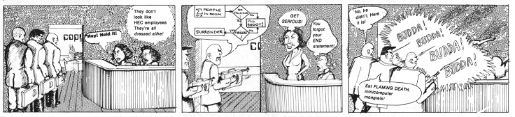

Easter egg

`Prev <../E.html>`__ 

E

 `Next <Easter-egging.html>`__

--------------

**Easter egg**: n.

[from the custom of the Easter Egg hunt observed in the U.S. and many
parts of Europe]

1. A message hidden in the object code of a program as a joke, intended
to be found by persons disassembling or browsing the code.

2. A message, graphic, or sound effect emitted by a program (or, on a
PC, the BIOS ROM) in response to some undocumented set of commands or
keystrokes, intended as a joke or to display program credits. One
well-known early Easter egg found in a couple of OSes caused them to
respond to the command **make love** with **not war?**. Many personal
computers have much more elaborate eggs hidden in ROM, including lists
of the developers' names, political exhortations, snatches of music, and
(in one case) graphics images of the entire development team.

--------------

+-------------------------+----------------------------+----------------------------------+
| `Prev <../E.html>`__    | `Up <../E.html>`__         |  `Next <Easter-egging.html>`__   |
+-------------------------+----------------------------+----------------------------------+
| E                       | `Home <../index.html>`__   |  Easter egging                   |
+-------------------------+----------------------------+----------------------------------+

Easter egging

`Prev <Easter-egg.html>`__ 

E

 `Next <eat-flaming-death.html>`__

--------------

**Easter egging**: n.

[IBM] The act of replacing unrelated components more or less at random
in hopes that a malfunction will go away. Hackers consider this the
normal operating mode of `*field circus* <../F/field-circus.html>`__
techs and do not love them for it. See also the jokes under `*field
circus* <../F/field-circus.html>`__. Compare `*shotgun
debugging* <../S/shotgun-debugging.html>`__.

--------------

+-------------------------------+----------------------------+--------------------------------------+
| `Prev <Easter-egg.html>`__    | `Up <../E.html>`__         |  `Next <eat-flaming-death.html>`__   |
+-------------------------------+----------------------------+--------------------------------------+
| Easter egg                    | `Home <../index.html>`__   |  eat flaming death                   |
+-------------------------------+----------------------------+--------------------------------------+

eat flaming death

`Prev <Easter-egging.html>`__ 

E

 `Next <EBCDIC.html>`__

--------------

**eat flaming death**: imp.

A construction popularized among hackers by the infamous `*CPU
Wars* <../C/CPU-Wars.html>`__ comic; supposedly derived from a famously
turgid line in a WWII-era anti-Nazi propaganda comic that ran “Eat
flaming death, non-Aryan mongrels!” or something of the sort (however,
it is also reported that on the Firesign Theatre's 1975 album *In The
Next World, You're On Your Own* a character won the right to scream “Eat
flaming death, fascist media pigs” in the middle of Oscar night on a
game show; this may have been an influence). Used in humorously
overblown expressions of hostility. “Eat flaming death,
`*EBCDIC* <EBCDIC.html>`__ users!”

|image0|

IPM tells us to `*eat flaming death* <eat-flaming-death.html>`__.

--------------

+----------------------------------+----------------------------+---------------------------+
| `Prev <Easter-egging.html>`__    | `Up <../E.html>`__         |  `Next <EBCDIC.html>`__   |
+----------------------------------+----------------------------+---------------------------+
| Easter egging                    | `Home <../index.html>`__   |  EBCDIC                   |
+----------------------------------+----------------------------+---------------------------+

EBCDIC

`Prev <eat-flaming-death.html>`__ 

E

 `Next <ECP.html>`__

--------------

**EBCDIC**: /eb´s@·dik/, /eb´see\`dik/, /eb´k@·dik/, n.

[abbreviation, Extended Binary Coded Decimal Interchange Code] An
alleged character set used on IBM
`*dinosaur* <../D/dinosaur.html>`__\ s. It exists in at least six
mutually incompatible versions, all featuring such delights as
non-contiguous letter sequences and the absence of several ASCII
punctuation characters fairly important for modern computer languages
(exactly which characters are absent varies according to which version
of EBCDIC you're looking at). IBM adapted EBCDIC from `*punched
card* <../P/punched-card.html>`__ code in the early 1960s and
promulgated it as a customer-control tactic (see `*connector
conspiracy* <../C/connector-conspiracy.html>`__), spurning the already
established ASCII standard. Today, IBM claims to be an open-systems
company, but IBM's own description of the EBCDIC variants and how to
convert between them is still internally classified top-secret,
burn-before-reading. Hackers blanch at the very *name* of EBCDIC and
consider it a manifestation of purest `*evil* <evil.html>`__. See also
`*fear and loathing* <../F/fear-and-loathing.html>`__.

--------------

+--------------------------------------+----------------------------+------------------------+
| `Prev <eat-flaming-death.html>`__    | `Up <../E.html>`__         |  `Next <ECP.html>`__   |
+--------------------------------------+----------------------------+------------------------+
| eat flaming death                    | `Home <../index.html>`__   |  ECP                   |
+--------------------------------------+----------------------------+------------------------+

ECP

`Prev <EBCDIC.html>`__ 

E

 `Next <ed.html>`__

--------------

**ECP**: /E·C·P/, n.

See `*spam* <../S/spam.html>`__ and `*velveeta* <../V/velveeta.html>`__.

--------------

+---------------------------+----------------------------+-----------------------+
| `Prev <EBCDIC.html>`__    | `Up <../E.html>`__         |  `Next <ed.html>`__   |
+---------------------------+----------------------------+-----------------------+
| EBCDIC                    | `Home <../index.html>`__   |  ed                   |
+---------------------------+----------------------------+-----------------------+

ed

`Prev <ECP.html>`__ 

E

 `Next <egg.html>`__

--------------

**ed**: n.

“ed is the standard text editor.” Line taken from the original
`*Unix* <../U/Unix.html>`__ manual page on ed, an ancient line-oriented
editor that is by now used only by a few `*Real
Programmer* <../R/Real-Programmer.html>`__\ s, and even then only for
batch operations. The original line is sometimes uttered near the
beginning of an emacs vs. vi holy war on
`*Usenet* <../U/Usenet.html>`__, with the (vain) hope to quench the
discussion before it really takes off. Often followed by a standard text
describing the many virtues of ed (such as the small memory
`*footprint* <../F/footprint.html>`__ on a Timex Sinclair, and the
consistent (because nearly non-existent) user interface).

--------------

+------------------------+----------------------------+------------------------+
| `Prev <ECP.html>`__    | `Up <../E.html>`__         |  `Next <egg.html>`__   |
+------------------------+----------------------------+------------------------+
| ECP                    | `Home <../index.html>`__   |  egg                   |
+------------------------+----------------------------+------------------------+

egg

`Prev <ed.html>`__ 

E

 `Next <egosurf.html>`__

--------------

**egg**: n.

The binary code that is the payload for buffer overflow and format
string attacks. Typically, an egg written in assembly and designed to
enable remote access or escalate privileges from an ordinary user
account to administrator level when it hatches. Also known as shellcode.

The name comes from a particular buffer-overflow exploit that was
co-written by a cracker named eggplant. The variable name ‘egg’ was used
to store the payload. The usage spread from people who saw and analyzed
the code.

--------------

+-----------------------+----------------------------+----------------------------+
| `Prev <ed.html>`__    | `Up <../E.html>`__         |  `Next <egosurf.html>`__   |
+-----------------------+----------------------------+----------------------------+
| ed                    | `Home <../index.html>`__   |  egosurf                   |
+-----------------------+----------------------------+----------------------------+

egosurf

`Prev <egg.html>`__ 

E

 `Next <eighty-column-mind.html>`__

--------------

**egosurf**: vi.

To search the net for your name or links to your web pages. Perhaps
connected to long-established SF-fan slang egoscan, to search for one's
name in a fanzine.

--------------

+------------------------+----------------------------+---------------------------------------+
| `Prev <egg.html>`__    | `Up <../E.html>`__         |  `Next <eighty-column-mind.html>`__   |
+------------------------+----------------------------+---------------------------------------+
| egg                    | `Home <../index.html>`__   |  eighty-column mind                   |
+------------------------+----------------------------+---------------------------------------+

eighty-column mind

`Prev <egosurf.html>`__ 

E

 `Next <El-Camino-Bignum.html>`__

--------------

**eighty-column mind**: n.

[IBM] The sort said to be possessed by persons for whom the transition
from `*punched card* <../P/punched-card.html>`__ to tape was traumatic
(nobody has dared tell them about disks yet). It is said that these
people, including (according to an old joke) the founder of IBM, will be
buried ‘face down, 9-edge first’ (the 9-edge being the bottom of the
card). This directive is inscribed on IBM's 1402 and 1622 card readers
and is referenced in a famous bit of doggerel called *The Last Bug*, the
climactic lines of which are as follows:

| 
|     He died at the console
|     Of hunger and thirst.
|     Next day he was buried,
|     Face down, 9-edge first.

The eighty-column mind was thought by most hackers to dominate IBM's
customer base and its thinking. This only began to change in the
mid-1990s when IBM began to reinvent itself after the triumph of the
`*killer micro* <../K/killer-micro.html>`__. See
`*IBM* <../I/IBM.html>`__, `*fear and
loathing* <../F/fear-and-loathing.html>`__, `*code
grinder* <../C/code-grinder.html>`__. A copy of *The Last Bug* lives on
the the GNU site at
`http://www.gnu.org/fun/jokes/last.bug.html <http://www.gnu.org/fun/jokes/last.bug.html>`__.

--------------

+----------------------------+----------------------------+-------------------------------------+
| `Prev <egosurf.html>`__    | `Up <../E.html>`__         |  `Next <El-Camino-Bignum.html>`__   |
+----------------------------+----------------------------+-------------------------------------+
| egosurf                    | `Home <../index.html>`__   |  El Camino Bignum                   |
+----------------------------+----------------------------+-------------------------------------+

El Camino Bignum

`Prev <eighty-column-mind.html>`__ 

E

 `Next <elder-days.html>`__

--------------

**El Camino Bignum**: /el´ k@·mee´noh big´nuhm/, n.

The road mundanely called El Camino Real, running along San Francisco
peninsula. It originally extended all the way down to Mexico City; many
portions of the old road are still intact. Navigation on the San
Francisco peninsula is usually done relative to El Camino Real, which
defines `*logical* <../L/logical.html>`__ north and south even though it
isn't really north-south in many places. El Camino Real runs right past
Stanford University and so is familiar to hackers.

The Spanish word ‘real’ (which has two syllables: /ray·ahl´/) means
‘royal’; El Camino Real is ‘the royal road’. In the FORTRAN language, a
real quantity is a number typically precise to seven significant digits,
and a double precision quantity is a larger floating-point number,
precise to perhaps fourteen significant digits (other languages have
similar real types).

When a hacker from MIT visited Stanford in 1976, he remarked what a long
road El Camino Real was. Making a pun on ‘real’, he started calling it
‘El Camino Double Precision’ — but when the hacker was told that the
road was hundreds of miles long, he renamed it ‘El Camino Bignum’, and
that name has stuck. (See `*bignum* <../B/bignum.html>`__.)

[GLS has since let slip that the unnamed hacker in this story was in
fact himself —ESR]

In the early 1990s, the synonym El Camino Virtual was been reported as
an alternate at IBM and Amdahl sites in the Valley.

Mathematically literate hackers in the Valley have also been heard to
refer to some major cross-street intersecting El Camino Real as “El
Camino Imaginary”. One popular theory is that the intersection is
located near Moffett Field — where they keep all those complex planes.

--------------

+---------------------------------------+----------------------------+-------------------------------+
| `Prev <eighty-column-mind.html>`__    | `Up <../E.html>`__         |  `Next <elder-days.html>`__   |
+---------------------------------------+----------------------------+-------------------------------+
| eighty-column mind                    | `Home <../index.html>`__   |  elder days                   |
+---------------------------------------+----------------------------+-------------------------------+

elder days

`Prev <El-Camino-Bignum.html>`__ 

E

 `Next <elegant.html>`__

--------------

**elder days**: n.

The heroic age of hackerdom (roughly, pre-1980); the era of the
`*PDP-10* <../P/PDP-10.html>`__, `*TECO* <../T/TECO.html>`__,
`*ITS* <../I/ITS.html>`__, and the ARPANET. This term has been rather
consciously adopted from J. R. R. Tolkien's fantasy epic *The Lord of
the Rings*. Compare `*Iron Age* <../I/Iron-Age.html>`__; see also
`*elvish* <elvish.html>`__ and `*Great Worm* <../G/Great-Worm.html>`__.

--------------

+-------------------------------------+----------------------------+----------------------------+
| `Prev <El-Camino-Bignum.html>`__    | `Up <../E.html>`__         |  `Next <elegant.html>`__   |
+-------------------------------------+----------------------------+----------------------------+
| El Camino Bignum                    | `Home <../index.html>`__   |  elegant                   |
+-------------------------------------+----------------------------+----------------------------+

elegant

`Prev <elder-days.html>`__ 

E

 `Next <elephantine.html>`__

--------------

**elegant**: adj.

[common; from mathematical usage] Combining simplicity, power, and a
certain ineffable grace of design. Higher praise than ‘clever’,
‘winning’, or even `*cuspy* <../C/cuspy.html>`__.

The French aviator, adventurer, and author Antoine de Saint-Exupéry,
probably best known for his classic children's book *The Little Prince*,
was also an aircraft designer. He gave us perhaps the best definition of
engineering elegance when he said “A designer knows he has achieved
perfection not when there is nothing left to add, but when there is
nothing left to take away.”

--------------

+-------------------------------+----------------------------+--------------------------------+
| `Prev <elder-days.html>`__    | `Up <../E.html>`__         |  `Next <elephantine.html>`__   |
+-------------------------------+----------------------------+--------------------------------+
| elder days                    | `Home <../index.html>`__   |  elephantine                   |
+-------------------------------+----------------------------+--------------------------------+

elephantine

`Prev <elegant.html>`__ 

E

 `Next <elevator-controller.html>`__

--------------

**elephantine**: adj.

Used of programs or systems that are both conspicuous
`*hog* <../H/hog.html>`__\ s (owing perhaps to poor design founded on
`*brute force and ignorance* <../B/brute-force-and-ignorance.html>`__)
and exceedingly `*hairy* <../H/hairy.html>`__ in source form. An
elephantine program may be functional and even friendly, but (as in the
old joke about being in bed with an elephant) it's tough to have around
all the same (and, like a pachyderm, difficult to maintain). In extreme
cases, hackers have been known to make trumpeting sounds or perform
expressive proboscatory mime at the mention of the offending program.
Usage: semi-humorous. Compare ‘has the elephant nature’ and the somewhat
more pejorative `*monstrosity* <../M/monstrosity.html>`__. See also
`*second-system effect* <../S/second-system-effect.html>`__ and
`*baroque* <../B/baroque.html>`__.

--------------

+----------------------------+----------------------------+----------------------------------------+
| `Prev <elegant.html>`__    | `Up <../E.html>`__         |  `Next <elevator-controller.html>`__   |
+----------------------------+----------------------------+----------------------------------------+
| elegant                    | `Home <../index.html>`__   |  elevator controller                   |
+----------------------------+----------------------------+----------------------------------------+

elevator controller

`Prev <elephantine.html>`__ 

E

 `Next <elite.html>`__

--------------

**elevator controller**: n.

An archetypal dumb embedded-systems application, like
`*toaster* <../T/toaster.html>`__ (which superseded it). During one
period (1983--84) in the deliberations of ANSI X3J11 (the C
standardization committee) this was the canonical example of a really
stupid, memory-limited computation environment. “You can't require
printf(3) to be part of the default runtime library — what if you're
targeting an elevator controller?” Elevator controllers became important
rhetorical weapons on both sides of several `*holy
wars* <../H/holy-wars.html>`__.

--------------

+--------------------------------+----------------------------+--------------------------+
| `Prev <elephantine.html>`__    | `Up <../E.html>`__         |  `Next <elite.html>`__   |
+--------------------------------+----------------------------+--------------------------+
| elephantine                    | `Home <../index.html>`__   |  elite                   |
+--------------------------------+----------------------------+--------------------------+

elite

`Prev <elevator-controller.html>`__ 

E

 `Next <ELIZA-effect.html>`__

--------------

**elite**: adj.

Clueful. Plugged-in. One of the cognoscenti. Also used as a general
positive adjective. This term is not actually native hacker slang; it is
used primarily by crackers and `*warez
d00dz* <../W/warez-d00dz.html>`__, for which reason hackers use it only
with heavy irony. The term used to refer to the folks allowed in to the
“hidden” or “privileged” sections of BBSes in the early 1980s (which,
typically, contained pirated software). Frequently, early boards would
only let you post, or even see, a certain subset of the sections (or
‘boards’) on a BBS. Those who got to the frequently legendary ‘triple
super secret’ boards were elite. Misspellings of this term in warez
d00dz style abound; the forms l337 eleet, and 31337 (among others) have
been sighted.

A true hacker would be more likely to use ‘wizardly’. Oppose
`*lamer* <../L/lamer.html>`__.

--------------

+----------------------------------------+----------------------------+---------------------------------+
| `Prev <elevator-controller.html>`__    | `Up <../E.html>`__         |  `Next <ELIZA-effect.html>`__   |
+----------------------------------------+----------------------------+---------------------------------+
| elevator controller                    | `Home <../index.html>`__   |  ELIZA effect                   |
+----------------------------------------+----------------------------+---------------------------------+

ELIZA effect

`Prev <elite.html>`__ 

E

 `Next <elvish.html>`__

--------------

**ELIZA effect**: /@·li:´z@ @·fekt´/, n.

[AI community] The tendency of humans to attach associations to terms
from prior experience. For example, there is nothing magic about the
symbol ``+`` that makes it well-suited to indicate addition; it's just
that people associate it with addition. Using ``+`` or ‘plus’ to mean
addition in a computer language is taking advantage of the ELIZA effect.

This term comes from the famous ELIZA program by Joseph Weizenbaum,
which simulated a Rogerian psychotherapist by re­phrasing many of the
patient's statements as questions and posing them to the patient. It
worked by simple pattern recognition and substitution of key words into
canned phrases. It was so convincing, however, that there are many
anecdotes about people becoming very emotionally caught up in dealing
with ELIZA. All this was due to people's tendency to attach to words
meanings which the computer never put there. The ELIZA effect is a
`*Good Thing* <../G/Good-Thing.html>`__ when writing a programming
language, but it can blind you to serious shortcomings when analyzing an
Artificial Intelligence system. Compare
`*ad-hockery* <../A/ad-hockery.html>`__; see also
`*AI-complete* <../A/AI-complete.html>`__. Sources for a clone of the
original Eliza are available at
`ftp://ftp.cc.utexas.edu/pub/AI\_ATTIC/Programs/Classic/Eliza/Eliza.c <ftp://ftp.cc.utexas.edu/pub/AI-ATTIC/Programs/Classic/Eliza/Eliza.c>`__.

--------------

+--------------------------+----------------------------+---------------------------+
| `Prev <elite.html>`__    | `Up <../E.html>`__         |  `Next <elvish.html>`__   |
+--------------------------+----------------------------+---------------------------+
| elite                    | `Home <../index.html>`__   |  elvish                   |
+--------------------------+----------------------------+---------------------------+

elvish

`Prev <ELIZA-effect.html>`__ 

E

 `Next <EMACS.html>`__

--------------

**elvish**: n.

1. The Tengwar of Feanor, a table of letterforms resembling the
beautiful Celtic half-uncial hand of the *Book of Kells*. Invented and
described by J. R. R. Tolkien in *The Lord of The Rings* as an
orthography for his fictional ‘elvish’ languages, this system (which is
both visually and phonetically `*elegant* <elegant.html>`__) has long
fascinated hackers (who tend to be intrigued by artificial languages in
general). It is traditional for graphics printers, plotters, window
systems, and the like to support a Feanorian typeface as one of their
demo items. See also `*elder days* <elder-days.html>`__.

2. By extension, any odd or unreadable typeface produced by a graphics
device.

3. The typeface mundanely called ‘Böcklin’, an art-Noveau display font.

--------------

+---------------------------------+----------------------------+--------------------------+
| `Prev <ELIZA-effect.html>`__    | `Up <../E.html>`__         |  `Next <EMACS.html>`__   |
+---------------------------------+----------------------------+--------------------------+
| ELIZA effect                    | `Home <../index.html>`__   |  EMACS                   |
+---------------------------------+----------------------------+--------------------------+

EMACS

`Prev <elvish.html>`__ 

E

 `Next <email.html>`__

--------------

**EMACS**: /ee´maks/, n.

[from Editing MACroS] The ne plus ultra of hacker editors, a
programmable text editor with an entire LISP system inside it. It was
originally written by Richard Stallman in `*TECO* <../T/TECO.html>`__
under `*ITS* <../I/ITS.html>`__ at the MIT AI lab; AI Memo 554 described
it as “an advanced, self-documenting, customizable, extensible real-time
display editor”. It has since been reimplemented any number of times, by
various hackers, and versions exist that run under most major operating
systems. Perhaps the most widely used version, also written by Stallman
and now called “\ `*GNU* <../G/GNU.html>`__ EMACS” or
`*GNUMACS* <../G/GNUMACS.html>`__, runs principally under Unix. (Its
close relative XEmacs is the second most popular version.) It includes
facilities to run compilation subprocesses and send and receive mail or
news; many hackers spend up to 80% of their `*tube
time* <../T/tube-time.html>`__ inside it. Other variants include
`*GOSMACS* <../G/GOSMACS.html>`__, CCA EMACS, UniPress EMACS, Montgomery
EMACS, jove, epsilon, and MicroEMACS. (Though we use the original
all-caps spelling here, it is nowadays very commonly ‘Emacs’.) Some
EMACS versions running under window managers iconify as an overflowing
kitchen sink, perhaps to suggest the one feature the editor does not
(yet) include. Indeed, some hackers find EMACS too
`*heavyweight* <../H/heavyweight.html>`__ and
`*baroque* <../B/baroque.html>`__ for their taste, and expand the name
as ‘Escape Meta Alt Control Shift’ to spoof its heavy reliance on
keystrokes decorated with `*bucky bits* <../B/bucky-bits.html>`__. Other
spoof expansions include ‘Eight Megabytes And Constantly Swapping’ (from
when that was a lot of `*core* <../C/core.html>`__), ‘Eventually
malloc()s All Computer Storage’, and ‘EMACS Makes A Computer Slow’ (see
`*recursive acronym* <../R/recursive-acronym.html>`__). See also
`*vi* <../V/vi.html>`__.

--------------

+---------------------------+----------------------------+--------------------------+
| `Prev <elvish.html>`__    | `Up <../E.html>`__         |  `Next <email.html>`__   |
+---------------------------+----------------------------+--------------------------+
| elvish                    | `Home <../index.html>`__   |  email                   |
+---------------------------+----------------------------+--------------------------+

email

`Prev <EMACS.html>`__ 

E

 `Next <emoticon.html>`__

--------------

**email**: /ee´mayl/

(also written ‘e-mail’ and ‘E-mail’)

1. n. Electronic mail automatically passed through computer networks
and/or via modems over common-carrier lines. Contrast
`*snail-mail* <../S/snail-mail.html>`__,
`*paper-net* <../P/paper-net.html>`__,
`*voice-net* <../V/voice-net.html>`__. See `*network
address* <../N/network-address.html>`__.

2. vt. To send electronic mail.

Oddly enough, the word emailed is actually listed in the OED; it means
“embossed (with a raised pattern) or perh. arranged in a net or open
work”. A use from 1480 is given. The word is probably derived from
French émaillé (enameled) and related to Old French emmailleüre
(network). A French correspondent tells us that in modern French,
‘email’ is a hard enamel obtained by heating special paints in a
furnace; an ‘emailleur’ (no final e) is a craftsman who makes email (he
generally paints some objects (like, say, jewelry) and cooks them in a
furnace).

There are numerous spelling variants of this word. In Internet traffic
up to 1995, ‘email’ predominates, ‘e-mail’ runs a not-too-distant
second, and ‘E-mail’ and ‘Email’ are a distant third and fourth.

--------------

+--------------------------+----------------------------+-----------------------------+
| `Prev <EMACS.html>`__    | `Up <../E.html>`__         |  `Next <emoticon.html>`__   |
+--------------------------+----------------------------+-----------------------------+
| EMACS                    | `Home <../index.html>`__   |  emoticon                   |
+--------------------------+----------------------------+-----------------------------+

emoticon

`Prev <email.html>`__ 

E

 `Next <EMP.html>`__

--------------

**emoticon**: /ee·moh´ti·kon/, n.

[common] An ASCII glyph used to indicate an emotional state in email or
news. Although originally intended mostly as jokes, emoticons (or some
other explicit humor indication) are virtually required under certain
circumstances in high-volume text-only communication forums such as
Usenet; the lack of verbal and visual cues can otherwise cause what were
intended to be humorous, sarcastic, ironic, or otherwise
non-100%-serious comments to be badly misinterpreted (not always even by
`*newbie* <../N/newbie.html>`__\ s), resulting in arguments and `*flame
war* <../F/flame-war.html>`__\ s.

Hundreds of emoticons have been proposed, but only a few are in common
use. These include:

+-------+-----------------------------------------------------------------------------------------------------------------------+
| :-)   | ‘smiley face’ (for humor, laughter, friendliness, occasionally sarcasm)                                               |
+-------+-----------------------------------------------------------------------------------------------------------------------+
| :-(   | ‘frowney face’ (for sadness, anger, or upset)                                                                         |
+-------+-----------------------------------------------------------------------------------------------------------------------+
| ;-)   | ‘half-smiley’ ( `*ha ha only serious* <../H/ha-ha-only-serious.html>`__); also known as semi-smiley or winkey face.   |
+-------+-----------------------------------------------------------------------------------------------------------------------+
| :-/   | ‘wry face’                                                                                                            |
+-------+-----------------------------------------------------------------------------------------------------------------------+

(These may become more comprehensible if you tilt your head sideways, to
the left.) The first two listed are by far the most frequently
encountered. Hyphenless forms of them are common on CompuServe, GEnie,
and BIX; see also `*bixie* <../B/bixie.html>`__. On
`*Usenet* <../U/Usenet.html>`__, smiley is often used as a generic term
synonymous with `*emoticon* <emoticon.html>`__, as well as specifically
for the happy-face emoticon.

The invention of the original smiley and frowney emoticons is generally
credited to Scott Fahlman at CMU in 1982. He later wrote: “I wish I had
saved the original post, or at least recorded the date for posterity,
but I had no idea that I was starting something that would soon pollute
all the world's communication channels.” In September 2002 the original
post `was
recovered <http://research.microsoft.com/~mbj/Smiley/Smiley.html>`__.

There is a rival claim by one Kevin McKenzie, who seems to have proposed
the smiley on the MsgGroup mailing list, April 12 1979. It seems likely
these two inventions were independent. Users of the PLATO educational
system `report <%20http://www.platopeople.com/emoticons.html>`__ using
emoticons composed from overlaid dot-matrix graphics in the 1970s.

Note for the `*newbie* <../N/newbie.html>`__: Overuse of the smiley is a
mark of loserhood! More than one per paragraph is a fairly sure sign
that you've gone over the line.

--------------

+--------------------------+----------------------------+------------------------+
| `Prev <email.html>`__    | `Up <../E.html>`__         |  `Next <EMP.html>`__   |
+--------------------------+----------------------------+------------------------+
| email                    | `Home <../index.html>`__   |  EMP                   |
+--------------------------+----------------------------+------------------------+

EMP

`Prev <emoticon.html>`__ 

E

 `Next <empire.html>`__

--------------

**EMP**: /E·M·P/

See `*spam* <../S/spam.html>`__.

--------------

+-----------------------------+----------------------------+---------------------------+
| `Prev <emoticon.html>`__    | `Up <../E.html>`__         |  `Next <empire.html>`__   |
+-----------------------------+----------------------------+---------------------------+
| emoticon                    | `Home <../index.html>`__   |  empire                   |
+-----------------------------+----------------------------+---------------------------+

empire

`Prev <EMP.html>`__ 

E

 `Next <engine.html>`__

--------------

**empire**: n.

Any of a family of military simulations derived from a game written by
Peter Langston many years ago. A number of multi-player variants of
varying degrees of sophistication exist, and one single-player version
implemented for both Unix and VMS; the latter is even available as
MS-DOS/Windows freeware. All are notoriously addictive. Of various
commercial derivatives the best known is probably “Empire Deluxe” on PCs
and Amigas.

Modern empire is a real-time wargame played over the internet by up to
120 players. Typical games last from 24 hours (blitz) to a couple of
months (long term). The amount of sleep you can get while playing is a
function of the rate at which updates occur and the number of co-rulers
of your country. Empire server software is available for Unix-like
machines, and clients for Unix and other platforms. A comprehensive
history of the game is available at
`http://www.empire.cx/infopages/History.html <http://www.wolfpackempire.com/infopages/History.html>`__.
The Empire resource site is at
`http://www.empire.cx/ <http://www.empire.cx/>`__.

--------------

+------------------------+----------------------------+---------------------------+
| `Prev <EMP.html>`__    | `Up <../E.html>`__         |  `Next <engine.html>`__   |
+------------------------+----------------------------+---------------------------+
| EMP                    | `Home <../index.html>`__   |  engine                   |
+------------------------+----------------------------+---------------------------+

engine

`Prev <empire.html>`__ 

E

 `Next <English.html>`__

--------------

**engine**: n.

1. A piece of hardware that encapsulates some function but can't be used
without some kind of `*front end* <../F/front-end.html>`__. Today we
have, especially, print engine: the guts of a laser printer.

2. An analogous piece of software; notionally, one that does a lot of
noisy crunching, such as a database engine.

The hacker senses of engine are actually close to its original,
pre-Industrial-Revolution sense of a skill, clever device, or instrument
(the word is cognate to ‘ingenuity’). This sense had not been completely
eclipsed by the modern connotation of power-transducing machinery in
Charles Babbage's time, which explains why he named the stored-program
computer that he designed in 1844 the Analytical Engine.

--------------

+---------------------------+----------------------------+----------------------------+
| `Prev <empire.html>`__    | `Up <../E.html>`__         |  `Next <English.html>`__   |
+---------------------------+----------------------------+----------------------------+
| empire                    | `Home <../index.html>`__   |  English                   |
+---------------------------+----------------------------+----------------------------+

English

`Prev <engine.html>`__ 

E

 `Next <enhancement.html>`__

--------------

**English**

1. n. obs. The source code for a program, which may be in any language,
as opposed to the linkable or executable binary produced from it by a
compiler. The idea behind the term is that to a real hacker, a program
written in his favorite programming language is at least as readable as
English. Usage: mostly by old-time hackers, though recognizable in
context. Today the preferred shorthand is simply
`*source* <../S/source.html>`__.

2. The official name of the database language used by the old Pick
Operating System, actually a sort of crufty, brain-damaged SQL with
delusions of grandeur. The name permitted
`*marketroid* <../M/marketroid.html>`__\ s to say “Yes, and you can
program our computers in English!” to ignorant
`*suit* <../S/suit.html>`__\ s without quite running afoul of the
truth-in-advertising laws.

--------------

+---------------------------+----------------------------+--------------------------------+
| `Prev <engine.html>`__    | `Up <../E.html>`__         |  `Next <enhancement.html>`__   |
+---------------------------+----------------------------+--------------------------------+
| engine                    | `Home <../index.html>`__   |  enhancement                   |
+---------------------------+----------------------------+--------------------------------+

enhancement

`Prev <English.html>`__ 

E

 `Next <ENQ.html>`__

--------------

**enhancement**: n.

Common `*marketroid* <../M/marketroid.html>`__-speak for a bug
`*fix* <../F/fix.html>`__. This abuse of language is a popular and
time-tested way to turn incompetence into increased revenue. A hacker
being ironic would instead call the fix a
`*feature* <../F/feature.html>`__ — or perhaps save some effort by
declaring the bug itself to be a feature.

--------------

+----------------------------+----------------------------+------------------------+
| `Prev <English.html>`__    | `Up <../E.html>`__         |  `Next <ENQ.html>`__   |
+----------------------------+----------------------------+------------------------+
| English                    | `Home <../index.html>`__   |  ENQ                   |
+----------------------------+----------------------------+------------------------+

ENQ

`Prev <enhancement.html>`__ 

E

 `Next <EOD.html>`__

--------------

**ENQ**: /enkw/, /enk/

[from the ASCII mnemonic ENQuire for 0000101] An on-line convention for
querying someone's availability. After opening a `*talk
mode* <../T/talk-mode.html>`__ connection to someone apparently in heavy
hack mode, one might type **SYN SYN ENQ?** (the SYNs representing
notional synchronization bytes), and expect a return of
`*ACK* <../A/ACK.html>`__ or `*NAK* <../N/NAK.html>`__ depending on
whether or not the person felt interruptible. Compare
`*ping* <../P/ping.html>`__, `*finger* <../F/finger.html>`__, and the
usage of **FOO?** listed under `*talk mode* <../T/talk-mode.html>`__.

--------------

+--------------------------------+----------------------------+------------------------+
| `Prev <enhancement.html>`__    | `Up <../E.html>`__         |  `Next <EOD.html>`__   |
+--------------------------------+----------------------------+------------------------+
| enhancement                    | `Home <../index.html>`__   |  EOD                   |
+--------------------------------+----------------------------+------------------------+

EOD

`Prev <ENQ.html>`__ 

E

 `Next <EOF.html>`__

--------------

**EOD**: n.

[IRC, Usenet] Abbreviation: End of Discussion. Used when the speaker
believes he has stated his case and will not respond to further
arguments or attacks.

--------------

+------------------------+----------------------------+------------------------+
| `Prev <ENQ.html>`__    | `Up <../E.html>`__         |  `Next <EOF.html>`__   |
+------------------------+----------------------------+------------------------+
| ENQ                    | `Home <../index.html>`__   |  EOF                   |
+------------------------+----------------------------+------------------------+

EOF

`Prev <EOD.html>`__ 

E

 `Next <EOL.html>`__

--------------

**EOF**: /E·O·F/, n.

[abbreviation, ‘End Of File’]

1. [techspeak] The `*out-of-band* <../O/out-of-band.html>`__ value
returned by C's sequential character-input functions (and their
equivalents in other environments) when end of file has been reached.
This value is usually ``-1`` under C libraries postdating V6 Unix, but
was originally ``0``. DOS hackers think EOF is ^Z, and a few Amiga
hackers think it's ^\\.

2. [Unix] The keyboard character (usually control-D, the ASCII EOT (End
Of Transmission) character) that is mapped by the terminal driver into
an end-of-file condition.

3. Used by extension in non-computer contexts when a human is doing
something that can be modeled as a sequential read and can't go further.
“Yeah, I looked for a list of 360 mnemonics to post as a joke, but I hit
EOF pretty fast; all the library had was a `*JCL* <../J/JCL.html>`__
manual.” See also `*EOL* <EOL.html>`__.

--------------

+------------------------+----------------------------+------------------------+
| `Prev <EOD.html>`__    | `Up <../E.html>`__         |  `Next <EOL.html>`__   |
+------------------------+----------------------------+------------------------+
| EOD                    | `Home <../index.html>`__   |  EOL                   |
+------------------------+----------------------------+------------------------+

EOL

`Prev <EOF.html>`__ 

E

 `Next <EOU.html>`__

--------------

**EOL**: /E·O·L/, n.

[End Of Line] Syn. for `*newline* <../N/newline.html>`__, derived
perhaps from the original CDC6600 Pascal. Now rare, but widely
recognized and occasionally used for brevity. Used in the example entry
under `*BNF* <../B/BNF.html>`__. See also `*EOF* <EOF.html>`__.

--------------

+------------------------+----------------------------+------------------------+
| `Prev <EOF.html>`__    | `Up <../E.html>`__         |  `Next <EOU.html>`__   |
+------------------------+----------------------------+------------------------+
| EOF                    | `Home <../index.html>`__   |  EOU                   |
+------------------------+----------------------------+------------------------+

EOU

`Prev <EOL.html>`__ 

E

 `Next <epoch.html>`__

--------------

**EOU**: /E·O·U/, n.

The mnemonic of a mythical ASCII control character (End Of User) that
would make an ASR-33 Teletype explode on receipt. This construction
parodies the numerous obscure delimiter and control characters left in
ASCII from the days when it was associated more with wire-service
teletypes than computers (e.g., FS, GS, RS, US, EM, SUB, ETX, and esp.
EOT). It is worth remembering that ASR-33s were big, noisy mechanical
beasts with a lot of clattering parts; the notion that one might explode
was nowhere near as ridiculous as it might seem to someone sitting in
front of a `*tube* <../T/tube.html>`__ or flatscreen today.

--------------

+------------------------+----------------------------+--------------------------+
| `Prev <EOL.html>`__    | `Up <../E.html>`__         |  `Next <epoch.html>`__   |
+------------------------+----------------------------+--------------------------+
| EOL                    | `Home <../index.html>`__   |  epoch                   |
+------------------------+----------------------------+--------------------------+

epoch

`Prev <EOU.html>`__ 

E

 `Next <epsilon.html>`__

--------------

**epoch**: n.

[Unix: prob.: from astronomical timekeeping] The time and date
corresponding to 0 in an operating system's clock and timestamp values.
Under most Unix versions the epoch is 00:00:00 GMT, January 1, 1970;
under VMS, it's 00:00:00 of November 17, 1858 (base date of the U.S.
Naval Observatory's ephemerides); on a Macintosh, it's the midnight
beginning January 1 1904. System time is measured in seconds or
`*tick* <../T/tick.html>`__\ s past the epoch. Weird problems may ensue
when the clock wraps around (see `*wrap
around* <../W/wrap-around.html>`__), which is not necessarily a rare
event; on systems counting 10 ticks per second, a signed 32-bit count of
ticks is good only for 6.8 years. The 1-tick-per-second clock of Unix is
good only until January 18, 2038, assuming at least some software
continues to consider it signed and that word lengths don't increase by
then. See also `*wall time* <../W/wall-time.html>`__. Microsoft Windows,
on the other hand, has an epoch problem every 49.7 days — but this is
seldom noticed as Windows is almost incapable of staying up continuously
for that long.

--------------

+------------------------+----------------------------+----------------------------+
| `Prev <EOU.html>`__    | `Up <../E.html>`__         |  `Next <epsilon.html>`__   |
+------------------------+----------------------------+----------------------------+
| EOU                    | `Home <../index.html>`__   |  epsilon                   |
+------------------------+----------------------------+----------------------------+

epsilon

`Prev <epoch.html>`__ 

E

 `Next <epsilon-squared.html>`__

--------------

**epsilon**

[see `*delta* <../D/delta.html>`__]

1. n. A small quantity of anything. “The cost is epsilon.”

2. adj. Very small, negligible; less than
`*marginal* <../M/marginal.html>`__. “We can get this feature for
epsilon cost.”

3. within epsilon of: close enough to be indistinguishable for all
practical purposes, even closer than being within delta of. “That's not
what I asked for, but it's within epsilon of what I wanted.”
Alternatively, it may mean not close enough, but very little is required
to get it there: “My program is within epsilon of working.”

--------------

+--------------------------+----------------------------+------------------------------------+
| `Prev <epoch.html>`__    | `Up <../E.html>`__         |  `Next <epsilon-squared.html>`__   |
+--------------------------+----------------------------+------------------------------------+
| epoch                    | `Home <../index.html>`__   |  epsilon squared                   |
+--------------------------+----------------------------+------------------------------------+

epsilon squared

`Prev <epsilon.html>`__ 

E

 `Next <era.html>`__

--------------

**epsilon squared**: n.

A quantity even smaller than `*epsilon* <epsilon.html>`__, as small in
comparison to epsilon as epsilon is to something normal; completely
negligible. If you buy a supercomputer for a million dollars, the cost
of the thousand-dollar terminal to go with it is
`*epsilon* <epsilon.html>`__, and the cost of the ten-dollar cable to
connect them is epsilon squared. Compare `*lost in the
underflow* <../L/lost-in-the-underflow.html>`__, `*lost in the
noise* <../L/lost-in-the-noise.html>`__.

--------------

+----------------------------+----------------------------+------------------------+
| `Prev <epsilon.html>`__    | `Up <../E.html>`__         |  `Next <era.html>`__   |
+----------------------------+----------------------------+------------------------+
| epsilon                    | `Home <../index.html>`__   |  era                   |
+----------------------------+----------------------------+------------------------+

era

`Prev <epsilon-squared.html>`__ 

E

 `Next <Eric-Conspiracy.html>`__

--------------

**era**: n.

Syn. `*epoch* <epoch.html>`__. Webster's Unabridged makes these words
almost synonymous, but era more often connotes a span of time rather
than a point in time, whereas the reverse is true for
`*epoch* <epoch.html>`__. The `*epoch* <epoch.html>`__ usage is
recommended.

--------------

+------------------------------------+----------------------------+------------------------------------+
| `Prev <epsilon-squared.html>`__    | `Up <../E.html>`__         |  `Next <Eric-Conspiracy.html>`__   |
+------------------------------------+----------------------------+------------------------------------+
| epsilon squared                    | `Home <../index.html>`__   |  Eric Conspiracy                   |
+------------------------------------+----------------------------+------------------------------------+

Eric Conspiracy

`Prev <era.html>`__ 

E

 `Next <Eris.html>`__

--------------

**Eric Conspiracy**: n.

A shadowy group of mustachioed hackers named Eric first pinpointed as a
sinister conspiracy by an infamous ``talk.bizarre`` posting ca. 1987;
this was doubtless influenced by the numerous ‘Eric’ jokes in the Monty
Python oeuvre. There do indeed seem to be considerably more mustachioed
Erics in hackerdom than the frequency of these three traits can account
for unless they are correlated in some arcane way. Well-known examples
include Eric Allman (he of the ‘Allman style’ described under `*indent
style* <../I/indent-style.html>`__) and Erik Fair (co-author of NNTP);
your editor has heard from more than a hundred others by email, and the
organization line ‘Eric Conspiracy Secret Laboratories’ now emanates
regularly from more than one site. See the Eric Conspiracy Web Page at
`http://www.catb.org/~esr/ecsl/ <http://www.catb.org/~esr/ecsl/>`__ for
full details.

--------------

+------------------------+----------------------------+-------------------------+
| `Prev <era.html>`__    | `Up <../E.html>`__         |  `Next <Eris.html>`__   |
+------------------------+----------------------------+-------------------------+
| era                    | `Home <../index.html>`__   |  Eris                   |
+------------------------+----------------------------+-------------------------+

Eris

`Prev <Eric-Conspiracy.html>`__ 

E

 `Next <erotics.html>`__

--------------

**Eris**: /e´ris/, n.

The Greek goddess of Chaos, Discord, Confusion, and Things You Know Not
Of; her name was latinized to Discordia and she was worshiped by that
name in Rome. Not a very friendly deity in the Classical original, she
was reinvented as a more benign personification of creative anarchy
starting in 1959 by the adherents of
`*Discordianism* <../D/Discordianism.html>`__ and has since been a
semi-serious subject of veneration in several ‘fringe’ cultures,
including hackerdom. See `*Discordianism* <../D/Discordianism.html>`__,
`*Church of the SubGenius* <../C/Church-of-the-SubGenius.html>`__.

--------------

+------------------------------------+----------------------------+----------------------------+
| `Prev <Eric-Conspiracy.html>`__    | `Up <../E.html>`__         |  `Next <erotics.html>`__   |
+------------------------------------+----------------------------+----------------------------+
| Eric Conspiracy                    | `Home <../index.html>`__   |  erotics                   |
+------------------------------------+----------------------------+----------------------------+

erotics

`Prev <Eris.html>`__ 

E

 `Next <error-33.html>`__

--------------

**erotics**: /ee·ro´tiks/, n.

[Helsinki University of Technology, Finland] n. English-language
university slang for electronics. Often used by hackers in Helsinki,
maybe because good electronics excites them and makes them warm.

--------------

+-------------------------+----------------------------+-----------------------------+
| `Prev <Eris.html>`__    | `Up <../E.html>`__         |  `Next <error-33.html>`__   |
+-------------------------+----------------------------+-----------------------------+
| Eris                    | `Home <../index.html>`__   |  error 33                   |
+-------------------------+----------------------------+-----------------------------+

error 33

`Prev <erotics.html>`__ 

E

 `Next <eurodemo.html>`__

--------------

**error 33**: n.

1. [XEROX PARC] Predicating one research effort upon the success of
another.

2. Allowing your own research effort to be placed on the critical path
of some other project (be it a research effort or not).

--------------

+----------------------------+----------------------------+-----------------------------+
| `Prev <erotics.html>`__    | `Up <../E.html>`__         |  `Next <eurodemo.html>`__   |
+----------------------------+----------------------------+-----------------------------+
| erotics                    | `Home <../index.html>`__   |  eurodemo                   |
+----------------------------+----------------------------+-----------------------------+

eurodemo

`Prev <error-33.html>`__ 

E

 `Next <evil.html>`__

--------------

**eurodemo**: /yoor´o·dem\`·o/

a `*demo* <../D/demo.html>`__, sense 4

--------------

+-----------------------------+----------------------------+-------------------------+
| `Prev <error-33.html>`__    | `Up <../E.html>`__         |  `Next <evil.html>`__   |
+-----------------------------+----------------------------+-------------------------+
| error 33                    | `Home <../index.html>`__   |  evil                   |
+-----------------------------+----------------------------+-------------------------+

evil and rude

`Prev <evil.html>`__ 

E

 `Next <Evil-Empire.html>`__

--------------

**evil and rude**: adj.

Both `*evil* <evil.html>`__ and `*rude* <../R/rude.html>`__, but with
the additional connotation that the rudeness was due to malice rather
than incompetence. Thus, for example: Microsoft's Windows NT is evil
because it's a competent implementation of a bad design; it's rude
because it's gratuitously incompatible with Unix in places where
compatibility would have been as easy and effective to do; but it's evil
and rude because the incompatibilities are apparently there not to fix
design bugs in Unix but rather to lock hapless customers and developers
into the Microsoft way. Hackish evil and rude is close to the mainstream
sense of ‘evil’.

--------------

+-------------------------+----------------------------+--------------------------------+
| `Prev <evil.html>`__    | `Up <../E.html>`__         |  `Next <Evil-Empire.html>`__   |
+-------------------------+----------------------------+--------------------------------+
| evil                    | `Home <../index.html>`__   |  Evil Empire                   |
+-------------------------+----------------------------+--------------------------------+

Evil Empire

`Prev <evil-and-rude.html>`__ 

E

 `Next <exa-.html>`__

--------------

**Evil Empire**: n.

[from Ronald Reagan's famous characterization of the communist Soviet
Union] Formerly `*IBM* <../I/IBM.html>`__, now
`*Microsoft* <../M/Microsoft.html>`__. Functionally, the company most
hackers love to hate at any given time. Hackers like to see themselves
as romantic rebels against the Evil Empire, and frequently adopt this
role to the point of ascribing rather more power and malice to the
Empire than it actually has. See also `*Borg* <../B/Borg.html>`__ and
search for ‘Evil Empire’ pages on the Web.

--------------

+----------------------------------+----------------------------+-------------------------+
| `Prev <evil-and-rude.html>`__    | `Up <../E.html>`__         |  `Next <exa-.html>`__   |
+----------------------------------+----------------------------+-------------------------+
| evil and rude                    | `Home <../index.html>`__   |  exa-                   |
+----------------------------------+----------------------------+-------------------------+

evil

`Prev <eurodemo.html>`__ 

E

 `Next <evil-and-rude.html>`__

--------------

**evil**: adj.

As used by hackers, implies that some system, program, person, or
institution is sufficiently maldesigned as to be not worth the bother of
dealing with. Unlike the adjectives in the
`*cretinous* <../C/cretinous.html>`__/`*losing* <../L/losing.html>`__/`*brain-damaged* <../B/brain-damaged.html>`__
series, evil does not imply incompetence or bad design, but rather a set
of goals or design criteria fatally incompatible with the speaker's.
This usage is more an esthetic and engineering judgment than a moral one
in the mainstream sense. “We thought about adding a `*Blue
Glue* <../B/Blue-Glue.html>`__ interface but decided it was too evil to
deal with.” “\ `*TECO* <../T/TECO.html>`__ is neat, but it can be pretty
evil if you're prone to typos.” Often pronounced with the first syllable
lengthened, as /eeee'vil/. Compare `*evil and
rude* <evil-and-rude.html>`__.

--------------

+-----------------------------+----------------------------+----------------------------------+
| `Prev <eurodemo.html>`__    | `Up <../E.html>`__         |  `Next <evil-and-rude.html>`__   |
+-----------------------------+----------------------------+----------------------------------+
| eurodemo                    | `Home <../index.html>`__   |  evil and rude                   |
+-----------------------------+----------------------------+----------------------------------+

exa-

`Prev <Evil-Empire.html>`__ 

E

 `Next <examining-the-entrails.html>`__

--------------

**exa-**: /ek´s@/, pref.

[SI] See `*quantifiers* <../Q/quantifiers.html>`__.

--------------

+--------------------------------+----------------------------+-------------------------------------------+
| `Prev <Evil-Empire.html>`__    | `Up <../E.html>`__         |  `Next <examining-the-entrails.html>`__   |
+--------------------------------+----------------------------+-------------------------------------------+
| Evil Empire                    | `Home <../index.html>`__   |  examining the entrails                   |
+--------------------------------+----------------------------+-------------------------------------------+

examining the entrails

`Prev <exa-.html>`__ 

E

 `Next <EXCH.html>`__

--------------

**examining the entrails**: n.

The process of `*grovel* <../G/grovel.html>`__\ ling through a `*core
dump* <../C/core-dump.html>`__ or hex image in an attempt to discover
the bug that brought a program or system down. The reference is to
divination from the entrails of a sacrificed animal. Compare
`*runes* <../R/runes.html>`__,
`*incantation* <../I/incantation.html>`__, `*black
art* <../B/black-art.html>`__.

--------------

+-------------------------+----------------------------+-------------------------+
| `Prev <exa-.html>`__    | `Up <../E.html>`__         |  `Next <EXCH.html>`__   |
+-------------------------+----------------------------+-------------------------+
| exa-                    | `Home <../index.html>`__   |  EXCH                   |
+-------------------------+----------------------------+-------------------------+

EXCH

`Prev <examining-the-entrails.html>`__ 

E

 `Next <excl.html>`__

--------------

**EXCH**: /eks´ch@/, /eksch/, vt.

To exchange two things, each for the other; to swap places. If you point
to two people sitting down and say “Exch!”, you are asking them to trade
places. EXCH, meaning EXCHange, was originally the name of a PDP-10
instruction that exchanged the contents of a register and a memory
location. Many newer hackers are probably thinking instead of the
`*PostScript* <../P/PostScript.html>`__ exchange operator (which is
usually written in lowercase).

--------------

+-------------------------------------------+----------------------------+-------------------------+
| `Prev <examining-the-entrails.html>`__    | `Up <../E.html>`__         |  `Next <excl.html>`__   |
+-------------------------------------------+----------------------------+-------------------------+
| examining the entrails                    | `Home <../index.html>`__   |  excl                   |
+-------------------------------------------+----------------------------+-------------------------+

excl

`Prev <EXCH.html>`__ 

E

 `Next <EXE.html>`__

--------------

**excl**: /eks´kl/, n.

Abbreviation for ‘exclamation point’. See `*bang* <../B/bang.html>`__,
`*shriek* <../S/shriek.html>`__, `*ASCII* <../A/ASCII.html>`__.

--------------

+-------------------------+----------------------------+------------------------+
| `Prev <EXCH.html>`__    | `Up <../E.html>`__         |  `Next <EXE.html>`__   |
+-------------------------+----------------------------+------------------------+
| EXCH                    | `Home <../index.html>`__   |  EXE                   |
+-------------------------+----------------------------+------------------------+

exec

`Prev <EXE.html>`__ 

E

 `Next <exercise--left-as-an.html>`__

--------------

**exec**: /eg·zek´/, /eks´ek/, n.

1. [Unix: from execute] Synonym for `*chain* <../C/chain.html>`__,
derives from the exec(2) call.

2. [from executive] obs. The command interpreter for an
`*OS* <../O/OS.html>`__ (see `*shell* <../S/shell.html>`__); term esp.
used around mainframes, and prob.: derived from UNIVAC's archaic EXEC 2
and EXEC 8 operating systems.

3. At IBM and VM/CMS shops, the equivalent of a shell command file
(among VM/CMS users).

The mainstream ‘exec’ as an abbreviation for (human) executive is *not*
used. To a hacker, an ‘exec’ is always a program, never a person.

--------------

+------------------------+----------------------------+-----------------------------------------+
| `Prev <EXE.html>`__    | `Up <../E.html>`__         |  `Next <exercise--left-as-an.html>`__   |
+------------------------+----------------------------+-----------------------------------------+
| EXE                    | `Home <../index.html>`__   |  exercise, left as an                   |
+------------------------+----------------------------+-----------------------------------------+

EXE

`Prev <excl.html>`__ 

E

 `Next <exec.html>`__

--------------

**EXE**: /eks´ee/, /eek´see/, /E·X·E/, n.

An executable binary file. Some operating systems (notably MS-DOS, VMS,
and TWENEX) use the extension .EXE to mark such files. This usage is
also occasionally found among Unix programmers even though Unix
executables don't have any required suffix.

--------------

+-------------------------+----------------------------+-------------------------+
| `Prev <excl.html>`__    | `Up <../E.html>`__         |  `Next <exec.html>`__   |
+-------------------------+----------------------------+-------------------------+
| excl                    | `Home <../index.html>`__   |  exec                   |
+-------------------------+----------------------------+-------------------------+

exercise, left as an

`Prev <exec.html>`__ 

E

 `Next <Exon.html>`__

--------------

**exercise, left as an**: adj.

[from technical books] Used to complete a proof when one doesn't mind a
`*handwave* <../H/handwave.html>`__, or to avoid one entirely. The
complete phrase is: “The proof [or ‘the rest’] is left as an exercise
for the reader.” This comment *has* occasionally been attached to
unsolved research problems by authors possessed of either an evil sense
of humor or a vast faith in the capabilities of their audiences.

--------------

+-------------------------+----------------------------+-------------------------+
| `Prev <exec.html>`__    | `Up <../E.html>`__         |  `Next <Exon.html>`__   |
+-------------------------+----------------------------+-------------------------+
| exec                    | `Home <../index.html>`__   |  Exon                   |
+-------------------------+----------------------------+-------------------------+

Exon

`Prev <exercise--left-as-an.html>`__ 

E

 `Next <Exploder.html>`__

--------------

**Exon**: /eks´on/, excl.

A generic obscenity that quickly entered wide use on the Internet and
Usenet after the passage of the Communications Decency Act. From the
last name of Senator James Exon (Democrat-Nebraska), primary author of
the `*CDA* <../C/CDA.html>`__. This usage outlasted the CDA itself,
which was quashed a little over a year later by one of the most acerbic
pro-free-speech opinions ever uttered by the Supreme Court. The campaign
against it was led by an alliance of hackers and civil libertarians, and
was the first effective political mobilization of the hacker culture.
Use of Exon's name as an expletive outlived the CDA controversy itself.

--------------

+-----------------------------------------+----------------------------+-----------------------------+
| `Prev <exercise--left-as-an.html>`__    | `Up <../E.html>`__         |  `Next <Exploder.html>`__   |
+-----------------------------------------+----------------------------+-----------------------------+
| exercise, left as an                    | `Home <../index.html>`__   |  Exploder                   |
+-----------------------------------------+----------------------------+-----------------------------+

Exploder

`Prev <Exon.html>`__ 

E

 `Next <exploit.html>`__

--------------

**Exploder**: n.

Used within Microsoft to refer to the Windows Explorer, the
web-interface component of Windows 95 and WinNT 4. Our spies report that
most of the heavy guns at MS came from a Unix background and use command
line utilities; even they are scornful of the over-gingerbreaded `*WIMP
environment* <../W/WIMP-environment.html>`__\ s that they have been
called upon to create.

--------------

+-------------------------+----------------------------+----------------------------+
| `Prev <Exon.html>`__    | `Up <../E.html>`__         |  `Next <exploit.html>`__   |
+-------------------------+----------------------------+----------------------------+
| Exon                    | `Home <../index.html>`__   |  exploit                   |
+-------------------------+----------------------------+----------------------------+

exploit

`Prev <Exploder.html>`__ 

E

 `Next <external-memory.html>`__

--------------

**exploit**: n.

[originally cracker slang]

1. A vulnerability in software that can be used for breaking security or
otherwise attacking an Internet host over the network. The `*Ping O'
Death* <../P/Ping-O--Death.html>`__ is a famous exploit.

2. More grammatically, a program that exploits an exploit in sense 1.

--------------

+-----------------------------+----------------------------+------------------------------------+
| `Prev <Exploder.html>`__    | `Up <../E.html>`__         |  `Next <external-memory.html>`__   |
+-----------------------------+----------------------------+------------------------------------+
| Exploder                    | `Home <../index.html>`__   |  external memory                   |
+-----------------------------+----------------------------+------------------------------------+

external memory

`Prev <exploit.html>`__ 

E

 `Next <eye-candy.html>`__

--------------

**external memory**: n.

A memo pad, palmtop computer, or written notes. “Hold on while I write
that to external memory”. The analogy is with store or DRAM versus
nonvolatile disk storage on computers.

--------------

+----------------------------+----------------------------+------------------------------+
| `Prev <exploit.html>`__    | `Up <../E.html>`__         |  `Next <eye-candy.html>`__   |
+----------------------------+----------------------------+------------------------------+
| exploit                    | `Home <../index.html>`__   |  eye candy                   |
+----------------------------+----------------------------+------------------------------+

eyeball search

`Prev <eye-candy.html>`__ 

E

 `Next <../F.html>`__

--------------

**eyeball search**: n.,v.

To look for something in a mass of code or data with one's own native
optical sensors, as opposed to using some sort of pattern matching
software like `*grep* <../G/grep.html>`__ or any other automated search
tool. Also called a `*vgrep* <../V/vgrep.html>`__; compare
`*vdiff* <../V/vdiff.html>`__.

--------------

+------------------------------+----------------------------+-------------------------+
| `Prev <eye-candy.html>`__    | `Up <../E.html>`__         |  `Next <../F.html>`__   |
+------------------------------+----------------------------+-------------------------+
| eye candy                    | `Home <../index.html>`__   |  F                      |
+------------------------------+----------------------------+-------------------------+

eye candy

`Prev <external-memory.html>`__ 

E

 `Next <eyeball-search.html>`__

--------------

**eye candy**: /i:´ kand\`ee/, n.

[from mainstream slang “ear candy”] A display of some sort that's
presented to `*luser* <../L/luser.html>`__\ s to keep them distracted
while the program performs necessary background tasks. “Give 'em some
eye candy while the back-end `*slurp* <../S/slurp.html>`__\ s that
`*BLOB* <../B/BLOB.html>`__ into core.” Reported as mainstream usage
among players of graphics-heavy computer games. We're also told this
term is mainstream slang for soft pornography, but that sense does not
appear to be live among hackers.

--------------

+------------------------------------+----------------------------+-----------------------------------+
| `Prev <external-memory.html>`__    | `Up <../E.html>`__         |  `Next <eyeball-search.html>`__   |
+------------------------------------+----------------------------+-----------------------------------+
| external memory                    | `Home <../index.html>`__   |  eyeball search                   |
+------------------------------------+----------------------------+-----------------------------------+

