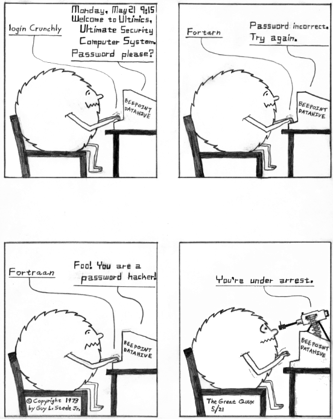
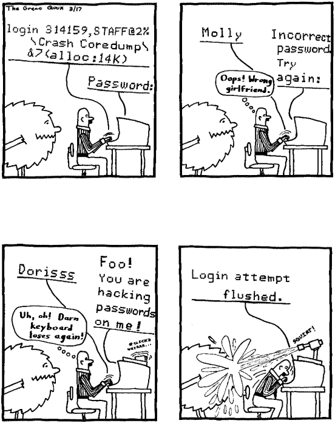

==============
F
==============

face time
==================

**face time**: n.

[common] Time spent interacting with somebody face-to-face (as opposed
to via electronic links). “Oh, yeah, I spent some face time with him at
the last Usenix.”

factor
==============

**factor**: n.

See `coefficient of X <./C.html#coefficient-of-X.html>`__.

fairings
======================

**fairings**: n., /fer´ingz/

[FreeBSD; orig. a typo for fairness] A term thrown out in discussion
whenever a completely and transparently nonsensical argument in one's
favor(?) seems called for, e,g. at the end of a really long thread for
which the outcome is no longer even cared about since everyone is now so
sick of it; or in rebuttal to another nonsensical argument (“Change the
loader to look for /kernel.pl? What about fairings?”)

fall over
===============

**fall over**: vi.

[IBM] Yet another synonym for `crash <../C.html#crash>`__ or
`lose <../L.html#lose>`__. ‘Fall over hard’ equates to `crash and
burn <../C.html#crash-and-burn>`__.

fall through
=======================

**fall through**: v.

(n. fallthrough, var.: fall-through)

1. To exit a loop by exhaustion, i.e., by having fulfilled its exit
condition rather than via a break or exception condition that exits from
the middle of it. This usage appears to be *really* old, dating from the
1940s and 1950s.

2. To fail a test that would have passed control to a subroutine or some
other distant portion of code.

3. In C, ‘fall-through’ occurs when the flow of execution in a switch
statement reaches a **case** label other than by jumping there from the
switch header, passing a point where one would normally expect to find a
**break**. A trivial example:

 
  switch (color)
  {
  case GREEN:
     do\_green();
     break;
  case PINK:
     do\_pink();
     /\* FALL THROUGH \*/
  case RED:
     do\_red();
     break;
  default:
     do\_blue();
     break;
  }

The variant spelling "/* FALL THRU */" is also common.

The effect of the above code is to do\_green() when color is **GREEN**,
do\_red() when color is **RED**, do\_blue() on any other color other
than **PINK**, and (and this is the important part) do\_pink() *and
then* do\_red() when color is **PINK**. Fall-through is `considered
harmful <./C.html#considered-harmful.html>`__ by some, though there are
contexts (such as the coding of state machines) in which it is natural;
it is generally considered good practice to include a comment
highlighting the fall-through where one would normally expect a break.
See also `Duff's device <../D.html#Duffs-device>`__.

fandango on core
==========================

**fandango on core**: n.

[Unix/C hackers, from the Iberian dance] In C, a wild pointer that runs
out of bounds, causing a `core dump <./C.html#core-dump.html>`__, or
corrupts the malloc(3) `arena <./A.html#arena.html>`__ in such a way as to
cause mysterious failures later on, is sometimes said to have ‘done a
fandango on core’. On low-end personal machines without an MMU (or
Windows boxes, which have an MMU but use it incompetently), this can
corrupt the OS itself, causing massive lossage. Other frenetic dances,
such as the cha-cha or the watusi, may be substituted. See `aliasing
bug <./A.html#aliasing-bug.html>`__, `precedence
lossage <../P/precedence-lossage.html>`__, `smash the
stack <../S/smash-the-stack.html>`__, `memory
leak <../M/memory-leak.html>`__, `memory
smash <../M/memory-smash.html>`__, `overrun
screw <../O/overrun-screw.html>`__, `core <./C.html#core.html>`__.

fan
==========================

**fan**: n.

Without qualification, indicates a fan of science fiction, especially
one who goes to `con <./C.html#con_.html>`__\ s and tends to hang out with
other fans. Many hackers are fans, so this term has been imported from
fannish slang; however, unlike much fannish slang it is recognized by
most non-fannish hackers. Among SF fans the plural is correctly fen, but
this usage is not automatic to hackers. “Laura reads the stuff
occasionally but isn't really a fan.”

FAQ
==================================

**FAQ**: /F·A·Q/, /fak/, n.

[Usenet]

1. A Frequently Asked Question.

2. A compendium of accumulated lore, posted periodically to high-volume
newsgroups in an attempt to forestall such questions. Some people prefer
the term ‘FAQ list’ or ‘FAQL’ /fa´kl/, reserving ‘FAQ’ for sense 1.

This lexicon itself serves as a good example of a collection of one kind
of lore, although it is far too big for a regular FAQ posting. Examples:
“What is the proper type of NULL?” and “What's that funny name for the
"#" character?” are both Frequently Asked Questions. Several FAQs
refer readers to the Jargon File.

FAQL
==================

**FAQL**: /fa´kl/, n.

Syn. `FAQ list <FAQ-list.html>`__.

FAQ list
=================

**FAQ list**: /F·A·Q list/, /fak list/, n.

[common; Usenet] Syn `FAQ <FAQ.html>`__, sense 2.

faradize
============================

**faradize**: /far'@·di:z/, v.

[US Geological Survey] To start any hyper-addictive process or trend, or
to continue adding current to such a trend. Telling one user about a new
octo-tetris game you compiled would be a faradizing act — in two weeks
you might find your entire department playing the faradic game.

farkled
============================

**farkled**: /far´kld/, adj.

[DeVry Institute of Technology, Atlanta] Syn.
`hosed <./H.html#hosed.html>`__. Poss. owes something to Yiddish
*farblondjet* and/or the ‘Farkle Family’ skits on *Rowan and Martin's
Laugh-In*, a popular comedy show of the late 1960s.

farm
====================================

**farm**: n.

A group of machines, especially a large group of near-identical machines
running load-balancing software, dedicated to a single task.
Historically the term server farm, used especially for a group of web
servers, seems to have been coined by analogy with earlier `disk
farm <./D.html#disk-farm.html>`__ in the early 1990s; generalization began
with render farm for a group of machines dedicated to rendering computer
animations (this term appears to have been popularized by publicity
about the pioneering “Linux render farm” used to produce the movie
*Titanic*). By 2001 other combinations such as “compile farm” and
“compute farm” were increasingly common, and arguably borderline
techspeak. More jargon uses seem likely to arise (and be absorbed into
techspeak over time) as new uses are discovered for networked machine
clusters. Compare `link farm <./L.html#link-farm.html>`__.

fascist
=========================

**fascist**: adj.

1. [common] Said of a computer system with excessive or annoying
security barriers, usage limits, or access policies. The implication is
that said policies are preventing hackers from getting interesting work
done. The variant fascistic seems to have been preferred at MIT, poss.
by analogy with touristic (see `tourist <../T/tourist.html>`__ or
under the influence of German/Yiddish faschistisch).

2. In the design of languages and other software tools, the fascist
alternative is the most restrictive and structured way of capturing a
particular function; the implication is that this may be desirable in
order to simplify the implementation or provide tighter error checking.
Compare `bondage-and-discipline
language <./B.html#bondage-and-discipline-language.html>`__, although that
term is global rather than local.

Fascist security strikes again.

(The next cartoon in the Crunchly saga is `73-05-28 <./B.html#bells-and-whistles.html#crunchly73-05-28>`__. The
previous one is `73-05-20 <./D.html#drop-outs.html#crunchly73-05-20>`__.)

fat electrons
==========================

**fat electrons**: n.

Old-time hacker David Cargill's theory on the causation of computer
glitches. Your typical electric utility draws its line current out of
the big generators with a pair of coil taps located near the top of the
dynamo. When the normal tap brushes get dirty, they take them off line
to clean them up, and use special auxiliary taps on the *bottom* of the
coil. Now, this is a problem, because when they do that they get not
ordinary or ‘thin’ electrons, but the fat'n'sloppy electrons that are
heavier and so settle to the bottom of the generator. These flow down
ordinary wires just fine, but when they have to turn a sharp corner (as
in an integrated-circuit via), they're apt to get stuck. This is what
causes computer glitches. [Fascinating. Obviously, fat electrons must
gain mass by `bogon <./B.html#bogon.html>`__ absorption —ESR] Compare
`bogon <./B.html#bogon.html>`__, `magic
smoke <../M/magic-smoke.html>`__.

fat-finger
=========================

**fat-finger**: vt.

1. To introduce a typo while editing in such a way that the resulting
manglification of a configuration file does something useless, damaging,
or wildly unexpected. “NSI fat-fingered their DNS zone file and took
half the net down again.”

2. More generally, any typo that produces dramatically bad results.

fat pipe
======================

**fat pipe**

A high-bandwidth connection to the Internet. When the term gained
currency in the mid-1990s, a T-1 (at 1.5 Mbits/second) was considered a
fat pipe, but the standard has risen. Now it suggests multiple T3s.

faulty
==========================

**faulty**: adj.

Non-functional; buggy. Same denotation as
`bletcherous <./B.html#bletcherous.html>`__,
`losing <./L.html#losing.html>`__, q.v., but the connotation is much
milder.

fear and loathing
===============================

**fear and loathing**: n.

[from Hunter S. Thompson] A state inspired by the prospect of dealing
with certain real-world systems and standards that are totally
`brain-damaged <./B.html#brain-damaged.html>`__ but ubiquitous — Intel
8086s, or `COBOL <../C/COBOL.html>`__, or
`EBCDIC <../E/EBCDIC.html>`__, or any `IBM <../I/IBM.html>`__
machine bigger than a workstation. “Ack! They want PCs to be able to
talk to the AI machine. Fear and loathing time!”

feature creature
=================================

**feature creature**: n.

[poss. fr. slang ‘creature feature’ for a horror movie]

1. One who loves to add features to designs or programs, perhaps at the
expense of coherence, concision, or `taste <../T/taste.html>`__.

2. Alternately, a mythical being that induces otherwise rational
programmers to perpetrate such crocks. See also `feeping
creaturism <feeping-creaturism.html>`__, `creeping
featurism <./C.html#creeping-featurism.html>`__.

feature creep
==========================

**feature creep**: n.

[common] The result of `creeping
featurism <./C.html#creeping-featurism.html>`__, as in “Emacs has a bad
case of feature creep”.

featurectomy
==========================

**featurectomy**: /fee\`ch@r·ek´t@·mee/, n.

The act of removing a feature from a program. Featurectomies come in two
flavors, the righteous and the reluctant. Righteous featurectomies are
performed because the remover believes the program would be more elegant
without the feature, or there is already an equivalent and better way to
achieve the same end. (Doing so is not quite the same thing as removing
a `misfeature <../M/misfeature.html>`__.) Reluctant featurectomies are
performed to satisfy some external constraint such as code size or
execution speed.

feature
=========================

**feature**: n.

1. [common] A good property or behavior (as of a program). Whether it
was intended or not is immaterial.

2. [common] An intended property or behavior (as of a program). Whether
it is good or not is immaterial (but if bad, it is also a
`misfeature <../M/misfeature.html>`__).

3. A surprising property or behavior; in particular, one that is
purposely inconsistent because it works better that way — such an
inconsistency is therefore a `feature <feature.html>`__ and not a
`bug <./B.html#bug.html>`__. This kind of feature is sometimes called a
`miswart <../M/miswart.html>`__; see that entry for a classic example.

4. A property or behavior that is gratuitous or unnecessary, though
perhaps also impressive or cute. For example, one feature of Common
LISP's **format** function is the ability to print numbers in two
different Roman-numeral formats (see `bells whistles and
gongs <./B.html#bells-whistles-and-gongs.html>`__).

5. A property or behavior that was put in to help someone else but that
happens to be in your way.

6. [common] A bug that has been documented. To call something a feature
sometimes means the author of the program did not consider the
particular case, and that the program responded in a way that was
unexpected but not strictly incorrect. A standard joke is that a bug can
be turned into a `feature <feature.html>`__ simply by documenting it
(then theoretically no one can complain about it because it's in the
manual), or even by simply declaring it to be good. “That's not a bug,
that's a feature!” is a common catchphrase. See also `feetch
feetch <feetch-feetch.html>`__, `creeping
featurism <./C.html#creeping-featurism.html>`__,
`wart <../W/wart.html>`__, `green
lightning <./G.html#green-lightning.html>`__.

The relationship among bugs, features, misfeatures, warts, and miswarts
might be clarified by the following hypothetical exchange between two
hackers on an airliner:

A: “This seat doesn't recline.”

B: “That's not a bug, that's a feature. There is an emergency exit door
built around the window behind you, and the route has to be kept clear.”

A: “Oh. Then it's a misfeature; they should have increased the spacing
between rows here.”

B: “Yes. But if they'd increased spacing in only one section it would
have been a wart — they would've had to make nonstandard-length ceiling
panels to fit over the displaced seats.”

A: “A miswart, actually. If they increased spacing throughout they'd
lose several rows and a chunk out of the profit margin. So unequal
spacing would actually be the Right Thing.”

B: “Indeed.”

Undocumented feature is a common, allegedly humorous euphemism for a
`bug <./B.html#bug.html>`__. There's a related joke that is sometimes
referred to as the “one-question geek test”. You say to someone “I saw a
Volkswagen Beetle today with a vanity license plate that read FEATURE”.
If he/she laughs, he/she is a `geek <./G.html#geek.html>`__.

feature key
==============================

**feature key**: n.

[common] The Macintosh key with the cloverleaf graphic on its keytop;
sometimes referred to as flower, pretzel, clover, propeller, beanie (an
apparent reference to the major feature of a propeller beanie),
`splat <../S/splat.html>`__, open-apple or (officially, in Mac
documentation) the command key. In French, the term *papillon*
(butterfly) has been reported. The proliferation of terms for this
creature may illustrate one subtle peril of iconic interfaces.

Many people have been mystified by the cloverleaf-like symbol that
appears on the feature key. Its oldest name is ‘cross of St. Hannes’,
but it occurs in pre-Christian Viking art as a decorative motif.
Throughout Scandinavia today the road agencies use it to mark sites of
historical interest. Apple picked up the symbol from an early Mac
developer who happened to be Swedish. Apple documentation gives the
translation “interesting feature”!

There is some dispute as to the proper (Swedish) name of this symbol. It
technically stands for the word *sevärdhet* (thing worth seeing); many
of these are old churches. Some Swedes report as an idiom for the sign
the word kyrka, cognate to English ‘church’ and pronounced (roughly)
/chur´ka/ in modern Swedish. Others say this is nonsense. Other idioms
reported for the sign are *runa* (rune) or runsten /roon´stn/
(runestone), derived from the fact that many of the interesting features
are Viking rune-stones. The term *fornminne* /foorn´min'@/ (relic of
antiquity, ancient monument) is also reported, especially among those
who think that the Mac itself is a relic of antiquity.

feature shock
==================

**feature shock**: n.

[from Alvin Toffler's book title *Future Shock*] A user's (or
programmer's!) confusion when confronted with a package that has too
many features and poor introductory material.

feeper
===========================

**feeper**: /fee´pr/, n.

The device in a terminal or workstation (usually a loudspeaker of some
kind) that makes the `feep <feep.html>`__ sound.

feep
=====================

**feep**: /feep/

1. n. The soft electronic ‘bell’ sound of a display terminal (except for
a VT-52); a beep (in fact, the microcomputer world seems to prefer
`beep <./B.html#beep.html>`__).

2. vi. To cause the display to make a feep sound. ASR-33s (the original
TTYs) do not feep; they have mechanical bells that ring. Alternate
forms: `beep <./B.html#beep.html>`__, ‘bleep’, or just about anything
suitably onomatopoeic. (Jeff MacNelly, in his comic strip *Shoe*, uses
the word ‘eep’ for sounds made by computer terminals and video games;
this is perhaps the closest written approximation yet.) The term
‘breedle’ was sometimes heard at SAIL, where the terminal bleepers are
not particularly soft (they sound more like the musical equivalent of a
raspberry or Bronx cheer; for a close approximation, imagine the sound
of a Star Trek communicator's beep lasting for five seconds). The
‘feeper’ on a VT-52 has been compared to the sound of a '52 Chevy
stripping its gears. See also `ding <./D.html#ding.html>`__.

feeping creature
==========================

**feeping creature**: n.

[from `feeping creaturism <feeping-creaturism.html>`__] An unnecessary
feature; a bit of `chrome <./C.html#chrome.html>`__ that, in the speaker's
judgment, is the camel's nose for a whole horde of new features.

feeping creaturism
===================================

**feeping creaturism**: /fee´ping kree\`ch@r·izm/, n.

A deliberate spoonerism for `creeping
featurism <./C.html#creeping-featurism.html>`__, meant to imply that the
system or program in question has become a misshapen creature of hacks.
This term isn't really well defined, but it sounds so neat that most
hackers have said or heard it. It is probably reinforced by an image of
terminals prowling about in the dark making their customary noises.

feetch feetch
====================================

**feetch feetch**: /feech feech/, interj.

If someone tells you about some new improvement to a program, you might
respond: “Feetch, feetch!” The meaning of this depends critically on
vocal inflection. With enthusiasm, it means something like “Boy, that's
great! What a great hack!” Grudgingly or with obvious doubt, it means “I
don't know; it sounds like just one more unnecessary and complicated
thing”. With a tone of resignation, it means, “Well, I'd rather keep it
simple, but I suppose it has to be done”.

fence
===========================

**fence**

n.

1. A sequence of one or more distinguished
(`out-of-band <../O/out-of-band.html>`__) characters (or other data
items), used to delimit a piece of data intended to be treated as a unit
(the computer-science literature calls this a sentinel). The NUL (ASCII
0000000) character that terminates strings in C is a fence. Hex FF is
also (though slightly less frequently) used this way. See
`zigamorph <../Z/zigamorph.html>`__.

2. An extra data value inserted in an array or other data structure in
order to allow some normal test on the array's contents also to function
as a termination test. For example, a highly optimized routine for
finding a value in an array might artificially place a copy of the value
to be searched for after the last slot of the array, thus allowing the
main search loop to search for the value without having to check at each
pass whether the end of the array had been reached.

3. [among users of optimizing compilers] Any technique, usually
exploiting knowledge about the compiler, that blocks certain
optimizations. Used when explicit mechanisms are not available or are
overkill. Typically a hack: “I call a dummy procedure there to force a
flush of the optimizer's register-coloring info” can be expressed by the
shorter “That's a fence procedure”.

fencepost error
==========================

**fencepost error**: n.

1. [common] A problem with the discrete equivalent of a boundary
condition, often exhibited in programs by iterative loops. From the
following problem: “If you build a fence 100 feet long with posts 10
feet apart, how many posts do you need?” (Either 9 or 11 is a better
answer than the obvious 10.) For example, suppose you have a long list
or array of items, and want to process items "m" through "n"; how
many items are there? The obvious answer is "n - m", but that is off
by one; the right answer is "n - m + 1". A program that used the
‘obvious’ formula would have a fencepost error in it. See also
`zeroth <../Z/zeroth.html>`__ and `off-by-one
error <../O/off-by-one-error.html>`__, and note that not all off-by-one
errors are fencepost errors. The game of Musical Chairs involves a
catastrophic off-by-one error where "N" people try to sit in "N - 1"
chairs, but it's not a fencepost error. Fencepost errors come from
counting things rather than the spaces between them, or vice versa, or
by neglecting to consider whether one should count one or both ends of a
row.

2. [rare] An error induced by unexpected regularities in input values,
which can (for instance) completely thwart a theoretically efficient
binary tree or hash table implementation. (The error here involves the
difference between expected and worst case behaviors of an algorithm.)

fiber-seeking backhoe
=================================

**fiber-seeking backhoe**

[common among backbone ISP personnel] Any of a genus of large,
disruptive machines which routinely cut critical backbone links,
creating Internet outages and `packet over
air <../P/packet-over-air.html>`__ problems.

FidoNet
===========================

**FidoNet**: n.

A worldwide hobbyist network of personal computers which exchanges mail,
discussion groups, and files. Founded in 1984 and originally consisting
only of IBM PCs and compatibles, FidoNet now includes such diverse
machines as Apple ][s, Ataris, Amigas, and Unix systems. For years
FidoNet actually grew faster than Usenet, but the advent of cheap
Internet access probably means its days are numbered. FidoNet's site
count has dropped from 38K nodes in 1996 through 15K nodes in 2001 to
10K nodes in late 2003, and most of those are probably single-user
machines rather than the thriving BBSes of yore.

field circus
=======================================

**field circus**: n.

[a derogatory pun on ‘field service’] The field service organization of
any hardware manufacturer, but originally `DEC <../D/DEC.html>`__.
There is an entire genre of jokes about field circus engineers:

| 
|  Q: How can you recognize a field circus engineer
|     with a flat tire?
|  A: He's changing one tire at a time to see which one is flat.
| 
|  Q: How can you recognize a field circus engineer
|     who is out of gas?
|  A: He's changing one tire at a time to see which one is flat.
| 
|  Q: How can you tell it's \ *your* field circus engineer?
|  A: The spare is flat, too.

[See `Easter egging <../E/Easter-egging.html>`__ for additional
insight on these jokes.]

There is also the ‘Field Circus Cheer’ (from the old `plan
file <../P/plan-file.html>`__ for DEC on MIT-AI):

| 
|  Maynard! Maynard!
|  Don't mess with us!
|  We're mean and we're tough!
|  If you get us confused
|  We'll screw up your stuff.

(DEC's service HQ, still extant under the HP regime, is located in
Maynard, Massachusetts.)

field servoid
===========================================

**field servoid**: /fee´ld ser´voyd/, n.

[play on ‘android’] Representative of a field service organization (see
`field circus <field-circus.html>`__). This has many of the
implications of `droid <./D.html#droid.html>`__.

file signature
=========================================
**file signature**: n.

A `magic number <../M/magic-number.html>`__, sense 3.

filk
=============================================

**filk**: /filk/, n.,v.

[from SF fandom, where a typo for ‘folk’ was adopted as a new word]
Originally, a popular or folk song with lyrics revised or completely new
lyrics and/or music, intended for humorous effect when read, and/or to
be sung late at night at SF conventions. More recently (especially since
the late 1980s), filk has come to include a great deal of
originally-composed music on SFnal or fantasy themes and a range of
moods wider than simple parody or humor. Worthy of mention here because
there is a flourishing subgenre of filks called computer filks, written
by hackers and often containing rather sophisticated technical humor.
See `double bucky <./D.html#double-bucky.html>`__ for an example. Compare
`grilf <./G.html#grilf.html>`__, `hing <./H.html#hing.html>`__,
`pr0n <../P/pr0n.html>`__, and `newsfroup <../N/newsfroup.html>`__.

film at 11
=========================================

**film at 11**

[MIT: in parody of TV newscasters]

1. Used in conversation to announce ordinary events, with a sarcastic
implication that these events are earth-shattering.
“\ `ITS <../I/ITS.html>`__ crashes; film at 11.” “Bug found in
scheduler; film at 11.”

2. Also widely used outside MIT to indicate that additional information
will be available at some future time, *without* the implication of
anything particularly ordinary about the referenced event. For example,
“The mail file server died this morning; we found garbage all over the
root directory. Film at 11.” would indicate that a major failure had
occurred but that the people working on it have no additional
information about it as yet; use of the phrase in this way suggests
gently that the problem is liable to be fixed more quickly if the people
doing the fixing can spend time doing the fixing rather than responding
to questions, the answers to which will appear on the normal “11:00
news”, if people will just be patient.

The variant “MPEGs at 11” has recently been cited (MPEG is a
digital-video format.)

filter
====================================

**filter**: n.

[very common; orig. `Unix <../U/Unix.html>`__] A program that
processes an input data stream into an output data stream in some
well-defined way, and does no I/O to anywhere else except possibly on
error conditions; one designed to be used as a stage in a pipeline (see
`plumbing <../P/plumbing.html>`__). Compare
`sponge <../S/sponge.html>`__.

Finagle's Law
========================================

**Finagle's Law**: n.

The generalized or ‘folk’ version of `Murphy's
Law <../M/Murphys-Law.html>`__, fully named “Finagle's Law of Dynamic
Negatives” and usually rendered “Anything that can go wrong, will”. May
have been first published by Francis P. Chisholm in his 1963 essay *The
Chisholm Effect*, later reprinted in the classic anthology *A Stress
Analysis Of A Strapless Evening Gown: And Other Essays For A Scientific
Eye* (Robert Baker ed, Prentice-Hall, ISBN 0-13-852608-7).

The label ‘Finagle's Law’ was popularized by SF author Larry Niven in
several stories depicting a frontier culture of asteroid miners; this
‘Belter’ culture professed a religion and/or running joke involving the
worship of the dread god Finagle and his mad prophet Murphy. Some
technical and scientific cultures (e.g., paleontologists) know it under
the name Sod's Law; this usage may be more common in Great Britain. One
variant favored among hackers is “The perversity of the Universe tends
towards a maximum”; Niven specifically referred to this as O'Toole's
Corollary of Finagle's Law. See also `Hanlon's
Razor <../H/Hanlons-Razor.html>`__.

fine
=======================================

**fine**: adj.

[WPI] Good, but not good enough to be `cuspy <./C.html#cuspy.html>`__. The
word fine is used elsewhere, of course, but without the implicit
comparison to the higher level implied by `cuspy <./C.html#cuspy.html>`__.

finger
========================

**finger**

[WAITS, via BSD Unix]

1. n. A program that displays information about a particular user or all
users logged on the system, or a remote system. Typically shows full
name, last login time, idle time, terminal line, and terminal location
(where applicable). May also display a `plan
file <../P/plan-file.html>`__ left by the user (see also `Hacking X
for Y <../H/Hacking-X-for-Y.html>`__).

2. vt. To apply finger to a username.

3. vt. By extension, to check a human's current state by any means.
“Foodp?” “T!” “OK, finger Lisa and see if she's idle.”

4. Any picture (composed of ASCII characters) depicting ‘the finger’,
see `See figure 1 <../S/See-figure-1.html>`__. Originally a humorous
component of one's plan file to deter the curious fingerer (sense 2), it
has entered the arsenal of some `flamer <flamer.html>`__\ s.

finger-pointing syndrome
================================================

**finger-pointing syndrome**: n.

All-too-frequent result of bugs, esp. in new or experimental
configurations. The hardware vendor points a finger at the software. The
software vendor points a finger at the hardware. All the poor users get
is the finger.

finger trouble
==================
**finger trouble**: n.

Mistyping, typos, or generalized keyboard incompetence (this is
surprisingly common among hackers, given the amount of time they spend
at keyboards). “I keep putting colons at the end of statements instead
of semicolons”, “Finger trouble again, eh?”.

finn
==========================================================================

**finn**: v.

[IRC] To pull rank on somebody based on the amount of time one has spent
on `IRC <../I/IRC.html>`__. The term derives from the fact that IRC
was originally written in Finland in 1987. There may be some influence
from the ‘Finn’ character in William Gibson's seminal cyberpunk novel
*Count Zero*, who at one point says to another (much younger) character
“I have a pair of shoes older than you are, so shut up!”

firebottle
===================================

**firebottle**: n.obs.

A large, primitive, power-hungry active electrical device, similar in
function to a FET but constructed out of glass, metal, and vacuum.
Characterized by high cost, low density, low reliability,
high-temperature operation, and high power dissipation. Sometimes
mistakenly called a tube in the U.S. or a valve in England; another
hackish term is `glassfet <./G.html#glassfet.html>`__.

firefighting
==============================================

**firefighting**: n.

1. What sysadmins have to do to correct sudden operational problems. An
opposite of hacking. “Been hacking your new newsreader?” “No, a power
glitch hosed the network and I spent the whole afternoon fighting
fires.”

2. The act of throwing lots of manpower and late nights at a project,
esp. to get it out before deadline. See also `gang
bang <./G.html#gang-bang.html>`__, `Mongolian Hordes
technique <../M/Mongolian-Hordes-technique.html>`__; however, the term
firefighting connotes that the effort is going into chasing bugs rather
than adding features.

firehose syndrome
======================

**firehose syndrome**: n.

In mainstream folklore it is observed that trying to drink from a
firehose can be a good way to rip your lips off. On computer networks,
the absence or failure of flow control mechanisms can lead to situations
in which the sending system sprays a massive flood of packets at an
unfortunate receiving system, more than it can handle. Compare
`overrun <../O/overrun.html>`__, `buffer
overflow <./B.html#buffer-overflow.html>`__.

firewall code
======================================================

**firewall code**: n.

1. The code you put in a system (say, a telephone switch) to make sure
that the users can't do any damage. Since users always want to be able
to do everything but never want to suffer for any mistakes, the
construction of a firewall is a question not only of defensive coding
but also of interface presentation, so that users don't even get curious
about those corners of a system where they can burn themselves.

2. Any sanity check inserted to catch a `can't
happen <./C.html#can-t-happen.html>`__ error. Wise programmers often change
code to fix a bug twice: once to fix the bug, and once to insert a
firewall which would have arrested the bug before it did quite as much
damage.

firewall machine
===========================================================================================

**firewall machine**: n.

A dedicated gateway machine with special security precautions on it,
used to service outside network connections and dial-in lines. The idea
is to protect a cluster of more loosely administered machines hidden
behind it from `cracker <./C.html#cracker.html>`__\ s. The typical
firewall is an inexpensive micro-based Unix box kept clean of critical
data, with a bunch of modems and public network ports on it but just one
carefully watched connection back to the rest of the cluster. The
special precautions may include threat monitoring, callback, and even a
complete `iron box <./I.html#iron-box.html>`__ keyable to particular
incoming IDs or activity patterns. Syn. `flytrap <flytrap.html>`__,
`Venus flytrap <../V/Venus-flytrap.html>`__. See also `wild
side <../W/wild-side.html>`__.

[When first coined in the mid-1980s this term was pure jargon. Now
(1999) it is techspeak, and has been retained only as an example of
uptake —ESR]

fireworks mode
============================================

**fireworks mode**: n.

1. The mode a machine is sometimes said to be in when it is performing a
`crash and burn <./C.html#crash-and-burn.html>`__ operation.

2. There is (or was) a more specific meaning of this term in the Amiga
community. The word fireworks described the effects of a particularly
serious crash which prevented the video pointer(s) from getting reset at
the start of the vertical blank. This caused the DAC to scroll through
the entire contents of CHIP (video or video+CPU) memory. Since each bit
plane would scroll separately this was quite a spectacular effect.

firmware
===============================

**firmware**: /ferm´weir/, n.

Embedded software contained in EPROM or flash memory. It isn't quite
hardware, but at least doesn't have to be loaded from a disk like
regular software. Hacker usage differs from straight techspeak in that
hackers don't normally apply it to stuff that you can't possibly get at,
such as the program that runs a pocket calculator. Instead, it implies
that the firmware could be changed, even if doing so would mean opening
a box and plugging in a new chip. A computer's BIOS is the classic
example, although nowadays there is firmware in disk controllers,
modems, video cards and even CD-ROM drives.

fish
===================================

**fish**: n.

[Adelaide University, Australia]

1. Another `metasyntactic
variable <../M/metasyntactic-variable.html>`__. See
`foo <foo.html>`__. Derived originally from the Monty Python skit in
the middle of *The Meaning of Life* entitled *Find the Fish*.

2. A pun for microfiche. A microfiche file cabinet may be referred to as
a fish tank.

FISH queue
==================================

**FISH queue**: n.

[acronym, by analogy with FIFO (First In, First Out)] ‘First In, Still
Here’. A joking way of pointing out that processing of a particular
sequence of events or requests has stopped dead. Also FISH mode and
FISHnet; the latter may be applied to any network that is running really
slowly or exhibiting extreme flakiness.

fisking
=======================================

**fisking**: n.

[blogosphere; very common] A point-by-point refutation of a
`blog <./B.html#blog.html>`__ entry or (especially) news story. A really
stylish fisking is witty, logical, sarcastic and ruthlessly factual;
flaming or handwaving is considered poor form. Named after Robert Fisk,
a British journalist who was a frequent (and deserving) early target of
such treatment. See also `MiSTing <../M/MiSTing.html>`__,
`anti-idiotarianism <./A.html#anti-idiotarianism.html>`__

FITNR
===================

**FITNR**: //, adj.

[Thinking Machines, Inc.] Fixed In The Next Release. A written-only
notation attached to bug reports. Often wishful thinking.

fix
============

**fix**: n.,v.

What one does when a problem has been reported too many times to be
ignored.

FIXME
==========================

**FIXME**: imp.

[common] A standard tag often put in C comments near a piece of code
that needs work. The point of doing so is that a **grep** or a similar
pattern-matching tool can find all such places quickly.

| 
|  /\* FIXME: note this is common in `GNU <../G/GNU.html>`__ code. \*/

Compare `XXX <../X/XXX.html>`__.

flag day
========================

**flag day**: n.

A software change that is neither forward- nor backward-compatible, and
which is costly to make and costly to reverse. “Can we install that
without causing a flag day for all users?” This term has nothing to do
with the use of the word `flag <flag.html>`__ to mean a variable that
has two values. It came into use when a change was made to the
definition of the ASCII character set during the development of
`Multics <../M/Multics.html>`__. The change was scheduled for Flag Day
(a U.S. holiday), June 14, 1966.

The change altered the Multics definition of ASCII from the short-lived
1965 version of the ASCII code to the 1967 version (in draft at the
time); this moved code points for braces, vertical bar, and circumflex.
See also `backward
combatability <./B.html#backward-combatability.html>`__. The `Great
Renaming <../G/Great-Renaming.html>`__ was a flag day.

[Most of the changes were made to files stored on
`CTSS <../C/CTSS.html>`__, the system used to support Multics
development before it became self-hosting.]

[As it happens, the first installation of a commercially-produced
computer, a Univac I, took place on Flag Day of 1951 —ESR]

flag
================

**flag**: n.

[very common] A variable or quantity that can take on one of two values;
a bit, particularly one that is used to indicate one of two outcomes or
is used to control which of two things is to be done. “This flag
controls whether to clear the screen before printing the message.” “The
program status word contains several flag bits.” Used of humans
analogously to `bit <./B.html#bit.html>`__. See also `hidden
flag <./H.html#hidden-flag.html>`__, `mode bit <../M/mode-bit.html>`__.

flaky
==============
**flaky**: adj.

(var sp. flakey) Subject to frequent `lossage <./L.html#lossage.html>`__.
This use is of course related to the common slang use of the word to
describe a person as eccentric, crazy, or just unreliable. A system that
is flaky is working, sort of — enough that you are tempted to try to use
it — but fails frequently enough that the odds in favor of finishing
what you start are low. Commonwealth hackish prefers
`dodgy <./D.html#dodgy.html>`__ or `wonky <../W/wonky.html>`__.

flamage
=======================

**flamage**: /flay'm@j/, n.

[very common] Flaming verbiage, esp. high-noise, low-signal postings to
`Usenet <../U/Usenet.html>`__ or other electronic
`fora <fora.html>`__. Often in the phrase the usual flamage. Flaming
is the act itself; flamage the content; a flame is a single flaming
message. See `flame <flame.html>`__, also
`dahmum <./D.html#dahmum.html>`__.

flame bait
==================

**flame bait**: n.

[common] A posting intended to trigger a `flame
war <flame-war.html>`__, or one that invites flames in reply. See also
`troll <../T/troll.html>`__.

flame
==================

**flame**

[at MIT, orig. from the phrase flaming asshole]

1. vi. To post an email message intended to insult and provoke.

2. vi. To speak incessantly and/or rabidly on some relatively
uninteresting subject or with a patently ridiculous attitude.

3. vt. Either of senses 1 or 2, directed with hostility at a particular
person or people.

4. n. An instance of flaming. When a discussion degenerates into useless
controversy, one might tell the participants “Now you're just flaming”
or “Stop all that flamage!” to try to get them to cool down (so to
speak).

The term may have been independently invented at several different
places. It has been reported from MIT, Carleton College and RPI (among
many other places) from as far back as 1969, and from the University of
Virginia in the early 1960s.

It is possible that the hackish sense of ‘flame’ is much older than
that. The poet Chaucer was also what passed for a wizard hacker in his
time; he wrote a treatise on the astrolabe, the most advanced computing
device of the day. In Chaucer's *Troilus and Cressida*, Cressida laments
her inability to grasp the proof of a particular mathematical theorem;
her uncle Pandarus then observes that it's called “the fleminge of
wrecches.” This phrase seems to have been intended in context as “that
which puts the wretches to flight” but was probably just as ambiguous in
Middle English as “the flaming of wretches” would be today. One suspects
that Chaucer would feel right at home on Usenet.

flame on
===================

**flame on**: interj.

1. To begin to `flame <flame.html>`__. The punning reference to Marvel
Comics's Human Torch is no longer widely recognized.

2. To continue to flame. See `rave <../R/rave.html>`__,
`burble <./B.html#burble.html>`__.

flamer
===================

**flamer**: n.

[common] One who habitually `flame <flame.html>`__\ s. Said esp. of
obnoxious `Usenet <../U/Usenet.html>`__ personalities.

flame war
====================================

**flame war**: n.

[common] (var.: flamewar) An acrimonious dispute, especially when
conducted on a public electronic forum such as
`Usenet <../U/Usenet.html>`__.

flap
=============
**flap**: vt.

1. [obs.] To unload a DECtape (so it goes flap, flap, flap...). Old-time
hackers at MIT tell of the days when the disk was device 0 and DEC
microtapes were 1, 2,... and attempting to flap device 0 would instead
start a motor banging inside a cabinet near the disk.

2. By extension, to unload any magnetic tape. Modern cartridge tapes no
longer actually flap, but the usage has remained. (The term could well
be re-applied to DEC's TK50 cartridge tape drive, a spectacularly
misengineered contraption which makes a loud flapping sound, almost like
an old reel-type lawnmower, in one of its many tape-eating failure
modes.)

flarp
========================

**flarp**: /flarp/, n.

[Rutgers University] Yet another `metasyntactic
variable <../M/metasyntactic-variable.html>`__ (see
`foo <foo.html>`__). Among those who use it, it is associated with a
legend that any program not containing the word flarp somewhere will not
work. The legend is discreetly silent on the reliability of programs
which *do* contain the magic word.

flash crowd
===================================

**flash crowd**

Larry Niven's 1973 SF short story *Flash Crowd* predicted that one
consequence of cheap teleportation would be huge crowds materializing
almost instantly at the sites of interesting news stories. Twenty years
later the term passed into common use on the Internet to describe
exponential spikes in website or server usage when one passes a certain
threshold of popular interest (what this does to the server may also be
called `slashdot effect <../S/slashdot-effect.html>`__). It has been
pointed out that the effect was anticipated years earlier in Alfred
Bester's 1956 *The Stars My Destination*.

flat-ASCII
====================

**flat-ASCII**: adj.

[common] Said of a text file that contains only 7-bit ASCII characters
and uses only ASCII-standard control characters (that is, has no
embedded codes specific to a particular text formatter markup language,
or output device, and no `meta <../M/meta.html>`__-characters). Syn.
`plain-ASCII <../P/plain-ASCII.html>`__. Compare
`flat-file <flat-file.html>`__.

flat-file
========================================

**flat-file**: adj.

A `flatten <flatten.html>`__\ ed representation of some database or
tree or network structure as a single file from which the structure
could implicitly be rebuilt, esp. one in
`flat-ASCII <flat-ASCII.html>`__ form. See also
`sharchive <../S/sharchive.html>`__.

flat
==================

**flat**: adj.

1. [common] Lacking any complex internal structure. “That `bitty
box <./B.html#bitty-box.html>`__ has only a flat filesystem, not a
hierarchical one.” The verb form is `flatten <flatten.html>`__.

2. Said of a memory architecture (like that of the
`VAX <../V/VAX.html>`__ or 680x0) that is one big linear address space
(typically with each possible value of a processor register
corresponding to a unique core address), as opposed to a segmented
architecture (like that of the 80x86) in which addresses are composed
from a base-register/offset pair (segmented designs are generally
considered `cretinous <./C.html#cretinous.html>`__).

Note that sense 1 (at least with respect to filesystems) is usually used
pejoratively, while sense 2 is a `Good
Thing <../G/Good-Thing.html>`__.

flatten
==============

**flatten**: vt.

[common] To remove structural information, esp. to filter something with
an implicit tree structure into a simple sequence of leaves; also tends
to imply mapping to `flat-ASCII <flat-ASCII.html>`__. “This code
flattens an expression with parentheses into an equivalent
`canonical <./C.html#canonical.html>`__ form.”

flavorful
======================

**flavorful**: adj.

Full of `flavor <flavor.html>`__ (sense 2); esthetically pleasing. See
`random <../R/random.html>`__ and `losing <./L.html#losing.html>`__ for
antonyms. See also the entries for `taste <../T/taste.html>`__ and
`elegant <./E.html#elegant.html>`__.

flavor
==============

**flavor**: n.

1. [common] Variety, type, kind. “DDT commands come in two flavors.”
“These lights come in two flavors, big red ones and small green ones.”
“Linux is a flavor of Unix” See `vanilla <../V/vanilla.html>`__.

2. The attribute that causes something to be
`flavorful <flavorful.html>`__. Usually used in the phrase “yields
additional flavor”. “This convention yields additional flavor by
allowing one to print text either right-side-up or upside-down.” See
`vanilla <../V/vanilla.html>`__. This usage was certainly reinforced
by the terminology of quantum chromodynamics, in which quarks (the
constituents of, e.g., protons) come in six flavors (up, down, strange,
charm, top, bottom) and three colors (red, blue, green) — however,
hackish use of flavor at MIT predated QCD.

3. The term for class (in the object-oriented sense) in the LISP Machine
Flavors system. Though the Flavors design has been superseded (notably
by the Common LISP CLOS facility), the term flavor is still used as a
general synonym for class by some LISP hackers.

flippy
====================================
**flippy**: /flip´ee/, n.

A single-sided floppy disk altered for double-sided use by addition of a
second write-notch, so called because it must be flipped over for the
second side to be accessible. No longer common.

flood
=============

**flood**: v.

[common]

1. To overwhelm a network channel with mechanically-generated traffic;
especially used of IP, TCP/IP, UDP, or ICMP denial-of-service attacks.

2. To dump large amounts of text onto an `IRC <../I/IRC.html>`__
channel. This is especially rude when the text is uninteresting and the
other users are trying to carry on a serious conversation. Also used in
a similar sense on Usenet.

3. [Usenet] To post an unusually large number or volume of files on a
related topic.

flowchart
=============

**flowchart**: n.

[techspeak] An archaic form of visual control-flow specification
employing arrows and speech balloons of various shapes. Hackers never
use flowcharts, consider them extremely silly, and associate them with
`COBOL <../C/COBOL.html>`__ programmers, `code
grinder <./C.html#code-grinder.html>`__\ s, and other lower forms of life.
This attitude follows from the observations that flowcharts (at least
from a hacker's point of view) are no easier to read than code, are less
precise, and tend to fall out of sync with the code (so that they either
obfuscate it rather than explaining it, or require extra maintenance
effort that doesn't improve the code).

flower key
===============

**flower key**: n.

[Mac users] See `feature key <feature-key.html>`__.
flush
=========

**flush**: v.

1. [common] To delete something, usually superfluous, or to abort an
operation. “All that nonsense has been flushed.”

2. [Unix/C] To force buffered I/O to disk, as with an fflush(3) call.
This is *not* an abort or deletion as in sense 1, but a demand for early
completion!

3. To leave at the end of a day's work (as opposed to leaving for a
meal). “I'm going to flush now.” “Time to flush.”

4. To exclude someone from an activity, or to ignore a person.

‘Flush’ was standard ITS terminology for aborting an output operation;
one spoke of the text that would have been printed, but was not, as
having been flushed. It is speculated that this term arose from a vivid
image of flushing unwanted characters by hosing down the internal output
buffer, washing the characters away before they could be printed. The
Unix/C usage, on the other hand, was propagated by the fflush(3) call in
C's standard I/O library (though it is reported to have been in use
among BLISS programmers at `DEC <../D/DEC.html>`__ and on Honeywell
and IBM machines as far back as 1965). Unix/C hackers found the ITS
usage confusing, and vice versa.

Crunchly gets `flush <flush.html>`__\ ed.

(The next cartoon in the Crunchly saga is
`76-05-01 <../S/Stone-Age.html#crunchly76-05-01>`__. The previous
cartoon was `76-02-20:2 <./B.html#batch.html#crunchly-2>`__.)

flypage
===============================

**flypage**: /fli:´payj/, n.

(alt.: fly page) A `banner <./B.html#banner.html>`__, sense 1.

Flyspeck 3
=======================

**Flyspeck 3**: n.

Standard name for any font that is so tiny as to be unreadable (by
analogy with names like Helvetica 10 for 10-point Helvetica). Legal
boilerplate is usually printed in Flyspeck 3.

flytrap
=====================================

**flytrap**: n.

[rare] See `firewall machine <firewall-machine.html>`__.

FM
====

**FM**: /F·M/, n.

1. [common] *Not* ‘Frequency Modulation’ but rather an abbreviation for
‘Fucking Manual’, the back-formation from `RTFM <../R/RTFM.html>`__.
Used to refer to the manual itself in the `RTFM <../R/RTFM.html>`__.
“Have you seen the Networking FM lately?”

2. Abbreviation for “Fucking Magic”, used in the sense of `black
magic <./B.html#black-magic.html>`__.

fnord
=================================================

**fnord**: n.

[from the *Illuminatus Trilogy*]

1. A word used in email and news postings to tag utterances as
surrealist mind-play or humor, esp. in connection with
`Discordianism <../D/Discordianism.html>`__ and elaborate conspiracy
theories. “I heard that David Koresh is sharing an apartment in
Argentina with Hitler. (Fnord.)” “Where can I fnord get the Principia
Discordia from?”

2. A `metasyntactic variable <../M/metasyntactic-variable.html>`__,
commonly used by hackers with ties to
`Discordianism <../D/Discordianism.html>`__ or the `Church of the
SubGenius <../C/Church-of-the-SubGenius.html>`__.

FOAF
========================================

**FOAF**: //, n.

[Usenet; common] Acronym for ‘Friend Of A Friend’. The source of an
unverified, possibly untrue story. This term was not originated by
hackers (it is used in Jan Brunvand's books on urban folklore), but is
much better recognized on Usenet and elsewhere than in mainstream
English.

FOD
======================================

**FOD**: /fod/, v.

[Abbreviation for ‘Finger of Death’, originally a spell-name from
fantasy gaming] To terminate with extreme prejudice and with no regard
for other people. From `MUD <../M/MUD.html>`__\ s where the wizard
command ‘FOD <player>’ results in the immediate and total death of
<player>, usually as punishment for obnoxious behavior. This usage
migrated to other circumstances, such as “I'm going to fod the process
that is burning all the cycles.”

In aviation, FOD means Foreign Object Damage, e.g., what happens when a
jet engine sucks up a rock on the runway or a bird in flight. Finger of
Death is a distressingly apt description of what this generally does to
the engine.

fold case
====================================

**fold case**: v.

See `smash case <../S/smash-case.html>`__. This term tends to be used
more by people who don't mind that their tools smash case. It also
connotes that case is ignored but case distinctions in data processed by
the tool in question aren't destroyed.

followup
================================

**followup**: n.

[common] On Usenet, a `posting <../P/posting.html>`__ generated in
response to another posting (as opposed to a
`reply <../R/reply.html>`__, which goes by email rather than being
broadcast). Followups include the ID of the `parent
message <../P/parent-message.html>`__ in their headers; smart
news-readers can use this information to present Usenet news in
‘conversation’ sequence rather than order-of-arrival. See
`thread <../T/thread.html>`__.

fontology
=====================================

**fontology**: n.

[XEROX PARC] The body of knowledge dealing with the construction and use
of new fonts (e.g., for window systems and typesetting software). It has
been said that fontology recapitulates file-ogeny.

[Unfortunately, this reference to the embryological dictum that
“Ontogeny recapitulates phylogeny” is not merely a joke. On the
Macintosh, for example, System 7 has to go through contortions to
compensate for an earlier design error that created a whole different
set of abstractions for fonts parallel to ‘files’ and ‘folders’ —ESR]

foobar
========================

**foobar**: n.

[very common] Another widely used `metasyntactic
variable <../M/metasyntactic-variable.html>`__; see
`foo <foo.html>`__ for etymology. Probably originally propagated
through DECsystem manuals by Digital Equipment Corporation
(`DEC <../D/DEC.html>`__) in 1960s and early 1970s; confirmed
sightings there go back to 1972. Hackers do *not* generally use this to
mean `FUBAR <FUBAR.html>`__ in either the slang or jargon sense. See
also `Fred Foobar <Fred-Foobar.html>`__. In RFC1639, “FOOBAR” was made
an abbreviation for “FTP Operation Over Big Address Records”, but this
was an obvious `backronym <./B.html#backronym.html>`__. It has been
plausibly suggested that “foobar” spread among early computer engineers
partly because of FUBAR and partly because “foo bar” parses in
electronics techspeak as an inverted foo signal; if a digital signal is
active low (so a negative or zero-voltage condition represents a "1")
then a horizontal bar is commonly placed over the signal label.

foo
=======================================================

**foo**: /foo/

1. interj. Term of disgust.

2. [very common] Used very generally as a sample name for absolutely
anything, esp. programs and files (esp. scratch files).

3. First on the standard list of `metasyntactic
variable <../M/metasyntactic-variable.html>`__\ s used in syntax
examples. See also `bar <./B.html#bar.html>`__, `baz <./B.html#baz.html>`__,
`qux <../Q/qux.html>`__, `quux <../Q/quux.html>`__,
`garply <./G.html#garply.html>`__, `waldo <../W/waldo.html>`__,
`fred <fred.html>`__, `plugh <../P/plugh.html>`__,
`xyzzy <../X/xyzzy.html>`__, `thud <../T/thud.html>`__.

When ‘foo’ is used in connection with ‘bar’ it has generally traced to
the WWII-era Army slang acronym `FUBAR <FUBAR.html>`__ (‘Fucked Up
Beyond All Repair’ or ‘Fucked Up Beyond All Recognition’), later
modified to `foobar <foobar.html>`__. Early versions of the Jargon
File interpreted this change as a post-war bowdlerization, but it it now
seems more likely that FUBAR was itself a derivative of ‘foo’ perhaps
influenced by German *furchtbar* (terrible) — ‘foobar’ may actually have
been the *original* form.

For, it seems, the word ‘foo’ itself had an immediate prewar history in
comic strips and cartoons. The earliest documented uses were in the
*Smokey Stover* comic strip published from about 1930 to about 1952.
Bill Holman, the author of the strip, filled it with odd jokes and
personal contrivances, including other nonsense phrases such as “Notary
Sojac” and “1506 nix nix”. The word “foo” frequently appeared on license
plates of cars, in nonsense sayings in the background of some frames
(such as “He who foos last foos best” or “Many smoke but foo men chew”),
and Holman had Smokey say “Where there's foo, there's fire”.

According to the `Warner Brothers Cartoon
Companion <http://members.aol.com/EOCostello/>`__ Holman claimed to have
found the word “foo” on the bottom of a Chinese figurine. This is
plausible; Chinese statuettes often have apotropaic inscriptions, and
this one was almost certainly the Mandarin Chinese word *fu* (sometimes
transliterated *foo*), which can mean “happiness” or “prosperity” when
spoken with the rising tone (the lion-dog guardians flanking the steps
of many Chinese restaurants are properly called “fu dogs”). English
speakers' reception of Holman's ‘foo’ nonsense word was undoubtedly
influenced by Yiddish ‘feh’ and English ‘fooey’ and ‘fool’.

Holman's strip featured a firetruck called the Foomobile that rode on
two wheels. The comic strip was tremendously popular in the late 1930s,
and legend has it that a manufacturer in Indiana even produced an
operable version of Holman's Foomobile. According to the Encyclopedia of
American Comics, ‘Foo’ fever swept the U.S., finding its way into
popular songs and generating over 500 ‘Foo Clubs.’ The fad left ‘foo’
references embedded in popular culture (including a couple of
appearances in Warner Brothers cartoons of 1938-39; notably in Robert
Clampett's “Daffy Doc” of 1938, in which a very early version of Daffy
Duck holds up a sign saying “SILENCE IS FOO!”) When the fad faded, the
origin of “foo” was forgotten.

One place “foo” is known to have remained live is in the U.S. military
during the WWII years. In 1944-45, the term ‘foo fighters’ was in use by
radar operators for the kind of mysterious or spurious trace that would
later be called a UFO (the older term resurfaced in popular American
usage in 1995 via the name of one of the better grunge-rock bands).
Because informants connected the term directly to the Smokey Stover
strip, the folk etymology that connects it to French “feu” (fire) can be
gently dismissed.

The U.S. and British militaries frequently swapped slang terms during
the war (see `kluge <./K.html#kluge.html>`__ and
`kludge <./K.html#kludge.html>`__ for another important example) Period
sources reported that ‘FOO’ became a semi-legendary subject of WWII
British-army graffiti more or less equivalent to the American Kilroy.
Where British troops went, the graffito “FOO was here” or something
similar showed up. Several slang dictionaries aver that FOO probably
came from Forward Observation Officer, but this (like the
contemporaneous “FUBAR”) was probably a
`backronym <./B.html#backronym.html>`__ . Forty years later, Paul
Dickson's excellent book “Words” (Dell, 1982, ISBN 0-440-52260-7) traced
“Foo” to an unspecified British naval magazine in 1946, quoting as
follows: “Mr. Foo is a mysterious Second World War product, gifted with
bitter omniscience and sarcasm.”

Earlier versions of this entry suggested the possibility that hacker
usage actually sprang from *FOO, Lampoons and Parody*, the title of a
comic book first issued in September 1958, a joint project of Charles
and Robert Crumb. Though Robert Crumb (then in his mid-teens) later
became one of the most important and influential artists in underground
comics, this venture was hardly a success; indeed, the brothers later
burned most of the existing copies in disgust. The title FOO was
featured in large letters on the front cover. However, very few copies
of this comic actually circulated, and students of Crumb's *oeuvre* have
established that this title was a reference to the earlier Smokey Stover
comics. The Crumbs may also have been influenced by a short-lived
Canadian parody magazine named ‘Foo’ published in 1951-52.

An old-time member reports that in the 1959 *Dictionary of the TMRC
Language*, compiled at `TMRC <../T/TMRC.html>`__, there was an entry
that went something like this:

    FOO: The first syllable of the sacred chant phrase “FOO MANE PADME
    HUM.” Our first obligation is to keep the foo counters turning.

(For more about the legendary foo counters, see
`TMRC <../T/TMRC.html>`__.) This definition used Bill Holman's
nonsense word, then only two decades old and demonstrably still live in
popular culture and slang, to a `ha ha only
serious <./H.html#ha-ha-only-serious.html>`__ analogy with esoteric Tibetan
Buddhism. Today's hackers would find it difficult to resist elaborating
a joke like that, and it is not likely 1959's were any less susceptible.
Almost the entire staff of what later became the MIT AI Lab was involved
with TMRC, and the word spread from there.

fool file
================================

**fool file**: n.

[Usenet] A notional repository of all the most dramatically and
abysmally stupid utterances ever. An entire subgenre of `sig
block <../S/sig-block.html>`__\ s consists of the header “From the fool
file:” followed by some quote the poster wishes to represent as an
immortal gem of dimwittery; for this usage to be really effective, the
quote has to be so obviously wrong as to be laughable. More than one
Usenetter has achieved an unwanted notoriety by being quoted in this
way.

fool
===================

**fool**: n.

As used by hackers, specifically describes a person who habitually
reasons from obviously or demonstrably incorrect premises and cannot be
persuaded by evidence to do otherwise; it is not generally used in its
other senses, i.e., to describe a person with a native incapacity to
reason correctly, or a clown. Indeed, in hackish experience many fools
are capable of reasoning all too effectively in executing their errors.
See also `cretin <./C.html#cretin.html>`__, `loser <./L.html#loser.html>`__,
`fool file <fool-file.html>`__.

The Algol 68-R compiler used to initialize its storage to the character
string "F00LF00LF00LF00L..." because as a pointer or as a floating point
number it caused a crash, and as an integer or a character string it was
very recognizable in a dump. Sadly, one day a very senior professor at
Nottingham University wrote a program that called him a fool. He
proceeded to demonstrate the correctness of this assertion by lobbying
the university (not quite successfully) to forbid the use of Algol on
its computers. See also `DEADBEEF <../D/DEADBEEF.html>`__.

Foonly
======================

**Foonly**: n.

1. The `PDP-10 <../P/PDP-10.html>`__ successor that was to have been
built by the Super Foonly project at the Stanford Artificial
Intelligence Laboratory along with a new operating system. (The name
itself came from FOO NLI, an error message emitted by a PDP-10 assembler
at SAIL meaning “FOO is Not a Legal Identifier”. The intention was to
leapfrog from the old `DEC <../D/DEC.html>`__ timesharing system SAIL
was then running to a new generation, bypassing TENEX which at that time
was the ARPANET standard. ARPA funding for both the Super Foonly and the
new operating system was cut in 1974. Most of the design team went to
DEC and contributed greatly to the design of the PDP-10 model KL10.

2. The name of the company formed by Dave Poole, one of the principal
Super Foonly designers, and one of hackerdom's more colorful
personalities. Many people remember the parrot which sat on Poole's
shoulder and was a regular companion.

3. Any of the machines built by Poole's company. The first was the F-1
(a.k.a. Super Foonly), which was the computational engine used to create
the graphics in the movie *TRON*. The F-1 was the fastest PDP-10 ever
built, but only one was ever made. The effort drained Foonly of its
financial resources, and the company turned towards building smaller,
slower, and much less expensive machines. Unfortunately, these ran not
the popular `TOPS-20 <../T/TOPS-20.html>`__ but a TENEX variant called
Foonex; this seriously limited their market. Also, the machines shipped
were actually wire-wrapped engineering prototypes requiring individual
attention from more than usually competent site personnel, and thus had
significant reliability problems. Poole's legendary temper and
unwillingness to suffer fools gladly did not help matters. By the time
DEC's “Jupiter Project” followon to the PDP-10 was cancelled in 1983,
Foonly's proposal to build another F-1 was eclipsed by the
`Mars <../M/Mars.html>`__, and the company never quite recovered. See
the `Mars <../M/Mars.html>`__ entry for the continuation and moral of
this story.

footprint
===========

**footprint**: n.

1. The floor or desk area taken up by a piece of hardware.

2. [IBM] The audit trail (if any) left by a crashed program (often in
plural, footprints). See also `toeprint <../T/toeprint.html>`__.

3. RAM footprint: The minimum amount of RAM which an OS or other program
takes; this figure gives one an idea of how much will be left for other
applications. How actively this RAM is used is another matter entirely.
Recent tendencies to featuritis and software bloat can expand the RAM
footprint of an OS to the point of making it nearly unusable in
practice. [This problem is, thankfully, limited to operating systems so
stupid that they don't do virtual memory -- ESR]

fora
===============

**fora**: pl.n.

Plural of `forum <forum.html>`__.

foreground
==================

**foreground**: vt.

[Unix; common] To bring a task to the top of one's
`stack <../S/stack.html>`__ for immediate processing, and hackers
often use it in this sense for non-computer tasks. “If your presentation
is due next week, I guess I'd better foreground writing up the design
document.”

Technically, on a timesharing system, a task executing in foreground is
one able to accept input from and return output to the user; oppose
`background <./B.html#background.html>`__. Nowadays this term is primarily
associated with `Unix <../U/Unix.html>`__, but it appears first to
have been used in this sense on OS/360. Normally, there is only one
foreground task per terminal (or terminal window); having multiple
processes simultaneously reading the keyboard is a good way to
`lose <./L.html#lose.html>`__.

for free
===================

**for free**: adj.

[common] Said of a capability of a programming language or hardware that
is available by its design without needing cleverness to implement: “In
APL, we get the matrix operations for free.” “And owing to the way
revisions are stored in this system, you get revision trees for free.”
The term usually refers to a serendipitous feature of doing things a
certain way (compare `big win <./B.html#big-win.html>`__), but it may
refer to an intentional but secondary feature.

fork bomb
=================

**fork bomb**: n.

[Unix] A particular species of `wabbit <../W/wabbit.html>`__ that can
be written in one line of C (**main() {for(;;)fork();**}) or shell (**$0
& $0 &**) on any Unix system, or occasionally created by an egregious
coding bug. A fork bomb process ‘explodes’ by recursively spawning
copies of itself (using the Unix system call fork(2)). Eventually it
eats all the process table entries and effectively wedges the system.
Fortunately, fork bombs are relatively easy to spot and kill, so
creating one deliberately seldom accomplishes more than to bring the
just wrath of the gods down upon the perpetrator. Also called a fork
bunny. See also `logic bomb <./L.html#logic-bomb.html>`__.

forked
================

**forked**: adj.,vi.

1. [common after 1997, esp. in the Linux community] An open-source
software project is said to have forked or be forked when the project
group fissions into two or more parts pursuing separate lines of
development (or, less commonly, when a third party unconnected to the
project group begins its own line of development). Forking is considered
a `Bad Thing <../B/Bad-Thing.html>`__ — not merely because it implies
a lot of wasted effort in the future, but because forks tend to be
accompanied by a great deal of strife and acrimony between the successor
groups over issues of legitimacy, succession, and design direction.
There is serious social pressure against forking. As a result, major
forks (such as the Gnu-Emacs/XEmacs split, the fissionings of the 386BSD
group into three daughter projects, and the short-lived GCC/EGCS split)
are rare enough that they are remembered individually in hacker
folklore.

2. [Unix; uncommon; prob.: influenced by a mainstream expletive]
Terminally slow, or dead. Originated when one system was slowed to a
snail's pace by an inadvertent `fork bomb <fork-bomb.html>`__.

fork
==================

**fork**

In the open-source community, a fork is what occurs when two (or more)
versions of a software package's source code are being developed in
parallel which once shared a common code base, and these multiple
versions of the source code have irreconcilable differences between
them. This should not be confused with a development branch, which may
later be folded back into the original source code base. Nor should it
be confused with what happens when a new distribution of Linux or some
other distribution is created, because that largely assembles pieces
than can and will be used in other distributions without conflict.

Forking is uncommon; in fact, it is so uncommon that individual
instances loom large in hacker folklore. Notable in this class were the
Emacs/XEmacs fork, the GCC/EGCS fork (later healed by a merger) and the
forks among the FreeBSD, NetBSD, and OpenBSD operating systems.

Formosa's Law
=================

**Formosa's Law**: n.

“The truly insane have enough on their plates without us adding to it.”
That is, flaming someone with an obvious mental problem can't make it
any better. Most often cited on
`alt.usenet.kooks <news:alt.usenet.kooks>`__ as a reason *not* to issue
a Kook-of the-Month Award; often cited as a companion to `Godwin's
Law <../G/Godwins-Law.html>`__.

for the rest of us
===================

**for the rest of us**: adj.

[from the Mac slogan “The computer for the rest of us”]

1. Used to describe a `spiffy <../S/spiffy.html>`__ product whose
affordability shames other comparable products, or (more often) used
sarcastically to describe `spiffy <../S/spiffy.html>`__ but very
overpriced products.

2. Describes a program with a limited interface, deliberately limited
capabilities, non-orthogonality, inability to compose primitives, or any
other limitation designed to not ‘confuse’ a naive user. This places an
upper bound on how far that user can go before the program begins to get
in the way of the task instead of helping accomplish it. Used in
reference to Macintosh software which doesn't provide obvious
capabilities because it is thought that the poor lusers might not be
able to handle them. Becomes ‘the rest of *them*\ ’ when used in
third-party reference; thus, “Yes, it is an attractive program, but it's
designed for The Rest Of Them” means a program that superficially looks
neat but has no depth beyond the surface flash. See also `WIMP
environment <../W/WIMP-environment.html>`__,
`Macintrash <../M/Macintrash.html>`__, `point-and-drool
interface <../P/point-and-drool-interface.html>`__,
`user-friendly <../U/user-friendly.html>`__.

Fortrash
==================

**Fortrash**: /for´trash/, n.

Hackerism for the FORTRAN (FORmula TRANslator) language, referring to
its primitive design, gross and irregular syntax, limited control
constructs, and slippery, exception-filled semantics.

fortune cookie
============================

**fortune cookie**: n.

[WAITS, via Unix; common] A random quote, item of trivia, joke, or maxim
printed to the user's tty at login time or (less commonly) at logout
time. Items from this lexicon have often been used as fortune cookies.
See `cookie file <./C.html#cookie-file.html>`__.

forum
====================

**forum**: n.

[Usenet, GEnie, CI$; pl. fora or forums] Any discussion group accessible
through a dial-in `BBS <../B/BBS.html>`__, a `mailing
list <../M/mailing-list.html>`__, or a
`newsgroup <../N/newsgroup.html>`__ (see `the
network <../T/the-network.html>`__). A forum functions much like a
bulletin board; users submit `posting <../P/posting.html>`__\ s for
all to read and discussion ensues. Contrast real-time chat via `talk
mode <../T/talk-mode.html>`__ or point-to-point personal
`email <./E.html#email.html>`__.

for values of
=====================

**for values of**

[MIT] A common rhetorical maneuver at MIT is to use any of the canonical
`random numbers <../R/random-numbers.html>`__ as placeholders for
variables. “The max function takes 42 arguments, for arbitrary values of
42.:” “There are 69 ways to leave your lover, for 69 = 50.” This is
especially likely when the speaker has uttered a random number and
realizes that it was not recognized as such, but even ‘non-random’
numbers are occasionally used in this fashion. A related joke is that
"π" equals 3 — for small values of "π" and large values of 3.

Historical note: at MIT this usage has traditionally been traced to the
programming language MAD (Michigan Algorithm Decoder), an Algol-58-like
language that was the most common choice among mainstream (non-hacker)
users at MIT in the mid-60s. It inherited from Algol-58 a control
structure FOR VALUES OF X = 3, 7, 99 DO ... that would repeat the
indicated instructions for each value in the list (unlike the usual FOR
that only works for arithmetic sequences of values). MAD is long
extinct, but similar for-constructs still flourish (e.g., in Unix's
shell languages).

fossil
================

**fossil**: n.

1. In software, a misfeature that becomes understandable only in
historical context, as a remnant of times past retained so as not to
break compatibility. Example: the retention of octal as default base for
string escapes in `C <../C/C.html>`__, in spite of the better match of
hexadecimal to ASCII and modern byte-addressable architectures. See
`dusty deck <./D.html#dusty-deck.html>`__.

2. More restrictively, a feature with past but no present utility.
Example: the force-all-caps (LCASE) bits in the V7 and
`BSD <../B/BSD.html>`__ Unix tty driver, designed for use with
monocase terminals. (In a perversion of the usual backward-compatibility
goal, this functionality has actually been expanded and renamed in some
later USG Unix releases as the IUCLC and OLCUC bits.)

four-color glossies
====================

**four-color glossies**: n.

1. Literature created by `marketroid <../M/marketroid.html>`__\ s that
allegedly contains technical specs but which is in fact as superficial
as possible without being totally
`content-free <./C.html#content-free.html>`__. “Forget the four-color
glossies, give me the tech ref manuals.” Often applied as an indication
of superficiality even when the material is printed on ordinary paper in
black and white. Four-color-glossy manuals are *never* useful for
solving a problem.

2. [rare] Applied by extension to manual pages that don't contain enough
information to diagnose why the program doesn't produce the expected or
desired output.

frag
====================

**frag**: n.,v.

[from Vietnam-era U.S. military slang via the games Doom and Quake]

1. To kill another player's `avatar <./A.html#avatar.html>`__ in a
multiuser game. “I hold the office Quake record with 40 frags.”

2. To completely ruin something. “Forget that power supply, the
lightning strike fragged it.” See also `gib <./G.html#gib.html>`__.

fragile
==================

**fragile**: adj.

Syn `brittle <./B.html#brittle.html>`__.

Frankenputer
==============

**Frankenputer**: n.

1. A mostly-working computer thrown together from the spare parts of
several machines out of which the `magic
smoke <../M/magic-smoke.html>`__ had been let. Most shops have a closet
full of nonworking machines. When a new machine is needed immediately
(for testing, for example) and there is no time (or budget) to
requisition a new box, someone (often an intern) is tasked with building
a Frankenputer.

2. Also used in referring to a machine that once was a name-brand
computer, but has been upgraded long beyond its useful life, to the
point at which the nameplate violates truth-in-advertising laws (e.g., a
Pentium III-class machine inexplicably living in a case marked “Gateway
486/66”).

Fred Foobar
=============

**Fred Foobar**: n.

`J. Random Hacker <../J/J--Random-Hacker.html>`__'s cousin. Any
typical human being, more or less synonymous with ‘someone’ except that
Fred Foobar can be `backreference <./B.html#backreference.html>`__\ d by
name later on. “So Fred Foobar will enter his phone number into the
database, and it'll be archived with the others. Months later, when Fred
searches...” See also `Bloggs Family <../B/Bloggs-Family.html>`__ and
`Dr. Fred Mbogo <../D/Dr--Fred-Mbogo.html>`__

fred
==============

**fred**: n.

1. The personal name most frequently used as a `metasyntactic
variable <../M/metasyntactic-variable.html>`__ (see
`foo <foo.html>`__). Allegedly popular because it's easy for a
non-touch-typist to type on a standard QWERTY keyboard. In Great
Britain, ‘fred’, ‘jim’ and ‘sheila’ are common metasyntactic variables
because their uppercase versions were *official* names given to the 3
memory areas that held I/O status registers on the lovingly-remembered
BBC Microcomputer! (It is reported that SHEILA was poked the most
often.) Unlike `J. Random Hacker <../J/J--Random-Hacker.html>`__ or J.
Random Loser, the name ‘fred’ has no positive or negative loading (but
see `Dr. Fred Mbogo <../D/Dr--Fred-Mbogo.html>`__). See also
`barney <./B.html#barney.html>`__.

2. An acronym for ‘Flipping Ridiculous Electronic Device’; other F-verbs
may be substituted for ‘flipping’.

frednet
==============

**frednet**: /fred´net/, n.

Used to refer to some `random <../R/random.html>`__ and uncommon
protocol encountered on a network. “We're implementing bridging in our
router to solve the frednet problem.”

free software
=================

**free software**: n.

As defined by Richard M. Stallman and used by the Free Software
movement, this means software that gives users enough freedom to be used
by the free software community. Specifically, users must be free to
modify the software for their private use, and free to redistribute it
either with or without modifications, either commercially or
noncommercially, either gratis or charging a distribution fee. Free
software has existed since the dawn of computing; Free Software as a
movement began in 1984 with the GNU Project.

RMS observes that the English word “free” can refer either to liberty
(where it means the same as the Spanish or French “libre”) or to price
(where it means the same as the Spanish “gratis” or French “gratuit”).
RMS and other people associated with the FSF like to explain the word
“free” in “free software” by saying “Free as in speech, not as in beer.”

See also `open source <../O/open-source.html>`__. Hard-core proponents
of the term “free software” sometimes reject this newer term, claiming
that the style of argument associated with it ignores or downplays the
moral imperative at the heart of free software.

freeware
==================

**freeware**: n.

[common] Freely-redistributable software, often written by enthusiasts
and distributed by users' groups, or via electronic mail, local bulletin
boards, `Usenet <../U/Usenet.html>`__, or other electronic media. As
the culture of the Internet has displaced the older BBS world, this term
has lost ground to both `open source <../O/open-source.html>`__ and
`free software <free-software.html>`__; it has increasingly tended to
be restricted to software distributed in binary rather than source-code
form. At one time, freeware was a trademark of Andrew Fluegelman, the
author of the well-known MS-DOS comm program PC-TALK III. It wasn't
enforced after his mysterious disappearance and presumed death in 1984.
See `shareware <../S/shareware.html>`__, `FRS <FRS.html>`__.

freeze
=======================

**freeze**: v.

To lock an evolving software distribution or document against changes so
it can be released with some hope of stability. Carries the strong
implication that the item in question will ‘unfreeze’ at some future
date. “OK, fix that bug and we'll freeze for release.” There are more
specific constructions on this term. A feature freeze, for example,
locks out modifications intended to introduce new features but still
allows bugfixes and completion of existing features; a code freeze
connotes no more changes at all. At Sun Microsystems and elsewhere, one
may also hear references to code slush — that is, an
almost-but-not-quite frozen state.

fried
================

**fried**: adj.

1. [common] Non-working due to hardware failure; burnt out. Especially
used of hardware brought down by a power glitch (see
`glitch <./G.html#glitch.html>`__), `drop-outs <./D.html#drop-outs.html>`__,
a short, or some other electrical event. (Sometimes this literally
happens to electronic circuits! In particular, resistors can burn out
and transformers can melt down, emitting noxious smoke — see
`friode <friode.html>`__, `SED <../S/SED.html>`__ and
`LER <../L/LER.html>`__. However, this term is also used
metaphorically.) Compare `frotzed <frotzed.html>`__.

2. [common] Of people, exhausted. Said particularly of those who
continue to work in such a state. Often used as an explanation or
excuse. “Yeah, I know that fix destroyed the file system, but I was
fried when I put it in.” Esp.: common in conjunction with brain: “My
brain is fried today, I'm very short on sleep.”

frink
=======================================

**frink**: /frink/, v.

The unknown ur-verb, fill in your own meaning. Found esp. on the Usenet
newsgroup "alt.fan.lemurs", where it is said that the lemurs know what
‘frink’ means, but they aren't telling. Compare
`gorets <./G.html#gorets.html>`__.

friode
==============

**friode**: /fri:´ohd/, n.

[TMRC] A reversible (that is, fused or blown) diode. Compare
`fried <fried.html>`__; see also `SED <../S/SED.html>`__,
`LER <../L/LER.html>`__.

fritterware
================

**fritterware**: n.

An excess of capability that serves no productive end. The canonical
example is font-diddling software on the Mac (see
`macdink <../M/macdink.html>`__); the term describes anything that
eats huge amounts of time for quite marginal gains in function but
seduces people into using it anyway. See also `window
shopping <../W/window-shopping.html>`__.

frob
=============================

**frob**: /frob/

1. n. [MIT; very common] The `TMRC <../T/TMRC.html>`__ definition was
“FROB = a protruding arm or trunnion”; by metaphoric extension, a frob
is any random small thing; an object that you can comfortably hold in
one hand; something you can frob (sense 2). See
`frobnitz <frobnitz.html>`__.

2. vt. Abbreviated form of `frobnicate <frobnicate.html>`__.

3. [from the `MUD <../M/MUD.html>`__ world] A command on some MUDs
that changes a player's experience level (this can be used to make
wizards); also, to request `wizard <../W/wizard.html>`__ privileges on
the ‘professional courtesy’ grounds that one is a wizard elsewhere. The
command is actually ‘frobnicate’ but is universally abbreviated to the
shorter form.

frobnicate
===============================

**frobnicate**: /frob´ni·kayt/, vt.

[Poss. derived from `frobnitz <frobnitz.html>`__, and usually
abbreviated to `frob <frob.html>`__, but frobnicate is recognized as
the official full form.:] To manipulate or adjust, to tweak. One
frequently frobs bits or other 2-state devices. Thus: “Please frob the
light switch” (that is, flip it), but also “Stop frobbing that clasp;
you'll break it”. One also sees the construction to frob a frob. See
`tweak <../T/tweak.html>`__ and `twiddle <../T/twiddle.html>`__.

Usage: frob, twiddle, and tweak sometimes connote points along a
continuum. ‘Frob’ connotes aimless manipulation; twiddle connotes gross
manipulation, often a coarse search for a proper setting; tweak connotes
fine-tuning. If someone is turning a knob on an oscilloscope, then if
he's carefully adjusting it, he is probably tweaking it; if he is just
turning it but looking at the screen, he is probably twiddling it; but
if he's just doing it because turning a knob is fun, he's frobbing it.
The variant frobnosticate has been recently reported.

frobnitz
===================

**frobnitz**: /frob´nits/, pl., frobnitzem, /frob´nit·zm/, frob­ni,
/frob'­ni:/, n.

[TMRC] An unspecified physical object, a widget. Also refers to
electronic black boxes. This rare form is usually abbreviated to frotz,
or more commonly to `frob <frob.html>`__. Also used are frobnule
(/frob´n[y]ool/) and frobule (/frob´yool/). Starting perhaps in 1979,
frobozz /fr@-boz´/ (plural: frobbotzim /fr@-bot´zm/) has also become
very popular, largely through its exposure as a name via
`Zork <../Z/Zork.html>`__. These variants can also be applied to
nonphysical objects, such as data structures. For related amusement, see
the `Encyclopedia
Frobozzica <http://www.everything2.com/index.pl?node=Encyclopedia%20Frobozzica&lastnode-id=585787>`__.

Pete Samson, compiler of the original `TMRC <../T/TMRC.html>`__
lexicon, adds, “Under the TMRC [railroad] layout were many storage
boxes, managed (in 1958) by David R. Sawyer. Several had fanciful
designations written on them, such as ‘Frobnitz Coil Oil’. Perhaps DRS
intended Frobnitz to be a proper name, but the name was quickly taken
for the thing”. This was almost certainly the origin of the term.

frogging
===================

**frogging**: v.

1. Partial corruption of a text file or input stream by some bug or
consistent glitch, as opposed to random events like line noise or media
failures. Might occur, for example, if one bit of each incoming
character on a tty were stuck, so that some characters were correct and
others were not. See `dread high-bit
disease <./D.html#dread-high-bit-disease.html>`__.

2. By extension, accidental display of text in a mode where the output
device emits special symbols or mnemonics rather than conventional
ASCII. This often happens, for example, when using a terminal or comm
program on a device like an IBM PC with a special ‘high-half’ character
set and with the bit-parity assumption wrong. A hacker sufficiently
familiar with ASCII bit patterns might be able to read the display
anyway.

frog
====================

**frog**: phrog

1. interj. Term of disgust (we seem to have a lot of them).

2. Used as a name for just about anything. See `foo <foo.html>`__.

3. n. Of things, a crock.

4. n. Of people, somewhere in between a turkey and a toad.

5. froggy: adj. Similar to `bagbiting <./B.html#bagbiting.html>`__, but
milder. “This froggy program is taking forever to run!”

front end
==============

**front end**: n.

1. An intermediary computer that does set-up and filtering for another
(usually more powerful but less friendly) machine (a back end).

2. What you're talking to when you have a conversation with someone who
is making replies without paying attention. “Look at the dancing
elephants!” “Uh-huh.” “Do you know what I just said?” “Sorry, you were
talking to the front end.”

3. Software that provides an interface to another program ‘behind’ it,
which may not be as user-friendly. Probably from analogy with hardware
front-ends (see sense 1) that interfaced with mainframes.

frotzed
========================
**frotzed**: /frotst/, adj.

To be `down <./D.html#down.html>`__ because of hardware problems. Compare
`fried <fried.html>`__. A machine that is merely frotzed may be
fixable without replacing parts, but a fried machine is more seriously
damaged.

frotz
===============

**frotz**: /frots/

1. n. See `frobnitz <frobnitz.html>`__.

2. mumble frotz: An interjection of mildest disgust. The word ‘frotzen’
is live in this sense in some eastern German dialects; the safe bet is
that it came to hackers via Yiddish.

frowney
==================================

**frowney**: n.

(alt.: frowney face) See `emoticon <./E.html#emoticon.html>`__.

FRS
===========================================================================

**FRS**: //, n.,obs.

[obs.] Abbreviation for “Freely Redistributable Software” which entered
general use on the Internet in 1995 after years of low-level confusion
over what exactly to call software written to be passed around and
shared (contending terms including `freeware <freeware.html>`__,
`shareware <../S/shareware.html>`__, and sourceware were never
universally felt to be satisfactory for various subtle reasons). The
first formal conference on freely redistributable software was held in
Cambridge, Massachussetts, in February 1996 (sponsored by the Free
Software Foundation). The conference organizers used the FRS
abbreviation heavily in its calls for papers and other literature during
1995. The term was in steady though not common use until 1998 and the
invention of `open source <../O/open-source.html>`__, after which it
became swiftly obsolete.

fry
==================================================================

**fry**

1. vi. To fail. Said especially of smoke-producing hardware failures.
More generally, to become non-working. Usage: never said of software,
only of hardware and humans. See `fried <fried.html>`__, `magic
smoke <../M/magic-smoke.html>`__.

2. vt. To cause to fail; to `roach <../R/roach.html>`__,
`toast <../T/toast.html>`__, or `hose <./H.html#hose.html>`__ a piece of
hardware. Never used of software or humans, but compare
`fried <fried.html>`__.

fscking
===============================================================
**fscking**: /fus'·king/, /eff'·seek·ing/, adj.

[Usenet; very common] Fucking, in the expletive sense (it refers to the
Unix filesystem-repair command fsck(8), of which it can be said that if
you have to use it at all you are having a bad day). Originated on
`scary devil monastery <../S/scary-devil-monastery.html>`__ and the
"bofh.net" newsgroups, but became much more widespread following the
passage of `CDA <../C/CDA.html>`__. Also occasionally seen in the
variant “What the fsck?”
FSF
===========

**FSF**: /F·S·F/, abbrev.

Common abbreviation (both spoken and written) for the name of the Free
Software Foundation, a nonprofit educational association formed to
support the `GNU <../G/GNU.html>`__ project.

FUBAR
==============

**FUBAR**: n.

The Failed UniBus Address Register in a `VAX <../V/VAX.html>`__. A
good example of how jargon can occasionally be snuck past the
`suit <../S/suit.html>`__\ s; see `foobar <foobar.html>`__, and
`foo <foo.html>`__ for a fuller etymology.

fuck me harder
====================

**fuck me harder**: excl.

Sometimes uttered in response to egregious misbehavior, esp. in
software, and esp. of misbehaviors which seem unfairly persistent (as
though designed in by the imp of the perverse). Often theatrically
elaborated: “Aiighhh! Fuck me with a piledriver and 16 feet of
curare-tipped wrought-iron fence *and no lubricants*!” The phrase is
sometimes heard abbreviated FMH in polite company.

[This entry is an extreme example of the hackish habit of coining
elaborate and evocative terms for lossage. Here we see a quite
self-conscious parody of mainstream expletives that has become a running
gag in part of the hacker culture; it illustrates the hackish tendency
to turn any situation, even one of extreme frustration, into an
intellectual game (the point being, in this case, to creatively produce
a long-winded description of the most anatomically absurd mental image
possible — the short forms implicitly allude to all the ridiculous long
forms ever spoken). Scatological language is actually relatively
uncommon among hackers, and there was some controversy over whether this
entry ought to be included at all. As it reflects a live usage
recognizably peculiar to the hacker culture, we feel it is in the
hackish spirit of truthfulness and opposition to all forms of censorship
to record it here. —ESR & GLS]

fudge factor
==================

**fudge factor**: n.

[common] A value or parameter that is varied in an ad hoc way to produce
the desired result. The terms tolerance and `slop <../S/slop.html>`__
are also used, though these usually indicate a one-sided leeway, such as
a buffer that is made larger than necessary because one isn't sure
exactly how large it needs to be, and it is better to waste a little
space than to lose completely for not having enough. A fudge factor, on
the other hand, can often be tweaked in more than one direction. A good
example is the fuzz typically allowed in floating-point calculations:
two numbers being compared for equality must be allowed to differ by a
small amount; if that amount is too small, a computation may never
terminate, while if it is too large, results will be needlessly
inaccurate. Fudge factors are frequently adjusted incorrectly by
programmers who don't fully understand their import. See also
`coefficient of X <./C.html#coefficient-of-X.html>`__.
fudge
=====================

**fudge**

1. vt. To perform in an incomplete but marginally acceptable way,
particularly with respect to the writing of a program. “I didn't feel
like going through that pain and suffering, so I fudged it — I'll fix it
later.”

2. n. The resulting code.

FUD
==========================

**FUD**: /fuhd/, n.

Defined by Gene Amdahl after he left IBM to found his own company: “FUD
is the fear, uncertainty, and doubt that IBM sales people instill in the
minds of potential customers who might be considering [Amdahl]
products.” The idea, of course, was to persuade them to go with safe IBM
gear rather than with competitors' equipment. This implicit coercion was
traditionally accomplished by promising that Good Things would happen to
people who stuck with IBM, but Dark Shadows loomed over the future of
competitors' equipment or software. See `IBM <../I/IBM.html>`__. After
1990 the term FUD was associated increasingly frequently with
`Microsoft <../M/Microsoft.html>`__, and has become generalized to
refer to any kind of disinformation used as a competitive weapon.

[In 2003, SCO sued IBM in an action which, among other things, alleged
SCO's proprietary control of `Linux <../L/Linux.html>`__. The SCO suit
rapidly became infamous for the number and magnitude of falsehoods
alleged in SCO's filings. In October 2003, SCO's lawyers filed a
`memorandum <http://www.groklaw.net/article.php?story=20031024191141102>`__
in which they actually had the temerity to link to the web version of
*this entry* in furtherance of their claims. Whilst we appreciate the
compliment of being treated as an authority, we can return it only by
observing that SCO has become a nest of liars and thieves compared to
which IBM at its historic worst looked positively angelic. Any judge or
law clerk reading this should surf through to `my collected
resources <http://www.catb.org/~esr/sco.html>`__ on this topic for the
appalling details.—ESR]

FUD wars
================

**FUD wars**: /fuhd worz/, n.

1, [from `FUD <FUD.html>`__] Historically, political posturing engaged
in by hardware and software vendors ostensibly committed to
standardization but actually willing to fragment the market to protect
their own shares. The Unix International vs.: OSF conflict about Unix
standards was one outstanding example; Microsoft vs. Netscape vs. W3C
about HTML standards is another.

2. Since about 2000 the FUD wars have a different character; the battle
over open standards has been partly replaced and partly subsumed by the
argument between closed- and `open source <../O/open-source.html>`__
proponents. Nowadays, accordingly, the term is most likely to be used of
anti-open-source propaganda emitted by Microsoft. Compare
`astroturfing <./A.html#astroturfing.html>`__.

fuel up
==========-

**fuel up**: vi.

To eat or drink hurriedly in order to get back to hacking. “Food-p?”
“Yeah, let's fuel up.” “Time for a
`great-wall <./G.html#great-wall.html>`__!” See also `oriental
food <../O/oriental-food.html>`__.

Full Monty
============
**Full Monty**: n.

See `monty <../M/monty.html>`__, sense 2.

fum
=======

**fum**: n.

[XEROX PARC] At PARC, often the third of the standard `metasyntactic
variable <../M/metasyntactic-variable.html>`__\ s (after
`foo <foo.html>`__ and `bar <./B.html#bar.html>`__). Competes with
`baz <./B.html#baz.html>`__, which is more common outside PARC.

functino
====================
**functino**: n.

[uncommon, U.K.; originally a serendipitous typo in 1994] A pointer to a
function in C and C++. By association with sub-atomic particles such as
the neutrino, it accurately conveys an impression of smallness (one
pointer is four bytes on most systems) and speed (hackers can and do use
arrays of functinos to replace a switch() statement).

funky
===============

**funky**: adj.

Said of something that functions, but in a slightly strange, klugey way.
It does the job and would be difficult to change, so its obvious
non-optimality is left alone. Often used to describe interfaces. The
more bugs something has that nobody has bothered to fix because
workarounds are easier, the funkier it is. `TECO <../T/TECO.html>`__
and UUCP are funky. The Intel i860's exception handling is
extraordinarily funky. Most standards acquire funkiness as they age.
“The new mailer is installed, but is still somewhat funky; if it bounces
your mail for no reason, try resubmitting it.” “This UART is pretty
funky. The data ready line is active-high in interrupt mode and
active-low in DMA mode.”

funny money
================================================================

**funny money**: n.

1. Notional ‘dollar’ units of computing time and/or storage handed to
students at the beginning of a computer course; also called play money
or purple money (in implicit opposition to real or green money). In New
Zealand and Germany the odd usage paper money has been recorded; in
Germany, the particularly amusing synonym transfer ruble commemorates
the funny money used for trade between COMECON countries back when the
Soviet Bloc still existed. When your funny money ran out, your account
froze and you needed to go to a professor to get more. Fortunately, the
plunging cost of timesharing cycles has made this less common. The
amounts allocated were almost invariably too small, even for the
non-hackers who wanted to slide by with minimum work. In extreme cases,
the practice led to small-scale black markets in bootlegged computer
accounts.

2. By extension, phantom money or quantity tickets of any kind used as a
resource-allocation hack within a system. Antonym: real money.

furrfu
=================

**furrfu**: excl.

[Usenet; written, only rarely spoken] Written-only equivalent of
“Sheesh!”; it is, in fact, “sheesh” modified by
`rot13 <../R/rot13.html>`__. Evolved in mid-1992 as a response to
notably silly postings repeating urban myths on the Usenet newsgroup
"alt.folklore.urban", after some posters complained that “Sheesh!” as
a response to `newbie <../N/newbie.html>`__\ s was being overused. See
also `FOAF <FOAF.html>`__.

-fu
===================================

**-fu**

[common; generalized from *kung-fu*] Combining form denoting expert
practice of a skill. “That's going to take some serious code-fu.” First
sighted in connection with the GIMP's remote-scripting facility,
script-fu, in 1998.

