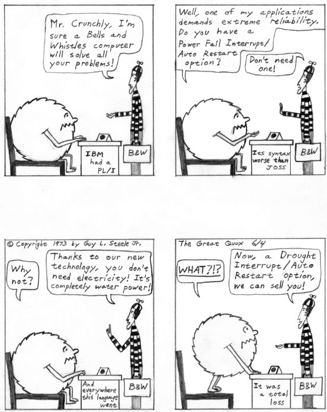

===
G
===

GandhiCon
=========

**GandhiCon**

There is a quote from Mohandas Gandhi, describing the stages of
establishment resistence to a winning strategy of nonviolent activism,
that partisans of `open source <./O.html#open-source.html>`__ and
especially `Linux <./L.html#Linux.html>`__ have embraced as almost an
explanatory framework for the behaviors they observe while trying to get
corporations and other large institutions to take new ways of doing
things seriously:

    First they ignore you. Then they laugh at you. Then they fight you.
    Then you win.

In hacker usage this quote has miscegenated with the U.S military's
`DefCon <http://www.fas.org/nuke/guide/usa/c3i/defcon.htm>`__
terminology describing ‘defense conditions’ or degrees of war alert. At
GandhiCon One, you're being ignored. At GandhiCon Two, opponents are
laughing at you and dismissing the idea that you could ever be a threat.
At GandhiCon Three, they're fighting you on the merits and/or attempting
to discredit you. At GandhiCon Four, you're winning and they are arguing
to save face or stave off complete collapse of their position.

gang bang
=========

**gang bang**: n.

The use of large numbers of loosely coupled programmers in an attempt to
wedge a great many features into a product in a short time. Though there
have been memorable gang bangs (e.g., that over-the-weekend assembler
port mentioned in Steven Levy's *Hackers*), and large numbers of
loosely-coupled programmers operating in `bazaar <./B.html#bazaar.html>`__
mode can do very useful work when they're not on a deadline, most are
perpetrated by large companies trying to meet unrealistic deadlines; the
inevitable result is enormous buggy masses of code entirely lacking in
`orthogonal <./O.html#orthogonal.html>`__\ ity. When market-driven
managers make a list of all the features the competition has and assign
one programmer to implement each, the probability of maintaining a
coherent (or even functional) design goes to
`epsilon <./E.html#epsilon.html>`__. See also
`firefighting <./F.html#firefighting.html>`__, `Mongolian Hordes
technique <./M.html#Mongolian-Hordes-technique.html>`__, `Conway's
Law <./C.html#Conways-Law.html>`__.

Gang of Four
============

**Gang of Four**: n.

(also abbreviated GOF) [prob. a play on the ‘Gang Of Four’ who briefly
ran Communist China after the death of Mao] Describes either the authors
or the book *Design Patterns: Elements of Reusable Object-Oriented
Software* published in 1995 by Addison-Wesley (ISBN 0-201-63361-2). The
authors forming the Gang Of Four are Erich Gamma, Richard Helm, Ralph
Johnson and John Vlissides. They are also sometimes referred to as
‘Gamma et. al.’ The authors state at
`http://www.hillside.net/patterns/DPBook/GOF.html <http://www.hillside.net/patterns/DPBook/GOF.html>`__
“Why are we ... called this? Who knows. Somehow the name just stuck.”
The term is also used to describe any of the design patterns that are
used in the book, referring to the patterns within it as ‘Gang Of Four
Patterns.’

garbage collect
===============

**garbage collect**: vi.

(also garbage collection, n.) See `GC <GC.html>`__.

garply
======

**garply**: /gar´plee/, n.

[Stanford] Another metasyntactic variable (see
`foo <./F.html#foo.html>`__); once popular among SAIL hackers.

gas
===

**gas**

[as in ‘gas chamber’]

1. interj. A term of disgust and hatred, implying that gas should be
dispensed in generous quantities, thereby exterminating the source of
irritation. “Some loser just reloaded the system for no reason! Gas!”

2. interj. A suggestion that someone or something ought to be flushed
out of mercy. “The system's getting `wedged <./W.html#wedged.html>`__
every few minutes. Gas!”

3. vt. To `flush <./F.html#flush.html>`__ (sense 1). “You should gas that
old crufty software.”

4. [IBM] n. Dead space in nonsequentially organized files that was
occupied by data that has since been deleted; the compression operation
that removes it is called degassing (by analogy, perhaps, with the use
of the same term in vacuum technology).

5. [IBM] n. Empty space on a disk that has been clandestinely allocated
against future need.

Gates's Law
===========

**Gates's Law**

“The speed of software halves every 18 months.” This oft-cited law is an
ironic comment on the tendency of software bloat to outpace the
every-18-month doubling in hardware capacity per dollar predicted by
`Moore's Law <./M.html#Moores-Law.html>`__. The reference is to Bill
Gates; Microsoft is widely considered among the worst if not the worst
of the perpetrators of bloat.

gawble
======

**gawble**: /gaw´bl/, n.

See `chawmp <./C.html#chawmp.html>`__.

GC
==

**GC**: /G·C/

[from LISP terminology; Garbage Collect]

1. vt. To clean up and throw away useless things. “I think I'll GC the
top of my desk today.”

2. vt. To recycle, reclaim, or put to another use.

3. n. An instantiation of the garbage collector process.

Garbage collection is computer-science techspeak for a particular class
of strategies for dynamically but transparently reallocating computer
memory (i.e., without requiring explicit allocation and deallocation by
higher-level software). One such strategy involves periodically scanning
all the data in memory and determining what is no longer accessible;
useless data items are then discarded so that the memory they occupy can
be recycled and used for another purpose. Implementations of the LISP
language usually use garbage collection.

In jargon, the full phrase is sometimes heard but the
`abbrev <./A.html#abbrev.html>`__ GC is more frequently used because it is
shorter. Note that there is an ambiguity in usage that has to be
resolved by context: “I'm going to garbage-collect my desk” usually
means to clean out the drawers, but it could also mean to throw away or
recycle the desk itself.

GCOS
====

**GCOS**: /jee´kohs/, n.

A `quick-and-dirty <./Q.html#quick-and-dirty.html>`__
`clone <./C.html#clone.html>`__ of System/360 DOS that emerged from GE
around 1970; originally called GECOS (the General Electric Comprehensive
Operating System). Later kluged to support primitive timesharing and
transaction processing. After the buyout of GE's computer division by
Honeywell, the name was changed to General Comprehensive Operating
System (GCOS). Other OS groups at Honeywell began referring to it as
‘God's Chosen Operating System’, allegedly in reaction to the GCOS
crowd's uninformed and snotty attitude about the superiority of their
product. All this might be of zero interest, except for two facts: (1)
The GCOS people won the political war, and this led in the orphaning and
eventual death of Honeywell `Multics <./M.html#Multics.html>`__, and (2)
GECOS/GCOS left one permanent mark on Unix. Some early Unix systems at
Bell Labs used GCOS machines for print spooling and various other
services; the field added to "/etc/passwd" to carry GCOS ID
information was called the GECOS field and survives today as the
**pw\_gecos** member used for the user's full name and other human-ID
information. GCOS later played a major role in keeping Honeywell a
dismal also-ran in the mainframe market, and was itself mostly ditched
for Unix in the late 1980s when Honeywell began to retire its aging
`big iron <./B.html#big-iron.html>`__ designs.

GECOS
=====

**GECOS**: /jee´kohs/, n.

See `GCOS <GCOS.html>`__.

gedanken
===========

**gedanken**: /g@·dahn´kn/, adj.

Ungrounded; impractical; not well-thought-out; untried; untested.

‘Gedanken’ is a German word for ‘thought’. A thought experiment is one
you carry out in your head. In physics, the term *gedanken experiment*
is used to refer to an experiment that is impractical to carry out, but
useful to consider because it can be reasoned about theoretically. (A
classic gedanken experiment of relativity theory involves thinking about
a man in an elevator accelerating through space.) Gedanken experiments
are very useful in physics, but must be used with care. It's too easy to
idealize away some important aspect of the real world in constructing
the ‘apparatus’.

Among hackers, accordingly, the word has a pejorative connotation. It is
typically used of a project, especially one in artificial intelligence
research, that is written up in grand detail (typically as a Ph.D.
thesis) without ever being implemented to any great extent. Such a
project is usually perpetrated by people who aren't very good hackers or
find programming distasteful or are just in a hurry. A gedanken thesis
is usually marked by an obvious lack of intuition about what is
programmable and what is not, and about what does and does not
constitute a clear specification of an algorithm. See also
`AI-complete <./A.html#AI-complete.html>`__, `DWIM <./D.html#DWIM.html>`__.

geef
====

**geef**: v.

[ostensibly from ‘gefingerpoken’] vt. Syn. `mung <./M.html#mung.html>`__.
See also `blinkenlights <./B.html#blinkenlights.html>`__.

geekasm
=======

**geekasm**

Originally from a quote on the PBS show *Scientific American Frontiers*
(week of May 21st 2002) by MIT professor Alex Slocum: “When they build a
machine, if they do the calculations right, the machine works and you
get this intense ... uhh ... just like a geekasm, from knowing that what
you created in your mind and on the computer is actually doing what you
told it to do”. Unsurprisingly, this usage went live on the Web almost
instantly. Every hacker knows this feeling. Compare earlier
`progasm <./P.html#progasm.html>`__.

geek code
=========

**geek code**: n.

(also “Code of the Geeks”). A set of codes commonly used in `sig
block <./S.html#sig-block.html>`__\ s to broadcast the interests, skills,
and aspirations of the poster. Features a G at the left margin followed
by numerous letter codes, often suffixed with plusses or minuses.
Because many net users are involved in computer science, the most common
prefix is ‘GCS’. To see a copy of the current code, browse
`http://www.geekcode.com/ <http://www.geekcode.com/>`__. Here is a
sample geek code (that of Robert Hayden, the code's inventor) from that
page::

  -----BEGIN GEEK CODE BLOCK-----
    Version: 3.1
    GED/J d-- s:++>: a- C++(++++)$ ULUO++ P+>+++ L++ !E---- W+(---) N+++
    o+ K+++ w+(---) O- M+$>++ V-- PS++(+++)>$ PE++(+)>$ Y++ PGP++ t- 5+++
    X++ R+++>$ tv+ b+ DI+++ D+++ G+++++>$ e++$>++++ h r-- y+\*\*
   ------END GEEK CODE BLOCK------

The geek code originated in 1993; it was inspired (according to the
inventor) by previous “bear”, “smurf” and “twink”
style-and-sexual-preference codes from lesbian and gay
`newsgroup <./N.html#newsgroup.html>`__\ s. It has in turn spawned
imitators; there is now even a “Saturn geek code” for owners of the
Saturn car. See also `geek <geek.html>`__.

geek
====

**geek**: n.

A person who has chosen concentration rather than conformity; one who
pursues skill (especially technical skill) and imagination, not
mainstream social acceptance. Geeks usually have a strong case of
`neophilia <./N.html#neophilia.html>`__. Most geeks are adept with
computers and treat `hacker <./H.html#hacker.html>`__ as a term of
respect, but not all are hackers themselves — and some who *are* in fact
hackers normally call themselves geeks anyway, because they (quite
properly) regard ‘hacker’ as a label that should be bestowed by others
rather than self-assumed.

One `description <http://www.darkwater.com/omni/geek.html>`__ accurately
if a little breathlessly enumerates “gamers, ravers, science fiction
fans, punks, perverts, programmers, nerds, subgenii, and trekkies. These
are people who did not go to their high school proms, and many would be
offended by the suggestion that they should have even wanted to.”

Originally, a geek was a carnival performer who bit the heads off
chickens. (In early 20th-century Scotland a ‘geek’ was an immature
coley, a type of fish.) Before about 1990 usage of this term was rather
negative. Earlier versions of this lexicon defined a computer geek as
one who eats (computer) bugs for a living — an asocial, malodorous,
pasty-faced monomaniac with all the personality of a cheese grater. This
is often still the way geeks are regarded by non-geeks, but as the
mainstream culture becomes more dependent on technology and technical
skill mainstream attitudes have tended to shift towards grudging
respect. Correspondingly, there are now ‘geek pride’ festivals (the
implied reference to ‘gay pride’ is not accidental).

See also `propeller head <./P.html#propeller-head.html>`__,
`clustergeeking <./C.html#clustergeeking.html>`__, `geek
out <geek-out.html>`__, `wannabee <./W.html#wannabee.html>`__, `terminal
junkie <./T.html#terminal-junkie.html>`__, `spod <./S.html#spod.html>`__,
`weenie <./W.html#weenie.html>`__, `geek code <geek-code.html>`__,
`alpha geek <./A.html#alpha-geek.html>`__.

geek out
========

**geek out**: vi.

To temporarily enter techno-nerd mode while in a non-hackish context,
for example at parties held near computer equipment. Especially used
when you need to do or say something highly technical and don't have
time to explain: “Pardon me while I geek out for a moment.” See
`geek <geek.html>`__; see also `propeller
head <./P.html#propeller-head.html>`__.

gender mender
=============

**gender mender**: n.

[common] A cable connector shell with either two male or two female
connectors on it, used to correct the mismatches that result when some
`loser <./L.html#loser.html>`__ didn't understand the RS232C specification
and the distinction between DTE and DCE. Used esp. for RS-232C parts in
either the original D-25 or the IBM PC's bogus D-9 format. Also called
gender bender, gender blender, sex changer, and even homosexual adapter;
however, there appears to be some confusion as to whether a male
homosexual adapter has pins on both sides (is doubly male) or sockets on
both sides (connects two males).

General Public Virus
====================

**General Public Virus**: n.

Pejorative name for some versions of the `GNU <GNU.html>`__ project
`copyleft <./C.html#copyleft.html>`__ or General Public License (GPL),
which requires that any tools or `app <./A.html#app.html>`__\ s
incorporating copylefted code must be source-distributed on the same
anti-proprietary terms as GNU stuff. Thus it is alleged that the
copyleft ‘infects’ software generated with GNU tools, which may in turn
infect other software that reuses any of its code. The Free Software
Foundation's official position is that copyright law limits the scope of
the GPL to “programs textually incorporating significant amounts of GNU
code”, and that the ‘infection’ is not passed on to third parties unless
actual GNU source is transmitted. Nevertheless, widespread suspicion
that the `copyleft <./C.html#copyleft.html>`__ language is ‘boobytrapped’
has caused many developers to avoid using GNU tools and the GPL. Changes
in the language of the version 2.0 GPL did not eliminate this problem.

generate
========

**generate**: vt.

To produce something according to an algorithm or program or set of
rules, or as a (possibly unintended) side effect of the execution of an
algorithm or program. The opposite of `parse <./P.html#parse.html>`__.
This term retains its mechanistic connotations (though often humorously)
when used of human behavior. “The guy is rational most of the time, but
mention nuclear energy around him and he'll generate
`infinite <./I.html#infinite.html>`__ flamage.”

gen
===

**gen**: /jen/, n.,v.

Short for `generate <generate.html>`__, used frequently in both spoken
and written contexts.

Genius From Mars Technique
==========================

**Genius From Mars Technique**: n.

[TMRC] A visionary quality which enables one to ignore the standard
approach and come up with a totally unexpected new algorithm. An attack
on a problem from an offbeat angle that no one has ever thought of
before, but that in retrospect makes total sense. Compare
`grok <grok.html>`__, `zen <./Z.html#zen.html>`__.

gensym
======

**gensym**: /jen´sim/

[from MacLISP for generated symbol]

1. v. To invent a new name for something temporary, in such a way that
the name is almost certainly not in conflict with one already in use.

2. n. The resulting name. The canonical form of a gensym is ‘Gnnnn’
where nnnn represents a number; any LISP hacker would recognize G0093
(for example) as a gensym.

3. A freshly generated data structure with a gensymmed name. Gensymmed
names are useful for storing or uniquely identifying crufties (see
`cruft <./C.html#cruft.html>`__).

Get a life!
===========

**Get a life!**: imp.

Hacker-standard way of suggesting that the person to whom it is directed
has succumbed to terminal geekdom (see `geek <geek.html>`__). Often
heard on `Usenet <./U.html#Usenet.html>`__, esp. as a way of suggesting
that the target is taking some obscure issue of
`theology <./T.html#theology.html>`__ too seriously. This exhortation was
popularized by William Shatner on a 1987 *Saturday Night Live* episode
in a speech that ended “Get a *life*!”, but it can be traced back at
least to ‘Valley Girl’ slang in 1983. It was certainly in wide use among
hackers for years before achieving mainstream currency via the sitcom
*Get A Life* in 1990.

Get a real computer!
====================

**Get a real computer!**: imp.

In 1996 when this entry first entered the File, it was the typical
hacker response to news that somebody is having trouble getting work
done on a system that (a) was single-tasking, (b) had no hard disk, or
(c) had an address space smaller than 16 megabytes. In 2003 anything
less powerful than a 500MHz Pentium with a multi-gigabyte hard disk
would probably be similarly written off. The threshold for ‘real
computer’ rises with time. See `bitty box <./B.html#bitty-box.html>`__ and
`toy <./T.html#toy.html>`__.

G
=

**G**: pref.,suff.

1. [SI] See `quantifiers <./Q.html#quantifiers.html>`__.

2. The letter G has special significance in the hacker community,
largely thanks to the GNU project and the GPL.

Many `free software <./F.html#free-software.html>`__ projects have names
that names that begin with G. The GNU project gave many of its projects
names that were acronyms beginning with the word “GNU”, such as “GNU C
Compiler” (gcc) and “GNU Debugger” (gdb), and this launched a tradition.
Just as many Java developers will begin their projects with J, many free
software developers will begin theirs with G. It is often the case that
a program with a G-prefixed name is licensed under the GNU GPL.

For example, someone may write a free Enterprise Engineering Kludge
package (EEK technology is all the rage in the technical journals) and
name it “geek” to imply that it is a GPL'd EEK package.

gib
===

**gib**: /jib/

1. vi. To destroy utterly. Like `frag <./F.html#frag.html>`__, but much
more violent and final. “There's no trace left. You definitely gibbed
that bug”.

2. n. Remnants after total obliteration.

Originated first by id software in the game Quake. It's short for
giblets (thus pronounced “jib”), and referred to the bloody remains of
slain opponents. Eventually the word was verbed, and leaked into general
usage afterward.

GIFs at 11
==========

**GIFs at 11**

[Fidonet] Fidonet alternative to `film at
11 <./F.html#film-at-11.html>`__, especially in echoes (Fidonet topic
areas) where uuencoded GIFs are permitted. Other formats, especially
JPEG and MPEG, may be referenced instead.

giga-
=====

**giga-**: /ji´ga/, /gi´ga/, pref.

[SI] See `quantifiers <./Q.html#quantifiers.html>`__.

gig
===

**gig**: /jig/, /gig/, n.

[SI] See `quantifiers <./Q.html#quantifiers.html>`__.

GIGO
====

**GIGO**: /gi:´goh/

1. ‘Garbage In, Garbage Out’ — usually said in response to
`luser <./L.html#luser.html>`__\ s who complain that a program didn't “do
the right thing” when given imperfect input or otherwise mistreated in
some way. Also commonly used to describe failures in human decision
making due to faulty, incomplete, or imprecise data.

2. Garbage In, Gospel Out: this more recent expansion is a sardonic
comment on the tendency human beings have to put excessive trust in
‘computerized’ data.

gilley
======

**gilley**: n.

[Usenet] The unit of analogical `bogosity <./B.html#bogosity.html>`__.
According to its originator, the standard for one gilley was “the act of
bogotoficiously comparing the shutting down of 1000 machines for a day
with the killing of one person”. The milligilley has been found to
suffice for most normal conversational exchanges.

gillion
=======

**gillion**: /gil´y@n/, /jil´y@n/, n.

[formed from `giga- <giga-.html>`__ by analogy with mega/million and
tera/trillion] "10^9". Same as an American billion or a British
milliard. How one pronounces this depends on whether one speaks
`giga- <giga-.html>`__ with a hard or soft ‘g’.

ginger
======

**ginger**: n.

See `saga <./S.html#saga.html>`__.

GIPS
====

**GIPS**: /gips/, /jips/, n.

[analogy with `MIPS <./M.html#MIPS.html>`__] Giga-Instructions per Second
(also possibly ‘Gillions of Instructions per Second’; see
`gillion <gillion.html>`__). Compare `KIPS <./K.html#KIPS.html>`__.

GIYF
====

**GIYF**: n.

Abbrev: Google Is Your Friend. Used to suggest, gently and politely,
that you have just asked a question of human beings that would have been
better directed to a search engine. See also
`STFW <./S.html#STFW.html>`__.

glark
=====

**glark**: /glark/, vt.

To figure something out from context. “The System III manuals are pretty
poor, but you can generally glark the meaning from context.”
Interestingly, the word was originally ‘glork’; the context was “This
gubblick contains many nonsklarkish English flutzpahs, but the overall
pluggandisp can be glorked [sic] from context” (David Moser, quoted by
Douglas Hofstadter in his *Metamagical Themas* column in the January
1981 *Scientific American*). It is conjectured that hacker usage mutated
the verb to ‘glark’ because `glork <glork.html>`__ was already an
established jargon term (some hackers do report using the original
term). Compare `grok <grok.html>`__, `zen <./Z.html#zen.html>`__.

glassfet
========

**glassfet**: /glas´fet/, n.

[by analogy with MOSFET, the acronym for Metal-Oxide-Semiconductor
Field-Effect Transistor] Syn. `firebottle <./F.html#firebottle.html>`__, a
humorous way to refer to a vacuum tube.

glass
=====

**glass**: n.

[IBM] Synonym for `silicon <./S.html#silicon.html>`__.

glass tty
=========

**glass tty**: /glas T·T·Y/, /glas ti´tee/, n.

[obs.] A terminal that has a display screen but which, because of
hardware or software limitations, behaves like a teletype or some other
printing terminal, thereby combining the disadvantages of both: like a
printing terminal, it can't do fancy display hacks, and like a display
terminal, it doesn't produce hard copy. An example is the early ‘dumb’
version of Lear-Siegler ADM 3 (without cursor control). See
`tube <./T.html#tube.html>`__, `tty <./T.html#tty.html>`__; compare `dumb
terminal <./D.html#dumb-terminal.html>`__. See *`TV
Typewriters <../tv-typewriters.html>`__* (Appendix A) for an interesting
true story about a glass tty.

glitch
======

**glitch**: /glich/

[very common; from German ‘glitschig’ slippery, via Yiddish ‘glitshen’,
to slide or skid]

1. n. A sudden interruption in electric service, sanity, continuity, or
program function. Sometimes recoverable. An interruption in electric
service is specifically called a power glitch (also `power
hit <./P.html#power-hit.html>`__), of grave concern because it usually
crashes all the computers. In jargon, though, a hacker who got to the
middle of a sentence and then forgot how he or she intended to complete
it might say, “Sorry, I just glitched”.

2. vi. To commit a glitch. See `gritch <gritch.html>`__.

3. vt. [Stanford] To scroll a display screen, esp. several lines at a
time. `WAITS <./W.html#WAITS.html>`__ terminals used to do this in order
to avoid continuous scrolling, which is distracting to the eye.

4. obs. Same as `magic cookie <./M.html#magic-cookie.html>`__, sense 2.

All these uses of glitch derive from the specific technical meaning the
term has in the electronic hardware world, where it is now techspeak. A
glitch can occur when the inputs of a circuit change, and the outputs
change to some `random <./R.html#random.html>`__ value for some very brief
time before they settle down to the correct value. If another circuit
inspects the output at just the wrong time, reading the random value,
the results can be very wrong and very hard to debug (a glitch is one of
many causes of electronic `heisenbug <./H.html#heisenbug.html>`__\ s).

Coping with a hydraulic `glitch <glitch.html>`__.

(The next cartoon in the Crunchly saga is
`73-07-24 <../O.html#overflow-bit>`__. The previous one
is `73-05-28 <../B.html#bells-and-whistles>`__.)

glob
====

**glob**: /glob/, *not*, /glohb/, v.,n.

[Unix; common] To expand special characters in a wildcarded name, or the
act of so doing (the action is also called globbing). The Unix
conventions for filename wildcarding have become sufficiently pervasive
that many hackers use some of them in written English, especially in
email or news on technical topics. Those commonly encountered include
the following:

+------+        +
| \*   | wildcard for any string (see also `UN\*X <./U.html#UN-asterisk-X.html>`__)                                       |
+------+        +
| ?    | wildcard for any single character (generally read this way only at the beginning or in the middle of a word)   |
+------+        +
| []   | delimits a wildcard matching any of the enclosed characters                                                    |
+------+        +
| {}   | alternation of comma-separated alternatives; thus, ‘foo{baz,qux}’ would be read as ‘foobaz’ or ‘fooqux’        |
+------+        +

Some examples: “He said his name was [KC]arl” (expresses ambiguity). “I
don't read talk.politics.\*” (any of the talk.politics subgroups on
`Usenet <./U.html#Usenet.html>`__). Other examples are given under the
entry for `X <./X.html#X.html>`__. Note that glob patterns are similar,
but not identical, to those used in `regexp <./R.html#regexp.html>`__\ s.

Historical note: The jargon usage derives from **glob**, the name of a
subprogram that expanded wildcards in archaic pre-Bourne versions of the
Unix shell.

glork
=====

**glork**: /glork/

1. interj. Term of mild surprise, usually tinged with outrage, as when
one attempts to save the results of two hours of editing and finds that
the system has just crashed.

2. Used as a name for just about anything. See
`foo <./F.html#foo.html>`__.

3. vt. Similar to `glitch <glitch.html>`__, but usually used
reflexively. “My program just glorked itself.”

4. Syn. for `glark <glark.html>`__, which see.

glue
====

**glue**: n.

Generic term for any interface logic or protocol that connects two
component blocks. For example, `Blue Glue <./B.html#Blue-Glue.html>`__ is
IBM's SNA protocol, and hardware designers call anything used to connect
large VLSI's or circuit blocks glue logic.

gnarly
======

**gnarly**: /nar´lee/, adj.

Both `obscure <./O.html#obscure.html>`__ and `hairy <./H.html#hairy.html>`__
(sense 1). “\ `Yow! <./Y.html#Yow-.html>`__ — the tuned assembler
implementation of BitBlt is really gnarly!” From a similar but less
specific usage in surfer slang.

gnubie
======

**gnubie**: /noo´bee/, n.

Written-only variant of `newbie <./N.html#newbie.html>`__ in common use on
IRC channels, which implies specifically someone who is new to the
Linux/open-source/free-software world.

GNU
===

**GNU**: /gnoo/, *not*, /noo/

1. [acronym: ‘GNU’s Not Unix!', see `recursive
acronym <./R.html#recursive-acronym.html>`__] A Unix-workalike development
effort of the Free Software Foundation headed by Richard Stallman. GNU
EMACS and the GNU C compiler, two tools designed for this project, have
become very popular in hackerdom and elsewhere. The GNU project was
designed partly to proselytize for RMS's position that information is
community property and all software source should be shared. One of its
slogans is “Help stamp out software hoarding!” Though this remains
controversial (because it implicitly denies any right of designers to
own, assign, and sell the results of their labors), many hackers who
disagree with RMS have nevertheless cooperated to produce large amounts
of high-quality software for free redistribution under the Free Software
Foundation's imprimatur. The GNU project has a web page at
`http://www.gnu.org/ <http://www.gnu.org/>`__. See
`EMACS <./E.html#EMACS.html>`__, `copyleft <./C.html#copyleft.html>`__,
`General Public Virus <General-Public-Virus.html>`__,
`Linux <./L.html#Linux.html>`__.

2. Noted Unix hacker John Gilmore "<gnu@toad.com>"}, founder of
Usenet's anarchic alt.\* hierarchy.

GNUMACS
=======

**GNUMACS**: /gnoo´maks/, n.

[contraction of ‘GNU EMACS’] Often-heard abbreviated name for the
`GNU <GNU.html>`__ project's flagship tool,
`EMACS <./E.html#EMACS.html>`__. StallMACS, referring to Richard Stallman,
is less common but also heard. Used esp. in contrast with
`GOSMACS <GOSMACS.html>`__ and X Emacs.

goat file
=========

**goat file**

A sacrificial file used to test a computer virus, i.e. a dummy
executable that carries a sample of the virus, isolated so it can be
studied. Not common among hackers, since the Unix systems most use
basically don't get viruses.

GoAT
====

**GoAT**: //

[Usenet] Abbreviation: “Go Away, Troll”. See
`troll <./T.html#troll.html>`__.

gobble
======

**gobble**: vt.

1. To consume, usu.: used with ‘up’. “The output spy gobbles characters
out of a `tty <./T.html#tty.html>`__ output buffer.”

2. To obtain, usu.: used with ‘down’. “I guess I'll gobble down a copy
of the documentation tomorrow.” See also `snarf <./S.html#snarf.html>`__.

Godwin's Law
============

**Godwin's Law**: prov.

[Usenet] “As a Usenet discussion grows longer, the probability of a
comparison involving Nazis or Hitler approaches one.” There is a
tradition in many groups that, once this occurs, that thread is over,
and whoever mentioned the Nazis has automatically lost whatever argument
was in progress. Godwin's Law thus practically guarantees the existence
of an upper bound on thread length in those groups. However there is
also a widely- recognized codicil that any *intentional* triggering of
Godwin's Law in order to invoke its thread-ending effects will be
unsuccessful. Godwin himself has `discussed the
subject <http://www.wired.com/wired/archive/2.10/godwin.if_pr.html>`__.
See also `Formosa's Law <./F.html#Formosas-Law.html>`__.

Godzillagram
============

**Godzillagram**: /god·zil'@·gram/, n.

[from Japan's national hero]

1. A network packet that in theory is a broadcast to every machine in
the universe. The typical case is an IP datagram whose destination IP
address is [255.255.255.255]. Fortunately, few gateways are foolish
enough to attempt to implement this case!

2. A network packet of maximum size. An IP Godzillagram has 65,535
octets. Compare `super source
quench <./S.html#super-source-quench.html>`__, `Christmas tree
packet <./C.html#Christmas-tree-packet.html>`__,
`martian <./M.html#martian.html>`__.

go-faster stripes
=================

**go-faster stripes**: n.

[UK] Syn. `chrome <./C.html#chrome.html>`__. Mainstream in some parts of
UK.

go flatline
===========

**go flatline**: v.

[from cyberpunk SF, refers to flattening of EEG traces upon brain-death]
(also adjectival flatlined).

1. To `die <./D.html#die.html>`__, terminate, or fail, esp. irreversibly.
In hacker parlance, this is used of machines only, human death being
considered somewhat too serious a matter to employ jargon-jokes about.

2. To go completely quiescent; said of machines undergoing controlled
shutdown. “You can suffer file damage if you shut down Unix but power
off before the system has gone flatline.”

3. Of a video tube, to fail by losing vertical scan, so all one sees is
a bright horizontal line bisecting the screen.

go gold
=======

**go gold**: v.

[common] See `golden <golden.html>`__.

golden
======

**golden**: adj.

[prob.: from folklore's ‘golden egg’] When used to describe a magnetic
medium (e.g., golden disk, golden tape), describes one containing a
tested, up-to-spec, ready-to-ship software version. Compare
`platinum-iridium <./P.html#platinum-iridium.html>`__. One may also “go
gold”, which is the act of releasing a golden version. The gold color of
many CDROMs is a coincidence; this term was well established a decade
before CDROM distribution become common in the mid-1990s.

golf-ball printer
=================

**golf-ball printer**: n. obs.

The IBM 2741, a slow but letter-quality printing device and terminal
based on the IBM Selectric typewriter. The golf ball was a little
spherical frob bearing reversed embossed images of 88 different
characters arranged on four parallels of latitude; one could change the
font by swapping in a different golf ball. The print element spun and
jerked alarmingly in action and when in motion was sometimes described
as an infuriated golf ball. This was the technology that enabled APL to
use a non-EBCDIC, non-ASCII, and in fact completely non-standard
character set. This put it 10 years ahead of its time — where it stayed,
firmly rooted, for the next 20, until character displays gave way to
programmable bit-mapped devices with the flexibility to support other
character sets.

gonk
====

**gonk**: /gonk/, vi.,n.

1. [prob. back-formed from `gonkulator <gonkulator.html>`__.] To
prevaricate or to embellish the truth beyond any reasonable recognition.
In German the term is (mythically) gonken; in Spanish the verb becomes
gonkar. “You're gonking me. That story you just told me is a bunch of
gonk.” In German, for example, “Du gonkst mich” (You're pulling my leg).
See also `gonkulator <gonkulator.html>`__.

2. [British] To grab some sleep at an odd time; compare `gronk
out <gronk-out.html>`__.

gonkulator
==========

**gonkulator**: /gon´kyoo·lay·tr/, n.

[common; from the 1960s *Hogan's Heroes* TV series] A pretentious piece
of equipment that actually serves no useful purpose. Usually used to
describe one's least favorite piece of computer hardware. See
`gonk <gonk.html>`__.

gonzo
=====

**gonzo**: /gon´zoh/, adj.

[from Hunter S. Thompson]

1. With total commitment, total concentration, and a mad sort of
panache. (Thompson's original sense.)

2. More loosely: Overwhelming; outrageous; over the top; very large,
esp. used of collections of source code, source files, or individual
functions. Has some of the connotations of `moby <./M.html#moby.html>`__
and `hairy <./H.html#hairy.html>`__, but without the implication of
obscurity or complexity.

Good Thing
==========

**Good Thing**: n.,adj.

[very common; always pronounced as if capitalized. Orig. fr. the 1930
Sellar & Yeatman parody of British history *1066 And All That*, but
well-established among hackers in the U.S. as well.]

1. Self-evidently wonderful to anyone in a position to notice: “A
language that manages dynamic memory automatically for you is a Good
Thing.”

2. Something that can't possibly have any ill side-effects and may save
considerable grief later: “Removing the self-modifying code from that
shared library would be a Good Thing.”

3. When said of software tools or libraries, as in “YACC is a Good
Thing”, specifically connotes that the thing has drastically reduced a
programmer's work load. Oppose `Bad Thing <./B.html#Bad-Thing.html>`__.

google
======

**google**: v.

[common] To search the Web using the Google search engine,
`http://www.google.com <http://www.google.com>`__. Google is highly
esteemed among hackers for its significance ranking system, which is so
uncannily effective that many hackers consider it to have rendered other
search engines effectively irrelevant. The name ‘google’ has additional
flavor for hackers because most know that it was copied from a
mathematical term for ten to the 100th power, famously first uttered as
‘googol’ by a mathematician's nine-year-old nephew.

google juice
============

**google juice**: n.

A hypothetical substance which attracts the index bots of Google.com. In
common usage, a web page or web site with high placement in the results
of a particular search on Google or frequent placement in the results of
a various searches is said to have “a lot of google juice” or “good
google juice”. Also used to compare web pages or web sites, for example
“CrackMonkey has more google juice than KPMG”. See also
`juice <./J.html#juice.html>`__, `kilogoogle <./K.html#kilogoogle.html>`__.

gopher hole
===========

**gopher hole**: n.

1. Any access to a `gopher <gopher.html>`__.

2. [Amateur Packet Radio] The terrestrial analog of a
`wormhole <./W.html#wormhole.html>`__ (sense 2), from which this term was
coined. A gopher hole links two amateur packet relays through some
non-ham radio medium.

gopher
======

**gopher**: n.

[obs.] A type of Internet service first floated around 1991 and
obsolesced around 1995 by the World Wide Web. Gopher presents a menuing
interface to a tree or graph of links; the links can be to documents,
runnable programs, or other gopher menus arbitrarily far across the net.

Some claim that the gopher software, which was originally developed at
the University of Minnesota, was named after the Minnesota Gophers (a
sports team). Others claim the word derives from American slang gofer
(from “go for”, dialectal “go fer”), one whose job is to run and fetch
things. Finally, observe that gophers dig long tunnels, and the idea of
tunneling through the net to find information was a defining metaphor
for the developers. Probably all three things were true, but with the
first two coming first and the gopher-tunnel metaphor serendipitously
adding flavor and impetus to the project as it developed out of its
concept stage.

gorets
======

**gorets**: /gor´ets/, n.

The unknown ur-noun, fill in your own meaning. Found esp. on the Usenet
newsgroup "alt.gorets", which seems to be a running contest to
redefine the word by implication in the funniest and most peculiar way,
with the understanding that no definition is ever final. [A
correspondent from the former Soviet Union informs me that *gorets* is
Russian for ‘mountain dweller’. Another from France informs me that
*goret* is archaic French for a young pig —ESR] Compare
`frink <./F.html#frink.html>`__.

gorilla arm
===========

**gorilla arm**: n.

The side-effect that destroyed touch-screens as a mainstream input
technology despite a promising start in the early 1980s. It seems the
designers of all those `spiffy <./S.html#spiffy.html>`__ touch-menu
systems failed to notice that humans aren't designed to hold their arms
in front of their faces making small motions. After more than a very few
selections, the arm begins to feel sore, cramped, and oversized — the
operator looks like a gorilla while using the touch screen and feels
like one afterwards. This is now considered a classic cautionary tale to
human-factors designers; “Remember the gorilla arm!” is shorthand for
“How is this going to fly in *real* use?”.

go root
=======

**go root**: vi.

[Unix; common] To temporarily enter `root
mode <./R.html#root-mode.html>`__ in order to perform a privileged
operation. This use is deprecated in Australia, where v. ‘root’ is a
synonym for “fuck”.

gorp
====

**gorp**: /gorp/, n.

[CMU: perhaps from the canonical hiker's food, Good Old Raisins and
Peanuts] Another `metasyntactic
variable <./M.html#metasyntactic-variable.html>`__, like
`foo <./F.html#foo.html>`__ and `bar <./B.html#bar.html>`__.

GOSMACS
=======

**GOSMACS**: /goz´maks/, n.

[contraction of ‘Gosling EMACS’] The first
`EMACS <./E.html#EMACS.html>`__-in-C implementation, predating but now
largely eclipsed by `GNUMACS <GNUMACS.html>`__. Originally freeware; a
commercial version was modestly popular as ‘UniPress EMACS’ during the
1980s. The author, James Gosling, went on to invent
`NeWS <./N.html#NeWS.html>`__ and the programming language Java; the
latter earned him `demigod <./D.html#demigod.html>`__ status.

gotcha
======

**gotcha**: n.

A `misfeature <./M.html#misfeature.html>`__ of a system, especially a
programming language or environment, that tends to breed bugs or
mistakes because it is both enticingly easy to invoke and completely
unexpected and/or unreasonable in its outcome. For example, a classic
gotcha in `C <./C.html#C.html>`__ is the fact that **if (a=b) {code;**} is
syntactically valid and sometimes even correct. It puts the value of
**b** into **a** and then executes **code** if **a** is non-zero. What
the programmer probably meant was **if (a==b) {code;**}, which executes
**code** if **a** and **b** are equal.

GPL
===

**GPL**: /G·P·L/, n.

Abbreviation for ‘General Public License’ in widespread use; see
`copyleft <./C.html#copyleft.html>`__, `General Public
Virus <General-Public-Virus.html>`__. Often mis-expanded as ‘GNU Public
License’.

GPV
===

**GPV**: /G·P·V/, n.

Abbrev. for `General Public Virus <General-Public-Virus.html>`__ in
widespread use.

gray goo
========

**gray goo**: n.

A hypothetical substance composed of `sagan <./S.html#sagan.html>`__\ s of
sub-micron-sized self-replicating robots programmed to make copies of
themselves out of whatever is available. The image that goes with the
term is one of the entire biosphere of Earth being eventually converted
to robot goo. This is the simplest of the
`nanotechnology <./N.html#nanotechnology.html>`__ disaster scenarios,
easily refuted by arguments from energy requirements and elemental
abundances. Compare `blue goo <./B.html#blue-goo.html>`__.

gray hat
========

**gray hat**

See `black hat <./B.html#black-hat.html>`__.

Great Internet Explosion
========================

**Great Internet Explosion**

The mainstreaming of the Internet in 1993-1994. Used normally in time
comparatives; before the Great Internet Explosion and after it were very
different worlds from a hacker's point of view. Before it, Internet
access was expensive and available only to an elite few through
universities, research laboratories, and well-heeled corporations; after
it, everybody's mother had access.

Great Renaming
==============

**Great Renaming**: n.

The `flag day <./F.html#flag-day.html>`__ in 1987 on which all of the
non-local groups on the `Usenet <./U.html#Usenet.html>`__ had their names
changed from the net.- format to the current multiple-hierarchies
scheme. Used esp. in discussing the history of newsgroup names. “The
oldest sources group is "comp.sources.misc"; before the Great
Renaming, it was "net.sources".” There is a `Great Renaming
FAQ <http://www.vrx.net/usenet/history/rename.html>`__ on the Web.

Great Runes
===========

**Great Runes**: n.

Uppercase-only text or display messages. Some archaic operating systems
still emit these. See also `runes <./R.html#runes.html>`__, `smash
case <./S.html#smash-case.html>`__, `fold case <./F.html#fold-case.html>`__.

There is a widespread legend (repeated by earlier versions of this
entry, though tagged as folklore) that the uppercase-only support of
various old character codes and I/O equipment was chosen by a religious
person in a position of power at the Teletype Company because supporting
both upper and lower cases was too expensive and supporting lower case
only would have made it impossible to spell ‘God’ correctly. Not true;
the upper-case interpretation of teleprinter codes was well established
by 1870, long before Teletype was even founded.

great-wall
==========

**great-wall**: vi.,n.

[from SF fandom] A mass expedition to an oriental restaurant, esp. one
where food is served family-style and shared. There is a common
heuristic about the amount of food to order, expressed as “Get "N - 1"
entrees”; the value of "N", which is the number of people in the
group, can be inferred from context (see `N <./N.html#N.html>`__). See
`oriental food <./O.html#oriental-food.html>`__,
`ravs <./R.html#ravs.html>`__, `stir-fried
random <./S.html#stir-fried-random.html>`__.

Great Worm
==========

**Great Worm**: n.

The 1988 Internet `worm <./W.html#worm.html>`__ perpetrated by
`RTM <./R.html#RTM.html>`__. This is a play on Tolkien (compare
`elvish <./E.html#elvish.html>`__, `elder
days <./E.html#elder-days.html>`__). In the fantasy history of his Middle
Earth books, there were dragons powerful enough to lay waste to entire
regions; two of these (Scatha and Glaurung) were known as “the Great
Worms”. This usage expresses the connotation that the RTM crack was a
sort of devastating watershed event in hacker history; certainly it did
more to make non-hackers nervous about the Internet than anything before
or since.

greenbar
========

**greenbar**: n.

A style of fanfolded continuous-feed paper with alternating green and
white bars on it, especially used in old-style line printers. This slang
almost certainly dates way back to mainframe days.

green bytes
===========

**green bytes**: n.

(also green words)

1. Meta-information embedded in a file, such as the length of the file
or its name; as opposed to keeping such information in a separate
description file or record. The term comes from an IBM user's group
meeting (ca. 1962) at which these two approaches were being debated and
the diagram of the file on the blackboard had the green bytes drawn in
green.

2. By extension, the non-data bits in any self-describing format. “A GIF
file contains, among other things, green bytes describing the packing
method for the image.” Compare
`out-of-band <./O.html#out-of-band.html>`__,
`zigamorph <./Z.html#zigamorph.html>`__, `fence <./F.html#fence.html>`__
(sense 1).

green card
==========

**green card**: n.

[after the *IBM System/360 Reference Data* card] A summary of an
assembly language, even if the color is not green and not a card. Less
frequently used now because of the decrease in the use of assembly
language. “I'll go get my green card so I can check the addressing mode
for that instruction.”

The original green card became a yellow card when the System/370 was
introduced, and later a yellow booklet. An anecdote from IBM refers to a
scene that took place in a programmers' terminal room at Yorktown in
1978. A `luser <./L.html#luser.html>`__ overheard one of the programmers
ask another “Do you have a green card?” The other grunted and passed the
first a thick yellow booklet. At this point the luser turned a delicate
shade of olive and rapidly left the room, never to return.

In fall 2000 it was reported from Electronic Data Systems that the green
card for 370 machines has been a blue-green booklet since 1989.

green lightning
===============

**green lightning**: n.

[IBM]

1. Apparently random flashing streaks on the face of 3278-9 terminals
while a new symbol set is being downloaded. This hardware bug was left
deliberately unfixed, as some genius within IBM suggested it would let
the user know that ‘something is happening’. That, it certainly does.
Later microprocessor-driven IBM color graphics displays were actually
*programmed* to produce green lightning!

2. [proposed] Any bug perverted into an alleged feature by adroit
rationalization or marketing. “Motorola calls the CISC cruft in the
88000 architecture ‘compatibility logic’, but I call it green
lightning”. See also `feature <./F.html#feature.html>`__ (sense 6).

green machine
=============

**green machine**: n.

A computer or peripheral device that has been designed and built to
military specifications for field equipment (that is, to withstand
mechanical shock, extremes of temperature and humidity, and so forth).
Comes from the olive-drab ‘uniform’ paint used for military equipment.

Green's Theorem
===============

**Green's Theorem**: prov.

[TMRC] For any story, in any group of people there will be at least one
person who has not heard the story. A refinement of the theorem states
that there will be *exactly* one person (if there were more than one, it
wouldn't be as bad to re-tell the story). [The name of this theorem is a
play on a fundamental theorem in calculus. —ESR]

grep
====

**grep**: /grep/, vi.

[from the qed/ed editor idiom g/re/p, where re stands for a regular
expression, to Globally search for the Regular Expression and Print the
lines containing matches to it, via `Unix <./U.html#Unix.html>`__ grep(1)]
To rapidly scan a file or set of files looking for a particular string
or pattern (when browsing through a large set of files, one may speak of
grepping around). By extension, to look for something by pattern. “Grep
the bulletin board for the system backup schedule, would you?” See also
`vgrep <./V.html#vgrep.html>`__.

[It has been alleged that the source is from the title of a paper “A
General Regular Expression Parser”, but dmr confirms the g/re/p
etymology --ESR]

gribble
=======

**gribble**: n.

Random binary data rendered as unreadable text. Noise characters in a
data stream are displayed as gribble. Dumping a binary file to the
screen is an excellent source of gribble, and (if the bell/speaker is
active) headaches.

grilf
=====

**grilf**: //, n.

Girlfriend. Like `newsfroup <./N.html#newsfroup.html>`__ and
`filk <./F.html#filk.html>`__, a typo reincarnated as a new word. Seems to
have originated sometime in 1990 on `Usenet <./U.html#Usenet.html>`__. [A
friend tells me there was a Lloyd Biggle SF novel *Watchers Of The
Dark*, in which alien species after species goes insane and begins to
chant “Grilf! Grilf!”. A human detective eventually determines that the
word means “Liar!” I hope this has nothing to do with the popularity of
the Usenet term. —ESR]

grind crank
===========

**grind crank**: n., //

A mythical accessory to a terminal. A crank on the side of a monitor,
which when operated makes a zizzing noise and causes the computer to run
faster. Usually one does not refer to a grind crank out loud, but merely
makes the appropriate gesture and noise. See `grind <grind.html>`__.

Historical note: At least one real machine actually had a grind crank —
the R1, a research machine built toward the end of the days of the great
vacuum tube computers, in 1959. R1 (also known as ‘The Rice Institute
Computer’ (TRIC) and later as ‘The Rice University Computer’ (TRUC)) had
a single-step/free-run switch for use when debugging programs. Since
single-stepping through a large program was rather tedious, there was
also a crank with a cam and gear arrangement that repeatedly pushed the
single-step button. This allowed one to ‘crank’ through a lot of code,
then slow down to single-step for a bit when you got near the code of
interest, poke at some registers using the console typewriter, and then
keep on cranking. See
`http://www.cs.rice.edu/History/R1/ <http://www.cs.rice.edu/History/R1/>`__.

grind
=====

**grind**: vt.

1. [MIT and Berkeley; now rare] To prettify hardcopy of code, especially
LISP code, by reindenting lines, printing keywords and comments in
distinct fonts (if available), etc. This usage was associated with the
MacLISP community and is now rare;
`prettyprint <./P.html#prettyprint.html>`__ was and is the generic term
for such operations.

2. [Unix] To generate the formatted version of a document from the
`troff <./T.html#troff.html>`__, `TeX <./T.html#TeX.html>`__, or Scribe
source.

3. [common] To run seemingly interminably, esp. (but not necessarily) if
performing some tedious and inherently useless task. Similar to
`crunch <./C.html#crunch.html>`__ or `grovel <grovel.html>`__. Grinding
has a connotation of using a lot of CPU time, but it is possible to
grind a disk, network, etc. See also `hog <./H.html#hog.html>`__.

4. To make the whole system slow. “Troff really grinds a
`PDP-11 <./P.html#PDP-11.html>`__.”

5. grind grind excl. Roughly, “Isn't the machine slow today!”

gritch
======

**gritch**: /grich/

[MIT]

1. n. A complaint (often caused by a `glitch <glitch.html>`__).

2. vi. To complain. Often verb-doubled: “Gritch gritch”.

3. A synonym for `glitch <glitch.html>`__ (as verb or noun).

Interestingly, this word seems to have a separate history from
`glitch <glitch.html>`__, with which it is often confused. Back in the
early 1960s, when ‘glitch’ was strictly a hardware-tech's term of art,
the Burton House dorm at M.I.T. maintained a “Gritch Book”, a blank
volume, into which the residents hand-wrote complaints, suggestions, and
witticisms. Previous years' volumes of this tradition were maintained,
dating back to antiquity. The word “gritch” was described as a
portmanteau of “gripe” and “bitch”. Thus, sense 3 above is at least
historically incorrect.

grok
====

**grok**: /grok/, /grohk/, vt.

[common; from the novel *Stranger in a Strange Land*, by Robert A.
Heinlein, where it is a Martian word meaning literally ‘to drink’ and
metaphorically ‘to be one with’] The emphatic form is grok in fullness.

1. To understand. Connotes intimate and exhaustive knowledge. When you
claim to ‘grok’ some knowledge or technique, you are asserting that you
have not merely learned it in a detached instrumental way but that it
has become part of you, part of your identity. For example, to say that
you “know” `LISP <./L.html#LISP.html>`__ is simply to assert that you can
code in it if necessary — but to say you “grok” LISP is to claim that
you have deeply entered the world-view and spirit of the language, with
the implication that it has transformed your view of programming.
Contrast `zen <./Z.html#zen.html>`__, which is similar supernal
understanding experienced as a single brief flash. See also
`glark <glark.html>`__.

2. Used of programs, may connote merely sufficient understanding.
“Almost all C compilers grok the **void** type these days.”

gronked
=======

**gronked**: adj.

1. Broken. “The teletype scanner was gronked, so we took the system
down.”

2. Of people, the condition of feeling very tired or (less commonly)
sick. “I've been chasing that bug for 17 hours now and I am thoroughly
gronked!” Compare `broken <./B.html#broken.html>`__, which means about the
same as `gronk <gronk.html>`__ used of hardware, but connotes
depression or mental/emotional problems in people.

gronk
=====

**gronk**: /gronk/, vt.

[popularized by Johnny Hart's comic strip *B.C.:* but the word
apparently predates that]

1. To clear the state of a wedged device and restart it. More severe
than ‘to `frob <./F.html#frob.html>`__\ ’ (sense 2).

2. [TMRC] To cut, sever, smash, or similarly disable.

3. The sound made by many 3.5-inch diskette drives. In particular, the
microfloppies on a Commodore Amiga go “grink, gronk”.

gronk out
=========

**gronk out**: vi.

To cease functioning. Of people, to go home and go to sleep. “I guess
I'll gronk out now; see you all tomorrow.”

grovel
======

**grovel**: vi.

1. To work interminably and without apparent progress. Often used
transitively with ‘over’ or ‘through’. “The file scavenger has been
groveling through the /usr directories for 10 minutes now.” Compare
`grind <grind.html>`__ and `crunch <./C.html#crunch.html>`__. Emphatic
form: grovel obscenely.

2. To examine minutely or in complete detail. “The compiler grovels over
the entire source program before beginning to translate it.” “I
grovelled through all the documentation, but I still couldn't find the
command I wanted.”

grue
====

**grue**: n.

[from archaic English verb for shudder, as with fear] The grue was
originated in the game `Zork <./Z.html#Zork.html>`__ (Dave Lebling took
the name from Jack Vance's *Dying Earth* fantasies) and used in several
other `Infocom <./I.html#Infocom.html>`__ games as a hint that you should
perhaps look for a lamp, torch or some type of light source. Wandering
into a dark area would cause the game to prompt you, “It is very dark.
If you continue you are likely to be eaten by a grue.” If you failed to
locate a light source within the next couple of moves this would indeed
be the case.

The grue, according to scholars of the Great Underground Empire, is a
sinister, lurking presence in the dark places of the earth. Its favorite
diet is either adventurers or enchanters, but its insatiable appetite is
tempered by its extreme fear of light. No grues have ever been seen by
the light of day, and only a few have been observed in their underground
lairs. Of those who have seen grues, few have survived their fearsome
jaws to tell the tale. Grues have sickly glowing fur, fish-mouthed
faces, sharp claws and fangs, and an uncontrollable tendency to slaver
and gurgle. They are certainly the most evil-tempered of all creatures;
to say they are touchy is a dangerous understatement. “Sour as a grue”
is a common expression, even among grues themselves.

All this folklore is widely known among hackers.

grunge
======

**grunge**: /gruhnj/, n.

1. That which is grungy, or that which makes it so.

2. [Cambridge] Code which is inaccessible due to changes in other parts
of the program. The preferred term in North America is `dead
code <./D.html#dead-code.html>`__.

gubbish
=======

**gubbish**: /guhb'@sh/, n.

[a portmanteau of ‘garbage’ and ‘rubbish’; may have originated with SF
author Philip K. Dick] Garbage; crap; nonsense. “What is all this
gubbish?” The opposite portmanteau ‘rubbage’ is also reported; in fact,
it was British slang during the 19th century and appears in Dickens.

Guido
=====

**Guido**: /gwee´do/, /khwee´do/

Without qualification, Guido van Rossum (author of
`Python <./P.html#Python.html>`__). Note that Guido answers to English
/gwee´do/ but in Dutch it's /khwee´do/. Mythically, Guido's most
important attribute besides Python itself is Guido's time machine, a
device he is reputed to possess because of the unnerving frequency with
which user requests for new features have been met with the response “I
just implemented that last night...”. See `BDFL <./B.html#BDFL.html>`__.

guiltware
=========

**guiltware**: /gilt´weir/, n.

1. A piece of `freeware <./F.html#freeware.html>`__ decorated with a
message telling one how long and hard the author worked on it and
intimating that one is a no-good freeloader if one does not immediately
send the poor suffering martyr gobs of money.

2. A piece of `shareware <./S.html#shareware.html>`__ that works.

gumby
=====

**gumby**: /guhm´bee/, n.

[from a class of Monty Python characters, poss. with some influence from
the 1960s claymation character]

1. An act of minor but conspicuous stupidity, often in gumby maneuver or
pull a gumby.

2. [NRL] n. A bureaucrat, or other technical incompetent who impedes the
progress of real work.

3. adj. Relating to things typically associated with people in sense 2.
(e.g. “Ran would be writing code, but Richard gave him gumby work that's
due on Friday”, or, “Dammit! Travel screwed up my plane tickets. I have
to go out on gumby patrol.”)

gunch
=====

**gunch**: /guhnch/, vt.

[TMRC] To push, prod, or poke at a device that has almost (but not
quite) produced the desired result. Implies a threat to
`mung <./M.html#mung.html>`__.

gunpowder chicken
=================

**gunpowder chicken**: n.

Same as `laser chicken <./L.html#laser-chicken.html>`__.

guru
====

**guru**: n.

[Unix] An expert. Implies not only `wizard <./W.html#wizard.html>`__ skill
but also a history of being a knowledge resource for others. Less often,
used (with a qualifier) for other experts on other systems, as in VMS
guru. See `source of all good
bits <./S.html#source-of-all-good-bits.html>`__.

guru meditation
===============

**guru meditation**: n.

Amiga equivalent of panic in Unix (sometimes just called a guru or guru
event). When the system crashes, a cryptic message of the form “GURU
MEDITATION #XXXXXXXX.YYYYYYYY” may appear, indicating what the problem
was. An Amiga guru can figure things out from the numbers. Sometimes a
`guru <guru.html>`__ event must be followed by a `Vulcan nerve
pinch <./V.html#Vulcan-nerve-pinch.html>`__.

This term is (no surprise) an in-joke from the earliest days of the
Amiga. An earlier product of the Amiga corporation was a device called a
‘Joyboard’ which was basically a plastic board built onto a
joystick-like device; it was sold with a skiing game cartridge for the
Atari game machine. It is said that whenever the prototype OS crashed,
the system programmer responsible would calm down by concentrating on a
solution while sitting cross-legged on a Joyboard trying to keep the
board in balance. This position resembled that of a meditating guru.
Sadly, the joke was removed fairly early on (but there's a well-known
patch to restore it in more recent versions).

gweep
=====

**gweep**: /gweep/

[WPI]

1. v. To `hack <./H.html#hack.html>`__, usually at night. At WPI, from
1975 onwards, one who gweeped could often be found at the College
Computing Center punching cards or crashing the
`PDP-10 <./P.html#PDP-10.html>`__ or, later, the DEC-20. A correspondent
who was there at the time opines that the term was originally
onomatopoetic, describing the keyclick sound of the Datapoint terminals
long connected to the PDP-10; others allege that ‘gweep’ was the sound
of the Datapoint's bell (compare `feep <./F.html#feep.html>`__). The term
has survived the demise of those technologies, however, and was still
alive in early 1999. “I'm going to go gweep for a while. See you in the
morning.” “I gweep from 8 PM till 3 AM during the week.”

2. n. One who habitually gweeps in sense 1; a
`hacker <./H.html#hacker.html>`__. “He's a hard-core gweep, mumbles code
in his sleep.” Around 1979 this was considered derogatory and not used
in self-reference; it has since been proudly claimed in much the same
way as `geek <geek.html>`__.

GWF
===

**GWF**: n.

“Common abbreviation for Goober with Firewall”. A
`luser <./L.html#luser.html>`__ who has equipped his desktop computer with
a hypersensitive “software firewall” or host intrusion detection
program, and who gives its alerts absolute credence. ISP tech support
and abuse desks dread hearing from such persons, who insist that every
packet of abnormal traffic the software detects is “a hacker” (sic) and,
occasionally, threatening lawsuits or prosecution. GWFs have been known
to assert that they are being attacked from 127.0.0.1, and that their
ISP is criminally negligent for failing to block these attacks. “GWF” is
used similarly to `ID10T error <./I.html#idiot.html>`__ and
`PEBKAC <./P.html#PEBKAC.html>`__ to flag trouble tickets opened by such
users.

