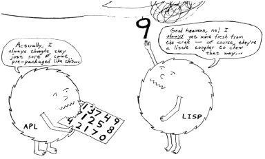

==
L
==

lag

`Prev <../L>`__ 

L

 `Next <lamer>`__

 

**lag**: n.

[MUD, IRC; very common] When used without qualification this is
synonymous with `netlag <./N.html#netlag>`__. Curiously, people will
often complain “I'm really lagged” when in fact it is their server or
network connection that is lagging.

 

+ -----------+  + ------------+
| `Prev <../L>`__    | `Up <../L>`__         |  `Next <lamer>`__   |
+ -----------+  + ------------+
| L                       | `Home <../index>`__   |  lamer                   |
+ -----------+  + ------------+

lamer

`Prev <lag>`__ 

L

 `Next <LAN-party>`__

 

**lamer**: n.

[originally among Amiga fans]

1. Synonym for `luser <luser>`__, not used much by hackers but
common among `warez d00dz <./W.html#warez-d00dz>`__, crackers, and
`phreaker <./P.html#phreaker>`__\ s. A person who downloads much, but
who never uploads. (Also known as leecher). Oppose
`elite <./E.html#elite>`__. Has the same connotations of
self-conscious elitism that use of `luser <luser>`__ does among
hackers.

2. Someone who tries to crack a BBS.

3. Someone who annoys the sysop or other BBS users — for instance, by
posting lots of silly messages, uploading virus-ridden software,
frequently dropping carrier, etc.

Crackers also use it to refer to cracker
`wannabee <./W.html#wannabee>`__\ s. In phreak culture, a lamer is
one who scams codes off others rather than doing cracks or really
understanding the fundamental concepts. In `warez
d00dz <./W.html#warez-d00dz>`__ culture, where the ability to wave
around cracked commercial software within days of (or before) release to
the commercial market is much esteemed, the lamer might try to upload
garbage or shareware or something incredibly old (old in this context is
read as a few years to anything older than 3 days). ‘Lamer’ is also much
used in the IRC world in a similar sense to the above.

This term seems to have originated in the Commodore-64 scene in the mid
1980s. It was popularized among Amiga crackers of the mid-1980s by
‘Lamer Exterminator’, the most famous and feared Amiga virus ever, which
gradually corrupted non-write-protected floppy disks with bad sectors.
The bad sectors, when looked at, were overwritten with repetitions of
the string “LAMER!”.

 

+ ----------+  +  --+
| `Prev <lag>`__    | `Up <../L>`__         |  `Next <LAN-party>`__   |
+ ----------+  +  --+
| lag                    | `Home <../index>`__   |  LAN party                   |
+ ----------+  +  --+

language lawyer

`Prev <LAN-party>`__ 

L

 `Next <languages-of-choice>`__

 

**language lawyer**: n.

A person, usually an experienced or senior software engineer, who is
intimately familiar with many or most of the numerous restrictions and
features (both useful and esoteric) applicable to one or more computer
programming languages. A language lawyer is distinguished by the ability
to show you the five sentences scattered through a 200-plus-page manual
that together imply the answer to your question “if only you had thought
to look there”. Compare `wizard <./W.html#wizard>`__,
`legal <legal>`__, `legalese <legalese>`__.

 

+  --+  +  ------------+
| `Prev <LAN-party>`__    | `Up <../L>`__         |  `Next <languages-of-choice>`__   |
+  --+  +  ------------+
| LAN party                    | `Home <../index>`__   |  languages of choice                   |
+  --+  +  ------------+

languages of choice

`Prev <language-lawyer>`__ 

L

 `Next <LART>`__

 

**languages of choice**: n.

`C <./C.html#C>`__, `Perl <./P.html#Perl>`__,
`Python <./P.html#Python>`__, `Java <./J.html#Java>`__ and
`LISP <LISP>`__ — the dominant languages in open-source
development. This list has changed over time, but slowly. Java bumped
C++ off of it, and Python appears to be recruiting people who would
otherwise gravitate to LISP (which used to be much more important than
it is now). Smalltalk and Prolog are also popular in small but
influential communities.

The `Real Programmer <./R.html#Real-Programmer>`__\ s who loved
FORTRAN and assembler have pretty much all retired or died since 1990.
Assembler is generally no longer considered interesting or appropriate
for anything but `HLL <./H.html#HLL>`__ implementation,
`glue <./G.html#glue>`__, and a few time-critical and
hardware-specific uses in systems programs. FORTRAN occupies a shrinking
niche in scientific programming.

Most hackers tend to frown on languages like
`Pascal <./P.html#Pascal>`__ and Ada, which don't give them the
near-total freedom considered necessary for hacking (see
`bondage-and-discipline
language <./B.html#bondage-and-discipline-language>`__), and to regard
everything even remotely connected with `COBOL <./C.html#COBOL>`__ or
other traditional `DP <./D.html#DP>`__ languages as a total and
unmitigated `loss <loss>`__.

 

+  --------+  + -----------+
| `Prev <language-lawyer>`__    | `Up <../L>`__         |  `Next <LART>`__   |
+  --------+  + -----------+
| language lawyer                    | `Home <../index>`__   |  LART                   |
+  --------+  + -----------+

LAN party

`Prev <lamer>`__ 

L

 `Next <language-lawyer>`__

 

**LAN party**: /lan par´tee/

An event to which several users bring their boxes and hook them up to a
common LAN (Local Area Network), often for the purpose of playing
multiplayer computer games, especially action games such as Quake or
Unreal Tournament. This is also a good venue for people to show-off
their fancy new hardware. Such events can get pretty large, several
hundred people attend the annual QuakeCon in Texas. The theoretical
rationale behind LAN parties is that playing over the Internet often
introduces too much lag in the playing experience — but just as
important is the special quality of trash-talking each other across the
room while playing, and the instinctive social ritual of consuming vast
amounts of food and drink together.

 

+ ------------+  +  --------+
| `Prev <lamer>`__    | `Up <../L>`__         |  `Next <language-lawyer>`__   |
+ ------------+  +  --------+
| lamer                    | `Home <../index>`__   |  language lawyer                   |
+ ------------+  +  --------+

LART

`Prev <languages-of-choice>`__ 

L

 `Next <larval-stage>`__

 

**LART**: //

Luser Attitude Readjustment Tool.

1. n. In the collective mythos of `scary devil
monastery <./S.html#scary-devil-monastery>`__, this is an essential
item in the toolkit of every `BOFH <./B.html#BOFH>`__. The LART
classic is a 2x4 or other large billet of wood usable as a club, to be
applied upside the head of spammers and other people who cause sysadmins
more grief than just naturally goes with the job. Perennial debates rage
on "alt.sysadmin.recovery" over what constitutes the truly effective
LART; knobkerries, automatic weapons, flamethrowers, and tactical nukes
all have their partisans. Compare
`clue-by-four <./C.html#clue-by-four>`__.

2. v. To use a LART. Some would add “in malice”, but some sysadmins do
prefer to gently lart their users as a first (and sometimes final)
warning.

3. interj. Calling for one's LART, much as a surgeon might call
“Scalpel!”.

4. interj. [rare] Used in `flame <./F.html#flame>`__\ s as a rebuke.
“LART! LART! LART!”

 

+  ------------+  +  -----+
| `Prev <languages-of-choice>`__    | `Up <../L>`__         |  `Next <larval-stage>`__   |
+  ------------+  +  -----+
| languages of choice                    | `Home <../index>`__   |  larval stage                   |
+  ------------+  +  -----+

larval stage

`Prev <LART>`__ 

L

 `Next <lase>`__

 

**larval stage**: n.

Describes a period of monomaniacal concentration on coding apparently
passed through by all fledgling hackers. Common symptoms include the
perpetration of more than one 36-hour `hacking
run <./H.html#hacking-run>`__ in a given week; neglect of all other
activities including usual basics like food, sleep, and personal
hygiene; and a chronic case of advanced bleary-eye. Can last from 6
months to 2 years, the apparent median being around 18 months. A few so
afflicted never resume a more ‘normal’ life, but the ordeal seems to be
necessary to produce really wizardly (as opposed to merely competent)
programmers. See also `wannabee <./W.html#wannabee>`__. A less
protracted and intense version of larval stage (typically lasting about
a month) may recur when one is learning a new `OS <./O.html#OS>`__ or
programming language.

 

+ -----------+  + -----------+
| `Prev <LART>`__    | `Up <../L>`__         |  `Next <lase>`__   |
+ -----------+  + -----------+
| LART                    | `Home <../index>`__   |  lase                   |
+ -----------+  + -----------+

lase

`Prev <larval-stage>`__ 

L

 `Next <laser-chicken>`__

 

**lase**: /layz/, vt.

To print a given document via a laser printer. “OK, let's lase that
sucker and see if all those graphics-macro calls did the right things.”

 

+  -----+  +  ------+
| `Prev <larval-stage>`__    | `Up <../L>`__         |  `Next <laser-chicken>`__   |
+  -----+  +  ------+
| larval stage                    | `Home <../index>`__   |  laser chicken                   |
+  -----+  +  ------+

laser chicken

`Prev <lase>`__ 

L

 `Next <leaf-site>`__

 

**laser chicken**: n.

Kung Pao Chicken, a standard Chinese dish containing chicken, peanuts,
and hot red peppers in a spicy pepper-oil sauce. Many hackers call it
laser chicken for two reasons: It can `zap <./Z.html#zap>`__ you just
like a laser, and the sauce has a red color reminiscent of some laser
beams. The dish has also been called gunpowder chicken.

In a variation on this theme, it is reported that some Australian
hackers have redesignated the common dish ‘lemon chicken’ as Chernobyl
Chicken. The name is derived from the color of the sauce, which is
considered bright enough to glow in the dark (as, mythically, do some of
the inhabitants of Chernobyl).

 

+ -----------+  +  --+
| `Prev <lase>`__    | `Up <../L>`__         |  `Next <leaf-site>`__   |
+ -----------+  +  --+
| lase                    | `Home <../index>`__   |  leaf site                   |
+ -----------+  +  --+

leaf site

`Prev <laser-chicken>`__ 

L

 `Next <leak>`__

 

**leaf site**: n.

[obs.] Before pervasive TCP/IP, this term was used of a machine that
merely originated and read Usenet news or mail, and did not relay any
third-party traffic. It was often uttered in a critical tone; when the
ratio of leaf sites to backbone, rib, and other relay sites got too
high, the network tended to develop bottlenecks. Compare `backbone
site <./B.html#backbone-site>`__. Now that traffic patterns depend
more on the distribution of routers than of host machines this term has
largely fallen out of use.

 

+  ------+  + -----------+
| `Prev <laser-chicken>`__    | `Up <../L>`__         |  `Next <leak>`__   |
+  ------+  + -----------+
| laser chicken                    | `Home <../index>`__   |  leak                   |
+  ------+  + -----------+

leak

`Prev <leaf-site>`__ 

L

 `Next <leaky-heap>`__

 

**leak**: n.

With qualifier, one of a class of resource-management bugs that occur
when resources are not freed properly after operations on them are
finished, so they effectively disappear (leak out). This leads to
eventual exhaustion as new allocation requests come in. `memory
leak <./M.html#memory-leak>`__ has its own entry; one might also
refer, to, say, a window handle leak in a window system.

 

+  --+  +  ---+
| `Prev <leaf-site>`__    | `Up <../L>`__         |  `Next <leaky-heap>`__   |
+  --+  +  ---+
| leaf site                    | `Home <../index>`__   |  leaky heap                   |
+  --+  +  ---+

leaky heap

`Prev <leak>`__ 

L

 `Next <leapfrog-attack>`__

 

**leaky heap**: n.

[Cambridge] An `arena <./A.html#arena>`__ with a `memory
leak <./M.html#memory-leak>`__.

 

+ -----------+  +  --------+
| `Prev <leak>`__    | `Up <../L>`__         |  `Next <leapfrog-attack>`__   |
+ -----------+  +  --------+
| leak                    | `Home <../index>`__   |  leapfrog attack                   |
+ -----------+  +  --------+

leapfrog attack

`Prev <leaky-heap>`__ 

L

 `Next <leech>`__

 

**leapfrog attack**: n.

Use of userid and password information obtained illicitly from one host
(e.g., downloading a file of account IDs and passwords, tapping TELNET,
etc.) to compromise another host. Also, the act of TELNETting through
one or more hosts in order to confuse a trace (a standard cracker
procedure).

 

+  ---+  + ------------+
| `Prev <leaky-heap>`__    | `Up <../L>`__         |  `Next <leech>`__   |
+  ---+  + ------------+
| leaky heap                    | `Home <../index>`__   |  leech                   |
+  ---+  + ------------+

leech

`Prev <leapfrog-attack>`__ 

L

 `Next <leech-mode>`__

 

**leech**

1. n. (Also leecher.) Among BBS types, crackers and `warez
d00dz <./W.html#warez-d00dz>`__, one who consumes knowledge without
generating new software, cracks, or techniques. BBS culture specifically
defines a leech as someone who downloads files with few or no uploads in
return, and who does not contribute to the message section. Cracker
culture extends this definition to someone (a `lamer <lamer>`__,
usually) who constantly presses informed sources for information and/or
assistance, but has nothing to contribute. See
`troughie <./T.html#troughie>`__.

2. v. [common, Toronto area] v. To download a file across any kind of
internet link. “Hop on IRC later so I can leech some MP3s from you.”
Used to describe activities ranging from FTP, to IRC DCC-send, to ICQ
file requests, to Napster searches (but never to downloading email with
file attachments; the implication is that the download is the result of
a browse or search of some sort of file server). Seems to be a holdover
from the early 1990s when Toronto had a very active BBS and warez scene.
Synonymous with `snarf <./S.html#snarf>`__ (sense 2), and contrast
`snarf <./S.html#snarf>`__ (sense 4).

 

+  --------+  +  ---+
| `Prev <leapfrog-attack>`__    | `Up <../L>`__         |  `Next <leech-mode>`__   |
+  --------+  +  ---+
| leapfrog attack                    | `Home <../index>`__   |  leech mode                   |
+  --------+  +  ---+

leech mode

`Prev <leech>`__ 

L

 `Next <legal>`__

 

**leech mode**: n.

[warez d00dz] “Leech mode” or “leech access” or (simply “leech” as in
“You get leech”) is the access mode on a FTP site where one can download
as many files as one wants, without having to upload. Leech mode is
often promised on banner sites, but rarely obtained. See `ratio
site <./R.html#ratio-site>`__, `banner
site <./B.html#banner-site>`__.

 

+ ------------+  + ------------+
| `Prev <leech>`__    | `Up <../L>`__         |  `Next <legal>`__   |
+ ------------+  + ------------+
| leech                    | `Home <../index>`__   |  legal                   |
+ ------------+  + ------------+

legalese

`Prev <legal>`__ 

L

 `Next <lenna>`__

 

**legalese**: n.

Dense, pedantic verbiage in a language description, product
specification, or interface standard; text that seems designed to
obfuscate and requires a `language lawyer <language-lawyer>`__ to
`parse <./P.html#parse>`__ it. Though hackers are not afraid of high
information density and complexity in language (indeed, they rather
enjoy both), they share a deep and abiding loathing for legalese; they
associate it with deception, `suit <./S.html#suit>`__\ s, and
situations in which hackers generally get the short end of the stick.

 

+ ------------+  + ------------+
| `Prev <legal>`__    | `Up <../L>`__         |  `Next <lenna>`__   |
+ ------------+  + ------------+
| legal                    | `Home <../index>`__   |  lenna                   |
+ ------------+  + ------------+

legal

`Prev <leech-mode>`__ 

L

 `Next <legalese>`__

 

**legal**: adj.

Loosely used to mean ‘in accordance with all the relevant rules’, esp.
in connection with some set of constraints defined by software. “The
older =+ alternate for += is no longer legal syntax in ANSI C.” “This
parser processes each line of legal input the moment it sees the
trailing linefeed.” Hackers often model their work as a sort of game
played with the environment in which the objective is to maneuver
through the thicket of ‘natural laws’ to achieve a desired objective.
Their use of legal is flavored as much by this game-playing sense as by
the more conventional one having to do with courts and lawyers. Compare
`language lawyer <language-lawyer>`__,
`legalese <legalese>`__.

 

+  ---+  +  -+
| `Prev <leech-mode>`__    | `Up <../L>`__         |  `Next <legalese>`__   |
+  ---+  +  -+
| leech mode                    | `Home <../index>`__   |  legalese                   |
+  ---+  +  -+

lenna

`Prev <legalese>`__ 

L

 `Next <LER>`__

 

**lenna**

The Internet's first poster girl, a standard test load used in the image
processing community. The image was originally cropped from the November
1972 issue of *Playboy Magazine*, which anglicized the model's name with
a double n. It has interesting properties — complex feathers, shadows,
smooth (but not flat) surfaces — that are pertinent in demonstrating
various processing algorithms for image compression, filtering,
dithering, texture mapping, image recognition, and so on. After a
quarter century of remaining completely unaware that she had become an
icon, a gray-haired but still winsome Lenna finally met her fans at a
computer graphics conference in 1997. There is a fan page at
`www.lenna.org <http://www.lenna.org>`__, with more details. Compare
`Utah teapot <./U.html#Utah-teapot>`__ and `Stanford
Bunny <./S.html#Stanford-Bunny>`__

|image0|

Miss Lena Sjööblom

 

+  -+  + ----------+
| `Prev <legalese>`__    | `Up <../L>`__         |  `Next <LER>`__   |
+  -+  + ----------+
| legalese                    | `Home <../index>`__   |  LER                   |
+  -+  + ----------+

.. |image0| image:: ../_static/len_std.jpg

LER

`Prev <lenna>`__ 

L

 `Next <LERP>`__

 

**LER**: /L·E·R/

n.

1. [TMRC, from ‘Light-Emitting Diode’] A light-emitting resistor (that
is, one in the process of burning up). Ohm's law was broken. See also
`SED <./S.html#SED>`__.

2. An incandescent light bulb (the filament emits light because it's
resistively heated).

 

+ ------------+  + -----------+
| `Prev <lenna>`__    | `Up <../L>`__         |  `Next <LERP>`__   |
+ ------------+  + -----------+
| lenna                    | `Home <../index>`__   |  LERP                   |
+ ------------+  + -----------+

LERP

`Prev <LER>`__ 

L

 `Next <let-the-smoke-out>`__

 

**LERP**: /lerp/, vi.,n.

Quasi-acronym for Linear Interpolation, used as a verb or noun for the
operation. “Bresenham's algorithm lerps incrementally between the two
endpoints of the line.”

 

+ ----------+  +  ----------+
| `Prev <LER>`__    | `Up <../L>`__         |  `Next <let-the-smoke-out>`__   |
+ ----------+  +  ----------+
| LER                    | `Home <../index>`__   |  let the smoke out                   |
+ ----------+  +  ----------+

letterbomb

`Prev <let-the-smoke-out>`__ 

L

 `Next <lexer>`__

 

**letterbomb**

1. n. A piece of `email <./E.html#email>`__ containing `live
data <live-data>`__ intended to do nefarious things to the
recipient's machine or terminal. It used to be possible, for example, to
send letterbombs that would lock up some specific kinds of terminals
when they are viewed, so thoroughly that the user must cycle power (see
`cycle <./C.html#cycle>`__, sense 3) to unwedge them. Under Unix, a
letterbomb can also try to get part of its contents interpreted as a
shell command to the mailer. The results of this could range from silly
to tragic; fortunately it has been some years since any of the standard
Unix/Internet mail software was vulnerable to such an attack (though, as
the Melissa virus attack demonstrated in early 1999, Microsoft systems
can have serious problems). See also `Trojan
horse <./T.html#Trojan-horse>`__; compare
`nastygram <./N.html#nastygram>`__.

2. Loosely, a `mailbomb <./M.html#mailbomb>`__.

 

+  ----------+  + ------------+
| `Prev <let-the-smoke-out>`__    | `Up <../L>`__         |  `Next <lexer>`__   |
+  ----------+  + ------------+
| let the smoke out                    | `Home <../index>`__   |  lexer                   |
+  ----------+  + ------------+

let the smoke out

`Prev <LERP>`__ 

L

 `Next <letterbomb>`__

 

**let the smoke out**: v.

To fry hardware (see `fried <./F.html#fried>`__). See `magic
smoke <./M.html#magic-smoke>`__ for a discussion of the underlying
mythology.

 

+ -----------+  +  ---+
| `Prev <LERP>`__    | `Up <../L>`__         |  `Next <letterbomb>`__   |
+ -----------+  +  ---+
| LERP                    | `Home <../index>`__   |  letterbomb                   |
+ -----------+  +  ---+

lexer

`Prev <letterbomb>`__ 

L

 `Next <life>`__

 

**lexer**: /lek´sr/, n.

Common hacker shorthand for lexical analyzer, the input-tokenizing stage
in the parser for a language (the part that breaks it into word-like
pieces). “Some C lexers get confused by the old-style compound ops like
**=-**.”

 

+  ---+  + -----------+
| `Prev <letterbomb>`__    | `Up <../L>`__         |  `Next <life>`__   |
+  ---+  + -----------+
| letterbomb                    | `Home <../index>`__   |  life                   |
+  ---+  + -----------+

life

`Prev <lexer>`__ 

L

 `Next <Life-is-hard>`__

 

**life**: n.

1. A cellular-automata game invented by John Horton Conway and first
introduced publicly by Martin Gardner (*Scientific American*, October
1970); the game's popularity had to wait a few years for computers on
which it could reasonably be played, as it's no fun to simulate the
cells by hand. Many hackers pass through a stage of fascination with it,
and hackers at various places contributed heavily to the mathematical
analysis of this game (most notably Bill Gosper at MIT, who even
implemented life in `TECO <./T.html#TECO>`__!). When a hacker
mentions ‘life’, he is much more likely to mean this game than the
magazine, the breakfast cereal, or the human state of existence. Many
web resources are available starting from the `Open Directory page of
Life <http://dmoz.org/Computers/Artificial_Life/Cellular_Automata/Conway%27s_Game_of_Life/>`__.
The `Life Lexicon <http://www.argentum.freeserve.co.uk/lex_home.htm>`__
is a good indicator of what makes the game so fascinating.

|image0|

A glider, possibly the best known of the quasi-organic phenomena in the
Game of Life.

2. The opposite of `Usenet <./U.html#Usenet>`__. As in “\ `Get a
life! <./G.html#Get-a-life->`__\ ”

 

+ ------------+  +  -----+
| `Prev <lexer>`__    | `Up <../L>`__         |  `Next <Life-is-hard>`__   |
+ ------------+  +  -----+
| lexer                    | `Home <../index>`__   |  Life is hard                   |
+ ------------+  +  -----+

Life is hard
=============

`Prev <life>`__ 

L

 `Next <light-pipe>`__

 

**Life is hard**: prov.

[XEROX PARC] This phrase has two possible interpretations: (1) “While
your suggestion may have some merit, I will behave as though I hadn't
heard it.” (2) “While your suggestion has obvious merit, equally obvious
circumstances prevent it from being seriously considered.” The charm of
the phrase lies precisely in this subtle but important ambiguity.

 

+ -----------+  +  ---+
| `Prev <life>`__    | `Up <../L>`__         |  `Next <light-pipe>`__   |
+ -----------+  +  ---+
| life                    | `Home <../index>`__   |  light pipe                   |
+ -----------+  +  ---+

light pipe

`Prev <Life-is-hard>`__ 

L

 `Next <lightweight>`__

 

**light pipe**: n.

Fiber optic cable. Oppose `copper <./C.html#copper>`__.

 

+  -----+  +  ----+
| `Prev <Life-is-hard>`__    | `Up <../L>`__         |  `Next <lightweight>`__   |
+  -----+  +  ----+
| Life is hard                    | `Home <../index>`__   |  lightweight                   |
+  -----+  +  ----+

lightweight

`Prev <light-pipe>`__ 

L

 `Next <like-kicking-dead-whales-down-the-beach>`__

 

**lightweight**: adj.

Opposite of `heavyweight <./H.html#heavyweight>`__; usually found in
combining forms such as lightweight process.

 

+  ---+  +    ----+
| `Prev <light-pipe>`__    | `Up <../L>`__         |  `Next <like-kicking-dead-whales-down-the-beach>`__   |
+  ---+  +    ----+
| light pipe                    | `Home <../index>`__   |  like kicking dead whales down the beach                   |
+  ---+  +    ----+

like kicking dead whales down the beach

`Prev <lightweight>`__ 

L

 `Next <like-nailing-jelly-to-a-tree>`__

 

**like kicking dead whales down the beach**: adj.

Describes a slow, difficult, and disgusting process. First popularized
by a famous quote about the difficulty of getting work done under one of
IBM's mainframe OSes. “Well, you *could* write a C compiler in COBOL,
but it would be like kicking dead whales down the beach.” See also
`fear and loathing <./F.html#fear-and-loathing>`__.

 

+  ----+  +   -------+
| `Prev <lightweight>`__    | `Up <../L>`__         |  `Next <like-nailing-jelly-to-a-tree>`__   |
+  ----+  +   -------+
| lightweight                    | `Home <../index>`__   |  like nailing jelly to a tree                   |
+  ----+  +   -------+

like nailing jelly to a tree

`Prev <like-kicking-dead-whales-down-the-beach>`__ 

L

 `Next <line-666>`__

 

**like nailing jelly to a tree**: adj.

Used to describe a task thought to be impossible, esp. one in which the
difficulty arises from poor specification or inherent slipperiness in
the problem domain. “Trying to display the ‘prettiest’ arrangement of
nodes and arcs that diagrams a given graph is like nailing jelly to a
tree, because nobody's sure what ‘prettiest’ means algorithmically.”

Hacker use of this term may recall mainstream slang originated early in
the 20th century by President Theodore Roosevelt. There is a legend
that, weary of inconclusive talks with Colombia over the right to dig a
canal through its then-province Panama, he remarked, “Negotiating with
those pirates is like trying to nail currant jelly to the wall.”
Roosevelt's government subsequently encouraged the anti-Colombian
insurgency that created the nation of Panama.

 

+    ----+  +  -+
| `Prev <like-kicking-dead-whales-down-the-beach>`__    | `Up <../L>`__         |  `Next <line-666>`__   |
+    ----+  +  -+
| like kicking dead whales down the beach                    | `Home <../index>`__   |  line 666                   |
+    ----+  +  -+

line 666

`Prev <like-nailing-jelly-to-a-tree>`__ 

====
L
====

 `Next <line-eater--the>`__

 

**line 666**

[from Christian eschatological myth] n. The notional line of source at
which a program fails for obscure reasons, implying either that
*somebody* is out to get it (when you are the programmer), or that it
richly deserves to be so gotten (when you are not). “It works when I
trace through it, but seems to crash on line 666 when I run it.” “What
happens is that whenever a large batch comes through, mmdf dies on the
Line of the Beast. Probably some twit hardcoded a buffer size.”

 

+   -------+  +  --------+
| `Prev <like-nailing-jelly-to-a-tree>`__    | `Up <../L>`__         |  `Next <line-eater--the>`__   |
+   -------+  +  --------+
| like nailing jelly to a tree                    | `Home <../index>`__   |  line eater, the                   |
+   -------+  +  --------+

linearithmic

`Prev <line-noise>`__ 

L

 `Next <link-farm>`__

 

**linearithmic**: adj.

Of an algorithm, having running time that is "O(N log    N)". Coined
as a portmanteau of ‘linear’ and ‘logarithmic’ in *Algorithms In C* by
Robert Sedgewick (Addison-Wesley 1990, ISBN 0-201-51425-7).

 

+  ---+  +  --+
| `Prev <line-noise>`__    | `Up <../L>`__         |  `Next <link-farm>`__   |
+  ---+  +  --+
| line noise                    | `Home <../index>`__   |  link farm                   |
+  ---+  +  --+

line eater, the

`Prev <line-666>`__ 

L

 `Next <line-noise>`__

 

**line eater, the**: n. obs.

1. [Usenet] A bug in some now-obsolete versions of the netnews software
that used to eat up to BUFSIZ bytes of the article text. The bug was
triggered by having the text of the article start with a space or tab.
This bug was quickly personified as a mythical creature called the line
eater, and postings often included a dummy line of line eater food.
Ironically, line eater ‘food’ not beginning with a space or tab wasn't
actually eaten, since the bug was avoided; but if there *was* a space or
tab before it, then the line eater would eat the food *and* the
beginning of the text it was supposed to be protecting. The practice of
sacrificing to the line eater continued for some time after the bug had
been `nailed to the wall <./N.html#nailed-to-the-wall>`__, and is
still humorously referred to. The bug itself was still occasionally
reported to be lurking in some mail-to-netnews gateways as late as 1991.

2. See `NSA line eater <./N.html#NSA-line-eater>`__.

 

+  -+  +  ---+
| `Prev <line-666>`__    | `Up <../L>`__         |  `Next <line-noise>`__   |
+  -+  +  ---+
| line 666                    | `Home <../index>`__   |  line noise                   |
+  -+  +  ---+

line noise

`Prev <line-eater--the>`__ 

L

 `Next <linearithmic>`__

 

**line noise**: n.

1. [techspeak] Spurious characters due to electrical noise in a
communications link, especially an RS-232 serial connection. Line noise
may be induced by poor connections, interference or crosstalk from other
circuits, electrical storms, `cosmic rays <./C.html#cosmic-rays>`__,
or (notionally) birds crapping on the phone wires.

2. Any chunk of data in a file or elsewhere that looks like the results
of line noise in sense 1.

3. Text that is theoretically a readable text or program source but
employs syntax so bizarre that it looks like line noise in senses 1 or
2. Yes, there are languages this ugly. The canonical example is
`TECO <./T.html#TECO>`__; it is often claimed that “TECO's input
syntax is indistinguishable from line noise.” Other
non-`WYSIWYG <./W.html#WYSIWYG>`__ editors, such as Multics **qed**
and Unix **ed**, in the hands of a real hacker, also qualify easily, as
do deliberately obfuscated languages such as
`INTERCAL <./I.html#INTERCAL>`__.

 

+  --------+  +  -----+
| `Prev <line-eater--the>`__    | `Up <../L>`__         |  `Next <linearithmic>`__   |
+  --------+  +  -----+
| line eater, the                    | `Home <../index>`__   |  linearithmic                   |
+  --------+  +  -----+

link-dead

`Prev <link-rot>`__ 

L

 `Next <lint>`__

 

**link-dead**: adj.

[MUD] The state a player is in when they kill their connection to a
`MUD <./M.html#MUD>`__ without leaving it properly. The player is
then commonly left as a statue in the game, and is only removed after a
certain period of time (an hour on most MUDs). Used on
`IRC <./I.html#IRC>`__ as well, although it is inappropriate in that
context. Compare `netdead <./N.html#netdead>`__.

 

+  -+  + -----------+
| `Prev <link-rot>`__    | `Up <../L>`__         |  `Next <lint>`__   |
+  -+  + -----------+
| link rot                    | `Home <../index>`__   |  lint                   |
+  -+  + -----------+

link farm

`Prev <linearithmic>`__ 

L

 `Next <link-rot>`__

 

**link farm**: n.

[Unix] A directory tree that contains many links to files in a master
directory tree of files. Link farms save space when one is maintaining
several nearly identical copies of the same source tree — for example,
when the only difference is architecture-dependent object files. “Let's
freeze the source and then rebuild the FROBOZZ-3 and FROBOZZ-4 link
farms.” Link farms may also be used to get around restrictions on the
number of **-I** (include-file directory) arguments on older C
preprocessors. However, they can also get completely out of hand,
becoming the filesystem equivalent of `spaghetti
code <./S.html#spaghetti-code>`__. See also
`farm <./F.html#farm>`__.

 

+  -----+  +  -+
| `Prev <linearithmic>`__    | `Up <../L>`__         |  `Next <link-rot>`__   |
+  -----+  +  -+
| linearithmic                    | `Home <../index>`__   |  link rot                   |
+  -----+  +  -+

link rot

`Prev <link-farm>`__ 

L

 `Next <link-dead>`__

 

**link rot**: n.

The natural decay of web links as the sites they're connected to change
or die. Compare `bit rot <./B.html#bit-rot>`__.

 

+  --+  +  --+
| `Prev <link-farm>`__    | `Up <../L>`__         |  `Next <link-dead>`__   |
+  --+  +  --+
| link farm                    | `Home <../index>`__   |  link-dead                   |
+  --+  +  --+

Lintel

`Prev <lint>`__ 

L

 `Next <Linus>`__

 

**Lintel**: n.

The emerging `Linux <Linux>`__/Intel alliance. This term began to
be used in early 1999 after it became clear that the
`Wintel <./W.html#Wintel>`__ alliance was under increasing strain and
Intel started taking stakes in Linux companies.

 

+ -----------+  + ------------+
| `Prev <lint>`__    | `Up <../L>`__         |  `Next <Linus>`__   |
+ -----------+  + ------------+
| lint                    | `Home <../index>`__   |  Linus                   |
+ -----------+  + ------------+

lint

`Prev <link-dead>`__ 

L

 `Next <Lintel>`__

 

**lint**

[from Unix's lint(1), named for the bits of fluff it supposedly picks
from programs]

1. vt. To examine a program closely for style, language usage, and
portability problems, esp. if in C, esp. if via use of automated
analysis tools, most esp. if the Unix utility lint(1) is used. This term
used to be restricted to use of lint(1) itself, but (judging by
references on Usenet) it has become a shorthand for any exhaustive
review process at some non-Unix shops, even in languages other than C.
Also as v. `delint <./D.html#delint>`__.

2. n. Excess verbiage in a document, as in “This draft has too much
lint”.

 

+  --+  + -------------+
| `Prev <link-dead>`__    | `Up <../L>`__         |  `Next <Lintel>`__   |
+  --+  + -------------+
| link-dead                    | `Home <../index>`__   |  Lintel                   |
+  --+  + -------------+

Linus

`Prev <Lintel>`__ 

L

 `Next <Linux>`__

 

**Linus**: /leen´us/, /lin´us/, /li:´nus/

Linus Torvalds, the author of `Linux <Linux>`__. Nobody in the
hacker culture has been as readily recognized by first name alone since
`ken <./K.html#ken>`__.

 

+ -------------+  + ------------+
| `Prev <Lintel>`__    | `Up <../L>`__         |  `Next <Linux>`__   |
+ -------------+  + ------------+
| Lintel                    | `Home <../index>`__   |  Linux                   |
+ -------------+  + ------------+

Linux

`Prev <Linus>`__ 

L

 `Next <lion-food>`__

 

**Linux**: /lee´nuhks/, /li´nuks/, *not*, /li:´nuhks/, n.

The free Unix workalike created by Linus Torvalds and friends starting
about 1991. The pronunciation /li´nuhks/ is preferred because the name
‘Linus’ has an /ee/ sound in Swedish (Linus's family is part of
Finland's 6% ethnic-Swedish minority) and Linus considers English short
/i/ to be closer to /ee/ than English long /i:/. This may be the most
remarkable hacker project in history — an entire clone of Unix for 386,
486 and Pentium micros, distributed for free with sources over the net
(ports to Alpha and Sparc and many other machines are also in use).

Linux is what `GNU <./G.html#GNU>`__ aimed to be, and it relies on
the GNU toolset. But the Free Software Foundation didn't produce the
kernel to go with that toolset until 1999, which was too late. Other,
similar efforts like FreeBSD and NetBSD have been technically successful
but never caught fire the way Linux has; as this is written in 2003,
Linux has effectively swallowed all proprietary Unixes except Solaris
and is seriously challenging Microsoft. It has already captured 41% of
the Internet-server market and over 25% of general business servers.

An earlier version of this entry opined “The secret of Linux's success
seems to be that Linus worked much harder early on to keep the
development process open and recruit other hackers, creating a snowball
effect.” Truer than we knew. See `bazaar <./B.html#bazaar>`__.

(Some people object that the name ‘Linux’ should be used to refer only
to the kernel, not the entire operating system. This claim is a proxy
for an underlying territorial dispute; people who insist on the term
GNU/Linux want the `FSF <./F.html#FSF>`__ to get most of the credit
for Linux because RMS and friends wrote many of its user-level tools.
Neither this theory nor the term GNU/Linux has gained more than minority
acceptance).

 

+ ------------+  +  --+
| `Prev <Linus>`__    | `Up <../L>`__         |  `Next <lion-food>`__   |
+ ------------+  +  --+
| Linus                    | `Home <../index>`__   |  lion food                   |
+ ------------+  +  --+

lion food

`Prev <Linux>`__ 

L

 `Next <Lions-Book>`__

 

**lion food**: n.

[IBM] Middle management or HQ staff (or, by extension, administrative
drones in general). From an old joke about two lions who, escaping from
the zoo, split up to increase their chances but agree to meet after 2
months. When they finally meet, one is skinny and the other overweight.
The thin one says: “How did you manage? I ate a human just once and they
turned out a small army to chase me — guns, nets, it was terrible. Since
then I've been reduced to eating mice, insects, even grass.” The fat one
replies: “Well, *I* hid near an IBM office and ate a manager a day. And
nobody even noticed!”

 

+ ------------+  +  ---+
| `Prev <Linux>`__    | `Up <../L>`__         |  `Next <Lions-Book>`__   |
+ ------------+  +  ---+
| Linux                    | `Home <../index>`__   |  Lions Book                   |
+ ------------+  +  ---+

Lions Book

`Prev <lion-food>`__ 

L

 `Next <LISP>`__

 

**Lions Book**: n.

*Source Code and Commentary on Unix level 6*, by John Lions. The two
parts of this book contained (1) the entire source listing of the Unix
Version 6 kernel, and (2) a commentary on the source discussing the
algorithms. These were circulated internally at the University of New
South Wales beginning 1976--77, and were, for years after, the *only*
detailed kernel documentation available to anyone outside Bell Labs.
Because Western Electric wished to maintain trade secret status on the
kernel, the Lions Book was only supposed to be distributed to affiliates
of source licensees. In spite of this, it soon spread by
`samizdat <./S.html#samizdat>`__ to a good many of the early Unix
hackers.

[1996 update: The Lions book lives again! It was put back in print as
ISBN 1-57398-013-7 from Peer-To-Peer Communications, with forewords by
Dennis Ritchie and Ken Thompson. In a neat bit of reflexivity, the page
before the contents quotes this entry.]

[1998 update: John Lions's death was an occasion of general mourning in
the hacker community.]

 

+  --+  + -----------+
| `Prev <lion-food>`__    | `Up <../L>`__         |  `Next <LISP>`__   |
+  --+  + -----------+
| lion food                    | `Home <../index>`__   |  LISP                   |
+  --+  + -----------+

LISP

`Prev <Lions-Book>`__ 

L

 `Next <list-bomb>`__

 

**LISP**: n.

[from ‘LISt Processing language’, but mythically from ‘Lots of
Irritating Superfluous Parentheses’] AI's mother tongue, a language
based on the ideas of (a) variable-length lists and trees as fundamental
data types, and (b) the interpretation of code as data and vice-versa.
Invented by John McCarthy at MIT in the late 1950s, it is actually older
than any other `HLL <./H.html#HLL>`__ still in use except FORTRAN.
Accordingly, it has undergone considerable adaptive radiation over the
years; modern variants are quite different in detail from the original
LISP 1.5. The dominant HLL among hackers until the early 1980s, LISP has
since shared the throne with `C <./C.html#C>`__. Its partisans claim
it is the only language that is truly beautiful. See `languages of
choice <languages-of-choice>`__.

All LISP functions and programs are expressions that return values;
this, together with the high memory utilization of LISPs, gave rise to
Alan Perlis's famous quip (itself a take on an Oscar Wilde quote) that
“LISP programmers know the value of everything and the cost of nothing”.

One significant application for LISP has been as a proof by example that
most newer languages, such as `COBOL <./C.html#COBOL>`__ and Ada, are
full of unnecessary `crock <./C.html#crock>`__\ s. When the `Right
Thing <./R.html#Right-Thing>`__ has already been done once, there is
no justification for `bogosity <./B.html#bogosity>`__ in newer
languages.

|image0|

We've got your numbers....

 

+  ---+  +  --+
| `Prev <Lions-Book>`__    | `Up <../L>`__         |  `Next <list-bomb>`__   |
+  ---+  +  --+
| Lions Book                    | `Home <../index>`__   |  list-bomb                   |
+  ---+  +  --+

list-bomb
==========

`Prev <LISP>`__ 

L

 `Next <lithium-lick>`__

 

**list-bomb**: v.

To `mailbomb <./M.html#mailbomb>`__ someone by forging messages
causing the victim to become a subscriber to many mailing lists. This is
a self-defeating tactic; it merely forces mailing list servers to
require confirmation by return message for every subscription.

 

+ -----------+  +  -----+
| `Prev <LISP>`__    | `Up <../L>`__         |  `Next <lithium-lick>`__   |
+ -----------+  +  -----+
| LISP                    | `Home <../index>`__   |  lithium lick                   |
+ -----------+  +  -----+

lithium lick

`Prev <list-bomb>`__ 

L

 `Next <little-endian>`__

 

**lithium lick**: n.

[NeXT] Steve Jobs. Employees who have gotten too much attention from
their esteemed founder are said to have ‘lithium lick’ when they begin
to show signs of Jobsian fervor and repeat the most recent catch phrases
in normal conversation — for example, “It just works, right out of the
box!”

 

+  --+  +  ------+
| `Prev <list-bomb>`__    | `Up <../L>`__         |  `Next <little-endian>`__   |
+  --+  +  ------+
| list-bomb                    | `Home <../index>`__   |  little-endian                   |
+  --+  +  ------+

little-endian

`Prev <lithium-lick>`__ 

L

 `Next <live>`__

 

**little-endian**: adj.

Describes a computer architecture in which, within a given 16- or 32-bit
word, bytes at lower addresses have lower significance (the word is
stored ‘little-end-first’). The `PDP-11 <./P.html#PDP-11>`__ and
`VAX <./V.html#VAX>`__ families of computers and Intel
microprocessors and a lot of communications and networking hardware are
little-endian. See `big-endian <./B.html#big-endian>`__,
`middle-endian <./M.html#middle-endian>`__, `NUXI
problem <./N.html#NUXI-problem>`__. The term is sometimes used to
describe the ordering of units other than bytes; most often, bits within
a byte.

 

+  -----+  + -----------+
| `Prev <lithium-lick>`__    | `Up <../L>`__         |  `Next <live>`__   |
+  -----+  + -----------+
| lithium lick                    | `Home <../index>`__   |  live                   |
+  -----+  + -----------+

live data

`Prev <live>`__ 

L

 `Next <Live-Free-Or-Die->`__

 

**live data**: n.

1. Data that is written to be interpreted and takes over program flow
when triggered by some un-obvious operation, such as viewing it. One use
of such hacks is to break security. For example, some smart terminals
have commands that allow one to download strings to program keys; this
can be used to write live data that, when listed to the terminal,
infects it with a security-breaking `virus <./V.html#virus>`__ that
is triggered the next time a hapless user strikes that key. For another,
there are some well-known bugs in `vi <./V.html#vi>`__ that allow
certain texts to send arbitrary commands back to the machine when they
are simply viewed.

2. In C code, data that includes pointers to function
`hook <./H.html#hook>`__\ s (executable code).

3. An object, such as a `trampoline <./T.html#trampoline>`__, that is
constructed on the fly by a program and intended to be executed as code.

 

+ -----------+  +  ----------+
| `Prev <live>`__    | `Up <../L>`__         |  `Next <Live-Free-Or-Die->`__   |
+ -----------+  +  ----------+
| live                    | `Home <../index>`__   |  Live Free Or Die!                   |
+ -----------+  +  ----------+

Live Free Or Die!

`Prev <live-data>`__ 

L

 `Next <livelock>`__

 

**Live Free Or Die!**: imp.

1. The state motto of New Hampshire, which appears on that state's
automobile license plates.

2. A slogan associated with Unix in the romantic days when Unix
aficionados saw themselves as a tiny, beleaguered underground tilting
against the windmills of industry. The “free” referred specifically to
freedom from the `fascist <./F.html#fascist>`__ design philosophies
and crufty misfeatures common on competing operating systems. Armando
Stettner, one of the early Unix developers, used to give out fake
license plates bearing this motto under a large Unix, all in New
Hampshire colors of green and white. These are now valued collector's
items. In 1994 `DEC <./D.html#DEC>`__ put an inferior imitation of
these in circulation with a red corporate logo added. Compaq (half of
which was once DEC) continued the practice.

Armando Stettner's original Unix license plate.

 

+  --+  +  -+
| `Prev <live-data>`__    | `Up <../L>`__         |  `Next <livelock>`__   |
+  --+  +  -+
| live data                    | `Home <../index>`__   |  livelock                   |
+  --+  +  -+

live
=====

`Prev <little-endian>`__ 

L

 `Next <live-data>`__

 

**live**: /li:v/, adj.,adv.

[common] Opposite of ‘test’. Refers to actual real-world data or a
program working with it. For example, the response to “I think the
record deleter is finished” might be “Is it live yet?” or “Have you
tried it out on live data?” This usage usually carries the connotation
that live data is more fragile and must not be corrupted, or bad things
will happen. So a more appropriate response might be: “Well, make sure
it works perfectly before we throw live data at it.” The implication
here is that record deletion is something pretty significant, and a
haywire record-deleter running amok live would probably cause great
harm.

 

+  ------+  +  --+
| `Prev <little-endian>`__    | `Up <../L>`__         |  `Next <live-data>`__   |
+  ------+  +  --+
| little-endian                    | `Home <../index>`__   |  live data                   |
+  ------+  +  --+

livelock

`Prev <Live-Free-Or-Die->`__ 

L

 `Next <liveware>`__

 

**livelock**: /li:v´lok/, n.

A situation in which some critical stage of a task is unable to finish
because its clients perpetually create more work for it to do after they
have been serviced but before it can clear its queue. Differs from
`deadlock <./D.html#deadlock>`__ in that the process is not blocked
or waiting for anything, but has a virtually infinite amount of work to
do and can never catch up.

 

+  ----------+  +  -+
| `Prev <Live-Free-Or-Die->`__    | `Up <../L>`__         |  `Next <liveware>`__   |
+  ----------+  +  -+
| Live Free Or Die!                    | `Home <../index>`__   |  liveware                   |
+  ----------+  +  -+

liveware

`Prev <livelock>`__ 

L

 `Next <lobotomy>`__

 

**liveware**: /li:v´weir/, n.

1. Synonym for `wetware <./W.html#wetware>`__. Less common.

2. [Cambridge] Vermin. “Waiter, there's some liveware in my salad...”

 

+  -+  +  -+
| `Prev <livelock>`__    | `Up <../L>`__         |  `Next <lobotomy>`__   |
+  -+  +  -+
| livelock                    | `Home <../index>`__   |  lobotomy                   |
+  -+  +  -+

lobotomy

`Prev <liveware>`__ 

L

 `Next <locals--the>`__

 

**lobotomy**: n.

1. What a hacker subjected to formal management training is said to have
undergone. At IBM and elsewhere this term is used by both hackers and
low-level management; the latter doubtless intend it as a joke.

2. The act of removing the processor from a microcomputer in order to
replace or upgrade it. Some very cheap `clone <./C.html#clone>`__
systems are sold in lobotomized form — everything but the brain.

 

+  -+  +  ----+
| `Prev <liveware>`__    | `Up <../L>`__         |  `Next <locals--the>`__   |
+  -+  +  ----+
| liveware                    | `Home <../index>`__   |  locals, the                   |
+  -+  +  ----+

locals, the

`Prev <lobotomy>`__ 

L

 `Next <locked-and-loaded>`__

 

**locals, the**: pl.n.

The users on one's local network (as opposed, say, to people one reaches
via public Internet connections). The marked thing about this usage is
how little it has to do with real-space distance. “I have to do some
tweaking on this mail utility before releasing it to the locals.”

 

+  -+  +  ----------+
| `Prev <lobotomy>`__    | `Up <../L>`__         |  `Next <locked-and-loaded>`__   |
+  -+  +  ----------+
| lobotomy                    | `Home <../index>`__   |  locked and loaded                   |
+  -+  +  ----------+

locked and loaded

`Prev <locals--the>`__ 

L

 `Next <locked-up>`__

 

**locked and loaded**: adj.,obs.

[from military slang for an M-16 rifle with magazine inserted and
prepared for firing] Said of a removable disk volume properly prepared
for use — that is, locked into the drive and with the heads loaded.
Ironically, because their heads are ‘loaded’ whenever the power is up,
this description is never used of
`Winchester <./W.html#Winchester>`__ drives (which are named after a
rifle).

 

+  ----+  +  --+
| `Prev <locals--the>`__    | `Up <../L>`__         |  `Next <locked-up>`__   |
+  ----+  +  --+
| locals, the                    | `Home <../index>`__   |  locked up                   |
+  ----+  +  --+

locked up

`Prev <locked-and-loaded>`__ 

L

 `Next <logic-bomb>`__

 

**locked up**: adj.

Syn. for `hung <./H.html#hung>`__, `wedged <./W.html#wedged>`__.

 

+  ----------+  +  ---+
| `Prev <locked-and-loaded>`__    | `Up <../L>`__         |  `Next <logic-bomb>`__   |
+  ----------+  +  ---+
| locked and loaded                    | `Home <../index>`__   |  logic bomb                   |
+  ----------+  +  ---+

logical

`Prev <logic-bomb>`__ 

L

 `Next <loop-through>`__

 

**logical**: adj.

[from the technical term logical device, wherein a physical device is
referred to by an arbitrary ‘logical’ name] Having the role of. If a
person (say, Les Earnest at SAIL) who had long held a certain post left
and were replaced, the replacement would for a while be known as the
logical Les Earnest. (This does not imply any judgment on the
replacement.) Compare `virtual <./V.html#virtual>`__.

At Stanford, ‘logical’ compass directions denote a coordinate system
relative to El Camino Real, in which ‘logical north’ is always toward
San Francisco and ‘logical south’ is always toward San Jose--in spite of
the fact that El Camino Real runs physical north/south near San
Francisco, physical east/west near San Jose, and along a curve
everywhere in between. (The best rule of thumb here is that, by
definition, El Camino Real always runs logical north-south.)

In giving directions, one might say: “To get to Rincon Tarasco
restaurant, get onto `El Camino Bignum <./E.html#El-Camino-Bignum>`__
going logical north.” Using the word ‘logical’ helps to prevent the
recipient from worrying about that the fact that the sun is setting
almost directly in front of him. The concept is reinforced by North
American highways which are almost, but not quite, consistently labeled
with logical rather than physical directions. A similar situation exists
at MIT: Route 128 (famous for the electronics industry that grew up
along it) wraps roughly 3 quarters around Boston at a radius of 10
miles, terminating near the coastline at each end. It would be most
precise to describe the two directions along this highway as ‘clockwise’
and ‘counterclockwise’, but the road signs all say “north” and “south”,
respectively. A hacker might describe these directions as logical north
and logical south, to indicate that they are conventional directions not
corresponding to the usual denotation for those words.

 

+  ---+  +  -----+
| `Prev <logic-bomb>`__    | `Up <../L>`__         |  `Next <loop-through>`__   |
+  ---+  +  -----+
| logic bomb                    | `Home <../index>`__   |  loop through                   |
+  ---+  +  -----+

logic bomb

`Prev <locked-up>`__ 

L

 `Next <logical>`__

 

**logic bomb**: n.

Code surreptitiously inserted into an application or OS that causes it
to perform some destructive or security-compromising activity whenever
specified conditions are met. Compare `back
door <./B.html#back-door>`__.

 

+  --+  +  +
| `Prev <locked-up>`__    | `Up <../L>`__         |  `Next <logical>`__   |
+  --+  +  +
| locked up                    | `Home <../index>`__   |  logical                   |
+  --+  +  +

loop through

`Prev <logical>`__ 

L

 `Next <loose-bytes>`__

 

**loop through**: vt.

To process each element of a list of things. “Hold on, I've got to loop
through my paper mail.” Derives from the computer-language notion of an
iterative loop; compare cdr down (under `cdr <./C.html#cdr>`__),
which is less common among C and Unix programmers. ITS hackers used to
say IRP over after an obscure pseudo-op in the MIDAS PDP-10 assembler
(the same IRP op can nowadays be found in Microsoft's assembler).

 

+  +  +  ----+
| `Prev <logical>`__    | `Up <../L>`__         |  `Next <loose-bytes>`__   |
+  +  +  ----+
| logical                    | `Home <../index>`__   |  loose bytes                   |
+  +  +  ----+

loose bytes

`Prev <loop-through>`__ 

L

 `Next <lord-high-fixer>`__

 

**loose bytes**: n.

Commonwealth hackish term for the padding bytes or
`shim <./S.html#shim>`__\ s many compilers insert between members of
a record or structure to cope with alignment requirements imposed by the
machine architecture.

 

+  -----+  +  --------+
| `Prev <loop-through>`__    | `Up <../L>`__         |  `Next <lord-high-fixer>`__   |
+  -----+  +  --------+
| loop through                    | `Home <../index>`__   |  lord high fixer                   |
+  -----+  +  --------+

lord high fixer

`Prev <loose-bytes>`__ 

L

 `Next <lose>`__

 

**lord high fixer**: n.

[primarily British, from Gilbert & Sullivan's ‘lord high executioner’]
The person in an organization who knows the most about some aspect of a
system. See `wizard <./W.html#wizard>`__.

 

+  ----+  + -----------+
| `Prev <loose-bytes>`__    | `Up <../L>`__         |  `Next <lose>`__   |
+  ----+  + -----------+
| loose bytes                    | `Home <../index>`__   |  lose                   |
+  ----+  + -----------+

lose

`Prev <lord-high-fixer>`__ 

L

 `Next <lose-lose>`__

 

**lose**: vi.

1. [very common] To fail. A program loses when it encounters an
exceptional condition or fails to work in the expected manner.

2. To be exceptionally unesthetic or crocky.

3. Of people, to be obnoxious or unusually stupid (as opposed to
ignorant). See also `deserves to lose <./D.html#deserves-to-lose>`__.

4. n. Refers to something that is `losing <losing>`__, especially
in the phrases “That's a lose!” and “What a lose!”

 

+  --------+  +  --+
| `Prev <lord-high-fixer>`__    | `Up <../L>`__         |  `Next <lose-lose>`__   |
+  --------+  +  --+
| lord high fixer                    | `Home <../index>`__   |  lose lose                   |
+  --------+  +  --+

lose lose

`Prev <lose>`__ 

L

 `Next <loser>`__

 

**lose lose**: interj.

A reply to or comment on an undesirable situation. “I accidentally
deleted all my files!” “Lose, lose.”

 

+ -----------+  + ------------+
| `Prev <lose>`__    | `Up <../L>`__         |  `Next <loser>`__   |
+ -----------+  + ------------+
| lose                    | `Home <../index>`__   |  loser                   |
+ -----------+  + ------------+

loser

`Prev <lose-lose>`__ 

L

 `Next <losing>`__

 

**loser**: n.

An unexpectedly bad situation, program, programmer, or person. Someone
who habitually loses. (Even winners can lose occasionally.) Someone who
knows not and knows not that he knows not. Emphatic forms are real
loser, total loser, and complete loser (but not \*\*moby loser, which
would be a contradiction in terms). See `luser <luser>`__.

 

+  --+  + -------------+
| `Prev <lose-lose>`__    | `Up <../L>`__         |  `Next <losing>`__   |
+  --+  + -------------+
| lose lose                    | `Home <../index>`__   |  losing                   |
+  --+  + -------------+

losing

`Prev <loser>`__ 

L

 `Next <loss>`__

 

**losing**: adj.

Said of anything that is or causes a `lose <lose>`__ or
`lossage <lossage>`__. “The compiler is losing badly when I try
to use templates.”

 

+ ------------+  + -----------+
| `Prev <loser>`__    | `Up <../L>`__         |  `Next <loss>`__   |
+ ------------+  + -----------+
| loser                    | `Home <../index>`__   |  loss                   |
+ ------------+  + -----------+

lossage

`Prev <loss>`__ 

L

 `Next <lossy>`__

 

**lossage**: /los'@j/, n.

[very common] The result of a bug or malfunction. This is a mass or
collective noun. “What a loss!” and “What lossage!” are nearly
synonymous. The former is slightly more particular to the speaker's
present circumstances; the latter implies a continuing
`lose <lose>`__ of which the speaker is currently a victim. Thus
(for example) a temporary hardware failure is a loss, but bugs in an
important tool (like a compiler) are serious lossage.

 

+ -----------+  + ------------+
| `Prev <loss>`__    | `Up <../L>`__         |  `Next <lossy>`__   |
+ -----------+  + ------------+
| loss                    | `Home <../index>`__   |  lossy                   |
+ -----------+  + ------------+

loss

`Prev <losing>`__ 

L

 `Next <lossage>`__

 

**loss**: n.

Something (not a person) that loses; a situation in which something is
losing. Emphatic forms include moby loss, and total loss, complete loss.
Common interjections are “What a loss!” and “What a moby loss!” Note
that moby loss is OK even though \*\*moby loser is not used; applied to
an abstract noun, moby is simply a magnifier, whereas when applied to a
person it implies substance and has positive connotations. Compare
`lossage <lossage>`__.

 

+ -------------+  +  +
| `Prev <losing>`__    | `Up <../L>`__         |  `Next <lossage>`__   |
+ -------------+  +  +
| losing                    | `Home <../index>`__   |  lossage                   |
+ -------------+  +  +

lossy

`Prev <lossage>`__ 

L

 `Next <lost-in-the-noise>`__

 

**lossy**: adj.

[Usenet]

1. Said of people, this indicates a poor memory, usually short-term.
This usage is analogical to the same term applied to data compression
and analysis. “He's very lossy.” means that you can't rely on him to
accurately remember recent experiences or conversations, or requests.
Not to be confused with a ‘loser’, which is a person who is in a
continual state of lossiness, as in sense 2 (see below).

2. Said of an attitude or a situation, this indicates a general downturn
in emotions, lack of success in attempted endeavors, etc. Eg, “I'm
having a lossy day today.” means that the speaker has ‘lost’ or is
‘losing’ in all of their activities, and that this is causing some
increase in negative emotions.

 

+  +  +  ----------+
| `Prev <lossage>`__    | `Up <../L>`__         |  `Next <lost-in-the-noise>`__   |
+  +  +  ----------+
| lossage                    | `Home <../index>`__   |  lost in the noise                   |
+  +  +  ----------+

lost in the noise

`Prev <lossy>`__ 

L

 `Next <lost-in-the-underflow>`__

 

**lost in the noise**: adj.

Syn. `lost in the underflow <lost-in-the-underflow>`__. This term
is from signal processing, where signals of very small amplitude cannot
be separated from low-intensity noise in the system. Though popular
among hackers, it is not confined to hackerdom; physicists, engineers,
astronomers, and statisticians all use it.

 

+ ------------+  +   +
| `Prev <lossy>`__    | `Up <../L>`__         |  `Next <lost-in-the-underflow>`__   |
+ ------------+  +   +
| lossy                    | `Home <../index>`__   |  lost in the underflow                   |
+ ------------+  +   +

lost in the underflow

`Prev <lost-in-the-noise>`__ 

L

 `Next <lots-of-MIPS-but-no-I-O>`__

 

**lost in the underflow**: adj.

Too small to be worth considering; more specifically, small beyond the
limits of accuracy or measurement. This is a reference to floating
underflow, a condition that can occur when a floating-point arithmetic
processor tries to handle quantities smaller than its limit of
magnitude. It is also a pun on ‘undertow’ (a kind of fast, cold current
that sometimes runs just offshore and can be dangerous to swimmers).
“Well, sure, photon pressure from the stadium lights alters the path of
a thrown baseball, but that effect gets lost in the underflow.” Compare
`epsilon <./E.html#epsilon>`__, `epsilon
squared <./E.html#epsilon-squared>`__; see also `overflow
bit <./O.html#overflow-bit>`__.

 

+  ----------+  +   --+
| `Prev <lost-in-the-noise>`__    | `Up <../L>`__         |  `Next <lots-of-MIPS-but-no-I-O>`__   |
+  ----------+  +   --+
| lost in the noise                    | `Home <../index>`__   |  lots of MIPS but no I/O                   |
+  ----------+  +   --+

lots of MIPS but no I/O

`Prev <lost-in-the-underflow>`__ 

L

 `Next <low-bandwidth>`__

 

**lots of MIPS but no I/O**: adj.

Used to describe a person who is technically brilliant but can't seem to
communicate with human beings effectively. Technically it describes a
machine that has lots of processing power but is bottlenecked on
input-output (in 1991, the IBM Rios, a.k.a. RS/6000, was a notorious
example).

 

+   +  +  ------+
| `Prev <lost-in-the-underflow>`__    | `Up <../L>`__         |  `Next <low-bandwidth>`__   |
+   +  +  ------+
| lost in the underflow                    | `Home <../index>`__   |  low-bandwidth                   |
+   +  +  ------+

low-bandwidth

`Prev <lots-of-MIPS-but-no-I-O>`__ 

L

 `Next <Lubarskys-Law-of-Cybernetic-Entomology>`__

 

**low-bandwidth**: adj.

[from communication theory] Used to indicate a talk that, although not
`content-free <./C.html#content-free>`__, was not terribly
informative. “That was a low-bandwidth talk, but what can you expect for
an audience of `suit <./S.html#suit>`__\ s!” Compare
`zero-content <./Z.html#zero-content>`__,
`bandwidth <./B.html#bandwidth>`__,
`math-out <./M.html#math-out>`__.

 

+   --+  +    ---+
| `Prev <lots-of-MIPS-but-no-I-O>`__    | `Up <../L>`__         |  `Next <Lubarskys-Law-of-Cybernetic-Entomology>`__   |
+   --+  +    ---+
| lots of MIPS but no I/O                    | `Home <../index>`__   |  Lubarsky's Law of Cybernetic Entomology                  |
+   --+  +    ---+

Lubarsky's Law of Cybernetic Entomology

`Prev <low-bandwidth>`__ 

L

 `Next <Lumber-Cartel>`__

 

**Lubarsky's Law of Cybernetic Entomology**: prov.

“There is *always* one more bug.”

 

+  ------+  +  ------+
| `Prev <low-bandwidth>`__    | `Up <../L>`__         |  `Next <Lumber-Cartel>`__   |
+  ------+  +  ------+
| low-bandwidth                    | `Home <../index>`__   |  Lumber Cartel                   |
+  ------+  +  ------+

Lumber Cartel

`Prev <Lubarskys-Law-of-Cybernetic-Entomology>`__ 

L

 `Next <lunatic-fringe>`__

 

**Lumber Cartel**: n.

A mythical conspiracy accused by `spam <./S.html#spam>`__-spewers of
funding anti-spam activism in order to force the direct-mail promotions
industry back onto paper. Hackers, predictably, responded by forming a
“Lumber Cartel” spoofing this paranoid theory; the web page is
`http://come.to/the.lumber.cartel/ <http://come.to/the.lumber.cartel/>`__.
Members often include the tag TINLC (“There Is No Lumber Cartel”) in
their postings; see `TINC <./T.html#TINC>`__, `backbone
cabal <./B.html#backbone-cabal>`__ and `NANA <./N.html#NANA>`__ for
explanation.

 

+    ---+  +  -------+
| `Prev <Lubarskys-Law-of-Cybernetic-Entomology>`__    | `Up <../L>`__         |  `Next <lunatic-fringe>`__   |
+    ---+  +  -------+
| Lubarsky's Law of Cybernetic Entomology                   | `Home <../index>`__   |  lunatic fringe                   |
+    ---+  +  -------+

lunatic fringe

`Prev <Lumber-Cartel>`__ 

L

 `Next <lurker>`__

 

**lunatic fringe**: n.

[IBM] Customers who can be relied upon to accept release 1 versions of
software. Compare `heatseeker <./H.html#heatseeker>`__.

 

+  ------+  + -------------+
| `Prev <Lumber-Cartel>`__    | `Up <../L>`__         |  `Next <lurker>`__   |
+  ------+  + -------------+
| Lumber Cartel                    | `Home <../index>`__   |  lurker                   |
+  ------+  + -------------+

lurker

`Prev <lunatic-fringe>`__ 

L

 `Next <luser>`__

 

**lurker**: n.

One of the ‘silent majority’ in an electronic forum; one who posts
occasionally or not at all but is known to read the group's postings
regularly. This term is not pejorative and indeed is casually used
reflexively: “Oh, I'm just lurking.” Often used in the lurkers, the
hypothetical audience for the group's
`flamage <./F.html#flamage>`__-emitting regulars. When a lurker
speaks up for the first time, this is called delurking.

The creator of the popular science-fiction TV series *Babylon 5* has
ties to SF fandom and the hacker culture. In that series, the use of the
term ‘lurker’ for a homeless or displaced person is a conscious
reference to the jargon term.

 

+  -------+  + ------------+
| `Prev <lunatic-fringe>`__    | `Up <../L>`__         |  `Next <luser>`__   |
+  -------+  + ------------+
| lunatic fringe                    | `Home <../index>`__   |  luser                   |
+  -------+  + ------------+

luser

`Prev <lurker>`__ 

L

 `Next <../M>`__

 

**luser**: /loo´zr/, n.

[common] A `user <./U.html#user>`__; esp. one who is also a
`loser <loser>`__. (`luser <luser>`__ and
`loser <loser>`__ are pronounced identically.) This word was
coined around 1975 at MIT. Under ITS, when you first walked up to a
terminal at MIT and typed Control-Z to get the computer's attention, it
printed out some status information, including how many people were
already using the computer; it might print “14 users”, for example.
Someone thought it would be a great joke to patch the system to print
“14 losers” instead. There ensued a great controversy, as some of the
users didn't particularly want to be called losers to their faces every
time they used the computer. For a while several hackers struggled
covertly, each changing the message behind the back of the others; any
time you logged into the computer it was even money whether it would say
“users” or “losers”. Finally, someone tried the compromise “lusers”, and
it stuck. Later one of the ITS machines supported **luser** as a
request-for-help command. ITS died the death in mid-1990, except as a
museum piece; the usage lives on, however, and the term luser is often
seen in program comments and on Usenet. Compare
`mundane <./M.html#mundane>`__, `muggle <./M.html#muggle>`__,
`newbie <./N.html#newbie>`__, `chainik <./C.html#chainik>`__.

 

+ -------------+  + -----------+
| `Prev <lurker>`__    | `Up <../L>`__         |  `Next <../M>`__   |
+ -------------+  + -----------+
| lurker                    | `Home <../index>`__   |  M                      |
+ -------------+  + -----------+

