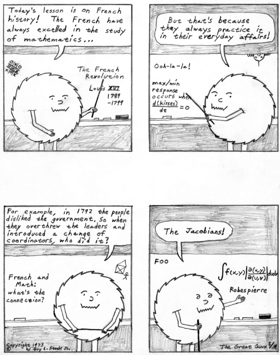

===
M
===

macdink

`Prev <MS.html>`__ 

M

 `Next <machoflops.html>`__

--------------

**macdink**: /mak´dink/, vt.

[from the Apple Macintosh, which is said to encourage such behavior] To
make many incremental and unnecessary cosmetic changes to a program or
file. Often the subject of the macdinking would be better off without
them. “When I left at 11PM last night, he was still macdinking the
slides for his presentation.” See also
`fritterware <../F/fritterware.html>`__, `window
shopping <../W/window-shopping.html>`__.

--------------

+-----------------------+----------------------------+-------------------------------+
| `Prev <MS.html>`__    | `Up <../M.html>`__         |  `Next <machoflops.html>`__   |
+-----------------------+----------------------------+-------------------------------+
| M$                    | `Home <../index.html>`__   |  machoflops                   |
+-----------------------+----------------------------+-------------------------------+

machoflops

`Prev <macdink.html>`__ 

M

 `Next <Macintoy.html>`__

--------------

**machoflops**: /mach´oh·flops/, n.

[pun on megaflops, a coinage for ‘millions of FLoating-point Operations
Per Second’] Refers to artificially inflated performance figures often
quoted by computer manufacturers. Real applications are lucky to get
half the quoted speed. See `Your mileage may
vary <../Y/Your-mileage-may-vary.html>`__,
`benchmark <../B/benchmark.html>`__.

--------------

+----------------------------+----------------------------+-----------------------------+
| `Prev <macdink.html>`__    | `Up <../M.html>`__         |  `Next <Macintoy.html>`__   |
+----------------------------+----------------------------+-----------------------------+
| macdink                    | `Home <../index.html>`__   |  Macintoy                   |
+----------------------------+----------------------------+-----------------------------+

Macintoy

`Prev <machoflops.html>`__ 

M

 `Next <Macintrash.html>`__

--------------

**Macintoy**: /mak´in·toy/, n.

The Apple Macintosh, considered as a `toy <../T/toy.html>`__. Less
pejorative than `Macintrash <Macintrash.html>`__.

--------------

+-------------------------------+----------------------------+-------------------------------+
| `Prev <machoflops.html>`__    | `Up <../M.html>`__         |  `Next <Macintrash.html>`__   |
+-------------------------------+----------------------------+-------------------------------+
| machoflops                    | `Home <../index.html>`__   |  Macintrash                   |
+-------------------------------+----------------------------+-------------------------------+

Macintrash

`Prev <Macintoy.html>`__ 

M

 `Next <macro.html>`__

--------------

**Macintrash**: /mak´in·trash\`/, n.

The Apple Macintosh, as described by a hacker who doesn't appreciate
being kept away from the *real computer* by the interface. The term
`maggotbox <maggotbox.html>`__ has been reported in regular use in the
Research Triangle area of North Carolina. Compare
`Macintoy <Macintoy.html>`__. See also `beige
toaster <../B/beige-toaster.html>`__, `WIMP
environment <../W/WIMP-environment.html>`__, `point-and-drool
interface <../P/point-and-drool-interface.html>`__, `drool-proof
paper <../D/drool-proof-paper.html>`__,
`user-friendly <../U/user-friendly.html>`__.

--------------

+-----------------------------+----------------------------+--------------------------+
| `Prev <Macintoy.html>`__    | `Up <../M.html>`__         |  `Next <macro.html>`__   |
+-----------------------------+----------------------------+--------------------------+
| Macintoy                    | `Home <../index.html>`__   |  macro                   |
+-----------------------------+----------------------------+--------------------------+

macro-

`Prev <macro.html>`__ 

M

 `Next <macrology.html>`__

--------------

**macro-**: pref.

Large. Opposite of `micro- <micro-.html>`__. In the mainstream and
among other technical cultures (for example, medical people) this
competes with the prefix `mega- <mega-.html>`__, but hackers tend to
restrict the latter to quantification.

--------------

+--------------------------+----------------------------+------------------------------+
| `Prev <macro.html>`__    | `Up <../M.html>`__         |  `Next <macrology.html>`__   |
+--------------------------+----------------------------+------------------------------+
| macro                    | `Home <../index.html>`__   |  macrology                   |
+--------------------------+----------------------------+------------------------------+

macro

`Prev <Macintrash.html>`__ 

M

 `Next <macro-.html>`__

--------------

**macro**: /mak´roh/, n.

[techspeak] A name (possibly followed by a formal
`arg <../A/arg.html>`__ list) that is equated to a text or symbolic
expression to which it is to be expanded (possibly with the substitution
of actual arguments) by a macro expander. This definition can be found
in any technical dictionary; what those won't tell you is how the
hackish connotations of the term have changed over time.

The term macro originated in early assemblers, which encouraged the use
of macros as a structuring and information-hiding device. During the
early 1970s, macro assemblers became ubiquitous, and sometimes quite as
powerful and expensive as `HLL <../H/HLL.html>`__\ s, only to fall
from favor as improving compiler technology marginalized assembler
programming (see `languages of
choice <../L/languages-of-choice.html>`__). Nowadays the term is most
often used in connection with the C preprocessor, LISP, or one of
several special-purpose languages built around a macro-expansion
facility (such as TeX or Unix's [nt]roff suite).

Indeed, the meaning has drifted enough that the collective macros is now
sometimes used for code in any special-purpose application control
language (whether or not the language is actually translated by text
expansion), and for macro-like entities such as the keyboard macros
supported in some text editors (and PC TSR or Macintosh INIT/CDEV
keyboard enhancers).

--------------

+-------------------------------+----------------------------+---------------------------+
| `Prev <Macintrash.html>`__    | `Up <../M.html>`__         |  `Next <macro-.html>`__   |
+-------------------------------+----------------------------+---------------------------+
| Macintrash                    | `Home <../index.html>`__   |  macro-                   |
+-------------------------------+----------------------------+---------------------------+

macrology

`Prev <macro-.html>`__ 

M

 `Next <maggotbox.html>`__

--------------

**macrology**: /mak·rol'@·jee/, n.

1. Set of usually complex or crufty macros, e.g., as part of a large
system written in `LISP <../L/LISP.html>`__,
`TECO <../T/TECO.html>`__, or (less commonly) assembler.

2. The art and science involved in comprehending a macrology in sense 1.
Sometimes studying the macrology of a system is not unlike archeology,
ecology, or `theology <../T/theology.html>`__, hence the sound-alike
construction. See also `boxology <../B/boxology.html>`__.

--------------

+---------------------------+----------------------------+------------------------------+
| `Prev <macro-.html>`__    | `Up <../M.html>`__         |  `Next <maggotbox.html>`__   |
+---------------------------+----------------------------+------------------------------+
| macro-                    | `Home <../index.html>`__   |  maggotbox                   |
+---------------------------+----------------------------+------------------------------+

maggotbox

`Prev <macrology.html>`__ 

M

 `Next <magic.html>`__

--------------

**maggotbox**: /mag'@t·boks/, n.

See `Macintrash <Macintrash.html>`__. This is even more derogatory.

--------------

+------------------------------+----------------------------+--------------------------+
| `Prev <macrology.html>`__    | `Up <../M.html>`__         |  `Next <magic.html>`__   |
+------------------------------+----------------------------+--------------------------+
| macrology                    | `Home <../index.html>`__   |  magic                   |
+------------------------------+----------------------------+--------------------------+

magic cookie

`Prev <magic.html>`__ 

M

 `Next <magic-number.html>`__

--------------

**magic cookie**: n.

[Unix; common]

1. Something passed between routines or programs that enables the
receiver to perform some operation; a capability ticket or opaque
identifier. Especially used of small data objects that contain data
encoded in a strange or intrinsically machine-dependent way. E.g., on
non-Unix OSes with a non-byte-stream model of files, the result of
ftell(3) may be a magic cookie rather than a byte offset; it can be
passed to fseek(3), but not operated on in any meaningful way. The
phrase it hands you a magic cookie means it returns a result whose
contents are not defined but which can be passed back to the same or
some other program later.

2. An in-band code for changing graphic rendition (e.g., inverse video
or underlining) or performing other control functions (see also
`cookie <../C/cookie.html>`__). Some older terminals would leave a
blank on the screen corresponding to mode-change magic cookies; this was
also called a `glitch <../G/glitch.html>`__ (or occasionally a turd;
compare `mouse droppings <mouse-droppings.html>`__). See also
`cookie <../C/cookie.html>`__.

--------------

+--------------------------+----------------------------+---------------------------------+
| `Prev <magic.html>`__    | `Up <../M.html>`__         |  `Next <magic-number.html>`__   |
+--------------------------+----------------------------+---------------------------------+
| magic                    | `Home <../index.html>`__   |  magic number                   |
+--------------------------+----------------------------+---------------------------------+

magic

`Prev <maggotbox.html>`__ 

M

 `Next <magic-cookie.html>`__

--------------

**magic**

1. adj. As yet unexplained, or too complicated to explain; compare
`automagically <../A/automagically.html>`__ and (Arthur C.) Clarke's
Third Law: “Any sufficiently advanced technology is indistinguishable
from magic.” “TTY echoing is controlled by a large number of magic
bits.” “This routine magically computes the parity of an 8-bit byte in
three instructions.”

2. adj. Characteristic of something that works although no one really
understands why (this is especially called `black
magic <../B/black-magic.html>`__).

3. n. [Stanford] A feature not generally publicized that allows
something otherwise impossible, or a feature formerly in that category
but now unveiled.

4. n. The ultimate goal of all engineering & development, elegance in
the extreme; from the first corollary to Clarke's Third Law: “Any
technology distinguishable from magic is insufficiently advanced”.

Parodies playing on these senses of the term abound; some have made
their way into serious documentation, as when a MAGIC directive was
described in the Control Card Reference for GCOS c.1978. For more about
hackish ‘magic’, see `Appendix A <../appendixa.html>`__. Compare `black
magic <../B/black-magic.html>`__, `wizardly <../W/wizardly.html>`__,
`deep magic <../D/deep-magic.html>`__, `heavy
wizardry <../H/heavy-wizardry.html>`__.

--------------

+------------------------------+----------------------------+---------------------------------+
| `Prev <maggotbox.html>`__    | `Up <../M.html>`__         |  `Next <magic-cookie.html>`__   |
+------------------------------+----------------------------+---------------------------------+
| maggotbox                    | `Home <../index.html>`__   |  magic cookie                   |
+------------------------------+----------------------------+---------------------------------+

magic number

`Prev <magic-cookie.html>`__ 

M

 `Next <magic-smoke.html>`__

--------------

**magic number**: n.

[Unix/C; common]

1. In source code, some non-obvious constant whose value is significant
to the operation of a program and that is inserted inconspicuously
in-line (`hardcoded <../H/hardcoded.html>`__), rather than expanded in
by a symbol set by a commented **#define**. Magic numbers in this sense
are bad style.

2. A number that encodes critical information used in an algorithm in
some opaque way. The classic examples of these are the numbers used in
hash or CRC functions, or the coefficients in a linear congruential
generator for pseudo-random numbers. This sense actually predates and
was ancestral to the more common sense

3. Special data located at the beginning of a binary data file to
indicate its type to a utility. Under Unix, the system and various
applications programs (especially the linker) distinguish between types
of executable file by looking for a magic number. Once upon a time,
these magic numbers were `PDP-11 <../P/PDP-11.html>`__ branch
instructions that skipped over header data to the start of executable
code; 0407, for example, was octal for ‘branch 16 bytes relative’. Many
other kinds of files now have magic numbers somewhere; some magic
numbers are, in fact, strings, like the "!<arch>" at the beginning of
a Unix archive file or the "%!" leading PostScript files. Nowadays
only a `wizard <../W/wizard.html>`__ knows the spells to create magic
numbers. How do you choose a fresh magic number of your own? Simple —
you pick one at random. See? It's magic!

4. An input that leads to a computational boundary condition, where
algorithm behavior becomes discontinuous. Numeric overflows
(particularly with signed data types) and run-time errors (divide by
zero, stack overflows) are indications of magic numbers. The Y2K scare
was probably the most notorious magic number non-incident.

*The* magic number, on the other hand, is "7±2". See *The magical
number seven, plus or minus two: some limits on our capacity for
processing information* by George Miller, in the *Psychological Review*
63:81-97 (1956). This classic paper established the number of distinct
items (such as numeric digits) that humans can hold in short-term
memory. Among other things, this strongly influenced the interface
design of the phone system.

--------------

+---------------------------------+----------------------------+--------------------------------+
| `Prev <magic-cookie.html>`__    | `Up <../M.html>`__         |  `Next <magic-smoke.html>`__   |
+---------------------------------+----------------------------+--------------------------------+
| magic cookie                    | `Home <../index.html>`__   |  magic smoke                   |
+---------------------------------+----------------------------+--------------------------------+

magic smoke

`Prev <magic-number.html>`__ 

M

 `Next <mail-storm.html>`__

--------------

**magic smoke**: n.

A substance trapped inside IC packages that enables them to function
(also called blue smoke; this is similar to the archaic phlogiston
hypothesis about combustion). Its existence is demonstrated by what
happens when a chip burns up — the magic smoke gets let out, so it
doesn't work any more. See `smoke test <../S/smoke-test.html>`__,
`let the smoke out <../L/let-the-smoke-out.html>`__.

Usenetter Jay Maynard tells the following story: “Once, while hacking on
a dedicated Z80 system, I was testing code by blowing EPROMs and
plugging them in the system, then seeing what happened. One time, I
plugged one in backwards. I only discovered that *after* I realized that
Intel didn't put power-on lights under the quartz windows on the tops of
their EPROMs — the die was glowing white-hot. Amazingly, the EPROM
worked fine after I erased it, filled it full of zeros, then erased it
again. For all I know, it's still in service. Of course, this is because
the magic smoke didn't get let out.” Compare the original phrasing of
`Murphy's Law <Murphys-Law.html>`__.

--------------

+---------------------------------+----------------------------+-------------------------------+
| `Prev <magic-number.html>`__    | `Up <../M.html>`__         |  `Next <mail-storm.html>`__   |
+---------------------------------+----------------------------+-------------------------------+
| magic number                    | `Home <../index.html>`__   |  mail storm                   |
+---------------------------------+----------------------------+-------------------------------+

mailbomb

`Prev <mail-storm.html>`__ 

M

 `Next <mailing-list.html>`__

--------------

**mailbomb**

(also mail bomb) [Usenet]

1. v. To send, or urge others to send, massive amounts of
`email <../E/email.html>`__ to a single system or person, esp. with
intent to crash or `spam <../S/spam.html>`__ the recipient's system.
Sometimes done in retaliation for a perceived serious offense.
Mailbombing is itself widely regarded as a serious offense — it can
disrupt email traffic or other facilities for innocent users on the
victim's system, and in extreme cases, even at upstream sites.

2. n. An automatic procedure with a similar effect.

3. n. The mail sent. Compare `letterbomb <../L/letterbomb.html>`__,
`nastygram <../N/nastygram.html>`__, `BLOB <../B/BLOB.html>`__
(sense 2), `list-bomb <../L/list-bomb.html>`__.

--------------

+-------------------------------+----------------------------+---------------------------------+
| `Prev <mail-storm.html>`__    | `Up <../M.html>`__         |  `Next <mailing-list.html>`__   |
+-------------------------------+----------------------------+---------------------------------+
| mail storm                    | `Home <../index.html>`__   |  mailing list                   |
+-------------------------------+----------------------------+---------------------------------+

mailing list

`Prev <mailbomb.html>`__ 

M

 `Next <main-loop.html>`__

--------------

**mailing list**: n.

(often shortened in context to list)

1. An `email <../E/email.html>`__ address that is an alias (or
`macro <macro.html>`__, though that word is never used in this
connection) for many other email addresses. Some mailing lists are
simple reflectors, redirecting mail sent to them to the list of
recipients. Others are filtered by humans or programs of varying degrees
of sophistication; lists filtered by humans are said to be moderated.

2. The people who receive your email when you send it to such an
address.

Mailing lists are one of the primary forms of hacker interaction, along
with `Usenet <../U/Usenet.html>`__. They predate Usenet, having
originated with the first UUCP and ARPANET connections. They are often
used for private information-sharing on topics that would be too
specialized for or inappropriate to public Usenet groups. Though some of
these maintain almost purely technical content (such as the Internet
Engineering Task Force mailing list), others (like the ‘sf-lovers’ list
maintained for many years by Saul Jaffe) are recreational, and many are
purely social. Perhaps the most infamous of the social lists was the
eccentric "bandykin" distribution; its latter-day progeny,
"lectroids" and "tanstaafl", still include a number of the oddest
and most interesting people in hackerdom.

Mailing lists are easy to create and (unlike Usenet) don't tie up a
significant amount of machine resources (until they get very large, at
which point they can become interesting torture tests for mail
software). Thus, they are often created temporarily by working groups,
the members of which can then collaborate on a project without ever
needing to meet face-to-face. Much of the material in this lexicon was
criticized and polished on just such a mailing list (called
‘jargon-friends’), which included all the co-authors of Steele-1983.

--------------

+-----------------------------+----------------------------+------------------------------+
| `Prev <mailbomb.html>`__    | `Up <../M.html>`__         |  `Next <main-loop.html>`__   |
+-----------------------------+----------------------------+------------------------------+
| mailbomb                    | `Home <../index.html>`__   |  main loop                   |
+-----------------------------+----------------------------+------------------------------+

mail storm

`Prev <magic-smoke.html>`__ 

M

 `Next <mailbomb.html>`__

--------------

**mail storm**: n.

[from `broadcast storm <../B/broadcast-storm.html>`__, influenced by
*maelstrom*] What often happens when a machine with an Internet
connection and active users re-connects after extended downtime — a
flood of incoming mail that brings the machine to its knees. See also
`hairball <../H/hairball.html>`__.

--------------

+--------------------------------+----------------------------+-----------------------------+
| `Prev <magic-smoke.html>`__    | `Up <../M.html>`__         |  `Next <mailbomb.html>`__   |
+--------------------------------+----------------------------+-----------------------------+
| magic smoke                    | `Home <../index.html>`__   |  mailbomb                   |
+--------------------------------+----------------------------+-----------------------------+

mainframe

`Prev <main-loop.html>`__ 

M

 `Next <mainsleaze.html>`__

--------------

**mainframe**: n.

Term originally referring to the cabinet containing the central
processor unit or ‘main frame’ of a room-filling `Stone
Age <../S/Stone-Age.html>`__ batch machine. After the emergence of
smaller minicomputer designs in the early 1970s, the traditional `big
iron <../B/big-iron.html>`__ machines were described as ‘mainframe
computers’ and eventually just as mainframes. The term carries the
connotation of a machine designed for batch rather than interactive use,
though possibly with an interactive timesharing operating system
retrofitted onto it; it is especially used of machines built by IBM,
Unisys, and the other great `dinosaur <../D/dinosaur.html>`__\ s
surviving from computing's `Stone Age <../S/Stone-Age.html>`__.

It has been common wisdom among hackers since the late 1980s that the
mainframe architectural tradition is essentially dead (outside of the
tiny market for `number-crunching <../N/number-crunching.html>`__
supercomputers having been swamped by the recent huge advances in IC
technology and low-cost personal computing. The wave of failures,
takeovers, and mergers among traditional mainframe makers in the early
1990s bore this out. The biggest mainframer of all, IBM, was compelled
to re-invent itself as a huge systems-consulting house. (See `dinosaurs
mating <../D/dinosaurs-mating.html>`__ and `killer
micro <../K/killer-micro.html>`__).

However, in yet another instance of the `cycle of
reincarnation <../C/cycle-of-reincarnation.html>`__, the port of Linux
to the IBM S/390 architecture in 1999 — assisted by IBM — produced a
resurgence of interest in mainframe computing as a way of providing huge
quantities of easily maintainable, reliable virtual Linux servers,
saving IBM's mainframe division from almost certain extinction.

--------------

+------------------------------+----------------------------+-------------------------------+
| `Prev <main-loop.html>`__    | `Up <../M.html>`__         |  `Next <mainsleaze.html>`__   |
+------------------------------+----------------------------+-------------------------------+
| main loop                    | `Home <../index.html>`__   |  mainsleaze                   |
+------------------------------+----------------------------+-------------------------------+

main loop

`Prev <mailing-list.html>`__ 

M

 `Next <mainframe.html>`__

--------------

**main loop**: n.

The top-level control flow construct in an input- or event-driven
program, the one which receives and acts or dispatches on the program's
input. See also `driver <../D/driver.html>`__.

--------------

+---------------------------------+----------------------------+------------------------------+
| `Prev <mailing-list.html>`__    | `Up <../M.html>`__         |  `Next <mainframe.html>`__   |
+---------------------------------+----------------------------+------------------------------+
| mailing list                    | `Home <../index.html>`__   |  mainframe                   |
+---------------------------------+----------------------------+------------------------------+

mainsleaze

`Prev <mainframe.html>`__ 

M

 `Next <malware.html>`__

--------------

**mainsleaze**: n.

1. Spam emitted by a reputable, mainstream company (as opposed to
fly-by-night Viagra oeddlers and the like). Sometime this happens in
honest ignorance, but the reputation danage can take years to live down.

2. Occasionally used for a big-time spammer, with its own `fat
pipe <../F/fat-pipe.html>`__, their own mailservers, and a `pink
contract <../P/pink-contract.html>`__. Almost impossible to get shut
down.

--------------

+------------------------------+----------------------------+----------------------------+
| `Prev <mainframe.html>`__    | `Up <../M.html>`__         |  `Next <malware.html>`__   |
+------------------------------+----------------------------+----------------------------+
| mainframe                    | `Home <../index.html>`__   |  malware                   |
+------------------------------+----------------------------+----------------------------+

malware

`Prev <mainsleaze.html>`__ 

M

 `Next <man-page.html>`__

--------------

**malware**: n.

[Common] Malicious software. Software intended to cause consequences the
unwitting user would not choose; especially used of
`virus <../V/virus.html>`__ or `Trojan
horse <../T/Trojan-horse.html>`__ software.

--------------

+-------------------------------+----------------------------+-----------------------------+
| `Prev <mainsleaze.html>`__    | `Up <../M.html>`__         |  `Next <man-page.html>`__   |
+-------------------------------+----------------------------+-----------------------------+
| mainsleaze                    | `Home <../index.html>`__   |  man page                   |
+-------------------------------+----------------------------+-----------------------------+

management

`Prev <man-page.html>`__ 

M

 `Next <mandelbug.html>`__

--------------

**management**: n.

1. Corporate power elites distinguished primarily by their distance from
actual productive work and their chronic failure to manage (see also
`suit <../S/suit.html>`__). Spoken derisively, as in “\ *Management*
decided that ...”.

2. Mythically, a vast bureaucracy responsible for all the world's minor
irritations. Hackers' satirical public notices are often signed ‘The
Mgt’; this derives from the *Illuminatus* novels (see the
`Bibliography <../pt03.html#bibliography>`__ in Appendix C).

--------------

+-----------------------------+----------------------------+------------------------------+
| `Prev <man-page.html>`__    | `Up <../M.html>`__         |  `Next <mandelbug.html>`__   |
+-----------------------------+----------------------------+------------------------------+
| man page                    | `Home <../index.html>`__   |  mandelbug                   |
+-----------------------------+----------------------------+------------------------------+

mandelbug

`Prev <management.html>`__ 

M

 `Next <manged.html>`__

--------------

**mandelbug**: /man´del·buhg/, n.

[from the Mandelbrot set] A bug whose underlying causes are so complex
and obscure as to make its behavior appear chaotic or even
non-deterministic. This term implies that the speaker thinks it is a
`Bohr bug <../B/Bohr-bug.html>`__, rather than a
`heisenbug <../H/heisenbug.html>`__. See also
`schroedinbug <../S/schroedinbug.html>`__.

--------------

+-------------------------------+----------------------------+---------------------------+
| `Prev <management.html>`__    | `Up <../M.html>`__         |  `Next <manged.html>`__   |
+-------------------------------+----------------------------+---------------------------+
| management                    | `Home <../index.html>`__   |  manged                   |
+-------------------------------+----------------------------+---------------------------+

manged

`Prev <mandelbug.html>`__ 

M

 `Next <mangle.html>`__

--------------

**manged**: /mahnjd/, n.

[probably from the French ‘manger’ or Italian ‘mangiare’, to eat;
perhaps influenced by English ‘mange’, ‘mangy’] adj. Refers to anything
that is mangled or damaged, usually beyond repair. “The disk was manged
after the electrical storm.” Compare `mung <mung.html>`__.

--------------

+------------------------------+----------------------------+---------------------------+
| `Prev <mandelbug.html>`__    | `Up <../M.html>`__         |  `Next <mangle.html>`__   |
+------------------------------+----------------------------+---------------------------+
| mandelbug                    | `Home <../index.html>`__   |  mangle                   |
+------------------------------+----------------------------+---------------------------+

mangled name

`Prev <mangle.html>`__ 

M

 `Next <mangler.html>`__

--------------

**mangled name**: n.

A name, appearing in a C++ object file, that is a coded representation
of the object declaration as it appears in the source. Mangled names are
used because C++ allows multiple objects to have the same name, as long
as they are distinguishable in some other way, such as by having
different parameter types. Thus, the internal name must have that
additional information embedded in it, using the limited character set
allowed by most linkers. For instance, one popular compiler encodes the
standard library function declaration “memchr(const void\*,int,unsigned
int)” as “@memchr$qpxviui”.

--------------

+---------------------------+----------------------------+----------------------------+
| `Prev <mangle.html>`__    | `Up <../M.html>`__         |  `Next <mangler.html>`__   |
+---------------------------+----------------------------+----------------------------+
| mangle                    | `Home <../index.html>`__   |  mangler                   |
+---------------------------+----------------------------+----------------------------+

mangle

`Prev <manged.html>`__ 

M

 `Next <mangled-name.html>`__

--------------

**mangle**: vt.

1. Used similarly to `mung <mung.html>`__ or
`scribble <../S/scribble.html>`__, but more violent in its
connotations; something that is mangled has been irreversibly and
totally trashed.

2. To produce the `mangled name <mangled-name.html>`__ corresponding
to a C++ declaration.

--------------

+---------------------------+----------------------------+---------------------------------+
| `Prev <manged.html>`__    | `Up <../M.html>`__         |  `Next <mangled-name.html>`__   |
+---------------------------+----------------------------+---------------------------------+
| manged                    | `Home <../index.html>`__   |  mangled name                   |
+---------------------------+----------------------------+---------------------------------+

mangler

`Prev <mangled-name.html>`__ 

M

 `Next <manularity.html>`__

--------------

**mangler**: n.

[DEC] A manager. Compare `management <management.html>`__. Note that
`system mangler <../S/system-mangler.html>`__ is somewhat different in
connotation.

--------------

+---------------------------------+----------------------------+-------------------------------+
| `Prev <mangled-name.html>`__    | `Up <../M.html>`__         |  `Next <manularity.html>`__   |
+---------------------------------+----------------------------+-------------------------------+
| mangled name                    | `Home <../index.html>`__   |  manularity                   |
+---------------------------------+----------------------------+-------------------------------+

man page

`Prev <malware.html>`__ 

M

 `Next <management.html>`__

--------------

**man page**: n.

A page from the Unix Programmer's Manual, documenting one of Unix's many
commands, system calls, library subroutines, device driver interfaces,
file formats, games, macro packages, or maintenance utilities. By
extension, the term “man page” may be used to refer to documentation of
any kind, under any system, though it is most likely to be confined to
short on-line references.

As mentioned in `Chapter 11, *Other Lexicon
Conventions <../conventions.html>`__, there is a standard syntax for
referring to man page entries: the phrase “foo(n)” refers to the page
for “foo” in chapter n of the manual, where chapter 1 is user commands,
chapter 2 is system calls, etc.

The man page format is beloved, or berated, for having the same sort of
pithy utility as the rest of Unix. Man pages tend to be written as very
compact, concise descriptions which are complete but not forgiving of
the lazy or careless reader. Their stylized format does a good job of
summarizing the essentials: invocation syntax, options, basic
functionality. While such a concise reference is perfect for the
do-one-thing-and-do-it-well tools which are favored by the Unix
philosophy, it admittedly breaks down when applied to a command which is
itself a major subsystem.

--------------

+----------------------------+----------------------------+-------------------------------+
| `Prev <malware.html>`__    | `Up <../M.html>`__         |  `Next <management.html>`__   |
+----------------------------+----------------------------+-------------------------------+
| malware                    | `Home <../index.html>`__   |  management                   |
+----------------------------+----------------------------+-------------------------------+

manularity

`Prev <mangler.html>`__ 

M

 `Next <marching-ants.html>`__

--------------

**manularity**: /man\`yoo·la´ri·tee/, n.

[prob. fr. techspeak manual + granularity] A notional measure of the
manual labor required for some task, particularly one of the sort that
automation is supposed to eliminate. “Composing English on paper has
much higher manularity than using a text editor, especially in the
revising stage.” Hackers tend to consider manularity a symptom of
primitive methods; in fact, a true hacker confronted with an apparent
requirement to do a computing task `by hand <../B/by-hand.html>`__
will inevitably seize the opportunity to build another tool (see
`toolsmith <../T/toolsmith.html>`__).

--------------

+----------------------------+----------------------------+----------------------------------+
| `Prev <mangler.html>`__    | `Up <../M.html>`__         |  `Next <marching-ants.html>`__   |
+----------------------------+----------------------------+----------------------------------+
| mangler                    | `Home <../index.html>`__   |  marching ants                   |
+----------------------------+----------------------------+----------------------------------+

marbles

`Prev <marching-ants.html>`__ 

M

 `Next <marginal.html>`__

--------------

**marbles**: pl.n.

[from mainstream “lost all his/her marbles”] The minimum needed to build
your way further up some hierarchy of tools or abstractions. After a bad
system crash, you need to determine if the machine has enough marbles to
come up on its own, or enough marbles to allow a rebuild from backups,
or if you need to rebuild from scratch. “This compiler doesn't even have
enough marbles to compile `hello world <../H/hello-world.html>`__.”

--------------

+----------------------------------+----------------------------+-----------------------------+
| `Prev <marching-ants.html>`__    | `Up <../M.html>`__         |  `Next <marginal.html>`__   |
+----------------------------------+----------------------------+-----------------------------+
| marching ants                    | `Home <../index.html>`__   |  marginal                   |
+----------------------------------+----------------------------+-----------------------------+

marching ants

`Prev <manularity.html>`__ 

M

 `Next <marbles.html>`__

--------------

**marching ants**

The animated dotted-line marquee that indicates a rectangle or item
select in Adobe Photoshop, the GIMP, and other similar image-editing
programs.

--------------

+-------------------------------+----------------------------+----------------------------+
| `Prev <manularity.html>`__    | `Up <../M.html>`__         |  `Next <marbles.html>`__   |
+-------------------------------+----------------------------+----------------------------+
| manularity                    | `Home <../index.html>`__   |  marbles                   |
+-------------------------------+----------------------------+----------------------------+

marginal

`Prev <marbles.html>`__ 

M

 `Next <marginally.html>`__

--------------

**marginal**: adj.

[common]

1. [techspeak] An extremely small change. “A marginal increase in
`core <../C/core.html>`__ can decrease `GC <../G/GC.html>`__ time
drastically.” In everyday terms, this means that it is a lot easier to
clean off your desk if you have a spare place to put some of the junk
while you sort through it.

2. Of little merit. “This proposed new feature seems rather marginal to
me.”

3. Of extremely small probability of `win <../W/win.html>`__\ ning.
“The power supply was rather marginal anyway; no wonder it fried.”

--------------

+----------------------------+----------------------------+-------------------------------+
| `Prev <marbles.html>`__    | `Up <../M.html>`__         |  `Next <marginally.html>`__   |
+----------------------------+----------------------------+-------------------------------+
| marbles                    | `Home <../index.html>`__   |  marginally                   |
+----------------------------+----------------------------+-------------------------------+

marginally

`Prev <marginal.html>`__ 

M

 `Next <marketroid.html>`__

--------------

**marginally**: adv.

Slightly. “The ravs here are only marginally better than at Small Eating
Place.” See `epsilon <../E/epsilon.html>`__.

--------------

+-----------------------------+----------------------------+-------------------------------+
| `Prev <marginal.html>`__    | `Up <../M.html>`__         |  `Next <marketroid.html>`__   |
+-----------------------------+----------------------------+-------------------------------+
| marginal                    | `Home <../index.html>`__   |  marketroid                   |
+-----------------------------+----------------------------+-------------------------------+

marketroid

`Prev <marginally.html>`__ 

M

 `Next <Mars.html>`__

--------------

**marketroid**: /mar´k@·troyd/, n.

alt.: marketing slime, marketeer, mar­ket­ing droid, marketdroid. A
member of a company's marketing department, esp. one who promises users
that the next version of a product will have features that are not
actually scheduled for inclusion, are extremely difficult to implement,
and/or are in violation of the laws of physics; and/or one who describes
existing features (and misfeatures) in ebullient, buzzword-laden
adspeak. Derogatory. Compare `droid <../D/droid.html>`__.

--------------

+-------------------------------+----------------------------+-------------------------+
| `Prev <marginally.html>`__    | `Up <../M.html>`__         |  `Next <Mars.html>`__   |
+-------------------------------+----------------------------+-------------------------+
| marginally                    | `Home <../index.html>`__   |  Mars                   |
+-------------------------------+----------------------------+-------------------------+

Mars

`Prev <marketroid.html>`__ 

M

 `Next <martian.html>`__

--------------

**Mars**: n.

A legendary tragic failure, the archetypal Hacker Dream Gone Wrong. Mars
was the code name for a family of PDP-10-compatible computers built by
Systems Concepts (now, The SC Group): the multi-processor SC-30M, the
small uniprocessor SC-25, and the never-built superprocessor SC-40.
These machines were marvels of engineering design; although not much
slower than the unique `Foonly <../F/Foonly.html>`__ F-1, they were
physically smaller and consumed less power than the much slower
`DEC <../D/DEC.html>`__ KS10 or Foonly F-2, F-3, or F-4 machines. They
were also completely compatible with the DEC KL10, and ran all KL10
binaries (including the operating system) with no modifications at about
2--3 times faster than a KL10.

When DEC cancelled the Jupiter project in 1983 (their followup to the
PDP-10), Systems Concepts should have made a bundle selling their
machine into shops with a lot of software investment in PDP-10s, and in
fact their spring 1984 announcement generated a great deal of excitement
in the PDP-10 world. TOPS-10 was running on the Mars by the summer of
1984, and TOPS-20 by early fall. Unfortunately, the hackers running
Systems Concepts were much better at designing machines than at mass
producing or selling them; the company allowed itself to be sidetracked
by a bout of perfectionism into continually improving the design, and
lost credibility as delivery dates continued to slip. They also
overpriced the product ridiculously; they believed they were competing
with the KL10 and `VAX <../V/VAX.html>`__ 8600 and failed to reckon
with the likes of Sun Microsystems and other hungry startups building
workstations with power comparable to the KL10 at a fraction of the
price. By the time SC shipped the first SC-30M to Stanford in late 1985,
most customers had already made the traumatic decision to abandon the
PDP-10, usually for VMS or Unix boxes. Most of the Mars computers built
ended up being purchased by CompuServe.

This tale and the related saga of `Foonly <../F/Foonly.html>`__ hold a
lesson for hackers: if you want to play in the `Real
World <../R/Real-World.html>`__, you need to learn Real World moves.

--------------

+-------------------------------+----------------------------+----------------------------+
| `Prev <marketroid.html>`__    | `Up <../M.html>`__         |  `Next <martian.html>`__   |
+-------------------------------+----------------------------+----------------------------+
| marketroid                    | `Home <../index.html>`__   |  martian                   |
+-------------------------------+----------------------------+----------------------------+

martian

`Prev <Mars.html>`__ 

M

 `Next <massage.html>`__

--------------

**martian**: n.

A packet sent on a TCP/IP network with a source address of the test
loopback interface [127.0.0.1]. This means that it will come back
labeled with a source address that is clearly not of this earth. “The
domain server is getting lots of packets from Mars. Does that gateway
have a martian filter?” Compare `Christmas tree
packet <../C/Christmas-tree-packet.html>`__,
`Godzillagram <../G/Godzillagram.html>`__.

--------------

+-------------------------+----------------------------+----------------------------+
| `Prev <Mars.html>`__    | `Up <../M.html>`__         |  `Next <massage.html>`__   |
+-------------------------+----------------------------+----------------------------+
| Mars                    | `Home <../index.html>`__   |  massage                   |
+-------------------------+----------------------------+----------------------------+

massage

`Prev <martian.html>`__ 

M

 `Next <math-out.html>`__

--------------

**massage**: vt.

[common] Vague term used to describe ‘smooth’ transformations of a data
set into a different form, esp. transformations that do not lose
information. Connotes less pain than `munch <munch.html>`__ or
`crunch <../C/crunch.html>`__. “He wrote a program that massages X
bitmap files into GIF format.” Compare `slurp <../S/slurp.html>`__.

--------------

+----------------------------+----------------------------+-----------------------------+
| `Prev <martian.html>`__    | `Up <../M.html>`__         |  `Next <math-out.html>`__   |
+----------------------------+----------------------------+-----------------------------+
| martian                    | `Home <../index.html>`__   |  math-out                   |
+----------------------------+----------------------------+-----------------------------+

math-out

`Prev <massage.html>`__ 

M

 `Next <Matrix.html>`__

--------------

**math-out**: n.

[poss. from ‘white-out’ (the blizzard variety)] A paper or presentation
so encrusted with mathematical or other formal notation as to be
incomprehensible. This may be a device for concealing the fact that it
is actually `content-free <../C/content-free.html>`__. See also
`numbers <../N/numbers.html>`__, `social science
number <../S/social-science-number.html>`__.

|image0|

A `math-out <math-out.html>`__ approach to history.

(The next cartoon in the Crunchly saga is
`73-05-19 <../S/space-cadet-keyboard.html#crunchly73-05-19>`__. The
previous one is the `frontispiece <../lexicon.html#crunchly-1>`__.)

--------------

+----------------------------+----------------------------+---------------------------+
| `Prev <massage.html>`__    | `Up <../M.html>`__         |  `Next <Matrix.html>`__   |
+----------------------------+----------------------------+---------------------------+
| massage                    | `Home <../index.html>`__   |  Matrix                   |
+----------------------------+----------------------------+---------------------------+

Matrix

`Prev <math-out.html>`__ 

M

 `Next <maximum-Maytag-mode.html>`__

--------------

**Matrix**: n.

[FidoNet]

1. What the Opus BBS software and sysops call
`FidoNet <../F/FidoNet.html>`__.

2. Fanciful term for a `cyberspace <../C/cyberspace.html>`__ expected
to emerge from current networking experiments (see `the
network <../T/the-network.html>`__). The name of the rather good 1999
`cypherpunk <../C/cypherpunk.html>`__ movie *The Matrix* played on
this sense, which however had been established for years before.

3. The totality of present-day computer networks (popularized in this
sense by John Quarterman; rare outside academic literature).

--------------

+-----------------------------+----------------------------+----------------------------------------+
| `Prev <math-out.html>`__    | `Up <../M.html>`__         |  `Next <maximum-Maytag-mode.html>`__   |
+-----------------------------+----------------------------+----------------------------------------+
| math-out                    | `Home <../index.html>`__   |  maximum Maytag mode                   |
+-----------------------------+----------------------------+----------------------------------------+

maximum Maytag mode

`Prev <Matrix.html>`__ 

M

 `Next <McQuary-limit.html>`__

--------------

**maximum Maytag mode**: n.

What a `washing machine <../W/washing-machine.html>`__ or, by
extension, any disk drive is in when it's being used so heavily that
it's shaking like an old Maytag with an unbalanced load. If prolonged
for any length of time, can lead to disks becoming `walking
drives <../W/walking-drives.html>`__. In 1999 it's been some years
since hard disks were large enough to do this, but the same phenomenon
has recently been reported with 24X CD-ROM drives.

--------------

+---------------------------+----------------------------+----------------------------------+
| `Prev <Matrix.html>`__    | `Up <../M.html>`__         |  `Next <McQuary-limit.html>`__   |
+---------------------------+----------------------------+----------------------------------+
| Matrix                    | `Home <../index.html>`__   |  McQuary limit                   |
+---------------------------+----------------------------+----------------------------------+

McQuary limit

`Prev <maximum-Maytag-mode.html>`__ 

M

 `Next <meatspace.html>`__

--------------

**McQuary limit**

[from the name of the founder of "alt.fan.warlord"; see
`warlording <../W/warlording.html>`__.] 4 lines of at most 80
characters each, sometimes still cited on Usenet as the maximum
acceptable size of a `sig block <../S/sig-block.html>`__. Before the
great bandwidth explosion of the early 1990s, long sigs actually cost
people running Usenet servers significant amounts of money. Nowadays
social pressure against long sigs is intended to avoid waste of human
attention rather than machine bandwidth. Accordingly, the McQuary limit
should be considered a rule of thumb rather than a hard limit; it's best
to avoid sigs that are large, repetitive, and distracting. See also
`warlording <../W/warlording.html>`__.

--------------

+----------------------------------------+----------------------------+------------------------------+
| `Prev <maximum-Maytag-mode.html>`__    | `Up <../M.html>`__         |  `Next <meatspace.html>`__   |
+----------------------------------------+----------------------------+------------------------------+
| maximum Maytag mode                    | `Home <../index.html>`__   |  meatspace                   |
+----------------------------------------+----------------------------+------------------------------+

meatspace

`Prev <McQuary-limit.html>`__ 

M

 `Next <meatware.html>`__

--------------

**meatspace**: /meet´spays/, n.

The physical world, where the meat lives — as opposed to
`cyberspace <../C/cyberspace.html>`__. Hackers are actually more
willing to use this term than ‘cyberspace’, because it's not speculative
— we already have a running meatspace implementation (the universe).
Compare `RL <../R/RL.html>`__.

--------------

+----------------------------------+----------------------------+-----------------------------+
| `Prev <McQuary-limit.html>`__    | `Up <../M.html>`__         |  `Next <meatware.html>`__   |
+----------------------------------+----------------------------+-----------------------------+
| McQuary limit                    | `Home <../index.html>`__   |  meatware                   |
+----------------------------------+----------------------------+-----------------------------+

meatware

`Prev <meatspace.html>`__ 

M

 `Next <meeces.html>`__

--------------

**meatware**: n.

Synonym for `wetware <../W/wetware.html>`__. Less common.

--------------

+------------------------------+----------------------------+---------------------------+
| `Prev <meatspace.html>`__    | `Up <../M.html>`__         |  `Next <meeces.html>`__   |
+------------------------------+----------------------------+---------------------------+
| meatspace                    | `Home <../index.html>`__   |  meeces                   |
+------------------------------+----------------------------+---------------------------+

meeces

`Prev <meatware.html>`__ 

M

 `Next <meg.html>`__

--------------

**meeces**: /mees'@z/, n.

[TMRC] Occasional furry visitors who are not
`urchin <../U/urchin.html>`__\ s. [That is, mice. This may no longer
be in live use; it clearly derives from the refrain of the early-1960s
cartoon character Mr. Jinks: “I hate meeces to *pieces*!” — ESR]

--------------

+-----------------------------+----------------------------+------------------------+
| `Prev <meatware.html>`__    | `Up <../M.html>`__         |  `Next <meg.html>`__   |
+-----------------------------+----------------------------+------------------------+
| meatware                    | `Home <../index.html>`__   |  meg                   |
+-----------------------------+----------------------------+------------------------+

mega-

`Prev <meg.html>`__ 

M

 `Next <megapenny.html>`__

--------------

**mega-**: /me´g@/, pref.

[SI] See `quantifiers <../Q/quantifiers.html>`__.

--------------

+------------------------+----------------------------+------------------------------+
| `Prev <meg.html>`__    | `Up <../M.html>`__         |  `Next <megapenny.html>`__   |
+------------------------+----------------------------+------------------------------+
| meg                    | `Home <../index.html>`__   |  megapenny                   |
+------------------------+----------------------------+------------------------------+

megapenny

`Prev <mega-.html>`__ 

M

 `Next <MEGO.html>`__

--------------

**megapenny**: /meg'@·pen\`ee/, n.

$10,000 (1 cent \* "106"). Used semi-humorously as a unit in comparing
computer cost and performance figures.

--------------

+--------------------------+----------------------------+-------------------------+
| `Prev <mega-.html>`__    | `Up <../M.html>`__         |  `Next <MEGO.html>`__   |
+--------------------------+----------------------------+-------------------------+
| mega-                    | `Home <../index.html>`__   |  MEGO                   |
+--------------------------+----------------------------+-------------------------+

meg

`Prev <meeces.html>`__ 

M

 `Next <mega-.html>`__

--------------

**meg**: /meg/, n.

See `quantifiers <../Q/quantifiers.html>`__.

--------------

+---------------------------+----------------------------+--------------------------+
| `Prev <meeces.html>`__    | `Up <../M.html>`__         |  `Next <mega-.html>`__   |
+---------------------------+----------------------------+--------------------------+
| meeces                    | `Home <../index.html>`__   |  mega-                   |
+---------------------------+----------------------------+--------------------------+

MEGO

`Prev <megapenny.html>`__ 

M

 `Next <meltdown--network.html>`__

--------------

**MEGO**: /me´goh/, /mee´goh/

[“My Eyes Glaze Over”, often “Mine Eyes Glazeth (sic) Over”, attributed
to the futurologist Herman Kahn] Also MEGO factor.

1. n. A `handwave <../H/handwave.html>`__ intended to confuse the
listener and hopefully induce agreement because the listener does not
want to admit to not understanding what is going on. MEGO is usually
directed at senior management by engineers and contains a high
proportion of `TLA <../T/TLA.html>`__\ s.

2. excl. An appropriate response to MEGO tactics.

3. Among non-hackers, often refers not to behavior that causes the eyes
to glaze, but to the eye-glazing reaction itself, which may be triggered
by the mere threat of excessive technical detail as effectively as by an
actual excess of it.

--------------

+------------------------------+----------------------------+--------------------------------------+
| `Prev <megapenny.html>`__    | `Up <../M.html>`__         |  `Next <meltdown--network.html>`__   |
+------------------------------+----------------------------+--------------------------------------+
| megapenny                    | `Home <../index.html>`__   |  meltdown, network                   |
+------------------------------+----------------------------+--------------------------------------+

meltdown, network

`Prev <MEGO.html>`__ 

M

 `Next <meme.html>`__

--------------

**meltdown, network**: n.

See `network meltdown <../N/network-meltdown.html>`__.

--------------

+-------------------------+----------------------------+-------------------------+
| `Prev <MEGO.html>`__    | `Up <../M.html>`__         |  `Next <meme.html>`__   |
+-------------------------+----------------------------+-------------------------+
| MEGO                    | `Home <../index.html>`__   |  meme                   |
+-------------------------+----------------------------+-------------------------+

meme

`Prev <meltdown--network.html>`__ 

M

 `Next <meme-plague.html>`__

--------------

**meme**: /meem/, n.

[coined by analogy with ‘gene’, by Richard Dawkins] An idea considered
as a `replicator <../R/replicator.html>`__, esp. with the connotation
that memes parasitize people into propagating them much as viruses do.
Used esp. in the phrase meme complex denoting a group of mutually
supporting memes that form an organized belief system, such as a
religion. This lexicon is an (epidemiological) vector of the ‘hacker
subculture’ meme complex; each entry might be considered a meme.
However, meme is often misused to mean meme complex. Use of the term
connotes acceptance of the idea that in humans (and presumably other
tool- and language-using sophonts) cultural evolution by selection of
adaptive ideas has superseded biological evolution by selection of
hereditary traits. Hackers find this idea congenial for tolerably
obvious reasons.

--------------

+--------------------------------------+----------------------------+--------------------------------+
| `Prev <meltdown--network.html>`__    | `Up <../M.html>`__         |  `Next <meme-plague.html>`__   |
+--------------------------------------+----------------------------+--------------------------------+
| meltdown, network                    | `Home <../index.html>`__   |  meme plague                   |
+--------------------------------------+----------------------------+--------------------------------+

meme plague

`Prev <meme.html>`__ 

M

 `Next <memetics.html>`__

--------------

**meme plague**: n.

The spread of a successful but pernicious `meme <meme.html>`__, esp.
one that parasitizes the victims into giving their all to propagate it.
Astrology, BASIC, and the other guy's religion are often considered to
be examples. This usage is given point by the historical fact that
‘joiner’ ideologies like Naziism or various forms of millennarian
Christianity have exhibited plague-like cycles of exponential growth
followed by collapses to small reservoir populations.

--------------

+-------------------------+----------------------------+-----------------------------+
| `Prev <meme.html>`__    | `Up <../M.html>`__         |  `Next <memetics.html>`__   |
+-------------------------+----------------------------+-----------------------------+
| meme                    | `Home <../index.html>`__   |  memetics                   |
+-------------------------+----------------------------+-----------------------------+

memetics

`Prev <meme-plague.html>`__ 

M

 `Next <memory-farts.html>`__

--------------

**memetics**: /me·met´iks/, n.

[from `meme <meme.html>`__] The study of memes. As of early 2003, this
is still an extremely informal and speculative endeavor, though the
first steps towards at least statistical rigor have been made by H.
Keith Henson and others. Memetics is a popular topic for speculation
among hackers, who like to see themselves as the architects of the new
information ecologies in which memes live and replicate.

--------------

+--------------------------------+----------------------------+---------------------------------+
| `Prev <meme-plague.html>`__    | `Up <../M.html>`__         |  `Next <memory-farts.html>`__   |
+--------------------------------+----------------------------+---------------------------------+
| meme plague                    | `Home <../index.html>`__   |  memory farts                   |
+--------------------------------+----------------------------+---------------------------------+

memory farts

`Prev <memetics.html>`__ 

M

 `Next <memory-leak.html>`__

--------------

**memory farts**: n.

The flatulent sounds that some DOS box BIOSes (most notably AMI's) make
when checking memory on bootup.

--------------

+-----------------------------+----------------------------+--------------------------------+
| `Prev <memetics.html>`__    | `Up <../M.html>`__         |  `Next <memory-leak.html>`__   |
+-----------------------------+----------------------------+--------------------------------+
| memetics                    | `Home <../index.html>`__   |  memory leak                   |
+-----------------------------+----------------------------+--------------------------------+

memory leak

`Prev <memory-farts.html>`__ 

M

 `Next <memory-smash.html>`__

--------------

**memory leak**: n.

An error in a program's dynamic-store allocation logic that causes it to
fail to reclaim discarded memory, leading to eventual collapse due to
memory exhaustion. Also (esp. at CMU) called `core
leak <../C/core-leak.html>`__. These problems were severe on older
machines with small, fixed-size address spaces, and special “leak
detection” tools were commonly written to root them out. With the advent
of virtual memory, it is unfortunately easier to be sloppy about wasting
a bit of memory (although when you run out of memory on a VM machine, it
means you've got a *real* leak!). See `aliasing
bug <../A/aliasing-bug.html>`__, `fandango on
core <../F/fandango-on-core.html>`__, `smash the
stack <../S/smash-the-stack.html>`__, `precedence
lossage <../P/precedence-lossage.html>`__, `overrun
screw <../O/overrun-screw.html>`__, `leaky
heap <../L/leaky-heap.html>`__, `leak <../L/leak.html>`__.

--------------

+---------------------------------+----------------------------+---------------------------------+
| `Prev <memory-farts.html>`__    | `Up <../M.html>`__         |  `Next <memory-smash.html>`__   |
+---------------------------------+----------------------------+---------------------------------+
| memory farts                    | `Home <../index.html>`__   |  memory smash                   |
+---------------------------------+----------------------------+---------------------------------+

memory smash

`Prev <memory-leak.html>`__ 

M

 `Next <menuitis.html>`__

--------------

**memory smash**: n.

[XEROX PARC] Writing through a pointer that doesn't point to what you
think it does. This occasionally reduces your memory to a rubble of
bits. Note that this is subtly different from (and more general than)
related terms such as a `memory leak <memory-leak.html>`__ or
`fandango on core <../F/fandango-on-core.html>`__ because it doesn't
imply an allocation error or overrun condition.

--------------

+--------------------------------+----------------------------+-----------------------------+
| `Prev <memory-leak.html>`__    | `Up <../M.html>`__         |  `Next <menuitis.html>`__   |
+--------------------------------+----------------------------+-----------------------------+
| memory leak                    | `Home <../index.html>`__   |  menuitis                   |
+--------------------------------+----------------------------+-----------------------------+

menuitis

`Prev <memory-smash.html>`__ 

M

 `Next <mess-dos.html>`__

--------------

**menuitis**: /men\`yoo·i:´tis/, n.

Notional disease suffered by software with an obsessively simple-minded
menu interface and no escape. Hackers find this intensely irritating and
much prefer the flexibility of command-line or language-style
interfaces, especially those customizable via macros or a
special-purpose language in which one can encode useful hacks. See
`user-obsequious <../U/user-obsequious.html>`__, `drool-proof
paper <../D/drool-proof-paper.html>`__, `WIMP
environment <../W/WIMP-environment.html>`__, `for the rest of
us <../F/for-the-rest-of-us.html>`__.

--------------

+---------------------------------+----------------------------+-----------------------------+
| `Prev <memory-smash.html>`__    | `Up <../M.html>`__         |  `Next <mess-dos.html>`__   |
+---------------------------------+----------------------------+-----------------------------+
| memory smash                    | `Home <../index.html>`__   |  mess-dos                   |
+---------------------------------+----------------------------+-----------------------------+

mess-dos

`Prev <menuitis.html>`__ 

M

 `Next <meta.html>`__

--------------

**mess-dos**: /mes·dos/, n.

[semi-obsolescent now that DOS is] Derisory term for MS-DOS. Often
followed by the ritual banishing “Just say No!” See
`MS-DOS <MS-DOS.html>`__. Most hackers (even many MS-DOS hackers)
loathed MS-DOS for its single-tasking nature, its limits on application
size, its nasty primitive interface, and its ties to IBMness and
Microsoftness (see `fear and
loathing <../F/fear-and-loathing.html>`__). Also mess-loss, messy-dos,
mess-dog, mess-dross, mush-dos, and various combinations thereof. In
Ireland and the U.K. it is even sometimes called ‘Domestos’ after a
brand of toilet cleanser.

--------------

+-----------------------------+----------------------------+-------------------------+
| `Prev <menuitis.html>`__    | `Up <../M.html>`__         |  `Next <meta.html>`__   |
+-----------------------------+----------------------------+-------------------------+
| menuitis                    | `Home <../index.html>`__   |  meta                   |
+-----------------------------+----------------------------+-------------------------+

meta bit

`Prev <meta.html>`__ 

M

 `Next <metasyntactic-variable.html>`__

--------------

**meta bit**: n.

The top bit of an 8-bit character, which is on in character values
128--255. Also called `high bit <../H/high-bit.html>`__, `alt
bit <../A/alt-bit.html>`__. Some terminals and consoles (see
`space-cadet keyboard <../S/space-cadet-keyboard.html>`__) have a META
shift key. Others (including, *mirabile dictu*, keyboards on IBM
PC-class machines) have an ALT key. See also `bucky
bits <../B/bucky-bits.html>`__.

Historical note: although in modern usage shaped by a universe of 8-bit
bytes the meta bit is invariably hex 80 (octal 0200), things were
different on earlier machines with 36-bit words and 9-bit bytes. The MIT
and Stanford keyboards (see `space-cadet
keyboard <../S/space-cadet-keyboard.html>`__) generated hex 100 (octal
400) from their meta keys.

--------------

+-------------------------+----------------------------+-------------------------------------------+
| `Prev <meta.html>`__    | `Up <../M.html>`__         |  `Next <metasyntactic-variable.html>`__   |
+-------------------------+----------------------------+-------------------------------------------+
| meta                    | `Home <../index.html>`__   |  metasyntactic variable                   |
+-------------------------+----------------------------+-------------------------------------------+

meta

`Prev <mess-dos.html>`__ 

M

 `Next <meta-bit.html>`__

--------------

**meta**: /me´t@/, /may´t@/, /mee´t@/, pref.

[from analytic philosophy] One level of description up. A metasyntactic
variable is a variable in notation used to describe syntax, and
meta-language is language used to describe language. This is difficult
to explain briefly, but much hacker humor turns on deliberate confusion
between meta-levels. See `hacker humor <../H/hacker-humor.html>`__.

--------------

+-----------------------------+----------------------------+-----------------------------+
| `Prev <mess-dos.html>`__    | `Up <../M.html>`__         |  `Next <meta-bit.html>`__   |
+-----------------------------+----------------------------+-----------------------------+
| mess-dos                    | `Home <../index.html>`__   |  meta bit                   |
+-----------------------------+----------------------------+-----------------------------+

metasyntactic variable

`Prev <meta-bit.html>`__ 

M

 `Next <MFTL.html>`__

--------------

**metasyntactic variable**: n.

A name used in examples and understood to stand for whatever thing is
under discussion, or any random member of a class of things under
discussion. The word `foo <../F/foo.html>`__ is the
`canonical <../C/canonical.html>`__ example. To avoid confusion,
hackers never (well, hardly ever) use ‘foo’ or other words like it as
permanent names for anything. In filenames, a common convention is that
any filename beginning with a metasyntactic-variable name is a
`scratch <../S/scratch.html>`__ file that may be deleted at any time.

Metasyntactic variables are so called because (1) they are variables in
the metalanguage used to talk about programs etc; (2) they are variables
whose values are often variables (as in usages like “the value of
f(foo,bar) is the sum of foo and bar”). However, it has been plausibly
suggested that the real reason for the term “metasyntactic variable” is
that it sounds good. To some extent, the list of one's preferred
metasyntactic variables is a cultural signature. They occur both in
series (used for related groups of variables or objects) and as
singletons. Here are a few common signatures:

+-----------------------------------------------------------------------------------------------------------------------------------+--------------------------------------------------------------------------------------------------------------------------------------------------------------------------------------------------------------------------------------------------------------------------------------------------------------------------------+
| `foo <../F/foo.html>`__, `bar <../B/bar.html>`__, `baz <../B/baz.html>`__, `quux <../Q/quux.html>`__, quuux, quuuux...:   | MIT/Stanford usage, now found everywhere (thanks largely to early versions of this lexicon!). At MIT (but not at Stanford), `baz <../B/baz.html>`__ dropped out of use for a while in the 1970s and '80s. A common recent mutation of this sequence inserts `qux <../Q/qux.html>`__\ before `quux <../Q/quux.html>`__.   |
+-----------------------------------------------------------------------------------------------------------------------------------+--------------------------------------------------------------------------------------------------------------------------------------------------------------------------------------------------------------------------------------------------------------------------------------------------------------------------------+
| bazola, ztesch:                                                                                                                   | Stanford (from mid-'70s on).                                                                                                                                                                                                                                                                                                   |
+-----------------------------------------------------------------------------------------------------------------------------------+--------------------------------------------------------------------------------------------------------------------------------------------------------------------------------------------------------------------------------------------------------------------------------------------------------------------------------+
| `foo <../F/foo.html>`__, `bar <../B/bar.html>`__, thud, grunt:                                                                | This series was popular at CMU. Other CMU-associated variables include `gorp <../G/gorp.html>`__.                                                                                                                                                                                                                            |
+-----------------------------------------------------------------------------------------------------------------------------------+--------------------------------------------------------------------------------------------------------------------------------------------------------------------------------------------------------------------------------------------------------------------------------------------------------------------------------+
| `foo <../F/foo.html>`__, `bar <../B/bar.html>`__, bletch:                                                                     | Waterloo University. We are informed that the CS club at Waterloo formerly had a sign on its door reading “Ye Olde Foo Bar and Grill”; this led to an attempt to establish “grill” as the third metasyntactic variable, but it never caught on.                                                                                |
+-----------------------------------------------------------------------------------------------------------------------------------+--------------------------------------------------------------------------------------------------------------------------------------------------------------------------------------------------------------------------------------------------------------------------------------------------------------------------------+
| `foo <../F/foo.html>`__, `bar <../B/bar.html>`__, fum:                                                                        | This series is reported to be common at XEROX PARC.                                                                                                                                                                                                                                                                            |
+-----------------------------------------------------------------------------------------------------------------------------------+--------------------------------------------------------------------------------------------------------------------------------------------------------------------------------------------------------------------------------------------------------------------------------------------------------------------------------+
| `fred <../F/fred.html>`__, jim, sheila, `barney <../B/barney.html>`__:                                                        | See the entry for `fred <../F/fred.html>`__. These tend to be Britishisms.                                                                                                                                                                                                                                                   |
+-----------------------------------------------------------------------------------------------------------------------------------+--------------------------------------------------------------------------------------------------------------------------------------------------------------------------------------------------------------------------------------------------------------------------------------------------------------------------------+
| `flarp <../F/flarp.html>`__:                                                                                                    | Popular at Rutgers University and among `GOSMACS <../G/GOSMACS.html>`__ hackers.                                                                                                                                                                                                                                             |
+-----------------------------------------------------------------------------------------------------------------------------------+--------------------------------------------------------------------------------------------------------------------------------------------------------------------------------------------------------------------------------------------------------------------------------------------------------------------------------+
| zxc, spqr, wombat:                                                                                                                | Cambridge University (England).                                                                                                                                                                                                                                                                                                |
+-----------------------------------------------------------------------------------------------------------------------------------+--------------------------------------------------------------------------------------------------------------------------------------------------------------------------------------------------------------------------------------------------------------------------------------------------------------------------------+
| shme                                                                                                                              | Berkeley, GeoWorks, Ingres. Pronounced /shme/ with a short /e/.                                                                                                                                                                                                                                                                |
+-----------------------------------------------------------------------------------------------------------------------------------+--------------------------------------------------------------------------------------------------------------------------------------------------------------------------------------------------------------------------------------------------------------------------------------------------------------------------------+
| foo, bar, baz, bongo                                                                                                              | Yale, late 1970s.                                                                                                                                                                                                                                                                                                              |
+-----------------------------------------------------------------------------------------------------------------------------------+--------------------------------------------------------------------------------------------------------------------------------------------------------------------------------------------------------------------------------------------------------------------------------------------------------------------------------+
| spam, eggs                                                                                                                        | `Python <../P/Python.html>`__ programmers.                                                                                                                                                                                                                                                                                   |
+-----------------------------------------------------------------------------------------------------------------------------------+--------------------------------------------------------------------------------------------------------------------------------------------------------------------------------------------------------------------------------------------------------------------------------------------------------------------------------+
| snork                                                                                                                             | Brown University, early 1970s.                                                                                                                                                                                                                                                                                                 |
+-----------------------------------------------------------------------------------------------------------------------------------+--------------------------------------------------------------------------------------------------------------------------------------------------------------------------------------------------------------------------------------------------------------------------------------------------------------------------------+
| `foo <../F/foo.html>`__, `bar <../B/bar.html>`__, zot                                                                         | Helsinki University of Technology, Finland.                                                                                                                                                                                                                                                                                    |
+-----------------------------------------------------------------------------------------------------------------------------------+--------------------------------------------------------------------------------------------------------------------------------------------------------------------------------------------------------------------------------------------------------------------------------------------------------------------------------+
| blarg, `wibble <../W/wibble.html>`__                                                                                            | New Zealand.                                                                                                                                                                                                                                                                                                                   |
+-----------------------------------------------------------------------------------------------------------------------------------+--------------------------------------------------------------------------------------------------------------------------------------------------------------------------------------------------------------------------------------------------------------------------------------------------------------------------------+
| toto, titi, tata, tutu                                                                                                            | France.                                                                                                                                                                                                                                                                                                                        |
+-----------------------------------------------------------------------------------------------------------------------------------+--------------------------------------------------------------------------------------------------------------------------------------------------------------------------------------------------------------------------------------------------------------------------------------------------------------------------------+
| pippo, pluto, paperino                                                                                                            | Italy. Pippo /pee´po/ and Paperino /pa·per·ee'·no/ are the Italian names for Goofy and Donald Duck.                                                                                                                                                                                                                            |
+-----------------------------------------------------------------------------------------------------------------------------------+--------------------------------------------------------------------------------------------------------------------------------------------------------------------------------------------------------------------------------------------------------------------------------------------------------------------------------+
| aap, noot, mies                                                                                                                   | The Netherlands. These are the first words a child used to learn to spell on a Dutch spelling board.                                                                                                                                                                                                                           |
+-----------------------------------------------------------------------------------------------------------------------------------+--------------------------------------------------------------------------------------------------------------------------------------------------------------------------------------------------------------------------------------------------------------------------------------------------------------------------------+
| oogle, foogle, boogle; zork, gork, bork                                                                                           | These two series (which may be continued with other initial consonents) are reportedly common in England, and said to go back to Lewis Carroll.                                                                                                                                                                                |
+-----------------------------------------------------------------------------------------------------------------------------------+--------------------------------------------------------------------------------------------------------------------------------------------------------------------------------------------------------------------------------------------------------------------------------------------------------------------------------+

Of all these, only foo and bar are universal (and
`baz <../B/baz.html>`__ nearly so). The compounds
`foobar <../F/foobar.html>`__ and foobaz also enjoy very wide
currency. Some jargon terms are also used as metasyntactic names;
`barf <../B/barf.html>`__ and `mumble <mumble.html>`__, for example.
See also `Commonwealth Hackish <../C/Commonwealth-Hackish.html>`__ for
discussion of numerous metasyntactic variables found in Great Britain
and the Commonwealth.

--------------

+-----------------------------+----------------------------+-------------------------+
| `Prev <meta-bit.html>`__    | `Up <../M.html>`__         |  `Next <MFTL.html>`__   |
+-----------------------------+----------------------------+-------------------------+
| meta bit                    | `Home <../index.html>`__   |  MFTL                   |
+-----------------------------+----------------------------+-------------------------+

MFTL

`Prev <metasyntactic-variable.html>`__ 

M

 `Next <mickey.html>`__

--------------

**MFTL**: /M·F·T·L/

[abbreviation: ‘My Favorite Toy Language’]

1. adj. Describes a talk on a programming language design that is heavy
on the syntax (with lots of BNF), sometimes even talks about semantics
(e.g., type systems), but rarely, if ever, has any content (see
`content-free <../C/content-free.html>`__). More broadly applied to
talks — even when the topic is not a programming language — in which the
subject matter is gone into in unnecessary and meticulous detail at the
sacrifice of any conceptual content. “Well, it was a typical MFTL talk”.

2. n. Describes a language about which the developers are passionate
(often to the point of proselytic zeal) but no one else cares about.
Applied to the language by those outside the originating group. “He
cornered me about type resolution in his MFTL.”

The first great goal in the mind of the designer of an MFTL is usually
to write a compiler for it, then bootstrap the design away from
contamination by lesser languages by writing a compiler for it in
itself. Thus, the standard put-down question at an MFTL talk is “Has it
been used for anything besides its own compiler?” On the other hand, a
(compiled) language that cannot even be used to write its own compiler
is beneath contempt. (The qualification has become necessary because of
the increasing popularity of interpreted languages like
`Perl <../P/Perl.html>`__ and `Python <../P/Python.html>`__.) See
`break-even point <../B/break-even-point.html>`__. (On a related note,
Doug McIlroy once proposed a test of the generality and utility of a
language and the operating system under which it is compiled: “Is the
output of a FORTRAN program acceptable as input to the FORTRAN
compiler?” In other words, can you write programs that write programs?
(See `toolsmith <../T/toolsmith.html>`__.) Alarming numbers of
(language, OS) pairs fail this test, particularly when the language is
FORTRAN; aficionados are quick to point out that
`Unix <../U/Unix.html>`__ (even using FORTRAN) passes it handily. That
the test could ever be failed is only surprising to those who have had
the good fortune to have worked only under modern systems which lack
OS-supported and -imposed “file types”.)

--------------

+-------------------------------------------+----------------------------+---------------------------+
| `Prev <metasyntactic-variable.html>`__    | `Up <../M.html>`__         |  `Next <mickey.html>`__   |
+-------------------------------------------+----------------------------+---------------------------+
| metasyntactic variable                    | `Home <../index.html>`__   |  mickey                   |
+-------------------------------------------+----------------------------+---------------------------+

M

`Prev <../M.html>`__ 

M

 `Next <MS.html>`__

--------------

**M**: pref.

[SI] See `quantifiers <../Q/quantifiers.html>`__.

--------------

+-------------------------+----------------------------+-----------------------+
| `Prev <../M.html>`__    | `Up <../M.html>`__         |  `Next <MS.html>`__   |
+-------------------------+----------------------------+-----------------------+
| M                       | `Home <../index.html>`__   |  M$                   |
+-------------------------+----------------------------+-----------------------+

mickey

`Prev <MFTL.html>`__ 

M

 `Next <mickey-mouse-program.html>`__

--------------

**mickey**: n.

The resolution unit of mouse movement. It has been suggested that the
disney will become a benchmark unit for animation graphics performance.

--------------

+-------------------------+----------------------------+-----------------------------------------+
| `Prev <MFTL.html>`__    | `Up <../M.html>`__         |  `Next <mickey-mouse-program.html>`__   |
+-------------------------+----------------------------+-----------------------------------------+
| MFTL                    | `Home <../index.html>`__   |  mickey mouse program                   |
+-------------------------+----------------------------+-----------------------------------------+

mickey mouse program

`Prev <mickey.html>`__ 

M

 `Next <micro-.html>`__

--------------

**mickey mouse program**: n.

North American equivalent of a `noddy <../N/noddy.html>`__ (that is,
trivial) program. Doesn't necessarily have the belittling connotations
of mainstream slang “Oh, that's just mickey mouse stuff!”; sometimes
trivial programs can be very useful.

--------------

+---------------------------+----------------------------+---------------------------+
| `Prev <mickey.html>`__    | `Up <../M.html>`__         |  `Next <micro-.html>`__   |
+---------------------------+----------------------------+---------------------------+
| mickey                    | `Home <../index.html>`__   |  micro-                   |
+---------------------------+----------------------------+---------------------------+

MicroDroid

`Prev <micro-.html>`__ 

M

 `Next <microfortnight.html>`__

--------------

**MicroDroid**: n.

[Usenet] A Microsoft employee, esp. one who posts to various
operating-system advocacy newsgroups. MicroDroids post follow-ups to any
messages critical of Microsoft's operating systems, and often end up
sounding like visiting fundamentalist missionaries. See also
`astroturfing <../A/astroturfing.html>`__; compare
`microserf <microserf.html>`__.

--------------

+---------------------------+----------------------------+-----------------------------------+
| `Prev <micro-.html>`__    | `Up <../M.html>`__         |  `Next <microfortnight.html>`__   |
+---------------------------+----------------------------+-----------------------------------+
| micro-                    | `Home <../index.html>`__   |  microfortnight                   |
+---------------------------+----------------------------+-----------------------------------+

microfortnight

`Prev <MicroDroid.html>`__ 

M

 `Next <microLenat.html>`__

--------------

**microfortnight**: n.

1/1000000 of the fundamental unit of time in the
Furlong/Firkin/Fortnight system of measurement; 1.2096 sec. (A furlong
is 1/8th of a mile; a firkin is 9 imperial gallons; the mass unit of the
system is taken to be a firkin of water). The VMS operating system has a
lot of tuning parameters that you can set with the SYSGEN utility, and
one of these is TIMEPROMPTWAIT, the time the system will wait for an
operator to set the correct date and time at boot if it realizes that
the current value is bogus. This time is specified in microfortnights!

Multiple uses of the millifortnight (about 20 minutes) and
`nanofortnight <../N/nanofortnight.html>`__ have also been reported.

--------------

+-------------------------------+----------------------------+-------------------------------+
| `Prev <MicroDroid.html>`__    | `Up <../M.html>`__         |  `Next <microLenat.html>`__   |
+-------------------------------+----------------------------+-------------------------------+
| MicroDroid                    | `Home <../index.html>`__   |  microLenat                   |
+-------------------------------+----------------------------+-------------------------------+

micro-

`Prev <mickey-mouse-program.html>`__ 

M

 `Next <MicroDroid.html>`__

--------------

**micro-**: pref.

1. Very small; this is the root of its use as a quantifier prefix.

2. A quantifier prefix, calling for multiplication by "10-6" (see
`quantifiers <../Q/quantifiers.html>`__). Neither of these uses is
peculiar to hackers, but hackers tend to fling them both around rather
more freely than is countenanced in standard English. It is recorded,
for example, that one CS professor used to characterize the standard
length of his lectures as a microcentury — that is, about 52.6 minutes
(see also `attoparsec <../A/attoparsec.html>`__,
`nanoacre <../N/nanoacre.html>`__, and especially
`microfortnight <microfortnight.html>`__).

3. Personal or human-scale — that is, capable of being maintained or
comprehended or manipulated by one human being. This sense is
generalized from microcomputer, and is esp. used in contrast with macro-
(the corresponding Greek prefix meaning ‘large’).

4. Local as opposed to global (or `macro- <macro-.html>`__). Thus a
hacker might say that buying a smaller car to reduce pollution only
solves a microproblem; the macroproblem of getting to work might be
better solved by using mass transit, moving to within walking distance,
or (best of all) telecommuting.

--------------

+-----------------------------------------+----------------------------+-------------------------------+
| `Prev <mickey-mouse-program.html>`__    | `Up <../M.html>`__         |  `Next <MicroDroid.html>`__   |
+-----------------------------------------+----------------------------+-------------------------------+
| mickey mouse program                    | `Home <../index.html>`__   |  MicroDroid                   |
+-----------------------------------------+----------------------------+-------------------------------+

microLenat

`Prev <microfortnight.html>`__ 

M

 `Next <microReid.html>`__

--------------

**microLenat**: /mi:\`·kroh·len'·@t/, n.

The unit of `bogosity <../B/bogosity.html>`__. Abbreviated µL or mL in
ASCII Consensus is that this is the largest unit practical for everyday
use. The microLenat, originally invented by David Jefferson, was
promulgated as an attack against noted computer scientist Doug Lenat by
a `tenured graduate student <../T/tenured-graduate-student.html>`__ at
CMU. Doug had failed the student on an important exam because the
student gave only “AI is bogus” as his answer to the questions. The slur
is generally considered unmerited, but it has become a running gag
nevertheless. Some of Doug's friends argue that *of course* a microLenat
is bogus, since it is only one millionth of a Lenat. Others have
suggested that the unit should be redesignated after the grad student,
as the microReid.

--------------

+-----------------------------------+----------------------------+------------------------------+
| `Prev <microfortnight.html>`__    | `Up <../M.html>`__         |  `Next <microReid.html>`__   |
+-----------------------------------+----------------------------+------------------------------+
| microfortnight                    | `Home <../index.html>`__   |  microReid                   |
+-----------------------------------+----------------------------+------------------------------+

microReid

`Prev <microLenat.html>`__ 

M

 `Next <microserf.html>`__

--------------

**microReid**: /mi:´kroh·reed/, n.

See `microLenat <microLenat.html>`__.

--------------

+-------------------------------+----------------------------+------------------------------+
| `Prev <microLenat.html>`__    | `Up <../M.html>`__         |  `Next <microserf.html>`__   |
+-------------------------------+----------------------------+------------------------------+
| microLenat                    | `Home <../index.html>`__   |  microserf                   |
+-------------------------------+----------------------------+------------------------------+

microserf

`Prev <microReid.html>`__ 

M

 `Next <Microsloth-Windows.html>`__

--------------

**microserf**: /mi:´kro·s@rf/

[popularized, though not originated, by Douglas Coupland's book
*Microserfs*] A programmer at `Microsoft <Microsoft.html>`__,
especially a low-level coder with little chance of fame or fortune.
Compare `MicroDroid <MicroDroid.html>`__.

--------------

+------------------------------+----------------------------+---------------------------------------+
| `Prev <microReid.html>`__    | `Up <../M.html>`__         |  `Next <Microsloth-Windows.html>`__   |
+------------------------------+----------------------------+---------------------------------------+
| microReid                    | `Home <../index.html>`__   |  Microsloth Windows                   |
+------------------------------+----------------------------+---------------------------------------+

Microsloth Windows

`Prev <microserf.html>`__ 

M

 `Next <Microsoft.html>`__

--------------

**Microsloth Windows**: /mi:´kroh·sloth\` win´dohz/, n.

(Variants combine {Microshift, Macroshaft, Microsuck} with {Windoze,
WinDOS}. Hackerism(s) for ‘Microsoft Windows’. A thirty-two bit
extension and graphical shell to a sixteen-bit patch to an eight-bit
operating system originally coded for a four-bit microprocessor which
was written by a two-bit company that can't stand one bit of
competition. Also just called Windoze, with the implication that you can
fall asleep waiting for it to do anything; the latter term is extremely
common on Usenet. See `Black Screen of
Death <../B/Black-Screen-of-Death.html>`__ and `Blue Screen of
Death <../B/Blue-Screen-of-Death.html>`__; compare
`X <../X/X.html>`__, `sun-stools <../S/sun-stools.html>`__.

--------------

+------------------------------+----------------------------+------------------------------+
| `Prev <microserf.html>`__    | `Up <../M.html>`__         |  `Next <Microsoft.html>`__   |
+------------------------------+----------------------------+------------------------------+
| microserf                    | `Home <../index.html>`__   |  Microsoft                   |
+------------------------------+----------------------------+------------------------------+

Microsoft

`Prev <Microsloth-Windows.html>`__ 

M

 `Next <micros-tilde-1.html>`__

--------------

**Microsoft**

The new `Evil Empire <../E/Evil-Empire.html>`__ (the old one was
`IBM <../I/IBM.html>`__). The basic complaints are, as formerly with
IBM, that (a) their system designs are horrible botches, (b) we can't
get `source <../S/source.html>`__ to fix them, and (c) they throw
their weight around a lot. See also `Halloween
Documents <../H/Halloween-Documents.html>`__.

--------------

+---------------------------------------+----------------------------+-----------------------------------+
| `Prev <Microsloth-Windows.html>`__    | `Up <../M.html>`__         |  `Next <micros-tilde-1.html>`__   |
+---------------------------------------+----------------------------+-----------------------------------+
| Microsloth Windows                    | `Home <../index.html>`__   |  micros~1                         |
+---------------------------------------+----------------------------+-----------------------------------+

micros~1

`Prev <Microsoft.html>`__ 

M

 `Next <middle-endian.html>`__

--------------

**micros~1**

An abbreviation of the full name `Microsoft <Microsoft.html>`__
resembling the rather `bogus <../B/bogus.html>`__ way Windows 9x's
VFAT filesystem truncates long file names to fit in the MS-DOS 8+3
scheme (the real filename is stored elsewhere). If other files start
with the same prefix, they'll be called micros~2 and so on, causing lots
of problems with backups and other routine system-administration
problems. During the US Antitrust trial against Microsoft the names
Micros~1 and Micros~2 were suggested for the two companies that would
exist after a break-up.

--------------

+------------------------------+----------------------------+----------------------------------+
| `Prev <Microsoft.html>`__    | `Up <../M.html>`__         |  `Next <middle-endian.html>`__   |
+------------------------------+----------------------------+----------------------------------+
| Microsoft                    | `Home <../index.html>`__   |  middle-endian                   |
+------------------------------+----------------------------+----------------------------------+

middle-endian

`Prev <micros-tilde-1.html>`__ 

M

 `Next <middle-out-implementation.html>`__

--------------

**middle-endian**: adj.

Not `big-endian <../B/big-endian.html>`__ or
`little-endian <../L/little-endian.html>`__. Used of perverse byte
orders such as 3-4-1-2 or 2-1-4-3, occasionally found in the
packed-decimal formats of minicomputer manufacturers who shall remain
nameless. See `NUXI problem <../N/NUXI-problem.html>`__. Non-US
hackers use this term to describe the American mm/dd/yy style of writing
dates (Europeans write little-endian dd/mm/yy, and Japanese use
big-endian yy/mm/dd for Western dates).

--------------

+-----------------------------------+----------------------------+----------------------------------------------+
| `Prev <micros-tilde-1.html>`__    | `Up <../M.html>`__         |  `Next <middle-out-implementation.html>`__   |
+-----------------------------------+----------------------------+----------------------------------------------+
| micros~1                          | `Home <../index.html>`__   |  middle-out implementation                   |
+-----------------------------------+----------------------------+----------------------------------------------+

middle-out implementation

`Prev <middle-endian.html>`__ 

M

 `Next <milliLampson.html>`__

--------------

**middle-out implementation**

See `bottom-up implementation <../B/bottom-up-implementation.html>`__.

--------------

+----------------------------------+----------------------------+---------------------------------+
| `Prev <middle-endian.html>`__    | `Up <../M.html>`__         |  `Next <milliLampson.html>`__   |
+----------------------------------+----------------------------+---------------------------------+
| middle-endian                    | `Home <../index.html>`__   |  milliLampson                   |
+----------------------------------+----------------------------+---------------------------------+

milliLampson

`Prev <middle-out-implementation.html>`__ 

M

 `Next <minor-detail.html>`__

--------------

**milliLampson**: /mil'@·lamp\`sn/, n.

A unit of talking speed, abbreviated mL. Most people run about 200
milliLampsons. The eponymous Butler Lampson (a CS theorist and systems
implementor highly regarded among hackers) goes at 1000. A few people
speak faster. This unit is sometimes used to compare the (sometimes
widely disparate) rates at which people can generate ideas and actually
emit them in speech. For example, noted computer architect C. Gordon
Bell (designer of the `PDP-11 <../P/PDP-11.html>`__) is said, with
some awe, to think at about 1200 mL but only talk at about 300; he is
frequently reduced to fragments of sentences as his mouth tries to keep
up with his speeding brain.

--------------

+----------------------------------------------+----------------------------+---------------------------------+
| `Prev <middle-out-implementation.html>`__    | `Up <../M.html>`__         |  `Next <minor-detail.html>`__   |
+----------------------------------------------+----------------------------+---------------------------------+
| middle-out implementation                    | `Home <../index.html>`__   |  minor detail                   |
+----------------------------------------------+----------------------------+---------------------------------+

minor detail

`Prev <milliLampson.html>`__ 

M

 `Next <MIPS.html>`__

--------------

**minor detail**

Often used in an ironic sense about brokenness or problems that while
apparently major, are in principle solvable. “It works — the fact that
it crashes the system right after is a minor detail.” Compare
`SMOP <../S/SMOP.html>`__.

--------------

+---------------------------------+----------------------------+-------------------------+
| `Prev <milliLampson.html>`__    | `Up <../M.html>`__         |  `Next <MIPS.html>`__   |
+---------------------------------+----------------------------+-------------------------+
| milliLampson                    | `Home <../index.html>`__   |  MIPS                   |
+---------------------------------+----------------------------+-------------------------+

MIPS

`Prev <minor-detail.html>`__ 

M

 `Next <misbug.html>`__

--------------

**MIPS**: /mips/, n.

[abbreviation]

1. A measure of computing speed; formally, ‘Million Instructions Per
Second’ (that's "106" per second, not "220"!); often rendered by
hackers as ‘Meaningless Indication of Processor Speed’ or in other
unflattering ways, such as ‘Meaningless Information Provided by
Salesmen’. This joke expresses an attitude nearly universal among
hackers about the value of most `benchmark <../B/benchmark.html>`__
claims, said attitude being one of the great cultural divides between
hackers and `marketroid <marketroid.html>`__\ s (see also
`BogoMIPS <../B/BogoMIPS.html>`__). The singular is sometimes ‘1 MIP’
even though this is clearly etymologically wrong. See also
`KIPS <../K/KIPS.html>`__ and `GIPS <../G/GIPS.html>`__.

2. Computers, especially large computers, considered abstractly as
sources of `computron <../C/computron.html>`__\ s. “This is just a
workstation; the heavy MIPS are hidden in the basement.”

3. The corporate name of a particular RISC-chip company, later acquired
by SGI.

4. Acronym for ‘Meaningless Information per Second’ (a joke, prob.: from
sense 1).

--------------

+---------------------------------+----------------------------+---------------------------+
| `Prev <minor-detail.html>`__    | `Up <../M.html>`__         |  `Next <misbug.html>`__   |
+---------------------------------+----------------------------+---------------------------+
| minor detail                    | `Home <../index.html>`__   |  misbug                   |
+---------------------------------+----------------------------+---------------------------+

misbug

`Prev <MIPS.html>`__ 

M

 `Next <misfeature.html>`__

--------------

**misbug**: /mis·buhg/, n.

[MIT; rare (like its referent)] An unintended property of a program that
turns out to be useful; something that should have been a
`bug <../B/bug.html>`__ but turns out to be a
`feature <../F/feature.html>`__. Compare `green
lightning <../G/green-lightning.html>`__. See
`miswart <miswart.html>`__.

--------------

+-------------------------+----------------------------+-------------------------------+
| `Prev <MIPS.html>`__    | `Up <../M.html>`__         |  `Next <misfeature.html>`__   |
+-------------------------+----------------------------+-------------------------------+
| MIPS                    | `Home <../index.html>`__   |  misfeature                   |
+-------------------------+----------------------------+-------------------------------+

misfeature

`Prev <misbug.html>`__ 

M

 `Next <missile-address.html>`__

--------------

**misfeature**: /mis·fee´chr/, /mis´fee\`chr/, n.

[common] A feature that eventually causes lossage, possibly because it
is not adequate for a new situation that has evolved. Since it results
from a deliberate and properly implemented feature, a misfeature is not
a bug. Nor is it a simple unforeseen side effect; the term implies that
the feature in question was carefully planned, but its long-term
consequences were not accurately or adequately predicted (which is quite
different from not having thought ahead at all). A misfeature can be a
particularly stubborn problem to resolve, because fixing it usually
involves a substantial philosophical change to the structure of the
system involved.

Many misfeatures (especially in user-interface design) arise because the
designers/implementors mistake their personal tastes for laws of nature.
Often a former feature becomes a misfeature because trade-offs were made
whose parameters subsequently change (possibly only in the judgment of
the implementors). “Well, yeah, it is kind of a misfeature that file
names are limited to six characters, but the original implementors
wanted to save directory space and we're stuck with it for now.”

--------------

+---------------------------+----------------------------+------------------------------------+
| `Prev <misbug.html>`__    | `Up <../M.html>`__         |  `Next <missile-address.html>`__   |
+---------------------------+----------------------------+------------------------------------+
| misbug                    | `Home <../index.html>`__   |  missile address                   |
+---------------------------+----------------------------+------------------------------------+

missile address

`Prev <misfeature.html>`__ 

M

 `Next <MiSTing.html>`__

--------------

**missile address**: n.

See `ICBM address <../I/ICBM-address.html>`__.

--------------

+-------------------------------+----------------------------+----------------------------+
| `Prev <misfeature.html>`__    | `Up <../M.html>`__         |  `Next <MiSTing.html>`__   |
+-------------------------------+----------------------------+----------------------------+
| misfeature                    | `Home <../index.html>`__   |  MiSTing                   |
+-------------------------------+----------------------------+----------------------------+

MiSTing

`Prev <missile-address.html>`__ 

M

 `Next <miswart.html>`__

--------------

**MiSTing**

[blogosphere] A variant of `fisking <../F/fisking.html>`__ patterned
on the protocol of Mystery Science Theater 3000, In a MiSTing, the
satire is spoken through characters purporting to be the MST3K robots or
other suitably bizarre characters, such as the Roman emperors Augustus
and Caligula.

--------------

+------------------------------------+----------------------------+----------------------------+
| `Prev <missile-address.html>`__    | `Up <../M.html>`__         |  `Next <miswart.html>`__   |
+------------------------------------+----------------------------+----------------------------+
| missile address                    | `Home <../index.html>`__   |  miswart                   |
+------------------------------------+----------------------------+----------------------------+

miswart

`Prev <MiSTing.html>`__ 

M

 `Next <MMF.html>`__

--------------

**miswart**: /mis·wort/, n.

[from `wart <../W/wart.html>`__ by analogy with
`misbug <misbug.html>`__] A `feature <../F/feature.html>`__ that
superficially appears to be a `wart <../W/wart.html>`__ but has been
determined to be the `Right Thing <../R/Right-Thing.html>`__. For
example, in some versions of the `EMACS <../E/EMACS.html>`__ text
editor, the ‘transpose characters’ command exchanges the character under
the cursor with the one before it on the screen, *except* when the
cursor is at the end of a line, in which case the two characters before
the cursor are exchanged. While this behavior is perhaps surprising, and
certainly inconsistent, it has been found through extensive
experimentation to be what most users want. This feature is a miswart.

--------------

+----------------------------+----------------------------+------------------------+
| `Prev <MiSTing.html>`__    | `Up <../M.html>`__         |  `Next <MMF.html>`__   |
+----------------------------+----------------------------+------------------------+
| MiSTing                    | `Home <../index.html>`__   |  MMF                   |
+----------------------------+----------------------------+------------------------+

MMF

`Prev <miswart.html>`__ 

M

 `Next <mobo.html>`__

--------------

**MMF**: //

[Usenet; common] Abbreviation: “Make Money Fast”. Refers to any kind of
scheme which promises participants large profits with little or no risk
or effort. Typically, it is a some kind of multi-level marketing
operation which involves recruiting more members, or an illegal pyramid
scam. The term is also used to refer to any kind of spam which promotes
this. For more information, see the `Make Money Fast Myth
Page <http://www.stopspam.org/usenet/mmf/>`__.

--------------

+----------------------------+----------------------------+-------------------------+
| `Prev <miswart.html>`__    | `Up <../M.html>`__         |  `Next <mobo.html>`__   |
+----------------------------+----------------------------+-------------------------+
| miswart                    | `Home <../index.html>`__   |  mobo                   |
+----------------------------+----------------------------+-------------------------+

mobo

`Prev <MMF.html>`__ 

M

 `Next <moby.html>`__

--------------

**mobo**: /moh´bo/

Written and (rarely) spoken contraction of “motherboard”

--------------

+------------------------+----------------------------+-------------------------+
| `Prev <MMF.html>`__    | `Up <../M.html>`__         |  `Next <moby.html>`__   |
+------------------------+----------------------------+-------------------------+
| MMF                    | `Home <../index.html>`__   |  moby                   |
+------------------------+----------------------------+-------------------------+

moby

`Prev <mobo.html>`__ 

M

 `Next <mockingbird.html>`__

--------------

**moby**: /moh´bee/

[MIT: seems to have been in use among model railroad fans years ago.
Derived from Melville's *Moby Dick* (some say from ‘Moby Pickle’). Now
common.]

1. adj. Large, immense, complex, impressive. “A Saturn V rocket is a
truly moby frob.” “Some MIT undergrads pulled off a moby hack at the
Harvard-Yale game.” (See `Appendix A <../appendixa.html>`__ for
discussion.)

2. n. obs. The maximum address space of a machine (see below). For a
680[234]0 or `VAX <../V/VAX.html>`__ or most modern 32-bit
architectures, it is 4,294,967,296 8-bit bytes (4 gigabytes).

3. A title of address (never of third-person reference), usually used to
show admiration, respect, and/or friendliness to a competent hacker.
“Greetings, moby Dave. How's that address-book thing for the Mac going?”

4. adj. In backgammon, doubles on the dice, as in moby sixes, moby ones,
etc. Compare this with `bignum <../B/bignum.html>`__ (sense 3): double
sixes are both bignums and moby sixes, but moby ones are not bignums
(the use of moby to describe double ones is sarcastic). Standard
emphatic forms: Moby foo, moby win, moby loss. Foby moo: a spoonerism
due to Richard Greenblatt.

5. The largest available unit of something which is available in
discrete increments. Thus, ordering a “moby Coke” at the local fast-food
joint is not just a request for a large Coke, it's an explicit request
for the largest size they sell.

This term entered hackerdom with the Fabritek 256K memory added to the
MIT AI PDP-6 machine, which was considered unimaginably huge when it was
installed in the 1960s (at a time when a more typical memory size for a
timesharing system was 72 kilobytes). Thus, a moby is classically 256K
36-bit words, the size of a PDP-6 or PDP-10 moby. Back when address
registers were narrow the term was more generally useful, because when a
computer had virtual memory mapping, it might actually have more
physical memory attached to it than any one program could access
directly. One could then say “This computer has 6 mobies” meaning that
the ratio of physical memory to address space is 6, without having to
say specifically how much memory there actually is. That in turn implied
that the computer could timeshare six ‘full-sized’ programs without
having to swap programs between memory and disk.

Nowadays the low cost of processor logic means that address spaces are
usually larger than the most physical memory you can cram onto a
machine, so most systems have much *less* than one theoretical ‘native’
moby of `core <../C/core.html>`__. Also, more modern memory-management
techniques (esp. paging) make the ‘moby count’ less significant.
However, there is one series of widely-used chips for which the term
could stand to be revived — the Intel 8088 and 80286 with their
incredibly `brain-damaged <../B/brain-damaged.html>`__
segmented-memory designs. On these, a moby would be the 1-megabyte
address span of a segment/offset pair (by coincidence, a PDP-10 moby was
exactly 1 megabyte of 9-bit bytes).

--------------

+-------------------------+----------------------------+--------------------------------+
| `Prev <mobo.html>`__    | `Up <../M.html>`__         |  `Next <mockingbird.html>`__   |
+-------------------------+----------------------------+--------------------------------+
| mobo                    | `Home <../index.html>`__   |  mockingbird                   |
+-------------------------+----------------------------+--------------------------------+

mockingbird

`Prev <moby.html>`__ 

M

 `Next <mod.html>`__

--------------

**mockingbird**: n.

Software that intercepts communications (especially login transactions)
between users and hosts and provides system-like responses to the users
while saving their responses (especially account IDs and passwords). A
special case of `Trojan horse <../T/Trojan-horse.html>`__.

--------------

+-------------------------+----------------------------+------------------------+
| `Prev <moby.html>`__    | `Up <../M.html>`__         |  `Next <mod.html>`__   |
+-------------------------+----------------------------+------------------------+
| moby                    | `Home <../index.html>`__   |  mod                   |
+-------------------------+----------------------------+------------------------+

mode bit

`Prev <mode.html>`__ 

M

 `Next <modulo.html>`__

--------------

**mode bit**: n.

[common] A `flag <../F/flag.html>`__, usually in hardware, that
selects between two (usually quite different) modes of operation. The
connotations are different from `flag <../F/flag.html>`__ bit in that
mode bits are mainly written during a boot or set-up phase, are seldom
explicitly read, and seldom change over the lifetime of an ordinary
program. The classic example was the EBCDIC-vs.-ASCII bit (#12) of the
Program Status Word of the IBM 360.

--------------

+-------------------------+----------------------------+---------------------------+
| `Prev <mode.html>`__    | `Up <../M.html>`__         |  `Next <modulo.html>`__   |
+-------------------------+----------------------------+---------------------------+
| mode                    | `Home <../index.html>`__   |  modulo                   |
+-------------------------+----------------------------+---------------------------+

mode

`Prev <mod.html>`__ 

M

 `Next <mode-bit.html>`__

--------------

**mode**: n.

[common] A general state, usually used with an adjective describing the
state. Use of the word ‘mode’ rather than ‘state’ implies that the state
is extended over time, and probably also that some activity
characteristic of that state is being carried out. “No time to hack; I'm
in thesis mode.” In its jargon sense, ‘mode’ is most often attributed to
people, though it is sometimes applied to programs and inanimate
objects. In particular, see `hack mode <../H/hack-mode.html>`__, `day
mode <../D/day-mode.html>`__, `night mode <../N/night-mode.html>`__,
`demo mode <../D/demo-mode.html>`__, `fireworks
mode <../F/fireworks-mode.html>`__, and `yoyo
mode <../Y/yoyo-mode.html>`__; also `talk
mode <../T/talk-mode.html>`__.

One also often hears the verbs enable and disable used in connection
with jargon modes. Thus, for example, a sillier way of saying “I'm going
to crash” is “I'm going to enable crash mode now”. One might also hear a
request to “disable flame mode, please”.

In a usage much closer to techspeak, a mode is a special state that
certain user interfaces must pass into in order to perform certain
functions. For example, in order to insert characters into a document in
the Unix editor **vi**, one must type the “i” key, which invokes the
“Insert” command. The effect of this command is to put vi into “insert
mode”, in which typing the “i” key has a quite different effect (to wit,
it inserts an “i” into the document). One must then hit another special
key, “ESC”, in order to leave “insert mode”. Nowadays, modeful
interfaces are generally considered `losing <../L/losing.html>`__ but
survive in quite a few widely used tools built in less enlightened
times.

--------------

+------------------------+----------------------------+-----------------------------+
| `Prev <mod.html>`__    | `Up <../M.html>`__         |  `Next <mode-bit.html>`__   |
+------------------------+----------------------------+-----------------------------+
| mod                    | `Home <../index.html>`__   |  mode bit                   |
+------------------------+----------------------------+-----------------------------+

mod

`Prev <mockingbird.html>`__ 

M

 `Next <mode.html>`__

--------------

**mod**: vt.,n.

[very common]

1. Short for ‘modify’ or ‘modification’. Very commonly used — in fact
the full terms are considered markers that one is being formal. The
plural ‘mods’ is used esp. with reference to bug fixes or minor design
changes in hardware or software, most esp. with respect to
`patch <../P/patch.html>`__ sets or a `diff <../D/diff.html>`__. See
also `case mod <../C/case-mod.html>`__.

2. Short for `modulo <modulo.html>`__ but used *only* for its
techspeak sense.

--------------

+--------------------------------+----------------------------+-------------------------+
| `Prev <mockingbird.html>`__    | `Up <../M.html>`__         |  `Next <mode.html>`__   |
+--------------------------------+----------------------------+-------------------------+
| mockingbird                    | `Home <../index.html>`__   |  mode                   |
+--------------------------------+----------------------------+-------------------------+

modulo

`Prev <mode-bit.html>`__ 

M

 `Next <mojibake.html>`__

--------------

**modulo**: /mod´yu·loh/, prep.

Except for. An overgeneralization of mathematical terminology; one can
consider saying that 4 equals 22 except for the 9s ("4 =    22" mod
9). “Well, LISP seems to work okay now, modulo that
`GC <../G/GC.html>`__ bug.” “I feel fine today modulo a slight
headache.”

--------------

+-----------------------------+----------------------------+-----------------------------+
| `Prev <mode-bit.html>`__    | `Up <../M.html>`__         |  `Next <mojibake.html>`__   |
+-----------------------------+----------------------------+-----------------------------+
| mode bit                    | `Home <../index.html>`__   |  mojibake                   |
+-----------------------------+----------------------------+-----------------------------+

mojibake

`Prev <modulo.html>`__ 

M

 `Next <molly-guard.html>`__

--------------

**mojibake**: n., /mo´jee·ba·ke/

Japanese for “ghost characters”, the garbage that comes out when one
tries to display international character sets through software not
configured for them. There is a page on the topic at
`http://www.debian.or.jp/~kubota/mojibake/ <http://www.debian.or.jp/~kubota/mojibake/>`__.

--------------

+---------------------------+----------------------------+--------------------------------+
| `Prev <modulo.html>`__    | `Up <../M.html>`__         |  `Next <molly-guard.html>`__   |
+---------------------------+----------------------------+--------------------------------+
| modulo                    | `Home <../index.html>`__   |  molly-guard                   |
+---------------------------+----------------------------+--------------------------------+

molly-guard

`Prev <mojibake.html>`__ 

M

 `Next <Mongolian-Hordes-technique.html>`__

--------------

**molly-guard**: /mol´ee·gard/, n.

[University of Illinois] A shield to prevent tripping of some `Big Red
Switch <../B/Big-Red-Switch.html>`__ by clumsy or ignorant hands.
Originally used of the plexiglass covers improvised for the BRS on an
IBM 4341 after a programmer's toddler daughter (named Molly) frobbed it
twice in one day. Later generalized to covers over stop/reset switches
on disk drives and networking equipment. In hardware catalogues, you'll
see the much less interesting description “guarded button”.

--------------

+-----------------------------+----------------------------+-----------------------------------------------+
| `Prev <mojibake.html>`__    | `Up <../M.html>`__         |  `Next <Mongolian-Hordes-technique.html>`__   |
+-----------------------------+----------------------------+-----------------------------------------------+
| mojibake                    | `Home <../index.html>`__   |  Mongolian Hordes technique                   |
+-----------------------------+----------------------------+-----------------------------------------------+

Mongolian Hordes technique

`Prev <molly-guard.html>`__ 

M

 `Next <monkey-up.html>`__

--------------

**Mongolian Hordes technique**: n.

[poss. from the Sixties counterculture expression Mongolian clusterfuck
for a public orgy] Development by `gang bang <../G/gang-bang.html>`__.
Implies that large numbers of inexperienced programmers are being put on
a job better performed by a few skilled ones (but see
`bazaar <../B/bazaar.html>`__). Also called Chinese Army technique;
see also `Brooks's Law <../B/Brookss-Law.html>`__.

--------------

+--------------------------------+----------------------------+------------------------------+
| `Prev <molly-guard.html>`__    | `Up <../M.html>`__         |  `Next <monkey-up.html>`__   |
+--------------------------------+----------------------------+------------------------------+
| molly-guard                    | `Home <../index.html>`__   |  monkey up                   |
+--------------------------------+----------------------------+------------------------------+

monkey, scratch

`Prev <monkey-up.html>`__ 

M

 `Next <monstrosity.html>`__

--------------

**monkey, scratch**: n.

See `scratch monkey <../S/scratch-monkey.html>`__.

--------------

+------------------------------+----------------------------+--------------------------------+
| `Prev <monkey-up.html>`__    | `Up <../M.html>`__         |  `Next <monstrosity.html>`__   |
+------------------------------+----------------------------+--------------------------------+
| monkey up                    | `Home <../index.html>`__   |  monstrosity                   |
+------------------------------+----------------------------+--------------------------------+

monkey up

`Prev <Mongolian-Hordes-technique.html>`__ 

M

 `Next <monkey--scratch.html>`__

--------------

**monkey up**: vt.

To hack together hardware for a particular task, especially a one-shot
job. Connotes an extremely `crufty <../C/crufty.html>`__ and
consciously temporary solution. Compare `hack
up <../H/hack-up.html>`__, `kluge up <../K/kluge-up.html>`__, `cruft
together <../C/cruft-together.html>`__.

--------------

+-----------------------------------------------+----------------------------+------------------------------------+
| `Prev <Mongolian-Hordes-technique.html>`__    | `Up <../M.html>`__         |  `Next <monkey--scratch.html>`__   |
+-----------------------------------------------+----------------------------+------------------------------------+
| Mongolian Hordes technique                    | `Home <../index.html>`__   |  monkey, scratch                   |
+-----------------------------------------------+----------------------------+------------------------------------+

monstrosity

`Prev <monkey--scratch.html>`__ 

M

 `Next <monty.html>`__

--------------

**monstrosity**

1. n. A ridiculously `elephantine <../E/elephantine.html>`__ program
or system, esp. one that is buggy or only marginally functional.

2. adj. The quality of being monstrous (see `the section called
“Overgeneralization” <../overgeneralization.html>`__ in the discussion
of jargonification). See also `baroque <../B/baroque.html>`__.

--------------

+------------------------------------+----------------------------+--------------------------+
| `Prev <monkey--scratch.html>`__    | `Up <../M.html>`__         |  `Next <monty.html>`__   |
+------------------------------------+----------------------------+--------------------------+
| monkey, scratch                    | `Home <../index.html>`__   |  monty                   |
+------------------------------------+----------------------------+--------------------------+

monty

`Prev <monstrosity.html>`__ 

M

 `Next <Moof.html>`__

--------------

**monty**: /mon´tee/, n.

1. [US Geological Survey] A program with a ludicrously complex user
interface written to perform extremely trivial tasks. An example would
be a menu-driven, button clicking, pulldown, pop-up windows program for
listing directories. The original monty was an infamous
weather-reporting program, Monty the Amazing Weather Man, written at the
USGS. Monty had a widget-packed X-window interface with over 200
buttons; and all monty actually *did* was files off the network.

2. [Great Britain; commonly capitalized as Monty or as the Full Monty]
16 megabytes of memory, when fitted to an IBM-PC or compatible. A
standard PC-compatible using the AT- or ISA-bus with a normal BIOS
cannot access more than 16 megabytes of RAM. Generally used of a PC,
Unix workstation, etc. to mean fully populated with memory, disk-space
or some other desirable resource. See the World Wide Words article `“The
Full Monty” <http://www.worldwidewords.org/articles/monty.htm>`__ for
discussion of the rather complex etymology that may lie behind this
phrase. Compare American `moby <moby.html>`__.

--------------

+--------------------------------+----------------------------+-------------------------+
| `Prev <monstrosity.html>`__    | `Up <../M.html>`__         |  `Next <Moof.html>`__   |
+--------------------------------+----------------------------+-------------------------+
| monstrosity                    | `Home <../index.html>`__   |  Moof                   |
+--------------------------------+----------------------------+-------------------------+

Moof

`Prev <monty.html>`__ 

M

 `Next <Moores-Law.html>`__

--------------

**Moof**: /moof/

[Macintosh users]

1. n. The call of a semi-legendary creature, properly called the
`dogcow <../D/dogcow.html>`__. (Some previous versions of this entry
claimed, incorrectly, that Moof was the name of the *creature*.)

2. adj. Used to flag software that's a hack, something untested and on
the edge. On one Apple CD-ROM, certain folders such as “Tools & Apps
(Moof!)” and “Development Platforms (Moof!)”, are so marked to indicate
that they contain software not fully tested or sanctioned by the powers
that be. When you open these folders you cross the boundary into
hackerland.

3. v. On the Microsoft Network, the term ‘moof’ has gained popularity as
a verb meaning ‘to be suddenly disconnected by the system’. One might
say “I got moofed”.

--------------

+--------------------------+----------------------------+-------------------------------+
| `Prev <monty.html>`__    | `Up <../M.html>`__         |  `Next <Moores-Law.html>`__   |
+--------------------------+----------------------------+-------------------------------+
| monty                    | `Home <../index.html>`__   |  Moore's Law                  |
+--------------------------+----------------------------+-------------------------------+

Moore's Law

`Prev <Moof.html>`__ 

M

 `Next <moria.html>`__

--------------

**Moore's Law**: /morz law/, prov.

Any one of several similar folk theorems that fit computing capacity or
cost to a 2\ :sup:`t` exponential curve, with doubling time close to a
year. The most common fits component density to such a curve (previous
versions of this entry gave that form). Another variant asserts that the
dollar cost of constant computing power decreases on the same curve. The
original Moore's Law, first uttered in 1965 by semiconductor engineer
Gordon Moore (who co-founded Intel four years later), spoke of the
number of components on the lowest-cost silicon integrated circuits —
but Moore's own formulation varied somewhat over the years, and
reconstructing the meaning of the terminology he used in the original
turns out to be fraught with difficulties. Further variants were spawned
by Intel's PR department and various journalists.

It has been
`shown <http://firstmonday.org/issues/issue7_11/tuomi/index.html>`__
that none of the variants of Moore's Law actually fit the data very well
(the price curves within DRAM generations perhaps come closest).
Nevertheless, Moore's Law is constantly invoked to set up expectations
about the next generation of computing technology. See also
`Parkinson's Law of Data <../P/Parkinsons-Law-of-Data.html>`__ and
`Gates's Law <../G/Gatess-Law.html>`__.

--------------

+-------------------------+----------------------------+--------------------------+
| `Prev <Moof.html>`__    | `Up <../M.html>`__         |  `Next <moria.html>`__   |
+-------------------------+----------------------------+--------------------------+
| Moof                    | `Home <../index.html>`__   |  moria                   |
+-------------------------+----------------------------+--------------------------+

moria

`Prev <Moores-Law.html>`__ 

M

 `Next <MOTAS.html>`__

--------------

**moria**: /mor´ee·@/, n.

Like `nethack <../N/nethack.html>`__ and
`rogue <../R/rogue.html>`__, one of the large PD
Dungeons-and-Dragons-like simulation games, available for a wide range
of machines and operating systems. The name is from Tolkien's Mines of
Moria; compare `elder days <../E/elder-days.html>`__,
`elvish <../E/elvish.html>`__. The game is extremely addictive and a
major consumer of time better used for hacking. See also
`nethack <../N/nethack.html>`__, `rogue <../R/rogue.html>`__,
`Angband <../A/Angband.html>`__.

--------------

+-------------------------------+----------------------------+--------------------------+
| `Prev <Moores-Law.html>`__    | `Up <../M.html>`__         |  `Next <MOTAS.html>`__   |
+-------------------------------+----------------------------+--------------------------+
| Moore's Law                   | `Home <../index.html>`__   |  MOTAS                   |
+-------------------------------+----------------------------+--------------------------+

MOTAS

`Prev <moria.html>`__ 

M

 `Next <MOTOS.html>`__

--------------

**MOTAS**: /moh·tahz/, n.

[Usenet: Member Of The Appropriate Sex, after `MOTOS <MOTOS.html>`__
and `MOTSS <MOTSS.html>`__] A potential or (less often) actual sex
partner. See also `SO <../S/SO.html>`__.

--------------

+--------------------------+----------------------------+--------------------------+
| `Prev <moria.html>`__    | `Up <../M.html>`__         |  `Next <MOTOS.html>`__   |
+--------------------------+----------------------------+--------------------------+
| moria                    | `Home <../index.html>`__   |  MOTOS                   |
+--------------------------+----------------------------+--------------------------+

MOTOS

`Prev <MOTAS.html>`__ 

M

 `Next <MOTSS.html>`__

--------------

**MOTOS**: /moh·tohs/, n.

[acronym from the 1970 U.S. census forms via Usenet: Member Of The
Opposite Sex] A potential or (less often) actual sex partner. See
`MOTAS <MOTAS.html>`__, `MOTSS <MOTSS.html>`__,
`SO <../S/SO.html>`__. Less common than MOTSS or
`MOTAS <MOTAS.html>`__, which has largely displaced it.

--------------

+--------------------------+----------------------------+--------------------------+
| `Prev <MOTAS.html>`__    | `Up <../M.html>`__         |  `Next <MOTSS.html>`__   |
+--------------------------+----------------------------+--------------------------+
| MOTAS                    | `Home <../index.html>`__   |  MOTSS                   |
+--------------------------+----------------------------+--------------------------+

MOTSS

`Prev <MOTOS.html>`__ 

M

 `Next <mouse-ahead.html>`__

--------------

**MOTSS**: /mots/, /M·O·T·S·S/, n.

[from the 1970 U.S. census forms via Usenet] Member Of The Same Sex,
esp. one considered as a possible sexual partner. The gay-issues
newsgroup on Usenet is called "soc.motss". See
`MOTOS <MOTOS.html>`__ and `MOTAS <MOTAS.html>`__, which derive from
it. See also `SO <../S/SO.html>`__.

--------------

+--------------------------+----------------------------+--------------------------------+
| `Prev <MOTOS.html>`__    | `Up <../M.html>`__         |  `Next <mouse-ahead.html>`__   |
+--------------------------+----------------------------+--------------------------------+
| MOTOS                    | `Home <../index.html>`__   |  mouse ahead                   |
+--------------------------+----------------------------+--------------------------------+

mouse ahead

`Prev <MOTSS.html>`__ 

M

 `Next <mouse-belt.html>`__

--------------

**mouse ahead**: vi.

Point-and-click analog of type ahead. To manipulate a computer's
pointing device (almost always a mouse in this usage, but not
necessarily) and its selection or command buttons before a computer
program is ready to accept such input, in anticipation of the program
accepting the input. Handling this properly is rare, but it can help
make a `WIMP environment <../W/WIMP-environment.html>`__ much more
usable, assuming the users are familiar with the behavior of the user
interface.

--------------

+--------------------------+----------------------------+-------------------------------+
| `Prev <MOTSS.html>`__    | `Up <../M.html>`__         |  `Next <mouse-belt.html>`__   |
+--------------------------+----------------------------+-------------------------------+
| MOTSS                    | `Home <../index.html>`__   |  mouse belt                   |
+--------------------------+----------------------------+-------------------------------+

mouse belt

`Prev <mouse-ahead.html>`__ 

M

 `Next <mouse-droppings.html>`__

--------------

**mouse belt**: n.

See `rat belt <../R/rat-belt.html>`__.

--------------

+--------------------------------+----------------------------+------------------------------------+
| `Prev <mouse-ahead.html>`__    | `Up <../M.html>`__         |  `Next <mouse-droppings.html>`__   |
+--------------------------------+----------------------------+------------------------------------+
| mouse ahead                    | `Home <../index.html>`__   |  mouse droppings                   |
+--------------------------------+----------------------------+------------------------------------+

mouse droppings

`Prev <mouse-belt.html>`__ 

M

 `Next <mouse-elbow.html>`__

--------------

**mouse droppings**: n.

[MS-DOS] Pixels (usually single) that are not properly restored when the
mouse pointer moves away from a particular location on the screen,
producing the appearance that the mouse pointer has left droppings
behind. The major causes for this problem are programs that write to the
screen memory corresponding to the mouse pointer's current location
without hiding the mouse pointer first, and mouse drivers that do not
quite support the graphics mode in use.

--------------

+-------------------------------+----------------------------+--------------------------------+
| `Prev <mouse-belt.html>`__    | `Up <../M.html>`__         |  `Next <mouse-elbow.html>`__   |
+-------------------------------+----------------------------+--------------------------------+
| mouse belt                    | `Home <../index.html>`__   |  mouse elbow                   |
+-------------------------------+----------------------------+--------------------------------+

mouse elbow

`Prev <mouse-droppings.html>`__ 

M

 `Next <mouse-pusher.html>`__

--------------

**mouse elbow**: n.

A tennis-elbow-like fatigue syndrome resulting from excessive use of a
`WIMP environment <../W/WIMP-environment.html>`__. Similarly, mouse
shoulder; GLS reports that he used to get this a lot before he taught
himself to be ambimoustrous.

--------------

+------------------------------------+----------------------------+---------------------------------+
| `Prev <mouse-droppings.html>`__    | `Up <../M.html>`__         |  `Next <mouse-pusher.html>`__   |
+------------------------------------+----------------------------+---------------------------------+
| mouse droppings                    | `Home <../index.html>`__   |  mouse pusher                   |
+------------------------------------+----------------------------+---------------------------------+

mouse pusher

`Prev <mouse-elbow.html>`__ 

M

 `Next <mouso.html>`__

--------------

**mouse pusher**

[common] A person that prefers a mouse over a keyboard; originally used
for Macintosh fans. The derogatory implication is that the person has
nothing but the most superficial knowledge of the software he/she is
employing, and is incapable of using or appreciating the full glory of
the command line.

--------------

+--------------------------------+----------------------------+--------------------------+
| `Prev <mouse-elbow.html>`__    | `Up <../M.html>`__         |  `Next <mouso.html>`__   |
+--------------------------------+----------------------------+--------------------------+
| mouse elbow                    | `Home <../index.html>`__   |  mouso                   |
+--------------------------------+----------------------------+--------------------------+

mouso

`Prev <mouse-pusher.html>`__ 

M

 `Next <MS-DOS.html>`__

--------------

**mouso**: /mow´soh/, n.

[by analogy with ‘typo’] An error in mouse usage resulting in an
inappropriate selection or graphic garbage on the screen. Compare
`thinko <../T/thinko.html>`__, `braino <../B/braino.html>`__.

--------------

+---------------------------------+----------------------------+---------------------------+
| `Prev <mouse-pusher.html>`__    | `Up <../M.html>`__         |  `Next <MS-DOS.html>`__   |
+---------------------------------+----------------------------+---------------------------+
| mouse pusher                    | `Home <../index.html>`__   |  MS-DOS                   |
+---------------------------------+----------------------------+---------------------------+

MS-DOS

`Prev <mouso.html>`__ 

M

 `Next <mu.html>`__

--------------

**MS-DOS**: /M·S·dos/, n.

[MicroSoft Disk Operating System] A `clone <../C/clone.html>`__ of
`CP/M <../C/CP-M.html>`__ for the 8088 crufted together in 6 weeks by
hacker Tim Paterson at Seattle Computer Products, who called the
original QDOS (Quick and Dirty Operating System) and is said to have
regretted it ever since. Microsoft licensed QDOS in order to have
something to demo for IBM on time, and the rest is history. Numerous
features, including vaguely Unix-like but rather broken support for
subdirectories, I/O redirection, and pipelines, were hacked into
Microsoft's 2.0 and subsequent versions; as a result, there are two or
more incompatible versions of many system calls, and MS-DOS programmers
can never agree on basic things like what character to use as an option
switch or whether to be case-sensitive. The resulting appalling mess is
now the highest-unit-volume OS in history. Often known simply as DOS,
which annoys people familiar with other similarly abbreviated operating
systems (the name goes back to the mid-1960s, when it was attached to
IBM's first disk operating system for the 360). The name further annoys
those who know what the term `operating
system <../O/operating-system.html>`__ does (or ought to) connote; DOS
is more properly a set of relatively simple interrupt services. Some
people like to pronounce DOS like “dose”, as in “I don't work on dose,
man!”, or to compare it to a dose of brain-damaging drugs (a slogan
button in wide circulation among hackers exhorts: “MS-DOS: Just say
No!”). See `mess-dos <mess-dos.html>`__.

--------------

+--------------------------+----------------------------+-----------------------+
| `Prev <mouso.html>`__    | `Up <../M.html>`__         |  `Next <mu.html>`__   |
+--------------------------+----------------------------+-----------------------+
| mouso                    | `Home <../index.html>`__   |  mu                   |
+--------------------------+----------------------------+-----------------------+

M$

`Prev <M.html>`__ 

M

 `Next <macdink.html>`__

--------------

**M$**

Common net abbreviation for Microsoft, everybody's least favorite
monopoly.

--------------

+----------------------+----------------------------+----------------------------+
| `Prev <M.html>`__    | `Up <../M.html>`__         |  `Next <macdink.html>`__   |
+----------------------+----------------------------+----------------------------+
| M                    | `Home <../index.html>`__   |  macdink                   |
+----------------------+----------------------------+----------------------------+

muddie

`Prev <MUD.html>`__ 

M

 `Next <mudhead.html>`__

--------------

**muddie**: n.

Syn. `mudhead <mudhead.html>`__. More common in Great Britain,
possibly because system administrators there like to mutter “bloody
muddies” when annoyed at the species.

--------------

+------------------------+----------------------------+----------------------------+
| `Prev <MUD.html>`__    | `Up <../M.html>`__         |  `Next <mudhead.html>`__   |
+------------------------+----------------------------+----------------------------+
| MUD                    | `Home <../index.html>`__   |  mudhead                   |
+------------------------+----------------------------+----------------------------+

mudhead

`Prev <muddie.html>`__ 

M

 `Next <muggle.html>`__

--------------

**mudhead**: n.

Commonly used to refer to a `MUD <MUD.html>`__ player who eats,
sleeps, and breathes MUD. Mudheads have been known to fail their
degrees, drop out, etc., with the consolation, however, that they made
wizard level. When encountered in person, on a MUD, or in a chat system,
all a mudhead will talk about is three topics: the tactic, character, or
wizard that is supposedly always unfairly stopping him/her from becoming
a wizard or beating a favorite MUD; why the specific game he/she has
experience with is so much better than any other; and the MUD he or she
is writing or going to write because his/her design ideas are so much
better than in any existing MUD. See also
`wannabee <../W/wannabee.html>`__.

To the anthropologically literate, this term may recall the Zuni/Hopi
legend of the mudheads or *koyemshi*, mythical half-formed children of
an unnatural union. Figures representing them act as clowns in Zuni
sacred ceremonies. Others may recall the ‘High School Madness’ sequence
from the Firesign Theatre album *Don't Crush That Dwarf, Hand Me the
Pliers*, in which there is a character named “Mudhead”.

--------------

+---------------------------+----------------------------+---------------------------+
| `Prev <muddie.html>`__    | `Up <../M.html>`__         |  `Next <muggle.html>`__   |
+---------------------------+----------------------------+---------------------------+
| muddie                    | `Home <../index.html>`__   |  muggle                   |
+---------------------------+----------------------------+---------------------------+

MUD

`Prev <mu.html>`__ 

M

 `Next <muddie.html>`__

--------------

**MUD**: /muhd/, n.

[acronym, Multi-User Dungeon; alt.: Multi-User Dimension]

1. A class of `virtual reality <../V/virtual-reality.html>`__
experiments accessible via the Internet. These are real-time chat forums
with structure; they have multiple ‘locations’ like an adventure game,
and may include combat, traps, puzzles, magic, a simple economic system,
and the capability for characters to build more structure onto the
database that represents the existing world.

2. vi. To play a MUD. The acronym MUD is often lowercased and/or verbed;
thus, one may speak of going mudding, etc.

Historically, MUDs (and their more recent progeny with names of MU-
form) derive from a hack by Richard Bartle and Roy Trubshaw on the
University of Essex's DEC-10 in the early 1980s; descendants of that
game still exist today and are sometimes generically called
*BartleMUD*\ s. There is a widespread myth (repeated, unfortunately, by
earlier versions of this lexicon) that the name MUD was trademarked to
the commercial MUD run by Bartle on British Telecom (the motto: “You
haven't *lived* 'til you've *died* on MUD!”); however, this is false —
Richard Bartle explicitly placed ‘MUD’ in the public domain in 1985. BT
was upset at this, as they had already printed trademark claims on some
maps and posters, which were released and created the myth.

Students on the European academic networks quickly improved on the MUD
concept, spawning several new MUDs (VAXMUD, AberMUD, LPMUD). Many of
these had associated bulletin-board systems for social interaction.
Because these had an image as ‘research’ they often survived
administrative hostility to BBSs in general. This, together with the
fact that Usenet feeds were often spotty and difficult to get in the
U.K., made the MUDs major foci of hackish social interaction there.

AberMUD and other variants crossed the Atlantic around 1988 and quickly
gained popularity in the U.S.; they became nuclei for large hacker
communities with only loose ties to traditional hackerdom (some
observers see parallels with the growth of Usenet in the early 1980s).
The second wave of MUDs (TinyMUD and variants) tended to emphasize
social interaction, puzzles, and cooperative world-building as opposed
to combat and competition (in writing, these social MUDs are sometimes
referred to as ‘MU\*’, with ‘MUD’ implicitly reserved for the more
game-oriented ones). By 1991, over 50% of MUD sites were of a third
major variety, LPMUD, which synthesizes the combat/puzzle aspects of
AberMUD and older systems with the extensibility of TinyMud. In 1996 the
cutting edge of the technology is Pavel Curtis's MOO, even more
extensible using a built-in object-oriented language. The trend toward
greater programmability and flexibility will doubtless continue.

The state of the art in MUD design is still moving very rapidly, with
new simulation designs appearing (seemingly) every month. Around 1991
there was an unsuccessful movement to deprecate the term
`MUD <MUD.html>`__ itself, as newer designs exhibit an exploding
variety of names corresponding to the different simulation styles being
explored. It survived. See also `bonk/oif <../B/bonk-oif.html>`__,
`FOD <../F/FOD.html>`__, `link-dead <../L/link-dead.html>`__,
`mudhead <mudhead.html>`__, `talk mode <../T/talk-mode.html>`__.

--------------

+-----------------------+----------------------------+---------------------------+
| `Prev <mu.html>`__    | `Up <../M.html>`__         |  `Next <muddie.html>`__   |
+-----------------------+----------------------------+---------------------------+
| mu                    | `Home <../index.html>`__   |  muddie                   |
+-----------------------+----------------------------+---------------------------+

muggle

`Prev <mudhead.html>`__ 

M

 `Next <Multics.html>`__

--------------

**muggle**

[from J.K. Rowling's *Harry Potter* books, 1998] A
non-`wizard <../W/wizard.html>`__. Not as disparaging as
`luser <../L/luser.html>`__; implies vague pity rather than contempt.
In the universe of Rowling's enormously (and deservedly) popular
children's series, muggles and wizards inhabit the same modern world,
but each group is ignorant of the commonplaces of the others' existence
— most muggles are unaware that wizards exist, and wizards (used to
magical ways of doing everything) are perplexed and fascinated by muggle
artifacts.

In retrospect it seems completely inevitable that hackers would adopt
this metaphor, and in hacker usage it readily forms compounds such as
muggle-friendly. Compare `luser <../L/luser.html>`__,
`mundane <mundane.html>`__, `chainik <../C/chainik.html>`__,
`newbie <../N/newbie.html>`__.

--------------

+----------------------------+----------------------------+----------------------------+
| `Prev <mudhead.html>`__    | `Up <../M.html>`__         |  `Next <Multics.html>`__   |
+----------------------------+----------------------------+----------------------------+
| mudhead                    | `Home <../index.html>`__   |  Multics                   |
+----------------------------+----------------------------+----------------------------+

mu

`Prev <MS-DOS.html>`__ 

M

 `Next <MUD.html>`__

--------------

**mu**: /moo/

The correct answer to the classic trick question “Have you stopped
beating your wife yet?”. Assuming that you have no wife or you have
never beaten your wife, the answer “yes” is wrong because it implies
that you used to beat your wife and then stopped, but “no” is worse
because it suggests that you have one and are still beating her.
According to various Discordians and Douglas Hofstadter the correct
answer is usually “mu”, a Japanese word alleged to mean “Your question
cannot be answered because it depends on incorrect assumptions”. Hackers
tend to be sensitive to logical inadequacies in language, and many have
adopted this suggestion with enthusiasm. The word ‘mu’ is actually from
Chinese, meaning ‘nothing’; it is used in mainstream Japanese in that
sense. In Chinese it can also mean “have not” (as in “I have not done
it”), or “lack of”, which may or may not be a definite, complete
'nothing'). Native speakers of Japanese do not recognize the Discordian
question-denying use, which almost certainly derives from
overgeneralization of the answer in the following well-known Rinzai Zen
`koan <../K/koan.html>`__:

    A monk asked Joshu, “Does a dog have the Buddha nature?” Joshu
    retorted, “Mu!”

See also `has the X nature <../H/has-the-X-nature.html>`__, `Some AI
Koans <../koans.html>`__, and Douglas Hofstadter's *Gödel, Escher, Bach:
An Eternal Golden Braid* (pointer in the
`Bibliography <../pt03.html#bibliography>`__ in Appendix C.

--------------

+---------------------------+----------------------------+------------------------+
| `Prev <MS-DOS.html>`__    | `Up <../M.html>`__         |  `Next <MUD.html>`__   |
+---------------------------+----------------------------+------------------------+
| MS-DOS                    | `Home <../index.html>`__   |  MUD                   |
+---------------------------+----------------------------+------------------------+

Multics

`Prev <muggle.html>`__ 

M

 `Next <multitask.html>`__

--------------

**Multics**: /muhl´tiks/, n.

[from “MULTiplexed Information and Computing Service”] An early
timesharing `operating system <../O/operating-system.html>`__
co-designed by a consortium including MIT, GE, and Bell Laboratories as
a successor to `CTSS <../C/CTSS.html>`__. The design was first
presented in 1965, planned for operation in 1967, first operational in
1969, and took several more years to achieve respectable performance and
stability.

Multics was very innovative for its time — among other things, it
provided a hierarchical file system with access control on individual
files and introduced the idea of treating all devices uniformly as
special files. It was also the first OS to run on a symmetric
multiprocessor, and the only general-purpose system to be awarded a B2
security rating by the NSA (see `Orange
Book <../O/Orange-Book.html>`__).

Bell Labs left the development effort in 1969 after judging that
`second-system effect <../S/second-system-effect.html>`__ had bloated
Multics to the point of practical unusability. Honeywell commercialized
Multics in 1972 after buying out GE's computer group, but it was never
very successful: at its peak in the 1980s, there were between 75 and 100
Multics sites, each a multi-million dollar mainframe.

One of the former Multics developers from Bell Labs was Ken Thompson,
and `Unix <../U/Unix.html>`__ deliberately carried through and
extended many of Multics' design ideas; indeed, Thompson described the
very name ‘Unix’ as “a weak pun on Multics”. For this and other reasons,
aspects of the Multics design remain a topic of occasional debate among
hackers. See also `brain-damaged <../B/brain-damaged.html>`__ and
`GCOS <../G/GCOS.html>`__.

MIT ended its development association with Multics in 1977. Honeywell
sold its computer business to Bull in the mid 80s, and development on
Multics was stopped in 1988. Four Multics sites were known to be still
in use as late as 1998, but the last one (a Canadian military site) was
decommissioned in November 2000. There is a Multics page at
`http://www.stratus.com/pub/vos/multics/tvv/multics.html <http://www.stratus.com/pub/vos/multics/tvv/multics.html>`__.

--------------

+---------------------------+----------------------------+------------------------------+
| `Prev <muggle.html>`__    | `Up <../M.html>`__         |  `Next <multitask.html>`__   |
+---------------------------+----------------------------+------------------------------+
| muggle                    | `Home <../index.html>`__   |  multitask                   |
+---------------------------+----------------------------+------------------------------+

multitask

`Prev <Multics.html>`__ 

M

 `Next <mumblage.html>`__

--------------

**multitask**: n.

Often used of humans in the same meaning it has for computers, to
describe a person doing several things at once (but see
`thrash <../T/thrash.html>`__). The term multiplex, from
communications technology (meaning to handle more than one channel at
the same time), is used similarly.

--------------

+----------------------------+----------------------------+-----------------------------+
| `Prev <Multics.html>`__    | `Up <../M.html>`__         |  `Next <mumblage.html>`__   |
+----------------------------+----------------------------+-----------------------------+
| Multics                    | `Home <../index.html>`__   |  mumblage                   |
+----------------------------+----------------------------+-----------------------------+

mumblage

`Prev <multitask.html>`__ 

M

 `Next <mumble.html>`__

--------------

**mumblage**: /muhm´bl@j/, n.

The topic of one's mumbling (see `mumble <mumble.html>`__). “All that
mumblage” is used like “all that stuff” when it is not quite clear how
the subject of discussion works, or like “all that crap” when ‘mumble’
is being used as an implicit replacement for pejoratives.

--------------

+------------------------------+----------------------------+---------------------------+
| `Prev <multitask.html>`__    | `Up <../M.html>`__         |  `Next <mumble.html>`__   |
+------------------------------+----------------------------+---------------------------+
| multitask                    | `Home <../index.html>`__   |  mumble                   |
+------------------------------+----------------------------+---------------------------+

mumble

`Prev <mumblage.html>`__ 

M

 `Next <munch.html>`__

--------------

**mumble**: interj.

1. Said when the correct response is too complicated to enunciate, or
the speaker has not thought it out. Often prefaces a longer answer, or
indicates a general reluctance to get into a long discussion. “Don't you
think that we could improve LISP performance by using a hybrid
reference-count transaction garbage collector, if the cache is big
enough and there are some extra cache bits for the microcode to use?”
“Well, mumble ... I'll have to think about it.”

2. [MIT] Expression of not-quite-articulated agreement, often used as an
informal vote of consensus in a meeting: “So, shall we dike out the
COBOL emulation?” “Mumble!”

3. Sometimes used as an expression of disagreement (distinguished from
sense 2 by tone of voice and other cues). “I think we should buy a
"VAX <../V/VAX.html>`__ <../V/VAX.html>`__.” “Mumble!” Common
variant: mumble frotz (see `frotz <../F/frotz.html>`__; interestingly,
one does not say ‘mumble frobnitz’ even though ‘frotz’ is short for
‘frobnitz’).

4. Yet another `metasyntactic
variable <metasyntactic-variable.html>`__, like
`foo <../F/foo.html>`__.

5. When used as a question (“Mumble?”) means “I didn't understand you”.

6. Sometimes used in ‘public’ contexts on-line as a placefiller for
things one is barred from giving details about. For example, a poster
with pre-released hardware in his machine might say “Yup, my machine now
has an extra 16M of memory, thanks to the card I'm testing for
Mumbleco.”

7. A conversational wild card used to designate something one doesn't
want to bother spelling out, but which can be
`glark <../G/glark.html>`__\ ed from context. Compare
`blurgle <../B/blurgle.html>`__.

8. [XEROX PARC] A colloquialism used to suggest that further discussion
would be fruitless.

--------------

+-----------------------------+----------------------------+--------------------------+
| `Prev <mumblage.html>`__    | `Up <../M.html>`__         |  `Next <munch.html>`__   |
+-----------------------------+----------------------------+--------------------------+
| mumblage                    | `Home <../index.html>`__   |  munch                   |
+-----------------------------+----------------------------+--------------------------+

munch

`Prev <mumble.html>`__ 

M

 `Next <munching.html>`__

--------------

**munch**: vt.

[often confused with `mung <mung.html>`__, q.v.] To transform
information in a serial fashion, often requiring large amounts of
computation. To trace down a data structure. Related to
`crunch <../C/crunch.html>`__ and nearly synonymous with
`grovel <../G/grovel.html>`__, but connotes less pain.

--------------

+---------------------------+----------------------------+-----------------------------+
| `Prev <mumble.html>`__    | `Up <../M.html>`__         |  `Next <munching.html>`__   |
+---------------------------+----------------------------+-----------------------------+
| mumble                    | `Home <../index.html>`__   |  munching                   |
+---------------------------+----------------------------+-----------------------------+

munching

`Prev <munch.html>`__ 

M

 `Next <munching-squares.html>`__

--------------

**munching**: n.

Exploration of security holes of someone else's computer for thrills,
notoriety, or to annoy the system manager. Compare
`cracker <../C/cracker.html>`__. See also `hacked
off <../H/hacked-off.html>`__.

--------------

+--------------------------+----------------------------+-------------------------------------+
| `Prev <munch.html>`__    | `Up <../M.html>`__         |  `Next <munching-squares.html>`__   |
+--------------------------+----------------------------+-------------------------------------+
| munch                    | `Home <../index.html>`__   |  munching squares                   |
+--------------------------+----------------------------+-------------------------------------+

munching squares

`Prev <munching.html>`__ 

M

 `Next <munchkin.html>`__

--------------

**munching squares**: n.

A `display hack <../D/display-hack.html>`__ dating back to the PDP-1
(ca. 1962, reportedly discovered by Jackson Wright), which employs a
trivial computation (repeatedly plotting the graph Y = X XOR T for
successive values of T — see `HAKMEM <../H/HAKMEM.html>`__ items
146--148) to produce an impressive display of moving and growing squares
that devour the screen. The initial value of T is treated as a
parameter, which, when well-chosen, can produce amazing effects. Some of
these, later (re)discovered on the LISP machine, have been christened
munching triangles (try AND for XOR and toggling points instead of
plotting them), munching w's, and munching mazes. More generally,
suppose a graphics program produces an impressive and ever-changing
display of some basic form, foo, on a display terminal, and does it
using a relatively simple program; then the program (or the resulting
display) is likely to be referred to as munching foos. [This is a good
example of the use of the word `foo <../F/foo.html>`__ as a
`metasyntactic variable <metasyntactic-variable.html>`__.]

--------------

+-----------------------------+----------------------------+-----------------------------+
| `Prev <munching.html>`__    | `Up <../M.html>`__         |  `Next <munchkin.html>`__   |
+-----------------------------+----------------------------+-----------------------------+
| munching                    | `Home <../index.html>`__   |  munchkin                   |
+-----------------------------+----------------------------+-----------------------------+

munchkin

`Prev <munching-squares.html>`__ 

M

 `Next <mundane.html>`__

--------------

**munchkin**: /muhnch´kin/, n.

[from the squeaky-voiced little people in L. Frank Baum's *The Wizard of
Oz*] A teenage-or-younger micro enthusiast hacking BASIC or something
else equally constricted. A term of mild derision — munchkins are
annoying but some grow up to be hackers after passing through a `larval
stage <../L/larval-stage.html>`__. The term
`urchin <../U/urchin.html>`__ is also used. See also
`wannabee <../W/wannabee.html>`__, `bitty
box <../B/bitty-box.html>`__.

--------------

+-------------------------------------+----------------------------+----------------------------+
| `Prev <munching-squares.html>`__    | `Up <../M.html>`__         |  `Next <mundane.html>`__   |
+-------------------------------------+----------------------------+----------------------------+
| munching squares                    | `Home <../index.html>`__   |  mundane                   |
+-------------------------------------+----------------------------+----------------------------+

mundane

`Prev <munchkin.html>`__ 

M

 `Next <mung.html>`__

--------------

**mundane**: n.

[from SF fandom]

1. A person who is not in science fiction fandom.

2. A person who is not in the computer industry. In this sense, most
often an adjectival modifier as in “in my mundane life....” See also
`Real World <../R/Real-World.html>`__, `muggle <muggle.html>`__.

--------------

+-----------------------------+----------------------------+-------------------------+
| `Prev <munchkin.html>`__    | `Up <../M.html>`__         |  `Next <mung.html>`__   |
+-----------------------------+----------------------------+-------------------------+
| munchkin                    | `Home <../index.html>`__   |  mung                   |
+-----------------------------+----------------------------+-------------------------+

munge

`Prev <mung.html>`__ 

M

 `Next <Murphys-Law.html>`__

--------------

**munge**: /muhnj/, vt.

1. [derogatory] To imperfectly transform information.

2. A comprehensive rewrite of a routine, data structure or the whole
program.

3. To modify data in some way the speaker doesn't need to go into right
now or cannot describe succinctly (compare `mumble <mumble.html>`__).

4. To add `spamblock <../S/spamblock.html>`__ to an email address.

This term is often confused with `mung <mung.html>`__, which probably
was derived from it. However, it also appears the word munge was in
common use in Scotland in the 1940s, and in Yorkshire in the 1950s, as a
verb, meaning to munch up into a masticated mess, and as a noun, meaning
the result of munging something up (the parallel with the
`kluge <../K/kluge.html>`__/`kludge <../K/kludge.html>`__ pair is
amusing). The OED reports “munge” as an archaic verb meaning “to wipe (a
person's nose)”.

--------------

+-------------------------+----------------------------+--------------------------------+
| `Prev <mung.html>`__    | `Up <../M.html>`__         |  `Next <Murphys-Law.html>`__   |
+-------------------------+----------------------------+--------------------------------+
| mung                    | `Home <../index.html>`__   |  Murphy's Law                  |
+-------------------------+----------------------------+--------------------------------+

mung

`Prev <mundane.html>`__ 

M

 `Next <munge.html>`__

--------------

**mung**: /muhng/, vt.

[in 1960 at MIT, “Mash Until No Good”; sometime after that the
derivation from the `recursive
acronym <../R/recursive-acronym.html>`__ “Mung Until No Good” became
standard; but see `munge <munge.html>`__]

1. To make changes to a file, esp. large-scale and irrevocable changes.
See `BLT <../B/BLT.html>`__.

2. To destroy, usually accidentally, occasionally maliciously. The
system only mungs things maliciously; this is a consequence of
`Finagle's Law <../F/Finagles-Law.html>`__. See
`scribble <../S/scribble.html>`__, `mangle <mangle.html>`__,
`trash <../T/trash.html>`__, `nuke <../N/nuke.html>`__. Reports from
`Usenet <../U/Usenet.html>`__ suggest that the pronunciation /muhnj/
is now usual in speech, but the spelling ‘mung’ is still common in
program comments (compare the widespread confusion over the proper
spelling of `kluge <../K/kluge.html>`__).

3. In the wake of the `spam <../S/spam.html>`__ epidemics of the
1990s, mung is now commonly used to describe the act of modifying an
email address in a sig block in a way that human beings can readily
reverse but that will fool an `address
harvester <../A/address-harvester.html>`__. Example:
johnNOSPAMsmith@isp.net.

4. The kind of beans the sprouts of which are used in Chinese food.
(That's their real name! Mung beans! Really!)

Like many early hacker terms, this one seems to have originated at
`TMRC <../T/TMRC.html>`__; it was already in use there in 1958. Peter
Samson (compiler of the original TMRC lexicon) thinks it may originally
have been onomatopoeic for the sound of a relay spring (contact) being
twanged. However, it is known that during the World Wars, ‘mung’ was
U.S.: army slang for the ersatz creamed chipped beef better known as
‘SOS’, and it seems quite likely that the word in fact goes back to
Scots-dialect `munge <munge.html>`__.

Charles Mackay's 1874 book *Lost Beauties of the English Language*
defined “mung” as follows: “Preterite of ming, to ming or mingle; when
the substantive meaning of mingled food of bread, potatoes, etc. thrown
to poultry. In America, ‘mung news’ is a common expression applied to
false news, but probably having its derivation from mingled (or mung)
news, in which the true and the false are so mixed up together that it
is impossible to distinguish one from another.”

--------------

+----------------------------+----------------------------+--------------------------+
| `Prev <mundane.html>`__    | `Up <../M.html>`__         |  `Next <munge.html>`__   |
+----------------------------+----------------------------+--------------------------+
| mundane                    | `Home <../index.html>`__   |  munge                   |
+----------------------------+----------------------------+--------------------------+

Murphy's Law

`Prev <munge.html>`__ 

M

 `Next <music.html>`__

--------------

**Murphy's Law**: prov.

The correct, *original* Murphy's Law reads: “If there are two or more
ways to do something, and one of those ways can result in a catastrophe,
then someone will do it.” This is a principle of defensive design, cited
here because it is usually given in mutant forms less descriptive of the
challenges of design for `luser <../L/luser.html>`__\ s. For example,
you don't make a two-pin plug symmetrical and then label it “THIS WAY
UP”; if it matters which way it is plugged in, then you make the design
asymmetrical (see also the anecdote under `magic
smoke <magic-smoke.html>`__).

Edward A. Murphy, Jr. was one of McDonnell-Douglas's test engineers on
the rocket-sled experiments that were done by the U.S. Air Force in 1949
to test human acceleration tolerances (USAF project MX981). One
experiment involved a set of 16 accelerometers mounted to different
parts of the subject's body. There were two ways each sensor could be
glued to its mount, and somebody methodically installed all 16 in a
replacement set the wrong way around. Murphy then made the original form
of his pronouncement, which the test subject (Major John Paul Stapp)
mis-quoted (apparently in the more general form “Whatever can go wrong,
*will* go wrong)” at a news conference a few days later.

Within months ‘Murphy's Law’ had spread to various technical cultures
connected to aerospace engineering. Before too many years had gone by
variants had passed into the popular imagination, changing as they went.
Most of these are variants on “Anything that can go wrong, will”; this
is more correctly referred to as `Finagle's
Law <../F/Finagles-Law.html>`__. The memetic drift apparent in these
mutants clearly demonstrates Murphy's Law acting on itself!

--------------

+--------------------------+----------------------------+--------------------------+
| `Prev <munge.html>`__    | `Up <../M.html>`__         |  `Next <music.html>`__   |
+--------------------------+----------------------------+--------------------------+
| munge                    | `Home <../index.html>`__   |  music                   |
+--------------------------+----------------------------+--------------------------+

music

`Prev <Murphys-Law.html>`__ 

M

 `Next <mutter.html>`__

--------------

**music**: n.

A common extracurricular interest of hackers (compare `science-fiction
fandom <../S/science-fiction-fandom.html>`__, `oriental
food <../O/oriental-food.html>`__; see also
`filk <../F/filk.html>`__). Hackish folklore has long claimed that
musical and programming abilities are closely related, and there has
been at least one large-scale statistical study that supports this.
Hackers, as a rule, like music and often develop musical appreciation in
unusual and interesting directions. Folk music is very big in hacker
circles; so is electronic music, and the sort of elaborate instrumental
jazz/rock that used to be called ‘progressive’ and isn't recorded much
any more. The hacker's musical range tends to be wide; many can listen
with equal appreciation to (say) Talking Heads, Yes, Gentle Giant, Pat
Metheny, Scott Joplin, Tangerine Dream, Dream Theater, King Sunny Ade,
The Pretenders, Screaming Trees, or the Brandenburg Concerti. It is also
apparently true that hackerdom includes a much higher concentration of
talented amateur musicians than one would expect from a similar-sized
control group of `mundane <mundane.html>`__ types.

--------------

+--------------------------------+----------------------------+---------------------------+
| `Prev <Murphys-Law.html>`__    | `Up <../M.html>`__         |  `Next <mutter.html>`__   |
+--------------------------------+----------------------------+---------------------------+
| Murphy's Law                   | `Home <../index.html>`__   |  mutter                   |
+--------------------------------+----------------------------+---------------------------+

mutter

`Prev <music.html>`__ 

M

 `Next <../N.html>`__

--------------

**mutter**: vt.

To quietly enter a command not meant for the ears, eyes, or fingers of
ordinary mortals. Often used in “mutter an
`incantation <../I/incantation.html>`__\ ”. See also
`wizard <../W/wizard.html>`__.

--------------

+--------------------------+----------------------------+-------------------------+
| `Prev <music.html>`__    | `Up <../M.html>`__         |  `Next <../N.html>`__   |
+--------------------------+----------------------------+-------------------------+
| music                    | `Home <../index.html>`__   |  N                      |
+--------------------------+----------------------------+-------------------------+

