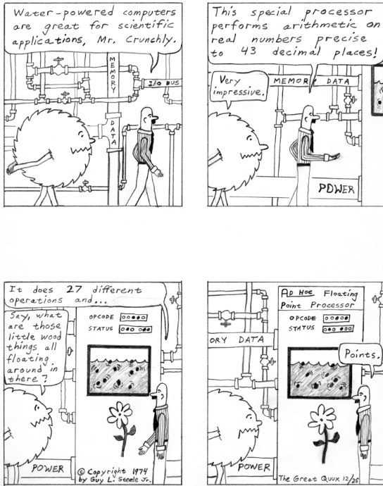

nadger

`Prev <N.html>`__ 

N

 `Next <nagware.html>`__

--------------

**nadger**: /nad´jr/, v.

[UK, from rude slang noun nadgers for testicles; compare American &
British bollixed] Of software or hardware (not people), to twiddle some
object in a hidden manner, generally so that it conforms better to some
format. For instance, string printing routines on 8-bit processors often
take the string text from the instruction stream, thus a print call
looks like **jsr print:"Hello world"**. The print routine has to nadger
the saved instruction pointer so that the processor doesn't try to
execute the text as instructions when the subroutine returns. See
`adger <../A/adger.html>`__.

--------------

+----------------------+----------------------------+----------------------------+
| `Prev <N.html>`__    | `Up <../N.html>`__         |  `Next <nagware.html>`__   |
+----------------------+----------------------------+----------------------------+
| N                    | `Home <../index.html>`__   |  nagware                   |
+----------------------+----------------------------+----------------------------+

nagware

`Prev <nadger.html>`__ 

N

 `Next <nailed-to-the-wall.html>`__

--------------

**nagware**: /nag´weir/, n.

[Usenet] The variety of `shareware <../S/shareware.html>`__ that
displays a large screen at the beginning or end reminding you to
register, typically requiring some sort of keystroke to continue so that
you can't use the software in batch mode. Compare
`annoyware <../A/annoyware.html>`__,
`crippleware <../C/crippleware.html>`__.

--------------

+---------------------------+----------------------------+---------------------------------------+
| `Prev <nadger.html>`__    | `Up <../N.html>`__         |  `Next <nailed-to-the-wall.html>`__   |
+---------------------------+----------------------------+---------------------------------------+
| nadger                    | `Home <../index.html>`__   |  nailed to the wall                   |
+---------------------------+----------------------------+---------------------------------------+

nailed to the wall

`Prev <nagware.html>`__ 

N

 `Next <nailing-jelly.html>`__

--------------

**nailed to the wall**: adj.

[like a trophy] Said of a bug finally eliminated after protracted, and
even heroic, effort.

--------------

+----------------------------+----------------------------+----------------------------------+
| `Prev <nagware.html>`__    | `Up <../N.html>`__         |  `Next <nailing-jelly.html>`__   |
+----------------------------+----------------------------+----------------------------------+
| nagware                    | `Home <../index.html>`__   |  nailing jelly                   |
+----------------------------+----------------------------+----------------------------------+

nailing jelly

`Prev <nailed-to-the-wall.html>`__ 

N

 `Next <naive.html>`__

--------------

**nailing jelly**: vi.

See `like nailing jelly to a
tree <../L/like-nailing-jelly-to-a-tree.html>`__.

--------------

+---------------------------------------+----------------------------+--------------------------+
| `Prev <nailed-to-the-wall.html>`__    | `Up <../N.html>`__         |  `Next <naive.html>`__   |
+---------------------------------------+----------------------------+--------------------------+
| nailed to the wall                    | `Home <../index.html>`__   |  naive                   |
+---------------------------------------+----------------------------+--------------------------+

naive

`Prev <nailing-jelly.html>`__ 

N

 `Next <naive-user.html>`__

--------------

**naive**: adj.

1. Untutored in the perversities of some particular program or system;
one who still tries to do things in an intuitive way, rather than the
right way (in really good designs these coincide, but most designs
aren't ‘really good’ in the appropriate sense). This trait is completely
unrelated to general maturity or competence, or even competence at any
other specific program. It is a sad commentary on the primitive state of
computing that the natural opposite of this term is often claimed to be
experienced user but is really more like cynical user.

2. Said of an algorithm that doesn't take advantage of some superior but
advanced technique, e.g., the `bubble sort <../B/bubble-sort.html>`__.
It may imply naivete on the part of the programmer, although there are
situations where a naive algorithm is preferred, because it is more
important to keep the code comprehensible than to go for maximum
performance. “I know the linear search is naive, but in this case the
list typically only has half a dozen items.” Compare `brute
force <../B/brute-force.html>`__.

--------------

+----------------------------------+----------------------------+-------------------------------+
| `Prev <nailing-jelly.html>`__    | `Up <../N.html>`__         |  `Next <naive-user.html>`__   |
+----------------------------------+----------------------------+-------------------------------+
| nailing jelly                    | `Home <../index.html>`__   |  naive user                   |
+----------------------------------+----------------------------+-------------------------------+

naive user

`Prev <naive.html>`__ 

N

 `Next <NAK.html>`__

--------------

**naive user**: n.

A `luser <../L/luser.html>`__. Tends to imply someone who is ignorant
mainly owing to inexperience. When this is applied to someone who *has*
experience, there is a definite implication of stupidity.

--------------

+--------------------------+----------------------------+------------------------+
| `Prev <naive.html>`__    | `Up <../N.html>`__         |  `Next <NAK.html>`__   |
+--------------------------+----------------------------+------------------------+
| naive                    | `Home <../index.html>`__   |  NAK                   |
+--------------------------+----------------------------+------------------------+

NAK

`Prev <naive-user.html>`__ 

N

 `Next <NANA.html>`__

--------------

**NAK**: /nak/, interj.

[from the ASCII mnemonic for 0010101]

1. On-line joke answer to `ACK <../A/ACK.html>`__?: “I'm not here.”

2. On-line answer to a request for chat: “I'm not available.”

3. Used to politely interrupt someone to tell them you don't understand
their point or that they have suddenly stopped making sense. See
`ACK <../A/ACK.html>`__, sense

3. “And then, after we recode the project in COBOL....” “Nak, Nak, Nak!
I thought I heard you say COBOL!”

4. A negative answer. “OK if I boot the server?” “NAK!”

--------------

+-------------------------------+----------------------------+-------------------------+
| `Prev <naive-user.html>`__    | `Up <../N.html>`__         |  `Next <NANA.html>`__   |
+-------------------------------+----------------------------+-------------------------+
| naive user                    | `Home <../index.html>`__   |  NANA                   |
+-------------------------------+----------------------------+-------------------------+

NANA

`Prev <NAK.html>`__ 

N

 `Next <nano.html>`__

--------------

**NANA**: //

[Usenet] The newsgroups news.admin.net-abuse.\*, devoted to fighting
`spam <../S/spam.html>`__ and network abuse. Each individual newsgroup
is often referred to by adding a letter to NANA. For example, NANAU
would refer to "news.admin.net-abuse.usenet".

When spam began to be a serious problem around 1995, and a loose network
of anti-spammers formed to combat it, spammers immediately accused them
of being the `backbone cabal <../B/backbone-cabal.html>`__, or the
Cabal reborn. Though this was not true, spam-fighters ironically
accepted the label and the tag line “There is No Cabal” reappeared
(later, and now commonly, abbreviated to “TINC”). Nowadays “the Cabal”
is generally understood to refer to the NANA regulars.

--------------

+------------------------+----------------------------+-------------------------+
| `Prev <NAK.html>`__    | `Up <../N.html>`__         |  `Next <nano.html>`__   |
+------------------------+----------------------------+-------------------------+
| NAK                    | `Home <../index.html>`__   |  nano                   |
+------------------------+----------------------------+-------------------------+

nanoacre

`Prev <nano-.html>`__ 

N

 `Next <nanobot.html>`__

--------------

**nanoacre**: /nan´oh·ay\`kr/, n.

A unit (about 2 mm square) of real estate on a VLSI chip. The term gets
its giggle value from the fact that VLSI nanoacres have costs in the
same range as real acres once one figures in design and
fabrication-setup costs.

--------------

+--------------------------+----------------------------+----------------------------+
| `Prev <nano-.html>`__    | `Up <../N.html>`__         |  `Next <nanobot.html>`__   |
+--------------------------+----------------------------+----------------------------+
| nano-                    | `Home <../index.html>`__   |  nanobot                   |
+--------------------------+----------------------------+----------------------------+

nanobot

`Prev <nanoacre.html>`__ 

N

 `Next <nanocomputer.html>`__

--------------

**nanobot**: /nan´oh·bot/, n.

A robot of microscopic proportions, presumably built by means of
`nanotechnology <nanotechnology.html>`__. As yet, only used informally
(and speculatively!). Also called a nanoagent.

--------------

+-----------------------------+----------------------------+---------------------------------+
| `Prev <nanoacre.html>`__    | `Up <../N.html>`__         |  `Next <nanocomputer.html>`__   |
+-----------------------------+----------------------------+---------------------------------+
| nanoacre                    | `Home <../index.html>`__   |  nanocomputer                   |
+-----------------------------+----------------------------+---------------------------------+

nanocomputer

`Prev <nanobot.html>`__ 

N

 `Next <nanofortnight.html>`__

--------------

**nanocomputer**: /nan´oh·k@m·pyoo´tr/, n.

A computer with mo­lec­u­lar-sized switching elements. Designs for
mechanical nanocomputers which use single-molecule sliding rods for
their logic have been proposed. The controller for a
`nanobot <nanobot.html>`__ would be a nanocomputer.

--------------

+----------------------------+----------------------------+----------------------------------+
| `Prev <nanobot.html>`__    | `Up <../N.html>`__         |  `Next <nanofortnight.html>`__   |
+----------------------------+----------------------------+----------------------------------+
| nanobot                    | `Home <../index.html>`__   |  nanofortnight                   |
+----------------------------+----------------------------+----------------------------------+

nanofortnight

`Prev <nanocomputer.html>`__ 

N

 `Next <nanotechnology.html>`__

--------------

**nanofortnight**: n.

[Adelaide University] 1 fortnight "×    10-9", or about 1.2 msec. This
unit was used largely by students doing undergraduate practicals. See
`microfortnight <../M/microfortnight.html>`__,
`attoparsec <../A/attoparsec.html>`__, and
`micro- <../M/micro-.html>`__.

--------------

+---------------------------------+----------------------------+-----------------------------------+
| `Prev <nanocomputer.html>`__    | `Up <../N.html>`__         |  `Next <nanotechnology.html>`__   |
+---------------------------------+----------------------------+-----------------------------------+
| nanocomputer                    | `Home <../index.html>`__   |  nanotechnology                   |
+---------------------------------+----------------------------+-----------------------------------+

nano-

`Prev <nano.html>`__ 

N

 `Next <nanoacre.html>`__

--------------

**nano-**: pref.

[SI: the next quantifier below `micro- <../M/micro-.html>`__; meaning
"×    10-9"] Smaller than `micro- <../M/micro-.html>`__, and used in
the same rather loose and connotative way. Thus, one has
`nanotechnology <nanotechnology.html>`__ (coined by hacker K. Eric
Drexler) by analogy with microtechnology; and a few machine
architectures have a nanocode level below microcode. Tom Duff at Bell
Labs has also pointed out that “Pi seconds is a nanocentury”. See also
`quantifiers <../Q/quantifiers.html>`__,
`pico- <../P/pico-.html>`__, `nanoacre <nanoacre.html>`__,
`nanobot <nanobot.html>`__, `nanocomputer <nanocomputer.html>`__,
`nanofortnight <nanofortnight.html>`__.

--------------

+-------------------------+----------------------------+-----------------------------+
| `Prev <nano.html>`__    | `Up <../N.html>`__         |  `Next <nanoacre.html>`__   |
+-------------------------+----------------------------+-----------------------------+
| nano                    | `Home <../index.html>`__   |  nanoacre                   |
+-------------------------+----------------------------+-----------------------------+

nano

`Prev <NANA.html>`__ 

N

 `Next <nano-.html>`__

--------------

**nano**: /nan´oh/, n.

[CMU: from nanosecond] A brief period of time. “Be with you in a nano”
means you really will be free shortly, i.e., implies what mainstream
people mean by “in a jiffy” (whereas the hackish use of ‘jiffy’ is quite
different — see `jiffy <../J/jiffy.html>`__).

--------------

+-------------------------+----------------------------+--------------------------+
| `Prev <NANA.html>`__    | `Up <../N.html>`__         |  `Next <nano-.html>`__   |
+-------------------------+----------------------------+--------------------------+
| NANA                    | `Home <../index.html>`__   |  nano-                   |
+-------------------------+----------------------------+--------------------------+

nanotechnology

`Prev <nanofortnight.html>`__ 

N

 `Next <narg.html>`__

--------------

**nanotechnology**: /nan'·oh·tek·no\`l@·jee/, n.

A hypothetical fabrication technology in which objects are designed and
built with the individual specification and placement of each separate
atom. The first unequivocal nanofabrication experiments took place in
1990, for example with the deposition of individual xenon atoms on a
nickel substrate to spell the logo of a certain very large computer
company. Nanotechnology has been a hot topic in the hacker subculture
ever since the term was coined by K. Eric Drexler in his book *Engines
of Creation* (Anchor/Doubleday, ISBN 0-385-19973-2), where he predicted
that nanotechnology could give rise to replicating assemblers,
permitting an exponential growth of productivity and personal wealth
(there's an authorized transcription at
`http://www.foresight.org/EOC/index.html <http://www.foresight.org/EOC/index.html>`__).
See also `blue goo <../B/blue-goo.html>`__, `gray
goo <../G/gray-goo.html>`__, `nanobot <nanobot.html>`__.

--------------

+----------------------------------+----------------------------+-------------------------+
| `Prev <nanofortnight.html>`__    | `Up <../N.html>`__         |  `Next <narg.html>`__   |
+----------------------------------+----------------------------+-------------------------+
| nanofortnight                    | `Home <../index.html>`__   |  narg                   |
+----------------------------------+----------------------------+-------------------------+

narg

`Prev <nanotechnology.html>`__ 

N

 `Next <nasal-demons.html>`__

--------------

**narg**

[Cambridge] Short for “Not A Real Gentleman”, i.e. one who excessively
talks shop out of hours.

--------------

+-----------------------------------+----------------------------+---------------------------------+
| `Prev <nanotechnology.html>`__    | `Up <../N.html>`__         |  `Next <nasal-demons.html>`__   |
+-----------------------------------+----------------------------+---------------------------------+
| nanotechnology                    | `Home <../index.html>`__   |  nasal demons                   |
+-----------------------------------+----------------------------+---------------------------------+

nasal demons

`Prev <narg.html>`__ 

N

 `Next <nastygram.html>`__

--------------

**nasal demons**: n.

Recognized shorthand on the Usenet group "comp.std.c" for any
unexpected behavior of a C compiler on encountering an undefined
construct. During a discussion on that group in early 1992, a regular
remarked “When the compiler encounters [a given undefined construct] it
is legal for it to make demons fly out of your nose” (the implication is
that the compiler may choose any arbitrarily bizarre way to interpret
the code without violating the ANSI C standard). Someone else followed
up with a reference to “nasal demons”, which quickly became established.
The original post is web-accessible at
`http://groups.google.com/groups?hl=en&selm=10195%40ksr.com <http://groups.google.com/groups?hl=en&selm=10195%40ksr.com>`__.

--------------

+-------------------------+----------------------------+------------------------------+
| `Prev <narg.html>`__    | `Up <../N.html>`__         |  `Next <nastygram.html>`__   |
+-------------------------+----------------------------+------------------------------+
| narg                    | `Home <../index.html>`__   |  nastygram                   |
+-------------------------+----------------------------+------------------------------+

nastygram

`Prev <nasal-demons.html>`__ 

N

 `Next <Nathan-Hale.html>`__

--------------

**nastygram**: /nas´tee·gram/, n.

1. A protocol packet or item of email (the latter is also called a
`letterbomb <../L/letterbomb.html>`__) that takes advantage of
misfeatures or security holes on the target system to do untoward
things.

2. Disapproving mail, esp. from a `net.god <net-god.html>`__, pursuant
to a violation of `netiquette <netiquette.html>`__ or a complaint
about failure to correct some mail- or news-transmission problem.
Compare `shitogram <../S/shitogram.html>`__,
`mailbomb <../M/mailbomb.html>`__.

3. A status report from an unhappy, and probably picky, customer.
“What'd Corporate say in today's nastygram?”

4. [deprecated] An error reply by mail from a
`daemon <../D/daemon.html>`__; in particular, a `bounce
message <../B/bounce-message.html>`__.

--------------

+---------------------------------+----------------------------+--------------------------------+
| `Prev <nasal-demons.html>`__    | `Up <../N.html>`__         |  `Next <Nathan-Hale.html>`__   |
+---------------------------------+----------------------------+--------------------------------+
| nasal demons                    | `Home <../index.html>`__   |  Nathan Hale                   |
+---------------------------------+----------------------------+--------------------------------+

Nathan Hale

`Prev <nastygram.html>`__ 

N

 `Next <nature.html>`__

--------------

**Nathan Hale**: n.

An asterisk (see also `splat <../S/splat.html>`__,
`ASCII <../A/ASCII.html>`__). Oh, you want an etymology? Notionally,
from “I regret that I have only one asterisk for my country!”, a
misquote of the famous remark uttered by Nathan Hale just before he was
hanged. Hale was a (failed) spy for the rebels in the American War of
Independence.

--------------

+------------------------------+----------------------------+---------------------------+
| `Prev <nastygram.html>`__    | `Up <../N.html>`__         |  `Next <nature.html>`__   |
+------------------------------+----------------------------+---------------------------+
| nastygram                    | `Home <../index.html>`__   |  nature                   |
+------------------------------+----------------------------+---------------------------+

nature

`Prev <Nathan-Hale.html>`__ 

N

 `Next <neat-hack.html>`__

--------------

**nature**: n.

See `has the X nature <../H/has-the-X-nature.html>`__.

--------------

+--------------------------------+----------------------------+------------------------------+
| `Prev <Nathan-Hale.html>`__    | `Up <../N.html>`__         |  `Next <neat-hack.html>`__   |
+--------------------------------+----------------------------+------------------------------+
| Nathan Hale                    | `Home <../index.html>`__   |  neat hack                   |
+--------------------------------+----------------------------+------------------------------+

neat hack

`Prev <nature.html>`__ 

N

 `Next <neats-vs--scruffies.html>`__

--------------

**neat hack**: n.

[very common]

1. A clever technique.

2. A brilliant practical joke, where neatness is correlated with
cleverness, harmlessness, and surprise value. Example: the Caltech Rose
Bowl card display switch (see `Appendix A <../appendixa.html>`__ for
discussion). See also `hack <../H/hack.html>`__.

--------------

+---------------------------+----------------------------+----------------------------------------+
| `Prev <nature.html>`__    | `Up <../N.html>`__         |  `Next <neats-vs--scruffies.html>`__   |
+---------------------------+----------------------------+----------------------------------------+
| nature                    | `Home <../index.html>`__   |  neats vs. scruffies                   |
+---------------------------+----------------------------+----------------------------------------+

neats vs. scruffies

`Prev <neat-hack.html>`__ 

N

 `Next <neep-neep.html>`__

--------------

**neats vs. scruffies**: n.

The label used to refer to one of the continuing `holy
wars <../H/holy-wars.html>`__ in AI research. This conflict tangles
together two separate issues. One is the relationship between human
reasoning and AI; ‘neats’ tend to try to build systems that ‘reason’ in
some way identifiably similar to the way humans report themselves as
doing, while ‘scruffies’ profess not to care whether an algorithm
resembles human reasoning in the least as long as it works. More
importantly, neats tend to believe that logic is king, while scruffies
favor looser, more ad-hoc methods driven by empirical knowledge. To a
neat, scruffy methods appear promiscuous, successful only by accident,
and not productive of insights about how intelligence actually works; to
a scruffy, neat methods appear to be hung up on formalism and irrelevant
to the hard-to-capture ‘common sense’ of living intelligences.

--------------

+------------------------------+----------------------------+------------------------------+
| `Prev <neat-hack.html>`__    | `Up <../N.html>`__         |  `Next <neep-neep.html>`__   |
+------------------------------+----------------------------+------------------------------+
| neat hack                    | `Home <../index.html>`__   |  neep-neep                   |
+------------------------------+----------------------------+------------------------------+

neep-neep

`Prev <neats-vs--scruffies.html>`__ 

N

 `Next <neophilia.html>`__

--------------

**neep-neep**: /neep neep/, n.

[onomatopoeic, widely spread through SF fandom but reported to have
originated at Caltech in the 1970s] One who is fascinated by computers.
Less specific than `hacker <../H/hacker.html>`__, as it need not imply
more skill than is required to play games on a PC. The derived noun
neeping applies specifically to the long conversations about computers
that tend to develop in the corners at most SF-convention parties (the
term neepery is also in wide use). Fandom has a related proverb to the
effect that “Hacking is a conversational black hole!”.

--------------

+----------------------------------------+----------------------------+------------------------------+
| `Prev <neats-vs--scruffies.html>`__    | `Up <../N.html>`__         |  `Next <neophilia.html>`__   |
+----------------------------------------+----------------------------+------------------------------+
| neats vs. scruffies                    | `Home <../index.html>`__   |  neophilia                   |
+----------------------------------------+----------------------------+------------------------------+

neophilia

`Prev <neep-neep.html>`__ 

N

 `Next <nerd.html>`__

--------------

**neophilia**: /nee\`oh·fil'·ee·@/, n.

The trait of being excited and pleased by novelty. Common among most
hackers, SF fans, and members of several other connected leading-edge
subcultures, including the pro-technology ‘Whole Earth’ wing of the
ecology movement, space activists, many members of Mensa, and the
Discordian/neo-pagan underground (see `geek <../G/geek.html>`__). All
these groups overlap heavily and (where evidence is available) seem to
share characteristic hacker tropisms for science fiction,
`music <../M/music.html>`__, and `oriental
food <../O/oriental-food.html>`__. The opposite tendency is neophobia.

--------------

+------------------------------+----------------------------+-------------------------+
| `Prev <neep-neep.html>`__    | `Up <../N.html>`__         |  `Next <nerd.html>`__   |
+------------------------------+----------------------------+-------------------------+
| neep-neep                    | `Home <../index.html>`__   |  nerd                   |
+------------------------------+----------------------------+-------------------------+

nerd

`Prev <neophilia.html>`__ 

N

 `Next <nerd-knob.html>`__

--------------

**nerd**: n.

1. [mainstream slang] Pejorative applied to anyone with an above-average
IQ and few gifts at small talk and ordinary social rituals.

2. [jargon] Term of praise applied (in conscious ironic reference to
sense 1) to someone who knows what's really important and interesting
and doesn't care to be distracted by trivial chatter and silly status
games. Compare `geek <../G/geek.html>`__.

The word itself appears to derive from the lines “And then, just to show
them, I'll sail to Ka-Troo / And Bring Back an It-Kutch, a Preep and a
Proo, / A Nerkle, a Nerd, and a Seersucker, too!” in the Dr. Seuss book
*If I Ran the Zoo* (1950). (The spellings ‘nurd’ and ‘gnurd’ also used
to be current at MIT, where ‘nurd’ is reported from as far back as 1957;
however, `knurd <../K/knurd.html>`__ appears to have a separate
etymology.) How it developed its mainstream meaning is unclear, but
sense 1 seems to have entered mass culture in the early 1970s (there are
reports that in the mid-1960s it meant roughly “annoying misfit” without
the connotation of intelligence.

Hackers developed sense 2 in self-defense perhaps ten years later, and
some actually wear “Nerd Pride” buttons, only half as a joke. At MIT one
can find not only buttons but (what else?) pocket protectors bearing the
slogan and the MIT seal.

--------------

+------------------------------+----------------------------+------------------------------+
| `Prev <neophilia.html>`__    | `Up <../N.html>`__         |  `Next <nerd-knob.html>`__   |
+------------------------------+----------------------------+------------------------------+
| neophilia                    | `Home <../index.html>`__   |  nerd knob                   |
+------------------------------+----------------------------+------------------------------+

nerd knob

`Prev <nerd.html>`__ 

N

 `Next <net--.html>`__

--------------

**nerd knob**: n.

[Cisco] A command in a complex piece of software which is more likely to
be used by an extremely experienced user to tweak a setting of one sort
or another - a setting which the average user may not even know exists.
Nerd knobs tend to be toggles, turning on or off a particular, specific,
narrowly defined behavior. Special case of
`knobs <../K/knobs.html>`__.

--------------

+-------------------------+----------------------------+--------------------------+
| `Prev <nerd.html>`__    | `Up <../N.html>`__         |  `Next <net--.html>`__   |
+-------------------------+----------------------------+--------------------------+
| nerd                    | `Home <../index.html>`__   |  net.-                   |
+-------------------------+----------------------------+--------------------------+

netburp

`Prev <net-police.html>`__ 

N

 `Next <netdead.html>`__

--------------

**netburp**: n.

[IRC] When `netlag <netlag.html>`__ gets really bad, and delays
between servers exceed a certain threshold, the
`IRC <../I/IRC.html>`__ network effectively becomes partitioned for a
period of time, and large numbers of people seem to be signing off at
the same time and then signing back on again when things get better. An
instance of this is called a netburp (or, sometimes,
`netsplit <netsplit.html>`__).

--------------

+-------------------------------+----------------------------+----------------------------+
| `Prev <net-police.html>`__    | `Up <../N.html>`__         |  `Next <netdead.html>`__   |
+-------------------------------+----------------------------+----------------------------+
| net.police                    | `Home <../index.html>`__   |  netdead                   |
+-------------------------------+----------------------------+----------------------------+

netdead

`Prev <netburp.html>`__ 

N

 `Next <nethack.html>`__

--------------

**netdead**: n.

[IRC] The state of someone who signs off `IRC <../I/IRC.html>`__,
perhaps during a `netburp <netburp.html>`__, and doesn't sign back on
until later. In the interim, he is “dead to the net”. Compare
`link-dead <../L/link-dead.html>`__.

--------------

+----------------------------+----------------------------+----------------------------+
| `Prev <netburp.html>`__    | `Up <../N.html>`__         |  `Next <nethack.html>`__   |
+----------------------------+----------------------------+----------------------------+
| netburp                    | `Home <../index.html>`__   |  nethack                   |
+----------------------------+----------------------------+----------------------------+

net.god

`Prev <net--.html>`__ 

N

 `Next <net-personality.html>`__

--------------

**net.god**: /net god/, n.

Accolade referring to anyone who satisfies some combination of the
following conditions: has been visible on Usenet for more than 5 years,
ran one of the original backbone sites, moderated an important
newsgroup, wrote news software, or knows Gene, Mark, Rick, Mel, Henry,
Chuq, and Greg personally. See `demigod <../D/demigod.html>`__.
Net.goddesses such as Rissa or the Slime Sisters have (so far) been
distinguished more by personality than by authority.

--------------

+--------------------------+----------------------------+------------------------------------+
| `Prev <net--.html>`__    | `Up <../N.html>`__         |  `Next <net-personality.html>`__   |
+--------------------------+----------------------------+------------------------------------+
| net.-                    | `Home <../index.html>`__   |  net.personality                   |
+--------------------------+----------------------------+------------------------------------+

nethack

`Prev <netdead.html>`__ 

N

 `Next <netiquette.html>`__

--------------

**nethack**: /net´hak/, n.

[Unix] A dungeon game similar to `rogue <../R/rogue.html>`__ but more
elaborate, distributed in C source over `Usenet <../U/Usenet.html>`__
and very popular at Unix sites and on PC-class machines (nethack is
probably the most widely distributed of the freeware dungeon games). The
earliest versions, written by Jay Fenlason and later considerably
enhanced by Andries Brouwer, were simply called ‘hack’. The name changed
when maintenance was taken over by a group of hackers originally
organized by Mike Stephenson. There is now an official site at
`http://www.nethack.org/ <http://www.nethack.org/>`__. See also
`moria <../M/moria.html>`__, `rogue <../R/rogue.html>`__,
`Angband <../A/Angband.html>`__.

--------------

+----------------------------+----------------------------+-------------------------------+
| `Prev <netdead.html>`__    | `Up <../N.html>`__         |  `Next <netiquette.html>`__   |
+----------------------------+----------------------------+-------------------------------+
| netdead                    | `Home <../index.html>`__   |  netiquette                   |
+----------------------------+----------------------------+-------------------------------+

net.-

`Prev <nerd-knob.html>`__ 

N

 `Next <net-god.html>`__

--------------

**net.-**: /net dot/, pref.

[Usenet] Prefix used to describe people and events related to Usenet.
From the time before the `Great
Renaming <../G/Great-Renaming.html>`__, when most non-local newsgroups
had names beginning “net.”. Includes `net.god <net-god.html>`__\ s,
net.goddesses (various charismatic net.women with circles of on-line
admirers), net.lurkers (see `lurker <../L/lurker.html>`__),
net.person, net.parties (a synonym for `boink <../B/boink.html>`__,
sense 2), and many similar constructs. See also
`net.police <net-police.html>`__.

--------------

+------------------------------+----------------------------+----------------------------+
| `Prev <nerd-knob.html>`__    | `Up <../N.html>`__         |  `Next <net-god.html>`__   |
+------------------------------+----------------------------+----------------------------+
| nerd knob                    | `Home <../index.html>`__   |  net.god                   |
+------------------------------+----------------------------+----------------------------+

netiquette

`Prev <nethack.html>`__ 

N

 `Next <netlag.html>`__

--------------

**netiquette**: /net´ee·ket/, /net´i·ket/, n.

[Coined by Chuq von Rospach c.1983] [portmanteau, network + etiquette]
The conventions of politeness recognized on
`Usenet <../U/Usenet.html>`__, such as avoidance of cross-posting to
inappropriate groups and refraining from commercial pluggery outside the
"biz" groups.

--------------

+----------------------------+----------------------------+---------------------------+
| `Prev <nethack.html>`__    | `Up <../N.html>`__         |  `Next <netlag.html>`__   |
+----------------------------+----------------------------+---------------------------+
| nethack                    | `Home <../index.html>`__   |  netlag                   |
+----------------------------+----------------------------+---------------------------+

netlag

`Prev <netiquette.html>`__ 

N

 `Next <netnews.html>`__

--------------

**netlag**: n.

[IRC, MUD] A condition that occurs when the delays in the
`IRC <../I/IRC.html>`__ network or on a `MUD <../M/MUD.html>`__
become severe enough that servers briefly lose and then reestablish
contact, causing messages to be delivered in bursts, often with delays
of up to a minute. (Note that this term has nothing to do with
mainstream “jet lag”, a condition which hackers tend not to be much
bothered by.) Often shortened to just ‘lag’.

--------------

+-------------------------------+----------------------------+----------------------------+
| `Prev <netiquette.html>`__    | `Up <../N.html>`__         |  `Next <netnews.html>`__   |
+-------------------------------+----------------------------+----------------------------+
| netiquette                    | `Home <../index.html>`__   |  netnews                   |
+-------------------------------+----------------------------+----------------------------+

netnews

`Prev <netlag.html>`__ 

N

 `Next <Netscrape.html>`__

--------------

**netnews**: /net´n[y]ooz/, n.

1. The software that makes `Usenet <../U/Usenet.html>`__ run.

2. The content of Usenet. “I read netnews right after my mail most
mornings.”

--------------

+---------------------------+----------------------------+------------------------------+
| `Prev <netlag.html>`__    | `Up <../N.html>`__         |  `Next <Netscrape.html>`__   |
+---------------------------+----------------------------+------------------------------+
| netlag                    | `Home <../index.html>`__   |  Netscrape                   |
+---------------------------+----------------------------+------------------------------+

net.personality

`Prev <net-god.html>`__ 

N

 `Next <net-police.html>`__

--------------

**net.personality**: /net per\`sn·al'·@·tee/, n.

Someone who has made a name for him or herself on
`Usenet <../U/Usenet.html>`__, through either longevity or
attention-getting posts, but doesn't meet the other requirements of
`net.god <net-god.html>`__\ hood.

--------------

+----------------------------+----------------------------+-------------------------------+
| `Prev <net-god.html>`__    | `Up <../N.html>`__         |  `Next <net-police.html>`__   |
+----------------------------+----------------------------+-------------------------------+
| net.god                    | `Home <../index.html>`__   |  net.police                   |
+----------------------------+----------------------------+-------------------------------+

net.police

`Prev <net-personality.html>`__ 

N

 `Next <netburp.html>`__

--------------

**net.police**: /net·p@·lees'/, n.

(var.: net.cops) Those Usenet readers who feel it is their
responsibility to pounce on and `flame <../F/flame.html>`__ any
posting which they regard as offensive or in violation of their
understanding of `netiquette <netiquette.html>`__. Generally used
sarcastically or pejoratively. Also spelled ‘net police’. See also
`net.- <net--.html>`__, `code police <../C/code-police.html>`__.

--------------

+------------------------------------+----------------------------+----------------------------+
| `Prev <net-personality.html>`__    | `Up <../N.html>`__         |  `Next <netburp.html>`__   |
+------------------------------------+----------------------------+----------------------------+
| net.personality                    | `Home <../index.html>`__   |  netburp                   |
+------------------------------------+----------------------------+----------------------------+

Netscrape

`Prev <netnews.html>`__ 

N

 `Next <netsplit.html>`__

--------------

**Netscrape**: n.

[sometimes elaborated to Netscrape Fornicator, also Nutscrape] Standard
name-of-insult for Netscape Navigator/Communicator, Netscape's
overweight Web browser. Compare `Internet
Exploiter <../I/Internet-Exploiter.html>`__.

--------------

+----------------------------+----------------------------+-----------------------------+
| `Prev <netnews.html>`__    | `Up <../N.html>`__         |  `Next <netsplit.html>`__   |
+----------------------------+----------------------------+-----------------------------+
| netnews                    | `Home <../index.html>`__   |  netsplit                   |
+----------------------------+----------------------------+-----------------------------+

netsplit

`Prev <Netscrape.html>`__ 

N

 `Next <netter.html>`__

--------------

**netsplit**: n.

Syn. `netburp <netburp.html>`__.

--------------

+------------------------------+----------------------------+---------------------------+
| `Prev <Netscrape.html>`__    | `Up <../N.html>`__         |  `Next <netter.html>`__   |
+------------------------------+----------------------------+---------------------------+
| Netscrape                    | `Home <../index.html>`__   |  netter                   |
+------------------------------+----------------------------+---------------------------+

netter

`Prev <netsplit.html>`__ 

N

 `Next <network-address.html>`__

--------------

**netter**: n.

1. Loosely, anyone with a `network address <network-address.html>`__.

2. More specifically, a `Usenet <../U/Usenet.html>`__ regular. Most
often found in the plural. “If you post *that* in a technical group,
you're going to be flamed by angry netters for the rest of time!”

--------------

+-----------------------------+----------------------------+------------------------------------+
| `Prev <netsplit.html>`__    | `Up <../N.html>`__         |  `Next <network-address.html>`__   |
+-----------------------------+----------------------------+------------------------------------+
| netsplit                    | `Home <../index.html>`__   |  network address                   |
+-----------------------------+----------------------------+------------------------------------+

network address

`Prev <netter.html>`__ 

N

 `Next <network-meltdown.html>`__

--------------

**network address**: n.

(also net address) As used by hackers, means an address on ‘the’ network
(see `the network <../T/the-network.html>`__; this used to include
`bang path <../B/bang-path.html>`__ addresses but now always implies
an Internet address). Net addresses are often used in email text as a
more concise substitute for personal names; indeed, hackers may come to
know each other quite well by network names without ever learning each
others' ‘legal’ monikers. Display of a network address (e.g. on business
cards) used to function as an important hacker identification signal,
like lodge pins among Masons or tie-dyed T-shirts among Grateful Dead
fans. In the day of pervasive Internet this is less true, but you can
still be fairly sure that anyone with a network address handwritten on
his or her convention badge is a hacker.

--------------

+---------------------------+----------------------------+-------------------------------------+
| `Prev <netter.html>`__    | `Up <../N.html>`__         |  `Next <network-meltdown.html>`__   |
+---------------------------+----------------------------+-------------------------------------+
| netter                    | `Home <../index.html>`__   |  network meltdown                   |
+---------------------------+----------------------------+-------------------------------------+

network meltdown

`Prev <network-address.html>`__ 

N

 `Next <New-Jersey.html>`__

--------------

**network meltdown**: n.

A state of complete network overload; the network equivalent of
`thrash <../T/thrash.html>`__\ ing. This may be induced by a
`Chernobyl packet <../C/Chernobyl-packet.html>`__. See also
`broadcast storm <../B/broadcast-storm.html>`__, `kamikaze
packet <../K/kamikaze-packet.html>`__.

Network meltdown is often a result of network designs that are optimized
for a steady state of moderate load and don't cope well with the very
jagged, bursty usage patterns of the real world. One amusing instance of
this is triggered by the popular and very bloody shoot-'em-up game
*Doom* on the PC. When used in multiplayer mode over a network, the game
uses broadcast packets to inform other machines when bullets are fired.
This causes problems with weapons like the chain gun which fire rapidly
— it can blast the network into a meltdown state just as easily as it
shreds opposing monsters.

--------------

+------------------------------------+----------------------------+-------------------------------+
| `Prev <network-address.html>`__    | `Up <../N.html>`__         |  `Next <New-Jersey.html>`__   |
+------------------------------------+----------------------------+-------------------------------+
| network address                    | `Home <../index.html>`__   |  New Jersey                   |
+------------------------------------+----------------------------+-------------------------------+

newbie

`Prev <New-Testament.html>`__ 

N

 `Next <newgroup-wars.html>`__

--------------

**newbie**: /n[y]oo´bee/, n.

[very common; orig. from British public-school and military slang
variant of ‘new boy’] A Usenet neophyte. This term surfaced in the
`newsgroup <newsgroup.html>`__ "talk.bizarre" but is now in wide use
(the combination “clueless newbie” is especially common). Criteria for
being considered a newbie vary wildly; a person can be called a newbie
in one newsgroup while remaining a respected regular in another. The
label newbie is sometimes applied as a serious insult to a person who
has been around Usenet for a long time but who carefully hides all
evidence of having a clue. See `B1FF <../B/B1FF.html>`__; see also
`gnubie <../G/gnubie.html>`__. Compare
`chainik <../C/chainik.html>`__, `luser <../L/luser.html>`__.

--------------

+----------------------------------+----------------------------+----------------------------------+
| `Prev <New-Testament.html>`__    | `Up <../N.html>`__         |  `Next <newgroup-wars.html>`__   |
+----------------------------------+----------------------------+----------------------------------+
| New Testament                    | `Home <../index.html>`__   |  newgroup wars                   |
+----------------------------------+----------------------------+----------------------------------+

newgroup wars

`Prev <newbie.html>`__ 

N

 `Next <newline.html>`__

--------------

**newgroup wars**: /n[y]oo´groop worz/, n.

[Usenet] The salvos of dueling **newgroup** and **rmgroup** messages
sometimes exchanged by persons on opposite sides of a dispute over
whether a `newsgroup <newsgroup.html>`__ should be created net-wide,
or (even more frequently) whether an obsolete one should be removed.
These usually settle out within a week or two as it becomes clear
whether the group has a natural constituency (usually, it doesn't). At
times, especially in the completely anarchic "alt" hierarchy, the
names of newsgroups themselves become a form of comment or humor; e.g.,
the group "alt.swedish.chef.bork.bork.bork" which originated as a
birthday joke for a Muppets fan, or any number of specialized abuse
groups named after particularly notorious
`flamer <../F/flamer.html>`__\ s, e.g., "alt.weemba".

--------------

+---------------------------+----------------------------+----------------------------+
| `Prev <newbie.html>`__    | `Up <../N.html>`__         |  `Next <newline.html>`__   |
+---------------------------+----------------------------+----------------------------+
| newbie                    | `Home <../index.html>`__   |  newline                   |
+---------------------------+----------------------------+----------------------------+

New Jersey

`Prev <network-meltdown.html>`__ 

N

 `Next <New-Testament.html>`__

--------------

**New Jersey**: adj.

[primarily Stanford/Silicon Valley] Brain-dam­aged or of poor design.
This refers to the allegedly wretched quality of such software as C,
C++, and Unix (which originated at Bell Labs in Murray Hill, New
Jersey). “This compiler bites the bag, but what can you expect from a
compiler designed in New Jersey?” Compare `Berkeley Quality
Software <../B/Berkeley-Quality-Software.html>`__. See also `Unix
conspiracy <../U/Unix-conspiracy.html>`__.

--------------

+-------------------------------------+----------------------------+----------------------------------+
| `Prev <network-meltdown.html>`__    | `Up <../N.html>`__         |  `Next <New-Testament.html>`__   |
+-------------------------------------+----------------------------+----------------------------------+
| network meltdown                    | `Home <../index.html>`__   |  New Testament                   |
+-------------------------------------+----------------------------+----------------------------------+

newline

`Prev <newgroup-wars.html>`__ 

N

 `Next <NeWS.html>`__

--------------

**newline**: /n[y]oo´li:n/, n.

1. [techspeak, primarily Unix] The ASCII LF character (0001010), used
under `Unix <../U/Unix.html>`__ as a text line terminator. Though the
term newline appears in ASCII standards, it never caught on in the
general computing world before Unix.

2. More generally, any magic character, character sequence, or operation
(like Pascal's writeln procedure) required to terminate a text record or
separate lines. See `crlf <../C/crlf.html>`__.

--------------

+----------------------------------+----------------------------+-------------------------+
| `Prev <newgroup-wars.html>`__    | `Up <../N.html>`__         |  `Next <NeWS.html>`__   |
+----------------------------------+----------------------------+-------------------------+
| newgroup wars                    | `Home <../index.html>`__   |  NeWS                   |
+----------------------------------+----------------------------+-------------------------+

newsfroup

`Prev <NeWS.html>`__ 

N

 `Next <newsgroup.html>`__

--------------

**newsfroup**: //, n.

[Usenet] Silly synonym for `newsgroup <newsgroup.html>`__, originally
a typo but now in regular use on Usenet's talk.bizarre, and other
lunatic-fringe groups. Compare `hing <../H/hing.html>`__,
`grilf <../G/grilf.html>`__, `pr0n <../P/pr0n.html>`__ and
`filk <../F/filk.html>`__.

--------------

+-------------------------+----------------------------+------------------------------+
| `Prev <NeWS.html>`__    | `Up <../N.html>`__         |  `Next <newsgroup.html>`__   |
+-------------------------+----------------------------+------------------------------+
| NeWS                    | `Home <../index.html>`__   |  newsgroup                   |
+-------------------------+----------------------------+------------------------------+

newsgroup

`Prev <newsfroup.html>`__ 

N

 `Next <nick.html>`__

--------------

**newsgroup**: n.

[Usenet] One of `Usenet <../U/Usenet.html>`__'s huge collection of
topic groups or `fora <../F/fora.html>`__. Usenet groups can be
unmoderated (anyone can post) or moderated (submissions are
automatically directed to a moderator, who edits or filters and then
posts the results). Some newsgroups have parallel `mailing
list <../M/mailing-list.html>`__\ s for Internet people with no netnews
access, with postings to the group automatically propagated to the list
and vice versa. Some moderated groups (especially those which are
actually gatewayed Internet mailing lists) are distributed as digests,
with groups of postings periodically collected into a single large
posting with an index.

Among the best-known are "comp.lang.c" (the C-language forum),
"comp.arch" (on computer architectures), "comp.unix.wizards" (for
Unix wizards), "rec.arts.sf.written" and siblings (for science-fiction
fans), and "talk.politics.misc" (miscellaneous political discussions
and `flamage <../F/flamage.html>`__).

--------------

+------------------------------+----------------------------+-------------------------+
| `Prev <newsfroup.html>`__    | `Up <../N.html>`__         |  `Next <nick.html>`__   |
+------------------------------+----------------------------+-------------------------+
| newsfroup                    | `Home <../index.html>`__   |  nick                   |
+------------------------------+----------------------------+-------------------------+

NeWS

`Prev <newline.html>`__ 

N

 `Next <newsfroup.html>`__

--------------

**NeWS**: /nee´wis/, /n[y]oo´is/, /n[y]ooz/, n.

[acronym; the “Network Window System”] The road not taken in window
systems, an elegant `PostScript <../P/PostScript.html>`__-based
environment that would almost certainly have won the standards war with
`X <../X/X.html>`__ if it hadn't been
`proprietary <../P/proprietary.html>`__ to Sun Microsystems. There is
a lesson here that too many software vendors haven't yet heeded. Many
hackers insist on the two-syllable pronunciations above as a way of
distinguishing NeWS from Usenet news (the `netnews <netnews.html>`__
software).

--------------

+----------------------------+----------------------------+------------------------------+
| `Prev <newline.html>`__    | `Up <../N.html>`__         |  `Next <newsfroup.html>`__   |
+----------------------------+----------------------------+------------------------------+
| newline                    | `Home <../index.html>`__   |  newsfroup                   |
+----------------------------+----------------------------+------------------------------+

New Testament

`Prev <New-Jersey.html>`__ 

N

 `Next <newbie.html>`__

--------------

**New Testament**: n.

[C programmers] The second edition of K&R's *The C Programming Language*
(Prentice-Hall, 1988; ISBN 0-13-110362-8), describing ANSI Standard C.
See `K&R <../K/K-ampersand-R.html>`__; this version is also called
‘K&R2’.

--------------

+-------------------------------+----------------------------+---------------------------+
| `Prev <New-Jersey.html>`__    | `Up <../N.html>`__         |  `Next <newbie.html>`__   |
+-------------------------------+----------------------------+---------------------------+
| New Jersey                    | `Home <../index.html>`__   |  newbie                   |
+-------------------------------+----------------------------+---------------------------+

N

`Prev <../N.html>`__ 

N

 `Next <nadger.html>`__

--------------

**N**: /N/, quant.

1. A large and indeterminate number of objects: “There were "N" bugs
in that crock!” Also used in its original sense of a variable name:
“This crock has "N" bugs, as "N" goes to infinity.” (The true number
of bugs is always at least "N + 1"; see `Lubarsky's Law of Cybernetic
Entomology <../L/Lubarskys-Law-of-Cybernetic-Entomology.html>`__.)

2. A variable whose value is inherited from the current context. For
example, when a meal is being ordered at a restaurant, "N" may be
understood to mean however many people there are at the table. From the
remark “We'd like to order "N" wonton soups and a family dinner for
"N - 1"\ ” you can deduce that one person at the table wants to eat
only soup, even though you don't know how many people there are (see
`great-wall <../G/great-wall.html>`__).

3. "Nth": adj. The ordinal counterpart of "N", senses 1 and 2.

4. “Now for the "N"\ th and last time...” In the specific context
“\ "N"\ th-year grad student”, "N" is generally assumed to be at
least 4, and is usually 5 or more (see `tenured graduate
student <../T/tenured-graduate-student.html>`__). See also `random
numbers <../R/random-numbers.html>`__,
`two-to-the-N <../T/two-to-the-N.html>`__.

--------------

+-------------------------+----------------------------+---------------------------+
| `Prev <../N.html>`__    | `Up <../N.html>`__         |  `Next <nadger.html>`__   |
+-------------------------+----------------------------+---------------------------+
| N                       | `Home <../index.html>`__   |  nadger                   |
+-------------------------+----------------------------+---------------------------+

nick

`Prev <newsgroup.html>`__ 

N

 `Next <nickle.html>`__

--------------

**nick**: n.

[IRC; very common] Short for nickname. On `IRC <../I/IRC.html>`__,
every user must pick a nick, which is sometimes the same as the user's
real name or login name, but is often more fanciful. Compare
`handle <../H/handle.html>`__, `screen
name <../S/screen-name.html>`__.

--------------

+------------------------------+----------------------------+---------------------------+
| `Prev <newsgroup.html>`__    | `Up <../N.html>`__         |  `Next <nickle.html>`__   |
+------------------------------+----------------------------+---------------------------+
| newsgroup                    | `Home <../index.html>`__   |  nickle                   |
+------------------------------+----------------------------+---------------------------+

nickle

`Prev <nick.html>`__ 

N

 `Next <night-mode.html>`__

--------------

**nickle**: /ni´kl/, n.

[from ‘nickel’, common name for the U.S. 5-cent coin] A
`nybble <nybble.html>`__ + 1; 5 bits. Reported among developers for
Mattel's GI 1600 (the Intellivision games processor), a chip with
16-bit-wide RAM but 10-bit-wide ROM. See also
`deckle <../D/deckle.html>`__, and `nybble <nybble.html>`__ for
names of other bit units.

--------------

+-------------------------+----------------------------+-------------------------------+
| `Prev <nick.html>`__    | `Up <../N.html>`__         |  `Next <night-mode.html>`__   |
+-------------------------+----------------------------+-------------------------------+
| nick                    | `Home <../index.html>`__   |  night mode                   |
+-------------------------+----------------------------+-------------------------------+

Nightmare File System

`Prev <night-mode.html>`__ 

N

 `Next <NIL.html>`__

--------------

**Nightmare File System**: n.

Pejorative hackerism for Sun's Network File System (NFS). In any
nontrivial network of Suns where there is a lot of NFS cross-mounting,
when one Sun goes down, the others often freeze up. Some machine tries
to access the down one, and (getting no response) repeats indefinitely.
This causes it to appear dead to some messages (what is actually
happening is that it is locked up in what should have been a brief
excursion to a higher `spl <../S/spl.html>`__ level). Then another
machine tries to reach either the down machine or the pseudo-down
machine, and itself becomes pseudo-down. The first machine to discover
the down one is now trying both to access the down one and to respond to
the pseudo-down one, so it is even harder to reach. This situation
snowballs very quickly, and soon the entire network of machines is
frozen — worst of all, the user can't even abort the file access that
started the problem! Many of NFS's problems are excused by partisans as
being an inevitable result of its statelessness, which is held to be a
great feature (critics, of course, call it a great
`misfeature <../M/misfeature.html>`__). (ITS partisans are apt to cite
this as proof of Unix's alleged bogosity; ITS had a working NFS-like
shared file system with none of these problems in the early 1970s.) See
also `broadcast storm <../B/broadcast-storm.html>`__.

--------------

+-------------------------------+----------------------------+------------------------+
| `Prev <night-mode.html>`__    | `Up <../N.html>`__         |  `Next <NIL.html>`__   |
+-------------------------------+----------------------------+------------------------+
| night mode                    | `Home <../index.html>`__   |  NIL                   |
+-------------------------------+----------------------------+------------------------+

night mode

`Prev <nickle.html>`__ 

N

 `Next <Nightmare-File-System.html>`__

--------------

**night mode**: n.

See `phase <../P/phase.html>`__ (of people).

--------------

+---------------------------+----------------------------+------------------------------------------+
| `Prev <nickle.html>`__    | `Up <../N.html>`__         |  `Next <Nightmare-File-System.html>`__   |
+---------------------------+----------------------------+------------------------------------------+
| nickle                    | `Home <../index.html>`__   |  Nightmare File System                   |
+---------------------------+----------------------------+------------------------------------------+

NIL

`Prev <Nightmare-File-System.html>`__ 

N

 `Next <Ninety-Ninety-Rule.html>`__

--------------

**NIL**: /nil/

No. Used in reply to a question, particularly one asked using the ‘-P’
convention. Most hackers assume this derives simply from LISP
terminology for ‘false’ (see also `T <../T/T.html>`__), but NIL as a
negative reply was well-established among radio hams decades before the
advent of LISP. The historical connection between early hackerdom and
the ham radio world was strong enough that this may have been an
influence.

--------------

+------------------------------------------+----------------------------+---------------------------------------+
| `Prev <Nightmare-File-System.html>`__    | `Up <../N.html>`__         |  `Next <Ninety-Ninety-Rule.html>`__   |
+------------------------------------------+----------------------------+---------------------------------------+
| Nightmare File System                    | `Home <../index.html>`__   |  Ninety-Ninety Rule                   |
+------------------------------------------+----------------------------+---------------------------------------+

Ninety-Ninety Rule

`Prev <NIL.html>`__ 

N

 `Next <nipple-mouse.html>`__

--------------

**Ninety-Ninety Rule**: n.

“The first 90% of the code accounts for the first 90% of the development
time. The remaining 10% of the code accounts for the other 90% of the
development time.” Attributed to Tom Cargill of Bell Labs, and
popularized by Jon Bentley's September 1985 *Bumper-Sticker Computer
Science* column in *Communications of the ACM*. It was there called the
“Rule of Credibility”, a name which seems not to have stuck. Other
maxims in the same vein include the law attributed to the early British
computer scientist Douglas Hartree: “The time from now until the
completion of the project tends to become constant.”

--------------

+------------------------+----------------------------+---------------------------------+
| `Prev <NIL.html>`__    | `Up <../N.html>`__         |  `Next <nipple-mouse.html>`__   |
+------------------------+----------------------------+---------------------------------+
| NIL                    | `Home <../index.html>`__   |  nipple mouse                   |
+------------------------+----------------------------+---------------------------------+

nipple mouse

`Prev <Ninety-Ninety-Rule.html>`__ 

N

 `Next <NMI.html>`__

--------------

**nipple mouse**: n.

Var. clit mouse, clitoris Common term for the pointing device used on
IBM ThinkPads and a few other laptop computers. The device, which sits
between the ‘g’ and ‘h’ keys on the keyboard, indeed resembles a rubber
nipple intended to be tweaked by a forefinger. Many hackers consider
these superior to the glide pads found on most laptops, which are harder
to control precisely.

--------------

+---------------------------------------+----------------------------+------------------------+
| `Prev <Ninety-Ninety-Rule.html>`__    | `Up <../N.html>`__         |  `Next <NMI.html>`__   |
+---------------------------------------+----------------------------+------------------------+
| Ninety-Ninety Rule                    | `Home <../index.html>`__   |  NMI                   |
+---------------------------------------+----------------------------+------------------------+

NMI

`Prev <nipple-mouse.html>`__ 

N

 `Next <no-op.html>`__

--------------

**NMI**: /N·M·I/, n.

Non-Maskable Interrupt. An IRQ 7 on the `PDP-11 <../P/PDP-11.html>`__
or 680[01234]0; the NMI line on an 80[1234]86. In contrast with a
`priority interrupt <../P/priority-interrupt.html>`__ (which might be
ignored, although that is unlikely), an NMI is *never* ignored. Except,
that is, on `clone <../C/clone.html>`__ boxes, where NMI is often
ignored on the motherboard because flaky hardware can generate many
spurious ones.

--------------

+---------------------------------+----------------------------+--------------------------+
| `Prev <nipple-mouse.html>`__    | `Up <../N.html>`__         |  `Next <no-op.html>`__   |
+---------------------------------+----------------------------+--------------------------+
| nipple mouse                    | `Home <../index.html>`__   |  no-op                   |
+---------------------------------+----------------------------+--------------------------+

noddy

`Prev <no-op.html>`__ 

N

 `Next <non-optimal-solution.html>`__

--------------

**noddy**: /nod´ee/, adj.

[UK: from the children's books]

1. Small and un-useful, but demonstrating a point. Noddy programs are
often written by people learning a new language or system. The
archetypal noddy program is `hello world <../H/hello-world.html>`__.
Noddy code may be used to demonstrate a feature or bug of a compiler.
May be used of real hardware or software to imply that it isn't worth
using. “This editor's a bit noddy.”

2. A program that is more or less instant to produce. In this use, the
term does not necessarily connote uselessness, but describes a
`hack <../H/hack.html>`__ sufficiently trivial that it can be written
and debugged while carrying on (and during the space of) a normal
conversation. “I'll just throw together a noddy
`awk <../A/awk.html>`__ script to dump all the first fields.” In North
America this might be called a `mickey mouse
program <../M/mickey-mouse-program.html>`__. See `toy
program <../T/toy-program.html>`__.

--------------

+--------------------------+----------------------------+-----------------------------------------+
| `Prev <no-op.html>`__    | `Up <../N.html>`__         |  `Next <non-optimal-solution.html>`__   |
+--------------------------+----------------------------+-----------------------------------------+
| no-op                    | `Home <../index.html>`__   |  non-optimal solution                   |
+--------------------------+----------------------------+-----------------------------------------+

nonlinear

`Prev <non-optimal-solution.html>`__ 

N

 `Next <nontrivial.html>`__

--------------

**nonlinear**: adj.

[scientific computation]

1. Behaving in an erratic and unpredictable fashion; unstable. When used
to describe the behavior of a machine or program, it suggests that said
machine or program is being forced to run far outside of design
specifications. This behavior may be induced by unreasonable inputs, or
may be triggered when a more mundane bug sends the computation far off
from its expected course.

2. When describing the behavior of a person, suggests a tantrum or a
`flame <../F/flame.html>`__. “When you talk to Bob, don't mention the
drug problem or he'll go nonlinear for hours.” In this context, go
nonlinear connotes ‘blow up out of proportion’ (proportion connotes
linearity).

--------------

+-----------------------------------------+----------------------------+-------------------------------+
| `Prev <non-optimal-solution.html>`__    | `Up <../N.html>`__         |  `Next <nontrivial.html>`__   |
+-----------------------------------------+----------------------------+-------------------------------+
| non-optimal solution                    | `Home <../index.html>`__   |  nontrivial                   |
+-----------------------------------------+----------------------------+-------------------------------+

non-optimal solution

`Prev <noddy.html>`__ 

N

 `Next <nonlinear.html>`__

--------------

**non-optimal solution**: n.

(also sub-optimal solution) An astoundingly stupid way to do something.
This term is generally used in deadpan sarcasm, as its impact is
greatest when the person speaking looks completely serious. Compare
`stunning <../S/stunning.html>`__. See also `Bad
Thing <../B/Bad-Thing.html>`__.

--------------

+--------------------------+----------------------------+------------------------------+
| `Prev <noddy.html>`__    | `Up <../N.html>`__         |  `Next <nonlinear.html>`__   |
+--------------------------+----------------------------+------------------------------+
| noddy                    | `Home <../index.html>`__   |  nonlinear                   |
+--------------------------+----------------------------+------------------------------+

nontrivial

`Prev <nonlinear.html>`__ 

N

 `Next <not-entirely-unlike-X.html>`__

--------------

**nontrivial**: adj.

Requiring real thought or significant computing power. Often used as an
understated way of saying that a problem is quite difficult or
impractical, or even entirely unsolvable (“Proving P=NP is nontrivial”).
The preferred emphatic form is decidedly nontrivial. See
`trivial <../T/trivial.html>`__,
`uninteresting <../U/uninteresting.html>`__,
`interesting <../I/interesting.html>`__.

--------------

+------------------------------+----------------------------+------------------------------------------+
| `Prev <nonlinear.html>`__    | `Up <../N.html>`__         |  `Next <not-entirely-unlike-X.html>`__   |
+------------------------------+----------------------------+------------------------------------------+
| nonlinear                    | `Home <../index.html>`__   |  not entirely unlike X                   |
+------------------------------+----------------------------+------------------------------------------+

no-op

`Prev <NMI.html>`__ 

N

 `Next <noddy.html>`__

--------------

**no-op**: /noh´op/, n.,v.

alt.: NOP /nop/ [no operation]

1. A machine instruction that does nothing (sometimes used in
assembler-level programming as filler for data or patch areas, or to
overwrite code to be removed in binaries).

2. A person who contributes nothing to a project, or has nothing going
on upstairs, or both. As in “He's a no-op.”

3. Any operation or sequence of operations with no effect, such as
circling the block without finding a parking space, or putting money
into a vending machine and having it fall immediately into the
coin-return box, or asking someone for help and being told to go away.
“Oh, well, that was a no-op.” Hot-and-sour soup (see
`great-wall <../G/great-wall.html>`__) that is insufficiently either
is no-op soup; so is wonton soup if everybody else is having
hot-and-sour.

--------------

+------------------------+----------------------------+--------------------------+
| `Prev <NMI.html>`__    | `Up <../N.html>`__         |  `Next <noddy.html>`__   |
+------------------------+----------------------------+--------------------------+
| NMI                    | `Home <../index.html>`__   |  noddy                   |
+------------------------+----------------------------+--------------------------+

not entirely unlike X

`Prev <nontrivial.html>`__ 

N

 `Next <not-ready-for-prime-time.html>`__

--------------

**not entirely unlike X**

Used ironically of things which are in fact almost entirely unlike X,
except for one feature which the speaker clearly regards as
insignificant. “That is not entirely unlike cool...at least it's small.”
Comes directly from the Hitchiker's Guide to the Galaxy scene in which
the food synthesizer on the starship *Heart of Gold* dispenses something
“almost, but not quite, entirely unlike tea”.

--------------

+-------------------------------+----------------------------+---------------------------------------------+
| `Prev <nontrivial.html>`__    | `Up <../N.html>`__         |  `Next <not-ready-for-prime-time.html>`__   |
+-------------------------------+----------------------------+---------------------------------------------+
| nontrivial                    | `Home <../index.html>`__   |  not ready for prime time                   |
+-------------------------------+----------------------------+---------------------------------------------+

not ready for prime time

`Prev <not-entirely-unlike-X.html>`__ 

N

 `Next <notwork.html>`__

--------------

**not ready for prime time**: adj.

Usable, but only just so; not very robust; for internal use only. Said
of a program or device. Often connotes that the thing will be made more
solid `Real Soon Now <../R/Real-Soon-Now.html>`__. This term comes
from the ensemble name of the original cast of *Saturday Night Live*,
the “Not Ready for Prime Time Players”. It has extra flavor for hackers
because of the special (though now semi-obsolescent) meaning of `prime
time <../P/prime-time.html>`__. Compare `beta <../B/beta.html>`__.

--------------

+------------------------------------------+----------------------------+----------------------------+
| `Prev <not-entirely-unlike-X.html>`__    | `Up <../N.html>`__         |  `Next <notwork.html>`__   |
+------------------------------------------+----------------------------+----------------------------+
| not entirely unlike X                    | `Home <../index.html>`__   |  notwork                   |
+------------------------------------------+----------------------------+----------------------------+

notwork

`Prev <not-ready-for-prime-time.html>`__ 

N

 `Next <NP-.html>`__

--------------

**notwork**: /not´werk/, n.

A network, when it is acting `flaky <../F/flaky.html>`__ or is
`down <../D/down.html>`__. Compare `nyetwork <nyetwork.html>`__.
Said at IBM to have originally referred to a particular period of
flakiness on IBM's VNET corporate network ca. 1988; but there are
independent reports of the term from elsewhere.

--------------

+---------------------------------------------+----------------------------+------------------------+
| `Prev <not-ready-for-prime-time.html>`__    | `Up <../N.html>`__         |  `Next <NP-.html>`__   |
+---------------------------------------------+----------------------------+------------------------+
| not ready for prime time                    | `Home <../index.html>`__   |  NP-                   |
+---------------------------------------------+----------------------------+------------------------+

NP-

`Prev <notwork.html>`__ 

N

 `Next <NSA-line-eater.html>`__

--------------

**NP-**: /N·P/, pref.

Extremely. Used to modify adjectives describing a level or quality of
difficulty; the connotation is often ‘more so than it should be’. This
is generalized from the computer-science terms NP-hard and NP-complete;
NP-complete problems all seem to be very hard, but so far no one has
found a proof that they are. NP is the set of
Nondeterministic-Polynomial problems, those that can be completed by a
nondeterministic Turing machine in an amount of time that is a
polynomial function of the size of the input; a solution for one
NP-complete problem would solve all the others. “Coding a BitBlt
implementation to perform correctly in every case is NP-annoying.”

Note, however, that strictly speaking this usage is misleading; there
are plenty of easy problems in class NP. NP-complete problems are hard
not because they are in class NP, but because they are the hardest
problems in class NP.

--------------

+----------------------------+----------------------------+-----------------------------------+
| `Prev <notwork.html>`__    | `Up <../N.html>`__         |  `Next <NSA-line-eater.html>`__   |
+----------------------------+----------------------------+-----------------------------------+
| notwork                    | `Home <../index.html>`__   |  NSA line eater                   |
+----------------------------+----------------------------+-----------------------------------+

NSA line eater

`Prev <NP-.html>`__ 

N

 `Next <NSP.html>`__

--------------

**NSA line eater**: n.

The National Security Agency trawling program sometimes assumed to be
reading the net for the U.S. Government's spooks. Most hackers used to
think it was mythical but believed in acting as though existed just in
case. Since the mid-1990s it has gradually become known that the NSA
actually does this, quite illegally, through its Echelon program.

The standard countermeasure is to put loaded phrases like ‘KGB’, ‘Uzi’,
‘nuclear materials’, ‘Palestine’, ‘cocaine’, and ‘assassination’ in
their `sig block <../S/sig-block.html>`__\ s in a (probably futile)
attempt to confuse and overload the creature. The
`GNU <../G/GNU.html>`__ version of `EMACS <../E/EMACS.html>`__
actually has a command that randomly inserts a bunch of insidious
anarcho-verbiage into your edited text.

As far back as the 1970s there was a mainstream variant of this myth
involving a ‘Trunk Line Monitor’, which supposedly used speech
recognition to extract words from telephone trunks. This is much harder
than noticing keywords in email, and most of the people who originally
propagated it had no idea of then-current technology or the storage,
signal-processing, or speech recognition needs of such a project. On the
basis of mass-storage costs alone it would have been cheaper to hire 50
high-school students and just let them listen in.

Twenty years and several orders of technological magnitude later,
however, there are clear indications that the NSA has actually deployed
such filtering (again, very much against U.S. law). In 2000, the FBI
wants to get into this act with its ‘Carnivore’ surveillance system.

--------------

+------------------------+----------------------------+------------------------+
| `Prev <NP-.html>`__    | `Up <../N.html>`__         |  `Next <NSP.html>`__   |
+------------------------+----------------------------+------------------------+
| NP-                    | `Home <../index.html>`__   |  NSP                   |
+------------------------+----------------------------+------------------------+

NSP

`Prev <NSA-line-eater.html>`__ 

N

 `Next <nude.html>`__

--------------

**NSP**: /N·S·P/, n.

Common abbreviation for ‘Network Service Provider’, one of the big
national or regional companies that maintains a portion of the Internet
backbone and resells connectivity to `ISP <../I/ISP.html>`__\ s. In
1996, major NSPs include ANS, MCI, UUNET, and Sprint. An Internet
wholesaler.

--------------

+-----------------------------------+----------------------------+-------------------------+
| `Prev <NSA-line-eater.html>`__    | `Up <../N.html>`__         |  `Next <nude.html>`__   |
+-----------------------------------+----------------------------+-------------------------+
| NSA line eater                    | `Home <../index.html>`__   |  nude                   |
+-----------------------------------+----------------------------+-------------------------+

nude

`Prev <NSP.html>`__ 

N

 `Next <nugry.html>`__

--------------

**nude**: adj.

Said of machines delivered without an operating system (compare `bare
metal <../B/bare-metal.html>`__). “We ordered 50 systems, but they all
arrived nude, so we had to spend an extra weekend with the installation
disks.” This usage is a recent innovation reflecting the fact that most
IBM-PC clones are now delivered with an operating system pre-installed
at the factory. Other kinds of hardware are still normally delivered
without OS, so this term is particular to PC support groups.

--------------

+------------------------+----------------------------+--------------------------+
| `Prev <NSP.html>`__    | `Up <../N.html>`__         |  `Next <nugry.html>`__   |
+------------------------+----------------------------+--------------------------+
| NSP                    | `Home <../index.html>`__   |  nugry                   |
+------------------------+----------------------------+--------------------------+

nugry

`Prev <nude.html>`__ 

N

 `Next <nuke.html>`__

--------------

**nugry**: /n[y]oo´gree/

[Usenet, ‘newbie’ + ‘-gry’] n. A `newbie <newbie.html>`__ who posts a
`FAQ <../F/FAQ.html>`__ in the rec.puzzles newsgroup, especially if it
is a variant of the notorious trick question: “Think of words ending in
‘gry’. Angry and hungry are two of them. There are three words in the
English language. What is the third word?” In the newsgroup, the
canonical answer is of course ‘nugry’ itself. Plural is nusgry
/n[y]oos´gree/.

2. adj. Having the qualities of a nugry.

--------------

+-------------------------+----------------------------+-------------------------+
| `Prev <nude.html>`__    | `Up <../N.html>`__         |  `Next <nuke.html>`__   |
+-------------------------+----------------------------+-------------------------+
| nude                    | `Home <../index.html>`__   |  nuke                   |
+-------------------------+----------------------------+-------------------------+

nuke

`Prev <nugry.html>`__ 

N

 `Next <number-crunching.html>`__

--------------

**nuke**: /n[y]ook/, vt.

[common]

1. To intentionally delete the entire contents of a given directory or
storage volume. “On Unix, **rm -r /usr** will nuke everything in the usr
filesystem.” Never used for accidental deletion; contrast `blow
away <../B/blow-away.html>`__.

2. Syn. for `dike <../D/dike.html>`__, applied to smaller things such
as files, features, or code sections. Often used to express a final
verdict. “What do you want me to do with that 80-meg session file?”
“Nuke it.”

3. Used of processes as well as files; nuke is a frequent verbal alias
for **kill -9** on Unix.

4. On IBM PCs, a bug that results in `fandango on
core <../F/fandango-on-core.html>`__ can trash the operating system,
including the FAT (the in-core copy of the disk block chaining
information). This can utterly scramble attached disks, which are then
said to have been nuked. This term is also used of analogous lossages on
Macintoshes and other micros without memory protection.

--------------

+--------------------------+----------------------------+-------------------------------------+
| `Prev <nugry.html>`__    | `Up <../N.html>`__         |  `Next <number-crunching.html>`__   |
+--------------------------+----------------------------+-------------------------------------+
| nugry                    | `Home <../index.html>`__   |  number-crunching                   |
+--------------------------+----------------------------+-------------------------------------+

number-crunching

`Prev <nuke.html>`__ 

N

 `Next <numbers.html>`__

--------------

**number-crunching**: n.

[common] Computations of a numerical nature, esp. those that make
extensive use of floating-point numbers. The only thing
`Fortrash <../F/Fortrash.html>`__ is good for. This term is in
widespread informal use outside hackerdom and even in mainstream slang,
but has additional hackish connotations: namely, that the computations
are mindless and involve massive use of `brute
force <../B/brute-force.html>`__. This is not always
`evil <../E/evil.html>`__, esp. if it involves ray tracing or fractals
or some other use that makes `pretty
pictures <../P/pretty-pictures.html>`__, esp. if such pictures can be
used as screen backgrounds. See also `crunch <../C/crunch.html>`__.

|image0|

Hydrodynamic `number-crunching <number-crunching.html>`__.

(The next cartoon in the Crunchly saga is
`74-12-29 <../W/winged-comments.html#crunchly74-12-29>`__. The previous
cartoon was `74-08-18 <../W/water-MIPS.html#crunchly74-08-18>`__.)

--------------

+-------------------------+----------------------------+----------------------------+
| `Prev <nuke.html>`__    | `Up <../N.html>`__         |  `Next <numbers.html>`__   |
+-------------------------+----------------------------+----------------------------+
| nuke                    | `Home <../index.html>`__   |  numbers                   |
+-------------------------+----------------------------+----------------------------+

numbers

`Prev <number-crunching.html>`__ 

N

 `Next <NUXI-problem.html>`__

--------------

**numbers**: n.

[scientific computation] Output of a computation that may not be
significant results but at least indicate that the program is running.
May be used to placate management, grant sponsors, etc. Making numbers
means running a program because output — any output, not necessarily
meaningful output — is needed as a demonstration of progress. See
`pretty pictures <../P/pretty-pictures.html>`__,
`math-out <../M/math-out.html>`__, `social science
number <../S/social-science-number.html>`__.

--------------

+-------------------------------------+----------------------------+---------------------------------+
| `Prev <number-crunching.html>`__    | `Up <../N.html>`__         |  `Next <NUXI-problem.html>`__   |
+-------------------------------------+----------------------------+---------------------------------+
| number-crunching                    | `Home <../index.html>`__   |  NUXI problem                   |
+-------------------------------------+----------------------------+---------------------------------+

NUXI problem

`Prev <numbers.html>`__ 

N

 `Next <nybble.html>`__

--------------

**NUXI problem**: /nuk´see pro´bl@m/, n.

Refers to the problem of transferring data between machines with
differing byte-order. The string “UNIX” might look like “NUXI” on a
machine with a different byte sex (e.g., when transferring data from a
`little-endian <../L/little-endian.html>`__ to a
`big-endian <../B/big-endian.html>`__, or vice-versa). See also
`middle-endian <../M/middle-endian.html>`__,
`swab <../S/swab.html>`__, and
`bytesexual <../B/bytesexual.html>`__.

--------------

+----------------------------+----------------------------+---------------------------+
| `Prev <numbers.html>`__    | `Up <../N.html>`__         |  `Next <nybble.html>`__   |
+----------------------------+----------------------------+---------------------------+
| numbers                    | `Home <../index.html>`__   |  nybble                   |
+----------------------------+----------------------------+---------------------------+

nybble

`Prev <NUXI-problem.html>`__ 

N

 `Next <nyetwork.html>`__

--------------

**nybble**: /nib´l/, nibble, n.

[from v. nibble by analogy with ‘bite’ → ‘byte’] Four bits; one
`hex <../H/hex.html>`__ digit; a half-byte. Though ‘byte’ is now
techspeak, this useful relative is still jargon. Compare
`byte <../B/byte.html>`__; see also `bit <../B/bit.html>`__. The
more mundane spelling “nibble” is also commonly used. Apparently the
‘nybble’ spelling is uncommon in Commonwealth Hackish, as British
orthography would suggest the pronunciation /ni:´bl/.

Following ‘bit’, ‘byte’ and ‘nybble’ there have been quite a few
analogical attempts to construct unambiguous terms for bit blocks of
other sizes. All of these are strictly jargon, not techspeak, and not
very common jargon at that (most hackers would recognize them in context
but not use them spontaneously). We collect them here for reference
together with the ambiguous techspeak terms ‘word’, ‘half-word’, ‘double
word’, and ‘quad’ or quad word; some (indicated) have substantial
information separate entries.

+-------------+-------------------------------------------------------------------------------------------------------------------------------+
| 2 bits:     | `crumb <../C/crumb.html>`__, `quad <../Q/quad.html>`__, `quarter <../Q/quarter.html>`__, tayste, tydbit, morsel         |
+-------------+-------------------------------------------------------------------------------------------------------------------------------+
| 4 bits:     | nybble                                                                                                                        |
+-------------+-------------------------------------------------------------------------------------------------------------------------------+
| 5 bits:     | `nickle <nickle.html>`__                                                                                                    |
+-------------+-------------------------------------------------------------------------------------------------------------------------------+
| 10 bits:    | `deckle <../D/deckle.html>`__                                                                                               |
+-------------+-------------------------------------------------------------------------------------------------------------------------------+
| 16 bits:    | playte, `chawmp <../C/chawmp.html>`__ (on a 32-bit machine), word (on a 16-bit machine), half-word (on a 32-bit machine).   |
+-------------+-------------------------------------------------------------------------------------------------------------------------------+
| 18 bits:    | `chawmp <../C/chawmp.html>`__ (on a 36-bit machine), half-word (on a 36-bit machine)                                        |
+-------------+-------------------------------------------------------------------------------------------------------------------------------+
| 32 bits:    | dynner, `gawble <../G/gawble.html>`__ (on a 32-bit machine), word (on a 32-bit machine), longword (on a 16-bit machine).    |
+-------------+-------------------------------------------------------------------------------------------------------------------------------+
| 36 bits:    | word (on a 36-bit machine)                                                                                                    |
+-------------+-------------------------------------------------------------------------------------------------------------------------------+
| 48 bits:    | `gawble <../G/gawble.html>`__ (under circumstances that remain obscure)                                                     |
+-------------+-------------------------------------------------------------------------------------------------------------------------------+
| 64 bits:    | double word (on a 32-bit machine) quad (on a 16-bit machine)                                                                  |
+-------------+-------------------------------------------------------------------------------------------------------------------------------+
| 128 bits:   | quad (on a 32-bit machine)                                                                                                    |
+-------------+-------------------------------------------------------------------------------------------------------------------------------+

The fundamental motivation for most of these jargon terms (aside from
the normal hackerly enjoyment of punning wordplay) is the extreme
ambiguity of the term word and its derivatives.

--------------

+---------------------------------+----------------------------+-----------------------------+
| `Prev <NUXI-problem.html>`__    | `Up <../N.html>`__         |  `Next <nyetwork.html>`__   |
+---------------------------------+----------------------------+-----------------------------+
| NUXI problem                    | `Home <../index.html>`__   |  nyetwork                   |
+---------------------------------+----------------------------+-----------------------------+

nyetwork

`Prev <nybble.html>`__ 

N

 `Next <../O.html>`__

--------------

**nyetwork**: /nyet´werk/, n.

[from Russian ‘nyet’ = no] A network, when it is acting
`flaky <../F/flaky.html>`__ or is `down <../D/down.html>`__. Compare
`notwork <notwork.html>`__.

--------------

+---------------------------+----------------------------+-------------------------+
| `Prev <nybble.html>`__    | `Up <../N.html>`__         |  `Next <../O.html>`__   |
+---------------------------+----------------------------+-------------------------+
| nybble                    | `Home <../index.html>`__   |  O                      |
+---------------------------+----------------------------+-------------------------+

