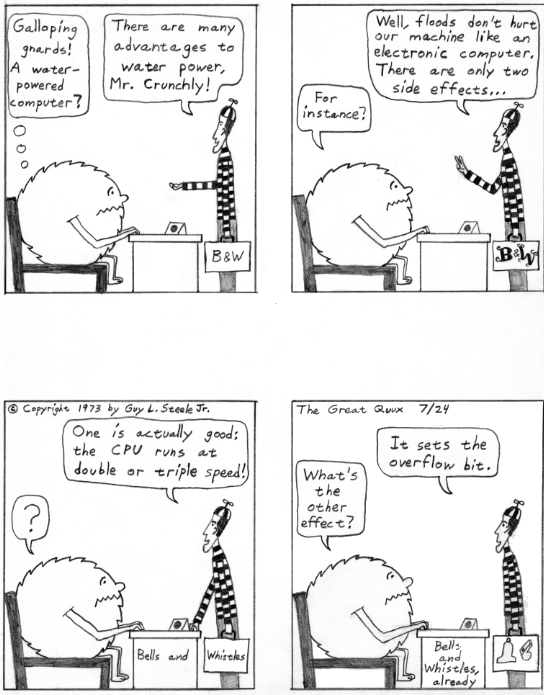

===
O
===

Obfuscated C Contest
=========================
 

**Obfuscated C Contest**: n.

(in full, the ‘International Obfuscated C Code Contest’, or IOCCC) An
annual contest run since 1984 over Usenet by Landon Curt Noll and
friends. The overall winner is whoever produces the most unreadable,
creative, and bizarre (but working) C program; various other prizes are
awarded at the judges' whim. C's terse syntax and macro-preprocessor
facilities give contestants a lot of maneuvering room. The winning
programs often manage to be simultaneously (a) funny, (b) breathtaking
works of art, and (c) horrible examples of how *not* to code in C.

This relatively short and sweet entry might help convey the flavor of
obfuscated C:

+     ----+
| .. code:: programlisting                                                 |
|                                                                          |
|     /*                                                                   |
|      * HELLO WORLD program                                               |
|      * by Jack Applin and Robert Heckendorn, 1985                        |
|      * (Note: depends on being able to modify elements of argv[],        |
|      * which is not guaranteed by ANSI and often not possible.)          |
|      */                                                                  |
|     main(v,c)char**c;{for(v[c++]="Hello, world!\n)";                     |
|     (!!c)[*c]&&(v--||--c&&execlp(*c,*c,c[!!c]+!!c,!c));                  |
|     **c=!c)write(!!*c,*c,!!**c);}                                        |
                                                                          
+     ----+

Here's another good one:

+     ----+
| .. code:: programlisting                                                 |
|                                                                          |
|     /*                                                                   |
|      * Program to compute an approximation of pi                         |
|      * by Brian Westley, 1988                                            |
|      * (requires pcc macro concatenation; try gcc -traditional-cpp)      |
|      */                                                                  |
|                                                                          |
|     #define _ -F<00||--F-OO--;                                           |
|     int F=00,OO=00;                                                      |
|     main(){F_OO();printf("%1.3f\n",4.*-F/OO/OO);}F_OO()                  |
|     {                                                                    |
|                 _-_-_-_                                                  |
|            _-_-_-_-_-_-_-_-_                                             |
|         _-_-_-_-_-_-_-_-_-_-_-_                                          |
|       _-_-_-_-_-_-_-_-_-_-_-_-_-_                                        |
|      _-_-_-_-_-_-_-_-_-_-_-_-_-_-_                                       |
|      _-_-_-_-_-_-_-_-_-_-_-_-_-_-_                                       |
|     _-_-_-_-_-_-_-_-_-_-_-_-_-_-_-_                                      |
|     _-_-_-_-_-_-_-_-_-_-_-_-_-_-_-_                                      |
|     _-_-_-_-_-_-_-_-_-_-_-_-_-_-_-_                                      |
|     _-_-_-_-_-_-_-_-_-_-_-_-_-_-_-_                                      |
|      _-_-_-_-_-_-_-_-_-_-_-_-_-_-_                                       |
|      _-_-_-_-_-_-_-_-_-_-_-_-_-_-_                                       |
|       _-_-_-_-_-_-_-_-_-_-_-_-_-_                                        |
|         _-_-_-_-_-_-_-_-_-_-_-_                                          |
|             _-_-_-_-_-_-_-_                                              |
|                 _-_-_-_                                                  |
|     }                                                                    |
                                                                          
+     ----+

Note that this program works by computing its own area. For more digits,
write a bigger program. See also `hello
world <./H.html#hello-world.html>`__.

The IOCCC has an official home page at
`http://www.ioccc.org/ <http://www.ioccc.org/>`__.

 
Ob-
=========

 

**Ob-**: /ob/, pref.

Obligatory. A piece of `netiquette <./N.html#netiquette.html>`__
acknowledging that the author has been straying from the newsgroup's
charter topic. For example, if a posting in alt.sex is a response to a
part of someone else's posting that has nothing particularly to do with
sex, the author may append ‘ObSex’ (or ‘Obsex’) and toss off a question
or vignette about some unusual erotic act. It is considered a sign of
great `winnitude <./W.html#winnitude.html>`__ when one's Obs are more
interesting than other people's whole postings.

 
obi-wan error
==================

 

**obi-wan error**: /oh´bee·won\` er'@r/, n.

[RPI, from off-by-one and the Obi-Wan Kenobi character in *Star Wars*] A
loop of some sort in which the index is off by one.

1. Common when the index should have started from 0 but instead started
from 1.

2. A kind of `off-by-one error <off-by-one-error.html>`__. See also
`zeroth <./Z.html#zeroth.html>`__.

 

Objectionable-C
=======================
 

**Objectionable-C**: n.

Hackish take on “Objective-C”, the name of an object-oriented dialect of
C in competition with the better-known C++ (it is used to write native
applications on the NeXT machine). Objectionable-C uses a Smalltalk-like
syntax, but lacks the flexibility of Smalltalk method calls, and (like
many such efforts) comes frustratingly close to attaining the `Right
Thing <./R.html#Right-Thing.html>`__ without actually doing so.

obscure
==============
 

**obscure**: adj.

Used in an exaggeration of its normal meaning, to imply total
incomprehensibility. “The reason for that last crash is obscure.” “The
find(1) command's syntax is obscure!” The phrase moderately obscure
implies that something could be figured out but probably isn't worth the
trouble. The construction obscure in the extreme is the preferred
emphatic form.

 

octal forty
===================

 

**octal forty**: /ok´tl for´tee/, n.

Hackish way of saying “I'm drawing a blank.” Octal 40 is the
`ASCII <./A.html#ASCII.html>`__ space character, 0100000; by an odd
coincidence, `hex <./H.html#hex.html>`__ 40 (01000000) is the
`EBCDIC <./E.html#EBCDIC.html>`__ space character. See
`wall <./W.html#wall.html>`__.

 
off-by-one error
========================
 

**off-by-one error**: n.

[common] Exceedingly common error induced in many ways, such as by
starting at 0 when you should have started at 1 or vice-versa, or by
writing **< N** instead of **<= N** or vice-versa. Also applied to
giving something to the person next to the one who should have gotten
it. Often confounded with `fencepost
error <./F.html#fencepost-error.html>`__, which is properly a particular
subtype of it.

offline
=============

 

**offline**: adv.

Not now or not here. “Let's take this discussion offline.” Specifically
used on `Usenet <./U.html#Usenet.html>`__ to suggest that a discussion be
moved off a public newsgroup to email.

 

off the trolley
=================
 

**off the trolley**: adj.

Describes the behavior of a program that malfunctions and goes
catatonic, but doesn't actually `crash <./C.html#crash.html>`__ or abort.
See `glitch <./G.html#glitch.html>`__, `bug <./B.html#bug.html>`__, `deep
space <./D.html#deep-space.html>`__, `wedged <./W.html#wedged.html>`__.

This term is much older than computing, and is (uncommon) slang
elsewhere. A trolley is the small wheel that trolls, or runs against,
the heavy wire that carries the current to run a streetcar. It's at the
end of the long pole (the trolley pole) that reaches from the roof of
the streetcar to the overhead line. When the trolley stops making
contact with the wire (from passing through a switch, going over bumpy
track, or whatever), the streetcar comes to a halt, (usually) without
crashing. The streetcar is then said to be off the trolley, or off the
wire. Later on, trolley came to mean the streetcar itself. Since
streetcars became common in the 1890s, the term is more than 100 years
old. Nowadays, trolleys are only seen on historic streetcars, since
modern streetcars use pantographs to contact the wire.

ogg
==========
 

**ogg**: /og/, v.

[CMU]

1. In the multi-player space combat game Netrek, to execute kamikaze
attacks against enemy ships which are carrying armies or occupying
strategic positions. Named during a game in which one of the players
repeatedly used the tactic while playing Orion ship G, showing up in the
player list as “Og”. This trick has been roundly denounced by those who
would return to the good old days when the tactic of dogfighting was
dominant, but as Sun Tzu wrote, “What is of supreme importance in war is
to attack the enemy's strategy, not his tactics.” However, the
traditional answer to the newbie question “What does ogg mean?” is just
“Pick up some armies and I'll show you.”

2. In other games, to forcefully attack an opponent with the expectation
that the resources expended will be renewed faster than the opponent
will be able to regain his previous advantage. Taken more seriously as a
tactic since it has gained a simple name.

3. To do anything forcefully, possibly without consideration of the
drain on future resources. “I guess I'd better go ogg the problem set
that's due tomorrow.” “Whoops! I looked down at the map for a sec and
almost ogged that oncoming car.”

 

old fart
=============

**old fart**: n.

Tribal elder. A title self-assumed with remarkable frequency by (esp.)
Usenetters who have been programming for more than about 25 years; often
appears in `sig block <./S.html#sig-block.html>`__\ s attached to Jargon
File contributions of great archeological significance. This is a term
of insult in the second or third person but one of pride in first
person.

 
Old Testament
===================

 

**Old Testament**: n.

[C programmers] The first edition of
`K&R <./K.html#K-ampersand-R.html>`__, the sacred text describing
`Classic C <./C.html#Classic-C.html>`__.

 

one-banana problem
====================

 

**one-banana problem**: n.

At mainframe shops, where the computers have operators for routine
administrivia, the programmers and hardware people tend to look down on
the operators and claim that a trained monkey could do their job. It is
frequently observed that the incentives that would be offered said
monkeys can be used as a scale to describe the difficulty of a task. A
one-banana problem is simple; hence, “It's only a one-banana job at the
most; what's taking them so long?” At IBM, folklore divides the world
into one-, two-, and three-banana problems. Other cultures have
different hierarchies and may divide them more finely; at ICL, for
example, five grapes (a bunch) equals a banana. Their upper limit for
the in-house `sysape <./S.html#sysape.html>`__\ s is said to be two
bananas and three grapes (another source claims it's three bananas and
one grape, but observes “However, this is subject to local variations,
cosmic rays and ISO”). At a complication level any higher than that, one
asks the manufacturers to send someone around to check things.

See also `Infinite-Monkey
Theorem <./I.html#Infinite-Monkey-Theorem.html>`__.

 
one-line fix
=================
 

**one-line fix**: n.

Used (often sarcastically) of a change to a program that is thought to
be trivial or insignificant right up to the moment it crashes the
system. Usually ‘cured’ by another one-line fix. See also `I didn't
change anything! <./I.html#I-didn-t-change-anything-.html>`__

one-liner wars
==================
 

**one-liner wars**: n.

A game popular among hackers who code in the language APL (see
`write-only language <./W.html#write-only-language.html>`__ and `line
noise <./L.html#line-noise.html>`__). The objective is to see who can code
the most interesting and/or useful routine in one line of operators
chosen from APL's exceedingly `hairy <./H.html#hairy.html>`__ primitive
set. A similar amusement was practiced among `TECO <./T.html#TECO.html>`__
hackers and is now popular among `Perl <./P.html#Perl.html>`__
aficionados.

Ken Iverson, the inventor of APL, has been credited with a one-liner
that, given a number "N", produces a list of the prime numbers from 1
to "N" inclusive. It looks like this:

+     ----+
| .. code:: programlisting                                                 |
|                                                                          |
|         (2=0+.=T∅.|T)/T←ιN                                               |
                                                                          
+     ----+

Here's a `Perl <./P.html#Perl.html>`__ program that prints primes:

+     ----+
| .. code:: programlisting                                                 |
|                                                                          |
|             perl -wle '(1 x $_) !~ /^(11+)\1+$/ && print while ++ $_'    |
                                                                          
+     ----+

In the Perl world this game is sometimes called Perl Golf because the
player with the fewest (key)strokes wins.

 

on the gripping hand
=============================
 

**on the gripping hand**

In the progression that starts “On the one hand...” and continues “On
the other hand...” mainstream English may add “on the third hand...”
even though most people don't have three hands. Among hackers, it is
just as likely to be “on the gripping hand”. This metaphor supplied the
title of Larry Niven & Jerry Pournelle's 1993 SF novel “The Gripping
Hand” which involved a species of hostile aliens with three arms (the
same species, in fact, referenced in `juggling
eggs <./J.html#juggling-eggs.html>`__). As with
`TANSTAAFL <./T.html#TANSTAAFL.html>`__ and `con <./C.html#con_.html>`__,
this usage became one of the naturalized imports from SF fandom
frequently observed among hackers.

 

ooblick
=================
 

**ooblick**: /oo´blik/, n.

[from the Dr. Seuss title *Bartholomew and the Oobleck*; the spelling
‘oobleck’ is still current in the mainstream] A bizarre semi-liquid
sludge made from cornstarch and water. Enjoyed among hackers who make
batches during playtime at parties for its amusing and extremely
non-Newtonian behavior; it pours and splatters, but resists rapid motion
like a solid and will even crack when hit by a hammer. Often found near
lasers.

Here is a field-tested ooblick recipe contributed by GLS:

-  1 cup cornstarch

-  1 cup baking soda

-  3/4 cup water

-  N drops of food coloring

This recipe isn't quite as non-Newtonian as a pure cornstarch ooblick,
but has an appropriately slimy feel.

Some, however, insist that the notion of an ooblick *recipe* is far too
mechanical, and that it is best to add the water in small increments so
that the various mixed states the cornstarch goes through as it
*becomes* ooblick can be grokked in fullness by many hands. For optional
ingredients of this experience, see the *`Ceremonial
Chemicals <../chemicals.html>`__* section of Appendix B.

 

open
==

 

**open**: n.

Abbreviation for ‘open (or left) parenthesis’ — used when necessary to
eliminate oral ambiguity. To read aloud the LISP form (DEFUN FOO (X)
(PLUS X 1)) one might say: “Open defun foo, open eks close, open, plus
eks one, close close.”

 

+ ---------+  +  ----+
| `Prev <op.html>`__    | `Up <../O.html>`__         |  `Next <open-source.html>`__   |
+ ---------+  +  ----+
| op                    | `Home <../index.html>`__   |  open source                   |
+ ---------+  +  ----+

open source
=================
 

**open source**: n.

[common; also adj. open-source] Term coined in March 1998 following the
Mozilla release to describe software distributed in source under
licenses guaranteeing anybody rights to freely use, modify, and
redistribute, the code. The intent was to be able to sell the hackers'
ways of doing software to industry and the mainstream by avoiding the
negative connotations (to `suit <./S.html#suit.html>`__\ s) of the term
“\ `free software <./F.html#free-software.html>`__\ ”. For discussion of
the follow-on tactics and their consequences, see the `Open Source
Initiative <http://www.opensource.org>`__ site.

Five years after this term was invented, in 2003, it is worth noting the
huge shift in assumptions it helped bring about, if only because the
hacker culture's collective memory of what went before is in some ways
blurring. Hackers have so completely refocused themselves around the
idea and ideal of open source that we are beginning to forget that we
used to do most of our work in closed-source environments. Until the
late 1990s open source was a sporadic exception that usually had to live
on top of a closed-source operating system and alongside closed-source
tools; entire open-source environments like
`Linux <./L.html#Linux.html>`__ and the \*BSD systems didn't even exist in
a usable form until around 1993 and weren't taken very seriously by
anyone but a pioneering few until about five years later.

 

open switch
=================
 

**open switch**: n.

[IBM: prob.: from railroading] An unresolved question, issue, or
problem.

 

operating system
========================
 

**operating system**: n.

[techspeak] (Often abbreviated ‘OS’) The foundation software of a
machine; that which schedules tasks, allocates storage, and presents a
default interface to the user between applications. The facilities an
operating system provides and its general design philosophy exert an
extremely strong influence on programming style and on the technical
cultures that grow up around its host machines. Hacker folklore has been
shaped primarily by the `Unix <./U.html#Unix.html>`__,
`ITS <./I.html#ITS.html>`__, `TOPS-10 <./T.html#TOPS-10.html>`__,
`TOPS-20 <./T.html#TOPS-20.html>`__/`TWENEX <./T.html#TWENEX.html>`__,
`WAITS <./W.html#WAITS.html>`__, `CP/M <./C.html#CP-M.html>`__,
`MS-DOS <./M.html#MS-DOS.html>`__, and `Multics <./M.html#Multics.html>`__
operating systems (most importantly by ITS and Unix). See also
`timesharing <./T.html#timesharing.html>`__.

 

operator headspace
===========================
 

**operator headspace**

[common] More fully, “operator headspace error”. Synonym for `pilot
error <./P.html#pilot-error.html>`__ — a dumb move, especially one pulled
by someone who ought to know better. Often used reflexively.

 

op

 

**op**: /op/, n.

1. In England and Ireland, common verbal abbreviation for ‘operator’, as
in system operator. Less common in the U.S., where
`sysop <./S.html#sysop.html>`__ seems to be preferred.

2. [IRC] Someone who is endowed with privileges on
`IRC <./I.html#IRC.html>`__, not limited to a particular channel. These
are generally people who are in charge of the IRC server at their
particular site. Sometimes used interchangeably with
`CHOP <./C.html#CHOP.html>`__. Compare `sysop <./S.html#sysop.html>`__.

optical diff
===============

 

**optical diff**: n.

See `vdiff <./V.html#vdiff.html>`__.

 
optical grep
=======================
 

**optical grep**: n.

See `vgrep <./V.html#vgrep.html>`__.

 

optimism
==============

**optimism**: n.

What a programmer is full of after fixing the last bug and before
discovering the *next* last bug. Fred Brooks's book *The Mythical
Man-Month* (See *Brooks's Law*) contains the following paragraph that
describes this extremely well:

    All programmers are optimists. Perhaps this modern sorcery
    especially attracts those who believe in happy endings and fairy
    godmothers. Perhaps the hundreds of nitty frustrations drive away
    all but those who habitually focus on the end goal. Perhaps it is
    merely that computers are young, programmers are younger, and the
    young are always optimists. But however the selection process works,
    the result is indisputable: “This time it will surely run,” or “I
    just found the last bug.”.

See also `Lubarsky's Law of Cybernetic
Entomology <./L.html#Lubarskys-Law-of-Cybernetic-Entomology.html>`__.

 

Oracle, the
=
 

**Oracle, the**

The all-knowing, all-wise Internet Oracle "rec.humor.oracle", or one
of the foreign language derivatives of same. Newbies frequently confuse
the Oracle with Oracle, a database vendor. As a result, the unmoderated
"rec.humor.oracle.d" is frequently cross-posted to by the clueless,
looking for advice on SQL. As more than one person has said in similar
situations, “Don't people bother to look at the newsgroup description
line anymore?” (To which the standard response is, “Did people ever read
it in the first place?”)

Orange Book
==============
 

**Orange Book**: n.

The U.S. Government's (now obsolete) standards document *Trusted
Computer System Evaluation Criteria, DOD standard 5200.28-STD, December,
1985* which characterize secure computing architectures and defines
levels A1 (most secure) through D (least). Modern Unixes are roughly C2.
See also `book titles <./B.html#book-titles.html>`__.

 

oriental food
===================
 

**oriental food**: n.

Hackers display an intense tropism towards oriental cuisine, especially
Chinese, and especially of the spicier varieties such as Szechuan and
Hunan. This phenomenon (which has also been observed in subcultures that
overlap heavily with hackerdom, most notably science-fiction fandom) has
never been satisfactorily explained, but is sufficiently intense that
one can assume the target of a hackish dinner expedition to be the best
local Chinese place and be right at least three times out of four. See
also `ravs <./R.html#ravs.html>`__,
`great-wall <./G.html#great-wall.html>`__, `stir-fried
random <./S.html#stir-fried-random.html>`__, `laser
chicken <./L.html#laser-chicken.html>`__, `Yu-Shiang Whole
Fish <./Y.html#Yu-Shiang-Whole-Fish.html>`__. Thai, Indian, Korean,
Burmese, and Vietnamese cuisines are also quite popular.

 

orphaned i-node
=======================
 

**orphaned i-node**: /or´f@nd i:´nohd/, n.

[Unix]

1. [techspeak] A file that retains storage but no longer appears in the
directories of a filesystem.

2. By extension, a pejorative for any person no longer serving a useful
function within some organization, esp. `lion
food <./L.html#lion-food.html>`__ without subordinates.

 

orphan
===========
 

**orphan**: n.

[Unix] A process whose parent has died; one inherited by init(1).
Compare `zombie <./Z.html#zombie.html>`__.

 

orthogonal
==============

**orthogonal**: adj.

[from mathematics] Mutually independent; well separated; sometimes,
irrelevant to. Used in a generalization of its mathematical meaning to
describe sets of primitives or capabilities that, like a vector basis in
geometry, span the entire ‘capability space’ of the system and are in
some sense non-overlapping or mutually independent. For example, in
architectures such as the `PDP-11 <./P.html#PDP-11.html>`__ or
`VAX <./V.html#VAX.html>`__ where all or nearly all registers can be used
interchangeably in any role with respect to any instruction, the
register set is said to be orthogonal. Or, in logic, the set of
operators not and or is orthogonal, but the set nand, or, and not is not
(because any one of these can be expressed in terms of the others). Also
used in comments on human discourse: “This may be orthogonal to the
discussion, but....”

 

OS/2
======
 

**OS/2**: /O S too/, n.

The anointed successor to MS-DOS for Intel 286- and 386-based micros;
proof that IBM/Microsoft couldn't get it right the second time, either.
Often called ‘Half-an-OS’. Mentioning it is usually good for a cheap
laugh among hackers — the design was so
`baroque <./B.html#baroque.html>`__, and the implementation of 1.x so bad,
that three years after introduction you could still count the major
`app <./A.html#app.html>`__\ s shipping for it on the fingers of two hands
— in unary. The 2.x versions were said to have improved somewhat, and
informed hackers rated them superior to Microsoft Windows (an
endorsement which, however, could easily be construed as damning with
faint praise). In the mid-1990s IBM put OS/2 on life support, refraining
from killing it outright purely for internal political reasons; by 1999
the success of `Linux <./L.html#Linux.html>`__ had effectively ended any
possibility of a renaissance. See
`monstrosity <./M.html#monstrosity.html>`__,
`cretinous <./C.html#cretinous.html>`__, `second-system
effect <./S.html#second-system-effect.html>`__.

 
OS
======
 

**OS**: /O·S/

1. [Operating System] n. An abbreviation heavily used in email,
occasionally in speech.

2. n. obs. On ITS, an output spy. See *`OS and
JEDGAR <../os-and-jedgar.html>`__* in Appendix A.

 

OSS
========
 

**OSS**

Written-only acronym for “Open Source Software” (see `open
source <open-source.html>`__). This is a rather ugly
`TLA <./T.html#TLA.html>`__, and the principals in the open-source
movement don't use it, but it has (perhaps inevitably) spread through
the trade press like kudzu.

 

OT
=====
 

**OT**: //

[Usenet: common] Abbreviation for “off-topic”. This is used to respond
to a question that is inappropriate for the newsgroup that the
questioner posted to. Often used in an HTML-style modifier or with
adverbs. See also `TAN <./T.html#TAN.html>`__.

 
OTOH
========

 

**OTOH**: //

[Usenet; very common] On The Other Hand.

 
out-of-band
=================
 

**out-of-band**: adj.

[from telecommunications and network theory]

1. In software, describes values of a function which are not in its
‘natural’ range of return values, but are rather signals that some kind
of exception has occurred. Many C functions, for example, return a
nonnegative integral value, but indicate failure with an out-of-band
return value of −1. Compare `hidden flag <./H.html#hidden-flag.html>`__,
`green bytes <./G.html#green-bytes.html>`__,
`fence <./F.html#fence.html>`__.

2. Also sometimes used to describe what communications people call shift
characters, such as the ESC that leads control sequences for many
terminals, or the level shift indicators in the old 5-bit Baudot codes.

3. In personal communication, using methods other than email, such as
telephones or `snail-mail <./S.html#snail-mail.html>`__.

 

overclock
===============
 

**overclock**: /oh´vr·klok´/, vt.

To operate a CPU or other digital logic device at a rate higher than it
was designed for, under the assumption that the manufacturer put some
`slop <./S.html#slop.html>`__ into the specification to account for
manufacturing tolerances. Overclocking something can result in
intermittent `crash <./C.html#crash.html>`__\ es, and can even burn things
out, since power dissipation is directly proportional to
`clock <./C.html#clock.html>`__ frequency. People who make a hobby of this
are sometimes called “overclockers”; they are thrilled that they can run
their CPU a few percent faster, even though they can only tell the
difference by running a `benchmark <./B.html#benchmark.html>`__ program.
See also `case mod <./C.html#case-mod.html>`__.

overflow bit
===================
 

**overflow bit**: n.

1. [techspeak] A `flag <./F.html#flag.html>`__ on some processors
indicating an attempt to calculate a result too large for a register to
hold.

2. More generally, an indication of any kind of capacity overload
condition. “Well, the Ada description was
`baroque <./B.html#baroque.html>`__ all right, but I could hack it OK
until they got to the exception handling ... that set my overflow bit.”

3. The hypothetical bit that will be set if a hacker doesn't get to make
a trip to the Room of Porcelain Fixtures: “I'd better process an
internal interrupt before the overflow bit gets set.”

|image0|

Crunchly and the `overflow bit <overflow-bit.html>`__.

(The next cartoon in the Crunchly saga is
`73-07-29 <./B.html#bug.html#crunchly73-07-29>`__. The previous one is
`73-06-04 <./G.html#glitch.html#crunchly73-06-04>`__.)

 

overrun
===============
 

**overrun**: n.

1. [techspeak] Term for a frequent consequence of data arriving faster
than it can be consumed, esp. in serial line communications. For
example, at 9600 baud there is almost exactly one character per
millisecond, so if a `silo <./S.html#silo.html>`__ can hold only two
characters and the machine takes longer than 2 msec to get to service
the interrupt, at least one character will be lost.

2. Also applied to non-serial-I/O communications. “I forgot to pay my
electric bill due to mail overrun.” “Sorry, I got four phone calls in 3
minutes last night and lost your message to overrun.” When
`thrash <./T.html#thrash.html>`__\ ing at tasks, the next person to make a
request might be told “Overrun!” Compare `firehose
syndrome <./F.html#firehose-syndrome.html>`__.

3. More loosely, may refer to a `buffer
overflow <./B.html#buffer-overflow.html>`__ not necessarily related to
processing time (as in `overrun screw <overrun-screw.html>`__).

overrun screw
===================

 

**overrun screw**: n.

[C programming] A variety of `fandango on
core <./F.html#fandango-on-core.html>`__ produced by scribbling past the
end of an array (C implementations typically have no checks for this
error). This is relatively benign and easy to spot if the array is
static; if it is auto, the result may be to `smash the
stack <./S.html#smash-the-stack.html>`__ — often resulting in
`heisenbug <./H.html#heisenbug.html>`__\ s of the most diabolical
subtlety. The term overrun screw is used esp. of scribbles beyond the
end of arrays allocated with malloc(3); this typically trashes the
allocation header for the next block in the
`arena <./A.html#arena.html>`__, producing massive lossage within malloc
and often a core dump on the next operation to use stdio(3) or malloc(3)
itself. See `spam <./S.html#spam.html>`__, `overrun <overrun.html>`__;
see also `memory leak <./M.html#memory-leak.html>`__, `memory
smash <./M.html#memory-smash.html>`__, `aliasing
bug <./A.html#aliasing-bug.html>`__, `precedence
lossage <./P.html#precedence-lossage.html>`__, `fandango on
core <./F.html#fandango-on-core.html>`__, `secondary
damage <./S.html#secondary-damage.html>`__.

 

owned
===========

 

**owned**

1. [cracker slang; often written “0wned”] Your condition when your
machine has been cracked by a root exploit, and the attacker can do
anything with it. This sense is occasionally used by hackers.

2. [gamers, IRC, crackers] To be dominated, controlled, mastered. For
example, if you make a statement completely and utterly false, and
someone else corrects it in a way that humiliates or removes you, you
are said to “have been owned” by that person. When referring to games,
“I own0r UT GOTYE” means that one has mastered Unreal Tournament, Game
of the Year Edition to such a level that even the hardest AI characters
are mere lunchmeat, and that no ordinary mortal player would even
receive a point in competition. There are several spelling variants:
0wned, 0wn0r3d, even pwn0r3d. Hackers do not use this sense.

 

-oid
=====

 

**-oid**: suff.

[from Greek suffix -oid = in the image of]

1. Used as in mainstream slang English to indicate a poor imitation, a
counterfeit, or some otherwise slightly bogus resemblance. Hackers will
happily use it with all sorts of non-Greco/Latin stem words that
wouldn't keep company with it in mainstream English. For example, “He's
a nerdoid” means that he superficially resembles a nerd but can't make
the grade; a modemoid might be a 300-baud box (Real Modems run at 28.8
or up); a computeroid might be any `bitty
box <./B.html#bitty-box.html>`__. The word keyboid could be used to
describe a `chiclet keyboard <./C.html#chiclet-keyboard.html>`__, but
would have to be written; spoken, it would confuse the listener as to
the speaker's city of origin.

2. More specifically, an indicator for ‘resembling an android’ which in
the past has been confined to science-fiction fans and hackers. It too
has recently (in 1991) started to go mainstream (most notably in the
term ‘trendoid’ for victims of terminal hipness). This is probably
traceable to the popularization of the term
`droid <./D.html#droid.html>`__ in *Star Wars* and its sequels. (See also
`windoid <./W.html#windoid.html>`__.)

Coinages in both forms have been common in science fiction for at least
fifty years, and hackers (who are often SF fans) have probably been
making *‘-oid*\ ’ jargon for almost that long [though GLS and I can
personally confirm only that they were already common in the mid-1970s
—ESR].

 

OP
===

 

**OP**: //

[Usenet; common] Abbreviation for “original poster”, the originator of a
particular thread.

