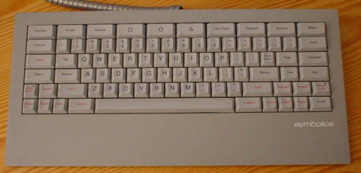
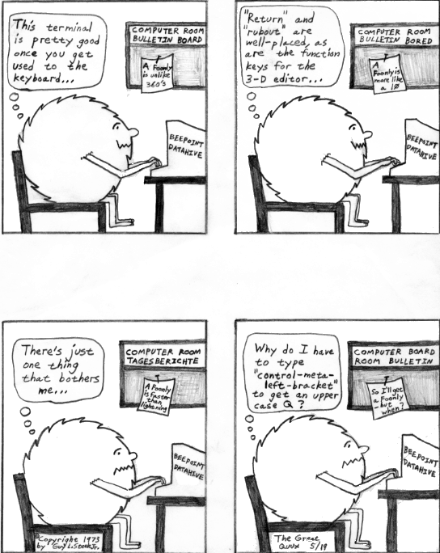
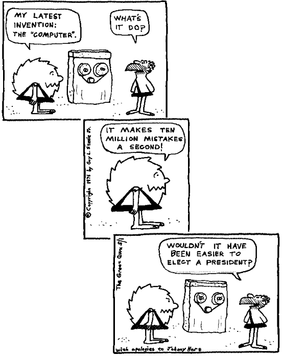

=========
S
=========


sacred
==============


**sacred**: adj.

Reserved for the exclusive use of something (an extension of the
standard meaning). Often means that anyone may look at the sacred
object, but clobbering it will screw whatever it is sacred to. The
comment “Register 7 is sacred to the interrupt handler” appearing in a
program would be interpreted by a hacker to mean that if any *other*
part of the program changes the contents of register 7, dire
consequences are likely to ensue.

saga
========


**saga**: n.

[WPI] A cuspy but bogus raving story about ``N`` random broken people.

Here is a classic example of the saga form, as told by Guy L. Steele:

    Jon L. White (login name JONL) and I (GLS) were office mates at MIT
    for many years. One April, we both flew from Boston to California
    for a week on research business, to consult face-to-face with some
    people at Stanford, particularly our mutual friend Richard P.
    Gabriel (RPG).

    RPG picked us up at the San Francisco airport and drove us back to
    Palo Alto (going `logical <../L/logical.html>`__ south on route
    101, parallel to `El Camino
    Bignum <../E/El-Camino-Bignum.html>`__). Palo Alto is adjacent to
    Stanford University and about 40 miles south of San Francisco. We
    ate at The Good Earth, a ‘health food’ restaurant, very popular, the
    sort whose milkshakes all contain honey and protein powder. JONL
    ordered such a shake — the waitress claimed the flavor of the day
    was “lalaberry”. I still have no idea what that might be, but it
    became a running joke. It was the color of raspberry, and JONL said
    it tasted rather bitter. I ate a better tostada there than I have
    ever had in a Mexican restaurant.

    After this we went to the local Uncle Gaylord's Old Fashioned Ice
    Cream Parlor. They make ice cream fresh daily, in a variety of
    intriguing flavors. It's a chain, and they have a slogan: “If you
    don't live near an Uncle Gaylord's — MOVE!” Also, Uncle Gaylord (a
    real person) wages a constant battle to force big-name ice cream
    makers to print their ingredients on the package (like air and
    plastic and other non-natural garbage). JONL and I had first
    discovered Uncle Gaylord's the previous August, when we had flown to
    a computer-science conference in Berkeley, California, the first
    time either of us had been on the West Coast. When not in the
    conference sessions, we had spent our time wandering the length of
    Telegraph Avenue, which (like Harvard Square in Cambridge) was lined
    with picturesque street vendors and interesting little shops. On
    that street we discovered Uncle Gaylord's Berkeley store. The ice
    cream there was very good. During that August visit JONL went
    absolutely bananas (so to speak) over one particular flavor, ginger
    honey.

    Therefore, after eating at The Good Earth — indeed, after every
    lunch and dinner and before bed during our April visit — a trip to
    Uncle Gaylord's (the one in Palo Alto) was mandatory. We had arrived
    on a Wednesday, and by Thursday evening we had been there at least
    four times. Each time, JONL would get ginger honey ice cream, and
    proclaim to all bystanders that “Ginger was the spice that drove the
    Europeans mad! That's why they sought a route to the East! They used
    it to preserve their otherwise off-taste meat.” After the third or
    fourth repetition RPG and I were getting a little tired of this
    spiel, and began to paraphrase him: “Wow! Ginger! The spice that
    makes rotten meat taste good!” “Say! Why don't we find some dog
    that's been run over and sat in the sun for a week and put some
    *ginger* on it for dinner?!” “Right! With a lalaberry shake!” And so
    on. This failed to faze JONL; he took it in good humor, as long as
    we kept returning to Uncle Gaylord's. He loves ginger honey ice
    cream.

    Now RPG and his then-wife KBT (Kathy Tracy) were putting us up
    (putting up with us?) in their home for our visit, so to thank them
    JONL and I took them out to a nice French restaurant of their
    choosing. I unadventurously chose the filet mignon, and KBT had je
    ne sais quoi du jour, but RPG and JONL had lapin (rabbit).
    (Waitress: “Oui, we have fresh rabbit, fresh today.” RPG: “Well,
    JONL, I guess we won't need any *ginger*!”)

    We finished the meal late, about 11PM, which is 2AM Boston time, so
    JONL and I were rather droopy. But it wasn't yet midnight. Off to
    Uncle Gaylord's!

    Now the French restaurant was in Redwood City, north of Palo Alto.
    In leaving Redwood City, we somehow got onto route 101 going north
    instead of south. JONL and I wouldn't have known the difference had
    RPG not mentioned it. We still knew very little of the local
    geography. I did figure out, however, that we were headed in the
    direction of Berkeley, and half-jokingly suggested that we continue
    north and go to Uncle Gaylord's in Berkeley.

    RPG said “Fine!” and we drove on for a while and talked. I was
    drowsy, and JONL actually dropped off to sleep for 5 minutes. When
    he awoke, RPG said, “Gee, JONL, you must have slept all the way over
    the bridge!”, referring to the one spanning San Francisco Bay. Just
    then we came to a sign that said “University Avenue”. I mumbled
    something about working our way over to Telegraph Avenue; RPG said
    “Right!” and maneuvered some more. Eventually we pulled up in front
    of an Uncle Gaylord's.

    Now, I hadn't really been paying attention because I was so sleepy,
    and I didn't really understand what was happening until RPG let me
    in on it a few moments later, but I was just alert enough to notice
    that we had somehow come to the Palo Alto Uncle Gaylord's after all.

    JONL noticed the resemblance to the Palo Alto store, but hadn't
    caught on. (The place is lit with red and yellow lights at night,
    and looks much different from the way it does in daylight.) He said,
    “This isn't the Uncle Gaylord's I went to in Berkeley! It looked
    like a barn! But this place looks *just like* the one back in Palo
    Alto!”

    RPG deadpanned, “Well, this is the one *I* always come to when I'm
    in Berkeley. They've got two in San Francisco, too. Remember,
    they're a chain.”

    JONL accepted this bit of wisdom. And he was not totally ignorant —
    he knew perfectly well that University Avenue was in Berkeley, not
    far from Telegraph Avenue. What he didn't know was that there is a
    completely different University Avenue in Palo Alto.

    JONL went up to the counter and asked for ginger honey. The guy at
    the counter asked whether JONL would like to taste it first,
    evidently their standard procedure with that flavor, as not too many
    people like it.

    JONL said, “I'm sure I like it. Just give me a cone.” The guy behind
    the counter insisted that JONL try just a taste first. “Some people
    think it tastes like soap.” JONL insisted, “Look, I *love* ginger. I
    eat Chinese food. I eat raw ginger roots. I already went through
    this hassle with the guy back in Palo Alto. I *know* I like that
    flavor!”

    At the words “back in Palo Alto” the guy behind the counter got a
    very strange look on his face, but said nothing. KBT caught his eye
    and winked. Through my stupor I still hadn't quite grasped what was
    going on, and thought RPG was rolling on the floor laughing and
    clutching his stomach just because JONL had launched into his spiel
    (“makes rotten meat a dish for princes”) for the forty-third time.
    At this point, RPG clued me in fully.

    RPG, KBT, and I retreated to a table, trying to stifle our chuckles.
    JONL remained at the counter, talking about ice cream with the guy
    b.t.c., comparing Uncle Gaylord's to other ice cream shops and
    generally having a good old time.

    At length the g.b.t.c.: said, “How's the ginger honey?” JONL said,
    “Fine! I wonder what exactly is in it?” Now Uncle Gaylord publishes
    all his recipes and even teaches classes on how to make his ice
    cream at home. So the g.b.t.c.: got out the recipe, and he and JONL
    pored over it for a while. But the g.b.t.c.: could contain his
    curiosity no longer, and asked again, “You really like that stuff,
    huh?” JONL said, “Yeah, I've been eating it constantly back in Palo
    Alto for the past two days. In fact, I think this batch is about as
    good as the cones I got back in Palo Alto!”

    G.b.t.c.: looked him straight in the eye and said, “You're *in* Palo
    Alto!”

    JONL turned slowly around, and saw the three of us collapse in a fit
    of giggles. He clapped a hand to his forehead and exclaimed, “I've
    been hacked!”

[My spies on the West Coast inform me that there is a close relative of
the raspberry found out there called an ‘ollalieberry’ —ESR]

[Ironic footnote: the `meme <../M/meme.html>`__ about ginger vs.
rotting meat is an urban legend. It's not borne out by an examination of
medieval recipes or period purchase records for spices, and appears
full-blown in the works of Samuel Pegge, a gourmand and notorious flake
case who originated numerous food myths. The truth seems to be that
ginger was used to cover not rot but the extreme salt taste of meat
packed in brine, which was the best method available before
refrigeration. —ESR]

sagan
================


**sagan**: /say´gn/, n.

[from Carl Sagan's TV series *Cosmos*; think “billions and billions”] A
large quantity of anything. “There's a sagan different ways to tweak
EMACS.” “The U.S. Government spends sagans on bombs and welfare — hard
to say which is more destructive.”


SAIL
=================


**SAIL**: /sayl/, /S·A·I·L/, n.

1. The Stanford Artificial Intelligence Lab. An important site in the
early development of LISP; with the MIT AI Lab, BBN, CMU, XEROX PARC,
and the Unix community, one of the major wellsprings of technical
innovation and hacker-culture traditions (see the
`WAITS <../W/WAITS.html>`__ entry for details). The SAIL machines were
shut down in late May 1990, scant weeks after the MIT AI Lab's ITS
cluster was officially decommissioned.

2. The Stanford Artificial Intelligence Language used at SAIL (sense 1).
It was an Algol-60 derivative with a coroutining facility and some new
data types intended for building search trees and association lists.

salescritter
==================


**salescritter**: /sayls´kri\`tr/, n.

Pejorative hackerism for a computer salesperson. Hackers tell the
following joke:

| 
|  Q. What's the difference between a used-car dealer and a
|     computer salesman?
|  A. The used-car dealer knows he's lying.  [Some versions add:
|     ...and probably knows how to drive.]

This reflects the widespread hacker belief that salescritters are
self-selected for stupidity (after all, if they had brains and the
inclination to use them, they'd be in programming). The terms salesthing
and salesdroid are also common. Compare
`marketroid <../M/marketroid.html>`__, `suit <suit.html>`__,
`droid <../D/droid.html>`__.


salt
====================


**salt**: n.

A tiny bit of near-random data inserted where too much regularity would
be undesirable; a data `frob <../F/frob.html>`__ (sense 1). For
example, the Unix crypt(3) man page mentions that “the salt string is
used to perturb the DES algorithm in one of 4096 different ways.”


salt mines
===========================

**salt mines**: n.

Dense quarters housing large numbers of programmers working long hours
on grungy projects, with some hope of seeing the end of the tunnel in
``N`` years. Noted for their absence of sunshine. Compare
`playpen <../P/playpen.html>`__, `sandbox <sandbox.html>`__.


salt substrate
==========================


**salt substrate**: n.

[MIT] Collective noun used to refer to potato chips, pretzels, saltines,
or any other form of snack food designed primarily as a carrier for
sodium chloride. Also sodium substrate. From the technical term chip
substrate, used to refer to the silicon on the top of which the active
parts of integrated circuits are deposited.


same-day service
=================================


**same-day service**: n.

Ironic term used to describe long response time, particularly with
respect to `MS-DOS <../M/MS-DOS.html>`__ and Windows system calls
(which ought to require only a tiny fraction of a second to execute).
Such response time is a major incentive for programmers to write
programs that are not `well-behaved <../W/well-behaved.html>`__.


samizdat
==========================


**samizdat**: /sahm·iz·daht/, n.

[Russian, literally “self publishing”] The process of disseminating
documentation via underground channels. Originally referred to
underground duplication and distribution of banned books in the Soviet
Union; now refers by obvious extension to any less-than-official
promulgation of textual material, esp. rare, obsolete, or
never-formally-published computer documentation. Samizdat is obviously
much easier when one has access to high-bandwidth networks and
high-quality laser printers. Note that samizdat is properly used only
with respect to documents which contain needed information (see also
`hacker ethic <../H/hacker-ethic.html>`__) but which are for some
reason otherwise unavailable, but *not* in the context of documents
which are available through normal channels, for which unauthorized
duplication would be unethical copyright violation. See `Lions
Book <../L/Lions-Book.html>`__ for a historical example.


samurai
===================


**samurai**: n.

A hacker who hires out for legal cracking jobs, snooping for factions in
corporate political fights, lawyers pursuing privacy-rights and First
Amendment cases, and other parties with legitimate reasons to need an
electronic locksmith. In 1991, mainstream media reported the existence
of a loose-knit culture of samurai that meets electronically on BBS
systems, mostly bright teenagers with personal micros; they have modeled
themselves explicitly on the historical samurai of Japan and on the “net
cowboys” of William Gibson's `cyberpunk <../C/cyberpunk.html>`__
novels. Those interviewed claim to adhere to a rigid ethic of loyalty to
their employers and to disdain the vandalism and theft practiced by
criminal crackers as beneath them and contrary to the hacker ethic; some
quote Miyamoto Musashi's *Book of Five Rings*, a classic of historical
samurai doctrine, in support of these principles. See also
`sneaker <sneaker.html>`__, `Stupids <Stupids.html>`__, `social
engineering <social-engineering.html>`__,
`cracker <../C/cracker.html>`__, `hacker
ethic <../H/hacker-ethic.html>`__, and `dark-side
hacker <../D/dark-side-hacker.html>`__.


sandbender
============================


**sandbender**: n.

[IBM] A person involved with silicon lithography and the physical design
of chips. Compare `ironmonger <../I/ironmonger.html>`__, `polygon
pusher <../P/polygon-pusher.html>`__.


sandbox
=====================


**sandbox**: n.

(also ‘sandbox, the’)

1. Common term for the R&D department at many software and computer
companies (where hackers in commercial environments are likely to be
found). Half-derisive, but reflects the truth that research is a form of
creative play. Compare `playpen <../P/playpen.html>`__.

2. Syn. `link farm <../L/link-farm.html>`__.

3. A controlled environment within which potentially dangerous programs
are run. Used esp. in reference to Java implementations.

4. A checked-out copy of a source tree, on which one may safely perform
builds without interfereing with others.


sanity check
=========================


**sanity check**: n.

[very common]

1. The act of checking a piece of code (or anything else, e.g., a Usenet
posting) for completely stupid mistakes. Implies that the check is to
make sure the author was sane when it was written; e.g., if a piece of
scientific software relied on a particular formula and was giving
unexpected results, one might first look at the nesting of parentheses
or the coding of the formula, as a sanity check, before looking at the
more complex I/O or data structure manipulation routines, much less the
algorithm itself. Compare `reality check <../R/reality-check.html>`__.

2. A run-time test, either validating input or ensuring that the program
hasn't screwed up internally (producing an inconsistent value or state).

3. Conversationally, saying “sanity check” means you are requesting a
check of your assumptions. “Wait a minute, sanity check, are we talking
about the same Kevin here?”


Saturday-night special
==========================================


**Saturday-night special**: n.

[from police slang for a cheap handgun] A
`quick-and-dirty <../Q/quick-and-dirty.html>`__ program or feature
kluged together during off hours, under a deadline, and in response to
pressure from a `salescritter <salescritter.html>`__. Such hacks are
dangerously unreliable, but all too often sneak into a production
release after insufficient review.


say
================================


**say**: vt.

1. To type to a terminal. “To list a directory verbosely, you have to
say **ls -l**.” Tends to imply a
`newline <../N/newline.html>`__-terminated command (a ‘sentence’).

2. A computer may also be said to ‘say’ things to you, even if it
doesn't have a speech synthesizer, by displaying them on a terminal in
response to your commands. Hackers find it odd that this usage confuses
`mundane <../M/mundane.html>`__\ s.


scag
======================


**scag**: vt.

To destroy the data on a disk, either by corrupting the filesystem or by
causing media damage. “That last power hit scagged the system disk.”
Compare `scrog <scrog.html>`__, `roach <../R/roach.html>`__.


scanno
========================


**scanno**: /skan´oh/, n.

An error in a document caused by a scanner glitch, analogous to a typo
or `thinko <../T/thinko.html>`__.


scary devil monastery
============================================


**scary devil monastery**: n.

Anagram frequently used to refer to the newsgroup
``alt.sysadmin.recovery``, which is populated with characters that
rather justify the reference.


schroedinbug
==========================================


**schroedinbug**: /shroh´din·buhg/, n.

[MIT: from the Schroedinger's Cat thought-experiment in quantum physics]
A design or implementation bug in a program that doesn't manifest until
someone reading source or using the program in an unusual way notices
that it never should have worked, at which point the program promptly
stops working for everybody until fixed. Though (like `bit
rot <../B/bit-rot.html>`__) this sounds impossible, it happens; some
programs have harbored latent schroedinbugs for years. Compare
`heisenbug <../H/heisenbug.html>`__, `Bohr
bug <../B/Bohr-bug.html>`__, `mandelbug <../M/mandelbug.html>`__.


science-fiction fandom
================================


**science-fiction fandom**: n.

Another voluntary subculture having a very heavy overlap with hackerdom;
most hackers read SF and/or fantasy fiction avidly, and many go to
‘cons’ (SF conventions) or are involved in fandom-connected activities
such as the Society for Creative Anachronism. Some hacker jargon
originated in SF fandom; see
`defenestration <../D/defenestration.html>`__,
`great-wall <../G/great-wall.html>`__,
`cyberpunk <../C/cyberpunk.html>`__, `h <../H/h.html>`__, `ha ha
only serious <../H/ha-ha-only-serious.html>`__,
`IMHO <../I/IMHO.html>`__, `mundane <../M/mundane.html>`__,
`neep-neep <../N/neep-neep.html>`__, `Real Soon
Now <../R/Real-Soon-Now.html>`__. Additionally, the jargon terms
`cowboy <../C/cowboy.html>`__,
`cyberspace <../C/cyberspace.html>`__,
`de-rezz <../D/de-rezz.html>`__, `go
flatline <../G/go-flatline.html>`__, `ice <../I/ice.html>`__,
`phage <../P/phage.html>`__, `virus <../V/virus.html>`__,
`wetware <../W/wetware.html>`__, `wirehead <../W/wirehead.html>`__,
and `worm <../W/worm.html>`__ originated in SF stories.


SCNR
=============


**SCNR**: abbrev

[common] Sorry, Could Not Resist. Normally used to semi-apologize for an
obvious wisecrack.


scram switch
======================


**scram switch**: n.

[from the nuclear power industry] An emergency-power-off switch (see
`Big Red Switch <../B/Big-Red-Switch.html>`__), esp. one positioned to
be easily hit by evacuating personnel. In general, this is *not*
something you `frob <../F/frob.html>`__ lightly; these often initiate
expensive events (such as Halon dumps) and are installed in a `dinosaur
pen <../D/dinosaur-pen.html>`__ for use in case of electrical fire or
in case some luckless `field servoid <../F/field-servoid.html>`__
should put 120 volts across himself while `Easter
egging <../E/Easter-egging.html>`__. (See also
`molly-guard <../M/molly-guard.html>`__, `TMRC <../T/TMRC.html>`__.)

“Scram” was in origin a backronym for “Safety Cut Rope Axe Man” coined
by Enrico Fermi himself. The story goes that in the earliest nuclear
power experiments the engineers recognized the possibility that the
reactor wouldn't behave exactly as predicted by their mathematical
models. Accordingly, they made sure that they had mechanisms in place
that would rapidly drop the control rods back into the reactor. One
mechanism took the form of ‘scram technicians’. These individuals stood
next to the ropes or cables that raised and lowered the control rods.
Equipped with axes or cable-cutters, these technicians stood ready for
the (literal) ‘scram’ command. If necessary, they would cut the cables,
and gravity would expeditiously return the control rods to the reactor,
thereby averting yet another kind of `core
dump <../C/core-dump.html>`__.

Modern reactor control rods are held in place with claw-like devices,
held closed by current. SCRAM switches are circuit breakers that
immediately open the circuit to the rod arms, resulting in the rapid
insertion and subsequent bottoming of the control rods.

scratch
=====================


**scratch**

1. [from scratchpad] adj. Describes a data structure or recording medium
attached to a machine for testing or temporary-use purposes; one that
can be `scribble <scribble.html>`__\ d on without loss. Usually in the
combining forms scratch memory, scratch register, scratch disk, scratch
tape, scratch volume. See also `scratch
monkey <scratch-monkey.html>`__.

2. [primarily IBM, also Commodore] vt. To delete (as in a file).

--------------

+---------------------------------+----------------------------+-----------------------------------+
| `Prev <scram-switch.html>`__    | `Up <../S.html>`__         |  `Next <scratch-monkey.html>`__   |
+---------------------------------+----------------------------+-----------------------------------+
| scram switch                    | `Home <../index.html>`__   |  scratch monkey                   |
+---------------------------------+----------------------------+-----------------------------------+

scratch monkey

`Prev <scratch.html>`__ 

S

 `Next <scream-and-die.html>`__

--------------

**scratch monkey**: n.

As in “Before testing or reconfiguring, always mount a `scratch
monkey <scratch-monkey.html>`__\ ”, a proverb used to advise caution
when dealing with irreplaceable data or devices. Used to refer to any
scratch volume hooked to a computer during any risky operation as a
replacement for some precious resource or data that might otherwise get
trashed.

This term preserves the memory of Mabel, the Swimming Wonder Monkey,
star of a biological research program at the University of Toronto.
Mabel was not (so the legend goes) your ordinary monkey; the university
had spent years teaching her how to swim, breathing through a regulator,
in order to study the effects of different gas mixtures on her
physiology. Mabel suffered an untimely demise one day when a
`DEC <../D/DEC.html>`__ `field circus <../F/field-circus.html>`__
engineer troubleshooting a crash on the program's
`VAX <../V/VAX.html>`__ inadvertently interfered with some custom
hardware that was wired to Mabel.

It is reported that, after calming down an understandably irate customer
sufficiently to ascertain the facts of the matter, a DEC troubleshooter
called up the `field circus <../F/field-circus.html>`__ manager
responsible and asked him sweetly, “Can you swim?” Not all the
consequences to humans were so amusing; the sysop of the machine in
question was nearly thrown in jail at the behest of certain clueless
`droid <../D/droid.html>`__\ s at the local ‘humane’ society. The
moral is clear: When in doubt, always mount a scratch monkey. [The
actual incident occured in 1979 or 1980. There is a version of this
story, complete with reported dialogue between one of the project people
and DEC field service, that has been circulating on Internet since 1986.
It is hilarious and mythic, but gets some facts wrong. For example, it
reports the machine as a `PDP-11 <../P/PDP-11.html>`__ and alleges
that Mabel's demise occurred when DEC `PM <../P/PM.html>`__\ ed the
machine. Earlier versions of this entry were based on that story; this
one has been corrected from an interview with the hapless sysop. —ESR]

--------------

+----------------------------+----------------------------+-----------------------------------+
| `Prev <scratch.html>`__    | `Up <../S.html>`__         |  `Next <scream-and-die.html>`__   |
+----------------------------+----------------------------+-----------------------------------+
| scratch                    | `Home <../index.html>`__   |  scream and die                   |
+----------------------------+----------------------------+-----------------------------------+

scream and die

`Prev <scratch-monkey.html>`__ 

S

 `Next <screaming-tty.html>`__

--------------

**scream and die**: v.

Syn. `cough and die <../C/cough-and-die.html>`__, but connotes that an
error message was printed or displayed before the program crashed.

--------------

+-----------------------------------+----------------------------+----------------------------------+
| `Prev <scratch-monkey.html>`__    | `Up <../S.html>`__         |  `Next <screaming-tty.html>`__   |
+-----------------------------------+----------------------------+----------------------------------+
| scratch monkey                    | `Home <../index.html>`__   |  screaming tty                   |
+-----------------------------------+----------------------------+----------------------------------+

screaming tty

`Prev <scream-and-die.html>`__ 

S

 `Next <screen.html>`__

--------------

**screaming tty**: n.

[Unix] A terminal line which spews an infinite number of random
characters at the operating system. This can happen if the terminal is
either disconnected or connected to a powered-off terminal but still
enabled for login; misconfiguration, misimplementation, or simple bad
luck can start such a terminal screaming. A screaming tty or two can
seriously degrade the performance of a vanilla Unix system; the arriving
“characters” are treated as userid/password pairs and tested as such.
The Unix password encryption algorithm is designed to be computationally
intensive in order to foil brute-force crack attacks, so although none
of the logins succeeds; the overhead of rejecting them all can be
substantial.

--------------

+-----------------------------------+----------------------------+---------------------------+
| `Prev <scream-and-die.html>`__    | `Up <../S.html>`__         |  `Next <screen.html>`__   |
+-----------------------------------+----------------------------+---------------------------+
| scream and die                    | `Home <../index.html>`__   |  screen                   |
+-----------------------------------+----------------------------+---------------------------+

screen

`Prev <screaming-tty.html>`__ 

S

 `Next <screen-name.html>`__

--------------

**screen**: n.

[Atari ST `demoscene <../D/demoscene.html>`__] One
`demoeffect <../D/demoeffect.html>`__ or one screenful of them.
Probably comes from old Sierra-style adventures or shoot-em-ups where
one travels from one place to another one screenful at a time.

--------------

+----------------------------------+----------------------------+--------------------------------+
| `Prev <screaming-tty.html>`__    | `Up <../S.html>`__         |  `Next <screen-name.html>`__   |
+----------------------------------+----------------------------+--------------------------------+
| screaming tty                    | `Home <../index.html>`__   |  screen name                   |
+----------------------------------+----------------------------+--------------------------------+

screen name

`Prev <screen.html>`__ 

S

 `Next <screen-scraping.html>`__

--------------

**screen name**: n.

A `handle <../H/handle.html>`__ sense

1. This term has been common among users of IRC, MUDs, and commercial
on-line services since the mid-1990s. Hackers recognize the term but
don't generally use it.

--------------

+---------------------------+----------------------------+------------------------------------+
| `Prev <screen.html>`__    | `Up <../S.html>`__         |  `Next <screen-scraping.html>`__   |
+---------------------------+----------------------------+------------------------------------+
| screen                    | `Home <../index.html>`__   |  screen scraping                   |
+---------------------------+----------------------------+------------------------------------+

screen scraping

`Prev <screen-name.html>`__ 

S

 `Next <screw.html>`__

--------------

**screen scraping**: v.

The act of capturing data from a system or program by snooping the
contents of some display that is not actually intended for data
transport or inspection by programs. Around 1980 this term referred to
tricks like reading the display memory of a smart terminal through its
auxiliary port. Nowadays it often refers to parsing the HTML in
generated web pages with programs designed to mine out particular
patterns of content. In either guise screen-scraping is an ugly, ad-hoc,
last-resort technique that is very likely to break on even minor changes
to the format of the data being snooped.

--------------

+--------------------------------+----------------------------+--------------------------+
| `Prev <screen-name.html>`__    | `Up <../S.html>`__         |  `Next <screw.html>`__   |
+--------------------------------+----------------------------+--------------------------+
| screen name                    | `Home <../index.html>`__   |  screw                   |
+--------------------------------+----------------------------+--------------------------+

screwage

`Prev <screw.html>`__ 

S

 `Next <scribble.html>`__

--------------

**screwage**: /skroo'@j/, n.

Like `lossage <../L/lossage.html>`__ but connotes that the failure is
due to a designed-in misfeature rather than a simple inadequacy or a
mere bug.

--------------

+--------------------------+----------------------------+-----------------------------+
| `Prev <screw.html>`__    | `Up <../S.html>`__         |  `Next <scribble.html>`__   |
+--------------------------+----------------------------+-----------------------------+
| screw                    | `Home <../index.html>`__   |  scribble                   |
+--------------------------+----------------------------+-----------------------------+

screw

`Prev <screen-scraping.html>`__ 

S

 `Next <screwage.html>`__

--------------

**screw**: n.

[MIT] A `lose <../L/lose.html>`__, usually in software. Especially
used for user-visible misbehavior caused by a bug or misfeature. This
use has become quite widespread outside MIT.

--------------

+------------------------------------+----------------------------+-----------------------------+
| `Prev <screen-scraping.html>`__    | `Up <../S.html>`__         |  `Next <screwage.html>`__   |
+------------------------------------+----------------------------+-----------------------------+
| screen scraping                    | `Home <../index.html>`__   |  screwage                   |
+------------------------------------+----------------------------+-----------------------------+

scribble

`Prev <screwage.html>`__ 

S

 `Next <script-kiddies.html>`__

--------------

**scribble**: n.

To modify a data structure in a random and unintentionally destructive
way. “Bletch! Somebody's disk-compactor program went berserk and
scribbled on the i-node table.” “It was working fine until one of the
allocation routines scribbled on low core.” Synonymous with
`trash <../T/trash.html>`__; compare `mung <../M/mung.html>`__,
which conveys a bit more intention, and `mangle <../M/mangle.html>`__,
which is more violent and final.

--------------

+-----------------------------+----------------------------+-----------------------------------+
| `Prev <screwage.html>`__    | `Up <../S.html>`__         |  `Next <script-kiddies.html>`__   |
+-----------------------------+----------------------------+-----------------------------------+
| screwage                    | `Home <../index.html>`__   |  script kiddies                   |
+-----------------------------+----------------------------+-----------------------------------+

script kiddies

`Prev <scribble.html>`__ 

S

 `Next <scrog.html>`__

--------------

**script kiddies**: pl.n.

1. [very common] The lowest form of `cracker <../C/cracker.html>`__;
script kiddies do mischief with scripts and
`rootkit <../R/rootkit.html>`__\ s written by others, often without
understanding the `exploit <../E/exploit.html>`__ they are using. Used
of people with limited technical expertise using easy-to-operate,
pre-configured, and/or automated tools to conduct disruptive activities
against networked systems. Since most of these tools are fairly
well-known by the security community, the adverse impact of such actions
is usually minimal.

2. People who cannot program, but who create tacky HTML pages by copying
JavaScript routines from other tacky HTML pages. More generally, a
script kiddie writes (or more likely cuts and pastes) code without
either having or desiring to have a mental model of what the code does;
someone who thinks of code as magical incantations and asks only “what
do I need to type to make this happen?”

--------------

+-----------------------------+----------------------------+--------------------------+
| `Prev <scribble.html>`__    | `Up <../S.html>`__         |  `Next <scrog.html>`__   |
+-----------------------------+----------------------------+--------------------------+
| scribble                    | `Home <../index.html>`__   |  scrog                   |
+-----------------------------+----------------------------+--------------------------+

scrog

`Prev <script-kiddies.html>`__ 

S

 `Next <scrool.html>`__

--------------

**scrog**: /skrog/, vt.

[Bell Labs] To damage, trash, or corrupt a data structure. “The list
header got scrogged.” Also reported as skrog, and ascribed to the comic
strip *The Wizard of Id*. Compare `scag <scag.html>`__; possibly the
two are related. Equivalent to `scribble <scribble.html>`__ or
`mangle <../M/mangle.html>`__.

--------------

+-----------------------------------+----------------------------+---------------------------+
| `Prev <script-kiddies.html>`__    | `Up <../S.html>`__         |  `Next <scrool.html>`__   |
+-----------------------------------+----------------------------+---------------------------+
| script kiddies                    | `Home <../index.html>`__   |  scrool                   |
+-----------------------------------+----------------------------+---------------------------+

scrool

`Prev <scrog.html>`__ 

S

 `Next <scrozzle.html>`__

--------------

**scrool**: /skrool/, n.

[from the pioneering Roundtable chat system in Houston ca.: 1984; prob.:
originated as a typo for ‘scroll’] The log of old messages, available
for later perusal or to help one get back in synch with the
conversation. It was originally called the scrool monster, because an
early version of the roundtable software had a bug where it would dump
all 8K of scrool on a user's terminal.

--------------

+--------------------------+----------------------------+-----------------------------+
| `Prev <scrog.html>`__    | `Up <../S.html>`__         |  `Next <scrozzle.html>`__   |
+--------------------------+----------------------------+-----------------------------+
| scrog                    | `Home <../index.html>`__   |  scrozzle                   |
+--------------------------+----------------------------+-----------------------------+

scrozzle

`Prev <scrool.html>`__ 

S

 `Next <scruffies.html>`__

--------------

**scrozzle**: /skroz´l/, vt.

Used when a self-modifying code segment runs incorrectly and corrupts
the running program or vital data. “The damn compiler scrozzled itself
again!”

--------------

+---------------------------+----------------------------+------------------------------+
| `Prev <scrool.html>`__    | `Up <../S.html>`__         |  `Next <scruffies.html>`__   |
+---------------------------+----------------------------+------------------------------+
| scrool                    | `Home <../index.html>`__   |  scruffies                   |
+---------------------------+----------------------------+------------------------------+

scruffies

`Prev <scrozzle.html>`__ 

S

 `Next <SCSI.html>`__

--------------

**scruffies**: n.

See `neats vs. scruffies <../N/neats-vs--scruffies.html>`__.

--------------

+-----------------------------+----------------------------+-------------------------+
| `Prev <scrozzle.html>`__    | `Up <../S.html>`__         |  `Next <SCSI.html>`__   |
+-----------------------------+----------------------------+-------------------------+
| scrozzle                    | `Home <../index.html>`__   |  SCSI                   |
+-----------------------------+----------------------------+-------------------------+

SCSI

`Prev <scruffies.html>`__ 

S

 `Next <SCSI-voodoo.html>`__

--------------

**SCSI**: n.

[Small Computer System Interface] A bus-independent standard for
system-level interfacing between a computer and intelligent devices.
Typically annotated in literature with ‘sexy’ (/sek´see/), ‘sissy’
(/sis´ee/), and ‘scuzzy’ (/skuh´zee/) as pronunciation guides — the last
being the overwhelmingly predominant form, much to the dismay of the
designers and their marketing people. One can usually assume that a
person who pronounces it /S-C-S-I/ is clueless.

--------------

+------------------------------+----------------------------+--------------------------------+
| `Prev <scruffies.html>`__    | `Up <../S.html>`__         |  `Next <SCSI-voodoo.html>`__   |
+------------------------------+----------------------------+--------------------------------+
| scruffies                    | `Home <../index.html>`__   |  SCSI voodoo                   |
+------------------------------+----------------------------+--------------------------------+

SCSI voodoo

`Prev <SCSI.html>`__ 

S

 `Next <search-and-destroy-mode.html>`__

--------------

**SCSI voodoo**: /skuz´ee voo´doo/

[common among Mac users] `SCSI <SCSI.html>`__ interface hardware is
notoriously fickle of temperament. Often, the SCSI bus will fail to work
unless the cable order of devices is re-arranged, SCSI termination is
added or removed (sometimes double-termination or *no* termination will
fix the problem), or particular devices are given particular SCSI IDs.
The skills needed to trick the naturally skittish demons of SCSI into
working are collectively known as SCSI voodoo. Compare
`magic <../M/magic.html>`__, `deep magic <../D/deep-magic.html>`__,
`heavy wizardry <../H/heavy-wizardry.html>`__, `rain
dance <../R/rain-dance.html>`__, `cargo cult
programming <../C/cargo-cult-programming.html>`__, `wave a dead
chicken <../W/wave-a-dead-chicken.html>`__, `voodoo
programming <../V/voodoo-programming.html>`__.

While ordinary mortals frequently experience near-terminal frustration
when attempting to configure SCSI device chains, it is said that a true
master of this arcane art can (through rituals involving chicken blood,
ground rhino horn, hairs of a virgin, eye of newt, etc.) hook up your
personal computer with three scanners, a Zip drive, an IDE hard drive, a
home weather station, a Smith-Corona typewriter, and the neighbor's
garage door.

--------------

+-------------------------+----------------------------+--------------------------------------------+
| `Prev <SCSI.html>`__    | `Up <../S.html>`__         |  `Next <search-and-destroy-mode.html>`__   |
+-------------------------+----------------------------+--------------------------------------------+
| SCSI                    | `Home <../index.html>`__   |  search-and-destroy mode                   |
+-------------------------+----------------------------+--------------------------------------------+

search-and-destroy mode

`Prev <SCSI-voodoo.html>`__ 

S

 `Next <second-system-effect.html>`__

--------------

**search-and-destroy mode**: n.

Hackerism for a noninteractive search-and-replace facility in an editor,
so called because an incautiously chosen match pattern can cause
`infinite <../I/infinite.html>`__ damage.

--------------

+--------------------------------+----------------------------+-----------------------------------------+
| `Prev <SCSI-voodoo.html>`__    | `Up <../S.html>`__         |  `Next <second-system-effect.html>`__   |
+--------------------------------+----------------------------+-----------------------------------------+
| SCSI voodoo                    | `Home <../index.html>`__   |  second-system effect                   |
+--------------------------------+----------------------------+-----------------------------------------+

secondary damage

`Prev <second-system-effect.html>`__ 

S

 `Next <security-through-obscurity.html>`__

--------------

**secondary damage**: n.

When a fatal error occurs (esp. a `segfault <segfault.html>`__) the
immediate cause may be that a pointer has been trashed due to a previous
`fandango on core <../F/fandango-on-core.html>`__. However, this
fandango may have been due to an *earlier* fandango, so no amount of
analysis will reveal (directly) how the damage occurred. “The data
structure was clobbered, but it was secondary damage.” By extension, the
corruption resulting from ``N`` cascaded fandangoes on core is
‘\ ``N``\ th-level damage’. There is at least one case on record in
which 17 hours of `grovel <../G/grovel.html>`__\ ling with **adb**
actually dug up the underlying bug behind an instance of seventh-level
damage! The hacker who accomplished this near-superhuman feat was
presented with an award by his fellows.

--------------

+-----------------------------------------+----------------------------+-----------------------------------------------+
| `Prev <second-system-effect.html>`__    | `Up <../S.html>`__         |  `Next <security-through-obscurity.html>`__   |
+-----------------------------------------+----------------------------+-----------------------------------------------+
| second-system effect                    | `Home <../index.html>`__   |  security through obscurity                   |
+-----------------------------------------+----------------------------+-----------------------------------------------+

second-system effect

`Prev <search-and-destroy-mode.html>`__ 

S

 `Next <secondary-damage.html>`__

--------------

**second-system effect**: n.

(sometimes, more euphoniously, second-system syndrome) When one is
designing the successor to a relatively small, elegant, and successful
system, there is a tendency to become grandiose in one's success and
design an `elephantine <../E/elephantine.html>`__ feature-laden
monstrosity. The term was first used by Fred Brooks in his classic *The
Mythical Man-Month: Essays on Software Engineering* (Addison-Wesley,
1975; ISBN 0-201-00650-2). It described the jump from a set of nice,
simple operating systems on the IBM 70xx series to OS/360 on the 360
series. A similar effect can also happen in an evolving system; see
`Brooks's Law <../B/Brookss-Law.html>`__, `creeping
elegance <../C/creeping-elegance.html>`__, `creeping
featurism <../C/creeping-featurism.html>`__. See also
`Multics <../M/Multics.html>`__, `OS/2 <../O/OS-2.html>`__,
`X <../X/X.html>`__, `software bloat <software-bloat.html>`__.

This version of the jargon lexicon has been described (with altogether
too much truth for comfort) as an example of second-system effect run
amok on jargon-1....

--------------

+--------------------------------------------+----------------------------+-------------------------------------+
| `Prev <search-and-destroy-mode.html>`__    | `Up <../S.html>`__         |  `Next <secondary-damage.html>`__   |
+--------------------------------------------+----------------------------+-------------------------------------+
| search-and-destroy mode                    | `Home <../index.html>`__   |  secondary damage                   |
+--------------------------------------------+----------------------------+-------------------------------------+

security through obscurity

`Prev <secondary-damage.html>`__ 

S

 `Next <SED.html>`__

--------------

**security through obscurity**

(alt.: security by obscurity) A term applied by hackers to most OS
vendors' favorite way of coping with security holes — namely, ignoring
them, documenting neither any known holes nor the underlying security
algorithms, trusting that nobody will find out about them and that
people who do find out about them won't exploit them. This “strategy”
never works for long and occasionally sets the world up for debacles
like the `RTM <../R/RTM.html>`__ worm of 1988 (see `Great
Worm <../G/Great-Worm.html>`__), but once the brief moments of panic
created by such events subside most vendors are all too willing to turn
over and go back to sleep. After all, actually fixing the bugs would
siphon off the resources needed to implement the next user-interface
frill on marketing's wish list — and besides, if they started fixing
security bugs customers might begin to *expect* it and imagine that
their warranties of merchantability gave them some sort of *right* to a
system with fewer holes in it than a shotgunned Swiss cheese, and *then*
where would we be?

Historical note: There are conflicting stories about the origin of this
term. It has been claimed that it was first used in the Usenet newsgroup
``comp.sys.apollo`` during a campaign to get HP/Apollo to fix security
problems in its Unix-`clone <../C/clone.html>`__ Aegis/DomainOS (they
didn't change a thing). `ITS <../I/ITS.html>`__ fans, on the other
hand, say it was coined years earlier in opposition to the incredibly
paranoid `Multics <../M/Multics.html>`__ people down the hall, for
whom security was everything. In the ITS culture it referred to (1) the
fact that by the time a tourist figured out how to make trouble he'd
generally gotten over the urge to make it, because he felt part of the
community; and (2) (self-mockingly) the poor coverage of the
documentation and obscurity of many commands. One instance of
*deliberate* security through obscurity is recorded; the command to
allow patching the running ITS system (escape escape control-R) echoed
as $$^D. If you actually typed alt alt ^D, that set a flag that would
prevent patching the system even if you later got it right.

--------------

+-------------------------------------+----------------------------+------------------------+
| `Prev <secondary-damage.html>`__    | `Up <../S.html>`__         |  `Next <SED.html>`__   |
+-------------------------------------+----------------------------+------------------------+
| secondary damage                    | `Home <../index.html>`__   |  SED                   |
+-------------------------------------+----------------------------+------------------------+

SED

`Prev <security-through-obscurity.html>`__ 

S

 `Next <See-figure-1.html>`__

--------------

**SED**: /S·E·D/, n.

[TMRC, from ‘Light-Emitting Diode’] Smoke-emitting diode. A
`friode <../F/friode.html>`__ that lost the war. See also
`LER <../L/LER.html>`__. [Not to be confused with sed(1), the Unix
stream editor. —ESR]

--------------

+-----------------------------------------------+----------------------------+---------------------------------+
| `Prev <security-through-obscurity.html>`__    | `Up <../S.html>`__         |  `Next <See-figure-1.html>`__   |
+-----------------------------------------------+----------------------------+---------------------------------+
| security through obscurity                    | `Home <../index.html>`__   |  See figure 1                   |
+-----------------------------------------------+----------------------------+---------------------------------+

See figure 1

`Prev <SED.html>`__ 

S

 `Next <segfault.html>`__

--------------

**See figure 1**

Metaphorically, “Get stuffed.” From the title of a famous parody that
can easily be found with a web search on this phrase; figure 1, in fact,
depicts the digitus impudicus.

--------------

+------------------------+----------------------------+-----------------------------+
| `Prev <SED.html>`__    | `Up <../S.html>`__         |  `Next <segfault.html>`__   |
+------------------------+----------------------------+-----------------------------+
| SED                    | `Home <../index.html>`__   |  segfault                   |
+------------------------+----------------------------+-----------------------------+

segfault

`Prev <See-figure-1.html>`__ 

S

 `Next <seggie.html>`__

--------------

**segfault**: n.,vi.

Syn. `segment <segment.html>`__, `segmentation
fault <segmentation-fault.html>`__.

--------------

+---------------------------------+----------------------------+---------------------------+
| `Prev <See-figure-1.html>`__    | `Up <../S.html>`__         |  `Next <seggie.html>`__   |
+---------------------------------+----------------------------+---------------------------+
| See figure 1                    | `Home <../index.html>`__   |  seggie                   |
+---------------------------------+----------------------------+---------------------------+

seggie

`Prev <segfault.html>`__ 

S

 `Next <segment.html>`__

--------------

**seggie**: /seg´ee/, n.

[Unix] Shorthand for `segmentation fault <segmentation-fault.html>`__
reported from Britain.

--------------

+-----------------------------+----------------------------+----------------------------+
| `Prev <segfault.html>`__    | `Up <../S.html>`__         |  `Next <segment.html>`__   |
+-----------------------------+----------------------------+----------------------------+
| segfault                    | `Home <../index.html>`__   |  segment                   |
+-----------------------------+----------------------------+----------------------------+

segmentation fault

`Prev <segment.html>`__ 

S

 `Next <segv.html>`__

--------------

**segmentation fault**: n.

[Unix]

1. [techspeak] An error in which a running program attempts to access
memory not allocated to it and `core dump <../C/core-dump.html>`__\ s
with a segmentation violation error. This is often caused by improper
usage of pointers in the source code, dereferencing a null pointer, or
(in C) inadvertently using a non-pointer variable as a pointer. The
classic example is:

| 
|     int i;
|     scanf ("%d", i);  /\* should have used &i \*/

2. To lose a train of thought or a line of reasoning. Also uttered as an
exclamation at the point of befuddlement.

--------------

+----------------------------+----------------------------+-------------------------+
| `Prev <segment.html>`__    | `Up <../S.html>`__         |  `Next <segv.html>`__   |
+----------------------------+----------------------------+-------------------------+
| segment                    | `Home <../index.html>`__   |  segv                   |
+----------------------------+----------------------------+-------------------------+

segment

`Prev <seggie.html>`__ 

S

 `Next <segmentation-fault.html>`__

--------------

**segment**: /seg´ment/, vi.

To experience a `segmentation fault <segmentation-fault.html>`__.
Confusingly, this is often pronounced more like the noun ‘segment’ than
like mainstream v. segment; this is because it is actually a noun
shorthand that has been verbed.

--------------

+---------------------------+----------------------------+---------------------------------------+
| `Prev <seggie.html>`__    | `Up <../S.html>`__         |  `Next <segmentation-fault.html>`__   |
+---------------------------+----------------------------+---------------------------------------+
| seggie                    | `Home <../index.html>`__   |  segmentation fault                   |
+---------------------------+----------------------------+---------------------------------------+

segv

`Prev <segmentation-fault.html>`__ 

S

 `Next <self-reference.html>`__

--------------

**segv**: /seg´vee/, n.,vi.

Yet another synonym for `segmentation
fault <segmentation-fault.html>`__ (actually, in this case,
‘segmentation violation’).

--------------

+---------------------------------------+----------------------------+-----------------------------------+
| `Prev <segmentation-fault.html>`__    | `Up <../S.html>`__         |  `Next <self-reference.html>`__   |
+---------------------------------------+----------------------------+-----------------------------------+
| segmentation fault                    | `Home <../index.html>`__   |  self-reference                   |
+---------------------------------------+----------------------------+-----------------------------------+

self-reference

`Prev <segv.html>`__ 

S

 `Next <selvage.html>`__

--------------

**self-reference**: n.

See `self-reference <self-reference.html>`__.

--------------

+-------------------------+----------------------------+----------------------------+
| `Prev <segv.html>`__    | `Up <../S.html>`__         |  `Next <selvage.html>`__   |
+-------------------------+----------------------------+----------------------------+
| segv                    | `Home <../index.html>`__   |  selvage                   |
+-------------------------+----------------------------+----------------------------+

selvage

`Prev <self-reference.html>`__ 

S

 `Next <semi.html>`__

--------------

**selvage**: /sel´v@j/, n.

[from sewing and weaving] See `chad <../C/chad.html>`__ (sense 1).

--------------

+-----------------------------------+----------------------------+-------------------------+
| `Prev <self-reference.html>`__    | `Up <../S.html>`__         |  `Next <semi.html>`__   |
+-----------------------------------+----------------------------+-------------------------+
| self-reference                    | `Home <../index.html>`__   |  semi                   |
+-----------------------------------+----------------------------+-------------------------+

semi-automated

`Prev <semi.html>`__ 

S

 `Next <semi-infinite.html>`__

--------------

**semi-automated**: adj.

[US Geological Survey] A procedure that has yet to be completely
automated; it still requires a smidge of clueful human interaction.
Semi-automated programs usually come with written-out operator
instructions that are worth their weight in gold — without them, very
nasty things can happen. At USGS semi-automated programs are often
referred to as “semi-automated weapons”.

--------------

+-------------------------+----------------------------+----------------------------------+
| `Prev <semi.html>`__    | `Up <../S.html>`__         |  `Next <semi-infinite.html>`__   |
+-------------------------+----------------------------+----------------------------------+
| semi                    | `Home <../index.html>`__   |  semi-infinite                   |
+-------------------------+----------------------------+----------------------------------+

semi

`Prev <selvage.html>`__ 

S

 `Next <semi-automated.html>`__

--------------

**semi**: /se´mee/, /se´mi:/

1. n. Abbreviation for ‘semicolon’, when speaking. “Commands to
`grind <../G/grind.html>`__ are prefixed by semi-semi-star” means that
the prefix is ``;;*``, not 1/4 of a star.

2. A prefix used with words such as ‘immediately’ as a qualifier. “When
is the system coming up?” “Semi-immediately.” (That is, maybe not for an
hour.) “We did consider that possibility semi-seriously.” See also
`infinite <../I/infinite.html>`__.

--------------

+----------------------------+----------------------------+-----------------------------------+
| `Prev <selvage.html>`__    | `Up <../S.html>`__         |  `Next <semi-automated.html>`__   |
+----------------------------+----------------------------+-----------------------------------+
| selvage                    | `Home <../index.html>`__   |  semi-automated                   |
+----------------------------+----------------------------+-----------------------------------+

semi-infinite

`Prev <semi-automated.html>`__ 

S

 `Next <senior-bit.html>`__

--------------

**semi-infinite**: n.

See `infinite <../I/infinite.html>`__.

--------------

+-----------------------------------+----------------------------+-------------------------------+
| `Prev <semi-automated.html>`__    | `Up <../S.html>`__         |  `Next <senior-bit.html>`__   |
+-----------------------------------+----------------------------+-------------------------------+
| semi-automated                    | `Home <../index.html>`__   |  senior bit                   |
+-----------------------------------+----------------------------+-------------------------------+

senior bit

`Prev <semi-infinite.html>`__ 

S

 `Next <September-that-never-ended.html>`__

--------------

**senior bit**: n.

[IBM; rare] Syn. `meta bit <../M/meta-bit.html>`__.

--------------

+----------------------------------+----------------------------+-----------------------------------------------+
| `Prev <semi-infinite.html>`__    | `Up <../S.html>`__         |  `Next <September-that-never-ended.html>`__   |
+----------------------------------+----------------------------+-----------------------------------------------+
| semi-infinite                    | `Home <../index.html>`__   |  September that never ended                   |
+----------------------------------+----------------------------+-----------------------------------------------+

September that never ended

`Prev <senior-bit.html>`__ 

S

 `Next <server.html>`__

--------------

**September that never ended**

All time since September 1993. One of the seasonal rhythms of the Usenet
used to be the annual September influx of clueless newbies who, lacking
any sense of `netiquette <../N/netiquette.html>`__, made a general
nuisance of themselves. This coincided with people starting college,
getting their first internet accounts, and plunging in without bothering
to learn what was acceptable. These relatively small drafts of newbies
could be assimilated within a few months. But in September 1993, AOL
users became able to post to Usenet, nearly overwhelming the old-timers'
capacity to acculturate them; to those who nostalgically recall the
period before, this triggered an inexorable decline in the quality of
discussions on newsgroups. Syn. eternal September. See also
`AOL! <../A/AOL-.html>`__.

--------------

+-------------------------------+----------------------------+---------------------------+
| `Prev <senior-bit.html>`__    | `Up <../S.html>`__         |  `Next <server.html>`__   |
+-------------------------------+----------------------------+---------------------------+
| senior bit                    | `Home <../index.html>`__   |  server                   |
+-------------------------------+----------------------------+---------------------------+

server

`Prev <September-that-never-ended.html>`__ 

S

 `Next <SEX.html>`__

--------------

**server**: n.

A kind of `daemon <../D/daemon.html>`__ that performs a service for
the requester and which often runs on a computer other than the one on
which the requestor/client runs. A particularly common term on the
Internet, which is rife with web servers, name servers, domain servers,
‘news servers’, finger servers, and the like.

--------------

+-----------------------------------------------+----------------------------+------------------------+
| `Prev <September-that-never-ended.html>`__    | `Up <../S.html>`__         |  `Next <SEX.html>`__   |
+-----------------------------------------------+----------------------------+------------------------+
| September that never ended                    | `Home <../index.html>`__   |  SEX                   |
+-----------------------------------------------+----------------------------+------------------------+

sex changer

`Prev <SEX.html>`__ 

S

 `Next <shambolic-link.html>`__

--------------

**sex changer**: n.

Syn. `gender mender <../G/gender-mender.html>`__.

--------------

+------------------------+----------------------------+-----------------------------------+
| `Prev <SEX.html>`__    | `Up <../S.html>`__         |  `Next <shambolic-link.html>`__   |
+------------------------+----------------------------+-----------------------------------+
| SEX                    | `Home <../index.html>`__   |  shambolic link                   |
+------------------------+----------------------------+-----------------------------------+

SEX

`Prev <server.html>`__ 

S

 `Next <sex-changer.html>`__

--------------

**SEX**: /seks/

[Sun Users' Group & elsewhere] n.

1. Software EXchange. A technique invented by the blue-green algae
hundreds of millions of years ago to speed up their evolution, which had
been terribly slow up until then. Today, SEX parties are popular among
hackers and others (of course, these are no longer limited to exchanges
of genetic software). In general, SEX parties are a `Good
Thing <../G/Good-Thing.html>`__, but unprotected SEX can propagate a
`virus <../V/virus.html>`__. See also `pubic
directory <../P/pubic-directory.html>`__.

2. The rather Freudian mnemonic often used for Sign EXtend, a machine
instruction found in the `PDP-11 <../P/PDP-11.html>`__ and many other
architectures. The RCA 1802 chip used in the early Elf and SuperElf
personal computers had a ‘SEt X register’ SEX instruction, but this
seems to have had little folkloric impact. The Data General instruction
set also had **SEX**.

`DEC <../D/DEC.html>`__'s engineers nearly got a
`PDP-11 <../P/PDP-11.html>`__ assembler that used the **SEX** mnemonic
out the door at one time, but (for once) marketing wasn't asleep and
forced a change. That wasn't the last time this happened, either. The
author of *The Intel 8086 Primer*, who was one of the original designers
of the 8086, noted that there was originally a **SEX** instruction on
that processor, too. He says that Intel management got cold feet and
decreed that it be changed, and thus the instruction was renamed **CBW**
and **CWD** (depending on what was being extended). Amusingly, the Intel
8048 (the microcontroller used in IBM PC keyboards) is also missing
straight **SEX** but has logical-or and logical-and instructions **ORL**
and **ANL**.

The Motorola 6809, used in the Radio Shack Color Computer and in U.K.'s
‘Dragon 32’ personal computer, actually had an official **SEX**
instruction; the 6502 in the Apple II with which it competed did not.
British hackers thought this made perfect mythic sense; after all, it
was commonly observed, you could (on some theoretical level) have sex
with a dragon, but you can't have sex with an apple.

--------------

+---------------------------+----------------------------+--------------------------------+
| `Prev <server.html>`__    | `Up <../S.html>`__         |  `Next <sex-changer.html>`__   |
+---------------------------+----------------------------+--------------------------------+
| server                    | `Home <../index.html>`__   |  sex changer                   |
+---------------------------+----------------------------+--------------------------------+

shambolic link

`Prev <sex-changer.html>`__ 

S

 `Next <shar-file.html>`__

--------------

**shambolic link**: /sham·bol´ik link/, n.

A Unix symbolic link, particularly when it confuses you, points to
nothing at all, or results in your ending up in some completely
unexpected part of the filesystem....

--------------

+--------------------------------+----------------------------+------------------------------+
| `Prev <sex-changer.html>`__    | `Up <../S.html>`__         |  `Next <shar-file.html>`__   |
+--------------------------------+----------------------------+------------------------------+
| sex changer                    | `Home <../index.html>`__   |  shar file                   |
+--------------------------------+----------------------------+------------------------------+

sharchive

`Prev <shar-file.html>`__ 

S

 `Next <Share-and-enjoy-.html>`__

--------------

**sharchive**: /shar´ki:v/, n.

[Unix and Usenet; from /bin/sh archive] A
`flatten <../F/flatten.html>`__\ ed representation of a set of one or
more files, with the unique property that it can be unflattened (the
original files restored) by feeding it through a standard Unix shell;
thus, a sharchive can be distributed to anyone running Unix, and no
special unpacking software is required. Sharchives are also intriguing
in that they are typically created by shell scripts; the script that
produces sharchives is thus a script which produces self-unpacking
scripts, which may themselves contain scripts. Sharchives are also
commonly referred to as ‘shar files’ after the name of the most common
program for generating them.

The downsides of sharchives are that they are an ideal venue for
`Trojan horse <../T/Trojan-horse.html>`__ attacks and that, for
recipients not running Unix, no simple un-sharchiving program is
possible; sharchives can and do make use of arbitrarily-powerful shell
features. For these reasons, this technique has largely fallen out of
use since the mid-1990s.

--------------

+------------------------------+----------------------------+-------------------------------------+
| `Prev <shar-file.html>`__    | `Up <../S.html>`__         |  `Next <Share-and-enjoy-.html>`__   |
+------------------------------+----------------------------+-------------------------------------+
| shar file                    | `Home <../index.html>`__   |  Share and enjoy!                   |
+------------------------------+----------------------------+-------------------------------------+

Share and enjoy!

`Prev <sharchive.html>`__ 

S

 `Next <shareware.html>`__

--------------

**Share and enjoy!**: imp.

1. Commonly found at the end of software release announcements and
`README file <../R/README-file.html>`__\ s, this phrase indicates
allegiance to the hacker ethic of free information sharing (see `hacker
ethic <../H/hacker-ethic.html>`__, sense 1).

2. The motto of the complaints division of Sirius Cybernetics
Corporation (the ultimate gaggle of incompetent
`suit <suit.html>`__\ s) in Douglas Adams's *Hitch Hiker's Guide to
the Galaxy*. The irony of using this as a cultural recognition signal
appeals to hackers.

--------------

+------------------------------+----------------------------+------------------------------+
| `Prev <sharchive.html>`__    | `Up <../S.html>`__         |  `Next <shareware.html>`__   |
+------------------------------+----------------------------+------------------------------+
| sharchive                    | `Home <../index.html>`__   |  shareware                   |
+------------------------------+----------------------------+------------------------------+

shareware

`Prev <Share-and-enjoy-.html>`__ 

S

 `Next <sharing-violation.html>`__

--------------

**shareware**: /sheir´weir/, n.

A kind of `freeware <../F/freeware.html>`__ for which the author
requests some payment, usually in the accompanying documentation files
or in an announcement made by the software itself. Such payment may or
may not buy additional support or functionality. See also
`careware <../C/careware.html>`__,
`charityware <../C/charityware.html>`__,
`crippleware <../C/crippleware.html>`__, `FRS <../F/FRS.html>`__,
`guiltware <../G/guiltware.html>`__,
`postcardware <../P/postcardware.html>`__, and
`-ware <../W/suffix-ware.html>`__; compare
`payware <../P/payware.html>`__.

--------------

+-------------------------------------+----------------------------+--------------------------------------+
| `Prev <Share-and-enjoy-.html>`__    | `Up <../S.html>`__         |  `Next <sharing-violation.html>`__   |
+-------------------------------------+----------------------------+--------------------------------------+
| Share and enjoy!                    | `Home <../index.html>`__   |  sharing violation                   |
+-------------------------------------+----------------------------+--------------------------------------+

shar file

`Prev <shambolic-link.html>`__ 

S

 `Next <sharchive.html>`__

--------------

**shar file**: /shar´ fi:l/, n.

Syn. `sharchive <sharchive.html>`__.

--------------

+-----------------------------------+----------------------------+------------------------------+
| `Prev <shambolic-link.html>`__    | `Up <../S.html>`__         |  `Next <sharchive.html>`__   |
+-----------------------------------+----------------------------+------------------------------+
| shambolic link                    | `Home <../index.html>`__   |  sharchive                   |
+-----------------------------------+----------------------------+------------------------------+

sharing violation

`Prev <shareware.html>`__ 

S

 `Next <shebang.html>`__

--------------

**sharing violation**

[From a file error common to several `OS <../O/OS.html>`__\ es] A
response to receiving information, typically of an excessively personal
nature, that you were probably happier not knowing. “You know those
little noises that Pat makes in bed?” “Whoa! Sharing violation!” In
contrast to the original file error, which indicated that you were *not*
being given data that you *did* want.

--------------

+------------------------------+----------------------------+----------------------------+
| `Prev <shareware.html>`__    | `Up <../S.html>`__         |  `Next <shebang.html>`__   |
+------------------------------+----------------------------+----------------------------+
| shareware                    | `Home <../index.html>`__   |  shebang                   |
+------------------------------+----------------------------+----------------------------+

shebang

`Prev <sharing-violation.html>`__ 

S

 `Next <shelfware.html>`__

--------------

**shebang**: /sh@·bang/, n.

[possibly a portmanteau of “sharp bang”] The character sequence “#!”
that frequently begins executable shell scripts under Unix. Probably
derived from “shell bang” under the influence of American slang “the
whole shebang” (everything, the works).

--------------

+--------------------------------------+----------------------------+------------------------------+
| `Prev <sharing-violation.html>`__    | `Up <../S.html>`__         |  `Next <shelfware.html>`__   |
+--------------------------------------+----------------------------+------------------------------+
| sharing violation                    | `Home <../index.html>`__   |  shelfware                   |
+--------------------------------------+----------------------------+------------------------------+

shelfware

`Prev <shebang.html>`__ 

S

 `Next <shell.html>`__

--------------

**shelfware**: /shelf´weir/, n.

Software purchased on a whim (by an individual user) or in accordance
with policy (by a corporation or government agency), but not actually
required for any particular use. Therefore, it often ends up on some
shelf.

--------------

+----------------------------+----------------------------+--------------------------+
| `Prev <shebang.html>`__    | `Up <../S.html>`__         |  `Next <shell.html>`__   |
+----------------------------+----------------------------+--------------------------+
| shebang                    | `Home <../index.html>`__   |  shell                   |
+----------------------------+----------------------------+--------------------------+

shell

`Prev <shelfware.html>`__ 

S

 `Next <shell-out.html>`__

--------------

**shell**: n.

[orig. `Multics <../M/Multics.html>`__ techspeak, widely propagated
via Unix]

1. [techspeak] The command interpreter used to pass commands to an
operating system; so called because it is the part of the operating
system that interfaces with the outside world.

2. More generally, any interface program that mediates access to a
special resource or `server <server.html>`__ for convenience,
efficiency, or security reasons; for this meaning, the usage is usually
a shell around whatever. This sort of program is also called a wrapper.

3. A skeleton program, created by hand or by another program (like, say,
a parser generator), which provides the necessary
`incantation <../I/incantation.html>`__\ s to set up some task and the
control flow to drive it (the term `driver <../D/driver.html>`__ is
sometimes used synonymously). The user is meant to fill in whatever code
is needed to get real work done. This usage is common in the AI and
Microsoft Windows worlds, and confuses Unix hackers.

Historical note: Apparently, the original Multics shell (sense 1) was so
called because it was a shell (sense 3); it ran user programs not by
starting up separate processes, but by dynamically linking the programs
into its own code, calling them as subroutines, and then dynamically
de-linking them on return. The VMS command interpreter still does
something very like this.

--------------

+------------------------------+----------------------------+------------------------------+
| `Prev <shelfware.html>`__    | `Up <../S.html>`__         |  `Next <shell-out.html>`__   |
+------------------------------+----------------------------+------------------------------+
| shelfware                    | `Home <../index.html>`__   |  shell out                   |
+------------------------------+----------------------------+------------------------------+

shell out

`Prev <shell.html>`__ 

S

 `Next <shift-left-or-right-logical.html>`__

--------------

**shell out**: vi.

[Unix] To `spawn <spawn.html>`__ an interactive subshell from within a
program (e.g., a mailer or editor). “Bang foo runs foo in a subshell,
while bang alone shells out.”

--------------

+--------------------------+----------------------------+------------------------------------------------+
| `Prev <shell.html>`__    | `Up <../S.html>`__         |  `Next <shift-left-or-right-logical.html>`__   |
+--------------------------+----------------------------+------------------------------------------------+
| shell                    | `Home <../index.html>`__   |  shift left (or right) logical                 |
+--------------------------+----------------------------+------------------------------------------------+

shift left (or right) logical

`Prev <shell-out.html>`__ 

S

 `Next <shim.html>`__

--------------

**shift left (or right) logical**

[from any of various machines' instruction sets]

1. vi. To move oneself to the left (right). To move out of the way.

2. imper. “Get out of my seat! You can shift to that empty one to the
left (right).” Often used without the logical, or as left shift instead
of shift left. Sometimes heard as LSH /lish/, from the
`PDP-10 <../P/PDP-10.html>`__ instruction set. See `Programmer's
Cheer <../P/Programmers-Cheer.html>`__.

--------------

+------------------------------+----------------------------+-------------------------+
| `Prev <shell-out.html>`__    | `Up <../S.html>`__         |  `Next <shim.html>`__   |
+------------------------------+----------------------------+-------------------------+
| shell out                    | `Home <../index.html>`__   |  shim                   |
+------------------------------+----------------------------+-------------------------+

shim

`Prev <shift-left-or-right-logical.html>`__ 

S

 `Next <shitogram.html>`__

--------------

**shim**: n.

1. A small piece of data inserted in order to achieve a desired memory
alignment or other addressing property. For example, the
`PDP-11 <../P/PDP-11.html>`__ Unix linker, in split I&D (instructions
and data) mode, inserts a two-byte shim at location 0 in data space so
that no data object will have an address of 0 (and be confused with the
C null pointer). See also `loose bytes <../L/loose-bytes.html>`__.

2. A type of small transparent image inserted into HTML documents by
certain WYSIWYG HTML editors, used to set the spacing of elements meant
to have a fixed positioning within a TABLE or DIVision. Hackers who work
on the HTML code of such pages afterwards invariably curse these for
their crocky dependence on the particular spacing of original image
file, the editor that generated them, and the version of the browser
used to view them. Worse, they are a poorly designed
`kludge <../K/kludge.html>`__ which the advent of Cascading Style
Sheets makes wholly unnecessary; Any fool can plainly see that use of
borders, layers and positioned elements is the Right Thing (or would be
if adequate support for CSS were more common).

--------------

+------------------------------------------------+----------------------------+------------------------------+
| `Prev <shift-left-or-right-logical.html>`__    | `Up <../S.html>`__         |  `Next <shitogram.html>`__   |
+------------------------------------------------+----------------------------+------------------------------+
| shift left (or right) logical                  | `Home <../index.html>`__   |  shitogram                   |
+------------------------------------------------+----------------------------+------------------------------+

shitogram

`Prev <shim.html>`__ 

S

 `Next <shotgun-debugging.html>`__

--------------

**shitogram**: /shit´oh·gram/, n.

A *really* nasty piece of email. Compare
`nastygram <../N/nastygram.html>`__, `flame <../F/flame.html>`__.

--------------

+-------------------------+----------------------------+--------------------------------------+
| `Prev <shim.html>`__    | `Up <../S.html>`__         |  `Next <shotgun-debugging.html>`__   |
+-------------------------+----------------------------+--------------------------------------+
| shim                    | `Home <../index.html>`__   |  shotgun debugging                   |
+-------------------------+----------------------------+--------------------------------------+

shotgun debugging

`Prev <shitogram.html>`__ 

S

 `Next <shovelware.html>`__

--------------

**shotgun debugging**: n.

The software equivalent of `Easter
egging <../E/Easter-egging.html>`__; the making of relatively
undirected changes to software in the hope that a bug will be perturbed
out of existence. This almost never works, and usually introduces more
bugs.

--------------

+------------------------------+----------------------------+-------------------------------+
| `Prev <shitogram.html>`__    | `Up <../S.html>`__         |  `Next <shovelware.html>`__   |
+------------------------------+----------------------------+-------------------------------+
| shitogram                    | `Home <../index.html>`__   |  shovelware                   |
+------------------------------+----------------------------+-------------------------------+

shovelware

`Prev <shotgun-debugging.html>`__ 

S

 `Next <showstopper.html>`__

--------------

**shovelware**: /shuh´v@l·weir\`/, n.

1. Extra software dumped onto a CD-ROM or tape to fill up the remaining
space on the medium after the software distribution it's intended to
carry, but not integrated with the distribution.

2. A slipshod compilation of software dumped onto a CD-ROM without much
care for organization or even usability.

--------------

+--------------------------------------+----------------------------+--------------------------------+
| `Prev <shotgun-debugging.html>`__    | `Up <../S.html>`__         |  `Next <showstopper.html>`__   |
+--------------------------------------+----------------------------+--------------------------------+
| shotgun debugging                    | `Home <../index.html>`__   |  showstopper                   |
+--------------------------------------+----------------------------+--------------------------------+

showstopper

`Prev <shovelware.html>`__ 

S

 `Next <shriek.html>`__

--------------

**showstopper**: n.

A hardware or (especially) software bug that makes an implementation
effectively unusable; one that absolutely has to be fixed before
development can go on. Opposite in connotation from its original
theatrical use, which refers to something stunningly *good*.

--------------

+-------------------------------+----------------------------+---------------------------+
| `Prev <shovelware.html>`__    | `Up <../S.html>`__         |  `Next <shriek.html>`__   |
+-------------------------------+----------------------------+---------------------------+
| shovelware                    | `Home <../index.html>`__   |  shriek                   |
+-------------------------------+----------------------------+---------------------------+

shriek

`Prev <showstopper.html>`__ 

S

 `Next <Shub-Internet.html>`__

--------------

**shriek**: n.

See `excl <../E/excl.html>`__. Occasional CMU usage, also in common
use among APL fans and mathematicians, especially category theorists.

--------------

+--------------------------------+----------------------------+----------------------------------+
| `Prev <showstopper.html>`__    | `Up <../S.html>`__         |  `Next <Shub-Internet.html>`__   |
+--------------------------------+----------------------------+----------------------------------+
| showstopper                    | `Home <../index.html>`__   |  Shub-Internet                   |
+--------------------------------+----------------------------+----------------------------------+

Shub-Internet

`Prev <shriek.html>`__ 

S

 `Next <SIG.html>`__

--------------

**Shub-Internet**: /shuhb´ in´t@r·net/, n.

[MUD: from H. P. Lovecraft's evil fictional deity Shub-Niggurath, the
Black Goat with a Thousand Young] The harsh personification of the
Internet: Beast of a Thousand Processes, Eater of Characters, Avatar of
Line Noise, and Imp of Call Waiting; the hideous multi-tendriled entity
formed of all the manifold connections of the net. A sect of MUDders
worships Shub-Internet, sacrificing objects and praying for good
connections. To no avail — its purpose is malign and evil, and it is the
cause of all network slowdown. Often heard as in “Freela casts a tac
nuke at Shub-Internet for slowing her down.” (A forged response often
follows along the lines of: “Shub-Internet gulps down the tac nuke and
burps happily.”) Also cursed by users of the Web, FTP and telnet when
the network lags. The dread name of Shub-Internet is seldom spoken
aloud, as it is said that repeating it three times will cause the being
to wake, deep within its lair beneath the Pentagon. Compare `Random
Number God <../R/Random-Number-God.html>`__.

[January 1996: It develops that one of the computer administrators in
the basement of the Pentagon read this entry and fell over laughing. As
a result, you too can now poke Shub-Internet by
`ping <../P/ping.html>`__\ ing ``shub-internet.ims.disa.mil``. Compare
`kremvax <../K/kremvax.html>`__. —ESR]

[April 1999: shub-internet.ims.disa.mil is no more, alas. But
Shub-Internet lives, and even has a `home
page <http://www.shub-internet.org/>`__. —ESR]

--------------

+---------------------------+----------------------------+------------------------+
| `Prev <shriek.html>`__    | `Up <../S.html>`__         |  `Next <SIG.html>`__   |
+---------------------------+----------------------------+------------------------+
| shriek                    | `Home <../index.html>`__   |  SIG                   |
+---------------------------+----------------------------+------------------------+

sig block

`Prev <SIG.html>`__ 

S

 `Next <sig-quote.html>`__

--------------

**sig block**: /sig blok/, n.

[Internet and Usenet; often written ‘.sig’ there] Short for ‘signature’,
used specifically to refer to the electronic signature block that most
Unix mail- and news-posting software will
`automagically <../A/automagically.html>`__ append to outgoing mail
and news. The composition of one's sig can be quite an art form,
including an ASCII logo, one's choice of witty sayings (see `sig
quote <sig-quote.html>`__, `fool file <../F/fool-file.html>`__), or
even source code for small programs about which the author wishes to
make a statement; but many consider large sigs a waste of
`bandwidth <../B/bandwidth.html>`__, and it has been observed that the
size of one's sig block is usually inversely proportional to one's
longevity and level of prestige on the net. See also `doubled
sig <../D/doubled-sig.html>`__, `McQuary
limit <../M/McQuary-limit.html>`__.

--------------

+------------------------+----------------------------+------------------------------+
| `Prev <SIG.html>`__    | `Up <../S.html>`__         |  `Next <sig-quote.html>`__   |
+------------------------+----------------------------+------------------------------+
| SIG                    | `Home <../index.html>`__   |  sig quote                   |
+------------------------+----------------------------+------------------------------+

SIG

`Prev <Shub-Internet.html>`__ 

S

 `Next <sig-block.html>`__

--------------

**SIG**: /sig/, n.

(also common as a prefix in combining forms) A Special Interest Group,
in one of several technical areas, sponsored by the Association for
Computing Machinery; well-known ones include SIGPLAN (the Special
Interest Group on Programming Languages), SIGARCH (the Special Interest
Group for Computer Architecture) and SIGGRAPH (the Special Interest
Group for Computer Graphics). Hackers, not surprisingly, like to
overextend this naming convention to less formal associations like
SIGBEER (at ACM conferences) and SIGFOOD (at University of Illinois).

--------------

+----------------------------------+----------------------------+------------------------------+
| `Prev <Shub-Internet.html>`__    | `Up <../S.html>`__         |  `Next <sig-block.html>`__   |
+----------------------------------+----------------------------+------------------------------+
| Shub-Internet                    | `Home <../index.html>`__   |  sig block                   |
+----------------------------------+----------------------------+------------------------------+

sigmonster

`Prev <sig-virus.html>`__ 

S

 `Next <signal-to-noise-ratio.html>`__

--------------

**sigmonster**: n.

[common] A beast that randomly chooses one of a selection of signatures
for appending to mail and news messages. The creature is most often
mentioned directly when it has been in particularly good form and
selected a signature appropriate to the topic being discussed; the
construction “P.S.: good sigmonster, have a cookie” is not uncommon.
While the are sigmonster programs floating around on the net, most
hackers who keep one use a silly little Perl or Python script that they
threw together in the middle of the night under the influence of far too
much caffeine.

--------------

+------------------------------+----------------------------+------------------------------------------+
| `Prev <sig-virus.html>`__    | `Up <../S.html>`__         |  `Next <signal-to-noise-ratio.html>`__   |
+------------------------------+----------------------------+------------------------------------------+
| sig virus                    | `Home <../index.html>`__   |  signal-to-noise ratio                   |
+------------------------------+----------------------------+------------------------------------------+

signal-to-noise ratio

`Prev <sigmonster.html>`__ 

S

 `Next <silicon.html>`__

--------------

**signal-to-noise ratio**: n.

[from analog electronics] Used by hackers in a generalization of its
technical meaning. ‘Signal’ refers to useful information conveyed by
some communications medium, and ‘noise’ to anything else on that medium.
Hence a low ratio implies that it is not worth paying attention to the
medium in question. Figures for such metaphorical ratios are never
given. The term is most often applied to `Usenet <../U/Usenet.html>`__
newsgroups during `flame war <../F/flame-war.html>`__\ s. Compare
`bandwidth <../B/bandwidth.html>`__. See also `coefficient of
X <../C/coefficient-of-X.html>`__, `lost in the
noise <../L/lost-in-the-noise.html>`__.

--------------

+-------------------------------+----------------------------+----------------------------+
| `Prev <sigmonster.html>`__    | `Up <../S.html>`__         |  `Next <silicon.html>`__   |
+-------------------------------+----------------------------+----------------------------+
| sigmonster                    | `Home <../index.html>`__   |  silicon                   |
+-------------------------------+----------------------------+----------------------------+

sig quote

`Prev <sig-block.html>`__ 

S

 `Next <sig-virus.html>`__

--------------

**sig quote**: /sig kwoht/, n.

[Usenet] A maxim, quote, proverb, joke, or slogan embedded in one's
`sig block <sig-block.html>`__ and intended to convey something of
one's philosophical stance, pet peeves, or sense of humor. “Calm down,
it's only ones and zeroes.”

--------------

+------------------------------+----------------------------+------------------------------+
| `Prev <sig-block.html>`__    | `Up <../S.html>`__         |  `Next <sig-virus.html>`__   |
+------------------------------+----------------------------+------------------------------+
| sig block                    | `Home <../index.html>`__   |  sig virus                   |
+------------------------------+----------------------------+------------------------------+

sig virus

`Prev <sig-quote.html>`__ 

S

 `Next <sigmonster.html>`__

--------------

**sig virus**: n.

A parasitic `meme <../M/meme.html>`__ embedded in a `sig
block <sig-block.html>`__. There was a `meme
plague <../M/meme-plague.html>`__ or fad for these on Usenet in late
1991. Most were equivalents of “I am a .sig virus. Please reproduce me
in your .sig block.”. Of course, the .sig virus's memetic hook is the
giggle value of going along with the gag; this, however, was a
self-limiting phenomenon as more and more people picked up on the idea.
There were creative variants on it; some people stuck ‘sig virus
antibody’ texts in their sigs, and there was at least one instance of a
sig virus eater.

--------------

+------------------------------+----------------------------+-------------------------------+
| `Prev <sig-quote.html>`__    | `Up <../S.html>`__         |  `Next <sigmonster.html>`__   |
+------------------------------+----------------------------+-------------------------------+
| sig quote                    | `Home <../index.html>`__   |  sigmonster                   |
+------------------------------+----------------------------+-------------------------------+

silicon

`Prev <signal-to-noise-ratio.html>`__ 

S

 `Next <silly-walk.html>`__

--------------

**silicon**: n.

Hardware, esp. ICs or microprocessor-based computer systems (compare
`iron <../I/iron.html>`__). Contrasted with software. See also
`sandbender <sandbender.html>`__.

--------------

+------------------------------------------+----------------------------+-------------------------------+
| `Prev <signal-to-noise-ratio.html>`__    | `Up <../S.html>`__         |  `Next <silly-walk.html>`__   |
+------------------------------------------+----------------------------+-------------------------------+
| signal-to-noise ratio                    | `Home <../index.html>`__   |  silly walk                   |
+------------------------------------------+----------------------------+-------------------------------+

silly walk

`Prev <silicon.html>`__ 

S

 `Next <silo.html>`__

--------------

**silly walk**: vi.

[from Monty Python's Flying Circus]

1. A ridiculous procedure required to accomplish a task. Like
`grovel <../G/grovel.html>`__, but more
`random <../R/random.html>`__ and humorous. “I had to silly-walk
through half the /usr directories to find the maps file.”

2. Syn. `fandango on core <../F/fandango-on-core.html>`__.

--------------

+----------------------------+----------------------------+-------------------------+
| `Prev <silicon.html>`__    | `Up <../S.html>`__         |  `Next <silo.html>`__   |
+----------------------------+----------------------------+-------------------------+
| silicon                    | `Home <../index.html>`__   |  silo                   |
+----------------------------+----------------------------+-------------------------+

silo

`Prev <silly-walk.html>`__ 

S

 `Next <since-time-T-equals-minus-infinity.html>`__

--------------

**silo**: n.

The FIFO input-character buffer in an RS-232 line card. So called from
`DEC <../D/DEC.html>`__ terminology used on DH and DZ line cards for
the `VAX <../V/VAX.html>`__ and `PDP-11 <../P/PDP-11.html>`__,
presumably because it was a storage space for fungible stuff that went
in at the top and came out at the bottom.

--------------

+-------------------------------+----------------------------+-------------------------------------------------------+
| `Prev <silly-walk.html>`__    | `Up <../S.html>`__         |  `Next <since-time-T-equals-minus-infinity.html>`__   |
+-------------------------------+----------------------------+-------------------------------------------------------+
| silly walk                    | `Home <../index.html>`__   |  since time T equals minus infinity                   |
+-------------------------------+----------------------------+-------------------------------------------------------+

since time T equals minus infinity

`Prev <silo.html>`__ 

S

 `Next <sitename.html>`__

--------------

**since time T equals minus infinity**: adv.

A long time ago; for as long as anyone can remember; at the time that
some particular frob was first designed. Usually the word ‘time’ is
omitted. See also `time T <../T/time-T.html>`__; contrast
`epoch <../E/epoch.html>`__.

--------------

+-------------------------+----------------------------+-----------------------------+
| `Prev <silo.html>`__    | `Up <../S.html>`__         |  `Next <sitename.html>`__   |
+-------------------------+----------------------------+-----------------------------+
| silo                    | `Home <../index.html>`__   |  sitename                   |
+-------------------------+----------------------------+-----------------------------+

sitename

`Prev <since-time-T-equals-minus-infinity.html>`__ 

S

 `Next <skrog.html>`__

--------------

**sitename**: /si:t´naym/, n.

[Unix/Internet] The unique electronic name of a computer system, used to
identify it in email, Usenet, or other forms of electronic information
interchange. The folklore interest of sitenames stems from the
creativity and humor they often display. Interpreting a sitename is not
unlike interpreting a vanity license plate; one has to mentally unpack
it, allowing for mono-case and length restrictions and the lack of
whitespace. Hacker tradition deprecates dull, institutional-sounding
names in favor of punchy, humorous, and clever coinages (except that it
is considered appropriate for the official public gateway machine of an
organization to bear the organization's name or acronym). Mythological
references, cartoon characters, animal names, and allusions to SF or
fantasy literature are probably the most popular sources for sitenames
(in roughly descending order). The obligatory comment when discussing
these is Harris's Lament: “All the good ones are taken!” See also
`network address <../N/network-address.html>`__.

--------------

+-------------------------------------------------------+----------------------------+--------------------------+
| `Prev <since-time-T-equals-minus-infinity.html>`__    | `Up <../S.html>`__         |  `Next <skrog.html>`__   |
+-------------------------------------------------------+----------------------------+--------------------------+
| since time T equals minus infinity                    | `Home <../index.html>`__   |  skrog                   |
+-------------------------------------------------------+----------------------------+--------------------------+

skrog

`Prev <sitename.html>`__ 

S

 `Next <skulker.html>`__

--------------

**skrog**: v.

Syn. `scrog <scrog.html>`__.

--------------

+-----------------------------+----------------------------+----------------------------+
| `Prev <sitename.html>`__    | `Up <../S.html>`__         |  `Next <skulker.html>`__   |
+-----------------------------+----------------------------+----------------------------+
| sitename                    | `Home <../index.html>`__   |  skulker                   |
+-----------------------------+----------------------------+----------------------------+

skulker

`Prev <skrog.html>`__ 

S

 `Next <slab.html>`__

--------------

**skulker**: n.

Syn. `prowler <../P/prowler.html>`__.

--------------

+--------------------------+----------------------------+-------------------------+
| `Prev <skrog.html>`__    | `Up <../S.html>`__         |  `Next <slab.html>`__   |
+--------------------------+----------------------------+-------------------------+
| skrog                    | `Home <../index.html>`__   |  slab                   |
+--------------------------+----------------------------+-------------------------+

slab

`Prev <skulker.html>`__ 

S

 `Next <slack.html>`__

--------------

**slab**:

1. n. A continuous horizontal line of pixels, all with the same color.

2. vi. To paint a slab on an output device. Apple's QuickDraw, like most
other professional-level graphics systems, renders polygons and lines
not with Bresenham's algorithm, but by calculating slab points for each
scan line on the screen in succession, and then slabbing in the actual
image pixels.

--------------

+----------------------------+----------------------------+--------------------------+
| `Prev <skulker.html>`__    | `Up <../S.html>`__         |  `Next <slack.html>`__   |
+----------------------------+----------------------------+--------------------------+
| skulker                    | `Home <../index.html>`__   |  slack                   |
+----------------------------+----------------------------+--------------------------+

slack

`Prev <slab.html>`__ 

S

 `Next <slash.html>`__

--------------

**slack**: n.

1. Space allocated to a disk file but not actually used to store useful
information. The techspeak equivalent is ‘internal fragmentation’.
Antonym: `hole <../H/hole.html>`__.

2. In the theology of the `Church of the
SubGenius <../C/Church-of-the-SubGenius.html>`__, a mystical substance
or quality that is the prerequisite of all human happiness.

Since Unix files are stored compactly, except for the unavoidable
wastage in the last block or fragment, it might be said that “Unix has
no slack”. See `ha ha only serious <../H/ha-ha-only-serious.html>`__.

--------------

+-------------------------+----------------------------+--------------------------+
| `Prev <slab.html>`__    | `Up <../S.html>`__         |  `Next <slash.html>`__   |
+-------------------------+----------------------------+--------------------------+
| slab                    | `Home <../index.html>`__   |  slash                   |
+-------------------------+----------------------------+--------------------------+

slashdot effect

`Prev <slash.html>`__ 

S

 `Next <sleep.html>`__

--------------

**slashdot effect**: n.

1. Also spelled “/. effect”; what is said to have happened when a
website becoming virtually unreachable because too many people are
hitting it after the site was mentioned in an interesting article on the
popular `Slashdot <http://slashdot.org/>`__ news service. The term is
quite widely used by /. readers, including variants like “That site has
been slashdotted again!”

2. In a perhaps inevitable generation, the term is being used to
describe any similar effect from being listed on a popular site. This
would better be described as a `flash
crowd <../F/flash-crowd.html>`__. Differs from a `DoS
attack <../D/DoS-attack.html>`__ in being unintentional.

--------------

+--------------------------+----------------------------+--------------------------+
| `Prev <slash.html>`__    | `Up <../S.html>`__         |  `Next <sleep.html>`__   |
+--------------------------+----------------------------+--------------------------+
| slash                    | `Home <../index.html>`__   |  sleep                   |
+--------------------------+----------------------------+--------------------------+

slash

`Prev <slack.html>`__ 

S

 `Next <slashdot-effect.html>`__

--------------

**slash**: n.

Common name for the slant (‘/’, ASCII 0101111) character. See
`ASCII <../A/ASCII.html>`__ for other synonyms.

--------------

+--------------------------+----------------------------+------------------------------------+
| `Prev <slack.html>`__    | `Up <../S.html>`__         |  `Next <slashdot-effect.html>`__   |
+--------------------------+----------------------------+------------------------------------+
| slack                    | `Home <../index.html>`__   |  slashdot effect                   |
+--------------------------+----------------------------+------------------------------------+

sleep

`Prev <slashdot-effect.html>`__ 

S

 `Next <slim.html>`__

--------------

**sleep**: vi.

1. [techspeak] To relinquish a claim (of a process on a multitasking
system) for service; to indicate to the scheduler that a process may be
deactivated until some given event occurs or a specified time delay
elapses.

2. In jargon, used very similarly to v. `block <../B/block.html>`__;
also in sleep on, syn.: with block on. Often used to indicate that the
speaker has relinquished a demand for resources until some (possibly
unspecified) external event: “They can't get the fix I've been asking
for into the next release, so I'm going to sleep on it until the
release, then start hassling them again.”

--------------

+------------------------------------+----------------------------+-------------------------+
| `Prev <slashdot-effect.html>`__    | `Up <../S.html>`__         |  `Next <slim.html>`__   |
+------------------------------------+----------------------------+-------------------------+
| slashdot effect                    | `Home <../index.html>`__   |  slim                   |
+------------------------------------+----------------------------+-------------------------+

slim

`Prev <sleep.html>`__ 

S

 `Next <slop.html>`__

--------------

**slim**: n.

A small, derivative change (e.g., to code).

--------------

+--------------------------+----------------------------+-------------------------+
| `Prev <sleep.html>`__    | `Up <../S.html>`__         |  `Next <slop.html>`__   |
+--------------------------+----------------------------+-------------------------+
| sleep                    | `Home <../index.html>`__   |  slop                   |
+--------------------------+----------------------------+-------------------------+

slop

`Prev <slim.html>`__ 

S

 `Next <slopsucker.html>`__

--------------

**slop**: n.

1. A one-sided `fudge factor <../F/fudge-factor.html>`__, that is, an
allowance for error but in only one of two directions. For example, if
you need a piece of wire 10 feet long and have to guess when you cut it,
you make very sure to cut it too long, by a large amount if necessary,
rather than too short by even a little bit, because you can always cut
off the slop but you can't paste it back on again. When discrete
quantities are involved, slop is often introduced to avoid the
possibility of being on the losing side of a `fencepost
error <../F/fencepost-error.html>`__.

2. The percentage of ‘extra’ code generated by a compiler over the size
of equivalent assembler code produced by
`hand-hacking <../H/hand-hacking.html>`__; i.e., the space (or maybe
time) you lose because you didn't do it yourself. This number is often
used as a measure of the goodness of a compiler; slop below 5% is very
good, and 10% is usually acceptable. With modern compiler technology,
esp. on RISC machines, the compiler's slop may actually be *negative*;
that is, humans may be unable to generate code as good. This is one of
the reasons assembler programming is no longer common.

--------------

+-------------------------+----------------------------+-------------------------------+
| `Prev <slim.html>`__    | `Up <../S.html>`__         |  `Next <slopsucker.html>`__   |
+-------------------------+----------------------------+-------------------------------+
| slim                    | `Home <../index.html>`__   |  slopsucker                   |
+-------------------------+----------------------------+-------------------------------+

slopsucker

`Prev <slop.html>`__ 

S

 `Next <Slowlaris.html>`__

--------------

**slopsucker**: /slop´suhk·r/, n.

A lowest-priority task that waits around until everything else has ‘had
its fill’ of machine resources. Only when the machine would otherwise be
idle is the task allowed to \`‘suck up the slop’. Also called a hungry
puppy or bottom feeder. One common variety of slopsucker hunts for large
prime numbers. Compare `background <../B/background.html>`__.

--------------

+-------------------------+----------------------------+------------------------------+
| `Prev <slop.html>`__    | `Up <../S.html>`__         |  `Next <Slowlaris.html>`__   |
+-------------------------+----------------------------+------------------------------+
| slop                    | `Home <../index.html>`__   |  Slowlaris                   |
+-------------------------+----------------------------+------------------------------+

Slowlaris

`Prev <slopsucker.html>`__ 

S

 `Next <slurp.html>`__

--------------

**Slowlaris**: /slo'·lahr·is/, n.

[Usenet; poss. from the variety of prosimian called a “slow loris”. The
variant ‘Slowlartus’ is also common, related to
`LART <../L/LART.html>`__] Common hackish term for Solaris, Sun's
System VR4 version of Unix that came out of the standardization wars of
the early 1990s. So named because especially on older hardware,
responsiveness was much less crisp than under the preceding SunOS. Early
releases of Solaris (that is, Solaris 2, as some
`marketroid <../M/marketroid.html>`__\ s at Sun retroactively
rechristened SunOS as Solaris 1) were quite buggy, and Sun was forced by
customer demand to support SunOS for quite some time. Newer versions are
acknowledged to be among the best commercial Unix variants in 1998, but
still lose single-processor benchmarks to Sparc
`Linux <../L/Linux.html>`__. Compare `HP-SUX <../H/HP-SUX.html>`__,
`sun-stools <sun-stools.html>`__.

--------------

+-------------------------------+----------------------------+--------------------------+
| `Prev <slopsucker.html>`__    | `Up <../S.html>`__         |  `Next <slurp.html>`__   |
+-------------------------------+----------------------------+--------------------------+
| slopsucker                    | `Home <../index.html>`__   |  slurp                   |
+-------------------------------+----------------------------+--------------------------+

slurp

`Prev <Slowlaris.html>`__ 

S

 `Next <slurp-the-robot.html>`__

--------------

**slurp**: vt.

To read a large data file entirely into `core <../C/core.html>`__
before working on it. This may be contrasted with the strategy of
reading a small piece at a time, processing it, and then reading the
next piece. “This program slurps in a 1K-by-1K matrix and does an FFT.”
See also `sponge <sponge.html>`__.

--------------

+------------------------------+----------------------------+------------------------------------+
| `Prev <Slowlaris.html>`__    | `Up <../S.html>`__         |  `Next <slurp-the-robot.html>`__   |
+------------------------------+----------------------------+------------------------------------+
| Slowlaris                    | `Home <../index.html>`__   |  slurp the robot                   |
+------------------------------+----------------------------+------------------------------------+

slurp the robot

`Prev <slurp.html>`__ 

S

 `Next <smart.html>`__

--------------

**slurp the robot**

See `STR <STR.html>`__.

--------------

+--------------------------+----------------------------+--------------------------+
| `Prev <slurp.html>`__    | `Up <../S.html>`__         |  `Next <smart.html>`__   |
+--------------------------+----------------------------+--------------------------+
| slurp                    | `Home <../index.html>`__   |  smart                   |
+--------------------------+----------------------------+--------------------------+

smart

`Prev <slurp-the-robot.html>`__ 

S

 `Next <smart-terminal.html>`__

--------------

**smart**: adj.

Said of a program that does the `Right
Thing <../R/Right-Thing.html>`__ in a wide variety of complicated
circumstances. There is a difference between calling a program smart and
calling it intelligent; in particular, there do not exist any
intelligent programs (yet — see
`AI-complete <../A/AI-complete.html>`__). Compare
`robust <../R/robust.html>`__ (smart programs can be
`brittle <../B/brittle.html>`__).

--------------

+------------------------------------+----------------------------+-----------------------------------+
| `Prev <slurp-the-robot.html>`__    | `Up <../S.html>`__         |  `Next <smart-terminal.html>`__   |
+------------------------------------+----------------------------+-----------------------------------+
| slurp the robot                    | `Home <../index.html>`__   |  smart terminal                   |
+------------------------------------+----------------------------+-----------------------------------+

smart terminal

`Prev <smart.html>`__ 

S

 `Next <smash-case.html>`__

--------------

**smart terminal**: n.

1. A terminal that has enough computing capability to render graphics or
to offload some kind of front-end processing from the computer it talks
to. The development of workstations and personal computers has made this
term and the product it describes semi-obsolescent, but one may still
hear variants of the phrase act like a smart terminal used to describe
the behavior of workstations or PCs with respect to programs that
execute almost entirely out of a remote `server <server.html>`__'s
storage, using local devices as displays.

2. obs. Any terminal with an addressable cursor; the opposite of a
`glass tty <../G/glass-tty.html>`__. Today, a terminal with merely an
addressable cursor, but with none of the more-powerful features
mentioned in sense 1, is called a `dumb
terminal <../D/dumb-terminal.html>`__.

There is a classic quote from Rob Pike (inventor of the
`blit <../B/blit.html>`__ terminal): “A smart terminal is not a
smart\ *ass* terminal, but rather a terminal you can educate.” This
illustrates a common design problem: The attempt to make peripherals (or
anything else) intelligent sometimes results in finicky, rigid ‘special
features’ that become just so much dead weight if you try to use the
device in any way the designer didn't anticipate. Flexibility and
programmability, on the other hand, are *really* smart. Compare
`hook <../H/hook.html>`__.

--------------

+--------------------------+----------------------------+-------------------------------+
| `Prev <smart.html>`__    | `Up <../S.html>`__         |  `Next <smash-case.html>`__   |
+--------------------------+----------------------------+-------------------------------+
| smart                    | `Home <../index.html>`__   |  smash case                   |
+--------------------------+----------------------------+-------------------------------+

smash case

`Prev <smart-terminal.html>`__ 

S

 `Next <smash-the-stack.html>`__

--------------

**smash case**: vi.

To lose or obliterate the uppercase/lowercase distinction in text input.
“MS-DOS will automatically smash case in the names of all the files you
create.” Compare `fold case <../F/fold-case.html>`__.

--------------

+-----------------------------------+----------------------------+------------------------------------+
| `Prev <smart-terminal.html>`__    | `Up <../S.html>`__         |  `Next <smash-the-stack.html>`__   |
+-----------------------------------+----------------------------+------------------------------------+
| smart terminal                    | `Home <../index.html>`__   |  smash the stack                   |
+-----------------------------------+----------------------------+------------------------------------+

smash the stack

`Prev <smash-case.html>`__ 

S

 `Next <smiley.html>`__

--------------

**smash the stack**: n.

[C programming] To corrupt the execution stack by writing past the end
of a local array or other data structure. Code that smashes the stack
can cause a return from the routine to jump to a random address,
resulting in some of the most insidious data-dependent bugs known to
mankind. Variants include trash the stack,
`scribble <scribble.html>`__ the stack,
`mangle <../M/mangle.html>`__ the stack; the term
\*\*\ `mung <../M/mung.html>`__ the stack is not used, as this is
never done intentionally. See `spam <spam.html>`__; see also
`aliasing bug <../A/aliasing-bug.html>`__, `fandango on
core <../F/fandango-on-core.html>`__, `memory
leak <../M/memory-leak.html>`__, `memory
smash <../M/memory-smash.html>`__, `precedence
lossage <../P/precedence-lossage.html>`__, `overrun
screw <../O/overrun-screw.html>`__.

--------------

+-------------------------------+----------------------------+---------------------------+
| `Prev <smash-case.html>`__    | `Up <../S.html>`__         |  `Next <smiley.html>`__   |
+-------------------------------+----------------------------+---------------------------+
| smash case                    | `Home <../index.html>`__   |  smiley                   |
+-------------------------------+----------------------------+---------------------------+

smiley

`Prev <smash-the-stack.html>`__ 

S

 `Next <smoke.html>`__

--------------

**smiley**: n.

See `emoticon <../E/emoticon.html>`__.

--------------

+------------------------------------+----------------------------+--------------------------+
| `Prev <smash-the-stack.html>`__    | `Up <../S.html>`__         |  `Next <smoke.html>`__   |
+------------------------------------+----------------------------+--------------------------+
| smash the stack                    | `Home <../index.html>`__   |  smoke                   |
+------------------------------------+----------------------------+--------------------------+

smoke and mirrors

`Prev <smoke.html>`__ 

S

 `Next <smoke-test.html>`__

--------------

**smoke and mirrors**: n.

Marketing deceptions. The term is mainstream in this general sense.
Among hackers it's strongly associated with bogus demos and crocked
`benchmark <../B/benchmark.html>`__\ s (see also
`MIPS <../M/MIPS.html>`__, `machoflops <../M/machoflops.html>`__).
“They claim their new box cranks 50 MIPS for under $5000, but didn't
specify the instruction mix — sounds like smoke and mirrors to me.” The
phrase, popularized by newspaper columnist Jimmy Breslin c.1975, has
been said to derive from carnie slang for magic acts and ‘freak show’
displays that depend on *trompe l'oeil* effects, but also calls to mind
the fierce Aztec god Tezcatlipoca (lit. “Smoking Mirror”) for whom the
hearts of huge numbers of human sacrificial victims were regularly cut
out. Upon hearing about a rigged demo or yet another round of
fantasy-based marketing promises, hackers often feel analogously
disheartened. See also `stealth manager <stealth-manager.html>`__.

--------------

+--------------------------+----------------------------+-------------------------------+
| `Prev <smoke.html>`__    | `Up <../S.html>`__         |  `Next <smoke-test.html>`__   |
+--------------------------+----------------------------+-------------------------------+
| smoke                    | `Home <../index.html>`__   |  smoke test                   |
+--------------------------+----------------------------+-------------------------------+

smoke

`Prev <smiley.html>`__ 

S

 `Next <smoke-and-mirrors.html>`__

--------------

**smoke**: vi.

1. To `crash <../C/crash.html>`__ or blow up, usually spectacularly.
“The new version smoked, just like the last one.” Used for both hardware
(where it often describes an actual physical event), and software (where
it's merely colorful).

2. [from automotive slang] To be conspicuously fast. “That processor
really smokes.” Compare `magic smoke <../M/magic-smoke.html>`__.

--------------

+---------------------------+----------------------------+--------------------------------------+
| `Prev <smiley.html>`__    | `Up <../S.html>`__         |  `Next <smoke-and-mirrors.html>`__   |
+---------------------------+----------------------------+--------------------------------------+
| smiley                    | `Home <../index.html>`__   |  smoke and mirrors                   |
+---------------------------+----------------------------+--------------------------------------+

smoke test

`Prev <smoke-and-mirrors.html>`__ 

S

 `Next <smoking-clover.html>`__

--------------

**smoke test**: n.

1. A rudimentary form of testing applied to electronic equipment
following repair or reconfiguration, in which power is applied and the
tester checks for sparks, smoke, or other dramatic signs of fundamental
failure. See `magic smoke <../M/magic-smoke.html>`__.

2. By extension, the first run of a piece of software after construction
or a critical change. See and compare `reality
check <../R/reality-check.html>`__.

There is an interesting semi-parallel to this term among typographers
and printers: When new typefaces are being punch-cut by hand, a smoke
test (hold the letter in candle smoke, then press it onto paper) is used
to check out new dies.

--------------

+--------------------------------------+----------------------------+-----------------------------------+
| `Prev <smoke-and-mirrors.html>`__    | `Up <../S.html>`__         |  `Next <smoking-clover.html>`__   |
+--------------------------------------+----------------------------+-----------------------------------+
| smoke and mirrors                    | `Home <../index.html>`__   |  smoking clover                   |
+--------------------------------------+----------------------------+-----------------------------------+

smoking clover

`Prev <smoke-test.html>`__ 

S

 `Next <smoot.html>`__

--------------

**smoking clover**: n.

[ITS] A `display hack <../D/display-hack.html>`__ originally due to
Bill Gosper. Many convergent lines are drawn on a color monitor in such
a way that every pixel struck has its color incremented. The lines all
have one endpoint in the middle of the screen; the other endpoints are
spaced one pixel apart around the perimeter of a large square. The color
map is then repeatedly rotated. This results in a striking,
rainbow-hued, shimmering four-leaf clover. Gosper joked about keeping it
hidden from the FDA (the U.S.'s Food and Drug Administration) lest its
hallucinogenic properties cause it to be banned.

--------------

+-------------------------------+----------------------------+--------------------------+
| `Prev <smoke-test.html>`__    | `Up <../S.html>`__         |  `Next <smoot.html>`__   |
+-------------------------------+----------------------------+--------------------------+
| smoke test                    | `Home <../index.html>`__   |  smoot                   |
+-------------------------------+----------------------------+--------------------------+

smoot

`Prev <smoking-clover.html>`__ 

S

 `Next <SMOP.html>`__

--------------

**smoot**: /smoot/, n.

[MIT] A unit of length equal five feet seven inches. The length of the
Harvard Bridge in Boston is famously 364.4 smoots plus an ear (the ear
is allegedly the width of the earhole in the side of the football helmet
the victim was wearing when he was rolled over the bridge). This legend
began with a fraternity prank in 1958 during which the body length of
Oliver Smoot (class of '62) was actually used to measure out that
distance. It is commemorated by smoot marks that MIT students repaint
every few years; the tradition even survived the demolition and
rebuilding of the bridge in the late 1980s. The Boston police have been
known to use smoot markers to indicate accident locations on the bridge.
Apparently Smoot's experience as a unit of measurement led to a
life-long career; he eventually became Chairman of the Board of the
American National Standards Institute, and later President of the
International Organization for Standardization.

--------------

+-----------------------------------+----------------------------+-------------------------+
| `Prev <smoking-clover.html>`__    | `Up <../S.html>`__         |  `Next <SMOP.html>`__   |
+-----------------------------------+----------------------------+-------------------------+
| smoking clover                    | `Home <../index.html>`__   |  SMOP                   |
+-----------------------------------+----------------------------+-------------------------+

SMOP

`Prev <smoot.html>`__ 

S

 `Next <smurf.html>`__

--------------

**SMOP**: /S·M·O·P/, n.

[Simple (or Small) Matter of Programming]

1. A piece of code, not yet written, whose anticipated length is
significantly greater than its complexity. Used to refer to a program
that could obviously be written, but is not worth the trouble. Also used
ironically to imply that a difficult problem can be easily solved
because a program can be written to do it; the irony is that it is very
clear that writing such a program will be a great deal of work. “It's
easy to enhance a FORTRAN compiler to compile COBOL as well; it's just a
SMOP.”

2. Often used ironically by the intended victim when a suggestion for a
program is made which seems easy to the suggester, but is obviously (to
the victim) a lot of work. Compare `minor
detail <../M/minor-detail.html>`__.

--------------

+--------------------------+----------------------------+--------------------------+
| `Prev <smoot.html>`__    | `Up <../S.html>`__         |  `Next <smurf.html>`__   |
+--------------------------+----------------------------+--------------------------+
| smoot                    | `Home <../index.html>`__   |  smurf                   |
+--------------------------+----------------------------+--------------------------+

smurf

`Prev <SMOP.html>`__ 

S

 `Next <SNAFU-principle.html>`__

--------------

**smurf**: /smerf/, n.

1. [from the ``soc.motss`` newsgroup on Usenet, after some obnoxiously
gooey cartoon characters] A newsgroup regular with a habitual style that
is irreverent, silly, and cute. Like many other hackish terms for
people, this one may be praise or insult depending on who uses it. In
general, being referred to as a smurf is probably not going to make your
day unless you've previously adopted the label yourself in a spirit of
irony. Compare `old fart <../O/old-fart.html>`__.

2. [techspeak] A ping packet with a forged source address sent to some
other network's broadcast address. All the machines on the destination
network will send a ping response to the forged source address (the
victim). This both overloads the victim's network and hides the location
of the attacker.

--------------

+-------------------------+----------------------------+------------------------------------+
| `Prev <SMOP.html>`__    | `Up <../S.html>`__         |  `Next <SNAFU-principle.html>`__   |
+-------------------------+----------------------------+------------------------------------+
| SMOP                    | `Home <../index.html>`__   |  SNAFU principle                   |
+-------------------------+----------------------------+------------------------------------+

SNAFU principle

`Prev <smurf.html>`__ 

S

 `Next <snail.html>`__

--------------

**SNAFU principle**: /sna´foo prin´si·pl/, n.

[from a WWII Army ac­ro­nym for ‘Situation Normal, All Fucked Up’] “True
communication is possible only between equals, because inferiors are
more consistently rewarded for telling their superiors pleasant lies
than for telling the truth.:” — a central tenet of
`Discordianism <../D/Discordianism.html>`__, often invoked by hackers
to explain why authoritarian hierarchies screw up so reliably and
systematically. The effect of the SNAFU principle is a progressive
disconnection of decision-makers from reality. This lightly adapted
version of a fable dating back to the early 1960s illustrates the
phenomenon perfectly:

| 
|  In the beginning was the plan,
|         and then the specification;
|  And the plan was without form,
|         and the specification was void.
| 
|  And darkness
|         was on the faces of the implementors thereof;
|  And they spake unto their leader,
|         saying:
|  “It is a crock of shit,
|         and smells as of a sewer.”
| 
|  And the leader took pity on them,
|         and spoke to the project leader:
|  “It is a crock of excrement,
|         and none may abide the odor thereof.”
| 
|  And the project leader
|         spake unto his section head, saying:
|  “It is a container of excrement,
|         and it is very strong, such that none may abide it.”
| 
|  The section head then hurried to his department manager,
|         and informed him thus:
|  “It is a vessel of fertilizer,
|         and none may abide its strength.”
| 
|  The department manager carried these words
|        to his general manager,
|  and spoke unto him
|        saying:
|  “It containeth that which aideth the growth of plants,
|        and it is very strong.”
| 
|  And so it was that the general manager rejoiced
|        and delivered the good news unto the Vice President.
|  “It promoteth growth,
|        and it is very powerful.”
| 
|  The Vice President rushed to the President's side,
|        and joyously exclaimed:
|  “This powerful new software product
|        will promote the growth of the company!”
| 
|  And the President looked upon the product,
|        and saw that it was very good.

After the subsequent and inevitable disaster, the
`suit <suit.html>`__\ s protect themselves by saying “I was
misinformed!”, and the implementors are demoted or fired. Compare
`Conway's Law <../C/Conways-Law.html>`__.

--------------

+--------------------------+----------------------------+--------------------------+
| `Prev <smurf.html>`__    | `Up <../S.html>`__         |  `Next <snail.html>`__   |
+--------------------------+----------------------------+--------------------------+
| smurf                    | `Home <../index.html>`__   |  snail                   |
+--------------------------+----------------------------+--------------------------+

snail

`Prev <SNAFU-principle.html>`__ 

S

 `Next <snail-mail.html>`__

--------------

**snail**: vt.

To `snail-mail <snail-mail.html>`__ something. “Snail me a copy of
those graphics, will you?”

--------------

+------------------------------------+----------------------------+-------------------------------+
| `Prev <SNAFU-principle.html>`__    | `Up <../S.html>`__         |  `Next <snail-mail.html>`__   |
+------------------------------------+----------------------------+-------------------------------+
| SNAFU principle                    | `Home <../index.html>`__   |  snail-mail                   |
+------------------------------------+----------------------------+-------------------------------+

snail-mail

`Prev <snail.html>`__ 

S

 `Next <snap.html>`__

--------------

**snail-mail**: n.

Paper mail, as opposed to electronic. Sometimes written as the single
word ‘SnailMail’. One's postal address is, correspondingly, a snail
address. Derives from earlier coinage *‘USnail*\ ’ (from ‘U.S. Mail’),
for which there have even been parody posters and stamps made. Also
(less commonly) called P-mail, from ‘paper mail’ or ‘physical mail’.
Oppose `email <../E/email.html>`__.

(Note: Actual garden snails progress at about 10 meters per hour, which
is about 25-50 times slower than the U.K.'s Royal Mail; comparable
measurements for other countries have not yet been made. More
biologically apt terms might be “sloth-mail” at 250 m/hr or
“tortoise-mail” at 270 m/hr. See
`http://www.newscientist.com/lastword/answers/789communication.jsp?tp=communication <http://www.newscientist.com/lastword/answers/789communication.jsp?tp=communication>`__
for details.)

--------------

+--------------------------+----------------------------+-------------------------+
| `Prev <snail.html>`__    | `Up <../S.html>`__         |  `Next <snap.html>`__   |
+--------------------------+----------------------------+-------------------------+
| snail                    | `Home <../index.html>`__   |  snap                   |
+--------------------------+----------------------------+-------------------------+

snap

`Prev <snail-mail.html>`__ 

S

 `Next <snarf.html>`__

--------------

**snap**: v.

To replace a pointer to a pointer with a direct pointer; to replace an
old address with the forwarding address found there. If you telephone
the main number for an institution and ask for a particular person by
name, the operator may tell you that person's extension before
connecting you, in the hopes that you will snap your pointer and dial
direct next time. The underlying metaphor may be that of a rubber band
stretched through a number of intermediate points; if you remove all the
thumbtacks in the middle, it snaps into a straight line from first to
last. See `chase pointers <../C/chase-pointers.html>`__.

Often, the behavior of a `trampoline <../T/trampoline.html>`__ is to
perform an error check once and then snap the pointer that invoked it so
as henceforth to bypass the trampoline (and its one-shot error check).
In this context one also speaks of snapping links. For example, in a
LISP implementation, a function interface trampoline might check to make
sure that the caller is passing the correct number of arguments; if it
is, and if the caller and the callee are both compiled, then snapping
the link allows that particular path to use a direct procedure-call
instruction with no further overhead.

--------------

+-------------------------------+----------------------------+--------------------------+
| `Prev <snail-mail.html>`__    | `Up <../S.html>`__         |  `Next <snarf.html>`__   |
+-------------------------------+----------------------------+--------------------------+
| snail-mail                    | `Home <../index.html>`__   |  snarf                   |
+-------------------------------+----------------------------+--------------------------+

snarf & barf

`Prev <snarf.html>`__ 

S

 `Next <snarf-down.html>`__

--------------

**snarf & barf**: /snarf´n·barf\`/, n.

Under a `WIMP environment <../W/WIMP-environment.html>`__, the act of
grabbing a region of text and then stuffing the contents of that region
into another region (or the same one) to avoid retyping a command line.
In the late 1960s, this was a mainstream expression for an ‘eat now,
regret it later’ cheap-restaurant expedition.

--------------

+--------------------------+----------------------------+-------------------------------+
| `Prev <snarf.html>`__    | `Up <../S.html>`__         |  `Next <snarf-down.html>`__   |
+--------------------------+----------------------------+-------------------------------+
| snarf                    | `Home <../index.html>`__   |  snarf down                   |
+--------------------------+----------------------------+-------------------------------+

snarf down

`Prev <snarf-ampersand-barf.html>`__ 

S

 `Next <snark.html>`__

--------------

**snarf down**: v.

To `snarf <snarf.html>`__, with the connotation of absorbing,
processing, or understanding. “I'll snarf down the latest version of the
`nethack <../N/nethack.html>`__ user's guide — it's been a while since
I played last and I don't know what's changed recently.”

--------------

+-----------------------------------------+----------------------------+--------------------------+
| `Prev <snarf-ampersand-barf.html>`__    | `Up <../S.html>`__         |  `Next <snark.html>`__   |
+-----------------------------------------+----------------------------+--------------------------+
| snarf & barf                            | `Home <../index.html>`__   |  snark                   |
+-----------------------------------------+----------------------------+--------------------------+

snarf

`Prev <snap.html>`__ 

S

 `Next <snarf-ampersand-barf.html>`__

--------------

**snarf**: /snarf/, vt.

1. To grab, esp. to grab a large document or file for the purpose of
using it with or without the author's permission. See also
`BLT <../B/BLT.html>`__.

2. [in the Unix community] To fetch a file or set of files across a
network. See also `blast <../B/blast.html>`__. This term was
mainstream in the late 1960s, meaning ‘to eat piggishly’. It may still
have this connotation in context. “He's in the snarfing phase of hacking
— FTPing megs of stuff a day.”

3. To acquire, with little concern for legal forms or politesse (but not
quite by stealing). “They were giving away samples, so I snarfed a bunch
of them.”

4. Syn. for `slurp <slurp.html>`__. “This program starts by snarfing
the entire database into core, then....”

5. [GEnie] To spray food or `programming
fluid <../P/programming-fluid.html>`__\ s due to laughing at the wrong
moment. “I was drinking coffee, and when I read your post I snarfed all
over my desk.” “If I keep reading this topic, I think I'll have to
snarf-proof my computer with a keyboard
`condom <../C/condom.html>`__.” [This sense appears to be widespread
among mundane teenagers —ESR] The sound of snarfing is
`splork! <splork-.html>`__.

--------------

+-------------------------+----------------------------+-----------------------------------------+
| `Prev <snap.html>`__    | `Up <../S.html>`__         |  `Next <snarf-ampersand-barf.html>`__   |
+-------------------------+----------------------------+-----------------------------------------+
| snap                    | `Home <../index.html>`__   |  snarf & barf                           |
+-------------------------+----------------------------+-----------------------------------------+

snark

`Prev <snarf-down.html>`__ 

S

 `Next <sneaker.html>`__

--------------

**snark**: n.

[Lewis Carroll, via the Michigan Terminal System]

1. A system failure. When a user's process bombed, the operator would
get the message “Help, Help, Snark in MTS!”

2. More generally, any kind of unexplained or threatening event on a
computer (especially if it might be a boojum). Often used to refer to an
event or a log file entry that might indicate an attempted security
violation.

3. UUCP name of ``snark.thyrsus.com``, home site of the Jargon File
versions from 2.\*.\* on (i.e., this lexicon).

--------------

+-------------------------------+----------------------------+----------------------------+
| `Prev <snarf-down.html>`__    | `Up <../S.html>`__         |  `Next <sneaker.html>`__   |
+-------------------------------+----------------------------+----------------------------+
| snarf down                    | `Home <../index.html>`__   |  sneaker                   |
+-------------------------------+----------------------------+----------------------------+

sneaker

`Prev <snark.html>`__ 

S

 `Next <sneakernet.html>`__

--------------

**sneaker**: n.

An individual hired to break into places in order to test their
security; analogous to `tiger team <../T/tiger-team.html>`__. Compare
`samurai <samurai.html>`__.

--------------

+--------------------------+----------------------------+-------------------------------+
| `Prev <snark.html>`__    | `Up <../S.html>`__         |  `Next <sneakernet.html>`__   |
+--------------------------+----------------------------+-------------------------------+
| snark                    | `Home <../index.html>`__   |  sneakernet                   |
+--------------------------+----------------------------+-------------------------------+

sneakernet

`Prev <sneaker.html>`__ 

S

 `Next <sniff.html>`__

--------------

**sneakernet**: /snee´ker·net/, n.

Term used (generally with ironic intent) for transfer of electronic
information by physically carrying tape, disks, or some other media from
one machine to another. “Never underestimate the bandwidth of a station
wagon filled with magtape, or a 747 filled with CD-ROMs.” Also called
‘Tennis-Net’, ‘Armpit-Net’, ‘Floppy-Net’ or ‘Shoenet’; in the 1990s,
‘Nike network’ after a well-known sneaker brand.

--------------

+----------------------------+----------------------------+--------------------------+
| `Prev <sneaker.html>`__    | `Up <../S.html>`__         |  `Next <sniff.html>`__   |
+----------------------------+----------------------------+--------------------------+
| sneaker                    | `Home <../index.html>`__   |  sniff                   |
+----------------------------+----------------------------+--------------------------+

sniff

`Prev <sneakernet.html>`__ 

S

 `Next <snippage.html>`__

--------------

**sniff**: v.,n.

1. To watch packets traversing a network. Most often in the phrase
packet sniffer, a program for doing same. 2. Synonym for
`poll <../P/poll.html>`__.

--------------

+-------------------------------+----------------------------+-----------------------------+
| `Prev <sneakernet.html>`__    | `Up <../S.html>`__         |  `Next <snippage.html>`__   |
+-------------------------------+----------------------------+-----------------------------+
| sneakernet                    | `Home <../index.html>`__   |  snippage                   |
+-------------------------------+----------------------------+-----------------------------+

snippage

`Prev <sniff.html>`__ 

S

 `Next <SO.html>`__

--------------

**snippage**: n.

Synonym for `deletia <../D/deletia.html>`__; the fact that something
has been snipped when quoting is often indicated with the pseudo-HTML
<snip>.

--------------

+--------------------------+----------------------------+-----------------------+
| `Prev <sniff.html>`__    | `Up <../S.html>`__         |  `Next <SO.html>`__   |
+--------------------------+----------------------------+-----------------------+
| sniff                    | `Home <../index.html>`__   |  SO                   |
+--------------------------+----------------------------+-----------------------+

S/N ratio

`Prev <../S.html>`__ 

S

 `Next <sacred.html>`__

--------------

**S/N ratio**: //, n.

(also s/n ratio, s:n ratio). Syn. `signal-to-noise
ratio <signal-to-noise-ratio.html>`__. Often abbreviated SNR.

--------------

+-------------------------+----------------------------+---------------------------+
| `Prev <../S.html>`__    | `Up <../S.html>`__         |  `Next <sacred.html>`__   |
+-------------------------+----------------------------+---------------------------+
| S                       | `Home <../index.html>`__   |  sacred                   |
+-------------------------+----------------------------+---------------------------+

social engineering

`Prev <SO.html>`__ 

S

 `Next <social-science-number.html>`__

--------------

**social engineering**: n.

Term used among `cracker <../C/cracker.html>`__\ s and
`samurai <samurai.html>`__ for cracking techniques that rely on
weaknesses in `wetware <../W/wetware.html>`__ rather than software;
the aim is to trick people into revealing passwords or other information
that compromises a target system's security. Classic scams include
phoning up a mark who has the required information and posing as a field
service tech or a fellow employee with an urgent access problem. See
also the `tiger team <../T/tiger-team.html>`__ story in the
`patch <../P/patch.html>`__ entry, and `rubber-hose
cryptanalysis <../R/rubber-hose-cryptanalysis.html>`__.

--------------

+-----------------------+----------------------------+------------------------------------------+
| `Prev <SO.html>`__    | `Up <../S.html>`__         |  `Next <social-science-number.html>`__   |
+-----------------------+----------------------------+------------------------------------------+
| SO                    | `Home <../index.html>`__   |  social science number                   |
+-----------------------+----------------------------+------------------------------------------+

social science number

`Prev <social-engineering.html>`__ 

S

 `Next <sock-puppet.html>`__

--------------

**social science number**: n., //

[IBM] A statistic that is `content-free <../C/content-free.html>`__,
or nearly so. A measure derived via methods of questionable validity
from data of a dubious and vague nature. Predictively, having a social
science number in hand is seldom much better than nothing, and can be
considerably worse. As a rule, `management <../M/management.html>`__
loves them. See also `numbers <../N/numbers.html>`__,
`math-out <../M/math-out.html>`__, `pretty
pictures <../P/pretty-pictures.html>`__.

--------------

+---------------------------------------+----------------------------+--------------------------------+
| `Prev <social-engineering.html>`__    | `Up <../S.html>`__         |  `Next <sock-puppet.html>`__   |
+---------------------------------------+----------------------------+--------------------------------+
| social engineering                    | `Home <../index.html>`__   |  sock puppet                   |
+---------------------------------------+----------------------------+--------------------------------+

sock puppet

`Prev <social-science-number.html>`__ 

S

 `Next <sodium-substrate.html>`__

--------------

**sock puppet**: n.

[Usenet: from the act of placing a sock over your hand and talking to it
and pretending it's talking back] In Usenet parlance, a
`pseudo <../P/pseudo.html>`__ through which the puppeteer posts
follow-ups to their own original message to give the appearance that a
number of people support the views held in the original message. See
also `astroturfing <../A/astroturfing.html>`__,
`tentacle <../T/tentacle.html>`__.

--------------

+------------------------------------------+----------------------------+-------------------------------------+
| `Prev <social-science-number.html>`__    | `Up <../S.html>`__         |  `Next <sodium-substrate.html>`__   |
+------------------------------------------+----------------------------+-------------------------------------+
| social science number                    | `Home <../index.html>`__   |  sodium substrate                   |
+------------------------------------------+----------------------------+-------------------------------------+

sodium substrate

`Prev <sock-puppet.html>`__ 

S

 `Next <soft-boot.html>`__

--------------

**sodium substrate**: n.

Syn `salt substrate <salt-substrate.html>`__.

--------------

+--------------------------------+----------------------------+------------------------------+
| `Prev <sock-puppet.html>`__    | `Up <../S.html>`__         |  `Next <soft-boot.html>`__   |
+--------------------------------+----------------------------+------------------------------+
| sock puppet                    | `Home <../index.html>`__   |  soft boot                   |
+--------------------------------+----------------------------+------------------------------+

soft boot

`Prev <sodium-substrate.html>`__ 

S

 `Next <softcopy.html>`__

--------------

**soft boot**: n.

See `boot <../B/boot.html>`__.

--------------

+-------------------------------------+----------------------------+-----------------------------+
| `Prev <sodium-substrate.html>`__    | `Up <../S.html>`__         |  `Next <softcopy.html>`__   |
+-------------------------------------+----------------------------+-----------------------------+
| sodium substrate                    | `Home <../index.html>`__   |  softcopy                   |
+-------------------------------------+----------------------------+-----------------------------+

softcopy

`Prev <soft-boot.html>`__ 

S

 `Next <software-bloat.html>`__

--------------

**softcopy**: /soft´kop·ee/, n.

[by analogy with hardcopy] A machine-readable form of corresponding
hardcopy. See `bits <../B/bits.html>`__.

--------------

+------------------------------+----------------------------+-----------------------------------+
| `Prev <soft-boot.html>`__    | `Up <../S.html>`__         |  `Next <software-bloat.html>`__   |
+------------------------------+----------------------------+-----------------------------------+
| soft boot                    | `Home <../index.html>`__   |  software bloat                   |
+------------------------------+----------------------------+-----------------------------------+

software bloat

`Prev <softcopy.html>`__ 

S

 `Next <software-hoarding.html>`__

--------------

**software bloat**: n.

The results of `second-system effect <second-system-effect.html>`__ or
`creeping featuritis <../C/creeping-featuritis.html>`__. Commonly
cited examples include ls(1), `X <../X/X.html>`__,
`BSD <../B/BSD.html>`__, and `OS/2 <../O/OS-2.html>`__.

--------------

+-----------------------------+----------------------------+--------------------------------------+
| `Prev <softcopy.html>`__    | `Up <../S.html>`__         |  `Next <software-hoarding.html>`__   |
+-----------------------------+----------------------------+--------------------------------------+
| softcopy                    | `Home <../index.html>`__   |  software hoarding                   |
+-----------------------------+----------------------------+--------------------------------------+

software hoarding

`Prev <software-bloat.html>`__ 

S

 `Next <software-laser.html>`__

--------------

**software hoarding**: n.

Pejorative term employed by members and adherents of the
`GNU <../G/GNU.html>`__ project to describe the act of holding
software proprietary, keeping it under trade secret or license terms
which prohibit free redistribution and modification. Used primarily in
Free Software Foundation propaganda. For a summary of related issues,
see `GNU <../G/GNU.html>`__ and `free
software <../F/free-software.html>`__.

--------------

+-----------------------------------+----------------------------+-----------------------------------+
| `Prev <software-bloat.html>`__    | `Up <../S.html>`__         |  `Next <software-laser.html>`__   |
+-----------------------------------+----------------------------+-----------------------------------+
| software bloat                    | `Home <../index.html>`__   |  software laser                   |
+-----------------------------------+----------------------------+-----------------------------------+

software laser

`Prev <software-hoarding.html>`__ 

S

 `Next <software-rot.html>`__

--------------

**software laser**: n.

An optical laser works by bouncing photons back and forth between two
mirrors, one totally reflective and one partially reflective. If the
lasing material (usually a crystal) has the right properties, photons
scattering off the atoms in the crystal will excite cascades of more
photons, all in lockstep. Eventually the beam will escape through the
partially-reflective mirror. One kind of `sorcerer's apprentice
mode <sorcerers-apprentice-mode.html>`__ involving `bounce
message <../B/bounce-message.html>`__\ s can produce closely analogous
results, with a `cascade <../C/cascade.html>`__ of messages escaping
to flood nearby systems. By mid-1993 there had been at least two
publicized incidents of this kind.

--------------

+--------------------------------------+----------------------------+---------------------------------+
| `Prev <software-hoarding.html>`__    | `Up <../S.html>`__         |  `Next <software-rot.html>`__   |
+--------------------------------------+----------------------------+---------------------------------+
| software hoarding                    | `Home <../index.html>`__   |  software rot                   |
+--------------------------------------+----------------------------+---------------------------------+

software rot

`Prev <software-laser.html>`__ 

S

 `Next <softwarily.html>`__

--------------

**software rot**: n.

Term used to describe the tendency of software that has not been used in
a while to `lose <../L/lose.html>`__; such failure may be
semi-humorously ascribed to `bit rot <../B/bit-rot.html>`__. More
commonly, software rot strikes when a program's assumptions become out
of date. If the design was insufficiently
`robust <../R/robust.html>`__, this may cause it to fail in mysterious
ways. Syn. code rot. See also `link rot <../L/link-rot.html>`__.

For example, owing to endemic shortsightedness in the design of COBOL
programs, a good number of them succumbed to software rot when their
2-digit year counters underwent `wrap
around <../W/wrap-around.html>`__ at the beginning of the year 2000.
Actually, related lossages often afflict centenarians who have to deal
with computer software designed by unimaginative clods. One such
incident became the focus of a minor public flap in 1990, when a
gentleman born in 1889 applied for a driver's license renewal in
Raleigh, North Carolina. The new system refused to issue the card,
probably because with 2-digit years the ages 101 and 1 cannot be
distinguished.

Historical note: Software rot in an even funnier sense than the mythical
one was a real problem on early research computers (e.g., the R1; see
`grind crank <../G/grind-crank.html>`__). If a program that depended
on a peculiar instruction hadn't been run in quite a while, the user
might discover that the opcodes no longer did the same things they once
did. (“Hey, so-and-so needs an instruction to do such-and-such. We can
`snarf <snarf.html>`__ this opcode, right? No one uses it.”) Another
classic example of this sprang from the time an MIT hacker found a
simple way to double the speed of the unconditional jump instruction on
a PDP-6, so he patched the hardware. Unfortunately, this broke some
fragile timing software in a music-playing program, throwing its output
out of tune. This was fixed by adding a defensive initialization routine
to compare the speed of a timing loop with the real-time clock; in other
words, it figured out how fast the PDP-6 was that day, and corrected
appropriately.

Compare `bit rot <../B/bit-rot.html>`__.

--------------

+-----------------------------------+----------------------------+-------------------------------+
| `Prev <software-laser.html>`__    | `Up <../S.html>`__         |  `Next <softwarily.html>`__   |
+-----------------------------------+----------------------------+-------------------------------+
| software laser                    | `Home <../index.html>`__   |  softwarily                   |
+-----------------------------------+----------------------------+-------------------------------+

softwarily

`Prev <software-rot.html>`__ 

S

 `Next <softy.html>`__

--------------

**softwarily**: /soft·weir´i·lee/, adv.

In a way pertaining to software. “The system is softwarily unreliable.”
The adjective \*\*‘softwary’ is *not* used. See
`hardwarily <../H/hardwarily.html>`__.

--------------

+---------------------------------+----------------------------+--------------------------+
| `Prev <software-rot.html>`__    | `Up <../S.html>`__         |  `Next <softy.html>`__   |
+---------------------------------+----------------------------+--------------------------+
| software rot                    | `Home <../index.html>`__   |  softy                   |
+---------------------------------+----------------------------+--------------------------+

softy

`Prev <softwarily.html>`__ 

S

 `Next <some-random-X.html>`__

--------------

**softy**: n.

[IBM] Hardware hackers' term for a software expert who is largely
ignorant of the mysteries of hardware.

--------------

+-------------------------------+----------------------------+----------------------------------+
| `Prev <softwarily.html>`__    | `Up <../S.html>`__         |  `Next <some-random-X.html>`__   |
+-------------------------------+----------------------------+----------------------------------+
| softwarily                    | `Home <../index.html>`__   |  some random X                   |
+-------------------------------+----------------------------+----------------------------------+

SO

`Prev <snippage.html>`__ 

S

 `Next <social-engineering.html>`__

--------------

**SO**: /S·O/, n.

1. (also S.O.) Abbrev. for Significant Other, almost invariably written
abbreviated and pronounced /S·O/ by hackers. Used to refer to one's
primary relationship, esp. a live-in to whom one is not married. See
`MOTAS <../M/MOTAS.html>`__, `MOTOS <../M/MOTOS.html>`__,
`MOTSS <../M/MOTSS.html>`__.

2. [techspeak] The Shift Out control character in ASCII (Control-N,
0001110).

--------------

+-----------------------------+----------------------------+---------------------------------------+
| `Prev <snippage.html>`__    | `Up <../S.html>`__         |  `Next <social-engineering.html>`__   |
+-----------------------------+----------------------------+---------------------------------------+
| snippage                    | `Home <../index.html>`__   |  social engineering                   |
+-----------------------------+----------------------------+---------------------------------------+

some random X

`Prev <softy.html>`__ 

S

 `Next <sorcerers-apprentice-mode.html>`__

--------------

**some random X**: adj.

Used to indicate a member of class X, with the implication that Xs are
interchangeable. “I think some random cracker tripped over the guest
timeout last night.” See also `J. Random <../J/J--Random.html>`__.

--------------

+--------------------------+----------------------------+----------------------------------------------+
| `Prev <softy.html>`__    | `Up <../S.html>`__         |  `Next <sorcerers-apprentice-mode.html>`__   |
+--------------------------+----------------------------+----------------------------------------------+
| softy                    | `Home <../index.html>`__   |  sorcerer's apprentice mode                  |
+--------------------------+----------------------------+----------------------------------------------+

sorcerer's apprentice mode

`Prev <some-random-X.html>`__ 

S

 `Next <source.html>`__

--------------

**sorcerer's apprentice mode**: n.

[from Goethe's *Der Zauberlehrling* via Paul Dukas's *L'apprenti
sorcier* in the film *Fantasia*.] A bug in a protocol where, under some
circumstances, the receipt of a message causes multiple messages to be
sent, each of which, when received, triggers the same bug. Used esp. of
such behavior caused by `bounce message <../B/bounce-message.html>`__
loops in `email <../E/email.html>`__ software. Compare `broadcast
storm <../B/broadcast-storm.html>`__, `network
meltdown <../N/network-meltdown.html>`__, `software
laser <software-laser.html>`__, `ARMM <../A/ARMM.html>`__.

--------------

+----------------------------------+----------------------------+---------------------------+
| `Prev <some-random-X.html>`__    | `Up <../S.html>`__         |  `Next <source.html>`__   |
+----------------------------------+----------------------------+---------------------------+
| some random X                    | `Home <../index.html>`__   |  source                   |
+----------------------------------+----------------------------+---------------------------+

source

`Prev <sorcerers-apprentice-mode.html>`__ 

S

 `Next <source-of-all-good-bits.html>`__

--------------

**source**: n.

[very common] In reference to software, source is invariably shorthand
for ‘source code’, the preferred human-readable and human-modifiable
form of the program. This is as opposed to object code, the derived
binary executable form of a program. This shorthand readily takes
derivative forms; one may speak of “the sources of a system” or of
“having source”.

--------------

+----------------------------------------------+----------------------------+--------------------------------------------+
| `Prev <sorcerers-apprentice-mode.html>`__    | `Up <../S.html>`__         |  `Next <source-of-all-good-bits.html>`__   |
+----------------------------------------------+----------------------------+--------------------------------------------+
| sorcerer's apprentice mode                   | `Home <../index.html>`__   |  source of all good bits                   |
+----------------------------------------------+----------------------------+--------------------------------------------+

source of all good bits

`Prev <source.html>`__ 

S

 `Next <space-cadet-keyboard.html>`__

--------------

**source of all good bits**: n.

A person from whom (or a place from which) useful information may be
obtained. If you need to know about a program, a
`guru <../G/guru.html>`__ might be the source of all good bits. The
title is often applied to a particularly competent secretary.

--------------

+---------------------------+----------------------------+-----------------------------------------+
| `Prev <source.html>`__    | `Up <../S.html>`__         |  `Next <space-cadet-keyboard.html>`__   |
+---------------------------+----------------------------+-----------------------------------------+
| source                    | `Home <../index.html>`__   |  space-cadet keyboard                   |
+---------------------------+----------------------------+-----------------------------------------+

space-cadet keyboard

`Prev <source-of-all-good-bits.html>`__ 

S

 `Next <spaceship-operator.html>`__

--------------

**space-cadet keyboard**: n.

A now-legendary device used on MIT LISP machines, which inspired several
still-current jargon terms and influenced the design of
`EMACS <../E/EMACS.html>`__. It was equipped with no fewer than
*seven* shift keys: four keys for `bucky
bits <../B/bucky-bits.html>`__ (‘control’, ‘meta’, ‘hyper’, and
‘super’) and three regular shift keys, called ‘shift’, ‘top’, and
‘front’. Many keys had three symbols on them: a letter and a symbol on
the top, and a Greek letter on the front. For example, the ‘L’ key had
an ‘L’ and a two-way arrow on the top, and the Greek letter lambda on
the front. By pressing this key with the right hand while playing an
appropriate ‘chord’ with the left hand on the shift keys, you could get
the following results:

+-----------------+-----------------------------------+
| L               | lowercase l                       |
+-----------------+-----------------------------------+
| shift-L         | uppercase L                       |
+-----------------+-----------------------------------+
| front-L         | λ                                 |
+-----------------+-----------------------------------+
| front-shift-L   | Λ                                 |
+-----------------+-----------------------------------+
| top-L           | ⇔ (front and shift are ignored)   |
+-----------------+-----------------------------------+

And of course each of these might also be typed with any combination of
the control, meta, hyper, and super keys. On this keyboard, you could
type over 8000 different characters! This allowed the user to type very
complicated mathematical text, and also to have thousands of
single-character commands at his disposal. The keyboard of the Symbolics
Lisp machine was a simplified version, lacking Top and Front keys, that
could only send about 2000 characters.

Many hackers were actually willing to memorize the command meanings of
that many characters if it reduced typing time (this attitude obviously
shaped the interface of EMACS). Other hackers, however, thought having
that many bucky bits was overkill, and objected that such a keyboard can
require three or four hands to operate. See `bucky
bits <../B/bucky-bits.html>`__,
`cokebottle <../C/cokebottle.html>`__, `double
bucky <../D/double-bucky.html>`__, `meta bit <../M/meta-bit.html>`__,
`quadruple bucky <../Q/quadruple-bucky.html>`__.

|image0|

Simplified Symbolics version of the space-cadet keyboard

(Some relatively bad photographs of the earlier, more elaborate version
are `available on the
Web.) <http://screenshots.sourceforge.net/misc/SpaceCadet.html>`__.

Note: early versions of this entry incorrectly identified the
space-cadet keyboard with the Knight keyboard. Though both were designed
by Tom Knight, the latter term was properly applied only to a keyboard
used for ITS on the PDP-10 and modeled on the Stanford keyboard (as
described under `bucky bits <../B/bucky-bits.html>`__). The true
space-cadet keyboard evolved from the first Knight keyboard.

|image1|

An early `space-cadet keyboard <space-cadet-keyboard.html>`__

(The next cartoon in the Crunchly saga is
`73-05-20 <../D/drop-outs.html#crunchly73-05-20>`__. The previous one is
`73-05-18 <../M/math-out.html#crunchly73-05-18>`__.)

--------------

+--------------------------------------------+----------------------------+---------------------------------------+
| `Prev <source-of-all-good-bits.html>`__    | `Up <../S.html>`__         |  `Next <spaceship-operator.html>`__   |
+--------------------------------------------+----------------------------+---------------------------------------+
| source of all good bits                    | `Home <../index.html>`__   |  spaceship operator                   |
+--------------------------------------------+----------------------------+---------------------------------------+



spaceship operator

`Prev <space-cadet-keyboard.html>`__ 

S

 `Next <SPACEWAR.html>`__

--------------

**spaceship operator**: n.

The glyph ``<=>``, so-called apparently because in the low-resolution
constant-width font used on many terminals it vaguely resembles a flying
saucer. `Perl <../P/Perl.html>`__ uses this to denote the
signum-of-difference operation.

--------------

+-----------------------------------------+----------------------------+-----------------------------+
| `Prev <space-cadet-keyboard.html>`__    | `Up <../S.html>`__         |  `Next <SPACEWAR.html>`__   |
+-----------------------------------------+----------------------------+-----------------------------+
| space-cadet keyboard                    | `Home <../index.html>`__   |  SPACEWAR                   |
+-----------------------------------------+----------------------------+-----------------------------+

SPACEWAR

`Prev <spaceship-operator.html>`__ 

S

 `Next <spaghetti-code.html>`__

--------------

**SPACEWAR**: n.

A space-combat simulation game, inspired by E. E. “Doc” Smith's
*Lensman* books, in which two spaceships duel around a central sun,
shooting torpedoes at each other and jumping through hyperspace. This
game was first implemented on the PDP-1 at MIT in 1962. In 1968-69, a
descendant of the game motivated Ken Thompson to build, in his spare
time on a scavenged PDP-7, the operating system that became
`Unix <../U/Unix.html>`__. Less than nine years after that, SPACEWAR
was commercialized as one of the first video games; descendants are
still `feep <../F/feep.html>`__\ ing in video arcades everywhere.

--------------

+---------------------------------------+----------------------------+-----------------------------------+
| `Prev <spaceship-operator.html>`__    | `Up <../S.html>`__         |  `Next <spaghetti-code.html>`__   |
+---------------------------------------+----------------------------+-----------------------------------+
| spaceship operator                    | `Home <../index.html>`__   |  spaghetti code                   |
+---------------------------------------+----------------------------+-----------------------------------+

spaghetti code

`Prev <SPACEWAR.html>`__ 

S

 `Next <spaghetti-inheritance.html>`__

--------------

**spaghetti code**: n.

Code with a complex and tangled control structure, esp. one using many
GOTOs, exceptions, or other ‘unstructured’ branching constructs.
Pejorative. The synonym kangaroo code has been reported, doubtless
because such code has so many jumps in it.

--------------

+-----------------------------+----------------------------+------------------------------------------+
| `Prev <SPACEWAR.html>`__    | `Up <../S.html>`__         |  `Next <spaghetti-inheritance.html>`__   |
+-----------------------------+----------------------------+------------------------------------------+
| SPACEWAR                    | `Home <../index.html>`__   |  spaghetti inheritance                   |
+-----------------------------+----------------------------+------------------------------------------+

spaghetti inheritance

`Prev <spaghetti-code.html>`__ 

S

 `Next <spam.html>`__

--------------

**spaghetti inheritance**: n.

[encountered among users of object-oriented languages that use
inheritance, such as Smalltalk] A convoluted class-subclass graph, often
resulting from carelessly deriving subclasses from other classes just
for the sake of reusing their code. Coined in a (successful) attempt to
discourage such practice, through guilt-by-association with `spaghetti
code <spaghetti-code.html>`__.

--------------

+-----------------------------------+----------------------------+-------------------------+
| `Prev <spaghetti-code.html>`__    | `Up <../S.html>`__         |  `Next <spam.html>`__   |
+-----------------------------------+----------------------------+-------------------------+
| spaghetti code                    | `Home <../index.html>`__   |  spam                   |
+-----------------------------------+----------------------------+-------------------------+

spam bait

`Prev <spam.html>`__ 

S

 `Next <spamblock.html>`__

--------------

**spam bait**: n.

Email addresses included in, or comprising the entirety of, a Usenet
message so that spammers mining a newsgroup with an `address
harvester <../A/address-harvester.html>`__ will collect them. These
addresses can be people who have offended or annoyed the poster, or who
are included so that a spammer will spam an official, thereby causing
himself trouble. One particularly effective form of spam bait is the
address of a `teergrube <../T/teergrube.html>`__.

--------------

+-------------------------+----------------------------+------------------------------+
| `Prev <spam.html>`__    | `Up <../S.html>`__         |  `Next <spamblock.html>`__   |
+-------------------------+----------------------------+------------------------------+
| spam                    | `Home <../index.html>`__   |  spamblock                   |
+-------------------------+----------------------------+------------------------------+

spamblock

`Prev <spam-bait.html>`__ 

S

 `Next <spamhaus.html>`__

--------------

**spamblock**: /spam´blok/, n.

[poss. by analogy to sunblock] Text inserted in an email address to
render it invalid and thus useless to spammers. For example, the address
``<jrandom@hacker.org>`` might be transformed to
``<jrandom@NOSPAM.hacker.org>``. Adding spamblock to an address is often
referred to as munging it (see `munge <../M/munge.html>`__). This
evasion tactic depends on the fact that most spammers collect names with
some sort of `address harvester <../A/address-harvester.html>`__ on
volumes too high to de-mung by hand, but individual humans reading an
email message can readily spot and remove a spamblock in the From
address.

Note: This is not actually a very effective tactic, and may already be
passing out of use in early 1999 after about two years of life. In both
mail and news, it's essentially impossible to keep a smart address
harvester from mining out the addresses in the message header and trace
lines. Therefore the only people who can be protected are third parties
mentioned by email address in the message — not a common enough case to
interest spammers.

--------------

+------------------------------+----------------------------+-----------------------------+
| `Prev <spam-bait.html>`__    | `Up <../S.html>`__         |  `Next <spamhaus.html>`__   |
+------------------------------+----------------------------+-----------------------------+
| spam bait                    | `Home <../index.html>`__   |  spamhaus                   |
+------------------------------+----------------------------+-----------------------------+

spamhaus

`Prev <spamblock.html>`__ 

S

 `Next <spamvertize.html>`__

--------------

**spamhaus**: spam´hows, n.

Pejorative term for an internet service provider that permits or even
encourages `spam <spam.html>`__ mailings from its systems. The plural
is spamhausen. There is a web page devoted to `tracking
spamhausen <http://www.spamhaus.org/>`__.

The most notorious of the spamhausen was Sanford Wallace's Cyber
Promotions Inc., shut down by a lawsuit on 16 October 1997. The
anniversary of the shutdown is celebrated on Usenet as Spam Freedom Day,
but lesser imitators of the Spamford still infest various murky corners
of the net. Since prosecution of spammers became routine under the
junk-fax laws and statues specifically targeting spam, spamhausen have
declined in relative importance; today, hit-and-run attacks by spammers
using `relay rape <../R/relay-rape.html>`__ and `throwaway
account <../T/throwaway-account.html>`__\ s on reputable ISPs seem to
account for most of the flow.

--------------

+------------------------------+----------------------------+--------------------------------+
| `Prev <spamblock.html>`__    | `Up <../S.html>`__         |  `Next <spamvertize.html>`__   |
+------------------------------+----------------------------+--------------------------------+
| spamblock                    | `Home <../index.html>`__   |  spamvertize                   |
+------------------------------+----------------------------+--------------------------------+

spam

`Prev <spaghetti-inheritance.html>`__ 

S

 `Next <spam-bait.html>`__

--------------

**spam**: vt.,vi.,n.

[from *Monty Python's Flying Circus*]

1. To crash a program by overrunning a fixed-size buffer with
excessively large input data. See also `buffer
overflow <../B/buffer-overflow.html>`__, `overrun
screw <../O/overrun-screw.html>`__, `smash the
stack <smash-the-stack.html>`__.

2. To cause a newsgroup to be flooded with irrelevant or inappropriate
messages. You can spam a newsgroup with as little as one well- (or ill-)
planned message (e.g. asking “What do you think of abortion?” on
``soc.women``). This is often done with
`cross-post <../C/cross-post.html>`__\ ing (e.g. any message which is
cross-posted to ``alt.rush-limbaugh`` and ``alt.politics.homosexuality``
will almost inevitably spam both groups). This overlaps with
`troll <../T/troll.html>`__ behavior; the latter more specific term
has become more common.

3. To send many identical or nearly-identical messages separately to a
large number of Usenet newsgroups. This is more specifically called ECP,
Excessive Cross-Posting. This is one sure way to infuriate nearly
everyone on the Net. See also `velveeta <../V/velveeta.html>`__ and
`jello <../J/jello.html>`__.

4. To bombard a newsgroup with multiple copies of a message. This is
more specifically called EMP, Excessive Multi-Posting.

5. To mass-mail unrequested identical or nearly-identical email
messages, particularly those containing advertising. Especially used
when the mail addresses have been culled from network traffic or
databases without the consent of the recipients. Synonyms include
`UCE <../U/UCE.html>`__, `UBE <../U/UBE.html>`__. As a noun, ‘spam’
refers to the messages so sent.

6. Any large, annoying, quantity of output. For instance, someone on IRC
who walks away from their screen and comes back to find 200 lines of
text might say “Oh no, spam”.

The later definitions have become much more prevalent as the Internet
has opened up to non-techies, and to most people senses 3 4 and 5 are
now primary. All three behaviors are considered abuse of the net, and
are almost universally grounds for termination of the originator's email
account or network connection. In these senses the term ‘spam’ has gone
mainstream, though without its original sense or folkloric freight —
there is apparently a widespread myth among
`luser <../L/luser.html>`__\ s that “spamming” is what happens when
you dump cans of Spam into a revolving fan. Hormel, the makers of Spam,
have published a surprisingly enlightened `position
statement <http://www.spam.com/ci/ci_in.htm>`__ on the Internet usage.

--------------

+------------------------------------------+----------------------------+------------------------------+
| `Prev <spaghetti-inheritance.html>`__    | `Up <../S.html>`__         |  `Next <spam-bait.html>`__   |
+------------------------------------------+----------------------------+------------------------------+
| spaghetti inheritance                    | `Home <../index.html>`__   |  spam bait                   |
+------------------------------------------+----------------------------+------------------------------+

spamvertize

`Prev <spamhaus.html>`__ 

S

 `Next <spangle.html>`__

--------------

**spamvertize**: v.

To advertise using `spam <spam.html>`__. Pejorative.

--------------

+-----------------------------+----------------------------+----------------------------+
| `Prev <spamhaus.html>`__    | `Up <../S.html>`__         |  `Next <spangle.html>`__   |
+-----------------------------+----------------------------+----------------------------+
| spamhaus                    | `Home <../index.html>`__   |  spangle                   |
+-----------------------------+----------------------------+----------------------------+

spangle

`Prev <spamvertize.html>`__ 

S

 `Next <spawn.html>`__

--------------

**spangle**: n.

[UK] The singular of `bells and
whistles <../B/bells-and-whistles.html>`__. See also
`spungle <spungle.html>`__.

--------------

+--------------------------------+----------------------------+--------------------------+
| `Prev <spamvertize.html>`__    | `Up <../S.html>`__         |  `Next <spawn.html>`__   |
+--------------------------------+----------------------------+--------------------------+
| spamvertize                    | `Home <../index.html>`__   |  spawn                   |
+--------------------------------+----------------------------+--------------------------+

spawn

`Prev <spangle.html>`__ 

S

 `Next <special-case.html>`__

--------------

**spawn**: n.,vi.

1. [techspeak] In Unix parlance, to create a child process from within a
process. Technically this is a ‘fork’; the term ‘spawn’ is a bit more
general and is used for threads (lightweight processes) as well as
traditional heavyweight processes.

2. In gaming, meant to indicate where (spawn-point) and when a player
comes to life (or re-spawns) after being killed. Opposite of
`frag <../F/frag.html>`__.

--------------

+----------------------------+----------------------------+---------------------------------+
| `Prev <spangle.html>`__    | `Up <../S.html>`__         |  `Next <special-case.html>`__   |
+----------------------------+----------------------------+---------------------------------+
| spangle                    | `Home <../index.html>`__   |  special-case                   |
+----------------------------+----------------------------+---------------------------------+

special-case

`Prev <spawn.html>`__ 

S

 `Next <speed-of-light.html>`__

--------------

**special-case**: vt.

To write unique code to handle input to or situations arising in a
program that are somehow distinguished from normal processing. This
would be used for processing of mode switches or interrupt characters in
an interactive interface (as opposed, say, to text entry or normal
commands), or for processing of `hidden
flag <../H/hidden-flag.html>`__\ s in the input of a batch program or
`filter <../F/filter.html>`__.

--------------

+--------------------------+----------------------------+-----------------------------------+
| `Prev <spawn.html>`__    | `Up <../S.html>`__         |  `Next <speed-of-light.html>`__   |
+--------------------------+----------------------------+-----------------------------------+
| spawn                    | `Home <../index.html>`__   |  speed of light                   |
+--------------------------+----------------------------+-----------------------------------+

speed of light

`Prev <special-case.html>`__ 

S

 `Next <speedometer.html>`__

--------------

**speed of light**

The absolutely fastest a particular algorithm or application could be
implemented, given a set of constraints that are assumed to be
unchangeable. For example, “This would take 60 microseconds without any
processing whatsoever, so that's the speed of light.” However, as one
brilliant hacker once commented: “Remember that the speed of light only
is constant if you can't redesign the universe.”

--------------

+---------------------------------+----------------------------+--------------------------------+
| `Prev <special-case.html>`__    | `Up <../S.html>`__         |  `Next <speedometer.html>`__   |
+---------------------------------+----------------------------+--------------------------------+
| special-case                    | `Home <../index.html>`__   |  speedometer                   |
+---------------------------------+----------------------------+--------------------------------+

speedometer

`Prev <speed-of-light.html>`__ 

S

 `Next <spell.html>`__

--------------

**speedometer**: n.

A pattern of lights displayed on a linear set of LEDs (today) or nixie
tubes (yesterday, on ancient mainframes). The pattern is shifted left
every ``N`` times the operating system goes through its `main
loop <../M/main-loop.html>`__. A swiftly moving pattern indicates that
the system is mostly idle; the speedometer slows down as the system
becomes overloaded. The speedometer on Sun Microsystems hardware bounces
back and forth like the eyes on one of the Cylons from the wretched
*Battlestar Galactica* TV series.

Historical note: One computer, the GE 600 (later Honeywell 6000)
actually had an *analog* speedometer on the front panel, calibrated in
instructions executed per second.

--------------

+-----------------------------------+----------------------------+--------------------------+
| `Prev <speed-of-light.html>`__    | `Up <../S.html>`__         |  `Next <spell.html>`__   |
+-----------------------------------+----------------------------+--------------------------+
| speed of light                    | `Home <../index.html>`__   |  spell                   |
+-----------------------------------+----------------------------+--------------------------+

spell

`Prev <speedometer.html>`__ 

S

 `Next <spelling-flame.html>`__

--------------

**spell**: n.

Syn. `incantation <../I/incantation.html>`__.

--------------

+--------------------------------+----------------------------+-----------------------------------+
| `Prev <speedometer.html>`__    | `Up <../S.html>`__         |  `Next <spelling-flame.html>`__   |
+--------------------------------+----------------------------+-----------------------------------+
| speedometer                    | `Home <../index.html>`__   |  spelling flame                   |
+--------------------------------+----------------------------+-----------------------------------+

spelling flame

`Prev <spell.html>`__ 

S

 `Next <spider.html>`__

--------------

**spelling flame**: n.

[Usenet] A posting ostentatiously correcting a previous article's
spelling as a way of casting scorn on the point the article was trying
to make, instead of actually responding to that point (compare
`dictionary flame <../D/dictionary-flame.html>`__). Of course, people
who are more than usually slovenly spellers are prone to think *any*
correction is a spelling flame. It's an amusing comment on human nature
that spelling flames themselves often contain spelling errors.

--------------

+--------------------------+----------------------------+---------------------------+
| `Prev <spell.html>`__    | `Up <../S.html>`__         |  `Next <spider.html>`__   |
+--------------------------+----------------------------+---------------------------+
| spell                    | `Home <../index.html>`__   |  spider                   |
+--------------------------+----------------------------+---------------------------+

spider food

`Prev <spider.html>`__ 

S

 `Next <spiffy.html>`__

--------------

**spider food**: n.

Keywords embedded (usually invisibly) into a web page to attract search
engines (spiders). The intended result of including spider food in one's
web page is to insure that the page appears high on the list of matching
entries to a search engine query. There are right and wrong ways to do
this; the right way is a discreet ‘meta keywords’ tag, the wrong way is
to embed many repeats of a keyword in comments (and many search engines
now detect and ignore the latter).

--------------

+---------------------------+----------------------------+---------------------------+
| `Prev <spider.html>`__    | `Up <../S.html>`__         |  `Next <spiffy.html>`__   |
+---------------------------+----------------------------+---------------------------+
| spider                    | `Home <../index.html>`__   |  spiffy                   |
+---------------------------+----------------------------+---------------------------+

spider

`Prev <spelling-flame.html>`__ 

S

 `Next <spider-food.html>`__

--------------

**spider**

The Web-walking part of a search engine that collects pages for indexing
in the search engine's database. Also called a
`bot <../B/bot.html>`__. The best-known spider is Scooter, the
web-walker for the Alta Vista search engine.

--------------

+-----------------------------------+----------------------------+--------------------------------+
| `Prev <spelling-flame.html>`__    | `Up <../S.html>`__         |  `Next <spider-food.html>`__   |
+-----------------------------------+----------------------------+--------------------------------+
| spelling flame                    | `Home <../index.html>`__   |  spider food                   |
+-----------------------------------+----------------------------+--------------------------------+

spiffy

`Prev <spider-food.html>`__ 

S

 `Next <spike.html>`__

--------------

**spiffy**: /spi´fee/, adj.

1. Said of programs having a pretty, clever, or exceptionally
well-designed interface. “Have you seen the spiffy `X <../X/X.html>`__
version of `empire <../E/empire.html>`__ yet?”

2. Said sarcastically of a program that is perceived to have little more
than a flashy interface going for it. Which meaning should be drawn
depends delicately on tone of voice and context. This word was common
mainstream slang during the 1940s, in a sense close to 1.

--------------

+--------------------------------+----------------------------+--------------------------+
| `Prev <spider-food.html>`__    | `Up <../S.html>`__         |  `Next <spike.html>`__   |
+--------------------------------+----------------------------+--------------------------+
| spider food                    | `Home <../index.html>`__   |  spike                   |
+--------------------------------+----------------------------+--------------------------+

spike

`Prev <spiffy.html>`__ 

S

 `Next <spin.html>`__

--------------

**spike**: v.

1. To defeat a selection mechanism by introducing a (sometimes
temporary) device that forces a specific result. The word is used in
several industries; telephone engineers refer to spiking a relay by
inserting a pin to hold the relay in either the closed or open state,
and railroaders refer to spiking a track switch so that it cannot be
moved. In programming environments it normally refers to a temporary
change, usually for testing purposes (as opposed to a permanent change,
which would be called `hardwired <../H/hardwired.html>`__).

2. [borderline techspeak] A visible peak in an otherwise rather constant
graph (e.g. a sudden surge in line voltage, an unexpected short “high”
on a logical line in a circuit). Hackers frequently use this for a
sudden short increase in some quantity such as system load or network
traffic.

--------------

+---------------------------+----------------------------+-------------------------+
| `Prev <spiffy.html>`__    | `Up <../S.html>`__         |  `Next <spin.html>`__   |
+---------------------------+----------------------------+-------------------------+
| spiffy                    | `Home <../index.html>`__   |  spin                   |
+---------------------------+----------------------------+-------------------------+

spin

`Prev <spike.html>`__ 

S

 `Next <Spinning-Pizza-of-Death.html>`__

--------------

**spin**: vi.

Equivalent to `buzz <../B/buzz.html>`__. More common among C and Unix
programmers. See the discussion of ‘spinlock’ under
`busy-wait <../B/busy-wait.html>`__.

--------------

+--------------------------+----------------------------+--------------------------------------------+
| `Prev <spike.html>`__    | `Up <../S.html>`__         |  `Next <Spinning-Pizza-of-Death.html>`__   |
+--------------------------+----------------------------+--------------------------------------------+
| spike                    | `Home <../index.html>`__   |  Spinning Pizza of Death                   |
+--------------------------+----------------------------+--------------------------------------------+

Spinning Pizza of Death

`Prev <spin.html>`__ 

S

 `Next <spl.html>`__

--------------

**Spinning Pizza of Death**: n.

[OS X; common] The quartered-circle busy indicator on Mac OS X versions
before 10.2, after which it was replaced by a sort of rainbow pinwheel
thingy. It was analogous to the Microsoft Windows hourglass, but OS X
10.0's legendary slowness under the Aqua toolkit made this term rather
more evocative. See `Death, X of <../D/Death--X-of.html>`__.

--------------

+-------------------------+----------------------------+------------------------+
| `Prev <spin.html>`__    | `Up <../S.html>`__         |  `Next <spl.html>`__   |
+-------------------------+----------------------------+------------------------+
| spin                    | `Home <../index.html>`__   |  spl                   |
+-------------------------+----------------------------+------------------------+

splash screen

`Prev <spl.html>`__ 

S

 `Next <splat.html>`__

--------------

**splash screen**: n.

[Mac users] Syn. `banner <../B/banner.html>`__, sense 3.

--------------

+------------------------+----------------------------+--------------------------+
| `Prev <spl.html>`__    | `Up <../S.html>`__         |  `Next <splat.html>`__   |
+------------------------+----------------------------+--------------------------+
| spl                    | `Home <../index.html>`__   |  splat                   |
+------------------------+----------------------------+--------------------------+

splat

`Prev <splash-screen.html>`__ 

S

 `Next <splat-out.html>`__

--------------

**splat**: n.

1. Name used in many places (DEC, IBM, and others) for the asterisk
(````) character (ASCII 0101010). This may derive from the
‘squashed-bug’ appearance of the asterisk on many early line printers.

2. [MIT] Name used by some people for the ``#`` character (ASCII
0100011).

3. The `feature key <../F/feature-key.html>`__ on a Mac (same as
`alt <../A/alt.html>`__, sense 2).

4. obs. Name used by some people for the Stanford/ITS extended ASCII ⊗
character. This character is also called blobby and frob, among other
names; it is sometimes used by mathematicians as a notation for tensor
product.

5. obs. Name for the semi-mythical Stanford extended ASCII ⊕ character.
See also `ASCII <../A/ASCII.html>`__.

--------------

+----------------------------------+----------------------------+------------------------------+
| `Prev <splash-screen.html>`__    | `Up <../S.html>`__         |  `Next <splat-out.html>`__   |
+----------------------------------+----------------------------+------------------------------+
| splash screen                    | `Home <../index.html>`__   |  splat out                   |
+----------------------------------+----------------------------+------------------------------+

splat out

`Prev <splat.html>`__ 

S

 `Next <splork-.html>`__

--------------

**splat out**: v.

[Usenet; syn. disemvowel] To partially obscure a potentially provocative
word by substituting `splat <splat.html>`__ characters for some of its
letters (usually, but not always, the vowels). The purpose is not to
make the word unrecognizable but to make it a mention rather than a use,
so that no flamewar ensues. Words often splatted out include N\*z\* (see
`Godwin's Law <../G/Godwins-Law.html>`__), k\*bo\* (see
`KIBO <../K/KIBO.html>`__, sense 2), \*v\*l\*t\*\*n (anywhere
fundamentalists might be lurking), \*b\*rt\*\*n, and g\*n c\*ntr\*l.
Compare `UN\*X <../U/UN-asterisk-X.html>`__.

--------------

+--------------------------+----------------------------+----------------------------+
| `Prev <splat.html>`__    | `Up <../S.html>`__         |  `Next <splork-.html>`__   |
+--------------------------+----------------------------+----------------------------+
| splat                    | `Home <../index.html>`__   |  splork!                   |
+--------------------------+----------------------------+----------------------------+

spl

`Prev <Spinning-Pizza-of-Death.html>`__ 

S

 `Next <splash-screen.html>`__

--------------

**spl**: /S·P·L/

[abbrev, from Set Priority Level] The way traditional Unix kernels
implement mutual exclusion by running code at high interrupt levels.
Used in jargon to describe the act of tuning in or tuning out ordinary
communication. Classically, spl levels run from 1 to 7; “Fred's at spl 6
today” would mean that he is very hard to interrupt. “Wait till I finish
this; I'll spl down then.” See also `interrupts locked
out <../I/interrupts-locked-out.html>`__.

--------------

+--------------------------------------------+----------------------------+----------------------------------+
| `Prev <Spinning-Pizza-of-Death.html>`__    | `Up <../S.html>`__         |  `Next <splash-screen.html>`__   |
+--------------------------------------------+----------------------------+----------------------------------+
| Spinning Pizza of Death                    | `Home <../index.html>`__   |  splash screen                   |
+--------------------------------------------+----------------------------+----------------------------------+

splork!

`Prev <splat-out.html>`__ 

S

 `Next <spod.html>`__

--------------

**splork!**

[Usenet; common] The sound of coffee (or other beverage) hitting the
monitor and/or keyboard after being forced out of the mouth via the
nose. It usually follows an unexpectedly funny thing in a Usenet post.
Compare `snarf <snarf.html>`__.

--------------

+------------------------------+----------------------------+-------------------------+
| `Prev <splat-out.html>`__    | `Up <../S.html>`__         |  `Next <spod.html>`__   |
+------------------------------+----------------------------+-------------------------+
| splat out                    | `Home <../index.html>`__   |  spod                   |
+------------------------------+----------------------------+-------------------------+

spod

`Prev <splork-.html>`__ 

S

 `Next <spoiler.html>`__

--------------

**spod**: n.

[UK]

1. A lower form of life found on `talker
system <../T/talker-system.html>`__\ s and
`MUD <../M/MUD.html>`__\ s. The spod has few friends in
`RL <../R/RL.html>`__ and uses talkers instead, finding communication
easier and preferable over the net. He has all the negative traits of
the computer geek without having any interest in computers per se.
Lacking any knowledge of or interest in how networks work, and
considering his access a God-given right, he is a major irritant to
sysadmins, clogging up lines in order to reach new MUDs, following
passed-on instructions on how to sneak his way onto Internet (“Wow! It's
in America!”) and complaining when he is not allowed to use busy routes.
A true spod will start any conversation with “Are you male or female?”
(and follow it up with “Got any good numbers/IDs/passwords?”) and will
not talk to someone physically present in the same terminal room until
they log onto the same machine that he is using and enter talk mode.
Compare `newbie <../N/newbie.html>`__,
`tourist <../T/tourist.html>`__, `weenie <../W/weenie.html>`__,
`twink <../T/twink.html>`__, `terminal
junkie <../T/terminal-junkie.html>`__, `warez
d00dz <../W/warez-d00dz.html>`__.

2. A `backronym <../B/backronym.html>`__ for “Sole Purpose, Obtain a
Degree”; according to some self-described spods, this term is used by
indifferent students to condemn their harder-working fellows. Compare
the defiant adoption of the term `geek <../G/geek.html>`__ in the
mid-1990s by people who would previously have been stigmatized by it.
Spods in the positive sense are talker users who've accumulated a large
amount of spod time, that is, they spend a lot of time logged in to that
talker (for example, my spod time on Uberworld as of this moment is 131
days, 15 hours and 20 minutes). Spods are generally highly knowledgeable
about talkers and SGXStalker coding, as well as computers and the
internet in general.

3. [Glasgow University] An otherwise competent hacker who spends way too
much time on talker systems.

4. [obs.] An ordinary person; a `random <../R/random.html>`__. This is
the meaning with which the term was coined, but the inventor informs us
he has himself accepted sense 1.

--------------

+----------------------------+----------------------------+----------------------------+
| `Prev <splork-.html>`__    | `Up <../S.html>`__         |  `Next <spoiler.html>`__   |
+----------------------------+----------------------------+----------------------------+
| splork!                    | `Home <../index.html>`__   |  spoiler                   |
+----------------------------+----------------------------+----------------------------+

spoiler

`Prev <spod.html>`__ 

S

 `Next <spoiler-space.html>`__

--------------

**spoiler**: n.

[Usenet]

1. A remark which reveals important plot elements from books or movies,
thus denying the reader (of the article) the proper suspense when
reading the book or watching the movie.

2. Any remark which telegraphs the solution of a problem or puzzle, thus
denying the reader the pleasure of working out the correct answer (see
also `interesting <../I/interesting.html>`__). Either sense readily
forms compounds like total spoiler, quasi-spoiler and even
pseudo-spoiler.

By convention, articles which are spoilers in either sense should
contain the word ‘spoiler’ in the Subject: line, or guarantee via
various tricks that the answer appears only after several screens-full
of warning, or conceal the sensitive information via
`rot13 <../R/rot13.html>`__, `spoiler space <spoiler-space.html>`__
or some combination of these techniques.

--------------

+-------------------------+----------------------------+----------------------------------+
| `Prev <spod.html>`__    | `Up <../S.html>`__         |  `Next <spoiler-space.html>`__   |
+-------------------------+----------------------------+----------------------------------+
| spod                    | `Home <../index.html>`__   |  spoiler space                   |
+-------------------------+----------------------------+----------------------------------+

spoiler space

`Prev <spoiler.html>`__ 

S

 `Next <sponge.html>`__

--------------

**spoiler space**

[also spoiler spoo or spoiler protection] A screenful of blank or spacer
lines deliberately inserted in a message following a
`spoiler <spoiler.html>`__ warning, so the actual spoiler can't be
seen without hitting a key. Formfeeds used to be used for this, but are
now rare because so many people read news through Web interfaces on
which they have no good interpretation.

--------------

+----------------------------+----------------------------+---------------------------+
| `Prev <spoiler.html>`__    | `Up <../S.html>`__         |  `Next <sponge.html>`__   |
+----------------------------+----------------------------+---------------------------+
| spoiler                    | `Home <../index.html>`__   |  sponge                   |
+----------------------------+----------------------------+---------------------------+

sponge

`Prev <spoiler-space.html>`__ 

S

 `Next <spoof.html>`__

--------------

**sponge**: n.

[Unix] A special case of a `filter <../F/filter.html>`__ that reads
its entire input before writing any output; the canonical example is a
sort utility. Unlike most filters, a sponge can conveniently overwrite
the input file with the output data stream. If a file system has
versioning (as ITS did and VMS does now) the sponge/filter distinction
loses its usefulness, because directing filter output would just write a
new version. See also `slurp <slurp.html>`__.

--------------

+----------------------------------+----------------------------+--------------------------+
| `Prev <spoiler-space.html>`__    | `Up <../S.html>`__         |  `Next <spoof.html>`__   |
+----------------------------------+----------------------------+--------------------------+
| spoiler space                    | `Home <../index.html>`__   |  spoof                   |
+----------------------------------+----------------------------+--------------------------+

spoof

`Prev <sponge.html>`__ 

S

 `Next <spool.html>`__

--------------

**spoof**: vi.

To capture, alter, and retransmit a communication stream in a way that
misleads the recipient. As used by hackers, refers especially to
altering TCP/IP packet source addresses or other packet-header data in
order to masquerade as a trusted machine. This term has become very
widespread and is borderline techspeak. Interestingly, it was already in
use in its modern sense more than a century ago among Victorian
telegraphers; it shows up in Kipling.

--------------

+---------------------------+----------------------------+--------------------------+
| `Prev <sponge.html>`__    | `Up <../S.html>`__         |  `Next <spool.html>`__   |
+---------------------------+----------------------------+--------------------------+
| sponge                    | `Home <../index.html>`__   |  spool                   |
+---------------------------+----------------------------+--------------------------+

spool file

`Prev <spool.html>`__ 

S

 `Next <sporgery.html>`__

--------------

**spool file**: n.

Any file to which data is `spool <spool.html>`__\ ed to await the next
stage of processing. Especially used in circumstances where spooling the
data copes with a mismatch between speeds in two devices or pieces of
software. For example, when you send mail under Unix, it's typically
copied to a spool file to await a transport
`demon <../D/demon.html>`__'s attentions. This is borderline
techspeak.

--------------

+--------------------------+----------------------------+-----------------------------+
| `Prev <spool.html>`__    | `Up <../S.html>`__         |  `Next <sporgery.html>`__   |
+--------------------------+----------------------------+-----------------------------+
| spool                    | `Home <../index.html>`__   |  sporgery                   |
+--------------------------+----------------------------+-----------------------------+

spool

`Prev <spoof.html>`__ 

S

 `Next <spool-file.html>`__

--------------

**spool**: vi.

[from early IBM ‘Simultaneous Peripheral Operation On-Line’, but is
widely thought to be a `backronym <../B/backronym.html>`__] To send
files to some device or program (a spooler) that queues them up and does
something useful with them later. Without qualification, the spooler is
the print spooler controlling output of jobs to a printer; but the term
has been used in connection with other peripherals (especially plotters
and graphics devices) and occasionally even for input devices. See also
`demon <../D/demon.html>`__.

--------------

+--------------------------+----------------------------+-------------------------------+
| `Prev <spoof.html>`__    | `Up <../S.html>`__         |  `Next <spool-file.html>`__   |
+--------------------------+----------------------------+-------------------------------+
| spoof                    | `Home <../index.html>`__   |  spool file                   |
+--------------------------+----------------------------+-------------------------------+

sporgery

`Prev <spool-file.html>`__ 

S

 `Next <sport-death.html>`__

--------------

**sporgery**

[portmanteau of ‘spam’ or ‘spew’ and ‘forgery’. Massive floods of forged
articles intended to disrupt a newsgroup. Typically these have
reasonable-looking headers but complete gibberish for content, making
the legitimate articles too difficult to find. This tactic has been most
notoriously used by the Church of Scientology to disrupt discussion on
the newsgroup ``alt.religion.scientology``, but is unfortunately not by
any means confined to that group.

--------------

+-------------------------------+----------------------------+--------------------------------+
| `Prev <spool-file.html>`__    | `Up <../S.html>`__         |  `Next <sport-death.html>`__   |
+-------------------------------+----------------------------+--------------------------------+
| spool file                    | `Home <../index.html>`__   |  sport death                   |
+-------------------------------+----------------------------+--------------------------------+

sport death

`Prev <sporgery.html>`__ 

S

 `Next <spungle.html>`__

--------------

**sport death**: n.

[MIT] The masochistic extreme of hacking, where the body and mind are
pushed until their limits are reached, and the body is barely able to
support the mind. Then, once your extremes are reached, you push as far
beyond that point as you can, far beyond normal notions of all-nighters
and caffeine diets.

--------------

+-----------------------------+----------------------------+----------------------------+
| `Prev <sporgery.html>`__    | `Up <../S.html>`__         |  `Next <spungle.html>`__   |
+-----------------------------+----------------------------+----------------------------+
| sporgery                    | `Home <../index.html>`__   |  spungle                   |
+-----------------------------+----------------------------+----------------------------+

spungle

`Prev <sport-death.html>`__ 

S

 `Next <spyware.html>`__

--------------

**spungle**: n.

[Durham, UK; portmanteau, `spangle <spangle.html>`__ + bungle] A
`spangle <spangle.html>`__ of no actual usefulness. Example: Roger the
Bent Paperclip in Microsoft Word '98. A spungle's only virtue is that it
looks pretty, unless you find creeping featurism ugly.

--------------

+--------------------------------+----------------------------+----------------------------+
| `Prev <sport-death.html>`__    | `Up <../S.html>`__         |  `Next <spyware.html>`__   |
+--------------------------------+----------------------------+----------------------------+
| sport death                    | `Home <../index.html>`__   |  spyware                   |
+--------------------------------+----------------------------+----------------------------+

spyware

`Prev <spungle.html>`__ 

S

 `Next <squirrelcide.html>`__

--------------

**spyware**: n.

1. Software which, when installed by a user insufficiently enlightened
to avoid it, enables third parties to snoop the user's hard drive or
monitor their network transactions. Though the term seems to have
entered use in the late 1990s, it achieved real popularity as applied to
Microsoft Windows XP. Some `back door <../B/back-door.html>`__
features in XP permit Microsoft to (for example) covertly scan your disk
directories for the names of files it might deem to be
`warez <../W/warez.html>`__.

2. Systems for spying on email and web traffic, such as the FBI's
Carnivore.

--------------

+----------------------------+----------------------------+---------------------------------+
| `Prev <spungle.html>`__    | `Up <../S.html>`__         |  `Next <squirrelcide.html>`__   |
+----------------------------+----------------------------+---------------------------------+
| spungle                    | `Home <../index.html>`__   |  squirrelcide                   |
+----------------------------+----------------------------+---------------------------------+

squirrelcide

`Prev <spyware.html>`__ 

S

 `Next <stack.html>`__

--------------

**squirrelcide**: n.

[common on Usenet's ``comp.risks`` newsgroup.] (alt.: squirrelicide)
What all too frequently happens when a squirrel decides to exercise its
species's unfortunate penchant for shorting out power lines with their
little furry bodies. Result: one dead squirrel, one down computer
installation. In this situation, the computer system is said to have
been squirrelcided.

--------------

+----------------------------+----------------------------+--------------------------+
| `Prev <spyware.html>`__    | `Up <../S.html>`__         |  `Next <stack.html>`__   |
+----------------------------+----------------------------+--------------------------+
| spyware                    | `Home <../index.html>`__   |  stack                   |
+----------------------------+----------------------------+--------------------------+

stack

`Prev <squirrelcide.html>`__ 

S

 `Next <stack-puke.html>`__

--------------

**stack**: n.

The set of things a person has to do in the future. One speaks of the
next project to be attacked as having risen to the top of the stack.
“I'm afraid I've got real work to do, so this'll have to be pushed way
down on my stack.” “I haven't done it yet because every time I pop my
stack something new gets pushed.” If you are interrupted several times
in the middle of a conversation, “My stack overflowed” means “I forget
what we were talking about.” The implication is that more items were
pushed onto the stack than could be remembered, so the least recent
items were lost. The usual physical example of a stack is to be found in
a cafeteria: a pile of plates or trays sitting on a spring in a well, so
that when you put one on the top they all sink down, and when you take
one off the top the rest spring up a bit. See also
`push <../P/push.html>`__ and `pop <../P/pop.html>`__.

(*The Art of Computer Programming*, second edition, vol. 1, p. 236)
says:

    Many people who realized the importance of stacks and queues
    independently have given other names to these structures: stacks
    have been called push-down lists, reversion storages, cellars,
    nesting stores, piles, last-in-first-out (“LIFO”) lists, and even
    yo-yo lists!

The term “stack” was originally coined by Edsger Dijkstra, who was quite
proud of it.

--------------

+---------------------------------+----------------------------+-------------------------------+
| `Prev <squirrelcide.html>`__    | `Up <../S.html>`__         |  `Next <stack-puke.html>`__   |
+---------------------------------+----------------------------+-------------------------------+
| squirrelcide                    | `Home <../index.html>`__   |  stack puke                   |
+---------------------------------+----------------------------+-------------------------------+

stack puke

`Prev <stack.html>`__ 

S

 `Next <stale-pointer-bug.html>`__

--------------

**stack puke**: n.

Some processor architectures are said to ‘puke their guts onto the
stack’ to save their internal state during exception processing. The
Motorola 68020, for example, regurgitates up to 92 bytes on a bus fault.
On a pipelined machine, this can take a while.

--------------

+--------------------------+----------------------------+--------------------------------------+
| `Prev <stack.html>`__    | `Up <../S.html>`__         |  `Next <stale-pointer-bug.html>`__   |
+--------------------------+----------------------------+--------------------------------------+
| stack                    | `Home <../index.html>`__   |  stale pointer bug                   |
+--------------------------+----------------------------+--------------------------------------+

stale pointer bug

`Prev <stack-puke.html>`__ 

S

 `Next <Stanford-Bunny.html>`__

--------------

**stale pointer bug**: n.

Synonym for `aliasing bug <../A/aliasing-bug.html>`__ used esp. among
microcomputer hackers.

--------------

+-------------------------------+----------------------------+-----------------------------------+
| `Prev <stack-puke.html>`__    | `Up <../S.html>`__         |  `Next <Stanford-Bunny.html>`__   |
+-------------------------------+----------------------------+-----------------------------------+
| stack puke                    | `Home <../index.html>`__   |  Stanford Bunny                   |
+-------------------------------+----------------------------+-----------------------------------+

Stanford Bunny

`Prev <stale-pointer-bug.html>`__ 

S

 `Next <star-out.html>`__

--------------

**Stanford Bunny**

The successor of the `Utah Teapot <../U/Utah-teapot.html>`__. The
model is of a chocolate Easter bunny consisting of about 5000 polygons.
It is small by 2002 standards, but is more illustrative than the teapot
of of techniques such as surface radiance (e.g. radiosity) and
self-reflection. There is a `history
page <http://www.cc.gatech.edu/~turk/bunny/bunny.html>`__. Compare
`lenna <../L/lenna.html>`__.

--------------

+--------------------------------------+----------------------------+-----------------------------+
| `Prev <stale-pointer-bug.html>`__    | `Up <../S.html>`__         |  `Next <star-out.html>`__   |
+--------------------------------------+----------------------------+-----------------------------+
| stale pointer bug                    | `Home <../index.html>`__   |  star out                   |
+--------------------------------------+----------------------------+-----------------------------+

star out

`Prev <Stanford-Bunny.html>`__ 

S

 `Next <state.html>`__

--------------

**star out**: v.

[University of York, England] To replace a user's encrypted password in
/etc/passwd with a single asterisk. Under Unix this is not a legal
encryption of any password; hence the user is not permitted to log in.
In general, accounts like adm, news, and daemon are permanently “starred
out”; occasionally a real user might have this inflicted upon him/her as
a punishment, e.g. “Graham was starred out for playing Omega in working
hours”. Also occasionally known as The Order Of The Gold Star in this
context. “Don't do that, or you'll be awarded the Order of the Gold
Star...” Compare `disusered <../D/disusered.html>`__.

--------------

+-----------------------------------+----------------------------+--------------------------+
| `Prev <Stanford-Bunny.html>`__    | `Up <../S.html>`__         |  `Next <state.html>`__   |
+-----------------------------------+----------------------------+--------------------------+
| Stanford Bunny                    | `Home <../index.html>`__   |  state                   |
+-----------------------------------+----------------------------+--------------------------+

state

`Prev <star-out.html>`__ 

S

 `Next <stealth-manager.html>`__

--------------

**state**: n.

1. Condition, situation. “What's the state of your latest hack?” “It's
winning away.” “The system tried to read and write the disk
simultaneously and got into a totally `wedged <../W/wedged.html>`__
state.” The standard question “What's your state?” means “What are you
doing?” or “What are you about to do?” Typical answers are “about to
gronk out”, or “hungry”. Another standard question is “What's the state
of the world?”, meaning “What's new?” or “What's going on?”. The more
terse and humorous way of asking these questions would be “State-p?”.
Another way of phrasing the first question under sense 1 would be
“state-p latest hack?”.

2. Information being maintained in non-permanent memory (electronic or
human).

--------------

+-----------------------------+----------------------------+------------------------------------+
| `Prev <star-out.html>`__    | `Up <../S.html>`__         |  `Next <stealth-manager.html>`__   |
+-----------------------------+----------------------------+------------------------------------+
| star out                    | `Home <../index.html>`__   |  stealth manager                   |
+-----------------------------+----------------------------+------------------------------------+

stealth manager

`Prev <state.html>`__ 

S

 `Next <steam-powered.html>`__

--------------

**stealth manager**: n.

[Corporate DP] A manager that appears out of nowhere, promises
undeliverable software to unknown end users, and vanishes before the
programming staff realizes what has happened. See `smoke and
mirrors <smoke-and-mirrors.html>`__.

--------------

+--------------------------+----------------------------+----------------------------------+
| `Prev <state.html>`__    | `Up <../S.html>`__         |  `Next <steam-powered.html>`__   |
+--------------------------+----------------------------+----------------------------------+
| state                    | `Home <../index.html>`__   |  steam-powered                   |
+--------------------------+----------------------------+----------------------------------+

steam-powered

`Prev <stealth-manager.html>`__ 

S

 `Next <steved.html>`__

--------------

**steam-powered**: adj.

Old-fashioned or underpowered; archaic. This term does not have a strong
negative loading and may even be used semi-affectionately for something
that clanks and wheezes a lot but hangs in there doing the job.

--------------

+------------------------------------+----------------------------+---------------------------+
| `Prev <stealth-manager.html>`__    | `Up <../S.html>`__         |  `Next <steved.html>`__   |
+------------------------------------+----------------------------+---------------------------+
| stealth manager                    | `Home <../index.html>`__   |  steved                   |
+------------------------------------+----------------------------+---------------------------+

steved

`Prev <steam-powered.html>`__ 

S

 `Next <STFW.html>`__

--------------

**steved**: adj.,v., /steevd/

[Apple employees and users] Terminated, said of a development project.
Originated after Steven P. Jobs returned to Apple as acting CEO in 1997.
Jobs immediated axed several development projects, including OpenDoc and
Newton that had been launched by John Sculley, the man who had ousted
Jobs in the mid 1980s. Now any project shut down at Apple and often at
any large firm connected with Apple may be said to have gotten steved.
It is usually spelled lowercase despite the origin. It is almost always
past-tense and used quasi-adjectivally.

--------------

+----------------------------------+----------------------------+-------------------------+
| `Prev <steam-powered.html>`__    | `Up <../S.html>`__         |  `Next <STFW.html>`__   |
+----------------------------------+----------------------------+-------------------------+
| steam-powered                    | `Home <../index.html>`__   |  STFW                   |
+----------------------------------+----------------------------+-------------------------+

STFW

`Prev <steved.html>`__ 

S

 `Next <stir-fried-random.html>`__

--------------

**STFW**: imp., /S·T·F·W/

[Usenet] Common abbreviation for “Search The Fucking Web”, a suggestion
that what you're asking for is a query better handled by a search engine
than a human being. Usage is common and exactly parallel to both senses
of `RTFM <../R/RTFM.html>`__. A politer equivalent is
`GIYF <../G/GIYF.html>`__.

--------------

+---------------------------+----------------------------+--------------------------------------+
| `Prev <steved.html>`__    | `Up <../S.html>`__         |  `Next <stir-fried-random.html>`__   |
+---------------------------+----------------------------+--------------------------------------+
| steved                    | `Home <../index.html>`__   |  stir-fried random                   |
+---------------------------+----------------------------+--------------------------------------+

stir-fried random

`Prev <STFW.html>`__ 

S

 `Next <stomp-on.html>`__

--------------

**stir-fried random**: n.

(alt.: stir-fried mumble) Term used for the best dish of many of those
hackers who can cook. Consists of random fresh veggies and meat wokked
with random spices. Tasty and economical. See
`random <../R/random.html>`__,
`great-wall <../G/great-wall.html>`__, `ravs <../R/ravs.html>`__,
`laser chicken <../L/laser-chicken.html>`__, `oriental
food <../O/oriental-food.html>`__; see also
`mumble <../M/mumble.html>`__.

--------------

+-------------------------+----------------------------+-----------------------------+
| `Prev <STFW.html>`__    | `Up <../S.html>`__         |  `Next <stomp-on.html>`__   |
+-------------------------+----------------------------+-----------------------------+
| STFW                    | `Home <../index.html>`__   |  stomp on                   |
+-------------------------+----------------------------+-----------------------------+

stomp on

`Prev <stir-fried-random.html>`__ 

S

 `Next <Stone-Age.html>`__

--------------

**stomp on**: vt.

To inadvertently overwrite something important, usually automatically.
“All the work I did this weekend got stomped on last night by the
nightly server script.” Compare `scribble <scribble.html>`__,
`mangle <../M/mangle.html>`__, `trash <../T/trash.html>`__,
`scrog <scrog.html>`__, `roach <../R/roach.html>`__.

--------------

+--------------------------------------+----------------------------+------------------------------+
| `Prev <stir-fried-random.html>`__    | `Up <../S.html>`__         |  `Next <Stone-Age.html>`__   |
+--------------------------------------+----------------------------+------------------------------+
| stir-fried random                    | `Home <../index.html>`__   |  Stone Age                   |
+--------------------------------------+----------------------------+------------------------------+

Stone Age

`Prev <stomp-on.html>`__ 

S

 `Next <stone-knives-and-bearskins.html>`__

--------------

**Stone Age**: n.,adj.

1. In computer folklore, an ill-defined period from ENIAC (ca. 1943) to
the mid-1950s; the great age of electromechanical
`dinosaur <../D/dinosaur.html>`__\ s. Sometimes used for the entire
period up to 1960--61 (see `Iron Age <../I/Iron-Age.html>`__);
however, it is funnier and more descriptive to characterize the latter
period in terms of a ‘Bronze Age’ era of transistor-logic,
pre-ferrite-`core <../C/core.html>`__ machines with drum or CRT mass
storage (as opposed to just mercury delay lines and/or relays). See also
`Iron Age <../I/Iron-Age.html>`__.

|image0|

How things weren't in the `Stone Age <Stone-Age.html>`__.

(The next cartoon in the Crunchly saga is
`76-07-18 <../C/core-dump.html#crunchly76-07-18>`__. The previous
cartoon was `76-03-14:5-8 <../F/flush.html#crunchly-5678>`__.)

2. More generally, a pejorative for any crufty, ancient piece of
hardware or software technology. Note that this is used even by people
who were there for the `Stone Age <Stone-Age.html>`__ (sense 1).

--------------

+-----------------------------+----------------------------+-----------------------------------------------+
| `Prev <stomp-on.html>`__    | `Up <../S.html>`__         |  `Next <stone-knives-and-bearskins.html>`__   |
+-----------------------------+----------------------------+-----------------------------------------------+
| stomp on                    | `Home <../index.html>`__   |  stone knives and bearskins                   |
+-----------------------------+----------------------------+-----------------------------------------------+


stone knives and bearskins

`Prev <Stone-Age.html>`__ 

S

 `Next <stoppage.html>`__

--------------

**stone knives and bearskins**: n.

[from the Star Trek Classic episode *The City on the Edge of Forever*] A
term traditionally used to describe (and deprecate) computing
environments that are grotesquely primitive in light of what is known
about good ways to design things. As in “Don't get too used to the
facilities here. Once you leave SAIL it's stone knives and bearskins as
far as the eye can see”. Compare
`steam-powered <steam-powered.html>`__.

--------------

+------------------------------+----------------------------+-----------------------------+
| `Prev <Stone-Age.html>`__    | `Up <../S.html>`__         |  `Next <stoppage.html>`__   |
+------------------------------+----------------------------+-----------------------------+
| Stone Age                    | `Home <../index.html>`__   |  stoppage                   |
+------------------------------+----------------------------+-----------------------------+

stoppage

`Prev <stone-knives-and-bearskins.html>`__ 

S

 `Next <store.html>`__

--------------

**stoppage**: /sto´p@j/, n.

Extreme `lossage <../L/lossage.html>`__ that renders something
(usually something vital) completely unusable. “The recent system
stoppage was caused by a `fried <../F/fried.html>`__ transformer.”

--------------

+-----------------------------------------------+----------------------------+--------------------------+
| `Prev <stone-knives-and-bearskins.html>`__    | `Up <../S.html>`__         |  `Next <store.html>`__   |
+-----------------------------------------------+----------------------------+--------------------------+
| stone knives and bearskins                    | `Home <../index.html>`__   |  store                   |
+-----------------------------------------------+----------------------------+--------------------------+

store

`Prev <stoppage.html>`__ 

S

 `Next <STR.html>`__

--------------

**store**: n.

[prob.: from techspeak main store] In some varieties of Commonwealth
hackish, the preferred synonym for `core <../C/core.html>`__. Thus,
bringing a program into store means not that one is returning
shrink-wrapped software but that a program is being
`swap <swap.html>`__\ ped in.

--------------

+-----------------------------+----------------------------+------------------------+
| `Prev <stoppage.html>`__    | `Up <../S.html>`__         |  `Next <STR.html>`__   |
+-----------------------------+----------------------------+------------------------+
| stoppage                    | `Home <../index.html>`__   |  STR                   |
+-----------------------------+----------------------------+------------------------+

STR

`Prev <store.html>`__ 

S

 `Next <strided.html>`__

--------------

**STR**

Spot the reference. Used in `scary devil
monastery <scary-devil-monastery.html>`__ to mark the witticism one
just uttered as a quote from some work of art or literature, the more
obscure the better. Those who know where the reference comes from reply
in the form “You are $CHARACTER, and you owe me $ITEM”, where $CHARACTER
is a character from the story being referenced and $ITEM is something
associated with that character. This acronym is never actually expanded
to its proper meaning in the newsgroup; posters instead use obscure
expansions, the most common being “slurp the robot”, leading to comments
like “I pulled my hair out, but couldn't figure out which robot you're
slurping”.

--------------

+--------------------------+----------------------------+----------------------------+
| `Prev <store.html>`__    | `Up <../S.html>`__         |  `Next <strided.html>`__   |
+--------------------------+----------------------------+----------------------------+
| store                    | `Home <../index.html>`__   |  strided                   |
+--------------------------+----------------------------+----------------------------+

strided

`Prev <STR.html>`__ 

S

 `Next <stroke.html>`__

--------------

**strided**: /stri:´d@d/, adj.

[scientific computing] Said of a sequence of memory reads and writes to
addresses, each of which is separated from the last by a constant
interval called the stride length. These can be a worst-case access
pattern for the standard memory-caching schemes when the stride length
is a multiple of the cache line size. Strided references are often
generated by loops through an array, and (if your data is large enough
that access-time is significant) it can be worthwhile to tune for better
locality by inverting double loops or by partially unrolling the outer
loop of a loop nest. This usage is borderline techspeak; the related
term memory stride is definitely techspeak.

--------------

+------------------------+----------------------------+---------------------------+
| `Prev <STR.html>`__    | `Up <../S.html>`__         |  `Next <stroke.html>`__   |
+------------------------+----------------------------+---------------------------+
| STR                    | `Home <../index.html>`__   |  stroke                   |
+------------------------+----------------------------+---------------------------+

stroke

`Prev <strided.html>`__ 

S

 `Next <strudel.html>`__

--------------

**stroke**: n.

Common name for the slant (‘/’, ASCII 0101111) character. See
`ASCII <../A/ASCII.html>`__ for other synonyms.

--------------

+----------------------------+----------------------------+----------------------------+
| `Prev <strided.html>`__    | `Up <../S.html>`__         |  `Next <strudel.html>`__   |
+----------------------------+----------------------------+----------------------------+
| strided                    | `Home <../index.html>`__   |  strudel                   |
+----------------------------+----------------------------+----------------------------+

strudel

`Prev <stroke.html>`__ 

S

 `Next <stubroutine.html>`__

--------------

**strudel**: n.

Common (spoken) name for the at-sign (‘@’, ASCII 1000000) character. See
`ASCII <../A/ASCII.html>`__ for other synonyms.

--------------

+---------------------------+----------------------------+--------------------------------+
| `Prev <stroke.html>`__    | `Up <../S.html>`__         |  `Next <stubroutine.html>`__   |
+---------------------------+----------------------------+--------------------------------+
| stroke                    | `Home <../index.html>`__   |  stubroutine                   |
+---------------------------+----------------------------+--------------------------------+

stubroutine

`Prev <strudel.html>`__ 

S

 `Next <studly.html>`__

--------------

**stubroutine**: /stuhb´roo·teen/, n.

[contraction of stub subroutine] Tiny, often vacuous placeholder for a
subroutine that is to be written or fleshed out later.

--------------

+----------------------------+----------------------------+---------------------------+
| `Prev <strudel.html>`__    | `Up <../S.html>`__         |  `Next <studly.html>`__   |
+----------------------------+----------------------------+---------------------------+
| strudel                    | `Home <../index.html>`__   |  studly                   |
+----------------------------+----------------------------+---------------------------+

studlycaps

`Prev <studly.html>`__ 

S

 `Next <stunning.html>`__

--------------

**studlycaps**: /stuhd´lee·kaps/, n.

A hackish form of silliness similar to
`BiCapitalization <../B/BiCapitalization.html>`__ for trademarks, but
applied randomly and to arbitrary text rather than to trademarks. ThE
oRigiN and SigNificaNce of thIs pRacTicE iS oBscuRe.

--------------

+---------------------------+----------------------------+-----------------------------+
| `Prev <studly.html>`__    | `Up <../S.html>`__         |  `Next <stunning.html>`__   |
+---------------------------+----------------------------+-----------------------------+
| studly                    | `Home <../index.html>`__   |  stunning                   |
+---------------------------+----------------------------+-----------------------------+

studly

`Prev <stubroutine.html>`__ 

S

 `Next <studlycaps.html>`__

--------------

**studly**: adj.

Impressive; powerful. Said of code and designs which exhibit both
complexity and a virtuoso flair. Has connotations similar to
`hairy <../H/hairy.html>`__ but is more positive in tone. Often in the
emphatic most studly or as noun-form studliness. “Smail 3.0's
configuration parser is most studly.”

--------------

+--------------------------------+----------------------------+-------------------------------+
| `Prev <stubroutine.html>`__    | `Up <../S.html>`__         |  `Next <studlycaps.html>`__   |
+--------------------------------+----------------------------+-------------------------------+
| stubroutine                    | `Home <../index.html>`__   |  studlycaps                   |
+--------------------------------+----------------------------+-------------------------------+

stunning

`Prev <studlycaps.html>`__ 

S

 `Next <stupid-sort.html>`__

--------------

**stunning**: adj.

Mind-bogglingly stupid. Usually used in sarcasm. “You want to code
*what* in Ada? That's a ... stunning idea!”

--------------

+-------------------------------+----------------------------+--------------------------------+
| `Prev <studlycaps.html>`__    | `Up <../S.html>`__         |  `Next <stupid-sort.html>`__   |
+-------------------------------+----------------------------+--------------------------------+
| studlycaps                    | `Home <../index.html>`__   |  stupid-sort                   |
+-------------------------------+----------------------------+--------------------------------+

Stupids

`Prev <stupid-sort.html>`__ 

S

 `Next <Sturgeons-Law.html>`__

--------------

**Stupids**: n.

Term used by `samurai <samurai.html>`__ for the
`suit <suit.html>`__\ s who employ them; succinctly expresses an
attitude at least as common, though usually better disguised, among
other subcultures of hackers. There may be intended reference here to an
SF story originally published in 1952 but much anthologized since, Mark
Clifton's *Star, Bright*. In it, a super-genius child classifies humans
into a very few ‘Brights’ like herself, a huge majority of ‘Stupids’,
and a minority of ‘Tweens’, the merely ordinary geniuses.

--------------

+--------------------------------+----------------------------+----------------------------------+
| `Prev <stupid-sort.html>`__    | `Up <../S.html>`__         |  `Next <Sturgeons-Law.html>`__   |
+--------------------------------+----------------------------+----------------------------------+
| stupid-sort                    | `Home <../index.html>`__   |  Sturgeon's Law                  |
+--------------------------------+----------------------------+----------------------------------+

stupid-sort

`Prev <stunning.html>`__ 

S

 `Next <Stupids.html>`__

--------------

**stupid-sort**: n.

Syn. `bogo-sort <../B/bogo-sort.html>`__.

--------------

+-----------------------------+----------------------------+----------------------------+
| `Prev <stunning.html>`__    | `Up <../S.html>`__         |  `Next <Stupids.html>`__   |
+-----------------------------+----------------------------+----------------------------+
| stunning                    | `Home <../index.html>`__   |  Stupids                   |
+-----------------------------+----------------------------+----------------------------+

Sturgeon's Law

`Prev <Stupids.html>`__ 

S

 `Next <sucking-mud.html>`__

--------------

**Sturgeon's Law**: prov.

“Ninety percent of everything is crud”. Derived from a quote by science
fiction author Theodore Sturgeon, who once said, “Sure, 90% of science
fiction is crud. That's because 90% of everything is crud.” Sturgeon
himself called this “Sturgeon's Revelation”, and it first appeared in
the March 1958 issue of *Venture Science Fiction*; he gave Sturgeon's
Law as “Nothing is always absolutely so.” Oddly, when Sturgeon's
Revelation is cited, the final word is almost invariably changed to
‘crap’. Compare `Hanlon's Razor <../H/Hanlons-Razor.html>`__,
`Ninety-Ninety Rule <../N/Ninety-Ninety-Rule.html>`__. Though this
maxim originated in SF fandom, most hackers recognize it and are all too
aware of its truth.

--------------

+----------------------------+----------------------------+--------------------------------+
| `Prev <Stupids.html>`__    | `Up <../S.html>`__         |  `Next <sucking-mud.html>`__   |
+----------------------------+----------------------------+--------------------------------+
| Stupids                    | `Home <../index.html>`__   |  sucking mud                   |
+----------------------------+----------------------------+--------------------------------+

sucking mud

`Prev <Sturgeons-Law.html>`__ 

S

 `Next <sufficiently-small.html>`__

--------------

**sucking mud**: adj.

[Applied Data Research] (also pumping mud) Crashed or
`wedged <../W/wedged.html>`__. Usually said of a machine that provides
some service to a network, such as a file server. This Dallas
regionalism derives from the East Texas oilfield lament, “Shut 'er down,
Ma, she's a-suckin' mud”. Often used as a query. “We are going to
reconfigure the network, are you ready to suck mud?”

--------------

+----------------------------------+----------------------------+---------------------------------------+
| `Prev <Sturgeons-Law.html>`__    | `Up <../S.html>`__         |  `Next <sufficiently-small.html>`__   |
+----------------------------------+----------------------------+---------------------------------------+
| Sturgeon's Law                   | `Home <../index.html>`__   |  sufficiently small                   |
+----------------------------------+----------------------------+---------------------------------------+

sufficiently small

`Prev <sucking-mud.html>`__ 

S

 `Next <suit.html>`__

--------------

**sufficiently small**: adj.

Syn. `suitably small <suitably-small.html>`__.

--------------

+--------------------------------+----------------------------+-------------------------+
| `Prev <sucking-mud.html>`__    | `Up <../S.html>`__         |  `Next <suit.html>`__   |
+--------------------------------+----------------------------+-------------------------+
| sucking mud                    | `Home <../index.html>`__   |  suit                   |
+--------------------------------+----------------------------+-------------------------+

suitable win

`Prev <suit.html>`__ 

S

 `Next <suitably-small.html>`__

--------------

**suitable win**: n.

See `win <../W/win.html>`__.

--------------

+-------------------------+----------------------------+-----------------------------------+
| `Prev <suit.html>`__    | `Up <../S.html>`__         |  `Next <suitably-small.html>`__   |
+-------------------------+----------------------------+-----------------------------------+
| suit                    | `Home <../index.html>`__   |  suitably small                   |
+-------------------------+----------------------------+-----------------------------------+

suitably small

`Prev <suitable-win.html>`__ 

S

 `Next <Sun.html>`__

--------------

**suitably small**: adj.

[perverted from mathematical jargon] An expression used ironically to
characterize unquantifiable behavior that differs from expected or
required behavior. For example, suppose a newly created program came up
with a correct full-screen display, and one publicly exclaimed: “It
works!” Then, if the program dumped core on the first mouse click, one
might add: “Well, for suitably small values of ‘works’.”

--------------

+---------------------------------+----------------------------+------------------------+
| `Prev <suitable-win.html>`__    | `Up <../S.html>`__         |  `Next <Sun.html>`__   |
+---------------------------------+----------------------------+------------------------+
| suitable win                    | `Home <../index.html>`__   |  Sun                   |
+---------------------------------+----------------------------+------------------------+

suit

`Prev <sufficiently-small.html>`__ 

S

 `Next <suitable-win.html>`__

--------------

**suit**: n.

1. Ugly and uncomfortable ‘business clothing’ often worn by non-hackers.
Invariably worn with a ‘tie’, a strangulation device that partially cuts
off the blood supply to the brain. It is thought that this explains much
about the behavior of suit-wearers. Compare
`droid <../D/droid.html>`__.

2. A person who habitually wears suits, as distinct from a techie or
hacker. See `pointy-haired <../P/pointy-haired.html>`__,
`burble <../B/burble.html>`__,
`management <../M/management.html>`__, `Stupids <Stupids.html>`__,
`SNAFU principle <SNAFU-principle.html>`__, `PHB <../P/PHB.html>`__,
and `brain-damaged <../B/brain-damaged.html>`__.

--------------

+---------------------------------------+----------------------------+---------------------------------+
| `Prev <sufficiently-small.html>`__    | `Up <../S.html>`__         |  `Next <suitable-win.html>`__   |
+---------------------------------------+----------------------------+---------------------------------+
| sufficiently small                    | `Home <../index.html>`__   |  suitable win                   |
+---------------------------------------+----------------------------+---------------------------------+

Sun

`Prev <suitably-small.html>`__ 

S

 `Next <sun-lounge.html>`__

--------------

**Sun**: n.

Sun Microsystems. Hackers remember that the name was originally an
acronym, Stanford University Network. Sun started out around 1980 with
some hardware hackers (mainly) from Stanford talking to some software
hackers (mainly) from UC Berkeley; Sun's original technology concept
married a clever board design based on the Motorola 68000 to
`BSD <../B/BSD.html>`__ Unix. Sun went on to lead the workstation
industry through the 1980s, and for years afterwards remained an
engineering-driven company and a good place for hackers to work. Though
Sun drifted away from its techie origins after 1990 and has since made
some strategic moves that disappointed and annoyed many hackers
(especially by maintaining proprietary control of Java and rejecting
Linux), it's still considered within the family in much the same way
`DEC <../D/DEC.html>`__ was in the 1970s and early 1980s.

--------------

+-----------------------------------+----------------------------+-------------------------------+
| `Prev <suitably-small.html>`__    | `Up <../S.html>`__         |  `Next <sun-lounge.html>`__   |
+-----------------------------------+----------------------------+-------------------------------+
| suitably small                    | `Home <../index.html>`__   |  sun lounge                   |
+-----------------------------------+----------------------------+-------------------------------+

sun lounge

`Prev <Sun.html>`__ 

S

 `Next <sun-stools.html>`__

--------------

**sun lounge**: n.

[UK] The room where all the Sun workstations live. The humor in this
term comes from the fact that it's also in mainstream use to describe a
solarium, and all those Sun workstations clustered together give off an
amazing amount of heat.

--------------

+------------------------+----------------------------+-------------------------------+
| `Prev <Sun.html>`__    | `Up <../S.html>`__         |  `Next <sun-stools.html>`__   |
+------------------------+----------------------------+-------------------------------+
| Sun                    | `Home <../index.html>`__   |  sun-stools                   |
+------------------------+----------------------------+-------------------------------+

sunspots

`Prev <sun-stools.html>`__ 

S

 `Next <super-source-quench.html>`__

--------------

**sunspots**: n.

1. Notional cause of an odd error. “Why did the program suddenly turn
the screen blue?” “Sunspots, I guess.”

2. Also the cause of `bit rot <../B/bit-rot.html>`__ — from the myth
that sunspots will increase `cosmic rays <../C/cosmic-rays.html>`__,
which can flip single bits in memory. See also `phase of the
moon <../P/phase-of-the-moon.html>`__.

--------------

+-------------------------------+----------------------------+----------------------------------------+
| `Prev <sun-stools.html>`__    | `Up <../S.html>`__         |  `Next <super-source-quench.html>`__   |
+-------------------------------+----------------------------+----------------------------------------+
| sun-stools                    | `Home <../index.html>`__   |  super source quench                   |
+-------------------------------+----------------------------+----------------------------------------+

sun-stools

`Prev <sun-lounge.html>`__ 

S

 `Next <sunspots.html>`__

--------------

**sun-stools**: n.

Unflattering hackerism for SunTools, a pre-X windowing environment
notorious in its day for size, slowness, and misfeatures.
`X <../X/X.html>`__, however, is larger and (some claim) slower; see
`second-system effect <second-system-effect.html>`__.

--------------

+-------------------------------+----------------------------+-----------------------------+
| `Prev <sun-lounge.html>`__    | `Up <../S.html>`__         |  `Next <sunspots.html>`__   |
+-------------------------------+----------------------------+-----------------------------+
| sun lounge                    | `Home <../index.html>`__   |  sunspots                   |
+-------------------------------+----------------------------+-----------------------------+

superloser

`Prev <super-source-quench.html>`__ 

S

 `Next <superprogrammer.html>`__

--------------

**superloser**: n.

[Unix] A superuser with no clue — someone with root privileges on a Unix
system and no idea what he/she is doing, the moral equivalent of a
three-year-old with an unsafetied Uzi. Anyone who thinks this is an
uncommon situation reckons without the territorial urges of
`management <../M/management.html>`__.

--------------

+----------------------------------------+----------------------------+------------------------------------+
| `Prev <super-source-quench.html>`__    | `Up <../S.html>`__         |  `Next <superprogrammer.html>`__   |
+----------------------------------------+----------------------------+------------------------------------+
| super source quench                    | `Home <../index.html>`__   |  superprogrammer                   |
+----------------------------------------+----------------------------+------------------------------------+

superprogrammer

`Prev <superloser.html>`__ 

S

 `Next <superuser.html>`__

--------------

**superprogrammer**: n.

A prolific programmer; one who can code exceedingly well and quickly.
Not all hackers are superprogrammers, but many are. (Productivity can
vary from one programmer to another by three orders of magnitude. For
example, one programmer might be able to write an average of 3 lines of
working code in one day, while another, with the proper tools, might be
able to write 3,000. This range is astonishing; it is matched in very
few other areas of human endeavor.) The term superprogrammer is more
commonly used within such places as IBM than in the hacker community. It
tends to stress naive measures of productivity and to underweight
creativity, ingenuity, and getting the job *done* — and to sidestep the
question of whether the 3,000 lines of code do more or less useful work
than three lines that do the `Right Thing <../R/Right-Thing.html>`__.
Hackers tend to prefer the terms `hacker <../H/hacker.html>`__ and
`wizard <../W/wizard.html>`__.

--------------

+-------------------------------+----------------------------+------------------------------+
| `Prev <superloser.html>`__    | `Up <../S.html>`__         |  `Next <superuser.html>`__   |
+-------------------------------+----------------------------+------------------------------+
| superloser                    | `Home <../index.html>`__   |  superuser                   |
+-------------------------------+----------------------------+------------------------------+

super source quench

`Prev <sunspots.html>`__ 

S

 `Next <superloser.html>`__

--------------

**super source quench**: n.

A special packet designed to shut up an Internet host. The Internet
Protocol (IP) has a control message called Source Quench that asks a
host to transmit more slowly on a particular connection to avoid
congestion. It also has a Redirect control message intended to instruct
a host to send certain packets to a different local router. A “super
source quench” is actually a redirect control packet, forged to look
like it came from a local router, that instructs a host to send all
packets to its own local loopback address. This will effectively tie
many Internet hosts up in knots. Compare
`Godzillagram <../G/Godzillagram.html>`__, `breath-of-life
packet <../B/breath-of-life-packet.html>`__.

--------------

+-----------------------------+----------------------------+-------------------------------+
| `Prev <sunspots.html>`__    | `Up <../S.html>`__         |  `Next <superloser.html>`__   |
+-----------------------------+----------------------------+-------------------------------+
| sunspots                    | `Home <../index.html>`__   |  superloser                   |
+-----------------------------+----------------------------+-------------------------------+

superuser

`Prev <superprogrammer.html>`__ 

S

 `Next <support.html>`__

--------------

**superuser**: n.

[Unix] Syn. `root <../R/root.html>`__,
`avatar <../A/avatar.html>`__. This usage has spread to non-Unix
environments; the superuser is any account with all
`wheel <../W/wheel.html>`__ bits on. A more specific term than
`wheel <../W/wheel.html>`__.

--------------

+------------------------------------+----------------------------+----------------------------+
| `Prev <superprogrammer.html>`__    | `Up <../S.html>`__         |  `Next <support.html>`__   |
+------------------------------------+----------------------------+----------------------------+
| superprogrammer                    | `Home <../index.html>`__   |  support                   |
+------------------------------------+----------------------------+----------------------------+

support

`Prev <superuser.html>`__ 

S

 `Next <surf.html>`__

--------------

**support**: n.

After-sale handholding; something many software vendors promise but few
deliver. To hackers, most support people are useless — because by the
time a hacker calls support he or she will usually know the software and
the relevant manuals better than the support people (sadly, this is
*not* a joke or exaggeration). A hacker's idea of ‘support’ is a
*têete-à-têete* with the software's designer.

--------------

+------------------------------+----------------------------+-------------------------+
| `Prev <superuser.html>`__    | `Up <../S.html>`__         |  `Next <surf.html>`__   |
+------------------------------+----------------------------+-------------------------+
| superuser                    | `Home <../index.html>`__   |  surf                   |
+------------------------------+----------------------------+-------------------------+

surf

`Prev <support.html>`__ 

S

 `Next <Suzie-COBOL.html>`__

--------------

**surf**: v.

[from the ‘surf’ idiom for rapidly flipping TV channels] To traverse the
Internet in search of interesting stuff, used esp. if one is doing so
with a World Wide Web browser. It is also common to speak of surfing in
to a particular resource.

Hackers adopted this term early, but many have stopped using it since it
went completely mainstream around 1995. The passive, couch-potato
connotations that go with TV channel surfing were never pleasant, and
hearing non-hackers wax enthusiastic about “surfing the net” tends to
make hackers feel a bit as though their home is being overrun by
ignorami.

--------------

+----------------------------+----------------------------+--------------------------------+
| `Prev <support.html>`__    | `Up <../S.html>`__         |  `Next <Suzie-COBOL.html>`__   |
+----------------------------+----------------------------+--------------------------------+
| support                    | `Home <../index.html>`__   |  Suzie COBOL                   |
+----------------------------+----------------------------+--------------------------------+

Suzie COBOL

`Prev <surf.html>`__ 

S

 `Next <swab.html>`__

--------------

**Suzie COBOL**: /soo´zee koh´bol/

1. [IBM: prob.: from Frank Zappa's ‘Suzy Creamcheese’] n. A coder
straight out of training school who knows everything except the value of
comments in plain English. Also (fashionable among personkind wishing to
avoid accusations of sexism) ‘Sammy Cobol’ or (in some non-IBM circles)
‘Cobol Charlie’.

2. [proposed] Meta-name for any `code
grinder <../C/code-grinder.html>`__, analogous to `J. Random
Hacker <../J/J--Random-Hacker.html>`__.

--------------

+-------------------------+----------------------------+-------------------------+
| `Prev <surf.html>`__    | `Up <../S.html>`__         |  `Next <swab.html>`__   |
+-------------------------+----------------------------+-------------------------+
| surf                    | `Home <../index.html>`__   |  swab                   |
+-------------------------+----------------------------+-------------------------+

swab

`Prev <Suzie-COBOL.html>`__ 

S

 `Next <swap.html>`__

--------------

**swab**: /swob/

[From the mnemonic for the `PDP-11 <../P/PDP-11.html>`__ ‘SWAp Byte’
instruction, as immortalized in the dd(1) option **conv=swab** (see
`dd <../D/dd.html>`__)]

1. vt. To solve the `NUXI problem <../N/NUXI-problem.html>`__ by
swapping bytes in a file

2. n. The program in V7 Unix used to perform this action, or anything
functionally equivalent to it. See also
`big-endian <../B/big-endian.html>`__,
`little-endian <../L/little-endian.html>`__,
`middle-endian <../M/middle-endian.html>`__,
`bytesexual <../B/bytesexual.html>`__.

--------------

+--------------------------------+----------------------------+-------------------------+
| `Prev <Suzie-COBOL.html>`__    | `Up <../S.html>`__         |  `Next <swap.html>`__   |
+--------------------------------+----------------------------+-------------------------+
| Suzie COBOL                    | `Home <../index.html>`__   |  swap                   |
+--------------------------------+----------------------------+-------------------------+

swap

`Prev <swab.html>`__ 

S

 `Next <swap-space.html>`__

--------------

**swap**: vt.

1. [techspeak] To move information from a fast-access memory to a
slow-access memory (swap out), or vice versa (swap in). Often refers
specifically to the use of disks as virtual memory. As pieces of data or
program are needed, they are swapped into `core <../C/core.html>`__
for processing; when they are no longer needed they may be swapped out
again.

2. The jargon use of these terms analogizes people's short-term memories
with core. Cramming for an exam might be spoken of as swapping in. If
you temporarily forget someone's name, but then remember it, your excuse
is that it was swapped out. To keep something swapped in means to keep
it fresh in your memory: “I reread the TECO manual every few months to
keep it swapped in.” If someone interrupts you just as you got a good
idea, you might say “Wait a moment while I swap this out”, implying that
a piece of paper is your extra-somatic memory and that if you don't swap
the idea out by writing it down it will get overwritten and lost as you
talk. Compare `page in <../P/page-in.html>`__, `page
out <../P/page-out.html>`__.

--------------

+-------------------------+----------------------------+-------------------------------+
| `Prev <swab.html>`__    | `Up <../S.html>`__         |  `Next <swap-space.html>`__   |
+-------------------------+----------------------------+-------------------------------+
| swab                    | `Home <../index.html>`__   |  swap space                   |
+-------------------------+----------------------------+-------------------------------+

swapped in

`Prev <swap-space.html>`__ 

S

 `Next <swapped-out.html>`__

--------------

**swapped in**: n.

See `swap <swap.html>`__. See also `page in <../P/page-in.html>`__.

--------------

+-------------------------------+----------------------------+--------------------------------+
| `Prev <swap-space.html>`__    | `Up <../S.html>`__         |  `Next <swapped-out.html>`__   |
+-------------------------------+----------------------------+--------------------------------+
| swap space                    | `Home <../index.html>`__   |  swapped out                   |
+-------------------------------+----------------------------+--------------------------------+

swapped out

`Prev <swapped-in.html>`__ 

S

 `Next <Swiss-Army-chainsaw.html>`__

--------------

**swapped out**: n.

See `swap <swap.html>`__. See also `page
out <../P/page-out.html>`__.

--------------

+-------------------------------+----------------------------+----------------------------------------+
| `Prev <swapped-in.html>`__    | `Up <../S.html>`__         |  `Next <Swiss-Army-chainsaw.html>`__   |
+-------------------------------+----------------------------+----------------------------------------+
| swapped in                    | `Home <../index.html>`__   |  Swiss-Army chainsaw                   |
+-------------------------------+----------------------------+----------------------------------------+

swap space

`Prev <swap.html>`__ 

S

 `Next <swapped-in.html>`__

--------------

**swap space**: n.

Storage space, especially temporary storage space used during a move or
reconfiguration. “I'm just using that corner of the machine room for
swap space.”

--------------

+-------------------------+----------------------------+-------------------------------+
| `Prev <swap.html>`__    | `Up <../S.html>`__         |  `Next <swapped-in.html>`__   |
+-------------------------+----------------------------+-------------------------------+
| swap                    | `Home <../index.html>`__   |  swapped in                   |
+-------------------------+----------------------------+-------------------------------+

Swiss-Army chainsaw

`Prev <swapped-out.html>`__ 

S

 `Next <swizzle.html>`__

--------------

**Swiss-Army chainsaw**

In early Unix days, a well-known technical paper analogized the lexical
analyzer generator lex(1) to a Swiss-army knife; this was a comment on
the remarkable variety of more general uses discovered for a program
originally designed as a special-purpose code generator for writing
compilers. Two decades later, well-known hacker Henry Spencer described
the `Perl <../P/Perl.html>`__ scripting language as a “Swiss-Army
chainsaw”, intending to convey his evaluation of the language as
exceedingly powerful but ugly and noisy and prone to belch noxious
fumes. This had two results: (1) Perl fans adopted the epithet as a
badge of pride, and (2) it entered more general usage to describe
software that is highly versatile but distressingly inelegant.

--------------

+--------------------------------+----------------------------+----------------------------+
| `Prev <swapped-out.html>`__    | `Up <../S.html>`__         |  `Next <swizzle.html>`__   |
+--------------------------------+----------------------------+----------------------------+
| swapped out                    | `Home <../index.html>`__   |  swizzle                   |
+--------------------------------+----------------------------+----------------------------+

swizzle

`Prev <Swiss-Army-chainsaw.html>`__ 

S

 `Next <sync.html>`__

--------------

**swizzle**: v.

To convert external names, array indices, or references within a data
structure into address pointers when the data structure is brought into
main memory from external storage (also called pointer swizzling); this
may be done for speed in chasing references or to simplify code (e.g.,
by turning lots of name lookups into pointer dereferences). The converse
operation is sometimes termed unswizzling. See also
`snap <snap.html>`__.

--------------

+----------------------------------------+----------------------------+-------------------------+
| `Prev <Swiss-Army-chainsaw.html>`__    | `Up <../S.html>`__         |  `Next <sync.html>`__   |
+----------------------------------------+----------------------------+-------------------------+
| Swiss-Army chainsaw                    | `Home <../index.html>`__   |  sync                   |
+----------------------------------------+----------------------------+-------------------------+

sync

`Prev <swizzle.html>`__ 

S

 `Next <syntactic-salt.html>`__

--------------

**sync**: /sink/, vi.

(var.: synch)

1. To synchronize, to bring into synchronization.

2. [techspeak] To force all pending I/O to the disk; see
`flush <../F/flush.html>`__, sense 2.

3. More generally, to force a number of competing processes or agents to
a state that would be ‘safe’ if the system were to crash; thus, to
checkpoint (in the database-theory sense).

--------------

+----------------------------+----------------------------+-----------------------------------+
| `Prev <swizzle.html>`__    | `Up <../S.html>`__         |  `Next <syntactic-salt.html>`__   |
+----------------------------+----------------------------+-----------------------------------+
| swizzle                    | `Home <../index.html>`__   |  syntactic salt                   |
+----------------------------+----------------------------+-----------------------------------+

syntactic salt

`Prev <sync.html>`__ 

S

 `Next <syntactic-sugar.html>`__

--------------

**syntactic salt**: n.

The opposite of `syntactic sugar <syntactic-sugar.html>`__, a feature
designed to make it harder to write bad code. Specifically, syntactic
salt is a hoop the programmer must jump through just to prove that he
knows what's going on, rather than to express a program action. Some
programmers consider required type declarations to be syntactic salt. A
requirement to write **end if**, **end while**, **end do**, etc.: to
terminate the last block controlled by a control construct (as opposed
to just **end**) would definitely be syntactic salt. Syntactic salt is
like the real thing in that it tends to raise hackers' blood pressures
in an unhealthy way. Compare
`candygrammar <../C/candygrammar.html>`__.

--------------

+-------------------------+----------------------------+------------------------------------+
| `Prev <sync.html>`__    | `Up <../S.html>`__         |  `Next <syntactic-sugar.html>`__   |
+-------------------------+----------------------------+------------------------------------+
| sync                    | `Home <../index.html>`__   |  syntactic sugar                   |
+-------------------------+----------------------------+------------------------------------+

syntactic sugar

`Prev <syntactic-salt.html>`__ 

S

 `Next <sys-frog.html>`__

--------------

**syntactic sugar**: n.

[coined by Peter Landin] Features added to a language or other formalism
to make it ‘sweeter’ for humans, but which do not affect the
expressiveness of the formalism (compare
`chrome <../C/chrome.html>`__). Used esp. when there is an obvious and
trivial translation of the ‘sugar’ feature into other constructs already
present in the notation. C's **a[i]** notation is syntactic sugar for
\*(a + i). “Syntactic sugar causes cancer of the semicolon.” — Alan
Perlis.

The variants syntactic saccharin and syntactic syrup are also recorded.
These denote something even more gratuitous, in that syntactic sugar
serves a purpose (making something more acceptable to humans), but
syntactic saccharin or syrup serve no purpose at all. Compare
`candygrammar <../C/candygrammar.html>`__, `syntactic
salt <syntactic-salt.html>`__.

--------------

+-----------------------------------+----------------------------+-----------------------------+
| `Prev <syntactic-salt.html>`__    | `Up <../S.html>`__         |  `Next <sys-frog.html>`__   |
+-----------------------------------+----------------------------+-----------------------------+
| syntactic salt                    | `Home <../index.html>`__   |  sys-frog                   |
+-----------------------------------+----------------------------+-----------------------------+

sysadmin

`Prev <sys-frog.html>`__ 

S

 `Next <sysape.html>`__

--------------

**sysadmin**: /sis´ad·min/, n.

Common contraction of ‘system admin’; see `admin <../A/admin.html>`__.

--------------

+-----------------------------+----------------------------+---------------------------+
| `Prev <sys-frog.html>`__    | `Up <../S.html>`__         |  `Next <sysape.html>`__   |
+-----------------------------+----------------------------+---------------------------+
| sys-frog                    | `Home <../index.html>`__   |  sysape                   |
+-----------------------------+----------------------------+---------------------------+

sysape

`Prev <sysadmin.html>`__ 

S

 `Next <sysop.html>`__

--------------

**sysape**: /sys´ayp/, n.

A rather derogatory term for a computer operator; a play on
`sysop <sysop.html>`__ common at sites that use the banana hierarchy
of problem complexity (see `one-banana
problem <../O/one-banana-problem.html>`__).

--------------

+-----------------------------+----------------------------+--------------------------+
| `Prev <sysadmin.html>`__    | `Up <../S.html>`__         |  `Next <sysop.html>`__   |
+-----------------------------+----------------------------+--------------------------+
| sysadmin                    | `Home <../index.html>`__   |  sysop                   |
+-----------------------------+----------------------------+--------------------------+

sys-frog

`Prev <syntactic-sugar.html>`__ 

S

 `Next <sysadmin.html>`__

--------------

**sys-frog**: /sis´frog/, n.

[the PLATO system] Playful variant of sysprog, which is in turn short
for ‘systems programmer’.

--------------

+------------------------------------+----------------------------+-----------------------------+
| `Prev <syntactic-sugar.html>`__    | `Up <../S.html>`__         |  `Next <sysadmin.html>`__   |
+------------------------------------+----------------------------+-----------------------------+
| syntactic sugar                    | `Home <../index.html>`__   |  sysadmin                   |
+------------------------------------+----------------------------+-----------------------------+

sysop

`Prev <sysape.html>`__ 

S

 `Next <system.html>`__

--------------

**sysop**: /sis´op/, n.

[esp. in the BBS world] The operator (and usually the owner) of a
bulletin-board system. A common neophyte mistake on
`FidoNet <../F/FidoNet.html>`__ is to address a message to sysop in an
international FidoNet board, thus sending it to hundreds of sysops
around the world.

--------------

+---------------------------+----------------------------+---------------------------+
| `Prev <sysape.html>`__    | `Up <../S.html>`__         |  `Next <system.html>`__   |
+---------------------------+----------------------------+---------------------------+
| sysape                    | `Home <../index.html>`__   |  system                   |
+---------------------------+----------------------------+---------------------------+

system

`Prev <sysop.html>`__ 

S

 `Next <system-mangler.html>`__

--------------

**system**: n.

1. The supervisor program or OS on a computer.

2. The entire computer system, including input/output devices, the
supervisor program or OS, and possibly other software.

3. Any large-scale program.

4. Any method or algorithm.

5. System hacker: one who hacks the system (in senses 1 and 2 only; for
sense 3 one mentions the particular program: e.g., LISP hacker)

--------------

+--------------------------+----------------------------+-----------------------------------+
| `Prev <sysop.html>`__    | `Up <../S.html>`__         |  `Next <system-mangler.html>`__   |
+--------------------------+----------------------------+-----------------------------------+
| sysop                    | `Home <../index.html>`__   |  system mangler                   |
+--------------------------+----------------------------+-----------------------------------+

system mangler

`Prev <system.html>`__ 

S

 `Next <systems-jock.html>`__

--------------

**system mangler**: n.

Humorous synonym for ‘system manager’, poss. from the fact that one
major IBM OS had a `root <../R/root.html>`__ account called SYSMANGR.
Refers specifically to a systems programmer in charge of administration,
software maintenance, and updates at some site. Unlike
`admin <../A/admin.html>`__, this term emphasizes the technical end of
the skills involved.

--------------

+---------------------------+----------------------------+---------------------------------+
| `Prev <system.html>`__    | `Up <../S.html>`__         |  `Next <systems-jock.html>`__   |
+---------------------------+----------------------------+---------------------------------+
| system                    | `Home <../index.html>`__   |  systems jock                   |
+---------------------------+----------------------------+---------------------------------+

systems jock

`Prev <system-mangler.html>`__ 

S

 `Next <../T.html>`__

--------------

**systems jock**: n.

See `jock <../J/jock.html>`__, sense 2.

--------------

+-----------------------------------+----------------------------+-------------------------+
| `Prev <system-mangler.html>`__    | `Up <../S.html>`__         |  `Next <../T.html>`__   |
+-----------------------------------+----------------------------+-------------------------+
| system mangler                    | `Home <../index.html>`__   |  T                      |
+-----------------------------------+----------------------------+-------------------------+

