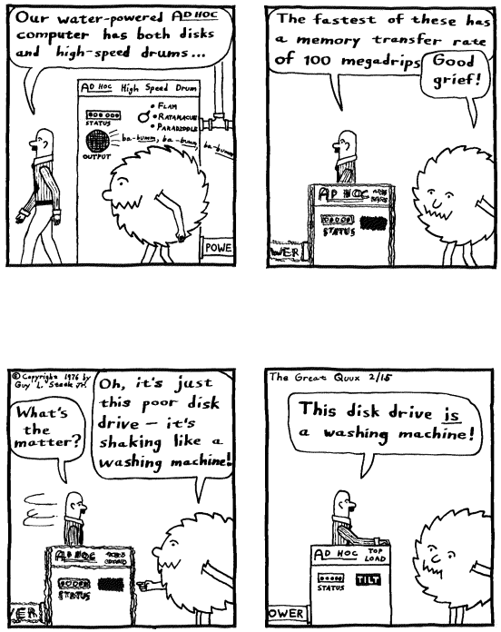
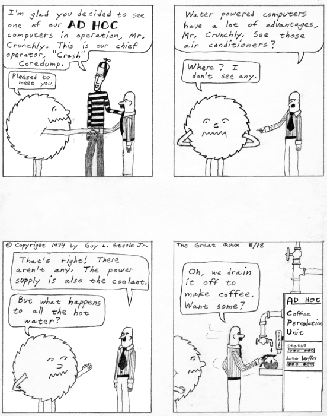
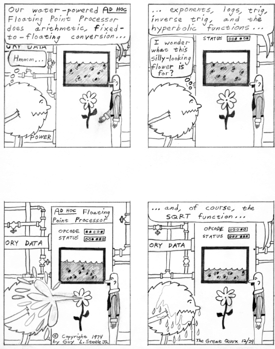

==
W
==

-ware
======

**-ware**: suff.

[from ‘software’] Commonly used to form jargon terms for classes of
software. For examples, see `annoyware <./A.html#annoyware>`__, `careware <./C.html#careware>`__, `crippleware <./C.html#crippleware>`__, `crudware <./C.html#crudware>`__, `freeware <./F.html#freeware>`__, `fritterware <./F.html#fritterware>`__, `guiltware <./G.html#guiltware>`__, `liveware <./L.html#liveware>`__, `meatware <./M.html#meatware>`__, `payware <./P.html#payware>`__, `psychedelicware <./P.html#psychedelicware>`__, `shareware <./S.html#shareware>`__, `shelfware <./S.html#shelfware>`__, `vaporware <./V.html#vaporware>`__, `wetware <#wetware>`__, `spyware <./S.html#spyware>`__, `adware <./A.html#adware>`__.

w00t
============

**w00t**

An interjection similar to “Yay!”, as in: “w00t!!! I just got a raise!”
Often used for small victories the speaker dies not expect to be of
special interest to anyone else. Some claim this is a bastardization of
“root”, the highest level of access to a system (particularly UNIX),
originated by script kiddies as a 133tspeak equivalent of “root”, and
said as an exclamation upon gaining root access. Others claim it
originated in the Everquest multiplayer game as an abbreviation of
“wonderful loot”. Still other claim it on originated on IRC as the “Ewok
victory cheer”] Adj. w00table has the sense of “cool” or “nifty”. This
is one of the few leet-speak coinages to have crossed over into
non-ironic use among hackers.

wabbit
============

**wabbit**: /wab´it/, n.

[almost certainly from Elmer Fudd's immortal line “You wascawwy
wabbit!”]

1. A legendary early hack reported on a System/360 at RPI and elsewhere
around 1978; this may have descended (if only by inspiration) from a
hack called RABBITS reported from 1969 on a Burroughs 5500 at the
University of Washington Computer Center. The program would make two
copies of itself every time it was run, eventually crashing the system.

2. By extension, any hack that includes infinite self-replication but is
not a `virus <./V.html#virus>`__ or `worm <#worm>`__. See
`fork bomb <./F.html#fork-bomb>`__ and `rabbit
job <./R.html#rabbit-job>`__, see also `cookie
monster <./C.html#cookie-monster>`__.

WAITS
=======

**WAITS**: /wayts/, n.

The mutant cousin of `TOPS-10 <./T.html#TOPS-10>`__ used on a handful
of systems at `SAIL <./S.html#SAIL>`__ up to 1990. There was never an
‘official’ expansion of WAITS (the name itself having been arrived at by
a rather sideways process), but it was frequently glossed as ‘West-coast
Alternative to ITS’. Though WAITS was less visible than ITS, there was
frequent exchange of people and ideas between the two communities, and
innovations pioneered at WAITS exerted enormous indirect influence. The
early screen modes of `EMACS <./E.html#EMACS>`__, for example, were
directly inspired by WAITS's ‘E’ editor — one of a family of editors
that were the first to do ‘real-time editing’, in which the editing
commands were invisible and where one typed text at the point of
insertion/overwriting. The modern style of multi-region windowing is
said to have originated there, and WAITS alumni at XEROX PARC and
elsewhere played major roles in the developments that led to the XEROX
Star, the Macintosh, and the Sun workstations. Also invented there were
`bucky bits <./B.html#bucky-bits>`__ — thus, the ALT key on every IBM
PC is a WAITS legacy. One WAITS feature very notable in pre-Web days was
a news-wire interface that allowed WAITS hackers to read, store, and
filter AP and UPI dispatches from their terminals; the system also
featured a still-unusual level of support for what is now called
multimedia computing, allowing analog audio and video signals to be
switched to programming terminals.

waldo
===========

**waldo**: /wol´doh/, n.

[From Robert A. Heinlein's story *Waldo*]

1. A mechanical agent, such as a gripper arm, controlled by a human
limb. When these were developed for the nuclear industry in the
mid-1940s they were named after the invention described by Heinlein in
the story, which he wrote in 1942. Now known by the more generic term
telefactoring, this technology is of intense interest to NASA for tasks
like space station maintenance.

2. At Harvard (particularly by Tom Cheatham and students), this is used
instead of `foobar <./F.html#foobar>`__ as a metasyntactic variable
and general nonsense word. See `foo <./F.html#foo>`__,
`bar <./B.html#bar>`__, `foobar <./F.html#foobar>`__,
`quux <./Q.html#quux>`__.

walk
=======

**walk**: n.,vt.

Traversal of a data structure, especially an array or linked-list data
structure in `core <./C.html#core>`__. See also
`codewalker <./C.html#codewalker>`__, `silly
walk <./S.html#silly-walk>`__, `clobber <./C.html#clobber>`__.

walking drives
==============

**walking drives**: n.

An occasional failure mode of magnetic-disk drives back in the days when
they were huge, clunky `washing machines <#washing-machine>`__ .
Those old `dinosaur <./D.html#dinosaur>`__ parts carried terrific
angular momentum; the combination of a misaligned spindle or worn
bearings and stick-slip interactions with the floor could cause them to
‘walk’ across a room, lurching alternate corners forward a couple of
millimeters at a time. There is a legend about a drive that walked over
to the only door to the computer room and jammed it shut; the staff had
to cut a hole in the wall in order to get at it! Walking could also be
induced by certain patterns of drive access (a fast seek across the
whole width of the disk, followed by a slow seek in the other
direction). Some bands of old-time hackers figured out how to induce
disk-accessing patterns that would do this to particular drive models
and held disk-drive races.

walk off the end of
====================

**walk off the end of**: vt.

To run past the end of an array, list, or medium after stepping through
it — a good way to land in trouble. Often the result of an `off-by-one
error <./O.html#off-by-one-error>`__. Compare
`clobber <./C.html#clobber>`__, `roach <./R.html#roach>`__,
`smash the stack <./S.html#smash-the-stack>`__.

wall follower
=================

**wall follower**: n.

A person or algorithm that compensates for lack of sophistication or
native stupidity by efficiently following some simple procedure shown to
have been effective in the past. Used of an algorithm, this is not
necessarily pejorative; it recalls ‘Harvey Wallbanger’, the winning
robot in an early AI contest (named, of course, after the cocktail).
Harvey successfully solved mazes by keeping a ‘finger’ on one wall and
running till it came out the other end. This was inelegant, but it was
mathematically guaranteed to work on simply-connected mazes — and, in
fact, Harvey outperformed more sophisticated robots that tried to
‘learn’ each maze by building an internal representation of it. Used of
humans, the term *is* pejorative and implies an uncreative,
bureaucratic, by-the-book mentality. See also `code
grinder <./C.html#code-grinder>`__; compare
`droid <./D.html#droid>`__.

wallhack
================

**wallhack**

A form of game cheat especially associated with first-person shooters
like Quake, in which the walls in the simulated maze or dungeon are
rendered transparent to the cheater. This gives the cheater normally
hidden information about the whereabouts of other players. Beyond
gaming, a wallhack is the paradigm case of a whole class of security
problems that stem from the fact that a server cannot trust client
software, and server authors must assume that all computation farmed out
to a client is exposed to and can be interfered with by the user.

wall
=======

**wall**: interj.

[WPI]

1. An indication of confusion, usually spoken with a quizzical tone:
“Wall??”

2. A request for further explication. Compare `octal
forty <./O.html#octal-forty>`__.

3. [Unix, from ‘write all’] v. To send a message to everyone currently
logged in, esp. with the wall(8) utility.

It is said that sense 1 came from the idiom ‘like talking to a blank
wall’. It was originally used in situations where, after you had
carefully answered a question, the questioner stared at you blankly,
clearly having understood nothing that was explained. You would then
throw out a “Hello, wall?” to elicit some sort of response from the
questioner. Later, confused questioners began voicing “Wall?”
themselves.

wall time
=============

**wall time**: n.

(also wall clock time)

1. ‘Real world’ time (what the clock on the wall shows), as opposed to
the system clock's idea of time.

2. The real running time of a program, as opposed to the number of
`ticks <./T.html#tick>`__ required to execute it (on a timesharing
system these always differ, as no one program gets all the ticks, and on
multiprocessor systems with good thread support one may get more
processor time than real time).

wall wart
==========

**wall wart**: n.

A small power-supply brick with integral male plug, designed to plug
directly into a wall outlet; called a ‘wart’ because when installed on a
power strip it tends to block up at least one more socket than it uses.
These are frequently associated with modems and other small electronic
devices which would become unacceptably bulky or hot if they had power
supplies on board (there are other reasons as well having to do with the
cost of UL certification).

wango
==========

**wango**: /wang´goh/, n.

Random bit-level `grovelling <./G.html#grovel>`__ going on in a
system during some unspecified operation. Often used in combination with
`mumble <./M.html#mumble>`__. For example: “You start with the ‘.o’
file, run it through this postprocessor that does mumble-wango — and it
comes out a snazzy object-oriented executable.”

wank
=======

**wank**: /wangk/, n.,v.,adj.

[Columbia University: prob.: by mutation from Commonwealth slang v.
wank, to masturbate] Used much as `hack <./H.html#hack>`__ is
elsewhere, as a noun denoting a clever technique or person or the result
of such cleverness. May describe (negatively) the act of hacking for
hacking's sake (“Quit wanking, let's go get supper!”) or (more
positively) a `wizard <#wizard>`__. Adj. wanky describes something
particularly clever (a person, program, or algorithm). Conversations can
also get wanky when there are too many wanks involved. This excess
wankiness is signalled by an overload of the wankometer (compare
`bogometer <./B.html#bogometer>`__). When the wankometer overloads,
the conversation's subject must be changed, or all non-wanks will leave.
Compare neep-neeping (under `neep-neep <./N.html#neep-neep>`__).
Usage: U.S. only. In Britain and the Commonwealth this word is
*extremely* rude and is best avoided unless one intends to give offense.
Adjectival wanky is less offensive and simply means ‘stupid’ or ‘broken’
(this is mainstream in Great Britain).

wannabee
============

**wannabee**: /won'@·bee/, n.

(also, more plausibly, spelled wannabe) [from a term recently used to
describe Madonna fans who dress, talk, and act like their idol; prob.:
originally from biker slang] A would-be `hacker <./H.html#hacker>`__.
The connotations of this term differ sharply depending on the age and
exposure of the subject. Used of a person who is in or might be entering
`larval stage <./L.html#larval-stage>`__, it is semi-approving; such
wannabees can be annoying but most hackers remember that they, too, were
once such creatures. When used of any professional programmer, CS
academic, writer, or `suit <./S.html#suit>`__, it is derogatory,
implying that said person is trying to cuddle up to the hacker mystique
but doesn't, fundamentally, have a prayer of understanding what it is
all about. Overuse of terms from this lexicon is often an indication of
the `wannabee <#wannabee>`__ nature. Compare
`newbie <./N.html#newbie>`__.

Historical note: The wannabee phenomenon has a slightly different flavor
now (1993) than it did ten or fifteen years ago. When the people who are
now hackerdom's tribal elders were in `larval
stage <./L.html#larval-stage>`__, the process of becoming a hacker was
largely unconscious and unaffected by models known in popular culture —
communities formed spontaneously around people who, *as individuals*,
felt irresistibly drawn to do hackerly things, and what wannabees
experienced was a fairly pure, skill-focused desire to become similarly
wizardly. Those days of innocence are gone forever; society's adaptation
to the advent of the microcomputer after 1980 included the elevation of
the hacker as a new kind of folk hero, and the result is that some
people semi-consciously set out to *be hackers* and borrow hackish
prestige by fitting the popular image of hackers. Fortunately, to do
this really well, one has to actually become a wizard. Nevertheless,
old-time hackers tend to share a poorly articulated disquiet about the
change; among other things, it gives them mixed feelings about the
effects of public compendia of lore like this one.

war-chalking
===============

**war-chalking**

[play on `war-driving <#war-driving>`__; the first syllable has
since been reinterpreted as an acronym for “wireless access revolution”]
The practice of using chalk marks similar to hobo signs to indicate the
nearby presence of a wireless Internet access point, a boon to strolling
hackers with laptops. The concept was first floated in early 2002 and
was instantly seized upon with cries of glee by hackers all over the
portions of the world urbanized enough to have sidewalks and access
points. The process rather recalls the explosive spread of heraldry in
the medieval Europe of the 1120s. There is a site that `explains the
symbology <http://www.warchalking.org/>`__;.

war dialer
=============

**war dialer**: n.

[originally from ‘wargames dialer’, a reference to the movie *War
Games*] A cracking tool, a program that calls a given list or range of
phone numbers and records those which answer with handshake tones (and
so might be entry points to computer or telecommunications systems).
Some of these programs have become quite sophisticated, and can now
detect modem, fax, or PBX tones and log each one separately. The war
dialer is one of the most important tools in the
`phreaker's <./P.html#phreaker>`__ kit. These programs evolved from
early `demon dialer <./D.html#demon-dialer>`__\ s.

war-driving
=============

**war-driving**

[play on `war dialer <#war-dialer>`__; also as single word
wardriving] Driving around looking for unsecured wireless Internet
access points to connect to. More at the `War Driving home
page <http://www.personaltelco.net/index.cgi/WarDriving>`__. Compare
`war-chalking <#war-chalking>`__.

warez d00dz
===============

**warez d00dz**: /weirz doodz/, n.

A substantial subculture of `crackers <./C.html#cracker>`__ refer
to themselves as warez d00dz; there is evidently some connection with
`B1FF <./B.html#B1FF>`__ here. As ‘Ozone Pilot’, one former warez
d00d, wrote:

    Warez d00dz get illegal copies of copyrighted software. If it has
    copy protection on it, they break the protection so the software can
    be copied. Then they distribute it around the world via several
    gateways. Warez d00dz form badass group names like RAZOR and the
    like. They put up boards that distribute the latest ware, or pirate
    program. The whole point of the Warez sub-culture is to get the
    pirate program released and distributed before any other group. I
    know, I know. But don't ask, and it won't hurt as much. This is how
    they prove their poweress [sic]. It gives them the right to say, “I
    released King's Quest IVXIX before you so obviously my testicles are
    larger.” Again don't ask...

The studly thing to do if one is a warez d00d, it appears, is emit 0-day
warez, that is copies of commercial software copied and cracked on the
same day as its retail release. Warez d00ds also hoard software in a big
way, collecting untold megabytes of arcade-style games, pornographic
JPGs, and applications they'll never use onto their hard disks. As Ozone
Pilot acutely observes:

    [BELONG] is the only word you will need to know. Warez d00dz want to
    belong. They have been shunned by everyone, and thus turn to
    cyberspace for acceptance. That is why they always start groups like
    TGW, FLT, USA and the like. Structure makes them happy. [...] Warez
    d00dz will never have a handle like “Pink Daisy” because warez d00dz
    are insecure. Only someone who is very secure with a good dose of
    self-esteem can stand up to the cries of fag and girlie-man. More
    likely you will find warez d00dz with handles like: Doctor Death,
    Deranged Lunatic, Hellraiser, Mad Prince, Dreamdevil, The Unknown,
    Renegade Chemist, Terminator, and Twin Turbo. They like to sound
    badass when they can hide behind their terminals. More likely, if
    you were given a sample of 100 people, the person whose handle is
    Hellraiser is the last person you'd associate with the name.

The contrast with Internet hackers is stark and instructive. See

`cracker <./C.html#cracker>`__, `wannabee <#wannabee>`__, `handle <./H.html#handle>`__, `elite <./E.html#elite>`__, `courier <./C.html#courier>`__, `leech <./L.html#leech>`__; compare `weenie <#weenie>`__, `spod <./S.html#spod>`__.

warez
==========

**warez**: /weirz/, n.

Widely used in `cracker <./C.html#cracker>`__ subcultures to denote
cracked version of commercial software, that is versions from which
copy-protection has been stripped. Hackers recognize this term but don't
use it themselves. See `warez d00dz <#warez-d00dz>`__,
`courier <./C.html#courier>`__, `leech <./L.html#leech>`__, `elite <./E.html#elite>`__.

warez kiddies
==============

**warez kiddies**: n.

Even more derogatory way of referring to `warez
d00dz <#warez-d00dz>`__; refers to the fact that most warez d00dz
are around the age of puberty. Compare `script
kiddies <./S.html#script-kiddies>`__.

warlording
================

**warlording**: v.

[from the Usenet group "alt.fan.warlord"] The act of excoriating a
bloated, ugly, or derivative `sig block <./S.html#sig-block>`__.
Common grounds for warlording include the presence of a signature
rendered in a `BUAF <./B.html#BUAF>`__, over-used or cliched `sig
quotes <./S.html#sig-quote>`__, ugly `ASCII
art <./A.html#ASCII-art>`__, or simply excessive size. The original
‘Warlord’ was a `B1FF <./B.html#B1FF>`__-like
`newbie <./N.html#newbie>`__ c.1991 who featured in his sig a
particularly large and obnoxious ASCII graphic resembling the sword of
Conan the Barbarian in the 1981 John Milius movie; the group name
"alt.fan.warlord" was sarcasm, and the characteristic mode of
warlording is devastatingly sarcastic praise. See also `McQuary
limit <./M.html#McQuary-limit>`__.

warm boot
=============

**warm boot**: n.

See `boot <./B.html#boot>`__.

wart
=========

**wart**: n.

A small, `crocky <./C.html#crock>`__ `feature <./F.html#feature>`__ that sticks out of an otherwise `clean <./C.html#clean>`__ design. Something conspicuous for
localized ugliness, especially a special-case exception to a general
rule. For example, in some versions of csh(1), single quotes literalize
every character inside them except "!". In ANSI C, the "??" syntax
used for obtaining ASCII characters in a foreign environment is a wart.
See also `miswart <./M.html#miswart>`__.

washing machine
================

**washing machine**: n.

1. Old-style 14-inch hard disks in floor-standing cabinets. So called
because of the size of the cabinet and the ‘top-loading’ access to the
media packs — and, of course, they were always set on ‘spin cycle’. The
washing-machine idiom transcends language barriers; it is even used in
Russian hacker jargon. See also `walking
drives <#walking-drives>`__. The thick channel cables connecting
these were called bit hoses (see `hose <./H.html#hose>`__, sense 3).

2. [CMU] A machine used exclusively for `washing
software <#washing-software>`__. CMU has clusters of these.

washing software
=================

**washing software**: n.

The process of recompiling a software distribution (used more often when
the recompilation is occuring from scratch) to pick up and merge
together all of the various changes that have been made to the source.

water MIPS
===========

**water MIPS**: n.

(see `MIPS <./M.html#MIPS>`__, sense 2) Large, water-cooled machines
of either today's ECL-supercomputer flavor or yesterday's traditional
`mainframe <./M.html#mainframe>`__ type.

A really unusual kind of `water MIPS <#water-MIPS>`__.

wave a dead chicken
=====================

**wave a dead chicken**: v.

To perform a ritual in the direction of crashed software or hardware
that one believes to be futile but is nevertheless necessary so that
others are satisfied that an appropriate degree of effort has been
expended. “I'll wave a dead chicken over the source code, but I really
think we've run into an OS bug.” Compare `voodoo
programming <./V.html#voodoo-programming>`__, `rain dance <./R.html#rain-dance>`__; see also `casting the runes <./C.html#casting-the-runes>`__.

weasel
============

**weasel**: n.

[Cambridge] A naive user, one who deliberately or accidentally does
things that are stupid or ill-advised. Roughly synonymous with
`loser <./L.html#loser>`__.

webify
===========

**webify**: n.

To put a piece of (possibly already existing) material on the WWW.
Frequently used for papers (“Why don't you webify all your
publications?”) or for demos (“They webified their 6.866 final
project”). This term seems to have been (rather logically) independently
invented multiple times in the early 1990s.

webmaster
==============

**webmaster**: n.

[WWW: from `postmaster <./P.html#postmaster>`__] The person at a site
providing World Wide Web information who is responsible for maintaining
the public pages and keeping the Web server running and properly
configured.

web pointer
=============

**web pointer**: n.

A World Wide Web `URL <./U.html#URL>`__. See also
`hotlink <./H.html#hotlink>`__, which has slightly different
connotations.

web ring
===========

**web ring**: n.

Two or more web sites connected by prominent links between sites sharing
a common interest or theme. Usually such cliques have the topology of a
ring, in order to make it easy for visitors to navigate through all of
them.

web toaster
=============

**web toaster**: n.

A small specialized computer, shipped with no monitor or keyboard or any
other external peripherals, pre-configured to be controlled through an
Ethernet port and function as a WWW server. Products of this kind (for
example the Cobalt Qube) are often about the size of a toaster. See
`toaster <./T.html#toaster>`__; compare `video
toaster <./V.html#video-toaster>`__.

wedged
============

**wedged**: adj.

1. To be stuck, incapable of proceeding without help. This is different
from having crashed. If the system has crashed, it has become totally
non-functioning. If the system is wedged, it is trying to do something
but cannot make progress; it may be capable of doing a few things, but
not be fully operational. For example, a process may become wedged if it
`deadlocks <./D.html#deadlock>`__ with another (but not all
instances of wedging are deadlocks). See also
`gronk <./G.html#gronk>`__, `locked up <./L.html#locked-up>`__,
`hosed <./H.html#hosed>`__, `hung <./H.html#hung>`__ (wedged is
more severe than `hung <./H.html#hung>`__).

2. Often refers to humans suffering misconceptions. “He's totally wedged
— he's convinced that he can levitate through meditation.”

3. [Unix] Specifically used to describe the state of a TTY left in a
losing state by abort of a screen-oriented program or one that has
messed with the line discipline in some obscure way.

There is some dispute over the origin of this term. It is usually
thought to derive from a common description of recto-cranial inversion;
however, it may actually have originated with older ‘hot-press’ printing
technology in which physical type elements were locked into type frames
with wedges driven in by mallets. Once this had been done, no changes in
the typesetting for that page could be made.

wedgie
===========

**wedgie**: n.

[Fairchild] A bug. Prob. related to `wedged <#wedged>`__.

wedgitude
==============

**wedgitude**: /wedj´i·t[y]ood/, n.

The quality or state of being `wedged <#wedged>`__.

weeble
======================

**weeble**: /weeb´l/, interj.

[Cambridge] Used to denote frustration, usually at amazing stupidity. “I
stuck the disk in upside down.” “Weeble....”.

weeds
==================
 

 

**weeds**: n.

1. Refers to development projects or algorithms that have no possible
relevance or practical application. Comes from ‘off in the weeds’. Used
in phrases like “lexical analysis for microcode is serious weeds....”

2. At CDC/ETA before its demise, the phrase go off in the weeds was
equivalent mainstream hackerdom's `jump off into never-never
land <./J.html#jump-off-into-never-never-land>`__.

weenie
=============

**weenie**: n.

1. [on BBSes] Any of a species of luser resembling a less amusing
version of `B1FF <./B.html#B1FF>`__ that infests many
`BBS <./B.html#BBS>`__ systems. The typical weenie is a teenage boy
with poor social skills travelling under a grandiose
`handle <./H.html#handle>`__ derived from fantasy or heavy-metal rock
lyrics. Among sysops, the weenie problem refers to the marginally
literate and profanity-laden `flamage <./F.html#flamage>`__ weenies
tend to spew all over a newly-discovered BBS. Compare
`spod <./S.html#spod>`__, `geek <./G.html#geek>`__, `terminal
junkie <./T.html#terminal-junkie>`__, `warez
d00dz <#warez-d00dz>`__.

2. [among hackers] When used with a qualifier (for example, as in `Unix
weenie <./U.html#Unix-weenie>`__, VMS weenie, IBM weenie) this can be
either an insult or a term of praise, depending on context, tone of
voice, and whether or not it is applied by a person who considers him or
herself to be the same sort of weenie. Implies that the weenie has put a
major investment of time, effort, and concentration into the area
indicated; whether this is good or bad depends on the hearer's judgment
of how the speaker feels about that area. See also
`bigot <./B.html#bigot>`__.

3. The semicolon character, ";" (ASCII 0111011).

Weenix
===========

**Weenix**: /wee´niks/, n.

1. [ITS] A derogatory term for `Unix <./U.html#Unix>`__, derived from
`Unix weenie <./U.html#Unix-weenie>`__. According to one noted
ex-ITSer, it is “the operating system preferred by Unix Weenies:
typified by poor modularity, poor reliability, hard file deletion, no
file version numbers, case sensitivity everywhere, and users who believe
that these are all advantages”. (Some ITS fans behave as though they
believe Unix stole a future that rightfully belonged to them. See
`ITS <./I.html#ITS>`__, sense 2.)

2. [Brown University] A Unix-like OS developed for tutorial purposes at
Brown University. See
`http://www.cs.brown.edu/courses/cs167/weenix.html <http://www.cs.brown.edu/courses/cs167/weenix>`__.
Named independently of the ITS usage.

well-behaved
==================

 

**well-behaved**: adj.

1. Software that does its job quietly and without counterintuitive
effects. Esp.: said of software having an interface spec sufficiently
simple and well-defined that it can be used as a
`tool <./T.html#tool>`__ by other software. See
`cat <./C.html#cat>`__.

2. Said of an algorithm that doesn't `crash <./C.html#crash>`__ or
`blow up <./B.html#blow-up>`__, even when given
`pathological <./P.html#pathological>`__ input. Implies that the
stability of the algorithm is intrinsic, which makes this somewhat
different from `bulletproof <./B.html#bulletproof>`__.

 

well-connected
====================

**well-connected**: adj.

Said of a computer installation, asserts that it has reliable email
links with the network and/or that it relays a large fraction of
available `Usenet <./U.html#Usenet>`__ newsgroups. Well-known can be
almost synonymous, but also implies that the site's name is familiar to
many (due perhaps to an archive service or active Usenet users).

 

 
wetware
==============

**wetware**: /wet´weir/, n.

[prob.: from the novels of Rudy Rucker]

1. The human nervous system, as opposed to computer hardware or
software. “Wetware has 7 plus or minus 2 temporary registers.”

2. Human beings (programmers, operators, administrators) attached to a
computer system, as opposed to the system's hardware or software. See
`liveware <./L.html#liveware>`__,
`meatware <./M.html#meatware>`__.

 

+  -------+  + ------------+
| `Prev <#well-connected>`__    | `Up <../W>`__         |  `Next <#whack>`__   |
+  -------+  + ------------+
| well-connected                    | `Home <../index>`__   |  whack                   |
+  -------+  + ------------+

whack-a-mole
=============================
 
 

**whack-a-mole**: n.

[from the carnival game which involves quickly and repeatedly hitting
the heads of mechanical moles with a mallet as they pop up from their
holes.]

1. The practice of repeatedly causing spammers' `throwaway
account <./T.html#throwaway-account>`__\ s and drop boxes to be
terminated.

2. After sense 1 became established in the mid-1990s the term passed
into more generalized use, and now is commonly found in such
combinations as whack-a-mole windows; the obnoxious pop-up advertisement
windows spawned in flocks when you surf to sites like Angelfire or
Lycos.

 
whacker
=================
 

 

**whacker**: n.

[University of Maryland: from `hacker <./H.html#hacker>`__]

1. A person, similar to a `hacker <./H.html#hacker>`__, who enjoys
exploring the details of programmable systems and how to stretch their
capabilities. Whereas a hacker tends to produce great hacks, a whacker
only ends up whacking the system or program in question. Whackers are
often quite egotistical and eager to claim `wizard <#wizard>`__
status, regardless of the views of their peers.

2. A person who is good at programming quickly, though rather poorly and
ineptly.

whack

**whack**: v.

According to arch-hacker James Gosling (designer of
`NeWS <./N.html#NeWS>`__, `GOSMACS <./G.html#GOSMACS>`__ and
Java), to “...modify a program with no idea whatsoever how it works.”
(See `whacker <#whacker>`__.) It is actually possible to do this
in nontrivial circumstances if the change is small and well-defined and
you are very good at `glarking <./G.html#glark>`__\ ing things from
context. As a trivial example, it is relatively easy to change all
**stderr** writes to **stdout** writes in a piece of C filter code which
remains otherwise mysterious.

whales
=========

**whales**: n.

See `like kicking dead whales down the
beach <./L.html#like-kicking-dead-whales-down-the-beach>`__.

What's a spline?
====================

**What's a spline?**

[XEROX PARC] This phrase expands to: “You have just used a term that
I've heard for a year and a half, and I feel I should know, but don't.
My curiosity has finally overcome my guilt.” The PARC lexicon adds
“Moral: don't hesitate to ask questions, even if they seem obvious.”

wheel bit
=============

**wheel bit**: n.

A privilege bit that allows the possessor to perform some restricted
operation on a timesharing system, such as read or write any file on the
system regardless of protections, change or look at any address in the
running monitor, crash or reload the system, and kill or create jobs and
user accounts. The term was invented on the TENEX operating system, and
carried over to TOPS-20, XEROX-IFS, and others. The state of being in a
privileged logon is sometimes called wheel mode. This term entered the
Unix culture from TWENEX in the mid-1980s and has been gaining
popularity there (esp. at university sites). See also
`root <./R.html#root>`__.

wheel
===========

`Prev <Whats-a-spline>`__ 

W

 `Next <#wheel-bit>`__

 

**wheel**: n.

[from slang ‘big wheel’ for a powerful person] A person who has an
active `wheel bit <#wheel-bit>`__. “We need to find a wheel to
unwedge the hung tape drives.” (See `wedged <#wedged>`__, sense
1.) The traditional name of security group zero in
`BSD <./B.html#BSD>`__ (to which the major system-internal users like
`root <./R.html#root>`__ belong) is ‘wheel’. Some vendors have
expanded on this usage, modifying Unix so that only members of group
‘wheel’ can `go root <./G.html#go-root>`__.

wheel of reincarnation
========================

**wheel of reincarnation**

[coined in a paper by T.H. Myer and I.E. Sutherland *On the Design of
Display Processors*, Comm. ACM, Vol. 11, no. 6, June 1968)] Term used to
refer to a well-known effect whereby function in a computing system
family is migrated out to special-purpose peripheral hardware for speed,
then the peripheral evolves toward more computing power as it does its
job, then somebody notices that it is inefficient to support two
asymmetrical processors in the architecture and folds the function back
into the main CPU, at which point the cycle begins again.

Several iterations of this cycle have been observed in
graphics-processor design, and at least one or two in communications and
floating-point processors. Also known as the Wheel of Life, the Wheel of
Samsara, and other variations of the basic Hindu/Buddhist theological
idea. See also `blitter <./B.html#blitter>`__.

wheel wars
==============

**wheel wars**: n.

[Stanford University] A period in `larval
stage <./L.html#larval-stage>`__ during which student hackers hassle
each other by attempting to log each other out of the system, delete
each other's files, and otherwise wreak havoc, usually at the expense of
the lesser users.

white hat
===============

**white hat**

See `black hat <./B.html#black-hat>`__.

whitelist
===========

**whitelist**: n.

The opposite of a blacklist. That is, instead of being an explicit list
of people who are banned, it's an explicit list of people who are to be
admitted. Hackers use this especially of lists of email addresses that
are explicitly enabled to get past strict anti-spam filters.

whizzy
=========

**whizzy**: adj.

(alt.: wizzy) [Sun] Describes a `cuspy <./C.html#cuspy>`__ program;
one that is feature-rich and well presented.

Whorfian mind-lock
=====================

**Whorfian mind-lock**

[from the Lojban-language list] Software designs are often restricted in
unavoidable ways by the capacities of the operating system or hardware
they have to work with. Sometimes they are restricted in avoidable ways
by mental habits a developer has picked up from a particular language or
environment (perhaps a now-obsolete one) and never discarded. When a
design develops complications that are the result of a mental habit that
is no longer adaptive, the developer has succumbed to Whorfian
mind-lock. The design itself has been ‘whorfed’.

For example, some Unix designs are whorfed by the assumption that
directory searches are linear and expensive for large directories;
therefore directories must be kept small. Another common way to succumb
to Whorfian mind-lock is to do serial processing with a small working
set rather than slurping an entire file or data structure into memory;
the hidden assumption here is that not much core is available and
virtual memory works poorly if at all. Detecting Whorfian mind-lock is
important, because it tends to introduce unnecessary complexity and
bugs.

wibble
=============

**wibble**

[UK, perh. originally from the first *Roger Irrelevant* strip in *VIZ*
comics, spread via *Your Sinclair magazine in the 1980s and early
1990s*]

1. n.,v. Commonly used to describe chatter, content-free remarks or
other essentially meaningless contributions to threads in newsgroups.
“Oh, rspence is wibbling again”.

2. [UK IRC] An explicit on-line no-op.

3. One of the preferred `metasyntactic
variables <./M.html#metasyntactic-variable>`__ in the UK, forming a
series with **wobble**, **wubble**, and **flob** (attributed to the
hilarious historical comedy *Blackadder*).

4. A pronunciation of the letters “www”, as seen in URLs; i.e.,
www.`foo.com <./F.html#foo>`__ may be pronounced “wibble dot foo
dot com” (compare `dub dub dub <./D.html#dub-dub-dub>`__).

WIBNI
===========

**WIBNI**: //, n.

[Bell Labs: Wouldn't It Be Nice If] What most requirements documents and
specifications consist entirely of. Compare
`IWBNI <./I.html#IWBNI>`__.

widget
=========

**widget**: n.

1. A meta-thing. Used to stand for a real object in didactic examples
(especially database tutorials). Legend has it that the original widgets
were holders for buggy whips. “But suppose the parts list for a widget
has 52 entries....”

2. [poss.: evoking ‘window gadget’] A user interface object in
`X <./X.html#X>`__ graphical user interfaces.

wiggles
================

**wiggles**: n.

[scientific computation] In solving partial differential equations by
finite difference and similar methods, wiggles are sawtooth
(up-down-up-down) oscillations at the shortest wavelength representable
on the grid. If an algorithm is unstable, this is often the most
unstable waveform, so it grows to dominate the solution. Alternatively,
stable (though inaccurate) wiggles can be generated near a discontinuity
by a Gibbs phenomenon.

wild side
===========

**wild side**

The public or uncontrolled side of a `firewall
machine <./F.html#firewall-machine>`__.

WIMP environment
======================

**WIMP environment**: n.

[acronym: ‘Window, Icon, Menu, Pointing device (or Pull-down menu)’] A
graphical-user-interface environment such as `X <./X.html#X>`__ or
the Macintosh interface, esp. as described by a hacker who prefers
command-line interfaces for their superior flexibility and
extensibility. However, it is also used without negative connotations;
one must pay attention to voice tone and other signals to interpret
correctly. See `menuitis <./M.html#menuitis>`__,
`user-obsequious <./U.html#user-obsequious>`__.

win big
========

**win big**: vi.

To experience serendipity. “I went shopping and won big; there was a
2-for-1 sale.” See `big win <./B.html#big-win>`__.

Winchester
==============

**Winchester**: n.

Informal generic term for sealed-enclosure magnetic-disk drives in which
the read-write head planes over the disk surface on an air cushion.
There is a legend that the name arose because the original 1973
engineering prototype for what later became the IBM 3340 featured two
30-megabyte volumes; 30--30 became ‘Winchester’ when somebody noticed
the similarity to the common term for a famous Winchester rifle (in the
latter, the first 30 referred to caliber and the second to the grain
weight of the charge). (It is sometimes incorrectly claimed that
Winchester was the laboratory in which the technology was developed.)

windoid
=============

**windoid**: n.

In the Macintosh world, a style of window with much less adornment
(smaller or missing title bar, zoom box, etc.) than a standard window.

window shopping
=====================================

**window shopping**: n.

[US Geological Survey] Among users of `WIMP
environments <WIMP-environment>`__ like `X <./X.html#X>`__ or
the Macintosh, extended experimentation with new window colors, fonts,
and icon shapes. This activity can take up hours of what might otherwise
have been productive working time. “I spent the afternoon window
shopping until I found the coolest shade of green for my active window
borders — now they perfectly match my medium slate blue background.”
Serious window shoppers will spend their days with bitmap editors,
creating new and different icons and background patterns for all to see.
Also: window dressing, the act of applying new fonts, colors, etc. See
`fritterware <./F.html#fritterware>`__, compare
`macdink <./M.html#macdink>`__.

Windowsitis
================

**Windowsitis**

1. As a disease of people: the tendency of inexperienced (or
Windows-experienced) Web developers have to use backslashes in URLs,
rather than the correct forward slashes.

2. As a disease of programs: to be a rigid, clunky, bug-prone
monstrosity, all glossy surface with a hollow interior.

Windoze
=========

**Windoze**: /win´dohz/, n.

See `Microsloth Windows <./M.html#Microsloth-Windows>`__. (Also
Losedoze.)

winged comments
==================

**winged comments**: n.

Comments set on the same line as code, as opposed to `boxed
comments <./B.html#boxed-comments>`__. In C, for example::
 
  d = sqrt(x\*x + y\*y);  /\* distance from origin \*/

Generally these refer only to the action(s) taken on that line.

win
========

**win**

[MIT; now common everywhere]

1. vi. To succeed. A program wins if no unexpected conditions arise, or
(especially) if it is sufficiently `robust <./R.html#robust>`__ to
take exceptions in stride.

2. n. Success, or a specific instance thereof. A pleasing outcome. “So
it turned out I could use a `lexer <./L.html#lexer>`__ generator
instead of hand-coding my own pattern recognizer. What a win!” Emphatic
forms: moby win, super win, hyper-win (often used interjectively as a
reply). For some reason suitable win is also common at MIT, usually in
reference to a satisfactory solution to a problem. Oppose
`lose <./L.html#lose>`__; see also `big win <./B.html#big-win>`__,
which isn't quite just an intensification of win.

winkey
===========

**winkey**: n.

(alt.: winkey face) See `emoticon <./E.html#emoticon>`__.

winnage
==============

**winnage**: /win'@j/, n.

The situation when a lossage is corrected, or when something is winning.

winner
=============

**winner**

1. n. An unexpectedly good situation, program, programmer, or person.

2. real winner: Often sarcastic, but also used as high praise (see also
the note under `user <./U.html#user>`__). “He's a real winner — never
reports a bug till he can duplicate it and send in an example.”

winnitude
============

**winnitude**: /win'@·t[y]ood/, n.

The quality of winning (as opposed to `winnage <#winnage>`__,
which is the result of winning). “Guess what? They tweaked the microcode
and now the LISP interpreter runs twice as fast as it used to.” “That's
really great! Boy, what winnitude!” “Yup. I'll probably get a
half-hour's winnage on the next run of my program.” Perhaps curiously,
the obvious antonym ‘lossitude’ is rare.

Wintel
=========

**Wintel**: n.

Microsoft Windows plus Intel — the tacit alliance that dominated desktop
computing in the 1990s. After 1999 it began to break up under pressure
from `Linux <./L.html#Linux>`__; see `Lintel <./L.html#Lintel>`__.

Wintendo
===========

**Wintendo**: /win·ten´doh/, n.

[Play on “Nintendo”] A PC running the Windows operating system kept
primarily for the purpose of viewing multimedia and playing games. The
implication is that the speaker uses a Linux or \*BSD box for everything
else.

win win

**win win**: excl.

Expresses pleasure at a `win <#win>`__.

wired
===============

**wired**: n.

See `hardwired <./H.html#hardwired>`__.

wirehead
==============

**wirehead**: /wi:r´hed/, n.

[prob.: from SF slang for an electrical-brain-stimulation addict]

1. A hardware hacker, especially one who concentrates on communications
hardware.

2. An expert in local-area networks. A wirehead can be a network
software wizard too, but will always have the ability to deal with
network hardware, down to the smallest component. Wireheads are known
for their ability to lash up an Ethernet terminator from spare
resistors, for example.

wirewater
===========

**wirewater**: n.

Syn. `programming fluid <./P.html#programming-fluid>`__. This melds
the mainstream slang adjective ‘wired’ (stimulated, up, hyperactive)
with ‘firewater’; however, it refers to caffeinacious rather than
alcoholic beverages.

wish list
=============

**wish list**: n.

A list of desired features or bug fixes that probably won't get done for
a long time, usually because the person responsible for the code is too
busy or can't think of a clean way to do it. “OK, I'll add automatic
filename completion to the wish list for the new interface.” Compare
`tick-list features <./T.html#tick-list-features>`__.

within delta of
=================

**within delta of**: adj.

See `delta <./D.html#delta>`__.

within epsilon of
=====================

**within epsilon of**: adj.

See `epsilon <./E.html#epsilon>`__.

Wizard Book
============

**Wizard Book**: n.

*Structure and Interpretation of Computer Programs* (Hal Abelson, Jerry
Sussman and Julie Sussman; MIT Press, 1984, 1996; ISBN 0-262-01153-0),
an excellent computer science text used in introductory courses at MIT.
So called because of the wizard on the jacket. One of the
`bibles <./B.html#bible>`__ of the LISP/Scheme world. Also, less
commonly, known as the `Purple Book <./P.html#Purple-Book>`__. Now
available on the `http://mitpress.mit.edu/sicp/ <http://mitpress.mit.edu/sicp/>`__

wizard hat
==============

**wizard hat**: n.

[also, after Terry Pratchett, pointy hat] Notional headgear worn by
whoever is the `wizard <#wizard>`__ in a particular context. The
implication is that it's a transferable role. “Talk to Alice, she's
wearing the TCP/IP wizard hat while Bob is on vacation.” This metaphor
is sufficiently live that one may actually see hackers miming the act of
putting on, taking off, or transferring a phantom hat. See also `pointy
hat <./P.html#pointy-hat>`__, compare `patch
pumpkin <./P.html#patch-pumpkin>`__.

wizard
============

**wizard**: n.

1. Transitively, a person who knows how a complex piece of software or
hardware works (that is, who `groks <./G.html#grok>`__ it); esp.
someone who can find and fix bugs quickly in an emergency. Someone is a
`hacker <./H.html#hacker>`__ if he or she has general hacking
ability, but is a wizard with respect to something only if he or she has
specific detailed knowledge of that thing. A good hacker could become a
wizard for something given the time to study it.

2. The term ‘wizard’ is also used intransitively of someone who has
extremely high-level hacking or problem-solving ability.

3. A person who is permitted to do things forbidden to ordinary people;
one who has `wheel <#wheel>`__ privileges on a system.

4. A Unix expert, esp. a Unix systems programmer. This usage is well
enough established that ‘Unix Wizard’ is a recognized job title at some
corporations and to most headhunters.

See `guru <./G.html#guru>`__, `lord high fixer <./L.html#lord-high-fixer>`__. See also `deep
magic <./D.html#deep-magic>`__, `heavy
wizardry <./H.html#heavy-wizardry>`__,
`incantation <./I.html#incantation>`__,
`magic <./M.html#magic>`__, `mutter <./M.html#mutter>`__, `rain
dance <./R.html#rain-dance>`__, `voodoo
programming <./V.html#voodoo-programming>`__, `wave a dead
chicken <#wave-a-dead-chicken>`__.

wizardly
============

**wizardly**: adj.

Pertaining to wizards. A wizardly `feature <./F.html#feature>`__ is
one that only a wizard could understand or use properly.

wizard mode
==============

**wizard mode**: n.

[from `rogue <./R.html#rogue>`__] A special access mode of a program
or system, usually passworded, that permits some users godlike
privileges. Generally not used for operating systems themselves (root
mode or wheel mode would be used instead). This term is often used with
respect to games that have editable state.

wok-on-the-wall
==================

 

**wok-on-the-wall**: n.

A small microwave dish antenna used for cross-campus private network
circuits, from the obvious resemblance between a microwave dish and the
Chinese culinary utensil.

WOMBAT
========

**WOMBAT**: /wom´bat/, adj.

[acronym: Waste Of Money, Brains, And Time] Applied to problems which
are both profoundly `uninteresting <./U.html#uninteresting>`__ in
themselves and unlikely to benefit anyone interesting even if solved.
Often used in fanciful constructions such as wrestling with a wombat.
See also `crawling horror <./C.html#crawling-horror>`__,
`SMOP <./S.html#SMOP>`__. Also note the rather different usage as a
metasyntactic variable in `Commonwealth
Hackish <./C.html#Commonwealth-Hackish>`__.

Users of the `PDP-11 <./P.html#PDP-11>`__ database program DATATRIEVE
adopted the wombat as their notional mascot; the program's help file
responded to “HELP WOMBAT” with factual information about Real World
wombats.

womb box
==================

**womb box**: n.

1. [TMRC] Storage space for equipment.

2. [proposed] A variety of hard-shell equipment case with heavy interior
padding and/or shaped carrier cutouts in a foam-rubber matrix; mundanely
called a flight case. Used for delicate test equipment, electronics, and
musical instruments.

womble
=========

**womble**: n.

[Unisys UK: from British puppet-show characters] A user who has great
difficulty in communicating their requirements and/or in using the
resulting software. Extreme case of `luser <./L.html#luser>`__. An
especially senior or high-ranking womble is referred to as Great-Uncle
Bulgaria. Compare `Aunt Tillie <./A.html#Aunt-Tillie>`__.

wonky
===========

**wonky**: /wong´kee/, adj.

[from Australian slang] Yet another approximate synonym for
`broken <./B.html#broken>`__. Specifically connotes a malfunction
that produces behavior seen as crazy, humorous, or amusingly perverse.
“That was the day the printer's font logic went wonky and everybody's
listings came out in Tengwar.” Also in wonked out. See
`funky <./F.html#funky>`__, `demented <./D.html#demented>`__,
`bozotic <./B.html#bozotic>`__.

workaround
===============

**workaround**: n.

1. A temporary `kluge <./K.html#kluge>`__ used to bypass, mask, or
otherwise avoid a `bug <./B.html#bug>`__ or
`misfeature <./M.html#misfeature>`__ in some system. Theoretically,
workarounds are always replaced by `fix <./F.html#fix>`__\ es; in
practice, customers often find themselves living with workarounds for
long periods of time. “The code died on NUL characters in the input, so
I fixed it to interpret them as spaces.” “That's not a fix, that's a
workaround!”

2. A procedure to be employed by the user in order to do what some
currently non-working feature should do. Hypothetical example: “Using
META-F7 `crash <./C.html#crash>`__\ es the 4.43 build of Weemax, but
as a workaround you can type CTRL-R, then SHIFT-F5, and delete the
remaining `cruft <./C.html#cruft>`__ by hand.”

working as designed
==========================
 
 

**working as designed**: adj.

[IBM]

1. In conformance to a wrong or inappropriate specification; useful, but
misdesigned.

2. Frequently used as a sardonic comment on a program's utility.

3. Unfortunately also used as a bogus reason for not accepting a
criticism or suggestion. At `IBM <./I.html#IBM>`__, this sense is
used in official documents! See `BAD <./B.html#BAD>`__.
 
wormhole
==================

 

**wormhole**: /werm´hohl/, n.

[from the wormhole singularities hypothesized in some versions of
General Relativity theory]

1. [n.,obs.] A location in a monitor which contains the address of a
routine, with the specific intent of making it easy to substitute a
different routine. This term is now obsolescent; modern operating
systems use clusters of wormholes extensively (for modularization of I/O
handling in particular, as in the Unix device-driver organization) but
the preferred techspeak for these clusters is ‘device tables’, ‘jump
tables’ or ‘capability tables’.

2. [Amateur Packet Radio] A network path using a commercial satellite
link to join two or more amateur VHF networks. So called because traffic
routed through a wormhole leaves and re-enters the amateur network over
great distances with usually little clue in the message routing header
as to how it got from one relay to the other. Compare `gopher
hole <./G.html#gopher-hole>`__ (sense 2).

 
worm
=============

 
**worm**: n.

[from tapeworm in John Brunner's novel *The Shockwave Rider*, via XEROX
PARC] A program that propagates itself over a network, reproducing
itself as it goes. Compare `virus <./V.html#virus>`__. Nowadays the
term has negative connotations, as it is assumed that only
`cracker <./C.html#cracker>`__\ s write worms. Perhaps the best-known
example was Robert T. Morris's `Great Worm <./G.html#Great-Worm>`__
of 1988, a ‘benign’ one that got out of control and hogged hundreds of
Suns and VAXen across the U.S. See also
`cracker <./C.html#cracker>`__, `RTM <./R.html#RTM>`__, `Trojan
horse <./T.html#Trojan-horse>`__, `ice <./I.html#ice>`__.

 
 
wound around the axle
========================

 

**wound around the axle**: adj.

In an infinite loop. Often used by older computer types.

 

 

wrap around
================

 

**wrap around**: vi.

(also n. wraparound and v. shorthand wrap)

1. [techspeak] The action of a counter that starts over at zero or at
minus infinity (see `infinity <./I.html#infinity>`__) after its
maximum value has been reached, and continues incrementing, either
because it is programmed to do so or because of an overflow (as when a
car's odometer starts over at 0).

2. To change `phase <./P.html#phase>`__ gradually and continuously by
maintaining a steady wake-sleep cycle somewhat longer than 24 hours,
e.g., living six long (28-hour) days in a week (or, equivalently,
sleeping at the rate of 10 microhertz). This sense is also called
`phase-wrapping <./P.html#phase-wrapping>`__.

 
 
write-only code
==================

 
 

**write-only code**: n.

[a play on read-only memory] Code so arcane, complex, or ill-structured
that it cannot be modified or even comprehended by anyone but its
author, and possibly not even by him/her. A `Bad
Thing <./B.html#Bad-Thing>`__.
 

write-only language
=======================
 
 

**write-only language**: n.

A language with syntax (or semantics) sufficiently dense and bizarre
that any routine of significant size is automatically `write-only
code <#write-only-code>`__. A sobriquet applied occasionally to C
and often to APL, though `INTERCAL <./I.html#INTERCAL>`__ and
`TECO <./T.html#TECO>`__ certainly deserve it more. See also
`Befunge <./B.html#Befunge>`__.

write-only memory
==================

**write-only memory**: n.

The obvious antonym to read-only memory. Out of frustration with the
long and seemingly useless chain of approvals required of component
specifications, during which no actual checking seemed to occur, an
engineer at Signetics once created a specification for a write-only
memory and included it with a bunch of other specifications to be
approved. This inclusion came to the attention of Signetics
`management <./M.html#management>`__ only when regular customers
started calling and asking for pricing information. Signetics published
a corrected edition of the data book and requested the return of the
‘erroneous’ ones. Later, in 1972, Signetics bought a double-page spread
in *Electronics* magazine's April issue and used the spec as an April
Fools' Day joke. Instead of the more conventional characteristic curves,
the 25120 “fully encoded, 9046 x N, Random Access, write-only-memory”
data sheet included diagrams of “bit capacity vs.: Temp.”, “Iff vs.
Vff”, “Number of pins remaining vs.: number of socket insertions”, and
“AQL vs.: selling price”. The 25120 required a 6.3 VAC VFF supply, a
+10V VCC, and VDD of 0V, "±2%".

Wrong Thing
===============

**Wrong Thing**: n.

A design, action, or decision that is clearly incorrect or
inappropriate. Often capitalized; always emphasized in speech as if
capitalized. The opposite of the `Right Thing <./R.html#Right-Thing>`__; more generally, anything that is not the Right Thing. In cases where ‘the good is the enemy of the best’, the
merely good — although good — is nevertheless the Wrong Thing. “In C,
the default is for module-level declarations to be visible everywhere,
rather than just within the module. This is clearly the Wrong Thing.”

wugga wugga
=================
 
 

**wugga wugga**: /wuh´g@ wuh´g@/, n.

Imaginary sound that a computer program makes as it labors with a
tedious or difficult task.\ `grind <./G.html#grind>`__ (sense 4).

wumpus
=================
 
 

**wumpus**: /wuhm´p@s/, n.

The central monster (and, in many versions, the name) of a famous family
of very early computer games called *Hunt The Wumpus*. The original was
invented in 1970 (several years before `ADVENT <./A.html#ADVENT>`__)
by Gregory Yob. The wumpus lived somewhere in a cave with the topology
of an dodecahedron's edge/vertex graph (later versions supported other
topologies, including an icosahedron and Möbius strip). The player
started somewhere at random in the cave with five ‘crooked arrows’;
these could be shot through up to three connected rooms, and would kill
the wumpus on a hit (later versions introduced the wounded wumpus, which
got very angry). Unfortunately for players, the movement necessary to
map the maze was made hazardous not merely by the wumpus (which would
eat you if you stepped on him) but also by bottomless pits and colonies
of super bats that would pick you up and drop you at a random location
(later versions added ‘anaerobic termites’ that ate arrows, bat
migrations, and earthquakes that randomly changed pit locations).

This game appears to have been the first to use a non-random
graph-structured map (as opposed to a rectangular grid like the even
older Star Trek games). In this respect, as in the dungeon-like setting
and its terse, amusing messages, it prefigured
`ADVENT <./A.html#ADVENT>`__ and `Zork <./Z.html#Zork>`__ and was
directly ancestral to the latter (Zork acknowledged this heritage by
including a super-bat colony). A C emulation of the original Basic game
is available at the Retrocomputing Museum,
`http://www.catb.org/retro/ <http://www.catb.org/retro/>`__.

WYSIAYG
========
 

Describes a user interface under which “What You See Is *All* You Get”;
an unhappy variant of `WYSIWYG <#WYSIWYG>`__. Visual,
‘point-and-shoot’-style interfaces tend to have easy initial learning
curves, but also to lack depth; they often frustrate advanced users who
would be better served by a command-style interface. When this happens,
the frustrated user has a WYSIAYG problem. This term is most often used
of editors, word processors, and document formatting programs. WYSIWYG
‘desktop publishing’ programs, for example, are a clear win for creating
small documents with lots of fonts and graphics in them, especially
things like newsletters and presentation slides. When typesetting
book-length manuscripts, on the other hand, scale changes the nature of
the task; one quickly runs into WYSIAYG limitations, and the increased
power and flexibility of a command-driven formatter like
`TeX <./T.html#TeX>`__ or Unix's `troff <./T.html#troff>`__
becomes not just desirable but a necessity. Compare
`YAFIYGI <./Y.html#YAFIYGI>`__.

WYSIWYG
=============

**WYSIWYG**: /wiz´ee·wig/, /wiss´ee·wig/, adj.

[Traced to Flip Wilson's “Geraldine” character c.1970] Describes a user
interface under which “What You See Is What You Get”, as opposed to one
that uses more-or-less obscure commands that do not result in immediate
visual feedback. True WYSIWYG in environments supporting multiple fonts
or graphics is a rarely-attained ideal; there are variants of this term
to express real-world manifestations including WYSIAWYG (What You See Is
*Almost* What You Get) and WYSIMOLWYG (What You See Is More or Less What
You Get). All these can be mildly derogatory, as they are often used to
refer to dumbed-down `user-friendly <./U.html#user-friendly>`__
interfaces targeted at non-programmers; a hacker has no fear of obscure
commands (compare `WYSIAYG <#WYSIAYG>`__). On the other hand,
`EMACS <./E.html#EMACS>`__ was one of the very first WYSIWYG editors,
replacing (actually, at first overlaying) the extremely obscure,
command-based `TECO <./T.html#TECO>`__. See also `WIMP
environment <#WIMP-environment>`__. [Oddly enough, WYSIWYG made it
into the 1986 supplement to the OED, in lower case yet. —ESR]

